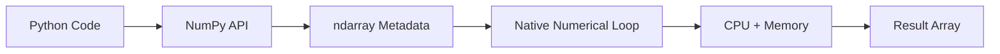
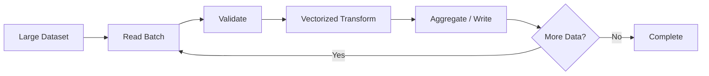
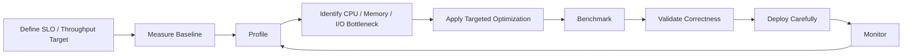

# 01- NumPy Performance

## Overview

NumPy performance is primarily about understanding how numerical work moves through:

```text
Python code
→ ndarray operations
→ memory access
→ CPU execution
→ temporary allocations
→ storage / I/O
```

NumPy is effective for numerical workloads because arrays store homogeneous values in a compact memory representation and many operations execute in optimized native code rather than repeatedly executing Python bytecode for every element.

That does not mean every NumPy expression is automatically efficient.

Production performance depends on:

- Python loop overhead.
- Vectorization.
- Broadcasting.
- Dtype size.
- Contiguous and non-contiguous memory.
- Views versus copies.
- Temporary arrays.
- Allocation frequency.
- Batch size.
- Memory bandwidth.
- CPU characteristics.
- Storage and I/O.
- Algorithmic complexity.

The engineering objective is therefore not simply to "use NumPy", but to choose an execution and memory model appropriate for the workload.

## How NumPy Executes Numerical Work

A simplified model is:



For an expression such as:

```python
result = values * 1.15
```

Python primarily coordinates the operation.

NumPy then operates over the underlying array buffer using a native implementation.

This avoids the repeated Python-level operations that a loop such as:

```python
result = [
    value * 1.15
    for value in values
]
```

would perform.

The improvement comes from the execution model, not from the syntax alone.

## Python Loops vs NumPy Operations

Consider:

```python
values = list(range(10_000_000))

result = [
    value * 1.15
    for value in values
]
```

Every iteration involves Python-level operations.

The NumPy equivalent is:

```python
import numpy as np

values = np.arange(
    10_000_000,
    dtype=np.float64,
)

result = values * 1.15
```

NumPy can execute the element-wise multiplication in optimized native code.

The main reasons for the difference are:

| Factor | Python List Loop | NumPy |
|---|---|---|
| Per-element Python execution | High | Low |
| Numeric storage | Python objects | Fixed-width array elements |
| Dispatch overhead | Repeated | Amortized |
| Memory locality | Weaker for numeric data | Generally better |
| Vectorized operations | No | Yes |
| Dtype control | Limited | Explicit |

The exact performance difference depends on the operation, data size, CPU, dtype, and memory behavior.

## Vectorization

Vectorization means expressing work as operations over whole arrays instead of explicitly iterating through individual elements in Python.

```python
adjusted = prices * 1.05
```

rather than:

```python
adjusted = np.empty_like(prices)

for index in range(
    len(prices)
):
    adjusted[index] = (
        prices[index] * 1.05
    )
```

Vectorization is valuable because:

```text
one high-level NumPy operation
→ native loop over many elements
```

instead of:

```text
many Python iterations
→ repeated interpreter overhead
```

Vectorization does not necessarily eliminate all computation. It changes where the computation is performed.

## Why Vectorization Helps

For a numerical workload:

```python
result = (
    values * scale
    + offset
)
```

NumPy can operate on contiguous blocks of numerical data using compiled implementations.

The CPU still processes each value, but the surrounding work is no longer orchestrated by a Python loop for every element.

This can reduce:

- Interpreter overhead.
- Python object handling.
- Dynamic dispatch.
- Per-element allocation.

The improvement is most meaningful for operations with enough work to amortize function-call and dispatch costs.

## Vectorization Is Not Always Free

Consider:

```python
result = (
    values * scale
    + offset
)
```

Conceptually, this can involve:

```text
temporary_1 = values * scale
result = temporary_1 + offset
```

The exact implementation depends on the operations and available optimizations, but the important engineering point is that vectorized expressions can create intermediate arrays.

For large datasets, CPU savings can be offset by memory pressure.

This leads to an important distinction:

```text
CPU efficiency
≠
memory efficiency
```

## Temporary Arrays

Temporary allocations can become a major bottleneck.

For example:

```python
result = (
    values * 1.05
    + 100
) / 1000
```

may require intermediate results.

For a very large array, several full-sized temporaries can dramatically increase peak memory.

A more controlled approach can reuse an output buffer:

```python
import numpy as np

result = np.empty_like(
    values
)

np.multiply(
    values,
    1.05,
    out=result,
)

np.add(
    result,
    100,
    out=result,
)

np.divide(
    result,
    1000,
    out=result,
)
```

This can reduce peak memory at the cost of more explicit code.

Do not optimize every expression this way. Use it when profiling shows that allocation or memory pressure matters.

## `out=` and In-Place Operations

Many NumPy operations support an `out=` parameter:

```python
result = np.empty_like(
    values
)

np.multiply(
    values,
    2.0,
    out=result,
)
```

This lets the caller control where the result is stored.

Similarly:

```python
values *= 2.0
```

can update the existing array in place when the operation and dtype allow it.

In-place updates can reduce allocation, but they have semantic consequences.

Avoid mutating arrays when:

- The original values are needed later.
- The array is shared across application components.
- The array is a view over shared storage.
- Mutation would make retry or debugging behavior harder to understand.

Performance should not be optimized at the expense of correctness and ownership clarity.

## Broadcasting

Broadcasting allows NumPy to operate on arrays with compatible shapes without manually constructing repeated values.

Example:

```python
values = np.array(
    [
        [100.0, 120.0, 140.0],
        [200.0, 220.0, 240.0],
    ]
)

adjustment = np.array(
    [1.05, 1.10, 1.15]
)

result = values * adjustment
```

The smaller array is conceptually aligned across the larger array.

This avoids explicitly constructing:

```text
[1.05, 1.10, 1.15]
[1.05, 1.10, 1.15]
```

as a separate repeated array.

Broadcasting can therefore save memory compared with explicit replication.

## Broadcasting Can Still Create Large Results

Although broadcasting avoids materializing the repeated input, the output itself may still be large.

For example:

```python
matrix = np.ones(
    (100_000, 100)
)

weights = np.ones(
    (100,)
)

result = matrix * weights
```

The broadcasted `weights` do not require a separate `(100_000, 100)` copy, but `result` does.

Broadcasting should therefore be understood as:

```text
avoid unnecessary input replication
```

not:

```text
eliminate memory costs
```

## Dtypes and Memory

Dtype selection directly affects memory usage.

For example:

```python
float32.itemsize
```

is 4 bytes, while:

```python
float64.itemsize
```

is 8 bytes.

For an array:

```python
values = np.empty(
    100_000_000,
    dtype=np.float64,
)
```

the raw data buffer requires approximately:

```text
100,000,000 × 8 bytes
```

of storage.

Using an appropriate smaller dtype can substantially reduce:

```text
RAM usage
+
memory bandwidth
+
storage size
```

but may reduce numerical precision or range.

Do not reduce dtype width simply because it is smaller.

Use the smallest representation that satisfies the application's correctness requirements.

## `nbytes` and `itemsize`

NumPy provides useful memory information:

```python
print(
    values.itemsize
)

print(
    values.nbytes
)
```

`itemsize` is the number of bytes used by each array element.

`nbytes` is the size of the array's data buffer.

It does not represent total process memory usage.

The Python process may also consume memory for:

```text
array metadata
+
temporary arrays
+
Python objects
+
libraries
+
allocator overhead
+
other application state
```

## Python Lists vs NumPy Arrays

Python lists store references to Python objects.

NumPy arrays generally store fixed-width homogeneous values in a compact data buffer.

Conceptually:

```text
Python list
→ pointers → Python integer/float objects

NumPy ndarray
→ contiguous or strided numerical buffer
```

For numerical workloads, this difference can improve both memory density and execution efficiency.

Python lists remain preferable when the workload requires:

- Heterogeneous values.
- Arbitrary Python objects.
- General-purpose collection semantics.
- Frequent insertion/removal.
- Application-level object modeling.

NumPy should not replace Python collections simply because numerical operations are available.

## Contiguous vs Non-Contiguous Arrays

An array can be logically organized in ways that are not physically contiguous.

Inspect layout with:

```python
print(
    values.flags.c_contiguous
)

print(
    values.flags.f_contiguous
)

print(
    values.strides
)
```

Contiguous arrays generally provide simpler memory access patterns.

For example:

```python
values = np.arange(
    12,
    dtype=np.float64,
).reshape(3, 4)
```

A transpose:

```python
transposed = values.T
```

may produce a non-contiguous view.

The data has not necessarily been copied, but access now uses a different stride pattern.

## Why Contiguity Matters

Modern CPUs rely heavily on:

```text
cache locality
+
memory bandwidth
+
predictable access patterns
```

Sequential access generally makes better use of these properties than scattered access.

A non-contiguous array can therefore require more complicated memory traversal.

Some operations may also create a contiguous copy when required by the underlying implementation.

That copy introduces:

```text
allocation
+
memory bandwidth
+
additional latency
```

## Checking and Controlling Contiguity

You can explicitly create a contiguous representation:

```python
contiguous = np.ascontiguousarray(
    transposed
)
```

This may allocate a copy.

Do not call `np.ascontiguousarray()` indiscriminately. If the input is already contiguous, NumPy can avoid an unnecessary copy; if it is not, the conversion has a real memory cost.

The correct approach is to understand the downstream operation and measure the effect.

## Views vs Copies

Views can avoid copying data:

```python
batch = values[
    1_000_000:2_000_000
]
```

Basic slicing commonly returns a view.

Boolean and fancy indexing generally create new arrays:

```python
selected = values[
    values > threshold
]
```

This distinction matters when processing large arrays.

A view can provide:

```text
lower memory usage
+
faster setup
```

while a copy provides:

```text
independent storage
+
different ownership semantics
```

The correct choice depends on both performance and correctness.

## Detecting Shared Memory

NumPy provides:

```python
np.shares_memory(
    a,
    b,
)
```

for checking whether two arrays share memory.

There is also:

```python
np.may_share_memory(
    a,
    b,
)
```

which provides a conservative answer and may report possible overlap when exact overlap is uncertain.

Do not build application correctness around implementation details such as `.base` alone. Memory-sharing APIs are more appropriate when ownership or mutation behavior matters.

## Boolean Filtering and Allocation

Consider:

```python
filtered = values[
    values > 100
]
```

This involves:

```text
comparison
→ boolean mask
→ selected output
```

Both the mask and the resulting selected array consume memory.

For large datasets, repeatedly filtering full arrays can create substantial allocation pressure.

When only a reduction is needed, avoid creating the selected output unnecessarily.

Instead of:

```python
total = values[
    values > 100
].sum()
```

consider:

```python
total = np.sum(
    values,
    where=values > 100,
)
```

The mask still exists, but the filtered data array does not need to be materialized.

For very large arrays, batch processing may reduce peak memory further.

## Reduction Operations

Operations such as:

```python
np.sum()
np.mean()
np.min()
np.max()
np.median()
```

can process entire arrays efficiently.

However, reductions still depend on the data type and axis.

For multidimensional data:

```python
totals = np.sum(
    values,
    axis=0,
)
```

reduces along one dimension.

Understanding the axis prevents accidental operations over the wrong data and avoids unnecessary reshaping.

## Memory-Bound vs CPU-Bound Workloads

A workload may be:

### CPU-bound

The CPU spends most of its time performing arithmetic.

Examples:

```text
complex numerical transformations
+
expensive element-wise functions
```

### Memory-bound

The CPU spends significant time waiting for data movement.

Examples:

```text
very large arrays
+
simple arithmetic
+
high memory traffic
```

In memory-bound workloads, replacing:

```text
one arithmetic operation
```

with a more optimized arithmetic implementation may produce limited improvement because moving the data dominates the cost.

This is why dtype size, contiguity, cache behavior, and temporary allocations matter.

## Allocation Costs

Repeated allocations can hurt performance:

```python
result = np.empty(
    1_000_000,
)

for _ in range(1_000):
    result = result * 1.01
```

Each expression can create a new array.

Where practical, reuse buffers:

```python
result = np.ones(
    1_000_000,
)

for _ in range(1_000):
    np.multiply(
        result,
        1.01,
        out=result,
    )
```

The second approach can reduce allocation pressure.

However, repeated in-place operations may have different numerical behavior and can make code harder to reason about. Optimize only where the workload justifies it.

## Batch Processing

For datasets that exceed comfortable memory limits:

```python
import numpy as np


def process_in_batches(
    values: np.ndarray,
    batch_size: int,
) -> np.ndarray:
    outputs = []

    for start in range(
        0,
        values.shape[0],
        batch_size,
    ):
        batch = values[
            start:start + batch_size
        ]

        outputs.append(
            batch * 1.05
        )

    return np.concatenate(
        outputs
    )
```

This example bounds the size of each transformation, but the final `np.concatenate()` still materializes the complete result.

For genuinely large production workloads, the output should often be streamed to:

```text
a file
+
object storage
+
database
+
downstream queue
```

instead of rebuilding the entire result in RAM.

## Large Dataset Strategy

A production numerical pipeline can use:



This pattern is useful for:

- CSV processing.
- Memory-mapped arrays.
- S3-staged files.
- Celery batch jobs.
- Kubernetes workers.
- ETL pipelines.

The target is a predictable working set rather than the smallest possible batch.

## Memory Mapping

Memory mapping allows large arrays to remain file-backed:

```python
values = np.load(
    "large_values.npy",
    mmap_mode="r",
)
```

This can be useful when:

```text
dataset > available RAM
```

and processing can happen in bounded slices.

However, memory mapping introduces storage-dependent behavior.

Performance depends on:

```text
access pattern
+
storage latency
+
page faults
+
OS page cache
+
batch size
```

It is a memory-management strategy, not a universal speed optimization.

## Copy Avoidance

One of the most valuable optimization techniques in NumPy is avoiding unnecessary copies.

Before introducing an optimization, ask:

```text
Does this operation allocate?
Does it return a view?
Does it change dtype?
Does it require contiguity?
Does it create a temporary?
```

For example:

```python
subset = values[
    1_000_000:2_000_000
]
```

usually avoids copying through basic slicing.

Whereas:

```python
subset = values[
    indices
]
```

generally creates a new array.

The difference becomes significant when the selected data is large.

## Reshaping and Performance

Reshaping can often be inexpensive when the new shape is compatible with the existing memory layout:

```python
reshaped = values.reshape(
    rows,
    columns,
)
```

The operation may return a view.

But some transformations require copying.

For example, order changes or incompatible strides can force data movement.

Do not assume:

```text
reshape = always free
```

or:

```text
reshape = always copy
```

Inspect memory behavior when it matters.

## Sorting and Selection

Full sorting is more work than selecting a small top-k subset.

If an application only needs the largest few values, consider algorithms such as:

```python
indices = np.argpartition(
    values,
    -10,
)[-10:]
```

rather than sorting the entire array unnecessarily.

`np.argpartition()` is useful when full ordering is not required.

If the final output must be sorted, a second sorting step can be applied to the selected subset.

The general principle is:

```text
match algorithmic work to the information actually required
```

This is often more important than micro-optimizing the NumPy expression itself.

## Avoid Repeated Concatenation

Avoid patterns such as:

```python
result = np.empty(
    0,
    dtype=np.float64,
)

for batch in batches:
    result = np.concatenate(
        [result, batch]
    )
```

Repeated concatenation can repeatedly allocate and copy data.

Prefer:

```python
parts = []

for batch in batches:
    parts.append(
        process(batch)
    )

result = np.concatenate(
    parts
)
```

For very large datasets, even this final concatenation may be inappropriate. Stream output to durable storage instead.

## Benchmarking Methodology

Performance claims should be measured under realistic conditions.

Use:

```python
import timeit

setup = """
import numpy as np
values = np.arange(
    10_000_000,
    dtype=np.float64,
)
"""

stmt = """
values * 1.05
"""

elapsed = timeit.timeit(
    stmt,
    setup=setup,
    number=10,
)

print(
    elapsed
)
```

For application-level benchmarks, `time.perf_counter()` is often useful.

When measuring performance:

- Use representative data sizes.
- Run multiple iterations.
- Separate setup from the operation being measured.
- Include allocation costs when they are part of production behavior.
- Test realistic dtypes.
- Consider cold and warm caches for I/O workloads.
- Observe memory usage.
- Avoid conclusions from a single machine.

## Benchmarking CPU and Memory Separately

A good benchmark should identify whether the bottleneck is:

```text
Python overhead
CPU computation
memory bandwidth
allocation
storage I/O
```

For example:

```text
Benchmark A
→ full array loaded in RAM

Benchmark B
→ memory-mapped array

Benchmark C
→ smaller dtype

Benchmark D
→ reduced temporary allocation
```

Compare:

```text
latency
throughput
peak memory
CPU utilization
I/O utilization
```

The fastest CPU time is not automatically the best production result if it requires excessive memory and causes container OOM failures.

## Profiling

Microbenchmarks answer:

> Which operation is faster in isolation?

Profiling answers:

> Where is the application actually spending time?

Use application-level profiling before optimizing a production path.

A typical workflow is:

```text
measure
→ profile
→ identify bottleneck
→ optimize
→ benchmark again
→ validate correctness
```

Avoid speculative optimization.

## API and Backend Workloads

NumPy often appears inside backend services rather than as the entire application.

For example:

```text
HTTP request
    ↓
FastAPI
    ↓
validation
    ↓
NumPy transformation
    ↓
database / response
```

For large workloads:

```text
HTTP request
    ↓
enqueue Celery task
    ↓
load / stream data
    ↓
NumPy processing
    ↓
persist result
```

Do not perform large CPU- or memory-intensive NumPy workloads synchronously inside an API request when they can cause unacceptable latency or resource contention.

## Django and FastAPI

A Django or FastAPI application can use NumPy for bounded numerical operations.

A request handler should avoid unrestricted user-controlled numerical workloads.

For example:

```python
def normalize_values(
    values: np.ndarray,
) -> np.ndarray:
    minimum = values.min()
    maximum = values.max()

    if minimum == maximum:
        return np.zeros_like(
            values,
            dtype=np.float64,
        )

    return (
        values - minimum
    ) / (
        maximum - minimum
    )
```

The application should still enforce:

```text
maximum input size
+
maximum dimensions
+
maximum processing time
```

when the input is user-controlled.

## PostgreSQL and SQL Pushdown

NumPy is not automatically the best place for every numerical operation.

Suppose PostgreSQL already stores millions of records and a query only needs:

```text
records for one customer
+
last 30 days
+
status = active
```

Filtering in SQL can substantially reduce the data transferred to Python.

A good architecture may be:

```text
PostgreSQL
→ filter / aggregate
→ NumPy
→ dense numerical transformation
```

instead of:

```text
PostgreSQL
→ fetch everything
→ NumPy
→ discard most rows
```

Push work toward the layer that can perform it efficiently and reduce unnecessary data movement.

## Pandas Interaction

Pandas is often a better abstraction for:

```text
tabular data
+
labels
+
joins
+
missing-data workflows
+
grouping
+
CSV / Parquet ETL
```

NumPy is often preferable for:

```text
dense numerical arrays
+
vectorized numerical kernels
+
low-level array control
+
memory-sensitive numerical operations
```

Conversion itself has a cost.

When moving between representations, consider:

```text
copy or view
+
dtype conversion
+
memory allocation
+
data size
```

Avoid repeatedly converting a large dataset:

```text
Pandas
→ NumPy
→ Pandas
→ NumPy
```

unless each transition is justified by a meaningful change in processing capability.

## Multi-Core and Concurrency Considerations

NumPy operations can execute native numerical loops, and some operations may use multithreading internally depending on the operation and installed backend.

The correct concurrency strategy depends on:

```text
operation
+
NumPy build
+
linked numerical libraries
+
CPU
+
worker model
```

Do not assume that increasing application worker count always increases throughput.

For example:

```text
Kubernetes replicas
×
threads per numerical operation
```

can oversubscribe CPU resources.

In production, measure CPU utilization and configure worker and threading behavior according to actual workload characteristics.

## Containers and Kubernetes

A NumPy worker inside Kubernetes should have explicit:

```text
CPU requests
CPU limits
memory requests
memory limits
ephemeral storage requirements
```

This matters because large temporary arrays can cause:

```text
high RSS
→ memory pressure
→ OOM kill
→ retry
→ repeated workload
```

A retry can make the situation worse if the input and resource limits remain unchanged.

Memory-aware batch sizing should therefore be part of deployment configuration, not only application code.

## Security and Resource Exhaustion

Numerical workloads can be abused unintentionally or intentionally.

Potential risks include:

- Huge input arrays.
- Excessive dimensions.
- Extremely large broadcast results.
- Repeated expensive operations.
- Arbitrarily large uploads.
- Memory exhaustion.
- CPU exhaustion.
- Temporary storage exhaustion.

For untrusted input, enforce:

```text
maximum bytes
+
maximum element count
+
maximum dimensions
+
maximum batch size
+
execution timeout
```

For web APIs, combine application validation with infrastructure limits at:

```text
Nginx / load balancer
+
Django / FastAPI
+
worker
+
container
```

## Common Performance Mistakes

### Assuming Vectorization Always Wins

Vectorization usually reduces Python overhead for suitable numerical operations, but very small workloads may not benefit significantly, and memory-heavy expressions can become the real bottleneck.

### Creating Unnecessary Copies

Operations such as boolean indexing, fancy indexing, dtype conversion, and some layout transformations can allocate new arrays.

Understand ownership before optimizing.

### Ignoring Temporary Arrays

A compact one-line expression can create multiple large intermediates.

Measure peak memory, not just execution time.

### Using Oversized Dtypes

Using `float64` or larger integer widths everywhere can unnecessarily increase memory traffic.

Use an appropriate dtype when precision and range permit.

### Optimizing Without Measuring

A theoretically faster operation may be irrelevant if the actual bottleneck is:

```text
database
+
network
+
disk
+
serialization
```

### Repeated `np.concatenate()`

Growing arrays repeatedly causes repeated allocations and copying.

Collect batches or stream output instead.

### Converting Between Pandas and NumPy Repeatedly

Large representation changes can create unnecessary allocation and conversion overhead.

### Using Memory Mapping for Everything

Memory mapping is useful for specific large-file access patterns. It can perform worse than a RAM-resident array when repeated random access or repeated scanning dominates.

### Increasing Worker Count Without Considering Memory

More workers can mean more simultaneous temporary arrays and higher total memory usage.

Throughput and resource consumption must be measured together.

## Production Optimization Workflow

Use a disciplined optimization process:



A useful baseline includes:

```text
input size
dtype
shape
execution time
peak memory
CPU utilization
I/O
output size
```

Optimization without a baseline is speculation.

## Practical Optimization Checklist

Before optimizing a NumPy workload, ask:

- Is the algorithmic approach appropriate?
- Can filtering or aggregation happen earlier?
- Is Python looping over individual elements?
- Can the work be vectorized?
- Are temporary arrays created unnecessarily?
- Can an output buffer be reused?
- Is the dtype larger than necessary?
- Are arrays contiguous where useful?
- Are views possible without sacrificing correctness?
- Is broadcasting avoiding or creating excessive output?
- Does batch processing improve memory behavior?
- Is the workload CPU-bound, memory-bound, or I/O-bound?
- Would PostgreSQL, Pandas, or a storage engine handle part of the workload more effectively?
- Does increasing concurrency actually improve throughput?

## Interview Questions

### Why are NumPy arrays generally faster than Python lists for numerical workloads?

NumPy stores homogeneous numerical values in a compact array representation and performs many operations through optimized native loops, reducing Python interpreter overhead and improving memory locality.

### What is vectorization?

It is expressing numerical computation as array operations so the iteration is handled by NumPy's native implementation rather than an explicit Python loop.

### Can vectorization increase memory usage?

Yes. Vectorized expressions can create large temporary arrays. Reducing Python overhead can come at the cost of additional memory allocation.

### What is broadcasting?

Broadcasting allows compatible arrays with different shapes to participate in element-wise operations without explicitly constructing repeated copies of the smaller input.

### Does broadcasting eliminate memory usage?

No. It can avoid materializing repeated inputs, but the operation may still allocate a large output.

### Why does dtype affect performance?

Smaller dtypes generally require less memory and memory bandwidth, but they may provide less numerical range or precision.

### What is a contiguous array?

An array whose elements follow a layout that permits sequential traversal in memory according to its storage order.

### Why can non-contiguous arrays be slower?

Their stride pattern can require less predictable memory access and may cause additional copying when an operation requires a contiguous representation.

### What is the difference between a view and a copy?

A view references existing underlying data, while a copy owns separate storage. Views can reduce allocation but require careful ownership and mutation handling.

### Why can boolean indexing increase memory usage?

The boolean mask consumes memory, and boolean selection generally creates a new array containing the selected values.

### How would you optimize a NumPy pipeline that exceeds container memory limits?

Measure peak memory, reduce unnecessary copies and temporaries, choose appropriate dtypes, process data in bounded batches, use memory mapping when suitable, and control worker concurrency.

### How would you determine whether a NumPy workload is CPU-bound or memory-bound?

Measure execution time together with CPU utilization, memory bandwidth where available, peak memory, and access patterns. A workload dominated by simple operations over very large arrays is often constrained by data movement rather than arithmetic.

### Should NumPy processing happen inside an HTTP request?

Only when the workload is bounded and latency-compatible with the API's SLO. Large or unpredictable numerical workloads are usually better handled asynchronously through systems such as Celery.

### When should computation be pushed into PostgreSQL instead of NumPy?

Push filtering, joins, and aggregations into PostgreSQL when doing so reduces data transfer and leverages database indexes or query execution efficiently. Use NumPy when dense numerical processing is the better execution model.

## Key Takeaways

- NumPy performance comes from an array-oriented execution model that reduces Python interpreter overhead, but efficient code must also control memory movement and allocation.
- Vectorization and broadcasting can improve CPU efficiency and reduce explicit loops, while still creating large result arrays or temporaries that increase memory usage.
- Dtype size, contiguity, views, copies, temporary arrays, and batch size are first-class performance concerns for production numerical workloads.
- Benchmark and profile real workloads to distinguish CPU, memory, allocation, database, network, and I/O bottlenecks before optimizing.
- Production NumPy systems should combine algorithmic efficiency with bounded resource usage, appropriate concurrency, input limits, and monitoring rather than relying on NumPy alone for performance.