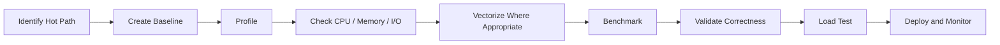

# 02- Vectorization vs Loops

## Overview

Vectorization and Python loops represent two different execution models for numerical processing.

A Python loop performs work one element at a time under Python's execution model:

```text
Python loop
→ fetch element
→ execute Python operations
→ store result
→ repeat
```

A vectorized NumPy operation instead expresses the computation at array level:

```text
NumPy operation
→ dispatch once
→ execute native numerical loop
→ process array buffer
```

For numerical workloads, vectorization is often preferable because it reduces Python-level interpreter overhead and works naturally with NumPy's compact homogeneous arrays.

However, "vectorized" does not automatically mean "faster" or "more memory-efficient". Small inputs, irregular control flow, excessive temporary arrays, poor memory access patterns, and expensive downstream operations can change the trade-off.

The engineering goal is to select the execution model that provides the required:

```text
latency
+
throughput
+
memory usage
+
correctness
+
maintainability
```

## Why Python Loops Have Overhead

Consider:

```python
values = range(10_000_000)

result = []

for value in values:
    result.append(
        value * 1.05
    )
```

The multiplication itself is inexpensive. The repeated Python-level work around it is not.

Each iteration involves operations such as:

```text
iteration management
+
Python object access
+
dynamic dispatch
+
Python arithmetic
+
list management
```

A NumPy expression:

```python
import numpy as np

values = np.arange(
    10_000_000,
    dtype=np.float64,
)

result = values * 1.05
```

moves the bulk of the element-wise work into NumPy's native implementation.

The CPU still processes all elements. The difference is where the iteration is controlled.

## What Vectorization Means

Vectorization means expressing a calculation over an entire array or compatible arrays rather than explicitly iterating through individual elements in Python.

Example:

```python
adjusted = prices * 1.05
```

instead of:

```python
adjusted = np.empty_like(
    prices
)

for index in range(
    len(prices)
):
    adjusted[index] = (
        prices[index] * 1.05
    )
```

The vectorized form lets NumPy control the iteration over the underlying numerical buffer.

This is useful for:

- Arithmetic transformations.
- Comparisons.
- Boolean masking.
- Aggregations.
- Conditional assignment.
- Mathematical functions.
- Broadcasting.

## Execution Model Comparison

| Concern | Python Loop | NumPy Vectorization |
|---|---|---|
| Iteration | Python-controlled | NumPy-controlled |
| Per-element interpreter overhead | Higher | Lower |
| Data representation | General Python objects / collections | Homogeneous array buffer |
| Numerical operations | Python semantics | NumPy numerical semantics |
| Control flow | Very flexible | Best for regular operations |
| Memory behavior | Depends on Python objects/containers | Explicit array and buffer behavior |
| Irregular branching | Usually easier | Often requires masks / conditional operations |
| Large dense numerical workloads | Often slower | Often preferable |
| General application logic | Strong fit | Usually inappropriate |

The important distinction is architectural rather than merely syntactic.

## Basic Performance Example

A straightforward comparison can use `timeit`:

```python
import timeit

list_setup = """
values = list(range(1_000_000))
"""

list_stmt = """
result = [
    value * 1.05
    for value in values
]
"""

numpy_setup = """
import numpy as np
values = np.arange(
    1_000_000,
    dtype=np.float64,
)
"""

numpy_stmt = """
result = values * 1.05
"""

loop_time = timeit.timeit(
    list_stmt,
    setup=list_setup,
    number=10,
)

numpy_time = timeit.timeit(
    numpy_stmt,
    setup=numpy_setup,
    number=10,
)

print(
    f"Python: {loop_time:.4f}s"
)

print(
    f"NumPy:  {numpy_time:.4f}s"
)
```

This benchmark illustrates the execution-model difference, but the absolute numbers are environment-dependent.

A meaningful production benchmark should use:

- Representative data sizes.
- Representative dtypes.
- Representative hardware.
- Realistic operations.
- Realistic memory constraints.

## Why NumPy Often Wins

For dense numerical work, NumPy benefits from several properties working together:

```text
homogeneous dtype
+
compact storage
+
native numerical loops
+
fewer Python-level operations
+
better memory locality
```

These properties reduce overhead around each element.

However, NumPy does not bypass the fundamental cost of moving and processing the data. If the workload is memory-bandwidth-bound, eliminating Python loop overhead may provide only part of the available improvement.

## Vectorization Is Not Magic

Consider:

```python
result = (
    values * 1.05
    + 100
) / 1000
```

This is concise and vectorized, but it may require temporary arrays for intermediate results.

Conceptually:

```text
temporary_1 = values * 1.05
temporary_2 = temporary_1 + 100
result = temporary_2 / 1000
```

The exact internal execution depends on the operations and NumPy implementation, but the engineering concern is the same:

```text
less Python overhead
vs
potentially more memory traffic
```

For a large array, a vectorized expression can therefore be CPU-efficient while still having high peak memory usage.

## Vectorization vs Allocation

Consider a one-gigabyte input array.

A simple vectorized transformation may produce:

```text
1 GB input
+
1 GB output
```

and a chained expression may require additional intermediate storage.

A loop that writes into a preallocated output can sometimes maintain a smaller working set:

```python
result = np.empty_like(
    values
)

for index in range(
    values.shape[0]
):
    result[index] = (
        values[index] * 1.05
        + 100
    ) / 1000
```

This loop may be slower because each iteration crosses through Python.

The decision is therefore not:

```text
vectorization always wins
```

but:

```text
compare execution cost
+
memory cost
+
implementation complexity
```

## Preallocation

A common loop mistake is repeated growth:

```python
result = []

for value in values:
    result.append(
        value * 1.05
    )
```

For Python lists, repeated `append()` is generally much better than repeatedly concatenating lists, but the resulting structure is still a Python object container.

For NumPy, prefer allocating the result once when a loop is genuinely necessary:

```python
result = np.empty_like(
    values
)

for index, value in enumerate(values):
    result[index] = (
        value * 1.05
    )
```

This avoids repeatedly allocating a new NumPy array.

It does not remove Python loop overhead, so vectorization should still be considered first for regular numerical transformations.

## `out=` as a Middle Ground

Sometimes the best approach is vectorized computation with explicit buffer reuse:

```python
result = np.empty_like(
    values
)

np.multiply(
    values,
    1.05,
    out=result,
)

np.add(
    result,
    100,
    out=result,
)

np.divide(
    result,
    1000,
    out=result,
)
```

This retains NumPy's array-level execution model while reducing unnecessary output allocations.

Use this pattern when:

- Arrays are large.
- Peak memory matters.
- Profiling shows allocation pressure.
- The transformation is stable enough to justify explicit buffer management.

Avoid making simple code unnecessarily procedural when allocation is not a bottleneck.

## Broadcasting vs Explicit Loops

Suppose each column has a different multiplier:

```python
values = np.array(
    [
        [10.0, 20.0, 30.0],
        [40.0, 50.0, 60.0],
    ]
)

multipliers = np.array(
    [1.05, 1.10, 1.15]
)

result = (
    values * multipliers
)
```

Broadcasting applies the three multipliers across rows.

A loop could implement the same logic:

```python
result = np.empty_like(
    values
)

for row in range(
    values.shape[0]
):
    for column in range(
        values.shape[1]
    ):
        result[row, column] = (
            values[row, column]
            * multipliers[column]
        )
```

The vectorized version is easier to express and generally better suited to dense numerical data.

More importantly, broadcasting avoids manually constructing repeated copies of `multipliers`.

## When Loops Are Still Appropriate

Loops remain appropriate when the computation is difficult to express as regular array operations.

Examples include:

- Complex state machines.
- Early termination.
- Data-dependent iteration counts.
- Stateful transformations.
- External I/O.
- Per-record API calls.
- Interactions with Python objects.
- Algorithms where each step depends on the previous result.

For example:

```python
total = 0.0

for value in values:
    total += value

    if total >= limit:
        break
```

A vectorized reduction such as:

```python
values.sum()
```

cannot directly represent the same early-termination behavior.

The correct implementation should prioritize the algorithm and requirements rather than forcing vectorization.

## Loop Around Vectorized Batches

A common production pattern combines both approaches:

```text
Python loop
→ batch selection
→ vectorized NumPy processing
→ output
→ next batch
```

Example:

```python
def process_in_batches(
    values: np.ndarray,
    batch_size: int,
) -> np.ndarray:
    outputs = []

    for start in range(
        0,
        values.shape[0],
        batch_size,
    ):
        batch = values[
            start:start + batch_size
        ]

        outputs.append(
            batch * 1.05
        )

    return np.concatenate(
        outputs
    )
```

The Python loop manages batches rather than individual elements.

This is often a strong design for datasets that do not fit comfortably into memory.

The important limitation is that the final `np.concatenate()` reconstructs the complete output. For very large datasets, stream the output to a file, object store, or downstream system instead.

## Vectorization and Conditional Logic

Python control flow:

```python
result = np.empty_like(
    values
)

for index, value in enumerate(values):
    if value < 0:
        result[index] = 0
    else:
        result[index] = value
```

can often become:

```python
result = np.maximum(
    values,
    0,
)
```

or:

```python
result = np.where(
    values < 0,
    0,
    values,
)
```

The vectorized form expresses the operation as an array transformation.

For multiple conditions:

```python
result = np.select(
    [
        values < 0,
        values < 100,
    ],
    [
        0,
        1,
    ],
    default=2,
)
```

`np.select()` evaluates conditions in order, with the first matching condition determining the selected value.

## Unsafe Vectorized Expressions

Vectorization must preserve correctness.

Consider:

```python
result = np.where(
    denominator != 0,
    numerator / denominator,
    0,
)
```

This expression does not necessarily prevent the division operation from being evaluated before `np.where()` selects the result.

For safe element-wise division, use:

```python
result = np.zeros_like(
    numerator,
    dtype=np.float64,
)

np.divide(
    numerator,
    denominator,
    out=result,
    where=denominator != 0,
)
```

This avoids performing the division where the denominator is zero.

The general lesson is:

```text
vectorized syntax
≠
automatically safe execution semantics
```

Understand what operations actually execute.

## Boolean Masking vs Loops

Loop-based filtering:

```python
filtered = []

for value in values:
    if value >= 100:
        filtered.append(
            value
        )
```

Vectorized filtering:

```python
filtered = values[
    values >= 100
]
```

The vectorized version is concise and array-oriented.

However, it creates:

```text
boolean mask
+
selected output
```

For a very large array, this memory cost matters.

If the goal is only an aggregate, avoid materializing the filtered values:

```python
count = np.count_nonzero(
    values >= 100
)
```

or use reduction patterns appropriate to the computation.

## Vectorization and Missing Values

Vectorization remains useful when handling invalid numerical values.

Example:

```python
finite = np.isfinite(
    values
)

total = np.sum(
    values,
    where=finite,
)
```

This avoids a Python loop over individual values.

For more complex cleaning rules:

```python
valid = (
    np.isfinite(values)
    & (values >= 0)
    & (values <= 1_000)
)

cleaned = values[
    valid
]
```

The mask is itself vectorized.

For large datasets, process in batches if materializing the mask and selected result would exceed the memory budget.

## Views vs Copies in Vectorized Pipelines

Vectorized code often looks simple enough to hide allocation behavior.

Consider:

```python
batch = values[
    1_000_000:2_000_000
]
```

Basic slicing commonly returns a view.

But:

```python
batch = values[
    values > 100
]
```

typically creates a new array.

Similarly:

```python
converted = values.astype(
    np.float32
)
```

may allocate because changing dtype generally requires new storage.

When performance matters, understand:

```text
view?
copy?
dtype conversion?
temporary?
```

before optimizing.

## Dtype and Loop Comparisons

A fair comparison requires comparable dtypes.

For example:

```python
values = np.arange(
    5_000_000,
    dtype=np.float64,
)
```

should be compared against a Python representation that actually performs comparable numerical work.

Python integers have different storage and runtime characteristics from fixed-width NumPy integers.

Therefore, a benchmark should not be presented as a universal comparison between "Python numbers" and "NumPy numbers" without specifying the workload.

## Small Inputs

Vectorization has fixed overhead.

For tiny arrays:

```python
values = np.array(
    [10.0, 20.0, 30.0]
)
```

the cost of:

```text
function dispatch
+
array machinery
```

may dominate the actual arithmetic.

A simple Python operation can be perfectly acceptable for small datasets.

This is why performance decisions should use realistic data sizes rather than assuming the behavior of a 10-element example represents a production workload.

## Vectorization and Memory-Bound Work

Suppose a workload performs:

```python
result = values + 1
```

on a very large array.

The arithmetic itself is simple.

The workload may become limited by:

```text
reading values
+
writing result
```

rather than by addition.

In this situation, further reducing Python overhead may have limited impact because the bottleneck is memory bandwidth.

Using a smaller dtype, avoiding unnecessary passes over the data, and reducing temporary arrays may provide more useful improvements.

## Multiple Passes Over Data

Chained operations can traverse the same input multiple times.

For example:

```python
result = (
    values * 1.05
    + 100
)
```

may require multiple operations over the data.

In some workloads, reducing the number of passes can matter.

However, manually combining operations into custom loops is not automatically better. A Python loop can reintroduce interpreter overhead.

The trade-off is:

```text
fewer memory passes
vs
Python execution overhead
```

When this becomes critical, consider specialized compiled kernels or libraries designed for the workload rather than replacing optimized NumPy operations with a Python loop.

## Vectorization vs Python Function Calls

This pattern can still introduce Python overhead:

```python
def transform(value):
    return value * 1.05 + 100


result = np.array([
    transform(value)
    for value in values
])
```

Although the final result is a NumPy array, the computation itself is still performed through Python calls for each element.

Creating an array around a Python loop does not make the operation vectorized.

True vectorization expresses the transformation using NumPy operations:

```python
result = (
    values * 1.05
    + 100
)
```

## When `np.vectorize()` Is Misunderstood

`np.vectorize()` is sometimes mistaken for a performance optimization.

For example:

```python
def transform(value):
    return value * 1.05


vectorized_transform = np.vectorize(
    transform
)

result = vectorized_transform(
    values
)
```

`np.vectorize()` is primarily a convenience mechanism for applying a Python callable element by element. It does not turn arbitrary Python code into native vectorized numerical code.

For performance-sensitive numeric workloads, prefer real NumPy operations whenever possible.

## Vectorization and Irregular Algorithms

Not every algorithm maps naturally to element-wise array operations.

Consider a running threshold process:

```python
running = 0.0
cutoff_index = None

for index, value in enumerate(values):
    running += value

    if running >= threshold:
        cutoff_index = index
        break
```

This contains:

```text
state
+
dependency on previous iteration
+
early termination
```

Forcing this into a complicated vectorized expression may reduce maintainability without providing meaningful performance benefits.

Senior-level NumPy usage includes knowing when **not** to vectorize.

## Vectorization vs JIT / Compiled Code

When a computation is inherently loop-oriented but performance-critical, there are alternatives to both pure Python loops and simple NumPy expressions.

Depending on the workload, specialized tools may include:

```text
Numba
Cython
C / C++
Rust extensions
```

These approaches can move loop execution out of the Python interpreter.

The appropriate choice depends on:

```text
algorithm complexity
+
deployment constraints
+
maintenance cost
+
performance requirements
```

Do not introduce compiled extensions before confirming that ordinary NumPy vectorization cannot meet the requirement.

## Performance Decision Matrix

| Workload | Preferred Approach |
|---|---|
| Simple element-wise arithmetic | NumPy vectorization |
| Broadcasting transformations | NumPy vectorization |
| Aggregation | NumPy reductions |
| Boolean filtering | NumPy masking |
| Large dataset exceeding RAM | Batch + vectorized processing |
| Stateful sequential algorithm | Python loop or compiled implementation |
| Early termination | Python loop often appropriate |
| External I/O per record | Python loop / async / batch API |
| Complex object processing | Python-native structures |
| Simple computation over tiny arrays | Measure; loop may be sufficient |
| Python function per element | Avoid unless performance is acceptable |
| Loop remains hot after vectorization analysis | Consider compiled/JIT approach |

## Backend Data Processing Example

Consider a service processing transaction amounts.

A naive implementation might use:

```python
def calculate_net_amounts(
    amounts: list[float],
) -> list[float]:
    result = []

    for amount in amounts:
        if amount < 0:
            result.append(0.0)
        else:
            result.append(
                amount * 0.98
            )

    return result
```

A NumPy-oriented implementation is:

```python
import numpy as np


def calculate_net_amounts(
    amounts: np.ndarray,
) -> np.ndarray:
    return np.where(
        amounts < 0,
        0.0,
        amounts * 0.98,
    )
```

The second form is appropriate when:

```text
input is already numerical
+
processing is dense
+
output can be represented as an array
```

The API layer should still control input size and resource usage.

For a very large request, the service may instead:

```text
receive request
→ store / stage data
→ enqueue Celery task
→ process batches with NumPy
→ persist result
```

## API and Microservice Boundaries

Do not confuse vectorization with request batching.

These are different concepts:

```text
vectorization
→ how numerical operations execute

request batching
→ how data is transported and grouped
```

A FastAPI service can receive a JSON list and convert it to NumPy:

```python
import numpy as np


def process_payload(
    payload: list[float],
) -> list[float]:
    values = np.asarray(
        payload,
        dtype=np.float64,
    )

    result = (
        values * 1.05
    )

    return result.tolist()
```

This is reasonable for bounded payloads.

For unbounded payloads, converting the entire request body to an array can create memory pressure before the actual computation begins.

## Kafka and Batch Processing

For Kafka or similar event streams, vectorization generally becomes more useful when records can be grouped into batches.

Conceptually:

```text
Kafka records
    ↓
consumer batch
    ↓
extract numeric values
    ↓
NumPy array
    ↓
vectorized transformation
    ↓
persist / publish
```

This can reduce per-record Python overhead.

However, batch size must balance:

```text
throughput
+
latency
+
memory
+
rebalance behavior
```

A larger batch is not automatically better.

## Celery Workers

A Celery worker can process numerical data in chunks:

```python
for batch in batches:
    processed = (
        batch * scale
        + offset
    )

    persist(processed)
```

The Python loop manages the job's batches, while NumPy vectorizes work **within** each batch.

This hybrid structure is common in production systems.

## Monitoring Vectorized Workloads

For production numerical processing, monitor:

```text
processing latency
throughput
CPU utilization
memory RSS
peak memory
allocation pressure where measurable
batch size
input size
output size
failure rate
```

For Kubernetes deployments, also monitor:

```text
OOM kills
CPU throttling
pod restarts
ephemeral storage
```

A vectorized implementation that is faster on a laptop but repeatedly hits container memory limits is not a successful production optimization.

## Common Mistakes

### Assuming Every Loop Should Be Removed

Some algorithms are naturally sequential or stateful. Replacing a clear loop with complicated vectorized code can reduce maintainability without improving the actual bottleneck.

### Assuming `np.vectorize()` Is Real Vectorization

It generally still invokes a Python callable element by element.

### Creating a NumPy Array Around a Python Loop

This:

```python
np.array([
    transform(value)
    for value in values
])
```

creates a NumPy result, but the transformation is still executed in Python.

### Ignoring Temporary Arrays

A concise vectorized expression can allocate several large intermediates.

### Comparing Different Data Representations

Benchmarking a Python list of Python integers against a NumPy float array without documenting the representation can produce misleading conclusions.

### Ignoring Small Inputs

Vectorization has dispatch overhead. For tiny workloads, the performance difference may be irrelevant.

### Ignoring Memory Bandwidth

When a workload is memory-bound, reducing interpreter overhead may produce less improvement than reducing memory traffic.

### Forcing Vectorization on External I/O

Calling a REST API or writing one database row at a time cannot be made computationally vectorized simply by placing the results into a NumPy array.

The correct optimization may be request batching, bulk SQL, Kafka batching, or asynchronous I/O.

### Growing NumPy Arrays Repeatedly

Avoid:

```python
result = np.array([])

for batch in batches:
    result = np.concatenate(
        [result, batch]
    )
```

This can repeatedly allocate and copy data.

### Ignoring Input Limits

User-controlled arrays can cause memory exhaustion through large payloads or large broadcast shapes.

## Production Optimization Workflow

Use a measured process:



For each optimization, record:

```text
input size
dtype
shape
baseline latency
optimized latency
peak memory
CPU utilization
```

This turns an optimization from an intuition into an engineering decision.

## Interview Questions

### Why is a NumPy loop often faster than a Python loop?

The iteration and numerical work are performed through NumPy's native implementation rather than executing Python code for every element.

### Is vectorization always faster?

No. Small inputs, memory-bound operations, unnecessary temporaries, irregular algorithms, and other workload characteristics can reduce or eliminate the advantage.

### What is the difference between vectorization and broadcasting?

Vectorization is the broader concept of expressing operations at array level. Broadcasting is a NumPy shape-alignment mechanism that allows compatible arrays of different shapes to participate in operations.

### Does `np.vectorize()` make Python functions fast?

No. It is primarily a convenience wrapper for applying a Python callable element by element.

### Why can vectorization increase memory usage?

Vectorized expressions can produce intermediate arrays and result arrays. Eliminating Python loop overhead does not eliminate the need to store outputs.

### When is a Python loop better than NumPy?

When the algorithm is stateful, requires early termination, contains complex branching, operates on Python objects, or interacts heavily with external systems.

### How can a Python loop and NumPy work together effectively?

Use the Python loop to manage batches, files, or tasks and use NumPy to perform dense numerical work within each batch.

### Why does `np.where()` not always protect unsafe operations?

The expression used to compute the candidate values can be evaluated before selection. For unsafe operations such as division, use operation-level controls such as `where=` where appropriate.

### Why can a vectorized workload still be slow?

Possible bottlenecks include memory bandwidth, non-contiguous access, temporary allocations, storage I/O, database access, serialization, or an algorithm that requires too much work.

### When should you consider Numba or another compiled approach?

When the algorithm is naturally loop-oriented, remains a measured hot path after ordinary NumPy optimization, and the added deployment and maintenance complexity is justified.

### How would you explain vectorization in an interview?

Explain that vectorization moves iteration over numerical elements from Python-level code into optimized native array operations, reducing interpreter overhead while potentially introducing memory-allocation and temporary-array trade-offs.

## Key Takeaways

- Vectorization moves regular numerical iteration from Python into NumPy's array-level execution model, often reducing interpreter overhead for sufficiently large workloads.
- Vectorized code can still be memory-intensive because broadcasting, filtering, and chained expressions may allocate large results or temporary arrays.
- Python loops remain appropriate for stateful, irregular, early-terminating, object-oriented, and I/O-bound work; senior NumPy usage includes knowing when not to vectorize.
- A strong production pattern is often a Python loop over bounded batches with NumPy vectorization inside each batch.
- Benchmark realistic workloads and measure CPU, memory, and I/O behavior before deciding that vectorization, buffer reuse, batching, or compiled code is the right optimization.