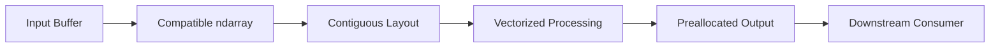

# 05- Contiguous Arrays

## Overview

A contiguous NumPy array stores its elements in a memory layout where the elements follow the expected storage order without gaps between the relevant positions.

Contiguity matters because many numerical operations perform best when data can be traversed sequentially through memory.

For production backend and data-processing workloads, contiguous arrays are important when:

- Processing large numerical buffers.
- Interacting with native extensions.
- Performing repeated vectorized operations.
- Optimizing memory-bandwidth-bound workloads.
- Passing arrays to libraries that require a specific layout.
- Avoiding hidden copies during numerical processing.

NumPy primarily exposes two conventional contiguous layouts:

```text
C-contiguous
→ last axis changes fastest

Fortran-contiguous
→ first axis changes fastest
```

The important engineering distinction is:

```text
contiguous data
vs
contiguous view
vs
non-contiguous view
vs
explicit copy
```

A contiguous array is not automatically faster for every operation, but it provides a predictable memory layout that many operations and native libraries can exploit efficiently.

## What Contiguous Means

Suppose:

```python
import numpy as np

values = np.arange(
    12,
    dtype=np.float64,
).reshape(3, 4)
```

A typical C-contiguous layout stores the values conceptually as:

```text
0 1 2 3 4 5 6 7 8 9 10 11
```

The logical two-dimensional representation is:

```text
0  1  2  3
4  5  6  7
8  9 10 11
```

The elements within each row are adjacent in the underlying buffer.

Check this with:

```python
print(
    values.flags.c_contiguous
)
```

For this layout, it should be:

```text
True
```

## C-Contiguous Arrays

C-contiguous arrays follow row-major ordering.

For:

```python
values = np.arange(
    12,
    dtype=np.float64,
).reshape(3, 4)
```

the last axis is contiguous.

The strides are typically:

```python
print(
    values.strides
)
```

which gives:

```text
(32, 8)
```

because:

```text
4 elements per row × 8 bytes = 32 bytes
1 element × 8 bytes = 8 bytes
```

Thus:

```text
move one row
→ advance 32 bytes

move one column
→ advance 8 bytes
```

This makes row-wise traversal naturally sequential.

## Fortran-Contiguous Arrays

Fortran-contiguous arrays use column-major ordering.

```python
values = np.asfortranarray(
    np.arange(
        12,
        dtype=np.float64,
    ).reshape(3, 4)
)

print(
    values.flags.f_contiguous
)
```

The underlying storage is arranged so that the first axis changes fastest.

Conceptually:

```text
0 3 6 9
1 4 7 10
2 5 8 11
```

The logical values remain:

```text
0 1 2 3
4 5 6 7
8 9 10 11
```

but the physical traversal order differs.

## C vs Fortran Contiguity

| Property | C-Contiguous | Fortran-Contiguous |
|---|---|---|
| Storage order | Row-major | Column-major |
| Fastest-changing axis | Last | First |
| Common NumPy default | Yes | No |
| Useful for row-oriented work | Often | Sometimes |
| Useful for column-oriented work | Sometimes | Often |
| Can avoid copies when matched to consumer | Yes | Yes |

Neither layout is inherently superior.

The correct choice depends on:

```text
dominant access pattern
+
downstream library requirements
+
memory layout of surrounding operations
```

## Inspecting Contiguity

Use array flags:

```python
print(
    values.flags
)
```

Useful properties include:

```python
values.flags.c_contiguous
values.flags.f_contiguous
values.flags.owndata
values.flags.writeable
```

For a focused check:

```python
if not values.flags.c_contiguous:
    values = np.ascontiguousarray(
        values
    )
```

Do this only when the downstream operation actually benefits from C-contiguous storage.

## Strides and Contiguity

Contiguity is fundamentally about the relationship between shape and strides.

Consider:

```python
values = np.arange(
    12,
    dtype=np.float64,
).reshape(3, 4)

print(
    values.shape
)

print(
    values.strides
)
```

For C-contiguous `float64` data:

```text
shape   = (3, 4)
strides = (32, 8)
```

The stride for the last axis equals the element size:

```text
8 bytes
```

and the row stride equals the number of columns multiplied by that size:

```text
4 × 8 = 32 bytes
```

This creates a compact sequential memory representation.

## Why Contiguity Matters

CPU performance often depends on moving data efficiently through:

```text
L1 cache
→ L2 cache
→ L3 cache
→ RAM
```

Contiguous data makes sequential access straightforward.

For simple element-wise work:

```python
result = values * 1.05
```

the implementation can traverse the underlying data in a predictable order.

For very large arrays, the workload may become memory-bandwidth-bound rather than arithmetic-bound.

Contiguous storage can help make better use of available memory bandwidth.

## Contiguous Does Not Mean Faster in Every Case

Consider:

```python
values = np.ones(
    (10_000, 1_000),
    dtype=np.float64,
)
```

If the workload is dominated by column-oriented operations, changing to a Fortran-oriented layout may better match the access pattern.

Therefore:

```text
contiguous
≠
universally optimal
```

The actual objective is:

```text
appropriate layout
+
appropriate access pattern
```

## Non-Contiguous Views

A view can share the original data while presenting a different memory traversal pattern.

For example:

```python
values = np.arange(
    12,
    dtype=np.float64,
).reshape(3, 4)

transposed = values.T

print(
    transposed.flags.c_contiguous
)

print(
    transposed.flags.f_contiguous
)
```

The transpose commonly returns a view rather than copying the data.

This is memory-efficient, but the resulting layout differs from the original C-contiguous array.

## Why a View Can Be Non-Contiguous

Consider:

```python
values = np.arange(
    12,
    dtype=np.float64,
).reshape(3, 4)

column = values[:, 1]
```

`column` is logically:

```text
1
5
9
```

but those elements are separated in the original buffer.

The view can therefore have a stride larger than the element size.

Inspect:

```python
print(
    column.strides
)
```

A view can save memory while still providing a less favorable access pattern.

## Slicing and Contiguity

Basic slicing does not always preserve contiguity.

For example:

```python
values = np.arange(
    20,
    dtype=np.float64,
)

every_other = values[::2]

print(
    every_other.flags.c_contiguous
)
```

The array contains every second element.

The result is usually a view with a larger stride:

```text
element
↓
skip one element
↓
next selected element
```

This avoids a copy but is not contiguous.

## `ascontiguousarray()`

Use:

```python
contiguous = np.ascontiguousarray(
    values
)
```

when C-contiguous storage is required or beneficial.

Important behavior:

```text
already C-contiguous
→ may return the existing array

not C-contiguous
→ creates a contiguous copy
```

This makes it useful at API boundaries to native code:

```text
validate input
→ normalize layout
→ call native operation
```

But a conversion inside a hot loop can introduce significant allocation and memory-copy overhead.

## `asfortranarray()`

The equivalent for Fortran-contiguous layout is:

```python
column_major = np.asfortranarray(
    values
)
```

This is useful when:

- A downstream library expects Fortran ordering.
- Column-wise processing dominates.
- The algorithm naturally benefits from column-major storage.

Again, conversion may allocate.

## `np.require()`

When code needs explicit memory-layout constraints, `np.require()` can express requirements:

```python
prepared = np.require(
    values,
    requirements=["C", "W"],
)
```

Here:

```text
C → C-contiguous
W → writeable
```

This is useful at low-level boundaries where the consumer has concrete layout requirements.

For ordinary application code, `ascontiguousarray()` or `asfortranarray()` is often clearer.

## Contiguity and Copies

A common performance issue is an implicit copy.

For example:

```python
values = np.arange(
    1_000_000,
    dtype=np.float64,
).reshape(1000, 1000)

transposed = values.T

contiguous = np.ascontiguousarray(
    transposed
)
```

The final operation can allocate a complete new array.

If the array is large:

```text
source memory
+
destination memory
+
copy bandwidth
```

may temporarily be required.

In a container with a strict memory limit, this can trigger an OOM failure even when the original dataset fit comfortably in memory.

## Hidden Copies at API Boundaries

Copies can appear when passing arrays to:

- Native extensions.
- C/C++ libraries.
- Rust extensions.
- Serialization code.
- Database adapters.
- Numerical libraries with layout requirements.

A library may require:

```text
C-contiguous
+
specific dtype
+
writeable storage
```

and create a converted array if the input does not satisfy those requirements.

This is why layout should be considered part of low-level interfaces.

## Dtype and Contiguity

Contiguity does not determine element size.

For example:

```python
float32_values = np.ones(
    1_000_000,
    dtype=np.float32,
)

float64_values = np.ones(
    1_000_000,
    dtype=np.float64,
)
```

Both can be C-contiguous.

But:

```text
float32 → 4 bytes per element
float64 → 8 bytes per element
```

The larger dtype increases:

```text
memory footprint
+
memory bandwidth
+
cache pressure
```

When a workload is memory-bound, this difference can be substantial.

## Contiguity and Vectorized Operations

Vectorized code works on contiguous and non-contiguous arrays.

For example:

```python
result = values * 1.05
```

is valid regardless of whether `values` is contiguous.

However, the performance may differ because the underlying traversal pattern differs.

The important distinction is:

```text
vectorization
→ removes Python-level per-element work

contiguity
→ influences how efficiently the native operation accesses memory
```

These are related but separate optimization dimensions.

## Contiguity and Broadcasting

Broadcasting also works with non-contiguous inputs:

```python
transposed = values.T

weights = np.ones(
    transposed.shape[-1]
)

result = (
    transposed * weights
)
```

The operation is logically valid, but performance depends on:

```text
shape
+
strides
+
broadcasting pattern
+
result layout
```

When broadcasted operations are hot paths, benchmark the complete operation rather than reasoning only from shape.

## Contiguity and Reductions

Consider:

```python
result = values.sum(
    axis=1
)
```

For C-contiguous row-major arrays, reducing across the last axis often corresponds to traversing adjacent elements.

A different axis may involve more strided access.

This does not mean a reduction along another axis is always slow, but it can change memory-access behavior.

A useful optimization principle is:

> Align dominant traversal with the array's physical storage order when the operation is memory-intensive.

## Contiguous Arrays and Memory-Mapped Data

Memory mapping makes layout even more relevant.

```python
values = np.load(
    "large_values.npy",
    mmap_mode="r",
)
```

If processing follows the file's natural sequential layout, the operating system can often serve the required pages efficiently.

A highly strided access pattern may touch many distant pages:

```text
logical access
→ scattered file regions
→ more page activity
→ greater storage dependence
```

For large file-backed datasets:

```text
layout
+
access pattern
+
batch size
```

should be designed together.

## Contiguous Arrays and Batch Processing

Suppose:

```python
values.shape == (
    10_000_000,
    32,
)
```

Process contiguous row batches:

```python
batch_size = 500_000

for start in range(
    0,
    values.shape[0],
    batch_size,
):
    batch = values[
        start:start + batch_size
    ]

    process(batch)
```

A basic row slice can preserve favorable layout characteristics.

For large datasets, this can provide:

```text
predictable memory usage
+
sequential access
+
good locality
```

while avoiding a full-dataset copy.

## Preallocating Contiguous Output

When output shape is known, preallocate an appropriately laid-out destination:

```python
result = np.empty(
    values.shape,
    dtype=values.dtype,
)
```

Then write into it:

```python
np.multiply(
    values,
    1.05,
    out=result,
)
```

This makes the output allocation explicit and can avoid repeatedly constructing intermediate arrays.

If a particular downstream system requires a specific layout, create it intentionally:

```python
result = np.empty(
    values.shape,
    dtype=values.dtype,
    order="C",
)
```

or:

```python
result = np.empty(
    values.shape,
    dtype=values.dtype,
    order="F",
)
```

## Order Parameter

Several NumPy operations accept an `order` argument.

For array creation:

```python
values = np.empty(
    (1000, 32),
    dtype=np.float64,
    order="C",
)
```

or:

```python
values = np.empty(
    (1000, 32),
    dtype=np.float64,
    order="F",
)
```

Use explicit ordering when the downstream algorithm has a clear layout requirement.

Avoid specifying `"F"` simply because another language or library uses the term "column-major". Match the actual data-access requirements.

## Contiguity and `reshape()`

Suppose:

```python
values = np.arange(
    12,
    dtype=np.float64,
).reshape(3, 4)

reshaped = values.reshape(
    4,
    3,
)
```

NumPy may produce a view when the requested shape is compatible with the current memory order.

For a non-contiguous input:

```python
transposed = values.T

reshaped = transposed.reshape(
    6,
    2,
)
```

the operation may require a copy depending on layout compatibility.

The key point is:

```text
reshape is not inherently a copy operation
```

and:

```text
reshape is not inherently a zero-copy operation
```

Inspect and benchmark when it matters.

## Contiguity and `ravel()`

`ravel()` attempts to return a flattened view when possible:

```python
flat = values.ravel()
```

For a suitable contiguous array, this can be cheap.

For a layout that cannot be represented as the requested flattened view, NumPy may need a copy.

By contrast:

```python
flat = values.flatten()
```

always returns a copy.

This distinction is important for large arrays.

## Contiguity and `astype()`

Changing dtype often requires a new buffer:

```python
converted = values.astype(
    np.float32
)
```

Even if `values` is contiguous before conversion, the destination must contain differently represented elements.

The result can therefore be a new contiguous array.

When dtype conversion is unavoidable, consider doing it:

```text
once
+
at a controlled pipeline boundary
```

rather than repeatedly converting inside hot loops.

## Zero-Copy Boundaries

A high-performance pipeline attempts to minimize unnecessary representation changes:



The goal is not literally zero copies everywhere.

The goal is:

```text
copy only when it provides a required
semantic or performance benefit
```

A copy may be worthwhile if it produces a much more efficient layout for a large amount of downstream processing.

## Backend Example

Consider a numerical microservice receiving a batch of values and passing them into a native processing function.

A controlled boundary can be:

```python
import numpy as np


def prepare_input(
    values: np.ndarray,
) -> np.ndarray:
    values = np.asarray(
        values,
        dtype=np.float32,
    )

    if not values.flags.c_contiguous:
        values = np.ascontiguousarray(
            values
        )

    return values
```

The important design decision is to normalize once at the boundary.

Avoid repeatedly doing:

```python
for batch in batches:
    batch = np.ascontiguousarray(
        batch
    )

    process(batch)
```

when every batch has already been normalized.

## FastAPI and Django Considerations

If an API accepts large numerical payloads:

```text
HTTP body
→ parser
→ NumPy conversion
→ dtype normalization
→ contiguity normalization
→ numerical processing
```

each stage can potentially allocate memory.

A production service should therefore enforce:

```text
maximum request size
+
maximum element count
+
maximum dimensions
+
appropriate dtype
```

For large workloads, asynchronous processing with Celery or another worker system can isolate numerical resource usage from API-serving processes.

## PostgreSQL and Data Extraction

When numeric data is extracted from PostgreSQL, the resulting representation may not already match the desired NumPy layout.

The production pipeline should aim for:

```text
SQL filtering
→ only required rows/columns
→ controlled NumPy conversion
→ contiguous numerical buffer when needed
→ vectorized processing
```

This avoids paying for both:

```text
unnecessary database transfer
+
unnecessary array conversion
```

## Pandas Interaction

Pandas provides higher-level table semantics, while NumPy gives explicit control over dense numerical array layout.

A conversion such as:

```python
values = dataframe.to_numpy(
    dtype=np.float64,
)
```

may allocate or convert data depending on the DataFrame's internal representation.

When working with large datasets:

```text
database / Parquet
→ Pandas
→ NumPy
```

should be designed as an intentional representation transition rather than an incidental conversion inside a hot loop.

## Measuring Contiguity Performance

Benchmark the actual operation:

```python
import timeit
import numpy as np

setup = """
import numpy as np

values = np.ones(
    (2000, 2000),
    dtype=np.float64,
)

transposed = values.T
"""

c_stmt = """
result = values * 1.05
"""

non_c_stmt = """
result = transposed * 1.05
"""

c_time = timeit.timeit(
    c_stmt,
    setup=setup,
    number=20,
)

non_c_time = timeit.timeit(
    non_c_stmt,
    setup=setup,
    number=20,
)

print(
    f"C-contiguous: {c_time:.4f}s"
)

print(
    f"Non-contiguous: {non_c_time:.4f}s"
)
```

This is only a benchmark pattern.

Actual results vary with:

```text
CPU
+
NumPy implementation
+
array dimensions
+
dtype
+
operation
+
cache state
+
memory pressure
```

## Measuring Memory

Contiguity optimization often involves copying.

For a large array:

```python
copy = np.ascontiguousarray(
    non_contiguous
)
```

compare:

```text
original array size
+
copy size
+
other live arrays
```

using:

```python
print(
    non_contiguous.nbytes
)

print(
    copy.nbytes
)
```

Also monitor process-level RSS in production because `nbytes` does not represent total process memory.

## Common Mistakes

### Assuming Every `ndarray` Is Contiguous

NumPy supports many views with custom stride patterns.

### Treating Contiguity as an Absolute Performance Requirement

Some workloads benefit little from explicit contiguity. Measure the actual operation.

### Calling `ascontiguousarray()` in Hot Loops

If it creates a copy repeatedly, it can dominate runtime.

### Assuming Transpose Always Copies

Transpose often returns a view with modified strides.

### Assuming a View Is Always Fast

A view can avoid copying while still producing a non-contiguous access pattern.

### Ignoring Dtype Conversion

A layout-normalization step combined with `astype()` can create more than one large allocation if done carelessly.

### Optimizing for C Order Without Checking the Consumer

Some algorithms and native libraries are better aligned with Fortran order.

### Ignoring Memory Limits

A single layout conversion can temporarily double the memory associated with a large array.

### Measuring Only Array Creation Time

A contiguous copy may be expensive initially but beneficial over many downstream operations. Benchmark the complete workload.

### Treating `nbytes` as Total Memory

`nbytes` only covers the array data buffer.

## Production Decision Matrix

| Situation | Recommended Approach |
|---|---|
| C-oriented downstream processing | Prefer C-contiguous input |
| Fortran-oriented downstream processing | Prefer Fortran-contiguous input |
| Large array, no layout requirement | Avoid unnecessary conversion |
| Non-contiguous view used repeatedly | Benchmark whether making one copy helps |
| Hot loop repeatedly normalizing layout | Normalize once before the loop |
| Large memory-mapped dataset | Favor access patterns matching file layout |
| Memory-constrained container | Account for copy peak memory |
| Native extension boundary | Match its documented layout requirements |
| Unknown performance impact | Benchmark both layouts |

## Interview Questions

### What is a contiguous NumPy array?

An array whose elements follow a regular storage order without gaps relative to the selected memory layout, allowing efficient sequential traversal along the contiguous axes.

### What is C-contiguous?

C-contiguous means the last axis is stored contiguously according to C-style row-major ordering.

### What is Fortran-contiguous?

Fortran-contiguous means the first axis is stored contiguously according to Fortran-style column-major ordering.

### Why does contiguity matter?

It can improve cache locality, memory bandwidth utilization, and compatibility with native numerical libraries.

### Does a non-contiguous array mean the data was copied?

No. Non-contiguous arrays are often views that share the original data but use different strides.

### Does `np.ascontiguousarray()` always copy?

No. It can return the existing array when the input already satisfies the required C-contiguous layout.

### Why can `transpose()` produce a non-contiguous array?

Transpose can often be implemented by changing shape and stride metadata rather than physically moving the data.

### Why can making an array contiguous improve performance?

It can provide sequential memory access and satisfy downstream layout requirements, potentially reducing inefficient strided access.

### Why can making an array contiguous make performance worse?

Creating the contiguous copy costs time, memory, and bandwidth. If the downstream workload is small, the copy may cost more than the performance benefit it provides.

### When would you choose Fortran order?

When column-oriented traversal or a downstream library's column-major expectations justify it.

### How does contiguity relate to memory mapping?

A layout that supports sequential access can make file-backed processing more efficient, while highly strided access can trigger more scattered page activity.

### How would you optimize a large non-contiguous array?

First measure the actual workload. If repeated processing suffers from the layout, make one appropriately contiguous copy and reuse it instead of repeatedly converting each batch.

## Key Takeaways

- Contiguous arrays provide predictable physical storage that can improve cache locality, memory bandwidth utilization, and interoperability with native numerical code.
- C-contiguous and Fortran-contiguous layouts optimize different traversal directions; neither is universally superior.
- Views such as slices and transposes can avoid copies while producing non-contiguous stride patterns, so memory efficiency and execution efficiency are separate concerns.
- `np.ascontiguousarray()` and `np.asfortranarray()` can normalize layout, but any required copy has real time and peak-memory costs.
- Optimize contiguity at stable pipeline boundaries, measure the complete workload, and match the chosen layout to the dominant access pattern and downstream consumer.