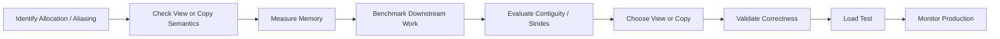

# 06- Views vs Copies Performance

## Overview

Views and copies are central to NumPy performance because they determine whether an operation reuses existing storage or allocates and moves a new block of data.

For large arrays, the difference can dominate performance:

```text
view
→ reuse existing buffer
→ low allocation cost
→ low additional memory

copy
→ allocate new buffer
→ copy data
→ additional memory and bandwidth
```

The important engineering question is not:

> Is a view always faster than a copy?

It is:

> Does avoiding the copy reduce enough memory traffic and allocation cost without creating an inefficient access pattern or incorrect ownership semantics?

A view can be memory-efficient but non-contiguous. A copy can be expensive to create but improve downstream locality and performance when reused many times.

## What Is a View?

A view is an `ndarray` that exposes existing data through different metadata such as:

```text
shape
+
strides
+
dtype interpretation
```

without necessarily allocating a new data buffer.

For example:

```python
import numpy as np

values = np.arange(
    10,
    dtype=np.float64,
)

subset = values[
    2:7
]
```

The slice typically shares storage with `values`.

Conceptually:

```text
values
┌─────────────────────────────┐
│ 0 1 2 3 4 5 6 7 8 9         │
└─────────────────────────────┘
        ↑       ↑
        └── view ┘
          2 3 4 5 6
```

No complete copy of the selected values is required for a basic slice.

## What Is a Copy?

A copy owns separate data storage.

```python
values = np.arange(
    10,
    dtype=np.float64,
)

subset = values[
    2:7
].copy()
```

Now:

```text
values
→ original data buffer

subset
→ independent data buffer
```

Mutating `subset` does not modify `values`.

The independence is useful when:

- The result must be isolated.
- The source should remain unchanged.
- The array will outlive the source object.
- A contiguous or normalized representation is required.
- Independent ownership simplifies concurrency or lifecycle management.

The cost is additional allocation and data movement.

## View vs Copy

| Characteristic | View | Copy |
|---|---|---|
| Shares underlying data | Usually yes | No |
| Allocation | Usually none for data buffer | Yes |
| Initial memory cost | Low | Higher |
| Creation cost | Usually low | Proportional to copied data |
| Mutation affects source | Can | No |
| Can inherit non-contiguous layout | Yes | Destination may be contiguous |
| Ownership isolation | Weak | Strong |
| Useful for large slices | Often | When independence is required |

The exact memory relationship depends on the operation, so avoid assuming every NumPy operation is either a guaranteed view or guaranteed copy without checking its documented behavior.

## Why Views Matter for Performance

Suppose a dataset contains 2 GB of numerical data.

Creating a view:

```python
batch = values[
    start:end
]
```

can avoid copying those 2 GB.

Creating a copy:

```python
batch = values[
    start:end
].copy()
```

requires additional:

```text
2 GB-class allocation
+
2 GB-class memory transfer
```

for a sufficiently large selection.

The actual transfer amount is determined by the selected region and dtype, but the general principle is:

```text
large copy
→ large memory movement
→ measurable latency
→ higher peak memory
```

This is particularly important in Kubernetes workers with strict memory limits.

## Basic Slicing Usually Returns Views

Basic slicing such as:

```python
subset = values[
    1_000_000:2_000_000
]
```

commonly produces a view.

This makes slicing useful for batch processing:

```python
for start in range(
    0,
    values.shape[0],
    batch_size,
):
    batch = values[
        start:start + batch_size
    ]

    process(batch)
```

The batch can reference the existing array without copying the selected data.

## Boolean Indexing Usually Copies

Consider:

```python
filtered = values[
    values > 100
]
```

This generally creates a new array.

The operation requires:

```text
comparison
→ boolean mask
→ selected output
```

So memory usage can include both:

```text
mask
+
result
```

For large arrays, this distinction matters.

## Fancy Indexing Usually Copies

Integer-based selection also generally produces a new array:

```python
indices = np.array(
    [100, 10_000, 500_000]
)

selected = values[
    indices
]
```

Unlike a simple slice, the selected values are not represented as one regular contiguous interval in the source array.

The resulting array therefore generally owns its own data.

## `copy()` as an Explicit Ownership Boundary

Use `.copy()` when you intentionally want independent storage:

```python
batch = values[
    start:end
].copy()
```

This can be a good design when:

- The source may be deleted.
- The result will be mutated independently.
- The source is memory-mapped.
- The result must have controlled ownership.
- A downstream component may retain the array longer than expected.

The important point is that `.copy()` should be a deliberate ownership decision, not a default defensive habit.

## Detecting Shared Memory

For debugging and performance analysis, use:

```python
np.shares_memory(
    values,
    subset,
)
```

This checks whether the arrays share memory.

There is also:

```python
np.may_share_memory(
    values,
    subset,
)
```

which is conservative and can report possible overlap when exact overlap is uncertain.

For example:

```python
assert np.shares_memory(
    values,
    subset,
)
```

Use these checks when memory ownership is material to correctness or debugging.

## `.base` Is Not a Complete Ownership Contract

You may encounter:

```python
print(
    subset.base
)
```

This can provide useful diagnostic information, but it should not be treated as the authoritative application-level definition of memory ownership.

NumPy can have chains of views and other relationships where `.base` does not provide a complete conceptual ownership model.

Prefer:

```text
documented operation semantics
+
np.shares_memory()
+
explicit copies when ownership is required
```

when correctness depends on shared storage.

## Views and Mutation

Consider:

```python
values = np.arange(
    10,
    dtype=np.float64,
)

subset = values[
    2:5
]

subset[:] = 0
```

Because `subset` is typically a view:

```text
values
→ elements 2, 3, 4 are also changed
```

This is a powerful optimization when intentional.

It is also a common source of subtle bugs.

For shared data structures, mutation should be explicit and ownership should be obvious.

## A Common Production Bug

Consider:

```python
def normalize_batch(
    values: np.ndarray,
) -> np.ndarray:
    batch = values[:]
    batch -= batch.mean()
    return batch
```

The slice may be a view.

The in-place operation:

```python
batch -= ...
```

can therefore modify the caller's original array.

If the function contract requires isolation:

```python
def normalize_batch(
    values: np.ndarray,
) -> np.ndarray:
    batch = values.copy()
    batch -= batch.mean()
    return batch
```

The copy costs memory and time, but it makes ownership explicit.

## View Performance vs Copy Performance

It is tempting to conclude:

```text
view = fast
copy = slow
```

This is incomplete.

A view can introduce a non-contiguous access pattern:

```python
values = np.arange(
    1_000_000,
    dtype=np.float64,
)

strided = values[::2]
```

`strided` avoids copying but skips through the underlying memory.

A copy:

```python
contiguous = strided.copy()
```

costs memory and time initially but creates a compact representation.

If `contiguous` is processed many times afterward:

```text
one copy
+
many efficient passes
```

can outperform:

```text
one zero-copy view
+
many inefficient strided passes
```

This is a fundamental performance trade-off.

## Amortizing a Copy

Suppose a non-contiguous view is used:

```python
view = values[::2]
```

and the workload runs:

```python
for _ in range(100):
    process(view)
```

If `process()` is highly sensitive to memory layout, a one-time copy may be worthwhile:

```python
prepared = view.copy()

for _ in range(100):
    process(prepared)
```

The decision is based on:

```text
copy cost
+
number of future passes
+
performance improvement per pass
```

A senior-level optimization considers the full lifecycle of the data rather than the cost of one operation in isolation.

## Contiguity and Copies

A copy does not inherently mean that the result is C-contiguous in every conceptual scenario, but a normal copy of a standard NumPy array often produces a regular owned buffer suitable for efficient traversal.

When a specific layout is required, be explicit:

```python
contiguous = np.ascontiguousarray(
    values
)
```

or:

```python
column_major = np.asfortranarray(
    values
)
```

This makes the intended layout part of the code rather than relying on incidental behavior.

## Views and `reshape()`

`reshape()` can return a view when the new shape is compatible with the existing memory layout:

```python
values = np.arange(
    12,
    dtype=np.float64,
).reshape(3, 4)

reshaped = values.reshape(
    4,
    3,
)
```

It may also need a copy for layouts where the requested shape cannot be represented through the existing strides.

Therefore:

```text
reshape
→ may be a view
→ may require a copy
```

If memory behavior matters, inspect the result and benchmark the actual workload.

## Views and `transpose()`

Transpose commonly returns a view:

```python
values = np.arange(
    12,
    dtype=np.float64,
).reshape(3, 4)

transposed = values.T

print(
    np.shares_memory(
        values,
        transposed,
    )
)
```

The logical orientation changes through metadata and stride interpretation rather than necessarily moving data.

This is memory-efficient but can produce non-contiguous access.

## Views and `ravel()` vs `flatten()`

These operations demonstrate an explicit performance decision:

```python
flat_view = values.ravel()
```

attempts to avoid copying when possible.

Whereas:

```python
flat_copy = values.flatten()
```

returns a copy.

For large arrays:

```text
ravel
→ potentially zero-copy

flatten
→ allocation + data copy
```

If independent storage is required, `flatten()` or `.copy()` is appropriate.

If memory reuse is preferable, `ravel()` may be better when the layout allows it.

## Views and Boolean Masks

Boolean selection generally creates a copy:

```python
valid = values[
    values >= 0
]
```

If only a reduction is needed, avoid materializing `valid`.

For example:

```python
count = np.count_nonzero(
    values >= 0
)
```

This still creates a boolean mask, but it avoids allocating the separate selected numerical array.

For even larger data, process the input in batches.

## Views and Broadcasting

Broadcasting can produce logical views without materializing repeated input values.

For example:

```python
weights = np.array(
    [1.0, 1.1, 1.2]
)

broadcasted = np.broadcast_to(
    weights,
    (1_000_000, 3),
)
```

The logical shape is large, but the repeated values do not need to be copied into a full independent input buffer.

However, using the broadcasted operand in an operation can still produce a full-size output.

Thus:

```text
broadcasted view
→ low input storage cost

operation result
→ may require full output allocation
```

## Views and Dtype Conversion

Changing dtype generally requires a new representation:

```python
converted = values.astype(
    np.float32
)
```

The values now have a different storage width and numerical representation.

Do not confuse this with operations that merely reinterpret the existing bytes.

A dtype conversion should normally be understood as:

```text
new representation
→ new buffer
→ possible memory cost
```

## Reinterpreting Dtypes

`view()` can reinterpret existing bytes under another compatible dtype:

```python
values = np.array(
    [1, 2, 3, 4],
    dtype=np.int32,
)

raw = values.view(
    np.uint8
)
```

This is not numerical conversion.

The underlying bytes are the same; only their interpretation changes.

Because this changes how the data is understood, it should be used carefully and only when the binary representation is intentionally being manipulated.

This is especially relevant for:

```text
binary protocols
+
file formats
+
low-level interoperability
```

It is not a replacement for normal dtype conversion.

## Views and Memory-Mapped Arrays

Memory mapping adds another ownership consideration.

```python
values = np.load(
    "large_values.npy",
    mmap_mode="r",
)

batch = values[
    0:1_000_000
]
```

The batch can remain file-backed.

If a worker instead copies:

```python
batch = values[
    0:1_000_000
].copy()
```

the selected region becomes a normal in-memory array.

The copy may be useful when:

- The batch must outlive the mapping.
- The next processing stage expects ordinary mutable storage.
- Repeated access to the batch justifies local memory.
- The mapping will be closed or released.

It also increases memory usage.

## Memory Lifetime

Views can unexpectedly retain large backing arrays.

Consider:

```python
large = np.empty(
    100_000_000,
    dtype=np.float64,
)

small = large[
    :10
]
```

`small` contains only a few elements, but it can keep the large underlying buffer alive because it references the same storage.

This means:

```text
small object
→ retains large data buffer
```

For long-lived objects, this can cause unexpectedly high memory retention.

If only the small subset needs to survive:

```python
small = large[
    :10
].copy()
```

The copy can release the dependency on the huge source buffer once the original array is no longer referenced.

## Retained Memory and Caches

This issue matters in backend services with long-lived process state.

For example:

```text
request
→ load large dataset
→ create tiny view
→ store tiny view in cache
→ release large array reference
```

The cache may still retain the entire large buffer indirectly.

The result is a memory leak-like retention pattern even though no explicit reference to the original variable remains.

The fix is often to copy the small data when long-term retention is required.

## Views in Function APIs

Function contracts should make ownership expectations clear.

A function can accept and return views without copying:

```python
def first_batch(
    values: np.ndarray,
    size: int,
) -> np.ndarray:
    return values[:size]
```

This is efficient but returns shared storage.

Alternatively:

```python
def independent_batch(
    values: np.ndarray,
    size: int,
) -> np.ndarray:
    return values[:size].copy()
```

This creates an independent result.

The choice should follow the function's semantics.

## Read-Only Arrays

When sharing views without allowing mutation, mark the array read-only:

```python
view = values[
    :1000
]

view.flags.writeable = False
```

This can make accidental mutation fail rather than silently modifying shared state.

It does not create an immutable object in the general Python sense, but it can be useful as a numerical-array boundary.

Read-only views can be useful in:

- Shared caches.
- Configuration arrays.
- Concurrent read-only processing.
- Memory-mapped read-only datasets.

## Copy Semantics and API Design

A production API should avoid ambiguous behavior.

A useful contract can be:

```text
input
→ treated as read-only
→ output is independent
```

or:

```text
input
→ may be mutated
→ output may share storage
```

Avoid silently changing the caller's data when mutation is not part of the function contract.

Performance optimizations that rely on hidden aliasing are difficult to debug.

## Copy-on-Write Considerations

NumPy itself should not be treated as if every view has database-style copy-on-write semantics.

A view can expose shared storage directly.

Therefore:

```python
view = values[:100]

view[0] = 999
```

can change `values`.

If isolation is required, explicitly copy.

Do not assume that NumPy will automatically create a private buffer when a view is mutated.

## Memory Pressure

Copies increase peak memory.

Suppose a worker has:

```text
2 GB input
+
2 GB copy
+
2 GB output
```

The process may require significantly more than 6 GB because of:

```text
temporary arrays
+
Python process overhead
+
libraries
+
allocator behavior
```

Under Kubernetes:

```text
memory limit
→ OOM kill
→ task failure
→ possible retry
```

A view can avoid the copy, but the resulting memory access pattern must still be acceptable.

This is why:

```text
copy avoidance
+
memory layout
+
batch size
```

should be analyzed together.

## Copy Cost and Memory Bandwidth

A large copy can be expensive even when CPU arithmetic is trivial.

For example:

```python
copied = values.copy()
```

requires reading the source and writing the destination.

For a memory-heavy workload:

```text
CPU optimization
```

may matter less than:

```text
reduce bytes moved
```

This is why avoiding unnecessary copies is one of the highest-value optimization techniques in large NumPy pipelines.

## Batch Processing

Views are particularly useful for bounded batch processing:

```python
batch_size = 500_000

for start in range(
    0,
    values.shape[0],
    batch_size,
):
    batch = values[
        start:start + batch_size
    ]

    result = process(
        batch
    )
```

The batch slice can avoid copying the input data.

If `process()` needs mutation isolation:

```python
batch = values[
    start:start + batch_size
].copy()
```

Choose the second form only when the ownership requirement justifies the memory cost.

## Copy Once, Reuse Many Times

A useful optimization pattern is:

```text
non-contiguous / shared view
→ one explicit copy
→ repeated efficient processing
```

For example:

```python
prepared = np.ascontiguousarray(
    values[::2]
)

for _ in range(100):
    process(
        prepared
    )
```

Compared with:

```python
view = values[::2]

for _ in range(100):
    process(
        view
    )
```

the first approach trades one upfront copy for potentially better repeated access.

The correct choice must be measured.

## Avoiding Repeated Copies

Avoid:

```python
for batch in batches:
    processed = np.asarray(
        batch,
        dtype=np.float64,
    )

    processed = np.ascontiguousarray(
        processed
    )

    process(processed)
```

when the input can be normalized once before the loop.

Prefer:

```python
values = np.asarray(
    values,
    dtype=np.float64,
)

values = np.ascontiguousarray(
    values
)

for start in range(
    0,
    values.shape[0],
    batch_size,
):
    batch = values[
        start:start + batch_size
    ]

    process(batch)
```

This moves representation normalization outside the hot path.

## Views vs Copies in Pandas Pipelines

When moving between Pandas and NumPy, be careful about assumptions regarding shared storage.

For example:

```python
values = dataframe.to_numpy()
```

may or may not result in a copy depending on the DataFrame's internal representation and requested dtype.

Do not build correctness around an assumption that:

```text
Pandas → NumPy
```

is always zero-copy.

If independent ownership is required:

```python
values = np.array(
    dataframe.to_numpy(),
    copy=True,
)
```

If minimizing memory is important, benchmark the actual conversion and inspect the resulting array.

## PostgreSQL and Data Extraction

Database clients may return Python objects or buffers that then become NumPy arrays.

A large conversion pipeline can look like:

```text
PostgreSQL result
→ Python representation
→ NumPy conversion
→ possible dtype normalization
→ possible contiguous copy
```

Each step can allocate.

Reduce unnecessary data movement by:

- Selecting only required columns.
- Filtering rows in SQL.
- Using appropriate numeric types.
- Converting once at a controlled boundary.

## API Boundaries

FastAPI and Django endpoints should be careful when converting user-provided data.

A payload can become:

```text
Python list
→ ndarray
→ dtype-converted ndarray
→ contiguous ndarray
→ processing result
```

Each representation can consume memory.

For large numerical requests:

```text
request
→ validate limits
→ stage input
→ process in batches
→ persist result
```

is usually safer than accumulating multiple full-size representations.

## Concurrency

Shared views require clear ownership when multiple workers or threads can access the same underlying storage.

Read-only sharing is comparatively simple.

Writable shared storage is harder:

```text
Worker A
   ↓
shared buffer
   ↑
Worker B
```

Without synchronization, mutations can produce race conditions or inconsistent state.

For concurrency-sensitive processing, prefer:

```text
immutable input
+
independent output
```

unless shared mutation is explicitly designed and synchronized.

## Security and Resource Exhaustion

Views can reduce memory, but user-controlled operations can still cause excessive allocations.

For example:

```python
selected = values[
    large_index_array
]
```

can allocate a large copy.

Or:

```python
result = values[:, None] + other
```

can create a massive broadcasted result.

Untrusted numerical inputs should have limits for:

```text
element count
+
dimensions
+
dtype
+
selection size
+
broadcast result size
```

Resource validation is part of safe numerical API design.

## Benchmarking Views vs Copies

A useful benchmark should measure both creation and downstream use.

For example:

```python
import timeit
import numpy as np

setup = """
import numpy as np

values = np.arange(
    10_000_000,
    dtype=np.float64,
)

view = values[::2]
copy = view.copy()
"""

view_stmt = """
result = view * 1.05
"""

copy_stmt = """
result = copy * 1.05
"""

view_time = timeit.timeit(
    view_stmt,
    setup=setup,
    number=20,
)

copy_time = timeit.timeit(
    copy_stmt,
    setup=setup,
    number=20,
)

print(
    f"view={view_time:.4f}s"
)

print(
    f"copy={copy_time:.4f}s"
)
```

This benchmark does not include the copy creation cost in `copy_time`.

A more realistic production benchmark should compare:

```text
copy creation
+
number of downstream operations
```

against:

```text
view creation
+
slower or faster downstream operations
```

## Benchmarking the Full Lifecycle

The correct comparison may be:

```python
def process_with_view(
    values: np.ndarray,
) -> float:
    view = values[::2]

    total = 0.0

    for _ in range(20):
        total += np.sum(
            view * 1.05
        )

    return total
```

versus:

```python
def process_with_copy(
    values: np.ndarray,
) -> float:
    prepared = values[
        ::2
    ].copy()

    total = 0.0

    for _ in range(20):
        total += np.sum(
            prepared * 1.05
        )

    return total
```

The important metric is end-to-end runtime and memory behavior, not merely the time to create the copy.

## Production Decision Matrix

| Situation | Prefer View | Prefer Copy |
|---|---:|---:|
| Simple batch slice | Yes | |
| Read-only temporary processing | Yes | |
| Need independent mutation | | Yes |
| Source may be released soon | | Often |
| Tiny view retains huge source | | Yes |
| Non-contiguous view used repeatedly | | Often |
| Memory is severely constrained | Often | Carefully |
| Downstream library requires contiguous buffer | | Often |
| Shared read-only dataset | Yes | |
| Shared writable state | Usually avoid | Often safer |
| Long-lived cached subset | | Often |
| One-time processing of a slice | Yes | |

## Common Mistakes

### Assuming Every Slice Is a Copy

Basic slicing commonly returns a view.

### Assuming Every View Is Cheap Forever

A small long-lived view can keep a huge backing array alive.

### Calling `.copy()` Everywhere for Safety

Defensive copying can create large allocation and memory-bandwidth costs.

### Mutating a View Without Realizing It Shares Data

An in-place update may modify the original array.

### Treating Fancy Indexing Like Slicing

Boolean and integer-array indexing generally creates copies.

### Benchmarking Only Copy Creation

A copy may be expensive initially but faster for repeated downstream processing.

### Ignoring Contiguity

A zero-copy view may be heavily strided and slower than a one-time contiguous copy.

### Assuming Pandas-to-NumPy Conversion Is Zero-Copy

The actual conversion behavior depends on the data representation and requested dtype.

### Returning Views from Long-Lived APIs Without Documenting Ownership

Callers may accidentally mutate shared storage or retain large backing arrays.

### Ignoring Kubernetes Memory Limits

Copies and temporaries can push workers beyond their memory budget even when each individual array appears manageable.

## Production Optimization Workflow

Use a full-lifecycle workflow:



Evaluate:

```text
creation cost
+
peak memory
+
downstream runtime
+
number of repeated uses
+
mutation requirements
+
lifetime
```

This prevents local micro-optimizations from creating broader production problems.

## Interview Questions

### What is the difference between a NumPy view and a copy?

A view usually references existing data, while a copy allocates independent storage.

### Why are views useful for performance?

They can avoid large allocations and data movement when the existing storage can be reused.

### Why can a copy sometimes be faster?

A copy can produce contiguous storage or isolate data so that repeated downstream processing has more efficient memory access.

### Does basic slicing create a copy?

Basic slicing commonly returns a view.

### Does boolean indexing create a copy?

Boolean indexing generally creates a new array.

### Does fancy indexing create a copy?

Integer-array or fancy indexing generally returns a new array.

### How can a tiny view cause high memory usage?

The view can keep a reference to a large underlying array, preventing the large buffer from being released.

### How can you determine whether two arrays share memory?

Use `np.shares_memory()` for an exact sharing check and `np.may_share_memory()` for a conservative possibility check.

### Why should `.base` not be treated as a complete ownership mechanism?

Views can form chains and memory relationships are better reasoned about through documented semantics and explicit memory-sharing checks.

### When is a copy worth the cost?

When independent ownership is required, when a tiny result should not retain a huge source, or when a contiguous copy significantly improves repeated downstream processing.

### Can modifying a view modify the original array?

Yes. If they share the same underlying writable storage, mutations through the view can modify the source.

### How would you optimize a pipeline that repeatedly processes a strided view?

Benchmark one-time copying versus repeated strided access. If the copy is amortized across enough downstream work, create one appropriately contiguous copy and reuse it.

### How do views and copies affect container memory limits?

Copies increase the working set and can trigger OOM failures. Views can reduce allocations but may retain large buffers or introduce inefficient access patterns.

## Key Takeaways

- Views can avoid large allocations and data movement, while copies provide independent ownership and may improve downstream locality or contiguity.
- Basic slicing commonly creates views, while boolean and fancy indexing generally create new arrays; understanding these semantics is essential for memory-sensitive code.
- A view is not automatically faster: a strided view can be slower than a one-time contiguous copy when the data is processed repeatedly.
- Long-lived views can retain unexpectedly large backing arrays, while unnecessary copies can cause high peak memory and Kubernetes OOM failures.
- Choose between views and copies by evaluating ownership, lifetime, access pattern, repeated downstream work, memory budget, and measured end-to-end performance.