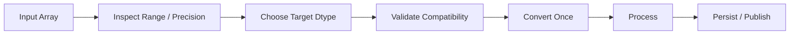
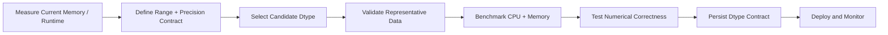

# 07- Dtype Optimization

## Overview

NumPy dtypes define how array elements are represented in memory and how numerical operations interpret those values.

Choosing an appropriate dtype affects:

```text
memory footprint
+
memory bandwidth
+
cache utilization
+
storage size
+
numerical precision
+
range
+
operation results
```

For production numerical workloads, dtype optimization is therefore not just a memory optimization. It is a data-contract decision.

The objective is not:

```text
use the smallest dtype possible
```

It is:

```text
use the smallest representation that safely satisfies
the required range, precision, semantics, and interoperability
```

A smaller dtype can reduce memory traffic and improve throughput for memory-bound workloads, but narrowing values can introduce overflow, precision loss, truncation, or incompatible downstream behavior.

## Why Dtypes Matter

NumPy arrays use fixed-size numerical representations.

For example:

```python
import numpy as np

values32 = np.empty(
    1_000_000,
    dtype=np.float32,
)

values64 = np.empty(
    1_000_000,
    dtype=np.float64,
)

print(
    values32.itemsize
)

print(
    values64.itemsize
)
```

Typical element sizes are:

```text
float32 → 4 bytes
float64 → 8 bytes
```

For one million elements:

```text
float32 → ~4 MB
float64 → ~8 MB
```

For hundreds of millions of elements, the difference becomes operationally significant.

## Dtype as a Data Contract

A dtype defines more than storage size.

It affects:

```text
representable values
+
precision
+
overflow behavior
+
underflow behavior
+
arithmetic results
+
interoperability
```

For example:

```python
values = np.array(
    [1, 2, 3],
    dtype=np.int16,
)
```

has a fixed integer range determined by the dtype.

The application should therefore select dtypes based on domain requirements rather than storage size alone.

## Common Numeric Dtypes

| Dtype | Typical Size | Typical Use |
|---|---:|---|
| `int8` | 1 byte | Small signed integer ranges |
| `uint8` | 1 byte | Non-negative small ranges, byte-like values |
| `int16` | 2 bytes | Moderate integer ranges |
| `uint16` | 2 bytes | Non-negative moderate ranges |
| `int32` | 4 bytes | General fixed-width integers |
| `uint32` | 4 bytes | Large non-negative identifiers/counts |
| `int64` | 8 bytes | Large integer ranges |
| `uint64` | 8 bytes | Very large non-negative integer ranges |
| `float16` | 2 bytes | Specialized low-precision workloads |
| `float32` | 4 bytes | Memory-sensitive floating-point workloads |
| `float64` | 8 bytes | Higher-precision general numerical processing |
| `bool` | 1 byte typically | Boolean masks and flags |

The exact suitability depends on:

```text
range
+
precision
+
operations
+
external system requirements
```

## Inspecting Dtypes

Useful attributes include:

```python
print(
    values.dtype
)

print(
    values.itemsize
)

print(
    values.nbytes
)
```

For range information:

```python
info = np.iinfo(
    np.int32
)

print(
    info.min
)

print(
    info.max
)
```

For floating-point information:

```python
info = np.finfo(
    np.float32
)

print(
    info.eps
)

print(
    info.max
)
```

These APIs are useful for validating whether a chosen dtype can safely represent the application's expected data.

## Integer Dtype Optimization

Integer optimization starts with the domain range.

Suppose an event count is guaranteed to remain between:

```text
0
and
10,000
```

A signed 16-bit integer can represent this range:

```python
counts = np.array(
    [0, 500, 10_000],
    dtype=np.int16,
)
```

Using `int64` for every such value would consume more storage than necessary.

However, the smaller type should only be selected if the domain invariant is real and enforced.

Do not optimize based on today's sample values:

```text
current maximum = 100
```

when the actual business contract may allow:

```text
future maximum = 100,000
```

## Signed vs Unsigned Integers

Use signed integers when negative values are valid:

```python
temperature_delta = np.array(
    [-10, 0, 10],
    dtype=np.int16,
)
```

Use unsigned integers only when negative values are semantically impossible:

```python
retry_count = np.array(
    [0, 1, 2],
    dtype=np.uint16,
)
```

Unsigned types can increase the non-negative range for the same number of bits, but they can also create surprising behavior when mixed with signed types.

Choose them deliberately rather than using them solely because the values happen to be non-negative.

## Integer Overflow

Integer arithmetic uses fixed-width representations.

For example:

```python
values = np.array(
    [30_000],
    dtype=np.int16,
)
```

Multiplying without considering the dtype can produce a result that does not fit safely in the original width.

Do not rely on business logic to prevent overflow without validating the range.

A safer approach is to promote deliberately when needed:

```python
values64 = values.astype(
    np.int64
)

result = values64 * 100
```

The conversion increases memory usage, but it makes the arithmetic contract explicit.

## Range Validation Before Narrowing

Before converting:

```python
values = values.astype(
    np.int16
)
```

validate that the values fit the target range.

For example:

```python
info = np.iinfo(
    np.int16
)

if np.any(
    values < info.min
) or np.any(
    values > info.max
):
    raise ValueError(
        "Values do not fit int16."
    )
```

This is safer than assuming conversion is valid.

For production ETL pipelines, range validation should happen before destructive narrowing.

## Floating-Point Dtypes

The common choices are:

```text
float32
float64
```

A smaller floating-point dtype reduces storage and memory traffic.

For example:

```python
values = np.asarray(
    raw_values,
    dtype=np.float32,
)
```

This can be appropriate when:

```text
precision requirements are known
+
range requirements are satisfied
+
downstream systems support float32
```

Use `float64` when the workload requires higher precision or when accumulation and numerical stability make the additional width worthwhile.

## Float Precision Is Not Just Decimal Places

Binary floating-point values do not represent decimal values exactly in general.

The important questions are:

```text
How much relative precision is required?
How large can the values become?
How sensitive is the computation to rounding?
How many operations are chained?
```

A dtype choice should therefore be based on numerical error requirements, not just statements such as:

```text
"I only need two decimal places."
```

For financial values requiring exact decimal semantics, consider `Decimal` or database `NUMERIC` rather than using floating-point dtype narrowing as the solution.

## Float32 vs Float64

| Concern | `float32` | `float64` |
|---|---|---|
| Storage | 4 bytes | 8 bytes |
| Memory traffic | Lower | Higher |
| Range | Lower | Higher |
| Precision | Lower | Higher |
| Memory-sensitive workloads | Often useful | More expensive |
| General numerical backend processing | Depends | Often safer default |
| Exact decimal semantics | No | No |

The correct choice depends on the application's numerical contract.

## Accumulation Precision

A particularly important issue is that the dtype of input data and the dtype used for accumulation are not always the same engineering choice.

For example:

```python
values = np.ones(
    10_000_000,
    dtype=np.float32,
)

total = np.sum(
    values,
)
```

For numerically sensitive reductions, consider the dtype used for the accumulator and output.

An explicit choice can make the numerical contract clearer:

```python
total = np.sum(
    values,
    dtype=np.float64,
)
```

This can increase arithmetic cost relative to a lower-precision accumulation but may improve numerical stability.

Do not assume that storing data in `float32` means every stage must also accumulate in `float32`.

## Dtype Promotion

NumPy may promote operands to a common dtype during operations.

For example:

```python
values = np.ones(
    1_000_000,
    dtype=np.float32,
)

scale = np.float64(1.05)

result = values * scale

print(
    result.dtype
)
```

The wider operand can influence the result dtype.

This matters because promotion can increase:

```text
output size
+
memory traffic
+
temporary storage
```

Inspect the resulting dtype in memory-sensitive pipelines.

## Avoid Accidental Promotion

A pipeline can unexpectedly widen its arrays through constants or intermediate operations.

For example:

```python
values = np.ones(
    10_000_000,
    dtype=np.float32,
)

result = values * 1.05
```

The resulting dtype should be checked rather than assumed.

When the numerical contract permits it, use an explicitly typed scalar:

```python
scale = np.float32(
    1.05
)

result = values * scale
```

This can help preserve the intended dtype behavior.

Always verify the actual result dtype for the NumPy version and operation being used.

## Dtype and Memory Bandwidth

Suppose a workload scans:

```text
500 million elements
```

A larger dtype requires more bytes to be moved through memory.

If the computation is memory-bound, reducing dtype width can improve throughput because the CPU and memory subsystem have less data to transfer.

The improvement is workload-dependent.

It may be meaningful for:

```text
simple arithmetic
+
large arrays
+
sequential access
```

but much less important when the workload is dominated by:

```text
database access
+
network latency
+
complex computation
+
serialization
```

## Dtype and CPU Cache

Smaller elements also allow more values to fit into CPU cache at once.

Conceptually:

```text
same cache size
+
smaller elements
=
more elements resident
```

This can improve locality for workloads that repeatedly access nearby values.

However, cache behavior is workload-specific. Do not assume that reducing dtype width automatically produces a proportional speedup.

## Dtype and Storage

Dtype size also affects:

```text
.npy size
+
memory-mapped file size
+
Parquet / binary output representation
+
network transfer
+
object-storage cost
```

For large datasets, choosing a suitable dtype can reduce infrastructure cost in addition to runtime memory usage.

The savings become more significant when the data is:

```text
large
+
frequently transferred
+
frequently reprocessed
```

## Safe Dtype Downcasting

Downcasting should be treated as a validation problem.

A safe pipeline is:



Do not use:

```python
values = values.astype(
    np.float32
)
```

as a blind optimization.

Instead:

```text
measure
→ validate
→ convert
→ compare correctness
→ benchmark
```

## Example: Integer Downcasting

Suppose an application receives counts:

```python
counts = np.array(
    [10, 20, 30, 40],
    dtype=np.int64,
)
```

If the system contract guarantees:

```text
0 ≤ value ≤ 65,535
```

then `uint16` may be appropriate.

```python
info = np.iinfo(
    np.uint16
)

if np.any(
    counts < info.min
) or np.any(
    counts > info.max
):
    raise ValueError(
        "Counts exceed uint16 range."
    )

counts = counts.astype(
    np.uint16
)
```

This reduces each element from 8 bytes to 2 bytes.

The conversion should happen at a controlled boundary rather than repeatedly throughout the pipeline.

## Example: Float Downcasting

Suppose a workload has measured tolerances that permit `float32`.

```python
values = np.asarray(
    raw_values,
    dtype=np.float64,
)

values32 = values.astype(
    np.float32
)
```

Before adopting this in production, test:

```text
range
+
relative error
+
aggregation error
+
serialization
+
downstream compatibility
```

Do not determine suitability from storage size alone.

## Dtype and Missing Values

Integer arrays cannot directly represent `NaN` as a floating-point missing marker.

For example:

```python
values = np.array(
    [1, 2, np.nan],
    dtype=np.float64,
)
```

requires a floating-point representation.

If a pipeline requires:

```text
integer semantics
+
missing values
```

consider a separate validity representation:

```text
values
+
validity mask
```

For example:

```python
values = np.array(
    [10, 20, 0],
    dtype=np.int32,
)

valid = np.array(
    [True, True, False],
    dtype=bool,
)
```

This can preserve compact integer storage while representing missingness explicitly.

## Dtype and Boolean Masks

Boolean masks are often suitable for validation and selection:

```python
valid = np.isfinite(
    values
)
```

A boolean mask is typically compact compared with a full numerical array, but it still occupies memory.

In large pipelines:

```text
source array
+
mask
+
selected output
```

can become a significant working set.

Dtype optimization therefore applies to the complete pipeline, not only the primary data array.

## Dtype and Structured Arrays

Structured arrays can contain fields with different dtypes:

```python
schema = np.dtype(
    [
        ("id", np.int64),
        ("amount", np.float32),
        ("status", np.uint8),
    ]
)
```

This allows each field to use an appropriate representation.

The trade-off is increased schema complexity.

For production fixed-format data, verify:

```text
field range
+
alignment
+
byte order
+
binary interoperability
```

before narrowing fields.

## Dtype and Record Arrays

Record arrays use structured-array storage.

The same dtype principles apply:

```text
field widths
+
alignment
+
storage size
+
downstream compatibility
```

Do not reduce a field's width merely because current values fit.

The schema must define the intended future range.

## Dtype and File Formats

When writing:

```python
np.save(
    "values.npy",
    values,
)
```

the dtype becomes part of the stored array representation.

Changing:

```text
float64
→
float32
```

therefore changes the persisted data contract.

For long-lived datasets, track:

```text
schema version
+
dtype
+
shape
+
units / semantics
```

This becomes important when different application versions process the same files.

## Dtype and Memory-Mapped Arrays

Memory mapping makes dtype selection particularly consequential.

For:

```python
values = np.load(
    "large.npy",
    mmap_mode="r",
)
```

the file's dtype determines:

```text
bytes per element
+
file size
+
page density
+
memory traffic
```

A smaller representation can reduce storage and I/O costs, but conversion during processing may create larger temporary arrays.

For example:

```python
values32 = values.astype(
    np.float32
)
```

may still require an additional allocation.

The best result may be to store the data in the dtype that matches the dominant workload instead of converting it repeatedly.

## Dtype Conversion Cost

A conversion:

```python
values.astype(
    np.float32
)
```

requires processing the elements and generally creating new storage.

For large arrays, this means:

```text
read source
+
convert
+
write destination
```

If conversion happens once and remains useful for many downstream steps, the cost can be amortized.

If conversion happens repeatedly inside a hot loop, it can become a major bottleneck.

## Convert Once at Boundaries

A robust pattern is:

```text
ingestion
→ validate
→ normalize dtype once
→ processing
→ output
```

rather than:

```text
stage A → float32
stage B → float64
stage C → float32
stage D → float64
```

Repeated dtype changes cause:

```text
allocation
+
data movement
+
CPU cost
+
peak memory growth
```

Treat dtype normalization as part of the pipeline contract.

## In-Place Operations and Dtypes

In-place arithmetic has dtype constraints.

For example:

```python
values = np.array(
    [1, 2, 3],
    dtype=np.int32,
)

values *= 1.5
```

An in-place operation cannot arbitrarily replace integer storage with floating-point representation without changing the array's dtype and buffer semantics.

NumPy therefore applies casting rules when deciding whether an in-place operation is valid.

If a computation requires a different dtype:

```python
values = values.astype(
    np.float64
)

values *= 1.5
```

Make the promotion explicit when it is part of the intended design.

## `astype(copy=False)`

You may encounter:

```python
converted = values.astype(
    np.float32,
    copy=False,
)
```

`copy=False` is a request to avoid a copy when possible.

It does not guarantee that no copy will occur.

If dtype conversion is required, NumPy generally must create new storage.

This distinction is important in performance-sensitive code:

```text
copy=False
≠
zero-copy guarantee
```

## `np.asarray()` and Dtype

`np.asarray()` can be useful at API boundaries:

```python
values = np.asarray(
    input_values,
    dtype=np.float32,
)
```

It can reuse an existing compatible NumPy array rather than copying unnecessarily.

But if dtype conversion is required:

```text
different dtype
→ conversion
→ new representation
```

may occur.

This makes `np.asarray()` useful for normalizing inputs while avoiding some unnecessary copies.

## Dtype Optimization and Python Lists

Python integers and floats do not have the same fixed-width representation as NumPy numeric dtypes.

This means:

```python
values = [
    1,
    2,
    3,
]
```

cannot be compared directly to:

```python
values = np.array(
    [1, 2, 3],
    dtype=np.int8,
)
```

as if only the element width changed.

The underlying data model is different.

Dtype optimization is therefore particularly valuable once data is represented as NumPy arrays.

## Dtype and Pandas

Pandas provides higher-level dtype management for tabular data.

A pipeline might look like:

```text
CSV / Parquet
→ Pandas schema
→ selected numeric columns
→ NumPy representation
→ numerical processing
```

When moving between Pandas and NumPy:

```text
dtype compatibility
+
copy behavior
+
memory usage
```

must be considered.

Do not repeatedly convert a large DataFrame to NumPy, change dtype, then convert it back unless the transformation genuinely requires it.

## Dtype and PostgreSQL

Database types also form part of the numerical contract.

For example:

```text
PostgreSQL INTEGER
PostgreSQL BIGINT
PostgreSQL NUMERIC
```

have different semantics from:

```text
np.int32
np.int64
np.float32
np.float64
```

Do not blindly map database columns solely by name.

Consider:

```text
range
+
signedness
+
precision
+
exactness
+
nullability
```

For monetary values, PostgreSQL `NUMERIC` may be preferable to floating-point storage when exact decimal semantics are required.

## Dtype and API Contracts

For REST and gRPC systems, the serialized representation can differ from the internal NumPy representation.

A useful architecture is:

```text
external contract
→ validate
→ internal dtype normalization
→ numerical processing
→ convert to external representation
```

Do not expose internal dtype assumptions as implicit API behavior.

For example, an API client may send JSON numbers while the numerical processing layer internally uses `float32`.

The conversion should be deliberate and tested.

## Production Memory Budget

Consider a Kubernetes worker with:

```text
2 GiB memory limit
```

and an input array:

```text
150 million float64 values
```

The raw array alone requires approximately:

```text
150,000,000 × 8 bytes
≈ 1.2 GB
```

A conversion to `float32` can reduce that raw buffer to approximately:

```text
600 MB
```

but performing the conversion while keeping the original alive can temporarily require both:

```text
1.2 GB source
+
600 MB destination
```

plus:

```text
application memory
+
temporary arrays
+
Python runtime
```

This demonstrates why dtype optimization must consider transition cost and peak memory, not only final storage size.

## Dtype Optimization and Batch Processing

When conversion itself is expensive or memory-constrained, process in batches:

```python
def convert_batches(
    values: np.ndarray,
    batch_size: int,
) -> list[np.ndarray]:
    outputs = []

    for start in range(
        0,
        values.shape[0],
        batch_size,
    ):
        batch = values[
            start:start + batch_size
        ]

        outputs.append(
            batch.astype(
                np.float32
            )
        )

    return outputs
```

For genuinely large datasets, returning a list of all batches can still defeat the memory objective.

A production pipeline should generally persist or consume each batch before moving to the next.

## Benchmarking Dtype Choices

Compare both runtime and memory characteristics.

```python
import timeit
import numpy as np

setup = """
import numpy as np

values32 = np.ones(
    20_000_000,
    dtype=np.float32,
)

values64 = values32.astype(
    np.float64
)
"""

float32_stmt = """
result = values32 * np.float32(1.05)
"""

float64_stmt = """
result = values64 * np.float64(1.05)
"""

time32 = timeit.timeit(
    float32_stmt,
    setup=setup,
    number=10,
)

time64 = timeit.timeit(
    float64_stmt,
    setup=setup,
    number=10,
)

print(
    f"float32={time32:.4f}s"
)

print(
    f"float64={time64:.4f}s"
)
```

This benchmark should be interpreted together with:

```text
result dtype
+
peak memory
+
numerical error
+
CPU utilization
```

Do not select a dtype solely because one benchmark is faster.

## Correctness Testing

Dtype changes require stronger tests.

For exact integer transformations:

```python
np.testing.assert_array_equal(
    expected,
    actual,
)
```

For floating-point transformations:

```python
np.testing.assert_allclose(
    expected,
    actual,
    rtol=1e-5,
    atol=1e-6,
)
```

The tolerance must come from the application's numerical contract.

Also test:

- Minimum values.
- Maximum values.
- Boundary values.
- Negative values where applicable.
- Large magnitudes.
- NaN.
- Infinity.
- Missing-value handling.
- Aggregations.
- Serialization round-trips.

## Common Mistakes

### Choosing the Smallest Dtype Without a Domain Contract

Current sample values do not define the future valid range.

### Assuming Smaller Always Means Faster

Smaller dtypes can improve memory behavior, but conversion costs, unsupported operations, precision issues, or downstream constraints can offset the benefit.

### Ignoring Overflow

Fixed-width integers can overflow or otherwise produce incorrect results when values exceed representable ranges.

### Assuming Float32 Is "Good Enough"

Precision requirements depend on the operation, value range, number of operations, and acceptable numerical error.

### Repeatedly Converting Dtypes

Repeated `astype()` operations can create substantial allocation and memory traffic.

### Ignoring Accumulation Precision

Storing inputs in `float32` does not automatically mean reductions should accumulate in `float32`.

### Assuming `copy=False` Guarantees No Copy

It is a request, not a guarantee.

### Mixing Dtypes Accidentally

An unexpected wider operand can promote an entire result and increase memory usage.

### Using Floating-Point for Exact Money

Floating-point arithmetic does not provide exact decimal semantics. Use an appropriate exact representation when required.

### Narrowing Without Validation

Converting to a smaller integer or floating-point dtype without checking range and precision can silently corrupt data.

## Production Dtype Workflow

A reliable dtype-optimization workflow is:



The dtype should be treated as part of the dataset or service contract.

Record when appropriate:

```text
dtype
+
shape
+
schema version
+
units
+
range assumptions
+
precision requirements
```

## Monitoring Dtype Regressions

A production pipeline can accidentally widen dtypes during refactoring.

Monitor or validate:

```python
expected_dtype = np.dtype(
    np.float32
)

if values.dtype != expected_dtype:
    raise TypeError(
        f"Unexpected dtype: {values.dtype}"
    )
```

At system level, monitor:

```text
input bytes
+
peak memory
+
processing latency
+
output bytes
```

A sudden increase in all four can indicate an unintended dtype widening.

## Production Decision Matrix

| Requirement | Typical Choice |
|---|---|
| Small bounded integer range | Smaller signed integer |
| Non-negative bounded counts | Suitable unsigned integer |
| Large integer identifiers | `int64` or required external type |
| Memory-sensitive floating-point workload | `float32` when validated |
| Higher numerical precision | `float64` |
| Exact decimal financial semantics | `Decimal` / database `NUMERIC` |
| Boolean state | `bool` |
| Missing values with integer semantics | Integer array + validity mask |
| Mixed fixed-schema fields | Structured dtype |
| Unknown range or precision | Start wider, measure, then optimize |

## Interview Questions

### Why do dtypes affect NumPy performance?

They determine element size and therefore influence memory footprint, memory bandwidth, cache utilization, storage, and the amount of data processed by numerical operations.

### Why can a smaller dtype improve performance?

When a workload is memory-bound, moving fewer bytes can reduce memory traffic and improve cache utilization.

### Why can a smaller dtype be dangerous?

It may have insufficient numeric range or precision, causing overflow, underflow, rounding error, or loss of correctness.

### How do you choose an integer dtype?

Start from the domain's guaranteed minimum and maximum values, then select the smallest dtype that safely represents the complete contract.

### Is `float32` always faster than `float64`?

No. Performance depends on the workload, CPU, memory system, operation, and other factors.

### What is dtype promotion?

It is the process by which NumPy determines a common or suitable dtype for an operation involving operands with different dtypes.

### Why should you inspect the result dtype?

Because mixed-dtype operations can produce a wider result than expected, increasing memory usage and potentially changing numerical behavior.

### Why is `astype()` important for performance?

It usually creates a new representation when the dtype changes, requiring additional allocation and data conversion.

### Does `astype(copy=False)` guarantee zero-copy conversion?

No. It only requests avoidance of copying when possible.

### How can you optimize dtype without breaking correctness?

Define the range and precision contract, validate representative and boundary data, convert once at a controlled boundary, benchmark memory/runtime, and test numerical equivalence within the required tolerance.

### How does dtype optimization interact with Kubernetes?

A smaller valid dtype can reduce worker memory pressure, but the temporary source and destination arrays during conversion can still exceed the container limit.

### How does dtype choice affect memory-mapped arrays?

The dtype determines the file's bytes per element, total storage size, and memory traffic during processing. Changing dtype after mapping can require an additional large conversion buffer.

### Why might `float64` still be preferable even when `float32` saves memory?

Higher precision may be required for numerical stability, accumulation, interoperability, or downstream correctness.

## Key Takeaways

- Dtype selection is a correctness and performance decision that controls memory footprint, numerical range, precision, memory bandwidth, and storage size.
- Smaller dtypes can improve memory-bound workloads, but only when their range and precision satisfy the complete application contract.
- Validate before narrowing, avoid repeated dtype conversions, and treat `astype()` as a potentially expensive allocation and data-movement operation.
- Mixed-dtype operations can promote results unexpectedly, while accumulation may require a wider dtype than the stored input values.
- In production, define dtype as part of the data contract and evaluate runtime, peak memory, storage, interoperability, and numerical correctness together.