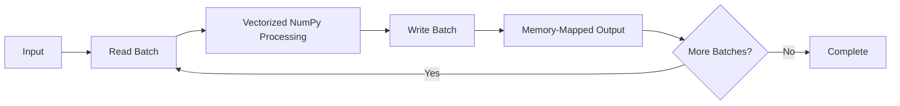
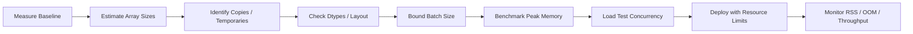

# 08- Memory Usage

## Overview

Memory usage is one of the most important performance concerns when processing large numerical datasets with NumPy.

An array's raw memory footprint is determined primarily by:

```text
number of elements
×
dtype size
```

but real process memory is more complicated because NumPy workloads can also create:

```text
input arrays
+
views
+
copies
+
temporary arrays
+
boolean masks
+
broadcasted outputs
+
Python objects
+
library/runtime overhead
```

A production optimization therefore needs to answer two separate questions:

```text
How much memory does the array data require?
```

and:

```text
How much peak memory does the complete operation require?
```

The second question is usually more important in backend systems because excessive peak memory can cause:

```text
container OOM
→ worker termination
→ task retry
→ repeated resource consumption
```

## NumPy Memory Model

A NumPy `ndarray` contains metadata describing an underlying data buffer.

Conceptually:

```text
ndarray
├── data buffer
├── dtype
├── shape
├── strides
└── metadata
```

The data buffer contains the numerical values.

The array metadata determines how NumPy interprets and traverses those bytes.

This means two arrays can:

```text
have the same values
+
have the same logical shape
```

while differing in:

```text
dtype
+
strides
+
contiguity
+
ownership
```

and therefore having different memory behavior.

## `itemsize`

`itemsize` returns the number of bytes used by each element:

```python
import numpy as np

values = np.empty(
    1_000_000,
    dtype=np.float64,
)

print(
    values.itemsize
)
```

For common dtypes:

```text
float32 → 4 bytes
float64 → 8 bytes
int32   → 4 bytes
int64   → 8 bytes
```

The dtype determines the value representation and therefore the raw storage cost.

## `nbytes`

`nbytes` reports the size of the array's data buffer:

```python
print(
    values.nbytes
)
```

For example:

```python
values = np.empty(
    10_000_000,
    dtype=np.float64,
)

print(
    values.nbytes / 1024**2
)
```

This gives the approximate data-buffer size in MiB.

Important:

```text
nbytes
≠
total Python process memory
```

A process can consume substantially more memory because of:

- Array metadata.
- Temporary arrays.
- Python objects.
- Imported libraries.
- Allocator overhead.
- File buffers.
- Application state.
- Other workers or threads.

## Estimating Array Size

A simple estimate is:

```text
elements × dtype.itemsize
```

For example:

```python
elements = 100_000_000

bytes_required = (
    elements
    * np.dtype(np.float64).itemsize
)

print(
    f"{bytes_required / 1024**3:.2f} GiB"
)
```

For multidimensional arrays:

```python
rows = 10_000_000
columns = 32

bytes_required = (
    rows
    * columns
    * np.dtype(np.float64).itemsize
)
```

This estimate is useful before creating an array.

## Memory Budgeting

A production worker should have a memory budget rather than assuming the host has enough RAM.

For example:

```text
container limit      = 4 GiB
input array          = 1.2 GiB
working copy         = 1.2 GiB
temporary result     = 1.2 GiB
application overhead = remaining capacity
```

This design is already unsafe because peak memory can exceed the nominal 4 GiB limit.

A better approach is to determine:

```text
maximum input size
+
batch size
+
maximum temporary memory
+
worker concurrency
```

before deployment.

## Peak Memory vs Final Memory

Consider:

```python
result = values * 1.05
```

The final result may be the same size as `values`.

At some point, however, both arrays may coexist:

```text
input
+
result
```

If another operation creates a temporary:

```python
result = (
    values * 1.05
    + 100
)
```

peak memory can become larger than the final result size.

This leads to a critical distinction:

```text
final memory
≠
peak memory
```

Production memory planning should use peak working-set estimates.

## Temporary Arrays

Temporary arrays are one of the most common causes of unexpected memory growth.

Consider:

```python
result = (
    values * 1.05
    + offset
) / scale
```

Conceptually, there may be multiple intermediate results:

```text
temporary_1 = values * 1.05
temporary_2 = temporary_1 + offset
result = temporary_2 / scale
```

The exact implementation depends on the operations, but the engineering concern remains:

```text
multiple full-size arrays
→ higher peak memory
```

For large arrays, this can be much more important than Python object overhead.

## Reducing Temporary Allocations

Use output buffers when appropriate:

```python
result = np.empty_like(
    values
)

np.multiply(
    values,
    1.05,
    out=result,
)

np.add(
    result,
    offset,
    out=result,
)

np.divide(
    result,
    scale,
    out=result,
)
```

This can reduce the number of simultaneous full-size arrays.

The trade-off is increased code complexity.

Use explicit buffer reuse when:

```text
arrays are large
+
memory pressure is real
+
profiling identifies allocation as a bottleneck
```

Do not introduce it everywhere.

## In-Place Operations

In-place operations can reduce allocations:

```python
values *= 1.05
```

instead of:

```python
values = values * 1.05
```

The first form can reuse the existing buffer when the operation is valid for the dtype and layout.

The trade-off is mutation.

In-place operations can be dangerous when:

```text
the original values are needed later
+
the array is shared
+
the array is a view
+
the function contract promises non-mutation
```

Use in-place operations only when ownership is clear.

## Views and Memory Usage

Views can reduce memory usage because they reuse the underlying buffer.

```python
batch = values[
    1_000_000:2_000_000
]
```

The slice commonly shares storage with `values`.

This is useful for batch processing because creating the slice does not necessarily duplicate the selected data.

However, views have an important lifetime implication.

A small view can retain a large source buffer:

```python
large = np.empty(
    100_000_000,
    dtype=np.float64,
)

small = large[:10]
```

`small` may keep the large underlying allocation alive.

If the small subset must survive independently:

```python
small = large[:10].copy()
```

The copy costs memory initially but allows the large source buffer to be released once no longer referenced.

## Copies and Peak Memory

Copies are often more expensive than expected.

```python
copy = values.copy()
```

can require:

```text
source allocation
+
destination allocation
+
memory bandwidth
```

If `values` is large, the copy may temporarily double the memory associated with that data.

This becomes particularly important when:

```text
input = 2 GiB
copy  = 2 GiB
```

inside a container with a 4 GiB memory limit.

Additional process memory can make the workload fail before the copy completes.

## Boolean Masks

Boolean filtering is another common memory source:

```python
valid = values > 0

selected = values[
    valid
]
```

The operation can require:

```text
values
+
boolean mask
+
selected result
```

For large arrays, this can produce a significant peak working set.

If only a count is needed:

```python
count = np.count_nonzero(
    values > 0
)
```

the selected numerical array is not required.

If only an aggregate is needed, use appropriate reduction patterns:

```python
total = np.sum(
    values,
    where=values > 0,
)
```

The mask still consumes memory, but the full filtered array does not.

## Broadcasting and Memory

Broadcasting avoids explicit replication of an input operand:

```python
values = np.ones(
    (10_000_000, 8),
    dtype=np.float64,
)

weights = np.ones(
    8,
    dtype=np.float64,
)

result = values * weights
```

The `weights` array does not need to be explicitly repeated to `(10_000_000, 8)`.

However, `result` still contains:

```text
80,000,000 elements
```

and therefore requires substantial memory.

Broadcasting reduces input replication costs, not output costs.

## Dangerous Broadcasts

Two moderate arrays can produce a huge result:

```python
left = np.ones(
    (50_000, 1),
)

right = np.ones(
    (1, 50_000),
)

result = left + right
```

The result shape becomes:

```text
(50_000, 50_000)
```

Before performing such an operation, estimate:

```text
result elements
×
result dtype size
```

For user-controlled data, enforce maximum output-size limits before executing the operation.

## Dtype and Memory Usage

Dtype is one of the largest controllable memory factors.

For example:

```python
float32_values = np.empty(
    100_000_000,
    dtype=np.float32,
)

float64_values = np.empty(
    100_000_000,
    dtype=np.float64,
)
```

The second array requires roughly twice the raw data-buffer memory.

Smaller dtypes can reduce:

```text
RAM
+
memory bandwidth
+
cache pressure
+
file size
```

but only when the numerical contract allows them.

Memory optimization should never sacrifice required:

```text
range
+
precision
+
correctness
```

## Dtype Promotion

A mixed-dtype operation can increase the size of the result:

```python
values = np.ones(
    10_000_000,
    dtype=np.float32,
)

scale = np.float64(
    1.05
)

result = values * scale
```

Inspect:

```python
print(
    result.dtype
)
```

An unexpected wider dtype can increase:

```text
result size
+
memory traffic
+
peak memory
```

Dtype normalization should therefore happen deliberately at processing boundaries.

## Contiguous vs Non-Contiguous Arrays

A contiguous array generally provides a regular memory layout.

A view can be non-contiguous:

```python
values = np.arange(
    1_000_000,
    dtype=np.float64,
)

strided = values[::2]
```

The view avoids a copy but uses a larger stride.

A downstream operation might prefer a contiguous representation:

```python
contiguous = np.ascontiguousarray(
    strided
)
```

This can improve repeated access patterns but creates another allocation.

Memory optimization must therefore balance:

```text
copy cost
vs
future access cost
```

## Memory-Mapped Arrays

For very large datasets:

```python
values = np.load(
    "large_values.npy",
    mmap_mode="r",
)
```

Memory mapping avoids eagerly loading the entire data buffer into application memory.

It is useful when:

```text
dataset > comfortable RAM
+
processing can be batched
```

However, accessed pages still consume memory and storage I/O remains relevant.

Memory mapping should be combined with:

```text
bounded batch sizes
+
suitable access patterns
+
controlled output allocation
```

## Batch Processing

Batch processing is often the most practical memory-control strategy.

```python
def process_in_batches(
    values: np.ndarray,
    batch_size: int,
) -> None:
    for start in range(
        0,
        values.shape[0],
        batch_size,
    ):
        batch = values[
            start:start + batch_size
        ]

        result = (
            batch * 1.05
        )

        persist(
            result
        )
```

The goal is:

```text
bounded input
+
bounded temporary arrays
+
bounded output
```

rather than trying to fit the entire transformation into RAM.

## Batch Size Trade-offs

A smaller batch reduces peak memory:

```text
less memory
+
more iterations
```

A larger batch can improve:

```text
throughput
+
vectorized efficiency
+
amortization of Python overhead
```

but increases:

```text
working set
+
temporary memory
```

Choose batch size through measurement.

A practical tuning process is:

```text
safe baseline
→ benchmark
→ observe memory
→ increase gradually
→ stop at diminishing returns
```

## Streaming Output

A common memory mistake is to process in batches and then rebuild the entire result:

```python
outputs = []

for batch in batches:
    outputs.append(
        process(batch)
    )

result = np.concatenate(
    outputs
)
```

This still requires enough memory for all output batches and the final concatenated array.

For very large jobs, write each batch directly to:

```text
.npy output
+
memory-mapped destination
+
Parquet
+
S3
+
database
```

instead of collecting the full result in RAM.

## Preallocated Output

When output size is known, preallocation can reduce repeated allocations:

```python
result = np.empty_like(
    values
)

for start in range(
    0,
    values.shape[0],
    batch_size,
):
    end = min(
        start + batch_size,
        values.shape[0],
    )

    result[start:end] = process(
        values[start:end]
    )
```

This keeps a single destination buffer.

The trade-off is that the entire output still resides in memory.

For outputs that exceed the worker's budget, use persistent streaming instead.

## Memory Usage in API Services

A FastAPI or Django endpoint can accidentally create multiple copies of a request payload:

```text
HTTP body
→ Python objects
→ NumPy array
→ dtype-converted array
→ contiguous copy
→ result array
```

If every representation is retained simultaneously, peak memory can become much larger than the raw request size.

For large numerical requests, validate:

```text
maximum payload bytes
+
maximum element count
+
maximum dimensions
+
dtype
```

and consider asynchronous processing.

## FastAPI Example

A bounded numerical endpoint might normalize input once:

```python
import numpy as np


def process_payload(
    payload: list[float],
) -> list[float]:
    values = np.asarray(
        payload,
        dtype=np.float32,
    )

    if values.size > 1_000_000:
        raise ValueError(
            "Payload is too large."
        )

    result = values * np.float32(
        1.05
    )

    return result.tolist()
```

The example demonstrates an important principle:

```text
validate resource requirements
before expensive array processing
```

For larger workloads, the data should generally be staged and processed asynchronously.

## Kubernetes Memory Limits

Containerized NumPy workers should have explicit memory limits.

For example:

```text
input data
+
copy
+
result
+
temporary arrays
+
Python process
```

must fit inside:

```text
container memory limit
```

Otherwise:

```text
allocation failure
→ OOM kill
→ task failure
→ retry
```

Retries can amplify the problem if the same oversized input is repeatedly processed.

Memory constraints should therefore be part of job admission and batch sizing.

## Celery Workers

A Celery worker processing large numerical data should avoid unbounded full-dataset operations.

A safer pattern is:

```text
Celery task
→ open input
→ process bounded batch
→ persist result
→ release temporary arrays
→ next batch
```

Worker concurrency must also be considered.

If one task requires:

```text
1 GB peak memory
```

then starting 8 such tasks in the same container can require several gigabytes of working memory even when each task is individually correct.

## Worker Concurrency and Memory

Total worker memory roughly follows:

```text
number of concurrent numerical tasks
×
peak memory per task
```

plus process and platform overhead.

Increasing concurrency can improve throughput only until a resource becomes saturated.

For memory-heavy workloads, lowering concurrency can be a performance optimization because it prevents:

```text
swapping
+
OOM kills
+
CPU contention
```

This is particularly important in Celery and Kubernetes deployments.

## PostgreSQL Interaction

Memory usage can be reduced before NumPy processing begins.

Suppose a database contains:

```text
100 million records
```

but the numerical task only needs:

```text
active records
+
two numeric columns
+
one date range
```

Do the filtering in PostgreSQL when appropriate:

```text
PostgreSQL
→ reduce rows / columns
→ transfer smaller dataset
→ NumPy processing
```

Avoid:

```text
PostgreSQL
→ load everything
→ NumPy filters most records out
```

Memory optimization should therefore include upstream data reduction.

## Pandas Interaction

Pandas may be the correct ingestion and tabular transformation layer, but conversions can increase memory usage.

For example:

```python
values = dataframe[
    ["price", "quantity"]
].to_numpy(
    dtype=np.float32,
)
```

The resulting array may require allocation or dtype conversion.

Avoid repeated:

```text
Pandas
→ NumPy
→ Pandas
→ NumPy
```

transitions for large datasets.

Choose a representation for each stage and minimize unnecessary conversion.

## Memory-Mapped Output

A memory-mapped destination can be useful when the complete output must exist as a large array but cannot fit comfortably in RAM.

Conceptually:



This creates a persistent file-backed destination rather than collecting every result in memory.

The file layout and metadata must remain part of the processing contract.

## Memory Usage in File Pipelines

For numerical file processing:

```text
input file
→ parser / mmap
→ validation
→ batch
→ transform
→ output
```

track:

```text
input size
+
batch size
+
temporary arrays
+
output buffer
```

A pipeline that reads a file efficiently can still fail because the transformation creates multiple full-size intermediate arrays.

## Monitoring Memory

Production numerical jobs should monitor:

```text
process RSS
peak RSS
input size
output size
batch size
CPU utilization
processing latency
OOM events
container restarts
```

For Linux-based containers, process RSS is generally more useful operationally than `array.nbytes` alone.

At application level, log:

```text
dataset identifier
dtype
shape
batch size
estimated bytes
processing duration
```

where the information is safe to expose.

## Estimating Working Set

A useful mental model is:

```text
peak memory
≈
live inputs
+
live outputs
+
temporary arrays
+
masks
+
conversion buffers
+
runtime overhead
```

For example:

```text
input                  800 MB
copy                   800 MB
temporary              800 MB
result                 800 MB
mask                   100 MB
runtime / application  400 MB
--------------------------------
approximate peak      3.7 GB
```

This is not an exact RSS calculation, but it is a useful capacity-planning model.

## Python Memory vs NumPy Memory

A NumPy array's data buffer is only part of total process memory.

Python itself allocates memory for:

```text
objects
+
lists
+
dictionaries
+
function state
+
framework state
```

For backend services, this means a NumPy worker may have substantial non-array memory.

Do not provision a container at:

```text
container memory = sum(array.nbytes)
```

Leave headroom for the application and runtime.

## Garbage Collection and Reference Lifetime

Python releases objects when references disappear, but large numerical allocations may not always translate directly into an immediate reduction in process RSS visible to the operating system.

The application should therefore avoid creating unnecessary large temporaries rather than relying on garbage collection or allocator behavior to solve memory pressure.

A good design minimizes:

```text
allocation
+
retention
+
simultaneous large objects
```

## Deleting Large Arrays

Explicitly removing references can make intent clearer:

```python
del temporary
```

This can make the object eligible for release when there are no other references.

However, `del` should not be used as the primary memory-management strategy.

A better design is to keep scopes and lifetimes small:

```python
def process_batch(
    batch: np.ndarray,
) -> np.ndarray:
    temporary = (
        batch * 1.05
    )

    return temporary
```

Use structured pipeline stages rather than relying on manual cleanup everywhere.

## Memory Usage and Views

A subtle issue is retaining large backing storage through small views.

For example:

```python
def extract_identifier(
    values: np.ndarray,
) -> np.ndarray:
    return values[:100]
```

If the result is cached for a long time, it can retain the complete source array.

Prefer:

```python
def extract_identifier(
    values: np.ndarray,
) -> np.ndarray:
    return values[:100].copy()
```

when the small result needs an independent lifetime.

This is a useful example of a case where:

```text
copying saves memory
```

over the lifetime of the application, even though the copy initially increases memory.

## Security and Resource Exhaustion

Memory exhaustion can be a security issue when numerical workloads accept untrusted input.

Potential attack patterns include:

```text
huge array dimensions
+
large broadcast operations
+
massive index arrays
+
expensive dtype conversions
+
repeated large requests
```

Apply limits at multiple layers:

```text
Nginx / load balancer
→ request size
→ application validation
→ worker resource limits
→ container memory limit
```

For background workers, enforce maximum dataset and batch sizes before creating large arrays.

## Production Optimization Workflow

Use a systematic workflow:



Do not optimize memory based only on `nbytes`.

Measure the complete process under realistic workloads.

## Common Mistakes

### Treating `nbytes` as Process Memory

`nbytes` only covers an array's data buffer.

### Ignoring Temporary Arrays

A simple expression can create multiple large intermediates.

### Copying Every Batch

Defensive copies can dominate both runtime and peak memory.

### Returning Tiny Views of Huge Arrays

A small long-lived view can retain an enormous source buffer.

### Collecting All Batch Outputs

Appending processed batches to a list and concatenating later can recreate the same memory problem batching was intended to solve.

### Using Oversized Dtypes

Larger dtypes increase memory footprint and memory traffic.

### Ignoring Worker Concurrency

Several individually valid tasks can collectively exceed the container's memory limit.

### Relying on `del` to Fix Poor Memory Design

Manual deletion does not compensate for excessive simultaneous allocations.

### Ignoring Upstream Filtering

Pulling unnecessary rows from PostgreSQL or objects from S3 increases memory requirements downstream.

### Assuming Memory Mapping Eliminates Memory Pressure

Mapped pages, output arrays, temporaries, and operating-system cache behavior still contribute to resource usage.

## Production Decision Matrix

| Situation | Preferred Strategy |
|---|---|
| Small in-memory dataset | Normal ndarray operations |
| Large contiguous slice | Use views when ownership permits |
| Large independent result | Explicit copy only when required |
| Large source dataset | Batch processing / memory mapping |
| Large temporary expression | Use `out=` or staged operations |
| User-controlled numerical input | Apply size and element limits |
| Large API workload | Async processing + bounded batches |
| Heavy Celery numerical tasks | Control worker concurrency |
| Large database source | Filter/project in SQL first |
| Tiny long-lived subset | Copy to release large backing buffer |
| Memory-bound workload | Smaller valid dtype + fewer copies |
| Unknown memory behavior | Measure peak RSS |

## Interview Questions

### What does `nbytes` measure?

It measures the size of an array's data buffer, not the complete memory usage of the Python process.

### Why can peak memory exceed the sum of the final arrays?

Because inputs, temporaries, masks, copies, conversion buffers, Python objects, and application/runtime overhead can coexist during execution.

### Why are copies expensive?

They require additional allocation and movement of the underlying data, consuming both memory and memory bandwidth.

### Why can a view reduce memory?

A view can reuse the existing data buffer rather than allocating a second full-size buffer.

### Can a small NumPy view retain a large amount of memory?

Yes. The view can keep its source array's underlying data buffer alive.

### How does dtype affect memory usage?

Each element occupies a fixed amount of storage determined by its dtype. Wider dtypes therefore increase the raw buffer size.

### Why can boolean filtering be memory-intensive?

It may require both a boolean mask and a newly allocated selected result.

### How can broadcasting cause an OOM?

Compatible shapes can produce a much larger output array than either input individually suggests.

### What is a practical strategy for arrays larger than RAM?

Use bounded batches and, where suitable, memory-mapped arrays or streaming storage rather than loading the entire dataset into memory.

### How does concurrency affect memory?

Peak memory can scale with the number of simultaneous numerical tasks. Increasing worker count can therefore reduce reliability if each task has a large working set.

### How would you optimize a NumPy worker inside Kubernetes?

Measure peak RSS, reduce unnecessary copies and temporaries, choose appropriate dtypes, bound batch size, control worker concurrency, and configure container memory limits with sufficient headroom.

### When can copying actually reduce memory usage?

When a small result would otherwise retain a huge backing array for a long time. Copying the small subset allows the large source buffer to be released.

### Should memory optimization focus only on NumPy code?

No. Reduce data before NumPy receives it by filtering PostgreSQL queries, limiting API payloads, selecting required columns, and choosing appropriate storage formats.

## Key Takeaways

- `ndarray.nbytes` describes array data-buffer size, but production memory usage also includes temporaries, copies, masks, runtime overhead, and other application state.
- The largest memory wins usually come from avoiding unnecessary copies and temporaries, choosing appropriate dtypes, and processing large datasets in bounded batches.
- Views can reduce allocation cost but may retain large backing buffers or create inefficient access patterns, so lifetime and ownership matter.
- Peak memory must be evaluated together with worker concurrency, container limits, API payloads, database extraction, and downstream output strategy.
- Treat memory as a system-level resource: measure RSS and peak working sets, enforce input limits, control concurrency, and optimize the entire data pipeline rather than NumPy expressions alone.