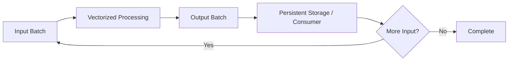
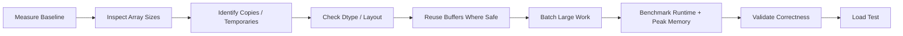

# 09- Avoiding Temporary Arrays

## Overview

Temporary arrays are intermediate NumPy arrays created while evaluating numerical expressions, transformations, filtering operations, or dtype conversions.

They are often invisible in concise code:

```python
result = (
    values * scale
    + offset
) / divisor
```

but large intermediate results can dominate memory usage and runtime.

For large backend and data-processing workloads, performance frequently depends on reducing unnecessary:

```text
allocations
+
copies
+
temporary buffers
+
memory movement
```

The goal is not to eliminate every temporary array. Some temporaries improve readability and are inexpensive. The goal is to remove large or repeated allocations when profiling shows they materially affect:

```text
peak memory
+
latency
+
throughput
+
CPU utilization
```

## What Is a Temporary Array?

A temporary array is an intermediate result created during a computation and used only for part of the overall operation.

Consider:

```python
result = (
    values * 1.05
    + 100
) / 1000
```

Conceptually, the computation can involve:

```text
temporary_1 = values * 1.05
temporary_2 = temporary_1 + 100
result      = temporary_2 / 1000
```

The exact internal execution depends on the operations and implementation, but the important engineering concern is that large intermediate arrays can increase peak memory and memory traffic.

For a 1 GB input, even one additional full-sized temporary can become significant.

## Why Temporary Arrays Matter

Temporary arrays can affect:

| Concern | Impact |
|---|---|
| Peak memory | Multiple large arrays may coexist |
| Allocation | Memory must be reserved and initialized |
| Memory bandwidth | Data may be read and written repeatedly |
| Cache behavior | Larger working sets can reduce locality |
| Latency | Allocation and data movement add cost |
| Kubernetes reliability | Excessive memory can trigger OOM kills |
| Throughput | Memory-bound workloads may process fewer batches per second |

This is why a one-line vectorized expression can be elegant but still inefficient for very large arrays.

## A Simple Example

Consider:

```python
result = (
    values * 1.05
    + 100
) / 1000
```

A more explicit implementation can reuse a destination buffer:

```python
result = np.empty_like(
    values
)

np.multiply(
    values,
    1.05,
    out=result,
)

np.add(
    result,
    100,
    out=result,
)

np.divide(
    result,
    1000,
    out=result,
)
```

The second version gives the program more control over storage.

The trade-off is:

```text
lower temporary allocation
+
more explicit code
```

Use this style when memory pressure or allocation cost is demonstrated to matter.

## `out=` for Buffer Reuse

Many NumPy operations support `out=`:

```python
result = np.empty_like(
    values
)

np.multiply(
    values,
    scale,
    out=result,
)
```

This explicitly provides the destination buffer.

For large arrays, this can avoid allocating another result array internally.

For example:

```python
result = np.empty_like(
    values
)

np.add(
    values,
    offset,
    out=result,
)
```

The array passed to `out=` must satisfy the operation's dtype and shape requirements.

When requirements are incompatible, NumPy may reject the operation rather than silently performing an unsafe conversion.

## Reusing the Same Buffer

For staged transformations, one buffer can sometimes be reused:

```python
buffer = np.empty_like(
    values
)

np.multiply(
    values,
    scale,
    out=buffer,
)

np.add(
    buffer,
    offset,
    out=buffer,
)

np.divide(
    buffer,
    divisor,
    out=buffer,
)
```

This pattern can significantly reduce peak memory.

The trade-off is that the intermediate state exists in the same buffer.

This is safe only when:

```text
previous values are no longer required
+
operations do not need the original input
```

## In-Place Arithmetic

Simple in-place expressions can also avoid result allocation:

```python
values *= scale
```

instead of:

```python
values = values * scale
```

However, in-place operations mutate the existing array.

That makes them appropriate only when:

```text
the array is owned by the current computation
+
the original values are not required later
```

They can be problematic when the array is:

```text
shared
+
a view
+
memory-mapped
+
cached
+
used by another processing stage
```

## Avoiding Chained Expressions

Chained expressions are concise:

```python
result = (
    values * scale
    + offset
) / divisor
```

but can be expensive for large arrays.

A buffer-reuse implementation:

```python
result = np.empty_like(
    values
)

np.multiply(
    values,
    scale,
    out=result,
)

np.add(
    result,
    offset,
    out=result,
)

np.divide(
    result,
    divisor,
    out=result,
)
```

makes allocation behavior explicit.

This should not be interpreted as:

```text
always expand one-line expressions
```

Readable vectorized code is usually preferable until profiling indicates a memory problem.

## Temporary Arrays from Broadcasting

Broadcasting avoids explicit replication of smaller operands:

```python
result = values * weights
```

but still creates the output.

For:

```python
values.shape == (
    10_000_000,
    8,
)
```

and:

```python
weights.shape == (
    8,
)
```

the result contains:

```text
80 million elements
```

Even though `weights` itself is small, the output is not.

Therefore:

```text
broadcasting
→ avoids repeated input allocation

broadcasted operation
→ still may create a full-size output
```

## Temporary Arrays from Boolean Filtering

Consider:

```python
result = values[
    values > threshold
]
```

This typically creates:

```text
boolean mask
+
selected output
```

If all you need is a count:

```python
count = np.count_nonzero(
    values > threshold
)
```

there is no need to materialize the selected numerical array.

If only an aggregate is needed:

```python
total = np.sum(
    values,
    where=values > threshold,
)
```

can avoid allocating the filtered numeric result.

The mask itself still consumes memory.

## Avoiding Materialized Intermediates for Aggregation

A common pattern is:

```python
total = values[
    values > threshold
].sum()
```

This is readable but can create a selected array.

A lower-memory alternative is:

```python
total = np.sum(
    values,
    where=values > threshold,
)
```

Similarly:

```python
count = np.count_nonzero(
    values > threshold
)
```

is preferable to:

```python
count = len(
    values[values > threshold]
)
```

when a full selected array is unnecessary.

## `np.where()` and Temporary Evaluation

A common pattern is:

```python
result = np.where(
    values > 0,
    values * scale,
    0,
)
```

The expressions passed as candidate values can themselves require computation and temporary arrays.

For large arrays, prefer operation-level control when possible.

For example:

```python
result = np.zeros_like(
    values
)

np.multiply(
    values,
    scale,
    out=result,
    where=values > 0,
)
```

This makes the destination explicit and allows the multiplication to be restricted to the relevant positions.

The precise performance benefit depends on the operation and data distribution.

## Safe Conditional Arithmetic

Consider division:

```python
result = np.where(
    denominator != 0,
    numerator / denominator,
    0,
)
```

The division expression itself may still be evaluated before `np.where()` selects the result.

A safer and potentially more memory-conscious approach is:

```python
result = np.zeros_like(
    numerator,
    dtype=np.float64,
)

np.divide(
    numerator,
    denominator,
    out=result,
    where=denominator != 0,
)
```

This controls both:

```text
where the operation occurs
+
where the result is stored
```

## Avoiding Repeated Concatenation

Repeated concatenation is a common source of hidden copying:

```python
result = np.empty(
    0,
    dtype=np.float64,
)

for batch in batches:
    result = np.concatenate(
        [result, batch]
    )
```

Every growth step can require allocating a larger array and copying previous results.

A better approach for moderate datasets is:

```python
parts = []

for batch in batches:
    parts.append(
        process(batch)
    )

result = np.concatenate(
    parts
)
```

This reduces repeated growth operations, although the final concatenation still allocates the complete result.

For very large outputs, streaming is usually the better design.

## Stream Large Outputs

Instead of:

```python
parts = []

for batch in batches:
    parts.append(
        process(batch)
    )

result = np.concatenate(
    parts
)
```

prefer a pipeline where each result is persisted or consumed immediately:



Potential destinations include:

```text
memory-mapped output
+
.npy
+
Parquet
+
S3
+
PostgreSQL
+
Kafka
```

This keeps the working set bounded.

## Batch Processing

Batch processing is one of the most effective ways to control temporary-array memory.

```python
def process_in_batches(
    values: np.ndarray,
    batch_size: int,
) -> None:
    for start in range(
        0,
        values.shape[0],
        batch_size,
    ):
        batch = values[
            start:start + batch_size
        ]

        result = (
            batch * 1.05
            + 100
        )

        persist(
            result
        )
```

The temporary arrays now scale with:

```text
batch size
```

rather than:

```text
full dataset size
```

This makes memory behavior much more predictable.

## Choosing Batch Size

Batch size is a trade-off:

```text
smaller batch
→ lower memory
→ more Python loop overhead
→ potentially more I/O operations

larger batch
→ higher memory
→ better amortization
→ potentially higher throughput
```

Start with a safe value and benchmark.

The correct batch size depends on:

```text
dtype
+
operation
+
storage
+
CPU
+
worker memory limit
+
concurrency
```

## Temporary Arrays and Memory-Mapped Inputs

Memory mapping can reduce the memory required for the source data:

```python
values = np.load(
    "large_values.npy",
    mmap_mode="r",
)
```

but it does not eliminate temporary output arrays:

```python
batch = values[
    start:end
]

result = (
    batch * scale
    + offset
)
```

The mapped input remains file-backed, while `result` is an ordinary in-memory array unless a different output strategy is used.

This is why memory mapping and temporary-array reduction work well together.

## Preallocating Batch Outputs

If each batch produces a known-size result:

```python
batch = values[
    start:end
]

result = np.empty_like(
    batch
)

np.multiply(
    batch,
    scale,
    out=result,
)
```

This gives explicit ownership of the destination.

For multi-stage transformations:

```python
np.multiply(
    batch,
    scale,
    out=result,
)

np.add(
    result,
    offset,
    out=result,
)
```

can reuse the same buffer.

## Reuse vs Multiple Buffers

Consider two approaches.

Multiple buffers:

```python
scaled = values * scale
shifted = scaled + offset
result = shifted / divisor
```

Potential working set:

```text
values
+
scaled
+
shifted
+
result
```

Buffer reuse:

```python
result = np.empty_like(
    values
)

np.multiply(
    values,
    scale,
    out=result,
)

np.add(
    result,
    offset,
    out=result,
)

np.divide(
    result,
    divisor,
    out=result,
)
```

Potential working set:

```text
values
+
result
```

This can materially reduce peak memory for large arrays.

## When Not to Reuse a Buffer

Buffer reuse is inappropriate when later stages still require the intermediate data:

```python
scaled = values * scale

audit_metrics = np.mean(
    scaled
)

result = scaled + offset
```

Overwriting `scaled` too early would destroy data needed for the audit calculation.

The optimization target should therefore be:

```text
minimum required live data
```

not:

```text
minimum number of variable names
```

## Temporary Arrays and `dtype`

Dtype promotion can create larger temporaries than expected.

For example:

```python
values = np.ones(
    10_000_000,
    dtype=np.float32,
)

result = values * np.float64(
    1.05
)
```

If the operation produces a wider dtype, the result can require substantially more memory.

Inspect:

```python
print(
    result.dtype
)
```

When appropriate, use compatible dtypes:

```python
scale = np.float32(
    1.05
)

result = values * scale
```

Always verify that the numerical requirements permit the narrower representation.

## Temporary Arrays and Contiguity

A non-contiguous input may cause downstream code to create a contiguous copy.

For example:

```python
view = values.T

result = np.ascontiguousarray(
    view
)
```

The explicit conversion creates a new buffer.

More importantly, an external library may perform a similar conversion internally.

If a downstream consumer requires contiguous data, normalize layout once at a stable pipeline boundary rather than repeatedly inside hot operations.

## Temporary Arrays from Dtype Conversion

This:

```python
float32_values = values.astype(
    np.float32
)
```

generally requires a new buffer when the source uses another dtype.

If the conversion occurs repeatedly:

```python
for batch in batches:
    batch = batch.astype(
        np.float32
    )

    process(batch)
```

conversion can become a major source of allocation and memory traffic.

Prefer:

```text
normalize dtype once
+
process many times
```

when the data lifecycle permits it.

## Temporary Arrays and Views

Views can avoid copies:

```python
batch = values[
    start:end
]
```

This is usually preferable to:

```python
batch = values[
    start:end
].copy()
```

when the batch is read-only and the source can remain alive.

However, copying may still be justified when:

```text
the source is huge
+
the batch must live for a long time
```

because a tiny view can retain the complete source buffer.

## Temporary Arrays and Broadcasting

Avoid explicitly materializing broadcast operands:

```python
expanded = np.tile(
    weights,
    (
        batch.shape[0],
        1,
    ),
)

result = (
    batch * expanded
)
```

Prefer:

```python
result = (
    batch * weights
)
```

The second form avoids the explicit repeated input array.

The output may still be large, but one unnecessary allocation has been removed.

## Temporary Arrays and Reductions

Some workloads only need a scalar or small output.

For example:

```python
mean = (
    values * weights
).mean()
```

creates a weighted result array before reducing it.

Depending on the operation, a reduction-specific implementation may avoid some intermediate storage, but the exact optimization depends on the mathematical operation.

When memory is critical, ask:

```text
Do I need the full intermediate array?
```

If the answer is no, look for an API or algorithm that computes the required aggregate directly.

## Temporary Arrays in ETL Pipelines

A production ETL workflow can accidentally create multiple copies:

```text
CSV
→ Pandas DataFrame
→ NumPy array
→ normalized NumPy array
→ filtered NumPy array
→ output array
```

Each representation can coexist.

A better design is to define clear stage ownership:

```text
input
→ validate
→ transform
→ aggregate
→ persist
```

and release or stream intermediate representations as soon as possible.

Memory optimization should cover the complete pipeline, not only individual NumPy expressions.

## PostgreSQL Pushdown

If the source is PostgreSQL, reduce data before creating large NumPy arrays.

For example:

```text
PostgreSQL
→ filter rows
→ select required numeric columns
→ transfer
→ NumPy processing
```

is often preferable to:

```text
PostgreSQL
→ transfer all rows and columns
→ NumPy filtering
```

This reduces:

```text
network traffic
+
Python memory
+
NumPy array size
+
temporary allocation
```

The database should perform work that it is well-suited to perform.

## Pandas Interaction

Pandas may introduce additional representations before data reaches NumPy.

A pipeline such as:

```text
Parquet
→ Pandas
→ NumPy
→ Pandas
```

can create multiple large buffers.

Prefer:

```text
Pandas for tabular transformation
+
NumPy for dense numerical kernels
```

and minimize unnecessary back-and-forth conversion.

Measure conversion costs for large datasets.

## API Workloads

User-controlled numerical APIs are especially sensitive to temporary allocations.

A request can trigger:

```text
request body
→ Python object graph
→ NumPy array
→ dtype-converted copy
→ contiguous copy
→ broadcast output
→ serialized response
```

The peak memory can be several times the input size.

Production APIs should enforce:

```text
maximum request size
+
maximum element count
+
maximum dimensions
+
maximum output size
```

For large jobs, stage the input and process asynchronously.

## FastAPI Example

A bounded endpoint can minimize unnecessary representations:

```python
import numpy as np


def process_values(
    payload: list[float],
) -> list[float]:
    values = np.asarray(
        payload,
        dtype=np.float32,
    )

    if values.size > 1_000_000:
        raise ValueError(
            "Input exceeds maximum size."
        )

    result = np.empty_like(
        values
    )

    np.multiply(
        values,
        np.float32(1.05),
        out=result,
    )

    return result.tolist()
```

The example still has unavoidable representations:

```text
Python request payload
+
NumPy input
+
NumPy output
+
serialized result
```

The goal is to avoid additional unnecessary full-size intermediates.

## Celery and Kubernetes

Background numerical workers should be configured around peak memory, not average memory.

Suppose:

```text
one task
→ 800 MB peak
```

Running:

```text
8 concurrent tasks
```

could require far more than:

```text
8 × 800 MB
```

once process overhead and temporary buffers are included.

Control:

```text
worker concurrency
+
batch size
+
container memory limit
```

together.

## Memory-Mapped Output

For very large outputs, a memory-mapped destination can eliminate the need for a giant in-memory result:

```python
output = np.lib.format.open_memmap(
    "processed.npy",
    mode="w+",
    dtype=np.float32,
    shape=values.shape,
)

for start in range(
    0,
    values.shape[0],
    batch_size,
):
    batch = values[
        start:start + batch_size
    ]

    output[
        start:start + batch_size
    ] = batch * np.float32(1.05)

output.flush()
```

This pattern allows the result to remain file-backed.

The exact storage and filesystem characteristics still matter, and the complete output should not be assumed to be free from I/O costs.

## Measuring Temporary Allocation

Performance optimization should use measurement.

At minimum, benchmark:

```text
baseline runtime
+
optimized runtime
+
peak memory
```

A runtime-only benchmark can produce the wrong conclusion.

For example:

```text
Version A
→ 2.0 seconds
→ 8 GB peak

Version B
→ 2.5 seconds
→ 2 GB peak
```

Version B may be substantially better for a Kubernetes worker with a 4 GB memory limit because Version A may not run reliably at all.

## Profiling Strategy

A practical workflow is:



Useful questions include:

```text
How many full-sized arrays are simultaneously alive?
Which operations allocate?
Which arrays can be views?
Can an output buffer be reused?
Can a reduction avoid materialization?
Can the input be processed in batches?
Can filtering happen upstream?
```

## Common Mistakes

### Optimizing Every Temporary Away

Temporary arrays are not inherently bad. Removing every allocation can make code unnecessarily complicated without improving production performance.

### Ignoring Peak Memory

Final output size is not enough. Intermediate arrays can determine whether the process survives.

### Chaining Large Operations Blindly

A concise expression can create multiple full-size intermediates.

### Using `np.concatenate()` in a Growth Loop

Repeated concatenation can repeatedly allocate and copy existing data.

### Materializing Broadcast Operands

`repeat()` and `tile()` can create large unnecessary inputs when ordinary broadcasting is sufficient.

### Filtering Before Aggregation Without Considering Allocation

Boolean selection creates a new numerical result. Use reduction-oriented operations when the filtered array itself is unnecessary.

### Repeated Dtype Conversion

Repeated `astype()` operations add allocation and conversion costs.

### Copying Every View

A copy may be unnecessary when the data is read-only and the source lifetime is controlled.

### Reusing Buffers Despite Required Data Lifetime

In-place or `out=` operations can overwrite values that later stages still need.

### Ignoring Upstream Data Reduction

Reducing NumPy allocations is less effective if the application first retrieves far more data from PostgreSQL or S3 than necessary.

### Increasing Worker Concurrency

More simultaneous tasks can multiply temporary-array memory and cause OOM failures.

## Production Decision Matrix

| Problem | Preferred Technique |
|---|---|
| Large chained expression | Use `out=` / buffer reuse where justified |
| Large repeated batch transformations | Preallocate output |
| Unnecessary filtered result | Use reductions with masks |
| Broadcast operand replication | Use implicit broadcasting |
| Repeated concatenation | Preallocate or stream |
| Huge dataset | Batch processing / memory mapping |
| Repeated dtype conversion | Normalize dtype once |
| Repeated layout conversion | Normalize layout once |
| Small long-lived view | Copy if needed to release large backing storage |
| Large output | Stream or memory-map output |
| Excessive upstream data | Filter/project in PostgreSQL or storage layer |
| Unbounded API input | Enforce resource limits |

## Interview Questions

### What is a temporary array?

It is an intermediate NumPy array produced during a computation and used only for a later stage of the operation.

### Why can temporary arrays be expensive?

They require additional memory allocation and data movement and can increase peak memory substantially.

### How does `out=` help?

It allows a caller to provide the destination buffer for supported operations, reducing unnecessary result allocations.

### When should you use in-place operations?

When the existing array can safely be mutated and no later stage requires the original values.

### Can broadcasting create temporary arrays?

Broadcasting avoids explicitly repeating smaller input operands, but the operation can still allocate a large output and other intermediates.

### Why can boolean filtering increase memory usage?

The comparison creates a mask, and the selected result generally requires another array.

### Why is repeated `np.concatenate()` inefficient?

Growing an array repeatedly can allocate larger buffers and copy existing data at each step.

### How can batch processing reduce memory?

It limits the number of elements participating in expensive transformations at once, bounding temporary and output allocations.

### Why is `np.where()` not always sufficient to prevent unnecessary work?

The candidate expressions can still be evaluated before selection. Operation-level controls such as `where=` can be safer and more explicit for operations like division.

### When is a temporary array acceptable?

When the array is small, improves readability, does not materially affect memory or latency, or is required by the algorithm.

### How do you decide whether to eliminate a temporary?

Measure its size, lifetime, allocation cost, contribution to peak memory, and effect on runtime before optimizing it away.

### How would you optimize a NumPy worker that is hitting Kubernetes OOM kills?

Reduce input size upstream, remove unnecessary copies and temporaries, normalize dtype and layout once, batch the computation, stream large outputs, and reduce numerical worker concurrency.

## Key Takeaways

- Temporary arrays increase allocation, memory traffic, and peak working-set size; their impact becomes significant as datasets grow.
- Use `out=`, in-place operations, buffer reuse, reductions, and batching when profiling shows that intermediate allocations are a real bottleneck.
- Broadcasting can avoid replicated inputs, but large result arrays and chained expressions can still create substantial temporary memory.
- For production pipelines, reduce data upstream, normalize dtype and layout once, stream large outputs, and control worker concurrency together with batch size.
- Do not eliminate every temporary array blindly; optimize based on measured peak memory, runtime, correctness, and code maintainability.