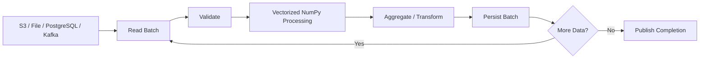

# 10- Batch Processing

## Overview

Batch processing is a practical technique for controlling memory usage and execution behavior when a NumPy workload cannot or should not process the complete dataset at once.

Instead of:

```text
entire dataset
→ load
→ transform
→ aggregate
→ write
```

a batch pipeline performs:

```text
input
→ bounded batch
→ vectorized processing
→ output
→ next batch
```

The primary goals are:

- Keep peak memory predictable.
- Process datasets larger than available RAM.
- Reduce Python-level per-record overhead.
- Control temporary-array size.
- Improve failure isolation and retry behavior.
- Match computation to storage and worker resource limits.

Batch processing is not merely a memory workaround. It is also a useful execution boundary for:

```text
ETL
+
Celery jobs
+
Kafka consumers
+
S3 processing
+
database exports
+
memory-mapped arrays
+
large file transformations
```

A good batch design balances:

```text
batch size
+
throughput
+
latency
+
memory
+
I/O
+
failure recovery
```

## Why Batch Processing Exists

Suppose a dataset contains:

```text
500 million float64 values
```

The raw array alone requires approximately:

```text
500,000,000 × 8 bytes
≈ 4 GB
```

A transformation may additionally require:

```text
input
+
output
+
temporary arrays
+
application memory
```

A worker with an 8 GB limit may therefore be unable to process the dataset safely in one operation.

Batching changes the working set from:

```text
O(total dataset size)
```

toward:

```text
O(batch size)
```

for the processing stage.

The dataset can therefore exceed available RAM while each individual batch remains manageable.

## Basic Batch Processing

A simple pattern is:

```python
import numpy as np


def process_in_batches(
    values: np.ndarray,
    batch_size: int,
) -> np.ndarray:
    outputs = []

    for start in range(
        0,
        values.shape[0],
        batch_size,
    ):
        end = min(
            start + batch_size,
            values.shape[0],
        )

        batch = values[
            start:end
        ]

        outputs.append(
            batch * np.float64(1.05)
        )

    return np.concatenate(
        outputs
    )
```

This demonstrates the basic structure:

```text
slice
→ process
→ collect
```

However, the final `np.concatenate()` reconstructs the complete result in memory.

For genuinely large outputs, the architecture should stream results instead.

## Bounded Working Sets

A production batch pipeline should make the working set predictable.

For example:

```text
input batch        = 256 MB
temporary arrays   = 256 MB
output batch       = 256 MB
runtime overhead   = 256 MB
--------------------------------
approximate budget = 1 GB
```

This is more useful than planning around total dataset size.

The actual working set depends on:

```text
dtype
+
operation
+
number of temporaries
+
copies
+
worker concurrency
```

The batch size should be selected from measured memory behavior rather than an arbitrary constant.

## Batch Size Trade-offs

Batch size directly affects performance.

| Smaller Batch | Larger Batch |
|---|---|
| Lower peak memory | Higher peak memory |
| More loop iterations | Fewer loop iterations |
| More scheduling / function overhead | Better amortization |
| Potentially more I/O operations | Better sequential throughput |
| Lower failure scope | Larger retry unit |
| More granular progress | Less bookkeeping |

The optimal point is usually somewhere between the extremes.

A practical tuning process is:

```text
choose safe starting size
→ benchmark
→ measure peak memory
→ increase gradually
→ stop near diminishing returns
```

## Vectorization Inside Batches

Batching does not mean replacing NumPy vectorization with Python loops.

The preferred model is:

```text
Python loop
→ controls batches

NumPy operations
→ process elements within each batch
```

Example:

```python
for start in range(
    0,
    values.shape[0],
    batch_size,
):
    batch = values[
        start:start + batch_size
    ]

    processed = (
        batch * scale
        + offset
    )

    persist(
        processed
    )
```

This combines two optimization strategies:

```text
batching
+
vectorization
```

The loop operates on a small number of batches rather than millions of individual records.

## Batch Slicing and Views

When possible, use basic slicing:

```python
batch = values[
    start:end
]
```

Basic slices commonly produce views instead of copying the selected data.

This is useful because:

```text
batch selection
→ low allocation cost
→ shared underlying storage
```

If the batch must be independently mutated:

```python
batch = values[
    start:end
].copy()
```

The copy should be intentional because it increases memory usage.

## Memory-Aware Batch Processing

Consider:

```python
result = (
    batch * scale
    + offset
) / divisor
```

Even though `batch` is bounded, the operation can create multiple temporary arrays.

For memory-sensitive workloads, reuse a buffer:

```python
result = np.empty_like(
    batch
)

np.multiply(
    batch,
    scale,
    out=result,
)

np.add(
    result,
    offset,
    out=result,
)

np.divide(
    result,
    divisor,
    out=result,
)
```

This can reduce peak memory within each batch.

Do not add this complexity unless batch-level profiling shows allocation pressure.

## Preallocated Output

If the complete output must remain in memory and its shape is known:

```python
result = np.empty_like(
    values
)

for start in range(
    0,
    values.shape[0],
    batch_size,
):
    end = min(
        start + batch_size,
        values.shape[0],
    )

    result[start:end] = (
        values[start:end] * scale
    )
```

This avoids collecting every processed batch into a Python list.

The total output still occupies memory, so this is only appropriate when the final result itself fits the worker's memory budget.

## Streaming Output

For large datasets, persist each batch rather than accumulating it.

```python
for start in range(
    0,
    values.shape[0],
    batch_size,
):
    end = min(
        start + batch_size,
        values.shape[0],
    )

    batch = values[
        start:end
    ]

    result = process(
        batch
    )

    write_batch(
        result,
        start=start,
    )
```

A production implementation might write batches to:

```text
S3
+
Parquet
+
memory-mapped output
+
PostgreSQL bulk load
+
Kafka
```

The key property is:

```text
processed batch
→ durable or downstream destination
→ release working memory
```

## Batch Processing Architecture

A typical production data-processing pipeline is:



The completion state is important because downstream systems should not treat a partially processed dataset as complete.

## Large File Processing

For files that already exist locally:

```python
values = np.load(
    "large_values.npy",
    mmap_mode="r",
)

batch_size = 500_000

for start in range(
    0,
    values.shape[0],
    batch_size,
):
    batch = values[
        start:start + batch_size
    ]

    result = process(
        batch
    )

    persist(
        result
    )
```

Memory mapping reduces the need to eagerly load the complete input.

Batching then limits:

```text
temporary arrays
+
result size
+
CPU working set
```

Memory mapping and batching therefore solve complementary problems.

## Memory-Mapped Output

For a large result that should exist as a NumPy array on disk, use a memory-mapped destination.

```python
import numpy as np


input_values = np.load(
    "input.npy",
    mmap_mode="r",
)

output = np.lib.format.open_memmap(
    "output.npy",
    mode="w+",
    dtype=np.float32,
    shape=input_values.shape,
)

batch_size = 500_000

for start in range(
    0,
    input_values.shape[0],
    batch_size,
):
    end = min(
        start + batch_size,
        input_values.shape[0],
    )

    batch = input_values[
        start:end
    ]

    output[start:end] = (
        batch * np.float32(1.05)
    )

output.flush()
```

This avoids requiring the complete output to coexist in RAM.

The output file remains storage-backed, so disk performance and capacity must still be considered.

## Batch Processing and Dtypes

Batch size should be selected together with dtype.

For example:

```text
1,000,000 float64 values
→ ~8 MB
```

while:

```text
1,000,000 float32 values
→ ~4 MB
```

If a batch transformation requires:

```text
input
+
temporary
+
output
```

then dtype width can significantly affect the working set.

Do not choose batch size without considering the actual dtype and intermediate operations.

## Batch Processing and Broadcasting

Broadcasting is useful inside batches:

```python
weights = np.array(
    [1.01, 1.02, 1.03],
    dtype=np.float32,
)

for start in range(
    0,
    values.shape[0],
    batch_size,
):
    batch = values[
        start:start + batch_size
    ]

    processed = (
        batch * weights
    )

    persist(
        processed
    )
```

The small `weights` operand is reused logically across the batch.

However, the result size still scales with batch size.

Larger batches therefore increase the size of the broadcasted output.

## Batch Processing and Temporary Arrays

A useful memory model is:

```text
peak batch memory
≈
input batch
+
temporary arrays
+
output batch
+
runtime overhead
```

For example:

```text
input batch      = 200 MB
temporary        = 200 MB
output           = 200 MB
application      = 300 MB
--------------------------------
working set      ≈ 900 MB
```

If the worker runs under a:

```text
1 GiB limit
```

the design has very little safety margin.

Use smaller batches or reduce temporaries.

## Batch Processing and Views vs Copies

Basic slicing:

```python
batch = values[
    start:end
]
```

usually avoids copying.

But this:

```python
batch = values[
    indices
]
```

uses fancy indexing and generally creates a new array.

Similarly:

```python
batch = values[
    mask
]
```

typically creates a selected copy.

For large pipelines, the difference can materially change memory usage.

Prefer contiguous range-based batches when the processing model allows it.

## Batch Processing and Filtering

Filtering within a batch:

```python
valid = (
    np.isfinite(batch)
    & (batch >= 0)
)

filtered = batch[
    valid
]
```

requires:

```text
mask
+
filtered output
```

The memory impact is bounded by batch size rather than dataset size.

If only an aggregate is required:

```python
total = np.sum(
    batch,
    where=valid,
)
```

can avoid creating the filtered numerical array.

## Batch Aggregation

Many workloads do not require materializing all transformed data.

For example:

```python
total = 0.0

for start in range(
    0,
    values.shape[0],
    batch_size,
):
    batch = values[
        start:start + batch_size
    ]

    total += np.sum(
        batch
    )
```

This reduces:

```text
full output storage
+
full result concatenation
```

to a scalar accumulator.

For production numerical aggregation, ensure that the accumulator's dtype provides sufficient range and precision.

## Batch Processing and Statistical Calculations

Per-batch aggregation can require careful numerical handling.

Do not automatically assume:

```text
mean of batch means
=
global mean
```

unless the batches are equally sized or appropriately weighted.

A safer pattern tracks:

```text
batch sum
+
batch count
```

and combines them.

For example:

```python
total_sum = 0.0
total_count = 0

for start in range(
    0,
    values.shape[0],
    batch_size,
):
    batch = values[
        start:start + batch_size
    ]

    total_sum += np.sum(
        batch,
        dtype=np.float64,
    )

    total_count += batch.size

global_mean = (
    total_sum / total_count
)
```

The same principle applies to more complex statistics.

Batching changes the execution strategy; it must not change the mathematical meaning of the result.

## Batch Processing and Min/Max

Simple reductions can be combined across batches:

```python
global_min = np.inf
global_max = -np.inf

for start in range(
    0,
    values.shape[0],
    batch_size,
):
    batch = values[
        start:start + batch_size
    ]

    global_min = min(
        global_min,
        np.min(batch),
    )

    global_max = max(
        global_max,
        np.max(batch),
    )
```

Handle empty inputs and invalid values according to the dataset contract.

For NaN-containing data, decide explicitly whether NaNs should:

```text
invalidate the result
or
be ignored
```

using the appropriate NumPy reduction.

## Batch Processing and Standardization

A subtle problem occurs when each batch calculates its own mean and standard deviation:

```python
for batch in batches:
    standardized = (
        batch - batch.mean()
    ) / batch.std()
```

This produces batch-specific normalization rather than a dataset-wide standardized representation.

If downstream consumers expect a single global standardization contract:

```text
fit global statistics
→ persist statistics
→ apply same statistics to every batch
```

For example:

```python
mean = ...
std = ...

for batch in batches:
    standardized = (
        batch - mean
    ) / std
```

The statistical parameters become part of the processing contract.

## Batch Processing and Normalization

The same principle applies to min-max normalization.

Avoid independently calculating:

```text
batch minimum
batch maximum
```

when the application expects globally consistent normalization.

Instead:

```text
compute global bounds
→ persist bounds
→ process batches using same bounds
```

This separates:

```text
fit phase
+
transform phase
```

and provides consistent results across batches.

## Batch Size and I/O

Batch size affects storage and network behavior.

Small batches may create:

```text
more S3 requests
+
more database writes
+
more Kafka interactions
+
more filesystem operations
```

Large batches reduce operation count but increase:

```text
latency
+
memory
+
retry cost
```

The correct batch size therefore depends on both computational and external-system costs.

## Batch Size and Network Throughput

For S3 or object storage:

```text
small batch
→ many requests
→ request overhead becomes significant

large batch
→ fewer requests
→ better throughput
→ larger local working set
```

For PostgreSQL:

```text
small insert batch
→ more round trips

large insert batch
→ fewer round trips
→ larger transaction / memory footprint
```

For Kafka:

```text
small consumer batches
→ lower processing latency

large consumer batches
→ greater throughput
→ larger processing delay
```

The batch size must be aligned with the semantics of the surrounding system.

## Batch Processing with Celery

Celery is useful when batch processing should run asynchronously.

A practical pattern is:

```text
API request
→ create job
→ enqueue task
→ worker reads batches
→ process
→ persist progress
→ publish completion
```

Each task should have controlled:

```text
input
+
batch size
+
retry behavior
+
output location
```

Avoid a single task that loads an arbitrarily large dataset into RAM.

## Retry Granularity

Batching also affects failure recovery.

Suppose a job processes:

```text
100 GB
```

as one task.

A failure near the end may require substantial reprocessing.

If the job processes:

```text
1000 batches
```

then retrying one failed batch can be much cheaper.

This creates a trade-off:

```text
smaller batches
→ better retry granularity
→ more orchestration overhead

larger batches
→ simpler coordination
→ larger retry scope
```

For distributed processing, batch identity should be deterministic:

```text
dataset_id
+
batch_id
+
schema_version
```

This supports idempotent retries.

## Idempotent Batch Processing

A robust batch system should tolerate retry.

For example:

```text
dataset=orders-2026-09-13
batch=0042
```

should have a deterministic output location:

```text
s3://bucket/results/orders-2026-09-13/batch-0042.parquet
```

The worker can then:

```text
check existing completion state
→ process if required
→ write output
→ publish completion
```

The exact mechanism depends on storage semantics, but deterministic identity simplifies recovery.

## Checkpointing

For long-running jobs, store progress:

```text
job_id
+
dataset_id
+
last_completed_batch
+
schema_version
+
output location
```

A worker can resume from the next uncompleted batch instead of restarting the entire dataset.

Checkpoint state should itself be durable enough for the job's reliability requirements.

## Batch Processing and Kafka

A Kafka consumer can naturally form batches:

```text
Kafka partition
→ consume N messages
→ extract numeric fields
→ NumPy array
→ vectorized processing
→ commit / publish result
```

Batch size should consider:

```text
consumer lag
+
processing latency
+
memory
+
rebalance behavior
```

Do not allow a batch to become so large that processing exceeds operational timeouts or causes excessive memory pressure.

## Batch Processing and PostgreSQL

Bulk database operations should also be batched.

A typical pipeline is:

```text
PostgreSQL query
→ fetch controlled batch
→ NumPy processing
→ bulk insert / update
→ next batch
```

Where possible, use database-side pagination or streaming mechanisms that avoid loading the entire query result into application memory.

Filtering and projection should occur in SQL when that reduces transferred data.

## Batch Processing and S3

A typical AWS architecture is:


For very large objects:

```text
download full object
```

may itself be undesirable.

Use format-appropriate streaming, range access, or local staging depending on the file format and access pattern.

## Batch Processing and Docker

Containers make memory limits explicit.

A worker should know:

```text
CPU limit
+
memory limit
+
ephemeral storage
```

Batch sizing should be compatible with those limits.

For example:

```text
container memory = 2 GiB
safe numerical working set = 1 GiB
```

may be more appropriate than using the entire 2 GiB limit for arrays.

Headroom is needed for:

```text
Python runtime
+
framework
+
storage buffers
+
unexpected allocations
```

## Batch Processing and Kubernetes

Kubernetes workers should be configured with appropriate:

```text
requests
+
limits
+
concurrency
```

A memory-heavy NumPy workload often benefits from fewer workers with larger bounded batches rather than many highly concurrent workers.

Monitor:

```text
RSS
+
CPU
+
OOM kills
+
restarts
+
processing latency
+
queue depth
```

## Monitoring Batch Jobs

Useful application metrics include:

```text
batches_started
batches_completed
batches_failed
records_processed
bytes_processed
batch_duration
batch_size
throughput
retry_count
```

Operational metrics include:

```text
CPU utilization
memory RSS
OOM events
disk usage
network throughput
queue depth
Kafka lag
database latency
S3 request latency
```

Correlating these metrics helps determine whether the bottleneck is:

```text
CPU
+
memory
+
I/O
+
database
+
network
+
orchestration
```

## Batch Processing Performance

Benchmark the complete pipeline rather than only the numerical kernel.

Measure:

```text
read
+
validation
+
NumPy processing
+
write
+
coordination
```

For example:

```python
import time


start = time.perf_counter()

for start_index in range(
    0,
    values.shape[0],
    batch_size,
):
    end_index = min(
        start_index + batch_size,
        values.shape[0],
    )

    batch = values[
        start_index:end_index
    ]

    result = process(
        batch
    )

    persist(
        result
    )

elapsed = (
    time.perf_counter()
    - start
)

print(
    f"total={elapsed:.3f}s"
)
```

An isolated benchmark of:

```python
batch * scale
```

does not capture the real cost of the pipeline.

## Finding the Right Batch Size

A practical benchmark should compare several sizes:

```text
64K
128K
256K
512K
1M
2M
```

or equivalent domain-specific sizes.

Track:

```text
batch duration
records/sec
peak RSS
I/O throughput
retry cost
```

Then choose the largest batch that provides useful throughput without creating unacceptable resource pressure.

Avoid hard-coding a batch size based only on developer-machine measurements.

## Common Mistakes

### Loading the Whole Dataset Before Batching

This defeats the memory purpose of batching.

### Collecting All Results in a List

Processing in batches but retaining every output eventually reconstructs the full result in memory.

### Using Tiny Batches

Very small batches can create excessive Python, I/O, and scheduling overhead.

### Using Huge Batches

Large batches can cause high peak memory and expensive retries.

### Recalculating Global Statistics Per Batch

Independent batch normalization or standardization can produce inconsistent results.

### Ignoring Dtype

The same element count can consume very different memory depending on dtype.

### Ignoring Temporary Arrays

A batch may fit in RAM while its transformation does not.

### Using Fancy Indexing for Every Batch

Integer or boolean indexing can create copies where a basic slice would provide a view.

### Ignoring Retry Semantics

A large batch can make failures expensive to recover from.

### Increasing Worker Concurrency Without Measuring Memory

Concurrent batches multiply the working set.

### Writing One Row at a Time

Batching should also be applied to external systems such as PostgreSQL, Kafka, and object storage when their APIs support bulk operations.

### Treating Batch Size as a Universal Constant

The correct size depends on workload, dtype, hardware, storage, concurrency, and service limits.

## Production Decision Matrix

| Situation | Strategy |
|---|---|
| Dataset fits comfortably in memory | Full-array processing may be simpler |
| Dataset exceeds RAM | Bounded batches |
| Large `.npy` input | Memory mapping + batches |
| Large result | Stream or memory-map output |
| CPU-heavy NumPy transform | Moderate-to-large batches |
| Memory-heavy transform | Smaller batches + fewer temporaries |
| Expensive external writes | Larger batches / bulk writes |
| Expensive retries | Smaller deterministic batches |
| Kafka consumer | Tune batch by lag and processing latency |
| Celery worker | Bound batch and worker concurrency |
| PostgreSQL ETL | SQL filtering + controlled fetch + batch writes |
| User-controlled API | Strict size / element / output limits |

## Interview Questions

### Why is batch processing useful with NumPy?

It bounds the working set so large datasets can be processed without materializing the entire dataset and all intermediate results in memory.

### Does batching make NumPy computation faster?

Not necessarily. It can reduce memory pressure and enable larger-than-RAM processing, but very small batches can add overhead while very large batches can cause memory contention.

### How should batch size be selected?

Benchmark realistic sizes while measuring throughput, latency, peak memory, I/O, and concurrency behavior.

### Why combine Python loops with NumPy?

Use Python for coarse-grained batch orchestration and NumPy for vectorized element-level computation inside each batch.

### Why is `np.concatenate()` after batch processing sometimes a problem?

It reconstructs the complete output in memory, potentially eliminating the memory savings gained from batching.

### How can batching improve retry behavior?

Failures can be isolated to smaller deterministic units, allowing only the failed batch to be retried.

### What is the difference between batching and vectorization?

Batching controls how much data is processed at once. Vectorization controls how numerical computation is executed over that data.

### How does batching interact with memory mapping?

Memory mapping controls how the source dataset is accessed from storage, while batching controls the amount of data and temporary computation held in memory at once.

### Why should global statistics not usually be recalculated per batch?

Because independently calculated batch statistics can produce inconsistent transformations. Fit global parameters once and apply them consistently when the processing contract requires it.

### How does worker concurrency affect batch memory?

Each concurrent worker or task can have its own batch and temporaries, so total memory consumption can scale roughly with concurrent task count.

### How would you design a 500 GB numerical ETL pipeline?

Use durable object storage or database staging, process deterministic bounded batches, vectorize numerical work within each batch, stream outputs, checkpoint progress, make retries idempotent, and monitor memory, throughput, queueing, and storage I/O.

### When would you avoid batch processing?

When the dataset is small enough to fit comfortably in memory and the additional orchestration complexity provides no meaningful benefit.

## Key Takeaways

- Batch processing bounds the numerical working set and allows NumPy pipelines to process datasets that are too large for a single in-memory operation.
- The strongest production pattern is usually a Python-level loop over deterministic batches with vectorized NumPy computation inside each batch.
- Batch size is a system-level tuning parameter: it affects memory, CPU efficiency, I/O, latency, throughput, and retry cost.
- Avoid defeating batching by collecting all outputs in memory; stream, persist, or memory-map large results instead.
- Production batch pipelines should combine bounded resource usage with idempotent batch identity, checkpointing, controlled concurrency, and monitoring.