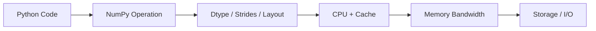
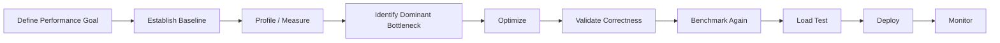

# 11- Benchmarking

## Overview

Benchmarking is the process of measuring the cost of a numerical workload under controlled conditions.

For NumPy, benchmarking should answer more than:

```text
Which expression is faster?
```

A useful engineering benchmark should determine:

```text
runtime
+
throughput
+
peak memory
+
CPU utilization
+
I/O behavior
+
allocation behavior
```

This matters because a change can improve one dimension while making another worse.

For example:

```text
Implementation A
→ 1.8 s
→ 8 GB peak memory

Implementation B
→ 2.1 s
→ 1.5 GB peak memory
```

Implementation B may be the better production choice when the worker has a 2 GB memory limit.

The purpose of benchmarking is therefore to replace assumptions with measurements and to identify the actual bottleneck before optimizing.

## Why Benchmark NumPy Workloads

NumPy performance is influenced by several layers:



A slow operation can be caused by:

- Python interpreter overhead.
- Poor algorithmic complexity.
- Non-contiguous memory access.
- Large temporary arrays.
- Excessive copying.
- Dtype conversion.
- Memory bandwidth.
- Storage latency.
- Database or network operations.
- Excessive concurrency.

Benchmarking helps separate these effects.

## What Makes a Good Benchmark

A useful benchmark should have:

```text
representative input
+
representative dtype
+
representative shape
+
controlled environment
+
repeatable execution
+
correctness verification
```

The benchmark should measure the operation that matters in production.

Avoid benchmarking a simplified expression if production behavior also includes:

```text
input conversion
+
validation
+
batching
+
serialization
+
database access
+
file I/O
```

## Microbenchmark vs End-to-End Benchmark

Two benchmark levels are useful.

| Benchmark | Measures | Best For |
|---|---|---|
| Microbenchmark | One operation or small unit | Comparing NumPy implementations |
| Component benchmark | A numerical processing stage | Evaluating a pipeline stage |
| End-to-end benchmark | Complete workflow | Production capacity and SLOs |
| Load test | Multiple concurrent requests/jobs | System scalability |

A microbenchmark can answer:

```text
Is operation A faster than operation B?
```

An end-to-end benchmark can answer:

```text
Can this service process 10,000 batches per minute
within the memory and latency budget?
```

Both are useful, but they answer different questions.

## `timeit` for Microbenchmarks

Python's `timeit` module is useful for measuring small CPU-bound operations.

```python
import timeit

setup = """
import numpy as np

values = np.arange(
    10_000_000,
    dtype=np.float64,
)
"""

statement = """
result = values * 1.05
"""

elapsed = timeit.timeit(
    statement,
    setup=setup,
    number=10,
)

print(
    f"total={elapsed:.4f}s"
)
```

`timeit` is useful because it minimizes some common benchmarking mistakes around repeated execution and timing overhead.

## Separate Setup from the Timed Operation

Avoid including unrelated setup unless setup is part of the production operation.

For example, this mixes allocation and computation:

```python
statement = """
values = np.arange(
    10_000_000,
    dtype=np.float64,
)

result = values * 1.05
"""
```

This measures:

```text
array creation
+
allocation
+
computation
```

If the production application already has `values` in memory, the benchmark does not represent the actual hot path.

Instead:

```python
setup = """
import numpy as np

values = np.arange(
    10_000_000,
    dtype=np.float64,
)
"""

statement = """
result = values * 1.05
"""
```

Measure setup separately when it is not part of the workload.

## `perf_counter()` for Application Timing

For larger processing stages:

```python
import time

start = time.perf_counter()

result = process_dataset(
    values
)

elapsed = (
    time.perf_counter()
    - start
)

print(
    f"elapsed={elapsed:.3f}s"
)
```

`time.perf_counter()` is useful for measuring elapsed wall-clock time in application code.

It is appropriate for:

```text
batch jobs
+
ETL stages
+
request processing
+
file processing
```

when the complete operation should be timed.

## Benchmark the Entire Batch

For a batch processor:

```python
import time


start = time.perf_counter()

for start_index in range(
    0,
    values.shape[0],
    batch_size,
):
    end_index = min(
        start_index + batch_size,
        values.shape[0],
    )

    batch = values[
        start_index:end_index
    ]

    result = process(
        batch
    )

    persist(
        result
    )

elapsed = (
    time.perf_counter()
    - start
)

print(
    f"elapsed={elapsed:.3f}s"
)
```

This captures:

```text
batch slicing
+
NumPy computation
+
persistence
+
loop overhead
```

which may be closer to production behavior than benchmarking the NumPy expression alone.

## Warm-Up and First-Run Effects

The first execution may behave differently because of:

```text
imports
+
memory allocation
+
filesystem cache
+
CPU cache
+
OS page cache
+
lazy initialization
```

For CPU microbenchmarks, run the operation repeatedly.

For example:

```python
for _ in range(3):
    process(values)

times = [
    measure_once(values)
    for _ in range(10)
]
```

The appropriate warm-up strategy depends on what is being measured.

Do not automatically discard the first run when first-run latency is actually part of the production experience.

## Repetition and Variability

A single timing is weak evidence.

Use repeated measurements:

```text
run 1
run 2
run 3
...
run N
```

Then inspect:

```text
median
minimum
maximum
variance
```

For noisy environments, the median is often more useful than a single result.

Production systems should also distinguish:

```text
average latency
+
tail latency
```

when user-facing or SLA-sensitive.

## Percentiles

For service workloads, track:

```text
p50
p95
p99
```

For example:

```text
p50 = 20 ms
p95 = 35 ms
p99 = 120 ms
```

Averages can hide expensive outliers.

Tail latency is particularly important when a numerical operation runs inside:

```text
FastAPI
+
Django
+
gRPC
+
Celery
```

or another distributed system.

## Throughput

Latency alone is not enough for batch processing.

Throughput can be expressed as:

```text
records processed / second
```

or:

```text
bytes processed / second
```

Example:

```python
records_per_second = (
    records_processed / elapsed
)

print(
    f"throughput={records_per_second:.0f} records/s"
)
```

For ETL workloads, throughput may be more meaningful than per-batch latency.

## Benchmark With Representative Data

Benchmark inputs should resemble production:

```text
shape
+
dtype
+
value distribution
+
missing values
+
NaN / infinity
+
sparsity where relevant
+
batch size
```

For example, comparing:

```python
np.array([1, 2, 3])
```

does not tell you how a workload behaves on:

```text
100 million float32 values
```

The operating regime can be completely different.

## Data Size Scaling

Benchmark multiple sizes:

```text
10K
100K
1M
10M
100M
```

This helps identify how performance scales.

For example:

```text
input size
→ runtime
```

can reveal whether the implementation behaves approximately linearly or whether another factor appears at larger scales.

Scaling benchmarks are more informative than testing one arbitrary input size.

## Benchmark Dtype Choices

Dtype changes should be benchmarked explicitly.

```python
import timeit
import numpy as np

setup = """
import numpy as np

values32 = np.ones(
    20_000_000,
    dtype=np.float32,
)

values64 = values32.astype(
    np.float64
)
"""

stmt32 = """
result = values32 * np.float32(1.05)
"""

stmt64 = """
result = values64 * np.float64(1.05)
"""

time32 = timeit.timeit(
    stmt32,
    setup=setup,
    number=10,
)

time64 = timeit.timeit(
    stmt64,
    setup=setup,
    number=10,
)

print(
    f"float32={time32:.4f}s"
)

print(
    f"float64={time64:.4f}s"
)
```

The result should be interpreted with:

```text
runtime
+
peak memory
+
numerical error
+
output size
```

A faster dtype is not useful if it violates correctness requirements.

## Benchmark Views vs Copies

When evaluating memory layout or slicing:

```python
setup = """
import numpy as np

values = np.arange(
    20_000_000,
    dtype=np.float64,
)

view = values[::2]
copy = view.copy()
"""

view_stmt = """
result = view * 1.05
"""

copy_stmt = """
result = copy * 1.05
"""
```

Do not only compare:

```text
view processing
vs
copy processing
```

Include the copy creation cost when deciding whether copying is beneficial:

```text
copy cost
+
all downstream processing
```

versus:

```text
view creation
+
all downstream processing
```

## Benchmarking Contiguous vs Non-Contiguous Arrays

Memory layout can materially affect performance.

```python
setup = """
import numpy as np

values = np.ones(
    (2000, 2000),
    dtype=np.float64,
)

transposed = values.T
"""

contiguous_stmt = """
result = values * 1.05
"""

non_contiguous_stmt = """
result = transposed * 1.05
"""
```

Measure both and inspect:

```python
print(
    values.flags.c_contiguous
)

print(
    transposed.flags.c_contiguous
)
```

Do not generalize one result to all NumPy operations.

Performance depends on:

```text
shape
+
dtype
+
operation
+
CPU
+
memory hierarchy
```

## Benchmarking Broadcasting

Compare implicit broadcasting against explicit replication only when there is a real implementation decision to make.

```python
setup = """
import numpy as np

values = np.ones(
    (1_000_000, 8),
    dtype=np.float64,
)

weights = np.ones(
    8,
    dtype=np.float64,
)
"""

broadcast_stmt = """
result = values * weights
"""

repeat_stmt = """
expanded = np.broadcast_to(
    weights,
    values.shape,
)

result = values * expanded
"""
```

The benchmark should include memory implications, not only execution time.

Avoid using `repeat()` or `tile()` merely for benchmarking if production code would never use them.

## Benchmarking Temporary Arrays

Consider:

```python
result = (
    values * scale
    + offset
) / divisor
```

Compare with a buffer-reuse version:

```python
result = np.empty_like(
    values
)

np.multiply(
    values,
    scale,
    out=result,
)

np.add(
    result,
    offset,
    out=result,
)

np.divide(
    result,
    divisor,
    out=result,
)
```

Measure:

```text
runtime
+
peak memory
```

because buffer reuse often exists specifically to trade code complexity for lower memory usage.

## Peak Memory Matters

A benchmark that records only execution time can recommend an unsafe implementation.

Consider:

```text
Version A
→ 1.5 s
→ 7 GB peak memory

Version B
→ 1.8 s
→ 2 GB peak memory
```

If the Kubernetes worker has:

```text
4 GB memory limit
```

Version A is operationally invalid.

Benchmarking must therefore reflect deployment constraints.

## Measuring Process Memory

For production-oriented tests, monitor process-level memory rather than relying only on array metadata.

Useful metrics include:

```text
RSS
+
peak RSS
+
container memory usage
+
OOM events
```

`array.nbytes` remains useful for estimating raw numerical buffers:

```python
print(
    values.nbytes
)
```

but it does not include:

```text
Python objects
+
temporary arrays
+
libraries
+
allocator overhead
+
other application memory
```

## Benchmarking Batch Sizes

Batch size is often a tunable parameter.

Benchmark several candidates:

```text
64K
128K
256K
512K
1M
2M
```

Track:

```text
batch latency
records/sec
peak RSS
I/O throughput
```

A useful result might look like:

| Batch Size | Throughput | Peak Memory |
|---:|---:|---:|
| 64K | Lower | Low |
| 256K | Higher | Moderate |
| 1M | Highest | High |
| 2M | Similar | Very High |

The best choice may be `1M` if it provides the best throughput without violating memory constraints.

Do not select the largest batch merely because it is fastest in isolation.

## Cold vs Warm Cache

File-backed and memory-mapped workloads can behave differently depending on cache state.

A warm-cache benchmark may measure:

```text
RAM / page-cache access
```

rather than:

```text
storage access
```

For important file-processing systems, test:

```text
cold cache
+
warm cache
```

when practical.

This is especially important for:

```text
memory-mapped arrays
+
large .npy files
+
local SSD
+
network storage
```

## Benchmarking Memory-Mapped Arrays

Do not benchmark only:

```python
values = np.load(
    "large.npy",
    mmap_mode="r",
)
```

Mapping setup does not necessarily represent the cost of reading the complete dataset.

Instead benchmark actual access:

```python
start = time.perf_counter()

total = 0.0

for start_index in range(
    0,
    values.shape[0],
    batch_size,
):
    batch = values[
        start_index:start_index + batch_size
    ]

    total += np.sum(
        batch
    )

elapsed = (
    time.perf_counter() - start
)
```

This captures actual page access and computation.

## Benchmarking File I/O Separately

Separate:

```text
read
+
parse
+
process
+
write
```

when diagnosing bottlenecks.

For example:

```python
start = time.perf_counter()

values = np.load(
    "input.npy",
)

read_time = (
    time.perf_counter() - start
)

start = time.perf_counter()

result = process(
    values
)

process_time = (
    time.perf_counter() - start
)

start = time.perf_counter()

np.save(
    "output.npy",
    result,
)

write_time = (
    time.perf_counter() - start
)
```

This makes it possible to identify whether the system is:

```text
CPU-bound
+
memory-bound
+
read-bound
+
write-bound
```

## Database and Network Costs

For backend workloads, benchmark external systems separately from NumPy when possible.

A pipeline might look like:

```text
PostgreSQL
→ data transfer
→ NumPy
→ transformation
→ PostgreSQL
```

If the total time is:

```text
10 seconds
```

but NumPy consumes only:

```text
0.8 seconds
```

optimizing NumPy by 20% saves only:

```text
0.16 seconds
```

while a database optimization could potentially save far more.

Senior performance engineering optimizes the dominant bottleneck.

## Benchmarking API Endpoints

For FastAPI or Django services, benchmark the actual endpoint under realistic load.

Measure:

```text
request latency
+
p50 / p95 / p99
+
throughput
+
CPU
+
RSS
+
error rate
```

For numerical endpoints, include realistic payload sizes.

A microbenchmark such as:

```python
result = values * 1.05
```

does not represent:

```text
HTTP parsing
+
validation
+
serialization
+
networking
+
NumPy
```

## Load Testing Numerical APIs

A production-oriented load test should evaluate:

```text
concurrency
+
payload size
+
processing time
+
memory
+
tail latency
```

The system may behave well for one request but fail under concurrency because each request allocates large arrays.

For example:

```text
1 request → 500 MB
8 concurrent requests → potentially several GB
```

The numerical kernel itself may be unchanged while system capacity changes dramatically.

## Celery Benchmarking

Background jobs should measure:

```text
task duration
+
records processed
+
retry rate
+
queue delay
+
worker CPU
+
worker memory
```

Separate:

```text
queue wait time
```

from:

```text
actual processing time
```

when evaluating worker performance.

Otherwise, an overloaded queue can look like a slow NumPy implementation.

## Benchmarking PostgreSQL + NumPy

A useful ETL benchmark can break execution into:

```text
SQL execution
+
network transfer
+
Python conversion
+
NumPy processing
+
database write
```

For example:

```text
SQL                4.5 s
transfer           1.2 s
NumPy processing   0.7 s
write              3.0 s
```

Optimizing the NumPy stage by 50% only saves:

```text
0.35 s
```

while improving the database query may provide a much larger benefit.

## Correctness During Benchmarking

A fast implementation is useless if it changes results.

Every optimization should compare against a trusted baseline:

```python
np.testing.assert_allclose(
    optimized,
    baseline,
    rtol=1e-6,
    atol=1e-8,
)
```

For exact integer or discrete results:

```python
np.testing.assert_array_equal(
    optimized,
    baseline,
)
```

For numerical algorithms, define tolerances based on actual application requirements.

Do not weaken tolerances simply to make an optimization pass.

## Benchmark Reproducibility

Benchmark results depend on the environment.

Record:

```text
Python version
NumPy version
CPU
RAM
OS
container limits
dtype
shape
batch size
thread settings where relevant
```

A simple benchmark report might include:

```text
Python: 3.x
NumPy: 2.x
dtype: float32
shape: (10_000_000,)
batch: 500_000
CPU: production-equivalent
memory limit: 4 GiB
```

This makes results easier to reproduce and compare.

## Random Data and Benchmark Fixtures

Avoid generating large random datasets inside the timed region:

```python
start = time.perf_counter()

values = np.random.default_rng(
    42
).normal(
    size=10_000_000
)

result = process(
    values
)
```

This measures:

```text
random generation
+
processing
```

unless random generation is part of the production workload.

Generate fixtures before timing:

```python
values = np.random.default_rng(
    42
).normal(
    size=10_000_000
)

start = time.perf_counter()

result = process(
    values
)
```

Persist large benchmark fixtures when reproducibility matters.

## Benchmarking Different Algorithms

Benchmarking is more valuable when it compares meaningful alternatives.

For example:

```text
Python loop
vs
NumPy vectorization

full array
vs
batch processing

view
vs
contiguous copy

float32
vs
float64

temporary-heavy expression
vs
buffer reuse
```

The comparison should include the real production trade-offs.

## Avoiding Benchmark Traps

### Benchmarking Tiny Inputs

Very small inputs may mostly measure call overhead rather than the behavior of the production workload.

### Benchmarking Only One Run

One run is vulnerable to system noise.

### Including Unrelated Setup

Including fixture creation in a kernel benchmark can distort the result.

### Excluding Required Setup

If conversion from Pandas to NumPy is part of the production request, excluding it from the end-to-end benchmark produces an incomplete result.

### Ignoring Memory

A faster implementation can still be operationally worse if it causes OOMs.

### Benchmarking on a Different Machine

Laptop results may not represent:

```text
Kubernetes nodes
+
AWS instances
+
container memory limits
+
production storage
```

### Ignoring Cache State

Warm-cache file benchmarks can dramatically differ from cold-cache behavior.

### Benchmarking Only the Fast Path

Real data often contains:

```text
missing values
+
outliers
+
different batch sizes
+
empty batches
+
invalid values
```

Benchmark representative conditions.

### Optimizing Before Profiling

A faster microbenchmark may not affect the real bottleneck.

## Benchmark Automation

Performance regressions can be caught in CI with controlled microbenchmarks.

For example:

```text
commit
→ benchmark selected workloads
→ compare against baseline
→ detect significant regression
→ alert / fail policy
```

Do not make CI performance checks too fragile.

Hardware sharing and background load can create noise, so regression thresholds should allow realistic variation.

Use CI benchmarks primarily for:

```text
large regressions
+
memory regressions
+
algorithmic regressions
```

rather than requiring exact timing equality.

## Production Performance Workflow

Use a disciplined workflow:



A performance goal might be:

```text
p95 batch latency < 500 ms
+
throughput > 50,000 records/s
+
peak RSS < 1.5 GiB
```

This is much more useful than:

```text
make NumPy faster
```

## Production Monitoring

After deployment, compare benchmark expectations against real metrics:

```text
p50 / p95 / p99 latency
+
records/sec
+
CPU utilization
+
RSS
+
OOM kills
+
queue depth
+
database latency
+
storage latency
```

Benchmarking predicts behavior under controlled conditions.

Production monitoring tells you whether those assumptions remain valid.

## Benchmark Security and Resource Limits

Benchmark inputs should also include boundary cases relevant to resource exhaustion:

```text
maximum allowed payload
+
maximum array dimensions
+
maximum batch size
+
maximum broadcast result
```

A system that benchmarks only normal inputs may miss an operationally dangerous worst case.

For public APIs, capacity planning should consider malicious as well as normal workloads.

## Interview Questions

### Why should you benchmark NumPy operations?

To replace assumptions with measured evidence and identify the actual CPU, memory, allocation, or I/O bottleneck.

### What is the difference between a microbenchmark and an end-to-end benchmark?

A microbenchmark measures an isolated operation, while an end-to-end benchmark measures the complete workflow including surrounding infrastructure and data movement.

### Why use `timeit`?

It is designed for reliable timing of small Python-level operations and repeated execution.

### Why use `time.perf_counter()`?

It provides a high-resolution elapsed-time measurement suitable for larger application stages and complete workflows.

### Why shouldn't you benchmark only one input size?

Performance characteristics can change significantly as arrays grow due to memory bandwidth, cache behavior, allocation, and algorithmic scaling.

### Why should peak memory be part of a NumPy benchmark?

A faster implementation that exceeds the worker's memory limit can be less useful or completely unusable in production.

### What is a memory-bound workload?

A workload where moving data through memory is a significant bottleneck relative to the amount of arithmetic performed.

### How would you benchmark batch size?

Run the same workload across several representative batch sizes and compare throughput, latency, peak memory, and I/O behavior.

### Why should setup sometimes be excluded from a microbenchmark?

If setup is not part of the production hot path, including it obscures the cost of the operation being compared.

### Why should setup sometimes be included in an end-to-end benchmark?

If input conversion, allocation, file reads, or serialization are part of the production request or job, excluding them produces an unrealistic result.

### How can a database hide NumPy performance improvements?

If database access dominates total latency, a faster NumPy kernel contributes little to end-to-end performance.

### How would you benchmark a memory-mapped array?

Measure actual batch access and processing rather than only the mapping call, and consider both cold- and warm-cache conditions where relevant.

### What should you record for reproducible performance results?

At minimum, record Python and NumPy versions, hardware, dtype, shape, batch size, and relevant resource limits.

### Should a CI benchmark require exact execution times?

No. Shared CI hardware introduces noise. CI performance checks should generally detect meaningful regressions using appropriate tolerances rather than exact equality.

## Key Takeaways

- Benchmarking should measure the behavior that matters in production, including runtime, throughput, peak memory, I/O, and concurrency where relevant.
- Use microbenchmarks such as `timeit` for isolated NumPy operations and end-to-end benchmarks for complete data-processing or backend workflows.
- Benchmark representative sizes, dtypes, layouts, batch sizes, and data characteristics; one tiny benchmark cannot establish a general performance claim.
- Always compare correctness and resource usage alongside speed because a faster implementation can still be unsuitable if it increases memory pressure or violates numerical requirements.
- Optimize the dominant bottleneck identified by measurement, then validate the improvement with realistic load tests and production monitoring.