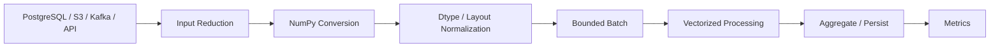

# README

## Overview

This section focuses on using NumPy effectively in performance-sensitive backend and data-processing workloads.

The emphasis is not on micro-optimizing every operation. It is on understanding how:

```text
Python execution
→ NumPy vectorization
→ array shape and broadcasting
→ memory layout
→ dtype
→ allocation
→ batching
→ storage I/O
```

affect real system performance.

The topics progress from the basic execution model of NumPy through memory-aware optimization, large-dataset processing, and disciplined benchmarking.

## Navigation

| # | File | Description |
|---|---|---|
| 01 | [01- NumPy Performance](./01-%20NumPy%20Performance.md) | Core NumPy performance model, CPU vs memory efficiency, vectorization, allocation, and optimization workflow |
| 02 | [02- Vectorization vs Loops](./02-%20Vectorization%20vs%20Loops.md) | Compare Python loops with vectorized NumPy execution and identify when loops are still appropriate |
| 03 | [03- Broadcasting Performance](./03-%20Broadcasting%20Performance.md) | Broadcasting costs, result-size growth, temporary allocations, and safe large-scale usage |
| 04 | [04- Memory Layout](./04-%20Memory%20Layout.md) | Shape, strides, C/F ordering, cache locality, contiguous vs non-contiguous access |
| 05 | [05- Contiguous Arrays](./05-%20Contiguous%20Arrays.md) | Work with contiguous buffers, layout normalization, and native-library interoperability |
| 06 | [06- Views vs Copies Performance](./06-%20Views%20vs%20Copies%20Performance.md) | Aliasing, copy costs, lifetime, ownership, and when a copy can improve performance |
| 07 | [07- Dtype Optimization](./07-%20Dtype%20Optimization.md) | Optimize memory and throughput through appropriate integer and floating-point dtypes |
| 08 | [08- Memory Usage](./08-%20Memory%20Usage.md) | Raw memory, peak working sets, temporary allocations, worker concurrency, and resource limits |
| 09 | [09- Avoiding Temporary Arrays](./09-%20Avoiding%20Temporary%20Arrays.md) | Reduce unnecessary intermediates using buffer reuse, out=, in-place operations, and streaming |
| 10 | [10- Batch Processing](./10-%20Batch%20Processing.md) | Process datasets in bounded batches while balancing memory, throughput, I/O, and retries |
| 11 | [11- Benchmarking](./11-%20Benchmarking.md) | Benchmark NumPy workloads correctly and distinguish CPU, memory, allocation, and I/O bottlenecks |


## Performance Model

The topics in this section build on a common performance model:


A performance problem should therefore be analyzed across multiple layers rather than assuming that NumPy syntax alone determines execution speed.

## Core Performance Concerns

### Python Overhead

Explicit element-by-element Python loops can introduce substantial interpreter overhead for large numerical workloads.

Vectorized NumPy operations move iteration into NumPy's native implementation where appropriate.

The important distinction is:

```text
Python controls every element
vs
NumPy controls the numerical iteration
```

### Memory Traffic

Large numerical workloads are often constrained by data movement rather than arithmetic.

Important factors include:

```text
dtype size
+
contiguity
+
strides
+
temporary arrays
+
copies
+
number of passes over the data
```

A faster CPU operation does not necessarily improve a memory-bound workload.

### Allocation

Large allocations and repeated copies can dominate execution time.

Performance-sensitive pipelines should understand:

```text
which operations allocate
which operations return views
which outputs can be reused
```

Use `out=`, preallocated buffers, batching, and streaming where they provide measurable benefits.

### Memory Layout

Shape describes logical organization, while strides determine how elements are traversed in the underlying buffer.

Performance can depend on:

```text
C-contiguous layout
+
Fortran-contiguous layout
+
non-contiguous views
+
access direction
```

The best layout depends on the dominant access pattern and downstream consumer.

### Dtypes

Dtypes influence:

```text
memory footprint
+
memory bandwidth
+
cache utilization
+
precision
+
range
```

Choose the narrowest valid representation that satisfies the numerical contract.

Do not optimize dtype purely from the current sample values.

### Batch Processing

Batch processing limits the working set:

```text
large dataset
→ bounded batch
→ vectorized processing
→ output
→ next batch
```

Batch size is a system-level tuning parameter because it affects:

```text
memory
+
throughput
+
latency
+
I/O
+
retry cost
```

### Benchmarking

Optimization should follow:

```text
measure
→ profile
→ identify bottleneck
→ optimize
→ benchmark
→ validate
→ load test
→ monitor
```

Never assume that a local NumPy microbenchmark represents end-to-end application performance.

## Production Optimization Flow

A production numerical workload may look like:



The most effective optimization may occur before or after NumPy itself.

For example:

```text
SQL filtering
```

may reduce millions of unnecessary rows before NumPy receives the data.

Likewise:

```text
streaming output
```

may reduce memory pressure more effectively than optimizing an individual numerical expression.

## Backend Integration

NumPy performance should be evaluated within the larger application architecture.

| System Component | Typical Performance Concern |
|---|---|
| FastAPI / Django | Request size, latency, serialization, synchronous CPU work |
| Celery | Worker concurrency, task memory, retry scope |
| PostgreSQL | Query efficiency, transferred rows, bulk operations |
| Kafka | Batch size, consumer lag, processing latency |
| S3 | Object transfer, request count, local staging |
| Docker | Memory and CPU limits |
| Kubernetes | Requests, limits, concurrency, OOM kills |
| Pandas | Representation conversion and memory duplication |
| NumPy | CPU execution, memory layout, allocation, dtype |
| CI/CD | Regression detection and reproducible benchmarks |

## Memory Efficiency Principles

For large numerical workloads:

```text
avoid unnecessary copies
+
avoid unnecessary temporaries
+
choose appropriate dtypes
+
use views when ownership permits
+
process in bounded batches
+
stream large outputs
+
control concurrency
```

A smaller final array is not enough. Optimize the peak working set.

## CPU vs Memory vs I/O

A useful first diagnostic is:

| Bottleneck | Typical Symptoms | Useful Direction |
|---|---|---|
| Python CPU overhead | High Python time, low native numerical work | Vectorize |
| Numerical CPU | High CPU utilization | Optimize algorithm / operation |
| Memory bandwidth | Large arrays, simple operations | Reduce bytes moved |
| Allocation | High peak memory, repeated buffers | Reuse / preallocate |
| Storage I/O | High I/O wait, slow file access | Improve access pattern / storage |
| Database | NumPy time is small relative to SQL | Optimize query / transfer |
| Network | Large transfer dominates | Reduce payload / batch appropriately |
| Concurrency | Good single-task performance, poor multi-task behavior | Tune worker count and memory |

This prevents optimizing the wrong layer.

## Recommended Performance Checklist

Before shipping a performance-sensitive NumPy workload, verify:

- The algorithm is appropriate for the workload.
- Python loops are not used for work that can be naturally vectorized.
- Broadcasted result shapes are understood.
- Dtypes are intentional.
- Contiguity and strides are appropriate.
- Large slices are views when safe.
- Copies are intentional and measured.
- Temporary arrays are understood.
- Large workloads are processed in bounded batches.
- Output is streamed when it cannot fit safely in memory.
- Worker concurrency matches the memory budget.
- PostgreSQL and storage layers are not transferring unnecessary data.
- Benchmarks use production-like data sizes and dtypes.
- Correctness is verified after optimization.
- Production metrics track latency, throughput, memory, and failures.

## Interview Focus

The most important questions from this section are conceptual and performance-oriented:

- Why are NumPy arrays generally faster than Python lists for numerical workloads?
- What is vectorization, and what overhead does it remove?
- What are the performance and memory implications of broadcasting?
- What is the difference between a view and a copy?
- Why can a non-contiguous view be slower than a contiguous copy?
- How does dtype size affect memory and throughput?
- Why can a vectorized expression still create significant temporary memory?
- How would you process a dataset larger than available RAM?
- How would you determine whether a workload is CPU-, memory-, or I/O-bound?
- How would you benchmark a NumPy optimization without producing misleading results?

## Performance Architecture

A mature NumPy pipeline generally follows:

```text
Define performance target
        ↓
Measure baseline
        ↓
Identify bottleneck
        ↓
Reduce unnecessary data
        ↓
Choose dtype / layout
        ↓
Vectorize numerical work
        ↓
Control allocations
        ↓
Batch large workloads
        ↓
Benchmark
        ↓
Validate correctness
        ↓
Load test
        ↓
Monitor production
```

The objective is not maximum NumPy complexity.

The objective is predictable, measurable performance within the application's:

```text
latency
+
memory
+
throughput
+
cost
+
reliability
```

constraints.

## Key Takeaways

- NumPy performance is determined by the interaction of execution model, memory layout, dtype, allocation behavior, batching, and I/O rather than by vectorization alone.
- Avoid unnecessary copies and temporary arrays, choose appropriate dtypes, and match memory layout to the dominant access pattern.
- Batch processing provides predictable memory usage and should be combined with vectorized operations, controlled concurrency, and streaming output for large datasets.
- Optimize the complete backend pipeline, including PostgreSQL, Kafka, S3, API serialization, and worker orchestration, rather than focusing only on NumPy expressions.
- Benchmark representative workloads, validate correctness, and use production metrics to confirm that an optimization improves the actual system.