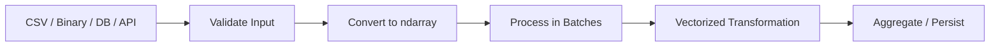

# 01- NumPy Fundamentals

## Overview

NumPy fundamentals are the foundation for understanding efficient numerical processing in Python.

For backend and data-engineering work, the important skill is not memorizing NumPy APIs. It is understanding the array execution model well enough to reason about:

- data representation
- shape and dimensionality
- dtype and memory usage
- indexing and selection
- vectorized operations
- broadcasting
- views and copies
- aggregation
- performance trade-offs

Most NumPy interview questions ultimately test whether you can predict array behavior rather than whether you remember a particular function name.

A strong mental model is:

```text
Python data
    ↓
ndarray
    ↓
shape + dtype + strides
    ↓
indexing / transformation
    ↓
vectorized computation
    ↓
aggregation / output
```

## Why NumPy Matters in Backend Engineering

NumPy is useful when a backend system needs to process dense numerical data efficiently.

Typical workloads include:

- ETL and data-cleaning pipelines
- numerical validation
- batch transformations
- metrics aggregation
- preprocessing API or database payloads
- large CSV, binary, or memory-mapped datasets
- performance-sensitive data processing
- numerical stages inside Pandas-based pipelines

NumPy is not a replacement for Python collections.

Use:

| Structure | Best Fit |
|---|---|
| `list` | General-purpose ordered collection |
| `dict` | Key-value lookup |
| `set` | Membership and uniqueness |
| `tuple` | Immutable heterogeneous collection |
| `np.ndarray` | Homogeneous numerical data and vectorized computation |
| `pd.Series` | One-dimensional labeled data |
| `pd.DataFrame` | Tabular labeled data and ETL |

The engineering decision is driven by the data model and workload, not by the assumption that NumPy is always faster.

## NumPy's Core Data Model

### `ndarray`

The central NumPy type is `numpy.ndarray`.

An `ndarray` stores elements in a structured numerical buffer with metadata describing how those elements should be interpreted.

The important properties are:

```python
import numpy as np

values = np.array(
    [
        [120.5, 130.0, 125.75],
        [99.0, 101.5, 100.25],
    ],
    dtype=np.float64,
)

print(values.shape)
print(values.ndim)
print(values.dtype)
print(values.size)
print(values.itemsize)
print(values.nbytes)
```

These properties answer different questions:

| Property | Meaning |
|---|---|
| `shape` | Length of each axis |
| `ndim` | Number of dimensions |
| `size` | Total number of elements |
| `dtype` | Element data type |
| `itemsize` | Bytes used by each element |
| `nbytes` | Bytes occupied by the array data buffer |

For this array:

```text
shape   = (2, 3)
ndim    = 2
size    = 6
dtype   = float64
itemsize = 8
nbytes  = 48
```

`nbytes` describes the array's data buffer. It does not represent the complete Python process memory footprint.

## Dimensions, Shape, and Axes

An array's dimensions are called axes.

```python
import numpy as np

data = np.array(
    [
        [10, 20, 30],
        [40, 50, 60],
    ]
)

print(data.shape)  # (2, 3)
print(data.ndim)   # 2
```

The shape `(2, 3)` means:

```text
2 rows
3 values per row
```

For a two-dimensional array:

```text
axis=0 → down rows
axis=1 → across columns
```

This matters heavily for aggregation:

```python
row_totals = data.sum(axis=1)
column_totals = data.sum(axis=0)
```

```text
           columns
        0    1    2
      ┌─────────────
rows 0│ 10   20   30
rows 1│ 40   50   60
```

Result:

```text
sum(axis=0) → [50, 70, 90]
sum(axis=1) → [60, 150]
```

An interview question such as "What does `axis=0` mean?" should be answered in terms of the dimension being reduced, not simply "rows" or "columns," because the interpretation depends on the array's dimensional structure.

## Array Creation

Common creation patterns include:

```python
import numpy as np

values = np.array([10, 20, 30], dtype=np.int64)

zeros = np.zeros(5, dtype=np.float64)

ones = np.ones((2, 3), dtype=np.float64)

empty = np.empty(1024, dtype=np.float64)

sequence = np.arange(0, 100, 10)

evenly_spaced = np.linspace(0, 1, 5)
```

### `array`

Use `np.array()` when converting known data into an explicit NumPy array.

```python
records = np.array([10, 20, 30], dtype=np.int64)
```

### `zeros` and `ones`

Useful for initialized buffers and fixed-size structures.

```python
buffer = np.zeros(10_000, dtype=np.float32)
```

### `empty`

`np.empty()` allocates the requested memory without initializing the values.

```python
buffer = np.empty(10_000, dtype=np.float64)

# Every element must be assigned before it is read.
buffer.fill(0.0)
```

Reading an `empty` array before writing to it is a common bug.

### `arange`

Useful for integer-like sequences.

```python
values = np.arange(0, 100, 5)
```

For floating-point step requirements, understand that floating-point accumulation can make `linspace()` preferable when the number of desired samples is known.

### `linspace`

Useful when the endpoints and number of samples are the important constraints.

```python
values = np.linspace(0.0, 1.0, num=101)
```

## Dtypes

NumPy arrays normally store homogeneous elements.

```python
values = np.array([1, 2, 3], dtype=np.int32)
```

The dtype determines how each element is represented.

Common choices include:

| dtype | Typical Size | Typical Use |
|---|---:|---|
| `int32` | 4 bytes | Bounded integer data |
| `int64` | 8 bytes | General Python-compatible integer arrays |
| `float32` | 4 bytes | Memory-sensitive approximate numerical processing |
| `float64` | 8 bytes | Higher precision numerical calculations |
| `bool` | 1 byte | Masks and flags |
| `str_` | Fixed-width Unicode | Specialized textual array use |

Do not narrow a dtype merely because sample values happen to fit.

Consider:

- maximum and minimum range
- required precision
- overflow behavior
- downstream consumers
- serialization requirements
- database representation

For example:

```python
values = np.array([100, 200, 300], dtype=np.int16)
```

may be memory-efficient, but if future values can exceed the dtype range, narrowing becomes a correctness problem.

## Python Lists vs NumPy Arrays

The difference is architectural, not simply syntactic.

### Python list

A Python list stores references to Python objects.

```python
values = [10, 20, 30]
```

Elements can be heterogeneous:

```python
values = [10, 2.5, "ok"]
```

### NumPy array

A standard numerical array is designed for homogeneous data.

```python
values = np.array([10, 20, 30], dtype=np.int64)
```

The data can be stored in a compact numerical buffer and processed by native NumPy operations.

### Comparison

| Characteristic | Python List | NumPy Array |
|---|---|---|
| Element types | Can vary | Usually homogeneous |
| Numerical storage | Python objects/references | Dense typed buffer |
| Vectorized arithmetic | No | Yes |
| General-purpose use | Excellent | Limited |
| Numerical workloads | Often inefficient for large data | Usually appropriate |
| Resizing | Convenient | More expensive than list growth |
| Memory model | General Python object model | Typed contiguous or strided storage |

NumPy should not replace lists for ordinary application logic.

A Django or FastAPI service will still use dictionaries, lists, classes, and other Python structures extensively.

## Indexing

Standard indexing accesses individual elements or subarrays.

```python
values = np.array(
    [
        [10, 20, 30],
        [40, 50, 60],
    ]
)

first_row = values[0]
second_row = values[1]

first_value = values[0, 0]
last_value = values[-1, -1]
```

Multiple dimensions can be indexed directly:

```python
value = values[1, 2]
```

This is preferable to unnecessary chained indexing when a direct multi-axis expression is available.

```python
# Prefer
value = values[1, 2]

# Less direct
value = values[1][2]
```

## Slicing

Basic slicing selects ranges of data.

```python
values = np.arange(20)

subset = values[5:15]
```

For multidimensional arrays:

```python
matrix = np.arange(20).reshape(4, 5)

subset = matrix[1:3, 2:5]
```

A critical interview and production concept is that basic slicing commonly returns a **view**, not an independent copy.

```python
subset = matrix[1:3, 2:5]
subset[:] = 0
```

The original array may change because both arrays can refer to the same underlying storage.

This is efficient but requires aliasing awareness.

## Boolean Masking

Boolean masking selects elements according to a condition.

```python
values = np.array([10, 25, 5, 40, 15])

mask = values >= 20
filtered = values[mask]
```

Result:

```text
[25, 40]
```

This is useful for validation and filtering:

```python
valid = np.isfinite(values) & (values >= 0)
clean_values = values[valid]
```

Boolean selection is generally a data-selection operation that creates a new result array.

### Backend Example

Suppose an API receives a batch of transaction amounts that must be non-negative and finite:

```python
amounts = np.asarray(payload_amounts, dtype=np.float64)

valid = np.isfinite(amounts) & (amounts >= 0)

if not np.all(valid):
    raise ValueError("Transaction amounts contain invalid values.")

total = amounts.sum()
```

The validation logic is vectorized and avoids a Python loop over every element.

For untrusted API input, validate request size and element counts before allocating unnecessarily large arrays.

## Vectorization

Vectorization means expressing a numerical operation over an entire array instead of manually iterating over each element in Python.

### Explicit Python loop

```python
result = np.empty_like(values, dtype=np.float64)

for index, value in enumerate(values):
    result[index] = value * 1.18
```

### Vectorized operation

```python
result = values * 1.18
```

The vectorized approach delegates the core iteration to NumPy's native implementation.

The primary reason for the performance advantage is not that multiplication itself became mathematically faster. It is that Python interpreter overhead is removed from the per-element execution path.

However, vectorization can introduce additional allocations:

```python
result = values * 1.18
```

creates a new output array.

Therefore:

```text
less Python overhead
```

does not automatically mean:

```text
less memory usage
```

## Broadcasting

Broadcasting allows operations on compatible shapes without explicitly repeating smaller arrays.

```python
prices = np.array(
    [
        [100.0, 120.0, 150.0],
        [80.0, 90.0, 110.0],
    ]
)

tax_rates = np.array([0.18, 0.18, 0.12])

final_prices = prices * (1.0 + tax_rates)
```

The smaller array is conceptually aligned with the larger array.

NumPy does not need to construct a full repeated copy of `tax_rates` merely to perform the multiplication.

Broadcasting compatibility is determined from the trailing dimensions.

For example:

```text
(2, 3)
(3,)
```

is compatible because:

```text
3 matches 3
```

A dangerous case is:

```text
(50_000, 1)
+
(1, 50_000)
```

which can produce:

```text
(50_000, 50_000)
```

That result contains 2.5 billion elements. With `float64`, the output alone would require approximately 20 GB.

Broadcasting can therefore avoid one input allocation while still producing an enormous output.

## Reshaping

`reshape()` changes the logical dimensions when the requested shape is compatible with the number of elements.

```python
values = np.arange(12)

matrix = values.reshape(3, 4)
```

The element count must remain consistent:

```text
12 = 3 × 4
```

Reshaping may return a view or a copy depending on the existing memory layout and requested shape.

Do not assume `reshape()` always allocates or always avoids allocation.

## Views and Copies

This distinction is one of the most important NumPy interview topics.

### View

A view exposes existing memory through another array object.

```python
values = np.arange(10)

window = values[2:6]

window[:] = 0
```

The original array can be modified because the slice commonly shares storage.

### Copy

A copy owns independent storage.

```python
values = np.arange(10)

snapshot = values[2:6].copy()

snapshot[:] = 0
```

Now modifications to `snapshot` do not modify `values`.

### Why It Matters

Views provide:

- lower allocation cost
- lower memory usage
- efficient slicing

Copies provide:

- ownership isolation
- safer mutation boundaries
- stable snapshots
- predictable lifetime

The right choice depends on whether shared storage is desirable.

## Detecting Shared Memory

For debugging memory relationships:

```python
shares = np.shares_memory(values, subset)
```

`np.may_share_memory()` can provide a conservative answer and may report possible overlap even when exact overlap is uncertain.

Do not use `.base` as a general-purpose ownership contract. It is useful for inspection, but memory relationships can be more complex than a simple parent-child chain.

## Aggregation

NumPy provides vectorized aggregation operations:

```python
values = np.array([10, 20, 30, 40, 50], dtype=np.float64)

total = values.sum()
average = values.mean()
minimum = values.min()
maximum = values.max()
```

For two-dimensional data:

```python
data = np.array(
    [
        [10, 20, 30],
        [40, 50, 60],
    ]
)

column_totals = data.sum(axis=0)
row_totals = data.sum(axis=1)
```

Aggregation should be interpreted together with shape and axis semantics.

### NaN-Aware Aggregation

When missing values are represented using `NaN`:

```python
values = np.array([10.0, np.nan, 30.0])

average = np.nanmean(values)
```

The `nan*` family treats `NaN` differently from ordinary aggregation functions.

This does not mean all invalid numerical values disappear automatically. Positive and negative infinity are not `NaN`.

```python
values = np.array([10.0, np.nan, np.inf])
```

A pipeline requiring finite values should explicitly validate them:

```python
valid = np.isfinite(values)
```

## Conditional Operations

`np.where()` is useful when selecting between two values.

```python
prices = np.array([100.0, 50.0, 200.0])

discounted = np.where(
    prices >= 100.0,
    prices * 0.90,
    prices,
)
```

`np.where()` is not a general guarantee of lazy branch evaluation.

For operations such as division where invalid arithmetic could occur, `np.divide()` with an output buffer and `where` condition can provide safer control:

```python
numerator = np.array([10.0, 20.0, 30.0])
denominator = np.array([2.0, 0.0, 5.0])

result = np.full_like(numerator, np.nan)

np.divide(
    numerator,
    denominator,
    out=result,
    where=denominator != 0,
)
```

This is often preferable when both correctness and allocation behavior matter.

## Array Manipulation

Common operations include:

| Operation | Main Purpose |
|---|---|
| `reshape()` | Change dimensions |
| `ravel()` | Flatten, preferably as a view when possible |
| `flatten()` | Flatten into a new copy |
| `transpose()` | Reorder axes |
| `concatenate()` | Join arrays along an existing axis |
| `stack()` | Combine arrays along a new axis |
| `split()` | Partition an array |
| `repeat()` | Repeat elements |
| `tile()` | Repeat an array pattern |

A common interview distinction is:

```text
ravel()
```

tries to avoid copying where possible, whereas:

```text
flatten()
```

returns a copy.

Similarly, repeated use of:

```python
np.append(...)
```

inside a loop can be inefficient because each append creates a new array.

Prefer collecting results and concatenating once when the workload is moderate:

```python
chunks = []

for batch in batches:
    chunks.append(process_batch(batch))

result = np.concatenate(chunks)
```

For very large results, an output strategy should be designed around memory limits instead of collecting everything first.

## File and Batch Processing

NumPy is useful when numerical data comes from files or external systems.

A production-oriented pattern is:



For large datasets:

```python
import numpy as np

def process_batch(values: np.ndarray) -> np.ndarray:
    valid = np.isfinite(values)
    cleaned = values[valid]
    return cleaned * 1.18
```

The important architectural point is that Python controls the batch boundary while NumPy handles the numerical work inside each batch.

This provides a practical balance:

```text
Python loop across batches
+
NumPy vectorization within a batch
```

## Random Data and Reproducibility

NumPy's modern random API uses generators:

```python
import numpy as np

rng = np.random.default_rng(42)

sample = rng.normal(
    loc=100.0,
    scale=15.0,
    size=1_000,
)
```

A fixed seed is useful for:

- repeatable tests
- benchmark fixtures
- deterministic examples
- debugging

Do not use deterministic random data where production security requires unpredictability.

NumPy's random generators are not a substitute for cryptographic randomness. Authentication tokens, password-reset values, session secrets, and other security-sensitive values should use appropriate cryptographic facilities such as Python's `secrets` module.

## NumPy and Pandas

NumPy and Pandas solve related but different problems.

### Prefer NumPy when

- data is primarily numerical
- homogeneous arrays are sufficient
- vectorized numerical operations dominate
- memory and execution efficiency matter
- labels and heterogeneous columns are unnecessary

### Prefer Pandas when

- data is tabular
- columns have different logical types
- labels matter
- joins and grouped transformations dominate
- CSV, JSON, or Parquet data is being handled as tables

A common backend/data-engineering pipeline is:

```text
Database / API / File
        ↓
Pandas DataFrame
        ↓
select numerical columns
        ↓
NumPy operations
        ↓
Pandas DataFrame
        ↓
storage / API / reporting
```

Conversion should not be treated as free.

For example:

```python
numeric_values = frame[["price", "quantity"]].to_numpy()
```

The memory behavior depends on the selected data, dtype compatibility, and representation.

The engineering question is not "Should I always use NumPy or Pandas?"

It is:

```text
Which representation best matches each stage of the pipeline?
```

## Common Interview Traps

### "NumPy is always faster than Python."

Incorrect.

NumPy is generally advantageous for large homogeneous numerical workloads because vectorized operations can reduce Python overhead and operate efficiently on dense typed data.

For small arrays or workloads dominated by object manipulation, Python-native structures may be simpler and sufficiently fast.

### "Broadcasting duplicates the smaller array."

Not necessarily.

Broadcasting provides shape compatibility without necessarily materializing a repeated copy of the smaller input.

However, the operation's output or intermediates can still be large.

### "A slice always creates a copy."

Incorrect.

Basic slicing commonly produces a view.

Boolean and fancy indexing generally produce a new result array.

### "A reshape is always free."

Incorrect.

`reshape()` may return a view or may require a copy depending on memory layout and the requested shape.

### "A NumPy array is just a Python list with faster loops."

Incorrect.

The storage and execution models are fundamentally different.

A NumPy array provides a typed, structured numerical representation with shape and stride metadata and native numerical operations.

### "`np.vectorize()` makes Python functions fast."

Incorrect.

`np.vectorize()` is primarily a convenience interface for applying Python callables element-wise. It should not be confused with true native vectorized numerical operations.

### "`nbytes` tells me how much memory my service uses."

Incorrect.

`nbytes` measures the array's data buffer.

A production process also consumes memory for:

- Python objects
- interpreter state
- other arrays
- temporary allocations
- imported libraries
- network buffers
- framework state

Measure process-level memory when diagnosing service resource usage.

## Practical Debugging Questions

When an array operation behaves unexpectedly, inspect:

```python
print(values.shape)
print(values.dtype)
print(values.ndim)
print(values.strides)
print(values.nbytes)
print(values.flags)
```

For memory-sharing questions:

```python
print(np.shares_memory(values, other))
```

For numerical validity:

```python
print(np.isfinite(values).all())
```

For correctness in tests:

```python
np.testing.assert_allclose(
    actual,
    expected,
    rtol=1e-6,
    atol=1e-9,
)
```

These checks are usually more useful than guessing based on appearance.

## Scenario-Based Interview Questions

### Scenario: Large Numerical API Payload

A FastAPI endpoint receives tens of thousands of numerical values and calculates derived metrics.

What should you consider?

```text
request-size limits
→ dtype selection
→ finite-value validation
→ vectorized computation
→ temporary allocations
→ response serialization
→ latency and memory limits
```

Do not optimize only the NumPy expression while ignoring HTTP parsing and serialization.

### Scenario: Dataset Larger Than RAM

A service must process several hundred gigabytes of numerical records.

A reasonable approach is:

```text
storage
→ bounded reads
→ NumPy batch
→ vectorized processing
→ aggregate / persist
→ release batch
```

Memory mapping can help for suitable local file workloads, but it does not eliminate the need to manage working-set size and downstream allocations.

### Scenario: NumPy Optimization Made the Service Slower

Possible causes include:

- additional temporary arrays
- larger dtype
- non-contiguous access
- unnecessary conversion from Pandas
- excessive copying
- larger intermediate results
- database or network overhead dominating the numerical stage

The correct response is to benchmark the complete workload rather than assuming the new NumPy code is better.

## Short Coding Problems

### Problem: Filter Invalid Values

Given an array of transaction amounts, return only finite non-negative values.

```python
import numpy as np

def valid_amounts(values: np.ndarray) -> np.ndarray:
    values = np.asarray(values, dtype=np.float64)
    mask = np.isfinite(values) & (values >= 0)
    return values[mask]
```

Key concepts:

```text
dtype
+
vectorized validation
+
boolean masking
+
invalid numerical values
```

### Problem: Per-Column Totals

```python
import numpy as np

def column_totals(values: np.ndarray) -> np.ndarray:
    values = np.asarray(values)
    return values.sum(axis=0)
```

The important interview discussion is not the syntax. It is understanding the meaning of `axis=0` and how the result shape changes.

### Problem: Apply a Scalar Transformation

```python
import numpy as np

def add_tax(values: np.ndarray, rate: float) -> np.ndarray:
    values = np.asarray(values, dtype=np.float64)
    return values * (1.0 + rate)
```

Interview discussion should cover:

- vectorization
- output allocation
- dtype
- input validation
- broadcasting of the scalar
- whether the input should remain unchanged

## Production Checklist

Before using NumPy in a backend or data-processing service, verify:

| Area | Questions |
|---|---|
| Representation | Is `ndarray` actually the right representation? |
| Input | Are shape, element count, and values validated? |
| Dtype | Is precision and range sufficient? |
| Memory | Are copies and temporaries understood? |
| Shape | Are broadcasting and output dimensions predictable? |
| Performance | Is the workload CPU-, memory-, or I/O-bound? |
| Batching | Can the complete dataset fit safely in memory? |
| Correctness | Are numerical edge cases tested? |
| Observability | Are latency, throughput, and memory measurable? |
| Security | Are externally supplied array sizes bounded? |

For user-controlled numerical inputs, dimensionality and element counts should be bounded before expensive allocations or broadcast operations occur. Otherwise, an apparently valid request can become a resource-exhaustion vector.

## Key Takeaways

- `ndarray` is the core NumPy abstraction; understanding `shape`, `ndim`, `dtype`, `strides`, and memory ownership is more important than memorizing APIs.
- Vectorization, broadcasting, and aggregation reduce Python-level overhead, but they can still create large outputs or temporary allocations.
- Basic slicing commonly produces views, while boolean and fancy indexing generally create new arrays; understanding this distinction prevents both accidental mutation and unnecessary memory usage.
- NumPy is a numerical foundation rather than a replacement for Python collections or Pandas; choose the representation that fits each pipeline stage.
- Strong NumPy interview performance comes from reasoning about correctness, memory, performance, and trade-offs rather than recalling isolated syntax.