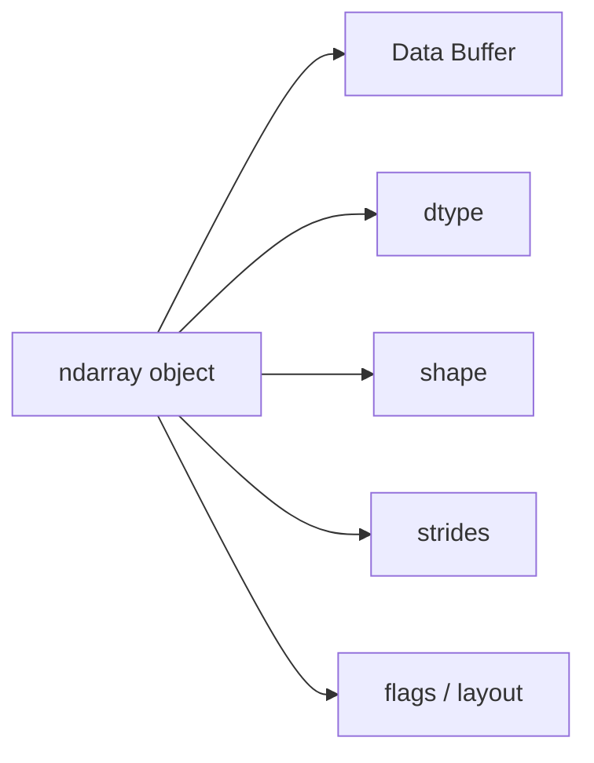
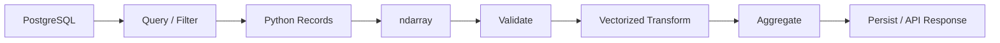

# 02- ndarray

## Overview

`numpy.ndarray` is the core data structure in NumPy. Most NumPy behavior follows from understanding how an array combines:

```text
data buffer
+
dtype
+
shape
+
strides
+
memory layout
```

For backend and data-engineering work, the important question is not simply how to create an array. It is how the array behaves when it is indexed, reshaped, broadcast, copied, passed between systems, and processed at scale.

A strong `ndarray` mental model makes it possible to reason about:

- numerical correctness
- memory consumption
- vectorized execution
- views versus copies
- contiguous versus non-contiguous memory
- broadcasting
- batch processing
- interoperability with Pandas, databases, files, and APIs

## What `ndarray` Is

`ndarray` means **N-dimensional array**.

It represents a homogeneous collection of values organized according to one or more axes.

```python
import numpy as np

values = np.array(
    [
        [100, 200, 300],
        [400, 500, 600],
    ],
    dtype=np.int64,
)
```

The array contains:

```text
2 dimensions
2 rows
3 columns
6 elements
```

The core metadata is:

```python
values.shape
values.ndim
values.size
values.dtype
values.itemsize
values.nbytes
values.strides
```

These properties describe different aspects of the same array.

| Attribute | Meaning | Example |
|---|---|---|
| `shape` | Size along each axis | `(2, 3)` |
| `ndim` | Number of axes | `2` |
| `size` | Total element count | `6` |
| `dtype` | Element representation | `int64` |
| `itemsize` | Bytes per element | `8` |
| `nbytes` | Data-buffer size | `48` |
| `strides` | Byte step between adjacent indices on each axis | implementation-dependent |

## Why `ndarray` Exists

Python's general-purpose collections are designed for flexible application logic.

NumPy's `ndarray` is optimized around a different model:

```text
homogeneous data
+
typed storage
+
shape metadata
+
strides
+
native numerical operations
```

This model is useful when processing large numerical datasets because NumPy can operate over dense numerical storage without requiring Python-level work for every element.

For example:

```python
values = np.arange(1_000_000, dtype=np.float64)

result = values * 1.18
```

The Python process expresses the transformation once, while NumPy performs the element-wise numerical operation through its native execution machinery.

This does not mean every NumPy operation is faster than every Python operation. The advantage depends on workload size, data type, operation, memory access, allocation, and the amount of Python overhead being removed.

## Internal Representation

A useful simplified model of an `ndarray` is:



The array object contains metadata that tells NumPy how to interpret a memory buffer.

This is why two array objects can expose the same underlying data differently.

For example, a slice can have:

```text
same data buffer
+
different shape
+
different starting offset
+
different strides
```

That is the foundation of NumPy views.

## `shape`

`shape` describes the number of elements along each axis.

```python
values = np.array(
    [
        [10, 20, 30],
        [40, 50, 60],
    ]
)

print(values.shape)
```

Output:

```text
(2, 3)
```

For a two-dimensional array:

```text
axis 0 → length 2
axis 1 → length 3
```

The total element count is:

```python
assert values.size == 2 * 3
```

For a three-dimensional array:

```python
values = np.empty((4, 8, 16), dtype=np.float64)
```

the shape means:

```text
axis 0: 4
axis 1: 8
axis 2: 16
```

The shape is logical metadata. It does not by itself tell you how bytes are laid out in memory.

## `ndim`

`ndim` tells you how many axes an array has.

```python
scalar = np.array(42)
vector = np.array([1, 2, 3])
matrix = np.array([[1, 2], [3, 4]])

print(scalar.ndim)  # 0
print(vector.ndim)  # 1
print(matrix.ndim)  # 2
```

This distinction matters because many NumPy APIs interpret `axis` relative to `ndim`.

A scalar is zero-dimensional:

```text
shape = ()
```

A one-dimensional array:

```text
shape = (N,)
```

A two-dimensional array:

```text
shape = (rows, columns)
```

The one-dimensional shape `(N,)` is particularly important because it is not the same thing as:

```text
(N, 1)
```

The first has one axis; the second has two axes.

## `size`

`size` is the total number of elements.

```python
values = np.empty((100, 20), dtype=np.float32)

print(values.size)
```

Output:

```text
2000
```

This matters for resource validation.

For example, a backend endpoint accepting user-controlled dimensions should bound the resulting element count before allocating:

```python
rows = 20_000
columns = 20_000

element_count = rows * columns

if element_count > 10_000_000:
    raise ValueError("Requested array is too large.")
```

Shape validation is part of resource-exhaustion protection when array dimensions originate from untrusted input.

## `dtype`

`dtype` describes how each element is represented.

```python
values = np.array(
    [10, 20, 30],
    dtype=np.int32,
)

print(values.dtype)
print(values.itemsize)
```

Output is conceptually:

```text
int32
4
```

A dtype affects:

- memory consumption
- numerical range
- precision
- conversion cost
- interoperability
- sometimes CPU and memory-bandwidth efficiency

A useful relationship is:

```text
nbytes = size × itemsize
```

For a one-million-element `float64` array:

```text
1,000,000 × 8 bytes = 8 MB
```

This is the size of the array's data buffer, not total process memory.

## Homogeneous Storage

A regular NumPy numerical array has one dtype for its elements.

```python
values = np.array([1, 2, 3], dtype=np.int32)
```

If mixed input is supplied, NumPy may promote the values to a common representation.

```python
values = np.array([1, 2.5, 3])
```

The resulting dtype must be capable of representing all values under NumPy's type-promotion rules.

This matters because implicit promotion can increase memory usage or alter numerical behavior.

When performance and correctness matter, make important dtype decisions explicit:

```python
values = np.asarray(raw_values, dtype=np.float64)
```

## `itemsize`

`itemsize` reports the number of bytes used by one element.

```python
values = np.empty(1_000, dtype=np.float32)

print(values.itemsize)
```

Output:

```text
4
```

Compare:

```python
float32_values = np.empty(1_000_000, dtype=np.float32)
float64_values = np.empty(1_000_000, dtype=np.float64)

print(float32_values.nbytes)
print(float64_values.nbytes)
```

The `float64` array requires twice the data-buffer memory.

This can matter at scale because reducing bytes moved through memory can improve cache behavior and memory bandwidth utilization.

The trade-off is numerical range and precision.

## `nbytes`

`nbytes` describes the memory consumed by the array's data buffer.

```python
values = np.empty((1000, 1000), dtype=np.float64)

print(values.nbytes)
```

For one million `float64` elements:

```text
8,000,000 bytes
```

Do not interpret this as process RSS.

A Python service can consume much more memory because of:

```text
Python objects
+
multiple arrays
+
temporary results
+
framework state
+
network buffers
+
database clients
+
allocator overhead
```

Use process-level metrics when investigating service memory.

## `strides`

Strides describe how many bytes NumPy moves in memory when an index along each axis increases by one.

Consider:

```python
values = np.array(
    [
        [10, 20, 30],
        [40, 50, 60],
    ],
    dtype=np.int64,
)

print(values.shape)
print(values.strides)
```

For a typical C-contiguous layout, the conceptual relationship is:

```text
row step    = number of columns × itemsize
column step = itemsize
```

Because `int64` occupies 8 bytes:

```text
shape   = (2, 3)
strides ≈ (24, 8)
```

Strides are critical for understanding why:

- some views are cheap to create
- some access patterns are cache-friendly
- transposed arrays can be non-contiguous
- operations may need to copy data to obtain a preferred layout

## C-Contiguous and Fortran-Contiguous Arrays

Two common memory-order conventions are:

| Layout | Typical Contiguous Direction |
|---|---|
| C order | Last axis varies fastest |
| Fortran order | First axis varies fastest |

Inspect layout with:

```python
print(values.flags.c_contiguous)
print(values.flags.f_contiguous)
```

A C-contiguous two-dimensional array is arranged so that each row's values are adjacent in memory.

A Fortran-contiguous array makes columns contiguous instead.

Neither is universally better.

The correct layout depends on:

- access pattern
- downstream native libraries
- vectorized operation
- serialization format
- interoperability requirements

## Shape Is Not Layout

Two arrays can have the same shape and dtype but different memory layouts.

For example:

```python
values = np.arange(12).reshape(3, 4)
transposed = values.T

print(values.shape)
print(transposed.shape)
```

Both expose the same number of elements, but the transpose changes how those elements are traversed.

The transposed array can often be represented as a view using different strides rather than copying every element.

That efficiency comes with potentially less cache-friendly access.

## Array Flags

`flags` provide useful information about memory layout and ownership.

```python
print(values.flags)
```

Commonly relevant flags include:

- `C_CONTIGUOUS`
- `F_CONTIGUOUS`
- `OWNDATA`
- `WRITEABLE`

These are useful for debugging and interoperability.

For example:

```python
if not values.flags.c_contiguous:
    values = np.ascontiguousarray(values)
```

Do not normalize layout automatically in every code path. Converting a non-contiguous array can allocate and copy the entire dataset.

Use it when the consumer or performance profile benefits from contiguity.

## Indexing and `ndarray`

Indexing produces either a scalar, view, or new array depending on the indexing mechanism.

```python
values = np.arange(12).reshape(3, 4)

scalar = values[1, 2]
row = values[1]
window = values[1:, 1:3]
```

These operations have different memory behavior.

| Operation | Typical Result |
|---|---|
| Scalar indexing | NumPy scalar / scalar-like value |
| Basic slicing | View |
| Boolean indexing | New array |
| Fancy integer indexing | New array |
| Transpose | Usually a view with changed strides |
| `reshape()` | View when possible, otherwise copy |

"Typical" is important because advanced operations can have implementation-dependent details and layout constraints.

## Views

A view creates a new array object that references existing data.

```python
values = np.arange(10)

window = values[2:6]

window[:] = 0
```

The original array changes because `window` and `values` can share the same underlying storage.

This is useful when:

- copying would be expensive
- shared mutation is controlled
- a bounded window is needed
- temporary array objects should remain lightweight

The risk is accidental aliasing.

In a backend service, passing a view into a function that mutates its input can create surprising side effects.

Use `.copy()` when isolation is required:

```python
snapshot = values[2:6].copy()
```

## Copy Semantics

A copy creates independent storage.

```python
values = np.arange(10)

snapshot = values[2:6].copy()

snapshot[:] = 0
```

Now:

```text
values   → unchanged
snapshot → modified
```

Copies are appropriate when:

- ownership must be isolated
- data is passed across mutation boundaries
- a snapshot must remain stable
- a contiguous representation is explicitly required
- retaining a small slice must not keep a huge source array alive

The last point matters in long-lived processes.

A tiny view can keep a very large source array reachable through shared storage.

For example:

```python
large = np.empty(100_000_000, dtype=np.float64)

small = large[:10]
```

If `small` survives while `large` is otherwise discarded, the underlying large allocation can remain relevant to memory lifetime.

Copying the small result can sometimes reduce retained memory:

```python
small = large[:10].copy()
```

The correct decision depends on allocation cost and object lifetime.

## `np.shares_memory`

When memory aliasing matters, use explicit checks:

```python
shares = np.shares_memory(values, window)
```

This is useful in tests and diagnostics.

`np.may_share_memory()` can provide a conservative answer and may report possible overlap without proving exact overlap.

`.base` can be useful for inspection, but it should not be treated as a complete ownership model.

## Array Creation and Ownership

`np.asarray()` is useful when normalizing inputs to NumPy representation:

```python
def process(values) -> np.ndarray:
    array = np.asarray(values, dtype=np.float64)
    return array * 1.18
```

One advantage of `asarray()` is that compatible NumPy input may be reused rather than unnecessarily copied.

However, dtype conversion or incompatible input can require new storage.

Use `np.asarray()` when the objective is:

```text
"give me an ndarray representation"
```

rather than:

```text
"always give me an independent copy"
```

When ownership isolation is required, use an explicit copy.

## Mutability

NumPy arrays are generally mutable.

```python
values = np.array([10, 20, 30])

values[0] = 99
```

The write affects the array in place.

An array can also be made read-only:

```python
values.flags.writeable = False
```

Attempting mutation afterward raises an error.

Read-only views can be useful at application boundaries where accidental mutation is undesirable.

However, read-only flags are not a replacement for proper ownership design.

## Zero-Dimensional Arrays

A zero-dimensional array contains one element but no axes.

```python
value = np.array(42)

print(value.shape)  # ()
print(value.ndim)   # 0
```

This differs from a Python scalar and from:

```python
np.array([42])
```

which has:

```text
shape = (1,)
ndim = 1
```

This distinction can matter when APIs rely on exact shape semantics.

## One-Dimensional vs Column Arrays

These are different:

```python
vector = np.array([1, 2, 3])
column = np.array([[1], [2], [3]])
```

Shapes:

```text
vector  → (3,)
column  → (3, 1)
```

This distinction becomes important for broadcasting.

For example:

```python
vector = np.array([1, 2, 3])
column = vector[:, None]

result = column + vector
```

The shapes are:

```text
column → (3, 1)
vector → (3,)
```

Broadcasting produces:

```text
(3, 3)
```

This is powerful, but unintended dimension expansion can create huge outputs.

## Broadcasting and `ndarray`

Broadcasting operates on shapes rather than values being physically repeated first.

Consider:

```python
prices = np.array(
    [
        [100.0, 200.0, 300.0],
        [120.0, 220.0, 320.0],
    ]
)

tax = np.array([0.18, 0.18, 0.12])

final_prices = prices * (1.0 + tax)
```

Shapes:

```text
prices → (2, 3)
tax    → (3,)
```

The trailing dimensions are compatible.

This is conceptually:

```text
(2, 3)
(   3)
```

which aligns as:

```text
(2, 3)
(2, 3)
```

without requiring an explicit full-size copy of `tax`.

The output still has shape:

```text
(2, 3)
```

## Vectorized `ndarray` Operations

Once data is in an array, many numerical operations can be expressed directly:

```python
values = np.array([10.0, 20.0, 30.0])

scaled = values * 1.18
clipped = np.clip(scaled, 0.0, 100.0)
rounded = np.round(clipped, 2)
```

This provides readable numerical code and generally avoids explicit Python element iteration.

The important production question is how many arrays are created.

```text
values
  ↓
scaled
  ↓
clipped
  ↓
rounded
```

may create multiple intermediate allocations.

For small arrays that is usually fine.

For hundreds of millions of elements, allocation and memory bandwidth can become material bottlenecks.

## In-Place Operations

Where semantics permit, an existing array can be modified:

```python
values = np.array([10.0, 20.0, 30.0])

values *= 1.18
```

This can reduce allocation.

But in-place operations are not universally better.

They can be harmful when:

- the original data is still needed
- another object shares the same storage
- the array is read-only
- mutation makes code harder to reason about
- a downstream operation requires the original values

The senior-level rule is:

```text
avoid unnecessary allocation
```

not:

```text
always mutate in place
```

## Aggregation and Axis Semantics

`ndarray` operations frequently reduce one or more axes.

```python
metrics = np.array(
    [
        [100.0, 200.0, 300.0],
        [120.0, 180.0, 330.0],
    ]
)

column_means = metrics.mean(axis=0)
row_means = metrics.mean(axis=1)
```

Result shapes:

```text
metrics       → (2, 3)
mean(axis=0)  → (3,)
mean(axis=1)  → (2,)
```

The reduced axis disappears unless `keepdims=True` is used:

```python
column_means = metrics.mean(
    axis=0,
    keepdims=True,
)

print(column_means.shape)
```

Output:

```text
(1, 3)
```

`keepdims=True` can simplify later broadcasting because the dimensional structure is preserved.

## Non-Finite Values

Numerical arrays can contain:

```text
NaN
+∞
-∞
```

Check for them explicitly:

```python
values = np.array(
    [10.0, np.nan, np.inf, -np.inf],
)

finite_mask = np.isfinite(values)
```

For a backend data pipeline:

```python
if not np.isfinite(values).all():
    raise ValueError("Input contains non-finite values.")
```

Do not assume `NaN` handling covers infinity.

The appropriate treatment depends on the business contract:

- reject the input
- remove invalid records
- impute values
- preserve missingness
- route invalid rows to a quarantine path

NumPy can perform the numerical operation, but business semantics belong in the application layer.

## Structured Arrays

NumPy also supports structured arrays containing multiple named fields.

```python
import numpy as np

dtype = np.dtype(
    [
        ("id", np.int64),
        ("amount", np.float64),
    ]
)

records = np.array(
    [
        (1, 125.50),
        (2, 210.00),
    ],
    dtype=dtype,
)

print(records["amount"])
```

Structured arrays can be useful for:

- binary data layouts
- fixed-format records
- interoperability with low-level data formats

They are not a general replacement for Pandas DataFrames.

For ordinary tabular ETL, Pandas is usually the more suitable abstraction.

## `ndarray` and Pandas

Pandas objects often expose NumPy-compatible numerical arrays internally, although modern Pandas can also use other array backends and extension dtypes.

The practical relationship is:

```text
Pandas
  ↓
labeled/tabular processing
  ↓
NumPy-compatible numerical representation
  ↓
vectorized numerical operation
```

For example:

```python
numeric_values = frame["amount"].to_numpy()

adjusted = numeric_values * 1.18
```

This can be useful when a specific numerical stage is better expressed directly with NumPy.

However, conversion can introduce:

- copying
- dtype conversion
- memory pressure
- loss of labels

Choose the representation per processing stage rather than converting repeatedly.

## Backend Data Pipeline Example

A realistic service might process numeric data from PostgreSQL:



Example processing boundary:

```python
import numpy as np

def process_amounts(raw_amounts: list[float]) -> tuple[float, int]:
    amounts = np.asarray(raw_amounts, dtype=np.float64)

    if amounts.ndim != 1:
        raise ValueError("Expected a one-dimensional amount array.")

    if amounts.size > 100_000:
        raise ValueError("Batch exceeds the maximum supported size.")

    valid = np.isfinite(amounts) & (amounts >= 0)

    if not valid.all():
        raise ValueError("Amounts must be finite and non-negative.")

    adjusted = amounts * 1.18

    return float(adjusted.sum()), int(adjusted.size)
```

Important production characteristics include:

- explicit dtype
- dimensionality validation
- element-count limits
- finite-value validation
- vectorized transformation
- bounded input size
- scalar conversion at the API boundary

The business example is intentionally simple. In production, database filtering should usually occur upstream when it can reduce transferred data.

## Large Dataset Processing

An `ndarray` can represent very large datasets, but the array's theoretical capacity does not mean the application should load everything into RAM.

A better architecture is often:

```text
large dataset
     ↓
bounded read
     ↓
ndarray batch
     ↓
vectorized computation
     ↓
persist / aggregate
     ↓
next batch
```

For example:

```python
def process_batch(values: np.ndarray) -> np.ndarray:
    values = np.asarray(values, dtype=np.float64)

    valid = np.isfinite(values)
    output = values[valid]

    return output * 1.18
```

The Python layer can control batch size while NumPy handles vectorized numerical work.

For workloads larger than available RAM, consider:

- batching
- memory-mapped arrays
- streaming formats
- database-side filtering
- partitioned object storage
- incremental aggregation

## Memory-Mapped Arrays

For suitable local files, `np.memmap` can expose file-backed numerical data through an array-like interface.

Conceptually:

```text
disk file
   ↓
memory mapping
   ↓
ndarray-like access
   ↓
process only required regions
```

This is useful when:

- the data is too large for RAM
- the file format is suitable
- local storage access is efficient
- random or sequential region access is needed

It does not mean the entire dataset becomes free.

Page faults and actual memory access still consume system resources.

Memory mapping also does not solve the memory cost of large intermediate outputs.

## Serialization and API Boundaries

An `ndarray` is not automatically an appropriate REST response type.

Typical API boundaries require conversion:

```python
payload = values.tolist()
```

or serialization through an appropriate framework-specific mechanism.

This conversion can itself allocate Python objects and become expensive for large arrays.

For large numeric APIs, consider whether:

- JSON is appropriate
- binary serialization is more efficient
- data should be paginated
- the operation belongs in an asynchronous job
- the client actually needs every value

The optimal internal representation does not automatically make the optimal wire format.

## Common Mistakes

### Treating Shape as Just Metadata

Shape determines how indexing, broadcasting, and reductions behave.

A mistaken shape can produce a valid-looking but semantically incorrect result.

Always inspect:

```python
array.shape
```

before relying on broadcasting or axis-specific operations.

### Assuming All Operations Return Views

They do not.

Basic slicing commonly returns views, while boolean and fancy indexing generally create new arrays.

When memory behavior matters, verify rather than assume.

### Ignoring dtype

A default dtype may consume more memory than required, or may not provide the precision and range expected by the domain.

Choose dtype based on the numerical contract.

### Holding Tiny Views of Huge Arrays

A small view can keep a large backing allocation alive.

For long-lived objects, copying the small result can sometimes reduce retained memory.

### Mutating Shared Arrays

A function that mutates a view can unintentionally modify data owned by its caller.

Use explicit copies or read-only boundaries when ownership is unclear.

### Broadcasting Without Checking Result Shape

This is a serious production concern.

Before a large broadcasted operation, inspect the expected result shape and element count.

### Converting Between Pandas and NumPy Repeatedly

Repeated representation changes can introduce copying and memory overhead.

Keep data in the most appropriate representation for the current stage.

### Using `ndarray` for General Application State

NumPy is excellent for numerical data.

It is usually the wrong abstraction for:

```text
HTTP request state
configuration
nested business objects
arbitrary JSON documents
heterogeneous domain entities
```

Use Python's normal data structures and domain models where they are more appropriate.

## Performance Considerations

When diagnosing an `ndarray` workload, examine:

```text
1. Algorithm
2. Number of elements
3. dtype size
4. shape
5. strides
6. contiguity
7. number of passes over memory
8. temporary allocations
9. copies
10. batch size
11. downstream I/O
```

Useful diagnostics include:

```python
print(array.shape)
print(array.dtype)
print(array.itemsize)
print(array.nbytes)
print(array.strides)
print(array.flags.c_contiguous)
print(array.flags.f_contiguous)
```

For memory relationships:

```python
print(np.shares_memory(a, b))
```

For production workloads, complement array-level inspection with:

```text
process RSS
CPU utilization
allocation profiling
request latency
throughput
I/O wait
```

## Interview Questions

### What is an `ndarray`?

A multidimensional homogeneous array abstraction that stores typed data with metadata such as shape, strides, and dtype, enabling efficient numerical operations.

### What is the difference between `shape` and `size`?

`shape` describes the length of each axis.

`size` is the total number of elements.

For:

```python
values = np.empty((3, 4))
```

the values are:

```text
shape = (3, 4)
size  = 12
```

### What is the difference between `ndim` and `shape`?

`ndim` is the number of axes.

`shape` specifies the size of each axis.

For:

```python
values = np.empty((3, 4, 5))
```

```text
ndim  = 3
shape = (3, 4, 5)
```

### What are strides?

Strides specify how many bytes NumPy moves in the underlying buffer when an index along a particular axis increases by one.

They allow NumPy to represent non-contiguous views without copying data.

### Why can a transpose be cheap?

A transpose can often be represented by changing shape and strides rather than copying every element.

The resulting view may be non-contiguous, which can affect later operations.

### Why does dtype matter?

Dtype determines element representation, which affects:

```text
memory
+
range
+
precision
+
conversion
+
potential memory bandwidth
```

### When should you copy an array?

Copy when independent ownership is required, when mutation isolation matters, when a contiguous representation is required, or when copying a small retained slice can release a much larger backing allocation.

### Does NumPy guarantee contiguous arrays?

No.

Arrays can be C-contiguous, Fortran-contiguous, or non-contiguous.

### Why can a NumPy operation still be memory-heavy?

Vectorized expressions can allocate outputs and temporary arrays even when Python-level loops are removed.

### How should a service process an array larger than RAM?

Do not load the complete dataset blindly. Use bounded batches, memory mapping where appropriate, partitioned storage, streaming, or incremental aggregation.

## Scenario-Based Interview Questions

### A View Is Mutating Your Original Data

You receive:

```python
subset = values[100:200]
```

and a downstream function modifies `subset`.

What should you investigate?

```text
basic slicing
→ likely view
→ shared storage
→ mutation propagates
```

Use:

```python
subset = values[100:200].copy()
```

when the processing boundary requires independent ownership.

### A Transposed Array Is Slower

Possible explanation:

```text
transpose
→ changed strides
→ non-contiguous access
→ less cache-friendly traversal
→ operation may benefit from contiguous copy
```

A possible optimization is:

```python
optimized = transposed.copy(order="C")
```

but only after profiling confirms that the copy cost is justified by downstream repeated access.

### A Small API Result Keeps Memory High

Possible scenario:

```python
small = large[:100]
```

If `small` has a long lifetime, it can keep the underlying storage associated with `large` relevant to memory lifetime.

A copy can isolate the small result:

```python
small = large[:100].copy()
```

This trades one allocation for potentially lower retained memory.

## Practical Debugging Template

When an `ndarray` behaves unexpectedly, inspect it systematically:

```python
def inspect_array(values: np.ndarray) -> None:
    print("shape:", values.shape)
    print("ndim:", values.ndim)
    print("size:", values.size)
    print("dtype:", values.dtype)
    print("itemsize:", values.itemsize)
    print("nbytes:", values.nbytes)
    print("strides:", values.strides)
    print("C contiguous:", values.flags.c_contiguous)
    print("F contiguous:", values.flags.f_contiguous)
```

This small diagnostic surface often explains most unexpected behavior before deeper profiling is required.

## Production Guidance

For backend services and data pipelines:

### Validate at Boundaries

When arrays originate from HTTP requests, files, Kafka messages, or database results, validate:

```text
shape
+
element count
+
dtype expectations
+
range
+
finite values
```

### Keep Memory Bounded

Do not confuse:

```text
"the array fits in isolation"
```

with:

```text
"the service can safely process it"
```

Account for:

- concurrent requests
- worker concurrency
- temporary arrays
- serialization
- database buffers
- framework overhead

### Prefer Upstream Reduction

If PostgreSQL can filter rows before data reaches Python, reduce the transfer first.

If an S3 dataset can be partitioned, read only relevant partitions.

If Kafka consumers can process bounded batches, avoid constructing unbounded in-memory buffers.

### Benchmark Real Workloads

A small benchmark:

```python
values = np.arange(1000)
```

may tell you very little about a service processing:

```text
10 million float32 values
+
multiple transformations
+
serialization
+
database I/O
+
concurrent workers
```

Measure representative sizes and execution paths.

## Key Takeaways

- `ndarray` is defined by its data buffer plus metadata such as dtype, shape, strides, and memory-layout flags; understanding these properties explains most NumPy behavior.
- Shape, strides, and dtype determine how data is interpreted, how operations broadcast, and how much memory is consumed.
- Views can avoid copies but introduce shared ownership and lifetime concerns; explicit copies are appropriate when mutation isolation or independent ownership is required.
- Production NumPy code must account for element-count limits, dtype, temporary allocations, contiguity, batching, serialization, and concurrent memory usage.
- Strong interview answers explain `ndarray` behavior in terms of memory, execution, shape semantics, and trade-offs rather than isolated API syntax.