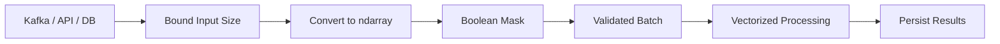

# 03- Indexing and Slicing

## Overview

Indexing and slicing are core `ndarray` operations because they determine how numerical data is selected, transformed, and shared.

For production NumPy code, the syntax is only part of the problem. The important engineering questions are:

- What elements are selected?
- What shape does the result have?
- Is the result a view or a copy?
- Can the selection mutate the source array?
- How much memory does the operation require?
- Is the access pattern efficient?
- Can the operation accidentally create an unexpectedly large array?

A useful mental model is:

```text
array
  ↓
indexing / slicing expression
  ↓
selected data
  ↓
result shape
  ↓
view or copy
  ↓
downstream computation
```

Understanding these stages is essential for backend data processing, batch pipelines, numerical validation, and performance-sensitive workloads.

## Indexing Model

NumPy indexing operates along axes.

Consider:

```python
import numpy as np

values = np.array(
    [
        [10, 20, 30],
        [40, 50, 60],
        [70, 80, 90],
    ],
    dtype=np.int64,
)
```

The array has:

```text
shape = (3, 3)
```

Conceptually:

```text
          axis=1
        0    1    2
     ┌──────────────
axis 0
0    │ 10   20   30
1    │ 40   50   60
2    │ 70   80   90
```

Therefore:

```python
values[1, 2]
```

selects:

```text
row 1, column 2
→ 60
```

Multi-axis indexing is generally preferable to repeatedly indexing intermediate results because it makes the intended dimensional access explicit.

## Scalar Indexing

Single-element access returns a scalar-like value:

```python
value = values[1, 2]
```

Other common forms include:

```python
first = values[0, 0]
last = values[-1, -1]
```

Negative indexing counts from the end:

```python
last_row = values[-1]
```

This is useful when working with variable-sized batches where the final element or row has semantic importance.

## One-Dimensional Indexing

For a one-dimensional array:

```python
values = np.array([10, 20, 30, 40, 50])
```

common operations include:

```python
values[0]
values[-1]
values[1:4]
values[::2]
```

The slice:

```python
values[1:4]
```

selects indices:

```text
1, 2, 3
```

The stop position is exclusive.

## Slice Syntax

NumPy follows the standard Python slice model:

```text
[start:stop:step]
```

Examples:

```python
values[2:8]
values[:5]
values[5:]
values[::2]
values[::-1]
```

| Expression | Meaning |
|---|---|
| `a[:]` | Entire range |
| `a[:5]` | First five elements |
| `a[5:]` | From index five onward |
| `a[2:8]` | Indices 2 through 7 |
| `a[::2]` | Every second element |
| `a[::-1]` | Reverse traversal |

The most important production detail is that basic slicing commonly returns a **view**.

## Multidimensional Slicing

For a two-dimensional array:

```python
matrix = np.arange(20).reshape(4, 5)
```

you can slice both axes:

```python
subset = matrix[1:3, 2:5]
```

This means:

```text
rows 1 through 2
columns 2 through 4
```

The result shape is:

```text
(2, 3)
```

A useful pattern is:

```python
rows = matrix[1:3]
columns = matrix[:, 2]
region = matrix[1:3, 2:5]
```

This is preferable to manually looping through rows and columns for ordinary selection.

## Axis Selection

Slicing can select complete axes:

```python
first_column = matrix[:, 0]
first_row = matrix[0, :]
```

The difference is important:

```text
matrix[:, 0] → all rows, column 0
matrix[0, :] → row 0, all columns
```

The resulting dimensions may also differ from what a user expects.

For example:

```python
column = matrix[:, 0]
```

produces shape:

```text
(n,)
```

not:

```text
(n, 1)
```

If a two-dimensional column shape is required:

```python
column = matrix[:, 0:1]
```

produces:

```text
(n, 1)
```

This distinction becomes important during broadcasting and matrix-shaped data processing.

## Preserving Dimensions

A common source of bugs is accidental dimension reduction.

Compare:

```python
column = matrix[:, 0]
column_2d = matrix[:, 0:1]
```

Shapes:

```text
matrix    → (rows, columns)
column    → (rows,)
column_2d → (rows, 1)
```

Use the second form when subsequent operations depend on retaining an explicit column axis.

Another option is:

```python
column_2d = matrix[:, 0, None]
```

For production code, prefer the representation that makes the downstream shape contract obvious.

## Ellipsis

`...` can represent unspecified axes.

For example:

```python
values[..., 0]
```

selects the final axis's first element regardless of how many preceding axes exist.

This is useful when working with arrays whose leading dimensions can vary.

Example:

```python
batch = np.empty((32, 10, 8))

first_feature = batch[..., 0]
```

Here the final axis is selected while preserving the leading dimensions.

Use ellipsis when it improves generality without making the shape semantics difficult to understand.

## `None` and `np.newaxis`

`None` can add an axis during indexing:

```python
values = np.array([1, 2, 3])

column = values[:, None]
row = values[None, :]
```

Shapes:

```text
values  → (3,)
column  → (3, 1)
row     → (1, 3)
```

This is commonly used to prepare arrays for broadcasting:

```python
column + row
```

produces:

```text
(3, 3)
```

The operation is powerful, but always calculate the output shape before applying it to large arrays.

## Views from Basic Slicing

Basic slicing commonly returns a view.

```python
values = np.arange(10)

window = values[2:6]
window[:] = 0
```

The source array is modified because:

```text
values
  ↓
shared data buffer
  ↓
window
```

This behavior avoids unnecessary copies and is one reason NumPy slicing can be memory-efficient.

It also introduces aliasing.

## Demonstrating Aliasing

```python
values = np.arange(10)

window = values[2:6]

print(np.shares_memory(values, window))
```

The result is expected to indicate shared storage.

For application code, this matters whenever a sliced array is passed to a function:

```python
def normalize(values: np.ndarray) -> None:
    values -= values.mean()
```

Calling:

```python
normalize(batch[100:200])
```

can modify the original `batch`.

That may be intentional, but it should never be accidental.

## Copying a Slice

Use `.copy()` when the selected data should be independent:

```python
values = np.arange(10)

window = values[2:6].copy()

window[:] = 0
```

Now the source array remains unchanged.

A copy is appropriate when:

- mutation must be isolated
- a stable snapshot is required
- a value crosses an ownership boundary
- a small result should not retain a large backing array
- independent memory is required for downstream processing

The trade-off is extra allocation and data movement.

## Boolean Indexing

Boolean indexing selects elements where a boolean condition is `True`.

```python
values = np.array([10, 5, 30, 20, 50])

mask = values >= 20

filtered = values[mask]
```

Result:

```text
[30, 20, 50]
```

The mask must be compatible with the array being indexed.

For numerical validation:

```python
values = np.array(
    [100.0, np.nan, 250.0, -5.0, np.inf]
)

mask = np.isfinite(values) & (values >= 0)

valid_values = values[mask]
```

This is useful for data-quality pipelines because selection logic remains vectorized.

## Boolean Indexing and Memory

Boolean indexing generally creates a new array containing the selected values.

That means:

```python
filtered = values[mask]
```

does not normally behave like a lightweight view over arbitrary matching elements.

For large arrays, consider the amount of data being selected.

If almost every element is valid, creating another large array can increase peak memory.

Sometimes it is preferable to process the mask directly or use an operation that can reuse an existing output buffer.

## Boolean Assignment

Boolean masks can also be used to update data:

```python
values = np.array([10, -5, 20, -1])

values[values < 0] = 0
```

This modifies the existing array.

This can be efficient because it avoids constructing a separate result array when mutation is acceptable.

The trade-off is the same as with other in-place operations: shared owners see the mutation.

## Combining Conditions

NumPy boolean expressions should use element-wise operators:

```python
valid = (values >= 0) & (values <= 100)
```

Use:

```text
&
|
~
```

for element-wise logical operations.

Do not use Python's scalar logical operators for array comparisons:

```python
# Incorrect for array-wise logic
valid = values >= 0 and values <= 100
```

Use:

```python
valid = (values >= 0) & (values <= 100)
```

Parentheses are important because comparison and bitwise operators have different precedence.

## Fancy Indexing

Fancy indexing, also called advanced integer indexing, uses arrays of indices.

```python
values = np.array([10, 20, 30, 40, 50])

selected = values[[0, 2, 4]]
```

Result:

```text
[10, 30, 50]
```

This is useful when the required positions are not a continuous range.

For two-dimensional data:

```python
rows = np.array([0, 2])
columns = np.array([1, 3])

selected = matrix[rows, columns]
```

This selects paired coordinates:

```text
(0, 1)
(2, 3)
```

rather than selecting every combination.

## Fancy Indexing vs Slicing

Use slicing when the selection follows a regular range:

```python
values[10:100]
```

Use fancy indexing when positions are explicitly known:

```python
values[[10, 25, 80]]
```

The difference matters for performance and memory because advanced indexing generally creates a new array.

## Boolean vs Fancy Indexing

| Technique | Use Case | Typical Memory Behavior |
|---|---|---|
| Basic slicing | Continuous range | View |
| Boolean indexing | Condition-based filtering | Copy |
| Fancy indexing | Explicit index selection | Copy |
| Scalar indexing | One element | Scalar |

This is one of the most useful interview comparison tables to remember.

## Indexing and Shape

Indexing can change dimensionality.

```python
matrix = np.arange(12).reshape(3, 4)

row = matrix[0]
row_preserved = matrix[0:1]
```

Shapes:

```text
matrix          → (3, 4)
matrix[0]       → (4,)
matrix[0:1]     → (1, 4)
```

This distinction is important because later operations such as broadcasting depend on exact dimensions.

When shape is part of a function contract, make it explicit and validate it.

```python
def process_rows(values: np.ndarray) -> np.ndarray:
    if values.ndim != 2:
        raise ValueError("Expected a two-dimensional array.")

    return values.sum(axis=1)
```

## Strided Slicing

A slice with a step creates a strided view:

```python
values = np.arange(20)

every_second = values[::2]
```

The resulting array can share the same data buffer while skipping elements.

This is efficient in terms of allocation, but the access pattern may be less cache-friendly than reading contiguous memory.

For a performance-sensitive workload, distinguish:

```text
fewer allocations
```

from:

```text
faster memory access
```

A view can save a copy while still producing slower downstream access.

## Reversed Views

Negative steps create reverse traversal:

```python
values = np.arange(10)

reversed_values = values[::-1]
```

This typically avoids copying the data.

However, the resulting array can have negative strides and may not be contiguous in the same sense as the original array.

Some downstream operations or libraries may prefer a contiguous representation.

If necessary:

```python
contiguous = np.ascontiguousarray(reversed_values)
```

This can create a copy, so the conversion should be justified by the consumer or measured performance benefit.

## Multidimensional Windows

Sliding regions can often be selected through basic slicing:

```python
data = np.arange(100).reshape(10, 10)

window = data[2:7, 3:8]
```

The resulting window is:

```text
5 rows × 5 columns
```

This is useful in batch and numerical processing because a region can often be selected without copying the underlying data.

When many windows must remain alive simultaneously, however, the shared backing storage should be considered in memory planning.

## Indexing Read vs Write Paths

Read and write behavior should be considered separately.

### Read path

```python
subset = values[100:200]
```

May return a view and avoid copying.

### Write path

```python
values[100:200] *= 2
```

Modifies the source array in place.

This is efficient when mutation is intended.

For a copy-on-write style boundary:

```python
subset = values[100:200].copy()
subset *= 2
```

The source remains unchanged.

## Safe Mutation Boundaries

Functions should have an explicit contract about whether they mutate their inputs.

Ambiguous behavior is dangerous:

```python
def adjust(values: np.ndarray) -> np.ndarray:
    values *= 1.18
    return values
```

The function mutates its caller's array.

A non-mutating implementation:

```python
def adjust(values: np.ndarray) -> np.ndarray:
    return values * 1.18
```

creates a new result.

Or explicitly document that the function mutates:

```python
def adjust_in_place(values: np.ndarray) -> None:
    values *= 1.18
```

The important engineering property is not whether mutation is good or bad. It is whether ownership and mutation semantics are explicit.

## Input Validation

Indexing operations can fail because of shape or bounds assumptions.

For service boundaries, validate inputs before indexing:

```python
def first_column(values: np.ndarray) -> np.ndarray:
    values = np.asarray(values)

    if values.ndim != 2:
        raise ValueError("Expected a two-dimensional array.")

    if values.shape[1] == 0:
        raise ValueError("Array must contain at least one column.")

    return values[:, 0]
```

This is preferable to allowing a low-level indexing error to become an unclear application failure.

For external inputs, also validate:

```text
maximum dimensions
+
maximum element count
+
expected dtype
+
acceptable value range
```

This reduces both correctness problems and resource-exhaustion risk.

## Backend Example: Batch Filtering

Consider a Celery task processing transaction amounts:

```python
import numpy as np

def validate_and_filter_amounts(
    raw_amounts: list[float],
) -> np.ndarray:
    amounts = np.asarray(raw_amounts, dtype=np.float64)

    if amounts.ndim != 1:
        raise ValueError("Expected a one-dimensional batch.")

    if amounts.size > 100_000:
        raise ValueError("Batch size exceeds the configured limit.")

    valid = np.isfinite(amounts) & (amounts >= 0)

    return amounts[valid]
```

Pipeline:



The indexing operation is part of a larger resource-management strategy.

The service should not accept an unbounded array simply because the indexing syntax is efficient.

## Backend Example: Selecting Fields from Batches

Suppose a numerical batch stores:

```text
column 0 → quantity
column 1 → unit price
column 2 → discount
```

You can select columns directly:

```python
quantity = batch[:, 0]
unit_price = batch[:, 1]
discount = batch[:, 2]
```

If the columns are used repeatedly and independently, this is convenient.

However, the resulting arrays may share memory with `batch`.

If a consumer modifies one column:

```python
unit_price *= 0.95
```

the corresponding values in `batch` can also change.

When immutable source semantics are required:

```python
unit_price = batch[:, 1].copy()
```

## Database and API Considerations

Indexing should generally happen after unnecessary data has already been reduced at the upstream system.

For example, if PostgreSQL can select only required columns:

```sql
SELECT quantity, unit_price, discount
FROM order_items
WHERE created_at >= %(start_date)s;
```

that is usually better than fetching a wider row and discarding columns inside Python.

Likewise, when receiving API data:

```text
HTTP payload
→ schema validation
→ size validation
→ NumPy conversion
→ indexing / filtering
```

not:

```text
HTTP payload
→ unconstrained NumPy allocation
→ validation
```

Boundary validation should happen before expensive processing whenever practical.

## Performance Considerations

For indexing-heavy workloads, consider:

| Concern | Why It Matters |
|---|---|
| View vs copy | Determines allocation and memory usage |
| Contiguity | Affects memory access efficiency |
| Strides | Determine traversal pattern |
| Boolean selection | Can allocate selected data |
| Fancy indexing | Usually allocates a result |
| Repeated indexing | Can add Python overhead |
| Shape changes | Affect downstream broadcasting |
| Large masks | Add memory overhead |
| Tiny long-lived views | Can retain large backing arrays |

A benchmark should distinguish between:

```text
time to create the selection
```

and:

```text
time to process the selected data
```

A view can be almost free to create while the downstream operation still scans millions of elements.

## Avoid Chained Indexing When Intent Is Unclear

Consider:

```python
matrix[0][1]
```

This first creates an intermediate result and then indexes that result.

Prefer:

```python
matrix[0, 1]
```

The second form expresses the multidimensional access directly and avoids unnecessary intermediate Python-level operations.

For assignment, chained indexing is especially risky because it can interact with copies and views in ways that are harder to reason about.

Use direct indexing whenever possible.

## Common Mistakes

### Assuming Every Slice Is Independent

```python
subset = values[10:20]
subset[:] = 0
```

This can mutate `values`.

Use `.copy()` when independent storage is required.

### Using `and` / `or` for Array Conditions

Incorrect:

```python
mask = (values > 0) and (values < 100)
```

Correct:

```python
mask = (values > 0) & (values < 100)
```

### Forgetting Parentheses

Correct:

```python
mask = (values > 0) & (values < 100)
```

Parentheses make the intended boolean expressions explicit.

### Confusing `(N,)` and `(N, 1)`

These shapes are not interchangeable.

```text
(N,)   → one-dimensional
(N, 1) → two-dimensional column
```

This difference can change broadcasting behavior.

### Creating Huge Broadcasted Results

Adding dimensions with:

```python
values[:, None]
```

can be useful, but may turn a vector operation into a quadratic-size output.

Calculate the expected output shape before applying such expressions to large datasets.

### Assuming Boolean Indexing Is a View

Boolean selection generally constructs a new array.

Large masks and large selected outputs can materially increase memory usage.

### Keeping Small Views Too Long

A small view may keep a large source allocation relevant to memory lifetime.

Copy the selected subset when long-lived ownership of only the small result is required.

### Mutating Arrays Without an Ownership Contract

A function that receives a view can unintentionally mutate the caller's data.

Make mutation behavior explicit in the function design.

## Interview Traps

### Is a slice a view or a copy?

Basic slicing commonly returns a view.

Boolean indexing and fancy indexing generally return copies.

### Why is a slice usually cheap?

Because NumPy can often represent the selected region through metadata such as:

```text
offset
+
shape
+
strides
```

without copying the underlying data.

### Why can a view still hurt performance?

A view may have unfavorable strides or non-contiguous memory access, which can reduce cache locality in downstream operations.

### Why would you copy a slice deliberately?

To:

- isolate ownership
- prevent mutation propagation
- create a stable snapshot
- release a large backing allocation when retaining only a small subset

### What is the difference between `a[:, 0]` and `a[:, 0:1]`?

They return different shapes:

```text
a[:, 0]   → (N,)
a[:, 0:1] → (N, 1)
```

The latter preserves an explicit column dimension.

### Why is `a[0, 1]` preferred over `a[0][1]`?

It directly expresses multidimensional indexing and avoids unnecessary intermediate indexing.

### What happens with `a[mask]`?

NumPy selects the matching elements into a new result array.

### Why can indexing be a memory concern?

Because advanced indexing, boolean filtering, and downstream transformations can allocate substantial new buffers even when the selection logic itself appears simple.

## Scenario-Based Questions

### Scenario: A Function Unexpectedly Changes Its Caller

You inspect:

```python
subset = values[100:200]
transform(subset)
```

and discover that the source array changed.

The likely explanation is:

```text
basic slice
→ shared storage
→ transform mutates subset
→ source changes
```

Fix the ownership boundary:

```python
transform(values[100:200].copy())
```

when isolation is required.

### Scenario: Filtering Uses Too Much Memory

A pipeline executes:

```python
filtered = values[np.isfinite(values)]
```

on a multi-gigabyte array.

Possible memory consumers include:

```text
source array
+
boolean mask
+
filtered array
+
downstream temporaries
```

A better design may involve:

- bounded batches
- buffer reuse
- streaming
- reducing data upstream
- processing the mask without retaining unnecessary full-size outputs

### Scenario: Selection Is Fast but Processing Is Slow

A slice:

```python
subset = values[::2]
```

may be cheap to create because it can be a view.

But subsequent operations over the strided data may be slower due to non-contiguous memory access.

If repeated downstream operations dominate runtime, benchmark:

```text
strided view
vs
contiguous copy + repeated processing
```

The correct choice depends on workload characteristics.

## Practical Debugging Template

When debugging an indexing or slicing problem:

```python
import numpy as np

def inspect_selection(
    source: np.ndarray,
    selected: np.ndarray,
) -> None:
    print("source shape:", source.shape)
    print("selected shape:", selected.shape)
    print("source strides:", source.strides)
    print("selected strides:", selected.strides)
    print("source nbytes:", source.nbytes)
    print("selected nbytes:", selected.nbytes)
    print(
        "shares memory:",
        np.shares_memory(source, selected),
    )
    print(
        "selected C contiguous:",
        selected.flags.c_contiguous,
    )
```

This quickly exposes:

```text
shape mismatch
+
striding
+
memory sharing
+
layout
```

which are the most common causes of surprising behavior.

## Production Guidelines

For production NumPy systems:

- Make indexing contracts explicit.
- Validate dimensions and element counts before expensive operations.
- Use basic slicing when a shared view is appropriate.
- Use `.copy()` when ownership isolation is required.
- Avoid unnecessary chained indexing.
- Use boolean and fancy indexing when their allocation cost is acceptable.
- Inspect output shapes before broadcast-heavy transformations.
- Consider contiguity for repeated downstream numerical operations.
- Bound externally supplied array dimensions to reduce resource-exhaustion risk.
- Prefer upstream filtering in PostgreSQL or storage systems when it significantly reduces transferred data.
- Benchmark representative batch sizes instead of optimizing based on tiny arrays.
- Document whether functions mutate their array arguments.

## Key Takeaways

- Basic slicing commonly returns views, while boolean and fancy indexing generally allocate new arrays; this distinction is central to NumPy memory behavior.
- Always reason about both the result shape and memory ownership of an indexing expression, especially when dimensions or mutation are part of the function contract.
- Boolean masks and advanced indexing are powerful for data processing but can create significant memory overhead on large datasets.
- Strided views can avoid copies while still producing slower downstream access because of non-contiguous memory traversal.
- Production indexing requires explicit ownership semantics, bounded inputs, shape validation, and awareness of how selection interacts with batching, broadcasting, and downstream processing.