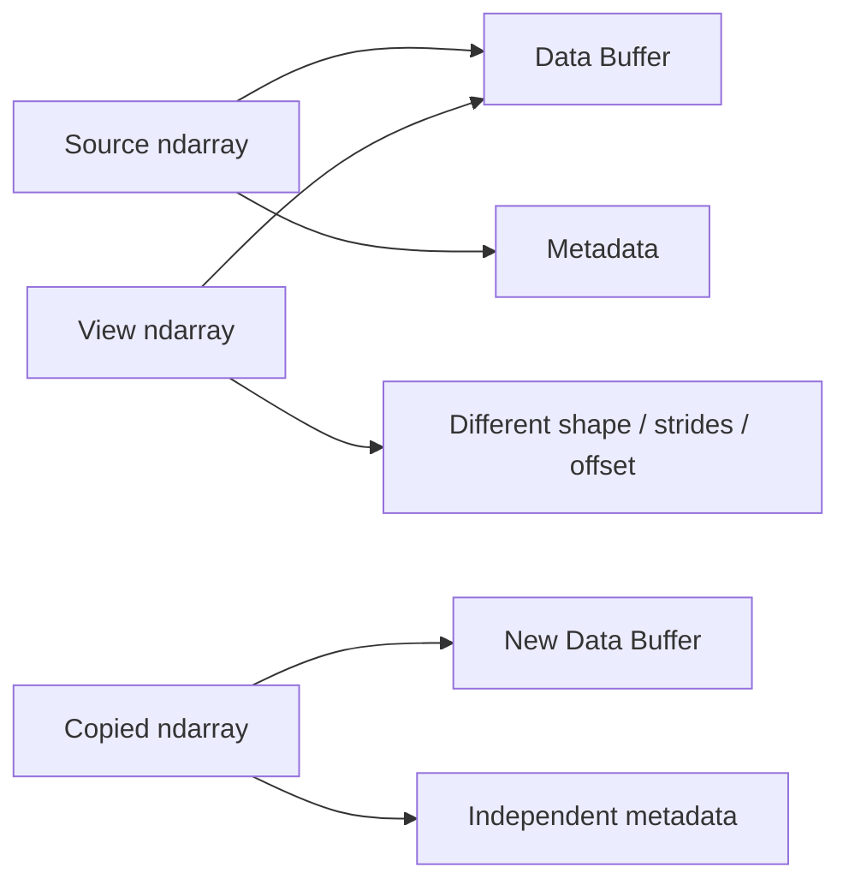
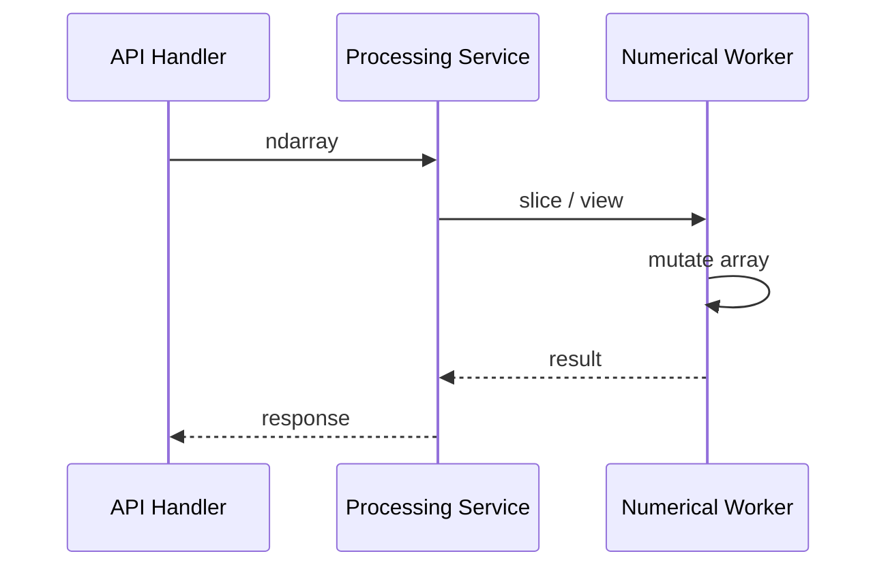
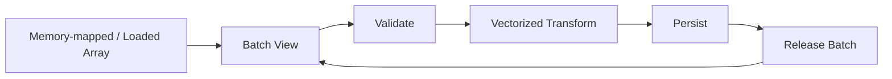

# 04- Views and Copies

## Overview

Views and copies are one of the most important memory-management concepts in NumPy.

An `ndarray` can expose data through different array objects without necessarily allocating new storage. This allows operations such as slicing, transposing, and reshaping to be inexpensive in many cases.

The same behavior also creates subtle risks:

```text
shared storage
+
implicit mutation
+
unexpected memory retention
+
non-contiguous access
```

Production NumPy code should therefore treat ownership and aliasing as explicit design concerns.

The core distinction is:

```text
View
→ different ndarray object
→ shared underlying data

Copy
→ different ndarray object
→ independent underlying data
```

## Why Views and Copies Matter

The difference affects:

- memory consumption
- allocation cost
- mutation behavior
- object lifetime
- cache locality
- downstream library compatibility
- correctness
- performance

Consider:

```python
subset = values[100:200]
```

This can be nearly free because NumPy may only create a new array object describing an existing region.

By comparison:

```python
subset = values[100:200].copy()
```

allocates new storage and copies the selected data.

The copy costs memory and CPU time, but it establishes ownership independence.

## The Ownership Model

A useful simplified model is:



The important distinction is the data buffer.

Two arrays may have:

```text
different Python objects
```

while still referencing:

```text
the same underlying storage
```

That is what makes views efficient.

## What Is a View?

A view is an `ndarray` that exposes existing data through different metadata.

```python
import numpy as np

values = np.arange(10)

window = values[2:6]
```

Here:

```text
values  → original array object
window  → another array object
```

but `window` can share the same data buffer.

Check it explicitly:

```python
np.shares_memory(values, window)
```

This returns `True` when the arrays share memory.

## How Views Work

An `ndarray` contains metadata describing how its data should be interpreted.

A simplified representation is:

```text
data pointer
shape
strides
dtype
```

A view can therefore change:

```text
starting position
shape
strides
axis order
```

without moving the underlying elements.

For example:

```python
values = np.arange(12).reshape(3, 4)

window = values[1:, 1:3]
```

The `window` can reference a subset of `values` using different shape and stride metadata.

This is the fundamental reason basic slicing can be efficient.

## What Is a Copy?

A copy creates independent storage.

```python
values = np.arange(10)

window = values[2:6].copy()
```

Now the selected values are stored in a separate buffer.

Mutating `window` does not mutate `values`:

```python
window[:] = 0
```

The source remains unchanged.

A copy is appropriate when:

- mutation isolation is required
- independent ownership is part of the API contract
- a snapshot must remain stable
- a long-lived small subset should not retain a huge source allocation
- a downstream library requires independent or contiguous storage

## View vs Copy

| Property | View | Copy |
|---|---|---|
| Data buffer | Shared | Independent |
| Allocation | Usually low | Requires new storage |
| Data movement | Usually none initially | Copies selected data |
| Mutation | Can affect source | Isolated |
| Memory usage | Lower initially | Higher |
| Creation cost | Usually lower | Usually higher |
| Ownership | Shared | Independent |
| Lifetime coupling | Possible | Reduced |

The important word is **usually**. Whether an operation returns a view or copy depends on the operation and memory layout.

Do not rely on assumptions when the behavior matters.

## Basic Slicing Usually Produces Views

Basic slicing is one of the most common sources of views:

```python
values = np.arange(10)

subset = values[2:7]
```

Mutating the subset:

```python
subset[:] = 100
```

can modify the source:

```text
values
→ [0, 1, 100, 100, 100, 100, 100, 7, 8, 9]
```

This is efficient because the selected region does not need to be copied.

### Production Implication

If a function accepts a slice:

```python
def normalize(values: np.ndarray) -> None:
    values -= values.mean()
```

and the caller passes:

```python
normalize(batch[1000:2000])
```

the original `batch` may be modified.

The function's mutation contract should therefore be explicit.

## Boolean Indexing Usually Produces a Copy

Consider:

```python
values = np.array([10, 20, 30, 40])

filtered = values[values >= 20]
```

The result is normally a newly allocated array containing:

```text
[20, 30, 40]
```

Because the selected elements may be arbitrary positions, they cannot generally be represented as one simple contiguous slice of the original storage.

This is why boolean indexing is convenient but can be memory-intensive for large datasets.

## Fancy Indexing Usually Produces a Copy

Integer-array indexing is another advanced-indexing operation:

```python
values = np.array([10, 20, 30, 40, 50])

selected = values[[0, 2, 4]]
```

The selected values are generally copied into a new result array.

This is useful when positions are irregular:

```text
0
2
4
```

rather than a simple range.

## View and Copy Behavior by Operation

| Operation | Typical Behavior |
|---|---|
| Basic slicing | View |
| Integer scalar indexing | Scalar |
| Boolean indexing | Copy |
| Fancy integer indexing | Copy |
| Transpose | View when possible |
| `reshape()` | View when possible, otherwise copy |
| `ravel()` | View when possible, otherwise copy |
| `flatten()` | Copy |
| `.copy()` | Copy |
| `np.asarray()` | Reuses compatible ndarray when possible |
| `np.ascontiguousarray()` | Reuses if already contiguous, otherwise copies |

These are useful default rules, but performance-critical code should verify actual memory behavior.

## `np.shares_memory`

Use `np.shares_memory()` when you need to determine whether two arrays share actual storage:

```python
source = np.arange(20)
subset = source[5:10]

if np.shares_memory(source, subset):
    print("Shared storage")
```

This is particularly useful in:

- debugging
- unit tests
- performance investigations
- validating mutation boundaries

`np.shares_memory()` can be computationally expensive for complicated memory relationships.

## `np.may_share_memory`

`np.may_share_memory()` is a conservative check:

```python
np.may_share_memory(source, subset)
```

It may report possible overlap without proving that the arrays actually overlap.

Use it when a conservative answer is acceptable.

The distinction is:

```text
shares_memory
→ determines actual sharing

may_share_memory
→ determines possible sharing conservatively
```

## Why `.base` Is Not Enough

You may see code such as:

```python
subset.base
```

to inspect whether an array originates from another array.

This can be useful diagnostically, but `.base` should not be treated as a complete ownership model.

Memory relationships can be more complex than:

```text
child → direct parent
```

Use explicit memory-sharing checks when correctness depends on aliasing.

## Mutation Through a View

A common pitfall is:

```python
values = np.arange(10)

subset = values[2:5]
subset += 100
```

The mutation is applied to the shared storage.

This can be an intentional optimization:

```python
values[2:5] *= 2
```

when the original array should be modified.

It becomes a bug when the caller expected functional behavior.

### Explicit Mutation Contract

Prefer naming that communicates intent:

```python
def scale_in_place(values: np.ndarray, factor: float) -> None:
    values *= factor
```

versus:

```python
def scaled(values: np.ndarray, factor: float) -> np.ndarray:
    return values * factor
```

The first explicitly mutates.

The second returns a new result.

## Copies and Memory Retention

One of the less obvious problems is retaining a large source array through a small view.

Consider:

```python
large = np.empty(
    100_000_000,
    dtype=np.float64,
)

small = large[:10]
```

The useful result contains only ten elements, but `small` can remain connected to the large backing storage.

If `small` has a long lifetime, memory retention can become a problem.

Creating an independent copy:

```python
small = large[:10].copy()
```

can allow the large source storage to become reclaimable once no other references exist.

This is an important trade-off:

```text
copy now
→ allocation cost now

retain view
→ potentially retain much larger memory later
```

The correct choice depends on object lifetime and workload.

## Views and Function Boundaries

Passing a view through several layers of application code can make ownership difficult to reason about.

For example:



If the worker mutates the view, the original array can be affected.

For shared numerical code, establish a clear policy:

```text
read-only input
or
mutating input
or
independent output
```

Do not let mutation semantics emerge accidentally from slicing behavior.

## Read-Only Arrays

An array can be marked read-only:

```python
values = np.arange(10)
values.flags.writeable = False
```

Later mutation attempts fail.

This can be useful for protecting data crossing a boundary:

```python
def process_read_only(values: np.ndarray) -> np.ndarray:
    values.flags.writeable = False
    return values
```

However, read-only flags should be treated as one layer of protection, not a substitute for good ownership design.

## Copying at Boundaries

A common architecture question is where to create a copy.

Consider a service:

```text
database
→ parsing
→ validation
→ numerical processing
→ persistence
```

Copying after every step is wasteful.

A better approach is:

```text
copy when ownership isolation provides value
```

Examples:

- Copy before handing mutable data to a component that should not modify the source.
- Avoid copying when a read-only view is sufficient.
- Copy a small long-lived result when it would otherwise retain a huge source.
- Normalize to contiguous storage when a repeated downstream operation benefits from it.

The senior-level goal is controlled ownership, not zero copies at any cost.

## Views, Contiguity, and Performance

A view does not guarantee fast execution.

Consider:

```python
values = np.arange(10_000_000)

every_other = values[::2]
```

`every_other` may share memory, but it has a stride that skips values.

A contiguous copy:

```python
contiguous = every_other.copy()
```

requires an allocation and data transfer.

But if `contiguous` is processed many times afterward:

```text
copy once
+
fast repeated access
```

may outperform:

```text
zero-copy view
+
repeated strided access
```

This is a classic performance trade-off.

Measure the workload instead of optimizing based purely on allocation count.

## Transpose and Views

A transpose can often be represented as a view:

```python
values = np.arange(12).reshape(3, 4)

transposed = values.T
```

The data itself does not necessarily move.

Instead, NumPy can expose the same storage with different shape and strides.

Check:

```python
print(np.shares_memory(values, transposed))
```

The result may share memory while being non-contiguous.

If a downstream operation repeatedly expects C-contiguous data:

```python
contiguous = np.ascontiguousarray(transposed)
```

may be useful.

Again, that operation can copy.

## `reshape()` and Memory Sharing

`reshape()` attempts to return a view when possible:

```python
values = np.arange(12)

reshaped = values.reshape(3, 4)
```

This can avoid copying.

However, not every requested shape can be represented through the existing memory layout.

For example, after certain transformations:

```python
transposed = values.reshape(3, 4).T
reshaped = transposed.reshape(12)
```

the result may require copying.

The correct rule is:

```text
reshape can be a view
reshape can require a copy
```

Do not rely on one behavior without checking the actual workload.

## `ravel()` vs `flatten()`

These functions illustrate view-versus-copy design directly.

### `ravel()`

`ravel()` returns a flattened array and attempts to avoid copying where possible.

```python
flat = values.ravel()
```

### `flatten()`

`flatten()` explicitly returns a copy.

```python
flat = values.flatten()
```

Comparison:

| Function | Copy Behavior |
|---|---|
| `ravel()` | View when possible |
| `flatten()` | Always returns a copy |

Use `ravel()` when avoiding unnecessary allocation matters.

Use `flatten()` when independent storage is explicitly required.

## `np.asarray()` vs Copying

`np.asarray()` is useful for normalizing input:

```python
values = np.asarray(raw_values, dtype=np.float64)
```

When `raw_values` is already a compatible NumPy array, NumPy can reuse it.

That makes `asarray()` useful at API boundaries where the requirement is:

```text
"accept array-like input"
```

rather than:

```text
"always own an independent buffer"
```

When independent storage is required:

```python
values = np.array(
    raw_values,
    dtype=np.float64,
    copy=True,
)
```

The exact copy behavior should match the ownership requirement.

## Explicit Copy Methods

Common ways to create independent data include:

```python
copy_a = values.copy()
copy_b = np.array(values, copy=True)
```

`.copy()` is usually the clearest way to communicate intent when you already have an array:

```python
isolated = values.copy()
```

For layout-sensitive workflows, copy order can also matter:

```python
contiguous = values.copy(order="C")
```

or:

```python
fortran = values.copy(order="F")
```

The choice should be driven by the downstream access pattern or interoperability requirement.

## Copying and Dtype Conversion

A copy and a dtype conversion are separate concerns, although they can happen together.

For example:

```python
values = np.asarray(raw_values, dtype=np.float64)
```

may allocate if the source cannot be represented as the requested dtype without conversion.

Similarly:

```python
converted = values.astype(np.float32)
```

generally creates a new array when conversion is required.

Dtype narrowing should be justified by:

```text
range
+
precision
+
downstream compatibility
+
memory budget
```

Do not assume that a smaller dtype is automatically safer or better.

## In-Place Operations and Aliasing

In-place operations reduce allocation:

```python
values *= 1.18
```

But if another array shares memory:

```python
view = values[100:200]
```

then:

```python
values[100:200] *= 1.18
```

also affects `view`.

This is the fundamental trade-off:

```text
less allocation
vs
more shared mutable state
```

For isolated application components, explicit copies may improve maintainability even when they cost more memory.

## Views in Batch Processing

Batch processing often benefits from views:

```python
for start in range(0, values.size, batch_size):
    stop = start + batch_size
    batch = values[start:stop]

    process_batch(batch)
```

If `process_batch()` only reads data, this can be memory-efficient because each batch may be a view.

If `process_batch()` mutates:

```python
batch *= 2
```

the source array can be modified.

If independent processing is required:

```python
batch = values[start:stop].copy()
```

This trades additional memory and allocation for mutation isolation.

## Views in Large-Scale Processing

For large datasets, view-based batching is often useful:

```text
large ndarray
     ↓
small view
     ↓
vectorized computation
     ↓
write result
     ↓
next view
```

But be careful with results that outlive the batch.

A list of views can still keep the entire source array alive:

```python
windows = [
    values[start:start + batch_size]
    for start in range(0, values.size, batch_size)
]
```

If the goal is to release the source memory, retaining the views defeats that goal.

For long-lived output, copying or streaming may be more appropriate.

## Backend Data Pipeline Example

Consider a Celery worker reading a large numerical file:



A view can keep each batch allocation small:

```python
def process_batches(
    values: np.ndarray,
    batch_size: int,
) -> None:
    for start in range(0, values.size, batch_size):
        stop = min(start + batch_size, values.size)
        batch = values[start:stop]

        process_batch(batch)
```

If `process_batch()` is read-only, this is a useful memory-efficient pattern.

If it mutates the batch intentionally, the mutation also affects `values`.

## Common Mistakes

### Assuming a New Variable Means New Data

This is wrong:

```python
subset = values[10:20]
```

The variable name does not imply independent storage.

Use:

```python
subset = values[10:20].copy()
```

when independence is required.

### Copying Everything Defensively

This is also problematic:

```python
def process(values):
    values = values.copy()
    ...
```

at every layer.

Repeated defensive copies can create unnecessary:

```text
CPU work
+
memory usage
+
garbage collection pressure
```

Define ownership contracts instead of copying reflexively.

### Treating `.base` as an Ownership Contract

`.base` is useful for inspection but does not fully describe complex memory sharing.

Use memory-sharing functions when correctness depends on aliasing.

### Assuming Zero-Copy Means Zero Cost

A view may avoid allocation but still:

- perform non-contiguous accesses
- retain a large source allocation
- make mutation harder to reason about
- cause downstream libraries to copy later

Zero-copy is a memory behavior, not a universal performance guarantee.

### Mutating a View Accidentally

A function may receive a view and modify the caller's array.

Make mutation explicit through function design and naming.

### Retaining Tiny Views

A small view can keep a large data buffer alive.

For long-lived results, consider:

```python
small = large[:10].copy()
```

when reducing retained memory matters.

## Interview Traps

### Are NumPy slices views or copies?

Basic slicing commonly returns views.

Boolean indexing and fancy indexing generally create copies.

### Why are views useful?

They reduce unnecessary data copying and can provide efficient access to subsets of large arrays.

### Why are views dangerous?

Because arrays can share mutable storage, so modifying a view can modify the original source.

### When would you intentionally copy?

When independent ownership, mutation isolation, stable snapshots, contiguous storage, or reduced retained memory is required.

### Can a view be slower than a copy?

Yes.

A view can have unfavorable strides or non-contiguous access. A one-time contiguous copy can sometimes improve repeated processing.

### Does `reshape()` always return a view?

No.

It returns a view when the requested shape can be represented using the existing memory layout; otherwise it can require a copy.

### Why is `flatten()` different from `ravel()`?

`flatten()` returns a copy.

`ravel()` tries to return a view when possible.

### Is `np.asarray()` always zero-copy?

No.

It can reuse compatible ndarray input, but incompatible dtype or input representation can require allocation and conversion.

## Scenario-Based Interview Questions

### A Service's Memory Usage Keeps Increasing

A worker stores small arrays returned from slices of a very large source.

Possible explanation:

```text
small result
→ view
→ shared backing storage
→ large source remains retained
```

Potential solution:

```python
small = large_slice.copy()
```

when the small result has a long lifetime.

### A Copy Improved Processing Time

This is possible when:

```text
non-contiguous view
→ poor memory access
```

is replaced with:

```text
one contiguous copy
→ repeated efficient processing
```

The copy cost can be amortized across many downstream operations.

### A Function Should Not Mutate Caller Data

Do not rely on callers to remember that a view can be shared.

Establish the contract explicitly:

```python
def transform(values: np.ndarray) -> np.ndarray:
    return values * 1.18
```

or make a copy at the boundary:

```python
def transform(values: np.ndarray) -> np.ndarray:
    local = values.copy()
    local *= 1.18
    return local
```

Choose based on performance and ownership requirements.

## Practical Debugging Template

When diagnosing view and copy behavior:

```python
import numpy as np

def inspect_relationship(
    source: np.ndarray,
    other: np.ndarray,
) -> None:
    print("source shape:", source.shape)
    print("other shape:", other.shape)
    print("source strides:", source.strides)
    print("other strides:", other.strides)
    print("source bytes:", source.nbytes)
    print("other bytes:", other.nbytes)
    print("shares memory:", np.shares_memory(source, other))
    print("may share memory:", np.may_share_memory(source, other))
    print("source C contiguous:", source.flags.c_contiguous)
    print("other C contiguous:", other.flags.c_contiguous)
```

For production investigations, combine this with:

```text
process RSS
+
allocation profiling
+
CPU profiling
+
request/task metrics
```

Array-level memory alone is not enough to explain application-level memory usage.

## Production Guidelines

For production NumPy systems:

- Treat ownership as part of the API contract.
- Use views when shared storage is intentional and safe.
- Use `.copy()` when independent ownership is required.
- Avoid defensive copies at every abstraction boundary.
- Inspect memory sharing when debugging unexpected mutations.
- Consider object lifetime when retaining views of large arrays.
- Consider contiguity when repeated downstream processing dominates runtime.
- Use batch views for read-only large-array processing when appropriate.
- Do not retain batches indefinitely if they keep a large source alive.
- Benchmark copy-versus-view decisions using realistic data sizes.
- Bound array sizes and batch sizes for externally controlled workloads.
- Document whether a function mutates its input.

## Key Takeaways

- A NumPy view creates another array interface over shared storage, while a copy creates independent storage; this distinction controls both memory behavior and mutation semantics.
- Views are usually cheaper to create, but they can create aliasing bugs, retain large backing allocations, or expose non-contiguous access patterns.
- Copies cost memory and data movement but are appropriate for ownership isolation, stable snapshots, contiguous representations, and reducing retained memory.
- Zero-copy is not automatically faster; a contiguous copy can outperform a strided view when the data is processed repeatedly.
- Production NumPy code should define clear ownership and mutation contracts instead of relying on accidental view or copy behavior.