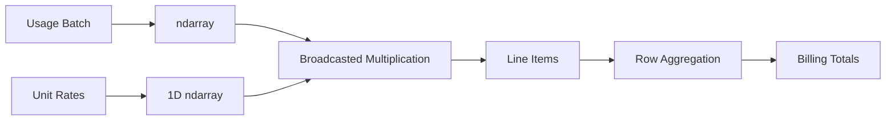

# 05- Broadcasting

## Overview

Broadcasting is NumPy's mechanism for performing element-wise operations on arrays with compatible shapes without explicitly reshaping or replicating data first.

It is one of the most important `ndarray` concepts because it enables concise vectorized code:

```python
prices * tax_rates
```

instead of manually iterating through rows and columns.

For backend and data-engineering workloads, broadcasting should be understood as both:

```text
an execution convenience
```

and:

```text
a memory and scalability concern
```

Broadcasting can eliminate unnecessary input replication, but the resulting operation can still allocate a very large output or temporary array.

A useful mental model is:

```text
input shapes
    ↓
align trailing dimensions
    ↓
apply broadcasting rules
    ↓
determine output shape
    ↓
execute vectorized operation
    ↓
materialize output / temporaries
```

## Why Broadcasting Exists

Without broadcasting, element-wise operations would often require explicit expansion of smaller arrays.

For example:

```python
import numpy as np

prices = np.array(
    [
        [100.0, 200.0, 300.0],
        [120.0, 220.0, 320.0],
    ]
)

tax_rates = np.array([0.18, 0.18, 0.12])
```

The desired calculation is:

```text
each row of prices
×
the corresponding tax rate
```

Broadcasting allows:

```python
final_prices = prices * (1.0 + tax_rates)
```

instead of manually constructing:

```text
[
    [0.18, 0.18, 0.12],
    [0.18, 0.18, 0.12],
]
```

The smaller input does not need to be materialized as a repeated array simply to make the shapes compatible.

## Broadcasting Rules

NumPy compares dimensions from the trailing axis toward the leading axis.

Two dimensions are compatible when:

- they are equal, or
- one of them is `1`, or
- one shape has no corresponding dimension because it is shorter

Consider:

```text
A = (2, 3)
B = (3,)
```

Alignment:

```text
A = (2, 3)
B = (  3)
```

The dimensions are compatible, so the result shape is:

```text
(2, 3)
```

Another example:

```text
A = (4, 1, 8)
B = (   8)
```

Conceptual alignment:

```text
A = (4, 1, 8)
B = (0, 0, 8)
```

The omitted leading dimensions are treated as size `1`, so the result is:

```text
(4, 1, 8)
```

More generally:

| A | B | Result |
|---|---|---|
| `(2, 3)` | `(3,)` | `(2, 3)` |
| `(5, 1)` | `(1, 4)` | `(5, 4)` |
| `(4, 3, 2)` | `(2,)` | `(4, 3, 2)` |
| `(4, 3, 2)` | `(3, 1)` | `(4, 3, 2)` |
| `(2, 3)` | `(4,)` | Incompatible |

The last case fails because:

```text
3 != 4
```

and neither dimension is `1`.

## Scalar Broadcasting

Scalars broadcast to every element:

```python
values = np.array([10.0, 20.0, 30.0])

result = values * 1.18
```

Conceptually:

```text
[10, 20, 30]
×
[1.18, 1.18, 1.18]
```

but NumPy does not need to create that repeated scalar array first.

This is the simplest and most common form of broadcasting.

## One-Dimensional Broadcasting

A one-dimensional array can broadcast across a matching trailing dimension:

```python
prices = np.array(
    [
        [100.0, 200.0, 300.0],
        [150.0, 250.0, 350.0],
    ]
)

fees = np.array([2.0, 3.0, 4.0])

adjusted = prices + fees
```

Shapes:

```text
prices → (2, 3)
fees   → (3,)
```

Result:

```text
(2, 3)
```

Conceptually:

```text
prices
[100 200 300]
[150 250 350]

fees
[  2   3   4]

result
[102 203 304]
[152 253 354]
```

This pattern appears frequently in batch processing where every record has the same set of per-column adjustments.

## Broadcasting with a Column Vector

Consider:

```python
values = np.array(
    [
        [10.0, 20.0, 30.0],
        [40.0, 50.0, 60.0],
    ]
)

offsets = np.array([1.0, 2.0])

result = values + offsets[:, None]
```

Shapes:

```text
values          → (2, 3)
offsets         → (2,)
offsets[:, None] → (2, 1)
```

Broadcasting produces:

```text
(2, 3)
```

Conceptually:

```text
values
[10 20 30]
[40 50 60]

offsets
[1]
[2]

result
[11 21 31]
[42 52 62]
```

Adding the axis explicitly makes the intended row-wise behavior clear.

## `None` and Broadcasting

`None` or `np.newaxis` can insert a dimension:

```python
values = np.array([1, 2, 3])

row = values[None, :]
column = values[:, None]
```

Shapes:

```text
row    → (1, 3)
column → (3, 1)
```

Combining them:

```python
matrix = column + row
```

produces:

```text
(3, 3)
```

This technique is useful for pairwise calculations, but it is also one of the easiest ways to accidentally create very large arrays.

## Output Shape Must Be Calculated First

Before running a large broadcasted operation, calculate the expected shape.

For:

```python
a = np.empty((50_000, 1), dtype=np.float64)
b = np.empty((1, 50_000), dtype=np.float64)

result = a + b
```

the result shape is:

```text
(50_000, 50_000)
```

Total elements:

```text
2,500,000,000
```

At eight bytes per `float64`:

```text
≈ 20 GB
```

The two inputs are small enough individually, but the output is not.

This is one of the most important broadcasting production hazards.

## Broadcasting Does Not Mean Physical Replication

A common misconception is:

> Broadcasting always creates a repeated copy of the smaller input.

That is not the correct mental model.

Broadcasting allows NumPy to interpret dimensions of size `1` as if values were available along the expanded dimension without necessarily allocating a repeated input buffer.

For example:

```python
values = np.empty((1_000_000, 3))
offsets = np.array([1.0, 2.0, 3.0])

result = values + offsets
```

NumPy does not need a second:

```text
1,000,000 × 3
```

array containing repeated offsets just to perform the addition.

However, `result` itself still contains:

```text
1,000,000 × 3
```

elements.

Broadcasting saves input replication; it does not eliminate output memory requirements.

## Broadcasting and Temporary Arrays

Broadcasting can also appear inside larger expressions:

```python
result = (values - means) / scales
```

Suppose:

```text
values → (1_000_000, 8)
means  → (8,)
scales → (8,)
```

The shapes are compatible, but the expression can conceptually involve:

```text
values - means
        ↓
temporary
        ↓
temporary / scales
        ↓
result
```

Depending on the operation and implementation, intermediate arrays may increase peak memory.

For very large arrays, this can matter more than the arithmetic itself.

## Broadcasting vs Explicit Repetition

An inefficient approach:

```python
repeated_fees = np.tile(fees, (100_000, 1))

result = prices + repeated_fees
```

A broadcasted approach:

```python
result = prices + fees
```

The second approach usually avoids materializing `repeated_fees`.

The trade-off is that the final result still needs memory.

The correct optimization is:

```text
avoid unnecessary input replication
```

not:

```text
assume the complete operation is memory-free
```

## `np.broadcast_to`

NumPy can explicitly expose a broadcasted view:

```python
fees = np.array([1.0, 2.0, 3.0])

expanded = np.broadcast_to(
    fees,
    (1_000_000, 3),
)
```

This can provide a broadcasted view without allocating one million copies of the original values.

Inspect:

```python
print(expanded.shape)
print(expanded.strides)
```

A broadcasted dimension can have a zero stride because the same underlying element is reused.

This is an important internal detail:

```text
logical expansion
≠
physical replication
```

The resulting object may also be read-only, so it should not be treated like an ordinary writable dense matrix.

## `np.broadcast_shapes`

When designing shape-sensitive code, explicitly validating compatibility can make errors easier to detect:

```python
shape = np.broadcast_shapes(
    (1000, 8),
    (8,),
)

print(shape)
```

This is useful when shapes originate dynamically from:

- API requests
- configuration
- batch metadata
- database schemas
- file headers

The general practice is:

```text
validate expected shapes
→ calculate output size
→ perform operation
```

## Broadcasting and `where`

Conditional operations often combine broadcasting with masks.

```python
values = np.array(
    [
        [10.0, 20.0, 30.0],
        [40.0, 50.0, 60.0],
    ]
)

limits = np.array([15.0, 25.0, 35.0])

result = np.minimum(values, limits)
```

The `limits` vector broadcasts across rows.

For conditional replacement:

```python
result = np.where(
    values > limits,
    limits,
    values,
)
```

The condition, `limits`, and `values` must all have broadcast-compatible shapes.

For performance-sensitive paths, remember that conditional expressions can still allocate output arrays and may evaluate more work than a simple control-flow branch would.

## Broadcasting with Different Dimensions

Consider:

```python
values = np.empty((8, 32, 64))
scale = np.empty((64,))
```

Shapes align as:

```text
values → (8, 32, 64)
scale  → (   64)
```

Result:

```text
(8, 32, 64)
```

This is useful for applying feature-specific scaling across a batch.

Now consider:

```python
scale = np.empty((32, 1))
```

Alignment:

```text
values → ( 8, 32, 64)
scale  → (   32,  1)
```

Result:

```text
(8, 32, 64)
```

The first scale dimension aligns with axis `1`, while the final dimension `1` expands across axis `2`.

This is why trailing-dimension reasoning is more useful than memorizing simplistic "row" and "column" rules.

## Broadcasting Failure

Consider:

```python
values = np.empty((8, 32))
scale = np.empty((64,))

result = values * scale
```

The shapes are:

```text
(8, 32)
(   64)
```

The trailing dimensions are:

```text
32
64
```

They are incompatible.

NumPy raises a broadcasting error rather than silently producing an incorrect shape.

That behavior is valuable because it exposes many shape bugs early.

## Broadcasting and API Data

Suppose a service receives a batch of prices:

```python
prices = np.asarray(
    payload["prices"],
    dtype=np.float64,
)
```

and configuration contains per-currency adjustments:

```python
rates = np.asarray(
    config["rates"],
    dtype=np.float64,
)
```

Before broadcasting, validate:

```python
if prices.ndim != 2:
    raise ValueError("Expected a two-dimensional price batch.")

if rates.ndim != 1:
    raise ValueError("Expected one rate per price column.")

if prices.shape[1] != rates.shape[0]:
    raise ValueError("Rate count does not match price columns.")
```

Then:

```python
adjusted = prices * rates
```

This is preferable to allowing shape assumptions to remain implicit at a production boundary.

## Resource Exhaustion Risk

Broadcasting can be an application security concern when dimensions are user-controlled.

An attacker or accidental client could supply dimensions that lead to a huge result:

```python
left = np.empty((50_000, 1))
right = np.empty((1, 50_000))
```

The expression:

```python
left + right
```

requires a multi-gigabyte output.

For API and worker systems:

```text
validate dimensions
+
bound element counts
+
bound batch sizes
+
estimate output size
```

before performing large broadcasted operations.

This is particularly relevant in:

- FastAPI and Django endpoints
- Celery workers
- multi-tenant data-processing services
- Kubernetes workloads with strict memory limits

## Broadcasting and Batch Processing

Broadcasting is especially useful inside bounded batches:

```python
def apply_rates(
    prices: np.ndarray,
    rates: np.ndarray,
) -> np.ndarray:
    prices = np.asarray(prices, dtype=np.float64)
    rates = np.asarray(rates, dtype=np.float64)

    if prices.ndim != 2:
        raise ValueError("prices must be two-dimensional.")

    if rates.ndim != 1:
        raise ValueError("rates must be one-dimensional.")

    if prices.shape[1] != rates.shape[0]:
        raise ValueError("rates must match price columns.")

    return prices * rates
```

The Python layer can control batch size:

```text
large dataset
→ bounded batch
→ broadcasted transformation
→ persistence
→ next batch
```

This prevents an otherwise efficient vectorized operation from becoming an unbounded memory problem.

## Broadcasting and Temporary Memory

Suppose:

```python
values = np.empty((5_000_000, 8))
means = np.empty(8)
std = np.empty(8)

standardized = (values - means) / std
```

The output requires substantial memory.

Depending on evaluation and allocation behavior, the subtraction may also require a temporary result before division.

A memory-aware implementation can reuse an output buffer for one stage:

```python
standardized = np.empty_like(values)

np.subtract(
    values,
    means,
    out=standardized,
)

np.divide(
    standardized,
    std,
    out=standardized,
)
```

This can reduce peak temporary memory.

It does, however, introduce mutation and requires that `standardized` have a compatible dtype and shape.

The general principle is:

```text
broadcasting can reduce input duplication
but
large outputs and intermediates still consume memory
```

## Broadcasting with Scalars vs Arrays

A scalar:

```python
values * 1.18
```

is usually the simplest broadcast.

A one-dimensional array:

```python
values * rates
```

introduces shape compatibility requirements.

Higher-dimensional broadcasting:

```python
values * rates[None, :, None]
```

can be powerful but should make the intended axes explicit.

A useful production rule is:

```text
prefer the simplest shape expression that clearly communicates the intended dimensions
```

Avoid clever indexing that makes shape behavior difficult to review.

## Broadcasting and Contiguity

Broadcasting itself does not guarantee contiguous output or input access.

For example:

```python
values = np.empty((1000, 1000)).T
offset = np.array([1.0] * 1000)

result = values + offset
```

The input may be non-contiguous.

Performance depends on:

```text
input layout
+
broadcasted dimensions
+
operation
+
output layout
```

When performance is important, inspect:

```python
print(values.flags.c_contiguous)
print(values.strides)
```

and benchmark realistic workloads.

## Broadcasting and Dtypes

Broadcasting does not eliminate dtype-promotion rules.

For example:

```python
values = np.array(
    [1, 2, 3],
    dtype=np.int32,
)

scale = np.array(
    [0.5, 0.5, 0.5],
    dtype=np.float64,
)

result = values * scale
```

The result may use a floating-point dtype capable of representing the operation.

The resulting dtype affects:

```text
memory
+
precision
+
downstream compatibility
```

Check important pipelines explicitly:

```python
print(result.dtype)
```

Do not evaluate broadcasting separately from dtype behavior.

## Broadcasting vs `repeat` and `tile`

These operations have different purposes.

### Broadcasting

```python
result = values + offsets
```

Usually avoids explicitly materializing repeated inputs.

### `repeat`

```python
expanded = np.repeat(values, repeats=10)
```

Actually repeats elements.

### `tile`

```python
expanded = np.tile(values, (100, 1))
```

Creates a repeated array pattern.

Comparison:

| Technique | Main Purpose | Typical Allocation |
|---|---|---|
| Broadcasting | Shape-compatible computation | Output allocation |
| `repeat` | Repeat individual elements | Allocates repeated result |
| `tile` | Repeat array pattern | Allocates repeated result |
| `broadcast_to` | Explicit broadcasted view | Usually no data replication |

Use broadcasting when the repeated data only exists to support an element-wise computation.

Use `repeat` or `tile` when an actual repeated dataset is required.

## Practical Backend Example

Suppose a billing service receives a batch of usage values:

```python
usage = np.array(
    [
        [10.0, 20.0, 30.0],
        [15.0, 25.0, 35.0],
    ],
    dtype=np.float64,
)

unit_rates = np.array(
    [0.20, 0.35, 0.50],
    dtype=np.float64,
)
```

The billable amount is:

```python
line_items = usage * unit_rates
totals = line_items.sum(axis=1)
```

Data flow:



The design works because:

```text
usage     → (batch_size, 3)
unit_rate → (3,)
line_items → (batch_size, 3)
```

For large batches, keep the batch size bounded to control the memory footprint.

## Practical Database Example

Suppose PostgreSQL provides a batch of measurements and application configuration contains a per-column correction factor:

```python
measurements = np.asarray(
    rows,
    dtype=np.float64,
)

correction = np.asarray(
    correction_config,
    dtype=np.float64,
)

if measurements.ndim != 2:
    raise ValueError("Expected a two-dimensional measurement batch.")

if correction.shape != (measurements.shape[1],):
    raise ValueError("Correction shape does not match measurements.")

corrected = measurements * correction
```

The best optimization may not be NumPy.

If PostgreSQL can reduce rows or columns before transfer, that can save:

```text
database CPU
+
network bandwidth
+
Python memory
+
NumPy processing
```

Broadcasting should be treated as one stage in the pipeline, not the entire optimization strategy.

## Common Mistakes

### Assuming Broadcasting Copies Inputs

Broadcasting does not necessarily materialize repeated copies of the smaller input.

However, the output can still be enormous.

### Ignoring Output Shape

This is the most dangerous mistake.

Always determine:

```text
broadcasted output shape
×
dtype.itemsize
```

before running large operations.

### Using `tile` When Broadcasting Is Sufficient

Incorrect:

```python
expanded_rates = np.tile(rates, (batch_size, 1))
result = values * expanded_rates
```

Prefer:

```python
result = values * rates
```

when the repeated representation is not otherwise required.

### Assuming Broadcasting Is Always Faster

Broadcasting may avoid input copies, but performance can still be dominated by:

- output allocation
- memory bandwidth
- non-contiguous input access
- temporary arrays
- dtype conversion

Benchmark the actual workload.

### Hiding Shape Semantics

This can be difficult to review:

```python
result = values * rates[:, None, :, None]
```

When dimensions matter, assign meaningful variables or validate shapes explicitly.

### Allowing Unbounded API Dimensions

User-controlled dimensions can produce large broadcasted outputs and potentially exhaust worker memory.

Validate before allocation.

### Confusing `(N,)` and `(N, 1)`

These shapes broadcast differently.

Always inspect the exact shape rather than relying on intuition.

## Interview Traps

### What is broadcasting?

Broadcasting is NumPy's mechanism for aligning compatible array shapes so element-wise operations can be performed without explicitly replicating smaller inputs.

### Does broadcasting copy the smaller array?

Not necessarily.

NumPy can conceptually expand dimensions of size `1` without materializing repeated input storage.

### Does broadcasting avoid memory allocation?

Not in general.

The output and intermediate arrays may still require substantial memory.

### Which dimensions are compared first?

Broadcasting compares dimensions from the trailing axis toward the leading axis.

### Why can `(N, 1)` and `(1, M)` produce `(N, M)`?

Because:

```text
N vs 1 → compatible
1 vs M → compatible
```

The output therefore has:

```text
(N, M)
```

### Why can broadcasting cause an out-of-memory failure?

Because a compact pair of inputs can produce a huge output.

For example:

```text
(50,000, 1)
+
(1, 50,000)
→
(50,000, 50,000)
```

### What is the difference between broadcasting and `tile()`?

Broadcasting provides shape compatibility without necessarily allocating repeated input data.

`tile()` explicitly creates repeated data.

### How do you debug a broadcasting error?

Inspect:

```python
print(left.shape)
print(right.shape)
```

Then compare trailing dimensions from right to left.

## Scenario-Based Interview Questions

### Scenario: A Vectorized Operation Suddenly Requires Gigabytes of Memory

You see:

```python
left.shape == (50_000, 1)
right.shape == (1, 50_000)
```

and:

```python
result = left + right
```

The issue is not necessarily the inputs.

The broadcasted result is:

```text
(50_000, 50_000)
```

which contains 2.5 billion elements.

The correct response is to redesign the operation, process in blocks, or use an algorithm that does not require materializing the full pairwise matrix.

### Scenario: Broadcasting Works but Performance Is Poor

Investigate:

```text
result size
+
temporary arrays
+
input contiguity
+
dtype
+
memory bandwidth
+
batch size
```

Do not immediately assume a broadcasting implementation is incorrect.

### Scenario: Shape Comes from an API Request

Suppose an endpoint accepts dimensions:

```json
{
  "rows": 50000,
  "columns": 50000
}
```

Before creating arrays:

```text
validate dimensions
→ calculate element count
→ calculate expected bytes
→ enforce service limits
→ allocate
```

This is both a reliability and security concern.

## Practical Debugging Template

When diagnosing broadcasting behavior:

```python
import numpy as np

def inspect_broadcast(
    left: np.ndarray,
    right: np.ndarray,
) -> None:
    output_shape = np.broadcast_shapes(
        left.shape,
        right.shape,
    )

    element_count = int(np.prod(output_shape))
    itemsize = np.result_type(left, right).itemsize
    estimated_bytes = element_count * itemsize

    print("left shape:", left.shape)
    print("right shape:", right.shape)
    print("output shape:", output_shape)
    print("result dtype:", np.result_type(left, right))
    print("estimated result bytes:", estimated_bytes)
```

This converts an abstract broadcasting question into a concrete resource estimate.

## Production Guidelines

For production broadcasting:

- Validate input dimensions before performing large operations.
- Calculate the expected output shape for dynamic workloads.
- Estimate output memory using element count and result dtype.
- Prefer broadcasting over `repeat` or `tile` when repeated input storage is unnecessary.
- Use bounded batches for large datasets.
- Watch for temporary arrays inside compound expressions.
- Use `out=` and preallocated buffers when allocation pressure is demonstrably significant.
- Consider contiguity and memory access patterns in performance-sensitive paths.
- Validate externally controlled dimensions to prevent resource exhaustion.
- Reduce rows and columns upstream in PostgreSQL, S3, Kafka, or API layers when possible.
- Benchmark complete workloads rather than assuming broadcasting is automatically faster.
- Treat shape semantics as part of the function's contract.

## Key Takeaways

- Broadcasting aligns compatible trailing dimensions so NumPy can perform vectorized operations without explicitly replicating smaller inputs.
- Broadcasting avoids unnecessary input duplication, but it does not make large outputs or temporary arrays free; always calculate the resulting shape and memory requirement.
- `(N, 1)` and `(1, M)` can produce an `(N, M)` result, making careless broadcasting a serious memory and reliability risk.
- Prefer broadcasting over `repeat()` or `tile()` when the repeated representation is not actually required, while still considering dtype, contiguity, temporaries, and output size.
- Production broadcasting requires shape validation, bounded workloads, memory estimation, and benchmarking within the complete backend pipeline.