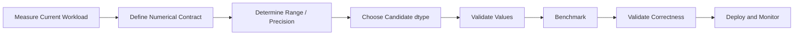

# 07- Dtypes

## Overview

A NumPy dtype defines how each element in an `ndarray` is represented in memory.

For backend and data-engineering workloads, dtype selection is not merely a syntax choice. It affects:

```text
memory footprint
+
numeric range
+
precision
+
conversion cost
+
memory bandwidth
+
interoperability
```

A strong dtype strategy starts with the application's numerical contract:

```text
What values can occur?
What precision is required?
What operations will be performed?
What systems consume the result?
How much memory is available?
```

The objective is not to choose the smallest dtype blindly. It is to choose the smallest representation that remains correct and operationally appropriate.

## What Is a dtype?

Consider:

```python
import numpy as np

values = np.array(
    [10, 20, 30],
    dtype=np.int32,
)
```

The array has:

```python
print(values.dtype)
print(values.itemsize)
```

Conceptually:

```text
dtype    → int32
itemsize → 4 bytes
```

The dtype tells NumPy how to interpret each element in the underlying data buffer.

An `ndarray` normally uses one dtype for all elements:

```text
array
  ↓
same dtype for every element
  ↓
predictable memory representation
```

This homogeneous representation is one of the foundations of NumPy's efficient numerical processing model.

## Why Dtypes Matter

A dtype affects several production-level properties.

| Concern | Dtype Impact |
|---|---|
| Memory | Determines bytes per element |
| Range | Limits representable values |
| Precision | Controls numerical detail |
| Performance | Affects bytes moved and conversion |
| Serialization | Determines wire/file representation |
| Interoperability | Must match downstream expectations |
| Correctness | Poor choice can overflow or lose precision |

For example:

```python
float32_values = np.empty(
    10_000_000,
    dtype=np.float32,
)

float64_values = np.empty(
    10_000_000,
    dtype=np.float64,
)
```

The second array requires approximately twice the data-buffer memory.

At large scale, that can affect:

```text
cache utilization
+
memory bandwidth
+
worker concurrency
+
container limits
```

## Common Numeric Dtypes

Frequently encountered NumPy dtypes include:

| dtype | Typical Size | Typical Use |
|---|---:|---|
| `int8` | 1 byte | Very small bounded integers |
| `int16` | 2 bytes | Small bounded integer ranges |
| `int32` | 4 bytes | Common bounded integer data |
| `int64` | 8 bytes | Large integer ranges |
| `uint8` | 1 byte | Non-negative values up to 255 |
| `uint16` | 2 bytes | Non-negative bounded values |
| `uint32` | 4 bytes | Larger non-negative ranges |
| `uint64` | 8 bytes | Large non-negative ranges |
| `float16` | 2 bytes | Specialized low-precision numerical workloads |
| `float32` | 4 bytes | Memory-sensitive approximate numerical workloads |
| `float64` | 8 bytes | General higher-precision floating-point work |
| `bool` | 1 byte | Logical masks and flags |

The exact suitability depends on the numerical contract rather than the dtype name alone.

## Integer Dtypes

Integer dtypes represent whole numbers.

```python
values = np.array(
    [100, 200, 300],
    dtype=np.int32,
)
```

The key properties are:

```text
fixed width
+
fixed signedness
+
fixed range
```

Signed and unsigned integers differ:

```python
signed = np.array(
    [0, 100],
    dtype=np.int32,
)

unsigned = np.array(
    [0, 100],
    dtype=np.uint32,
)
```

Unsigned types cannot represent negative values.

Choose unsigned integers only when the domain explicitly guarantees non-negative values and downstream systems handle the representation appropriately.

## Integer Range

A fixed-width integer has a finite representable range.

For example:

```python
info = np.iinfo(np.int32)

print(info.min)
print(info.max)
```

This is useful when validating whether a dtype is safe for production data.

Before narrowing an integer dtype:

```python
values = np.asarray(raw_values)

info = np.iinfo(np.int32)

if np.any(values < info.min) or np.any(values > info.max):
    raise ValueError("Values exceed int32 range.")

values = values.astype(np.int32)
```

The important principle is:

```text
validate first
→ narrow second
```

## Integer Overflow

Fixed-width integers can overflow.

For example:

```python
values = np.array(
    [2_147_483_647],
    dtype=np.int32,
)

result = values + 1
```

The result cannot be represented as a signed 32-bit integer.

This differs from Python's built-in `int`, which grows to accommodate larger values subject to available memory.

For backend systems, overflow can silently corrupt calculations if dtype assumptions are not tested.

Be particularly careful with:

- counters
- cumulative sums
- monetary quantities stored as integers
- IDs
- timestamps
- byte offsets
- aggregated metrics

A dtype that safely represents individual rows may still overflow during aggregation.

## Floating-Point Dtypes

Floating-point dtypes represent approximate real numbers.

The most common general-purpose choices are:

```text
float32
float64
```

For example:

```python
values32 = np.array(
    [10.5, 20.5],
    dtype=np.float32,
)

values64 = np.array(
    [10.5, 20.5],
    dtype=np.float64,
)
```

`float64` provides greater precision than `float32`, at the cost of larger storage.

Do not assume that a smaller dtype is preferable just because memory is important.

Precision requirements are part of correctness.

## Floating-Point Precision

Binary floating-point does not exactly represent every decimal fraction.

For example:

```python
values = np.array(
    [0.1, 0.2],
    dtype=np.float64,
)

print(values.sum())
```

The displayed result may not be exactly the decimal value expected from base-10 arithmetic.

This matters for financial and accounting systems.

For exact decimal business calculations, consider representations such as:

```text
decimal.Decimal
+
database NUMERIC / DECIMAL
```

rather than assuming binary floating-point is appropriate.

NumPy `float64` is often suitable for approximate numerical analytics, but it is not an exact decimal arithmetic type.

## `float32` vs `float64`

| Characteristic | `float32` | `float64` |
|---|---|---|
| Size | 4 bytes | 8 bytes |
| Memory | Lower | Higher |
| Precision | Lower | Higher |
| Range | Smaller | Larger |
| Numerical stability | Lower | Higher |
| Common backend use | Memory-sensitive numerical processing | General numerical calculations |

Use `float32` when:

- the numerical contract allows its precision
- memory pressure is significant
- downstream systems support it

Use `float64` when:

- precision requirements justify it
- interoperability expects it
- memory is acceptable
- numerical accumulation would otherwise be problematic

## `bool`

Boolean arrays are useful for:

- masks
- flags
- validation conditions
- filtering

```python
valid = np.isfinite(values)
```

The result uses a Boolean dtype.

Boolean masks are useful because they enable vectorized selection:

```python
filtered = values[valid]
```

The mask itself consumes memory, so a large pipeline can temporarily hold:

```text
source array
+
boolean mask
+
filtered result
```

This matters for multi-gigabyte arrays.

## String and Object Dtypes

NumPy can represent non-numeric data, but the performance model changes.

A regular numerical array is usually much more efficient for dense numeric computation than an object array.

For example:

```python
values = np.array(
    [10, 20, 30],
    dtype=object,
)
```

This is fundamentally different from:

```python
values = np.array(
    [10, 20, 30],
    dtype=np.int64,
)
```

An object array stores Python object references rather than a dense native numerical representation.

Avoid `dtype=object` when the workload is intended to benefit from NumPy's numerical execution model.

For heterogeneous tabular or textual application data, Python structures or Pandas are usually more appropriate abstractions.

## `object` dtype and Performance

Object arrays can introduce:

```text
Python object access
+
reference indirection
+
higher memory overhead
+
less effective native numerical execution
```

This can remove much of the performance advantage expected from NumPy.

If numerical data unexpectedly becomes:

```python
dtype('O')
```

investigate why before benchmarking further.

Common causes include:

- mixed Python types
- incompatible values
- missing objects
- custom Python objects
- heterogeneous input

## Inspecting Dtypes

At runtime:

```python
print(values.dtype)
print(values.itemsize)
```

For memory analysis:

```python
print(values.nbytes)
```

For broader diagnostics:

```python
print(values.shape)
print(values.dtype)
print(values.itemsize)
print(values.nbytes)
print(values.flags)
```

A dtype should be part of the debugging process whenever performance or correctness is surprising.

## Dtype Conversion

`astype()` converts arrays to another dtype.

```python
values = np.array(
    [10, 20, 30],
    dtype=np.int64,
)

converted = values.astype(np.int32)
```

When conversion is required, NumPy normally creates a new array.

That means:

```text
source memory
+
destination memory
```

may coexist temporarily.

For large arrays, this can create significant peak memory.

## `astype(copy=False)`

You can request:

```python
converted = values.astype(
    np.float64,
    copy=False,
)
```

However, `copy=False` is a request, not a guarantee that no copy will ever be required.

If the dtype already matches and other requirements allow reuse, NumPy may avoid allocation.

If conversion is necessary, a new array can still be created.

The engineering rule is:

```text
copy=False
≠
guaranteed zero-copy
```

## `np.asarray()` and Dtype Normalization

At input boundaries, `np.asarray()` is often useful:

```python
values = np.asarray(
    raw_values,
    dtype=np.float64,
)
```

This communicates:

```text
accept array-like input
→ normalize it to a NumPy representation
```

A compatible existing `ndarray` can often be reused.

If dtype conversion is necessary, allocation can occur.

This makes `np.asarray()` a useful choice for service and pipeline boundaries.

## Dtype Promotion

NumPy may promote operands to a common dtype when combining arrays.

Example:

```python
integers = np.array(
    [1, 2, 3],
    dtype=np.int32,
)

floats = np.array(
    [0.5, 0.5, 0.5],
    dtype=np.float64,
)

result = integers + floats
```

The result must use a representation capable of expressing the operation.

Inspect:

```python
print(result.dtype)
```

Promotion can increase:

```text
memory consumption
+
output size
+
conversion work
```

Unexpected promotion is an important performance debugging signal.

## Result Dtype Matters

Suppose:

```python
values = np.empty(
    (10_000_000,),
    dtype=np.float32,
)

scale = np.float64(1.18)

result = values * scale
```

The result dtype may differ from the input dtype based on NumPy's type-promotion rules.

That can unexpectedly double the output's data-buffer size.

For memory-sensitive pipelines, inspect the result:

```python
print(result.dtype)
print(result.nbytes)
```

Do not reason about output memory from the input dtype alone.

## Dtype and Broadcasting

Broadcasting changes shape compatibility, but dtype promotion still applies.

For example:

```python
values = np.empty(
    (1_000_000, 8),
    dtype=np.float32,
)

rates = np.empty(
    (8,),
    dtype=np.float64,
)

result = values * rates
```

The broadcasted shape is:

```text
(1_000_000, 8)
```

but the result dtype may be wider than `float32`.

The full memory calculation is therefore:

```text
output shape
×
result dtype itemsize
```

not simply:

```text
input shape
×
input dtype size
```

## Dtype and Aggregation

Aggregations can have dtype implications.

For example:

```python
values = np.array(
    [1, 2, 3],
    dtype=np.int32,
)

total = values.sum()
```

The accumulator and returned result can depend on the operation and dtype rules.

This is important when processing very large integer arrays because cumulative results can require a wider representation than individual elements.

For numerical pipelines:

```text
element dtype
```

and:

```text
accumulator / output dtype
```

should be considered separately.

When correctness matters, verify the actual dtype and range behavior rather than assuming the input dtype determines the complete calculation.

## Explicit Dtype for Accumulation

When needed, specify an appropriate dtype:

```python
total = values.sum(dtype=np.int64)
```

This can be useful when:

- the input is narrower than the desired accumulator
- cumulative overflow is a concern
- downstream consumers require a specific representation

The trade-off is that a wider accumulator can increase memory usage for some operations.

Choose based on the numerical contract.

## Memory Optimization with Dtypes

A simplified memory relationship is:

```text
memory ≈ number of elements × bytes per element
```

For one billion elements:

```text
float32 → about 4 GB
float64 → about 8 GB
```

This makes dtype selection a major architectural concern for large data processing.

For example, reducing:

```text
8 bytes → 4 bytes
```

can reduce the raw array buffer by approximately 50%.

But the real service-level impact depends on:

```text
number of arrays
+
temporary allocations
+
worker concurrency
+
serialization
+
framework overhead
```

## Dtype Optimization Workflow

A safe dtype optimization process is:



Do not begin with:

```text
"Use the smallest dtype."
```

Begin with:

```text
"What representation is sufficient and safe?"
```

## Choosing Integer Width

Suppose a quantity is guaranteed to be between:

```text
0 and 1,000,000
```

An `int32` can represent the range comfortably.

It may therefore be a candidate:

```python
quantities = np.asarray(
    raw_quantities,
    dtype=np.int32,
)
```

But if the values later participate in:

```text
large multiplication
+
aggregation
+
cumulative totals
```

the intermediate results may require a wider dtype.

This is why the correct question is:

```text
What is the maximum intermediate result?
```

not just:

```text
What is the maximum input value?
```

## Choosing Floating-Point Width

For measurements where precision requirements are modest:

```python
measurements = np.asarray(
    raw_measurements,
    dtype=np.float32,
)
```

may significantly reduce memory.

For calculations where precision is more important:

```python
measurements = np.asarray(
    raw_measurements,
    dtype=np.float64,
)
```

may be more appropriate.

Validate the choice with domain-specific error tolerances rather than generic assumptions.

## Narrowing Dtypes Safely

A production dtype conversion should verify that narrowing does not violate the domain contract.

For integer data:

```python
import numpy as np

def to_int32(values: np.ndarray) -> np.ndarray:
    values = np.asarray(values)

    info = np.iinfo(np.int32)

    if np.any(values < info.min) or np.any(values > info.max):
        raise ValueError("Values cannot safely fit in int32.")

    return values.astype(np.int32)
```

For floating-point workflows, checking range is not sufficient because precision loss can also matter.

Define acceptable numerical error explicitly.

## Dtype and Missing Values

Integer arrays do not naturally represent missing values with `NaN`.

For example:

```python
values = np.array(
    [10, 20, np.nan],
)
```

cannot remain a standard integer dtype.

NumPy will use a floating representation that can represent `NaN` if appropriate.

For integer data with missingness, alternatives include:

```text
separate validity mask
+
sentinel value where domain-safe
+
Pandas nullable integer representation
+
application-level missing-value handling
```

Do not introduce a sentinel blindly.

For example, using `-1` as a missing value is unsafe if `-1` is a valid business value.

## Dtype and Database Boundaries

Database types and NumPy dtypes do not always map one-to-one.

A PostgreSQL schema might use:

```text
INTEGER
BIGINT
NUMERIC
DOUBLE PRECISION
```

while Python processing may use:

```text
int32
int64
float32
float64
Decimal
```

Mapping must account for:

- range
- precision
- nullability
- serialization
- business semantics

For financial data, converting a PostgreSQL `NUMERIC` field into binary floating-point simply because NumPy is available can introduce precision problems.

Choose the representation according to the business requirement.

## Dtype and APIs

An API may receive all JSON numbers as Python numeric objects before conversion.

At the NumPy boundary:

```python
values = np.asarray(
    payload["values"],
    dtype=np.float64,
)
```

This makes the numerical representation explicit.

For untrusted input:

```text
request size
+
element count
+
dtype
+
maximum memory
```

should be bounded.

Dtype conversion can itself allocate a large array, so validation should happen before expensive conversions where possible.

## Dtype and Serialization

The internal dtype does not necessarily need to match the external format.

For example:

```text
internal computation → float32
API output → JSON number
database persistence → NUMERIC
```

may be perfectly valid if the precision and serialization contract are explicit.

Likewise:

```text
binary file → int16
processing → int32
aggregation → int64
```

can be reasonable.

Use different dtypes at different stages when each representation serves a concrete purpose.

## Dtype and Pandas

Pandas provides higher-level dtype abstractions for tabular data.

A DataFrame may contain:

```text
integer columns
floating columns
strings
datetimes
nullable types
extension arrays
```

A NumPy conversion may change the representation or require copies.

For example:

```python
numeric = frame[["quantity", "price"]].to_numpy()
```

When doing so, consider:

```text
result dtype
+
copy behavior
+
memory footprint
+
missing-value semantics
```

Do not assume the DataFrame and resulting NumPy array have identical memory behavior.

## Dtype and Python Lists

Python integers do not have the same fixed-width representation as NumPy integers.

A Python list:

```python
values = [10, 20, 30]
```

contains Python objects and references.

A NumPy array:

```python
values = np.array(
    [10, 20, 30],
    dtype=np.int32,
)
```

stores a typed numerical representation.

This difference explains why NumPy can achieve much denser storage for homogeneous numerical data.

It also explains why choosing `int32` versus `int64` can materially affect large-array memory usage.

## Common Mistakes

### Choosing the Smallest Dtype Blindly

This can cause:

```text
overflow
+
precision loss
+
incorrect results
```

Choose based on the entire numerical contract.

### Assuming Current Samples Define the Range

Today's data may fit in `int16` while tomorrow's data does not.

Validate against documented domain limits.

### Ignoring Intermediate Values

An input may fit comfortably in `int32` while:

```text
input × input
```

or:

```text
sum over millions of rows
```

requires a wider representation.

### Assuming `float32` Is Simply a Smaller `float64`

It has materially different precision and range characteristics.

Test numerical error against the application's tolerance.

### Using Floating-Point for Exact Financial Values

Binary floating-point is not exact decimal arithmetic.

Use appropriate decimal or database representations when exactness is required.

### Ignoring Dtype Promotion

Combining different dtypes can produce a wider result than expected.

Always inspect important results:

```python
print(result.dtype)
```

### Assuming `astype(copy=False)` Guarantees No Copy

It does not.

A required conversion can still allocate.

### Allowing `object` Dtype Accidentally

An object array can dramatically change performance characteristics.

Investigate unexpected `dtype('O')`.

### Forgetting Mask Memory

A Boolean mask can consume substantial memory for very large arrays.

The full working set may include:

```text
source
+
mask
+
filtered result
```

## Performance Considerations

When evaluating dtype choices, benchmark:

```text
execution time
+
peak memory
+
throughput
+
numerical correctness
```

A smaller dtype may:

- reduce memory bandwidth
- improve cache utilization
- reduce storage size
- allow more concurrent work

But it can also:

- increase numerical error
- cause overflow
- require conversions
- reduce downstream compatibility

The best dtype is workload-dependent.

## Backend Example: Memory-Constrained Worker

Suppose a Celery worker processes:

```text
100 million measurements
```

Using `float64`:

```text
100,000,000 × 8 bytes
≈ 800 MB
```

Using `float32`:

```text
100,000,000 × 4 bytes
≈ 400 MB
```

This reduction can be operationally significant.

But the worker may also hold:

```text
input
+
output
+
temporary arrays
+
Python process memory
```

Therefore, reducing the dtype alone does not establish that the task fits within the container memory limit.

A safer architecture is:

```text
bounded batch
+
appropriate dtype
+
vectorized processing
+
controlled concurrency
```

## Backend Example: API Validation

A FastAPI service processing bounded numerical input can make dtype and range explicit:

```python
import numpy as np


def normalize_amounts(raw_values: list[int]) -> np.ndarray:
    values = np.asarray(raw_values)

    if values.ndim != 1:
        raise ValueError("Expected one-dimensional input.")

    if values.size > 100_000:
        raise ValueError("Batch is too large.")

    info = np.iinfo(np.int32)

    if np.any(values < info.min) or np.any(values > info.max):
        raise ValueError("Values exceed supported integer range.")

    return values.astype(np.int32)
```

The sequence is intentional:

```text
normalize input
→ validate shape
→ validate size
→ validate range
→ narrow dtype
```

This prevents a dtype optimization from becoming a correctness or reliability problem.

## Interview Traps

### Why do dtypes matter?

Because they determine element representation, which affects memory, range, precision, and often performance characteristics.

### Why can a smaller dtype improve performance?

It can reduce bytes transferred through memory and improve cache utilization, but the actual performance benefit depends on the workload.

### Why can a smaller dtype be dangerous?

Because the representation may not support the required range or precision.

### Can `int32` safely store any Python integer?

No.

It has a fixed range.

### Why can integer aggregation require a wider dtype?

Because the cumulative result may exceed the range of individual elements.

### What is the difference between `float32` and `float64`?

`float64` generally provides greater precision and range at twice the typical data-buffer size.

### What happens when different dtypes participate in an operation?

NumPy may promote them to a common dtype capable of representing the operation.

### Does `astype(copy=False)` guarantee zero-copy conversion?

No.

A copy is still required when representation conversion cannot be avoided.

### Why is `object` dtype often undesirable for numerical workloads?

Because it stores references to Python objects and can reintroduce Python-level overhead and higher memory usage.

### Should financial calculations use `float64` automatically?

Not necessarily.

Exact decimal business requirements may call for `Decimal` or database `NUMERIC` semantics instead of binary floating-point.

## Scenario-Based Interview Questions

### Scenario: A Service Hits OOM After Dtype Conversion

A team changes:

```python
values = values.astype(np.float64)
```

and memory usage spikes.

Possible explanation:

```text
original array
+
converted array
```

coexist during conversion.

If the source is large, peak memory can temporarily approach the sum of both buffers plus other process allocations.

Use batching or carefully manage buffer lifetimes when necessary.

### Scenario: `float32` Is Faster but Results Differ

The likely issue is reduced numerical precision.

The correct approach is not:

```text
"Use float64 because it is safer."
```

or:

```text
"Use float32 because it is faster."
```

Instead:

```text
define acceptable error
→ benchmark both
→ validate domain results
→ choose the representation that satisfies the contract
```

### Scenario: `int32` Inputs Overflow During Aggregation

Individual values may fit:

```text
int32
```

while cumulative totals do not.

Choose an appropriate accumulator or output dtype:

```python
total = values.sum(dtype=np.int64)
```

and test the maximum expected workload.

### Scenario: NumPy Suddenly Shows `dtype('O')`

Investigate the input path for:

```text
mixed types
+
missing objects
+
custom Python values
+
heterogeneous structures
```

Object dtype can fundamentally change performance characteristics.

## Practical Dtype Inspection

A small diagnostic helper can make dtype decisions explicit:

```python
import numpy as np


def inspect_dtype(values: np.ndarray) -> None:
    print("dtype:", values.dtype)
    print("itemsize:", values.itemsize)
    print("shape:", values.shape)
    print("size:", values.size)
    print("nbytes:", values.nbytes)

    if np.issubdtype(values.dtype, np.integer):
        info = np.iinfo(values.dtype)
        print("minimum:", info.min)
        print("maximum:", info.max)

    elif np.issubdtype(values.dtype, np.floating):
        info = np.finfo(values.dtype)
        print("precision:", info.precision)
        print("minimum:", info.min)
        print("maximum:", info.max)
```

This is useful during performance investigations and schema validation.

## Production Guidelines

For production NumPy systems:

- Define dtype requirements from the numerical contract rather than current samples.
- Validate range before narrowing integer dtypes.
- Validate precision requirements before narrowing floating-point dtypes.
- Consider intermediate and aggregate values, not just raw inputs.
- Inspect result dtypes after operations involving mixed representations.
- Treat `astype()` as a potential allocation.
- Use `np.asarray()` to normalize compatible inputs without requiring unnecessary copies.
- Avoid accidental `object` dtype in numerical pipelines.
- Consider dtype as part of the memory budget for Celery, Docker, and Kubernetes workloads.
- Account for source, destination, and temporary buffers during conversions.
- Use appropriate exact-decimal representations for financial correctness.
- Benchmark both performance and peak memory after dtype changes.
- Test optimized dtypes against representative production ranges and edge cases.

## Key Takeaways

- A NumPy dtype defines element representation and directly affects memory footprint, numerical range, precision, and interoperability.
- Smaller dtypes can improve memory efficiency and sometimes throughput, but narrowing without validating range and precision can introduce silent correctness failures.
- Dtype promotion and conversions can widen results or allocate additional buffers, so inspect the dtype and memory cost of important outputs.
- Integer overflow and floating-point precision must be considered at the level of intermediate and aggregate calculations, not only individual input values.
- Production dtype optimization should be driven by a documented numerical contract, representative benchmarks, and correctness tests rather than by choosing the smallest available dtype.