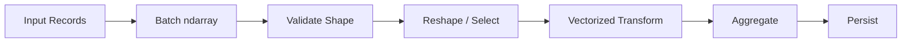

# 08- Array Manipulation

## Overview

Array manipulation is the set of operations used to change the structure, layout, or organization of a NumPy `ndarray` without necessarily changing the underlying values.

In backend and data-processing workloads, these operations commonly appear when:

- normalizing data shapes
- preparing batches
- combining datasets
- separating processing stages
- adapting data for APIs or storage
- changing memory layout for downstream consumers
- preparing inputs for vectorized operations

The key engineering distinction is whether an operation:

```text
changes metadata only
→ may produce a view

moves or reorganizes data
→ may require allocation and copying
```

A useful mental model is:

```text
array
  ↓
shape / axis manipulation
  ↓
view or copy?
  ↓
memory layout
  ↓
downstream numerical processing
```

## Core Manipulation Categories

| Category | Common Operations | Main Purpose |
|---|---|---|
| Reshaping | `reshape()` | Change dimensions |
| Resizing | `resize()` | Change total element count |
| Flattening | `ravel()`, `flatten()` | Reduce dimensions |
| Axis changes | `transpose()`, `.T` | Reorder dimensions |
| Joining | `concatenate()` | Join along an existing axis |
| Stacking | `stack()`, `vstack()`, `hstack()` | Combine arrays with new or explicit axis semantics |
| Splitting | `split()`, `array_split()` | Divide arrays into pieces |
| Repetition | `repeat()`, `tile()` | Materialize repeated data |
| Insertion / deletion | `insert()`, `delete()` | Create modified arrays with elements removed or inserted |
| Appending | `append()` | Add values while allocating a new result |

The most important production concern is not memorizing these APIs. It is understanding:

```text
shape
+
axis
+
allocation
+
view/copy behavior
+
memory layout
```

## Reshaping

`reshape()` changes the logical dimensions of an array while preserving the number of elements.

```python
import numpy as np

values = np.arange(12)

matrix = values.reshape(3, 4)

print(matrix.shape)
```

Output:

```text
(3, 4)
```

The element count must remain unchanged:

```text
12 = 3 × 4
```

A useful invariant is:

```python
assert values.size == matrix.size
```

## Reshape Semantics

`reshape()` may return a view when the existing memory layout permits it, or may require a copy.

```python
values = np.arange(12)

matrix = values.reshape(3, 4)

print(np.shares_memory(values, matrix))
```

Do not assume:

```text
reshape = always view
```

or:

```text
reshape = always copy
```

The result depends on the source layout and requested shape.

## Reshaping with `-1`

NumPy can infer one dimension:

```python
values = np.arange(24)

matrix = values.reshape(4, -1)

print(matrix.shape)
```

Result:

```text
(4, 6)
```

Only one dimension can be inferred because NumPy must be able to determine a unique compatible shape.

This is useful for batch transformations:

```python
batch = values.reshape(batch_size, -1)
```

but the resulting inferred dimension must still match the intended data contract.

## Reshaping and Backend Data

Suppose a file contains one-dimensional records where every record has eight numerical fields:

```python
raw = np.asarray(raw_values, dtype=np.float32)

if raw.size % 8 != 0:
    raise ValueError("Incomplete record batch.")

records = raw.reshape(-1, 8)
```

This pattern is useful when the storage representation is flat but the application logic operates on records.

The validation before reshaping prevents malformed input from silently violating the expected record structure.

## Resizing

NumPy has two different concepts that can be confused:

```text
np.resize()
```

and:

```text
ndarray.resize()
```

They do not have the same behavior.

### `np.resize()`

The function returns a new array of the requested size.

If the new size is larger, NumPy repeats the input data.

```python
values = np.array([1, 2, 3])

expanded = np.resize(values, 8)

print(expanded)
```

Conceptually:

```text
[1, 2, 3, 1, 2, 3, 1, 2]
```

This is very different from extending an array with zero-initialized space.

### `ndarray.resize()`

The method changes the existing array object when the operation is permitted.

```python
values = np.array([1, 2, 3])

values.resize(5)

print(values)
```

Under normal semantics, newly added elements are zero-filled.

Because this changes the existing array and its storage, it has stronger ownership and reference requirements than `reshape()`.

For production data processing, repeated resizing is generally not the preferred way to grow output.

## `resize()` vs `reshape()`

| Operation | Changes Element Count | Typical Goal |
|---|---:|---|
| `reshape()` | No | Change dimensions |
| `np.resize()` | Yes | Create a new requested-size array, repeating values if expanded |
| `ndarray.resize()` | Yes | Resize an existing array object |

A common interview trap is assuming all three operations simply "change shape."

They have materially different semantics.

## Flattening

Flattening converts a multidimensional array into one dimension.

Two commonly used APIs are:

```python
values.ravel()
```

and:

```python
values.flatten()
```

### `ravel()`

`ravel()` attempts to return a view when possible.

```python
values = np.arange(12).reshape(3, 4)

flat = values.ravel()

print(np.shares_memory(values, flat))
```

This can reduce allocation.

### `flatten()`

`flatten()` returns a copy.

```python
flat = values.flatten()
```

This provides independent storage.

## `ravel()` vs `flatten()`

| Function | View Possible | Always Copies |
|---|---:|---:|
| `ravel()` | Yes | No |
| `flatten()` | No | Yes |

Use `ravel()` when avoiding unnecessary allocation matters.

Use `flatten()` when an independent one-dimensional array is explicitly required.

## Transpose

Transpose changes axis order.

For a two-dimensional array:

```python
values = np.arange(12).reshape(3, 4)

transposed = values.T

print(values.shape)
print(transposed.shape)
```

Output:

```text
(3, 4)
(4, 3)
```

The values are exposed according to a different axis order.

A transpose can often be represented as a view by changing strides rather than moving the data.

```python
print(np.shares_memory(values, transposed))
```

This can make transpose cheap to create.

## Transpose and Performance

A transpose may produce a non-contiguous array.

Inspect:

```python
print(transposed.flags.c_contiguous)
print(transposed.flags.f_contiguous)
print(transposed.strides)
```

The view avoids a copy, but later computations may access memory in a less cache-friendly order.

If repeated downstream processing benefits from a contiguous representation:

```python
contiguous = np.ascontiguousarray(transposed)
```

This can allocate and copy the data.

The correct choice depends on whether the copy cost is amortized by subsequent repeated access.

## General Axis Transposition

For arrays with more than two dimensions:

```python
values = np.empty((2, 3, 4))

reordered = np.transpose(
    values,
    axes=(2, 0, 1),
)
```

The new shape is:

```text
(4, 2, 3)
```

The `axes` argument explicitly controls the new axis order.

When array dimensions represent business concepts such as:

```text
batch
+
record
+
feature
```

documenting the axis meaning is important.

Shape alone is not enough to communicate semantics.

## `moveaxis()`

`moveaxis()` moves one or more axes while preserving the relative order of other axes.

```python
values = np.empty((2, 3, 4))

reordered = np.moveaxis(
    values,
    0,
    -1,
)

print(reordered.shape)
```

This can be easier to reason about than constructing a complete permutation when the intent is specifically to move one axis.

Use it when expressing semantic transformations such as:

```text
move batch axis
→ move channel axis
→ move feature axis
```

## Concatenation

`np.concatenate()` joins arrays along an existing axis.

```python
first = np.array(
    [
        [1, 2],
        [3, 4],
    ]
)

second = np.array(
    [
        [5, 6],
    ]
)

result = np.concatenate(
    [first, second],
    axis=0,
)
```

Result:

```text
[[1, 2],
 [3, 4],
 [5, 6]]
```

The arrays must be compatible along all non-concatenated dimensions.

For:

```text
first  → (2, 2)
second → (1, 2)
```

concatenating along `axis=0` is valid.

## Concatenation and Allocation

Concatenation creates a new result buffer.

That makes this pattern inefficient:

```python
result = np.empty((0, 8))

for batch in batches:
    result = np.concatenate(
        [result, batch],
        axis=0,
    )
```

Each concatenation can require allocation and copying of the accumulated result.

Prefer collecting moderate numbers of batches and concatenating once:

```python
chunks = []

for batch in batches:
    chunks.append(batch)

result = np.concatenate(chunks, axis=0)
```

For very large datasets, do not blindly accumulate all chunks. Stream or persist incrementally when memory limits matter.

## Stacking

Stacking creates a new axis.

```python
first = np.array([1, 2, 3])
second = np.array([4, 5, 6])

result = np.stack(
    [first, second],
    axis=0,
)
```

Result:

```text
[[1, 2, 3],
 [4, 5, 6]]
```

Input shapes:

```text
(3)
(3)
```

output shape:

```text
(2, 3)
```

The important distinction is:

```text
concatenate
→ existing axis

stack
→ new axis
```

## `vstack()` and `hstack()`

Convenience functions include:

```python
np.vstack([first, second])
np.hstack([first, second])
```

These can be useful when the intended orientation is obvious.

However, for code where dimensional semantics matter, explicit `axis=` operations such as `concatenate()` and `stack()` are often clearer.

## Splitting Arrays

`split()` divides an array into multiple arrays.

```python
values = np.arange(12)

parts = np.split(
    values,
    3,
)
```

This produces three equal sections.

For an uneven division:

```python
parts = np.array_split(
    values,
    5,
)
```

`array_split()` permits unequal output lengths when an even split is impossible.

## Split and Batch Processing

Splitting can be useful for bounded processing:

```python
batches = np.array_split(
    values,
    10,
)

for batch in batches:
    process_batch(batch)
```

However, `array_split()` is not a general replacement for a streaming data reader.

The original dataset is already in memory.

For datasets larger than available RAM:

```text
file / database / object storage
→ bounded read
→ process batch
→ persist
→ next batch
```

is preferable to loading the complete dataset and splitting afterward.

## Repeat

`np.repeat()` repeats individual elements.

```python
values = np.array([1, 2, 3])

result = np.repeat(
    values,
    repeats=2,
)
```

Result:

```text
[1, 1, 2, 2, 3, 3]
```

This creates repeated data and therefore allocates memory.

Use it when actual repeated elements are required.

Do not use it merely to prepare arrays for element-wise operations when broadcasting is sufficient.

## Tile

`np.tile()` repeats an array pattern.

```python
values = np.array([1, 2, 3])

result = np.tile(
    values,
    3,
)
```

Result:

```text
[1, 2, 3, 1, 2, 3, 1, 2, 3]
```

Like `repeat()`, `tile()` materializes repeated data.

For arithmetic such as:

```python
matrix + values
```

broadcasting is usually preferable to manually tiling `values`.

## Repeat vs Tile vs Broadcasting

| Technique | Behavior | Typical Use |
|---|---|---|
| Broadcasting | Logical shape expansion | Element-wise computation |
| `repeat()` | Repeat elements | Explicit element duplication |
| `tile()` | Repeat array pattern | Explicit pattern duplication |
| `broadcast_to()` | Broadcasted view | Explicit non-materialized expansion |

The important design principle is:

```text
materialize repetition only when the repeated data is actually required
```

## Insert

`np.insert()` creates a new array with values inserted at a specified position or axis.

```python
values = np.array([10, 20, 40, 50])

result = np.insert(
    values,
    2,
    30,
)
```

Result:

```text
[10, 20, 30, 40, 50]
```

Insertion requires reorganizing the result, so a new array is created.

Repeated insertion into a large array is therefore inefficient.

If repeated structural growth is required, accumulate data in a suitable Python collection or preallocate when the final shape is known.

## Delete

`np.delete()` returns a new array without selected elements:

```python
values = np.array([10, 20, 30, 40])

result = np.delete(
    values,
    1,
)
```

Result:

```text
[10, 30, 40]
```

Like insertion, deletion reallocates the result.

For large data pipelines, repeated insertion and deletion should usually be avoided.

Prefer:

```text
filter once
+
construct final result
```

or:

```text
batch processing
+
streaming
```

depending on the workload.

## Append

`np.append()` is convenient:

```python
values = np.array([10, 20, 30])

result = np.append(
    values,
    [40, 50],
)
```

But it does not behave like amortized list growth.

It creates a new array.

Therefore this is inefficient:

```python
values = np.array([], dtype=np.float64)

for number in incoming_values:
    values = np.append(values, number)
```

Repeated growth can result in repeated allocation and copying.

A Python list is usually a better accumulator:

```python
values = []

for number in incoming_values:
    values.append(number)

result = np.asarray(
    values,
    dtype=np.float64,
)
```

If the final size is known, preallocation can be even better:

```python
result = np.empty(
    expected_size,
    dtype=np.float64,
)
```

## Preallocation

Preallocation avoids repeated resizing when output size is known.

```python
result = np.empty(
    values.size,
    dtype=np.float64,
)

result[:] = values * 1.18
```

For more complex batch processing:

```python
result = np.empty_like(values)

np.multiply(
    values,
    1.18,
    out=result,
)
```

Preallocation is particularly useful when:

- output size is known
- the same buffer can be reused
- memory allocation is measurable in profiling

Do not use `np.empty()` and then assume it is initialized. Every element must be written before reading.

## Reshape vs Resize vs Flatten

These operations are commonly confused.

| Operation | Changes Element Count | Copies? | Main Purpose |
|---|---:|---|---|
| `reshape()` | No | View when possible | Change dimensions |
| `np.resize()` | Yes | Returns new array | Create requested size, repeating data when expanded |
| `ndarray.resize()` | Yes | Modifies array object | Resize existing storage |
| `ravel()` | No | View when possible | Flatten |
| `flatten()` | No | Always copy | Independent flattened result |

These differences frequently appear in interviews because they expose whether someone understands array semantics or only remembers function names.

## Manipulation and Memory Layout

A structural operation may change shape without moving bytes.

For example:

```python
values = np.arange(12).reshape(3, 4)
transposed = values.T
```

The transpose can remain a view.

But subsequent reshaping may not preserve that zero-copy relationship.

Inspect:

```python
print(values.strides)
print(transposed.strides)
```

and:

```python
print(np.shares_memory(values, transposed))
```

When manipulation is part of a performance-critical path, think in terms of:

```text
shape
+
strides
+
contiguity
+
copy cost
```

## Manipulation and Broadcasting

Array manipulation often exists to prepare shapes for broadcasting.

For example:

```python
values = np.array([10, 20, 30])

column = values[:, None]

result = column + values
```

The added axis changes:

```text
(3,)
```

into:

```text
(3, 1)
```

which allows the pairwise operation to produce:

```text
(3, 3)
```

This is useful, but the output size must be considered before applying the pattern to large arrays.

## Manipulation in ETL Pipelines

A common numerical ETL flow can be:



For example:

```python
raw = np.asarray(
    raw_values,
    dtype=np.float32,
)

if raw.size % 8 != 0:
    raise ValueError("Input does not contain complete records.")

records = raw.reshape(-1, 8)

amounts = records[:, 2]
quantities = records[:, 3]

totals = amounts * quantities
```

Here:

```text
reshape
+
slicing
+
vectorization
```

form one coherent processing stage.

## Manipulation and Backend APIs

An API may receive a flat list when the business model expects records:

```json
{
  "values": [1, 10.0, 2, 20.0, 3, 15.0]
}
```

The service can normalize the representation:

```python
values = np.asarray(
    payload["values"],
    dtype=np.float64,
)

if values.size % 2 != 0:
    raise ValueError("Expected complete value pairs.")

records = values.reshape(-1, 2)
```

However, do not use a numerical reshape to compensate for an unclear API contract.

If the data is inherently structured, a structured request model can be more explicit and safer.

NumPy should solve numerical representation problems, not hide malformed API schemas.

## Manipulation and Pandas

For tabular workloads, Pandas often provides a more expressive representation.

NumPy manipulation is most appropriate when:

```text
data is numerical
+
array semantics dominate
+
labels are unnecessary
```

A common pipeline is:

```text
Pandas DataFrame
    ↓
select numeric columns
    ↓
NumPy ndarray
    ↓
reshape / vectorize / aggregate
    ↓
Pandas / database / file
```

Avoid unnecessary conversions between representations because each conversion can affect:

```text
memory
+
dtype
+
copy behavior
+
performance
```

## Common Mistakes

### Using `append()` in a Loop

Repeated `np.append()` causes repeated allocation and copying.

Use:

```text
Python list
or
preallocated ndarray
```

instead.

### Repeated Concatenation

This has similar behavior:

```python
result = np.concatenate(
    [result, batch],
)
```

inside a large loop.

Accumulate strategically or stream output.

### Assuming `reshape()` Always Copies or Never Copies

It may do either depending on layout.

### Using `flatten()` When a View Is Sufficient

`flatten()` explicitly creates a copy.

Use `ravel()` when zero-copy behavior is desirable and acceptable.

### Using `tile()` Instead of Broadcasting

If the repeated array only exists to enable arithmetic, broadcasting usually avoids unnecessary input materialization.

### Reshaping Without Validating Record Boundaries

A reshape can be syntactically valid while representing malformed application data.

Validate element counts and shape contracts first.

### Misunderstanding `np.resize()`

`np.resize()` repeats existing values when enlarging the output.

It is not equivalent to allocating additional zero-filled capacity.

### Repeated Insert/Delete Operations

These operations allocate new arrays and should not be used as a general-purpose mutable data structure.

### Ignoring Contiguity

Transpose and strided views can produce non-contiguous data.

A later numerical operation may become slower or require an implicit copy.

## Performance Considerations

Array manipulation performance depends heavily on whether bytes move.

A useful classification is:

| Pattern | Data Movement | Typical Concern |
|---|---:|---|
| Basic reshape | Often none | Shape semantics |
| Transpose | Often none | Strides / contiguity |
| Basic slice | Often none | Aliasing |
| `ravel()` | Often none | Layout-dependent |
| `flatten()` | Yes | Allocation |
| `concatenate()` | Yes | Copying all inputs |
| `stack()` | Yes | New output allocation |
| `repeat()` | Yes | Output size |
| `tile()` | Yes | Output size |
| `insert()` | Yes | Reorganization |
| `delete()` | Yes | Reorganization |
| `append()` | Yes | Repeated allocation risk |

The distinction between:

```text
metadata operation
```

and:

```text
data movement operation
```

is more useful than memorizing isolated API names.

## Large Dataset Strategy

For large numerical datasets:

```text
avoid unbounded concatenation
+
avoid repeated resizing
+
prefer bounded batches
+
reuse buffers where useful
+
stream output
+
preserve sensible memory layout
```

A scalable architecture is:

```text
Storage
   ↓
bounded read
   ↓
ndarray
   ↓
reshape / select
   ↓
vectorized processing
   ↓
persist
   ↓
next batch
```

The goal is predictable peak memory rather than merely fast local execution.

## Security and Resource Exhaustion

Array manipulation can become a resource-exhaustion issue when dimensions or batch sizes come from external input.

For example:

```python
rows = request.rows
columns = request.columns

element_count = rows * columns

if element_count > 10_000_000:
    raise ValueError("Requested dataset is too large.")
```

Before operations such as:

```text
reshape
+
broadcasting
+
repeat
+
tile
+
stack
+
concatenate
```

consider:

```text
result shape
+
dtype size
+
temporary buffers
+
concurrent worker count
```

This is especially important in API services and Celery workers running under Docker or Kubernetes memory limits.

## Interview Traps

### What is the difference between reshape and resize?

`reshape()` changes dimensions without changing element count.

`np.resize()` creates a new requested-size array and repeats data when necessary, while `ndarray.resize()` changes the existing array when permitted.

### What is the difference between concatenate and stack?

`concatenate()` joins arrays along an existing axis.

`stack()` creates a new axis.

### Why is repeated `np.append()` inefficient?

Each append creates a new array and copies data, so repeated growth can become expensive.

### Why can transpose be cheap?

Because NumPy can often represent the new axis order by changing strides without copying the underlying buffer.

### Why can a transpose still hurt performance?

The resulting view can be non-contiguous and less cache-friendly for downstream operations.

### What is the difference between `ravel()` and `flatten()`?

`ravel()` tries to avoid copying; `flatten()` always copies.

### When should you use broadcasting instead of `tile()`?

When the repeated data exists only to support an element-wise computation.

### Why is `np.resize()` often surprising?

Because enlarging the requested result repeats the original data instead of simply appending uninitialized or zero-filled capacity.

## Scenario-Based Interview Questions

### Scenario: A Pipeline Gets Slower After Adding Concatenation

You see:

```python
for batch in batches:
    result = np.concatenate(
        [result, batch],
        axis=0,
    )
```

The likely issue is repeated copying.

A better approach for moderate output sizes is:

```python
chunks = list(batches)
result = np.concatenate(chunks, axis=0)
```

For very large output, stream or persist each batch instead of building one massive result.

### Scenario: A Transpose Is Cheap but the Next Stage Is Slow

Possible sequence:

```text
transpose
→ view
→ non-contiguous layout
→ repeated downstream access
```

Benchmark:

```text
transposed view
vs
contiguous copy
```

If many operations reuse the result, a one-time copy may be faster overall.

### Scenario: A Record Batch Fails Validation

Suppose each record requires ten values:

```python
if values.size % 10 != 0:
    raise ValueError("Incomplete records.")
```

Do not blindly call:

```python
values.reshape(-1, 10)
```

before verifying the record boundary.

### Scenario: A Worker Consumes Increasing Memory

Investigate whether:

```text
views of a large source
+
retained chunks
+
concatenated outputs
+
temporary arrays
```

are keeping more data alive than intended.

Memory behavior should be analyzed across object lifetime, not just individual operations.

## Practical Debugging Template

When debugging array manipulation:

```python
import numpy as np

def inspect_array(values: np.ndarray) -> None:
    print("shape:", values.shape)
    print("size:", values.size)
    print("dtype:", values.dtype)
    print("nbytes:", values.nbytes)
    print("strides:", values.strides)
    print("C contiguous:", values.flags.c_contiguous)
    print("F contiguous:", values.flags.f_contiguous)
```

For a transformed array:

```python
def inspect_relationship(
    source: np.ndarray,
    result: np.ndarray,
) -> None:
    print("shares memory:", np.shares_memory(source, result))
```

These checks quickly identify:

```text
shape changes
+
memory sharing
+
layout changes
+
allocation clues
```

## Production Guidelines

For production NumPy pipelines:

- Use `reshape()` for logical dimension changes when element count is unchanged.
- Validate record sizes before reshaping externally supplied data.
- Understand whether the operation returns a view or allocates.
- Prefer `ravel()` when a flattened view is acceptable.
- Use `flatten()` only when an independent copy is required.
- Use `concatenate()` or `stack()` deliberately because both allocate result buffers.
- Avoid repeated `append()`, `insert()`, `delete()`, or concatenation inside large loops.
- Prefer preallocation when the final output size is known.
- Prefer batching and streaming for outputs that cannot safely fit in memory.
- Use broadcasting instead of materialized repetition where appropriate.
- Inspect strides and contiguity when reshaping or transposing affects performance.
- Bound externally controlled dimensions and output sizes.
- Benchmark data movement and downstream access, not just the manipulation operation itself.

## Key Takeaways

- Array manipulation is fundamentally about changing shape, axis structure, or organization while understanding whether data is merely reinterpreted or physically copied.
- `reshape()`, slicing, transpose, and `ravel()` can often avoid copies, while concatenation, stacking, flattening, insertion, deletion, and repeated appends generally allocate new storage.
- Repeated array growth through `append()` or `concatenate()` can become expensive because previously accumulated data may be repeatedly copied.
- Efficient large-scale processing combines deliberate shape manipulation with batching, preallocation, controlled memory layout, and streaming rather than building unbounded in-memory arrays.
- Strong NumPy interview answers explain both the resulting shape and the underlying memory behavior of an array-manipulation operation.