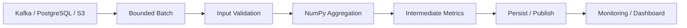

# 09- Aggregation

## Overview

Aggregation reduces an array or selected axes into summary values such as:

```text
sum
mean
median
minimum
maximum
variance
standard deviation
cumulative totals
```

For backend and data-engineering workloads, aggregation is often where raw numerical data becomes an operational metric:

```text
transaction rows
→ batch validation
→ numerical transformation
→ aggregation
→ metric / report / persisted result
```

The important engineering concerns are not only which function to call. They include:

- which axis is reduced
- what shape the result has
- how missing and non-finite values are handled
- what dtype is used during accumulation
- how much memory is required
- whether aggregation can be performed incrementally
- whether the work should happen in NumPy, Pandas, or PostgreSQL

## Aggregation Model

A reduction consumes values along one or more axes and produces a smaller representation.

For example:

```python
import numpy as np

values = np.array([10, 20, 30, 40])

total = values.sum()
```

Input:

```text
(4,)
```

Output:

```text
scalar
```

For a two-dimensional array:

```python
metrics = np.array(
    [
        [10, 20, 30],
        [40, 50, 60],
    ]
)

column_totals = metrics.sum(axis=0)
row_totals = metrics.sum(axis=1)
```

Results:

```text
column_totals → [50, 70, 90]
row_totals    → [60, 150]
```

Aggregation therefore always involves:

```text
input shape
+
axis
+
reduction
+
output shape
```

## Axis Semantics

For:

```python
metrics = np.array(
    [
        [10, 20, 30],
        [40, 50, 60],
    ]
)
```

shape:

```text
(2, 3)
```

`axis=0` reduces the first axis:

```python
metrics.sum(axis=0)
```

Result:

```text
[50, 70, 90]
```

`axis=1` reduces the second axis:

```python
metrics.sum(axis=1)
```

Result:

```text
[60, 150]
```

A robust way to think about this is:

```text
axis=0
→ collapse the first dimension

axis=1
→ collapse the second dimension
```

Avoid memorizing only "axis 0 means columns." That explanation becomes unreliable with higher-dimensional arrays.

## Preserving Dimensions with `keepdims`

By default, a reduced axis disappears:

```python
metrics.mean(axis=0).shape
```

produces:

```text
(3,)
```

With:

```python
metrics.mean(
    axis=0,
    keepdims=True,
)
```

the result shape becomes:

```text
(1, 3)
```

This is useful when the aggregated result will be broadcast back against the original array.

Example:

```python
means = metrics.mean(
    axis=0,
    keepdims=True,
)

centered = metrics - means
```

The shape contract is clearer because:

```text
metrics → (2, 3)
means   → (1, 3)
```

broadcast naturally.

## Common Aggregation Functions

Frequently used reductions include:

```python
values.sum()
values.mean()
values.median()
values.min()
values.max()
values.std()
values.var()
```

Related operations include:

```python
np.ptp(values)
np.percentile(values, 95)
np.quantile(values, 0.95)
```

The goal is not to memorize every aggregation API, but to understand which statistical summary matches the business requirement.

## Sum

`sum()` adds elements together.

```python
amounts = np.array(
    [100.0, 200.0, 300.0],
    dtype=np.float64,
)

total = amounts.sum()
```

Common backend uses include:

- total transaction value
- request counts
- bytes processed
- quantities
- resource consumption

For multidimensional arrays:

```python
totals = amounts_2d.sum(axis=0)
```

reduces one axis while retaining the others.

## Mean

`mean()` computes the arithmetic average:

```python
average = values.mean()
```

For grouped dimensions:

```python
row_means = values.mean(axis=1)
```

The arithmetic mean is sensitive to extreme values.

For operational metrics such as request latency, a mean may be useful but can hide tail behavior.

If p95 or p99 latency matters, use an appropriate percentile or quantile instead of treating the mean as the complete metric.

## Median

`median()` returns the middle value after ordering the data.

```python
median = values.median()
```

It is more resistant to extreme outliers than the mean.

For example:

```text
latencies:
[10, 11, 12, 13, 1000]
```

The mean can be strongly influenced by the outlier, while the median remains closer to the typical request.

Use median when the business question concerns a representative central value rather than total or average volume.

## Minimum and Maximum

Use:

```python
minimum = values.min()
maximum = values.max()
```

These are useful for:

- validation
- range checks
- monitoring
- operational diagnostics
- threshold enforcement

For multidimensional data:

```python
minimum_by_column = values.min(axis=0)
maximum_by_column = values.max(axis=0)
```

Min and max can also be useful before narrowing dtypes:

```python
minimum = values.min()
maximum = values.max()
```

This can help establish whether a proposed integer representation is sufficient, although production validation should consider the documented domain range rather than only the current batch.

## Variance and Standard Deviation

Variance measures dispersion around the mean:

```python
variance = values.var()
```

Standard deviation is:

```python
stddev = values.std()
```

The exact statistical interpretation depends on whether the values represent a population or sample.

NumPy exposes the `ddof` parameter:

```python
sample_std = values.std(ddof=1)
```

A common interview mistake is treating:

```python
std()
```

as universally equivalent to a sample standard deviation.

Understand the statistical contract before selecting `ddof`.

## Percentiles and Quantiles

Percentiles and quantiles are useful when distributions and tail behavior matter.

```python
p95 = np.percentile(
    latencies,
    95,
)
```

Equivalent quantile representation:

```python
p95 = np.quantile(
    latencies,
    0.95,
)
```

Backend metrics often care about:

```text
median
p95
p99
```

because user experience can be dominated by tail latency even when the average is acceptable.

## Axis Aggregation Example

Consider transaction values for two regions over three days:

```python
transactions = np.array(
    [
        [100.0, 120.0, 110.0],
        [80.0, 90.0, 95.0],
    ]
)
```

Interpretation:

```text
rows    → regions
columns → days
```

Total per region:

```python
region_totals = transactions.sum(axis=1)
```

Total per day:

```python
daily_totals = transactions.sum(axis=0)
```

Overall total:

```python
overall_total = transactions.sum()
```

This illustrates why axis semantics should be documented alongside the data model.

## Aggregation and Missing Values

Missing numerical values require explicit treatment.

Consider:

```python
values = np.array(
    [10.0, 20.0, np.nan, 40.0]
)
```

A normal mean:

```python
values.mean()
```

can become `NaN`.

Use a NaN-aware reduction when ignoring missing observations is the correct business rule:

```python
average = np.nanmean(values)
```

Related functions include:

```python
np.nansum(values)
np.nanmean(values)
np.nanmin(values)
np.nanmax(values)
np.nanstd(values)
np.nanvar(values)
```

Do not automatically use `nan*` functions.

First determine whether:

```text
missing value
```

means:

```text
exclude from metric
```

or:

```text
invalid input
```

or:

```text
zero
```

These are different business semantics.

## NaN vs Infinity

NaN-aware aggregation handles `NaN`, not all invalid numerical values.

Consider:

```python
values = np.array(
    [10.0, np.nan, np.inf]
)
```

`np.nanmean()` ignores the NaN but does not treat infinity as missing.

For strict numerical validation:

```python
valid = np.isfinite(values)
```

If the service requires all values to be finite:

```python
if not np.isfinite(values).all():
    raise ValueError("Input contains non-finite values.")
```

The validation policy belongs at the application boundary.

## Aggregation and Dtypes

Aggregation is affected by dtype.

For integer values:

```python
values = np.array(
    [1, 2, 3],
    dtype=np.int32,
)

total = values.sum()
```

The accumulator/result behavior must be considered when large datasets are involved.

A wider accumulator can be explicitly requested:

```python
total = values.sum(
    dtype=np.int64,
)
```

This can reduce overflow risk.

The important principle is:

```text
input dtype
≠
always safe accumulator dtype
```

The maximum possible aggregate may be much larger than any individual element.

## Aggregation and Overflow

Suppose:

```text
individual quantity ≤ 1,000
```

An `int16` input may appear sufficient.

But if the system aggregates:

```text
10 million records
```

the total can greatly exceed the input range.

Therefore dtype selection must consider:

```text
input range
+
operation
+
number of elements
+
maximum cumulative result
```

This is especially important for:

- counters
- money represented as integer minor units
- cumulative byte counts
- usage metrics
- inventory totals

## Aggregation and Floating-Point Error

Floating-point aggregation is not exact decimal arithmetic.

For example:

```python
values = np.array(
    [0.1, 0.2, 0.3],
    dtype=np.float64,
)
```

The representation of decimal fractions in binary floating point can introduce small rounding differences.

For approximate analytics, this is often acceptable.

For exact financial calculations, use a representation designed for exact decimal semantics rather than treating NumPy floating-point aggregation as accounting arithmetic.

## Cumulative Aggregation

Cumulative operations preserve the array's progression rather than reducing it to one value.

Common examples:

```python
cumulative_sum = values.cumsum()
cumulative_product = values.cumprod()
```

For transaction processing:

```python
daily_revenue = np.array(
    [100.0, 150.0, 120.0],
)

running_revenue = daily_revenue.cumsum()
```

Result:

```text
[100, 250, 370]
```

Cumulative operations are useful for:

- running totals
- cumulative usage
- progress tracking
- balance calculations

Be careful with long-running floating-point cumulative calculations because small numerical errors can accumulate.

## Aggregation with Multiple Axes

Higher-dimensional arrays may reduce multiple axes:

```python
values = np.empty(
    (batch_size, regions, metrics),
    dtype=np.float64,
)

result = values.sum(
    axis=(0, 2),
)
```

This reduces both:

```text
batch dimension
+
metric dimension
```

while preserving:

```text
region dimension
```

The resulting shape is determined by the axes that remain.

For multidimensional production code, document the semantic meaning of each axis instead of relying only on numeric axis labels.

## Aggregation and `initial`

Some reductions can use an initial value:

```python
minimum = values.min(
    initial=np.inf,
)
```

This can be useful when the input may be empty or when a reduction needs a defined identity-like starting point.

However, an artificial initial value should match the business semantics.

Do not add a default simply to avoid handling empty inputs.

## Empty Arrays

Aggregation behavior for empty arrays varies by operation.

For example:

```python
values = np.array([], dtype=np.float64)
```

Some reductions cannot produce a meaningful result without an initial value.

Production code should define empty-batch semantics explicitly:

```python
if values.size == 0:
    return 0.0
```

or:

```python
if values.size == 0:
    return None
```

depending on the business contract.

Do not let accidental numerical defaults determine API or business behavior.

## Aggregation and Filtering

Filtering usually precedes aggregation:

```python
valid = np.isfinite(values) & (values >= 0)

total = values[valid].sum()
```

This is concise and vectorized.

However, it can create:

```text
mask
+
filtered array
```

before the aggregation.

For very large datasets, consider batching or an incremental aggregation strategy rather than materializing all filtered values at once.

## Aggregation in Batch Processing

A large dataset often cannot fit safely in memory.

Use:

```text
source
→ batch
→ validate
→ aggregate
→ update global state
→ discard batch
→ next batch
```

Example:

```python
def aggregate_batches(
    batches: list[np.ndarray],
) -> tuple[float, int]:
    total = 0.0
    count = 0

    for batch in batches:
        values = np.asarray(
            batch,
            dtype=np.float64,
        )

        valid = np.isfinite(values)

        if not valid.all():
            values = values[valid]

        total += float(values.sum())
        count += int(values.size)

    return total, count
```

This keeps the full dataset out of memory.

The same pattern can be implemented against:

- PostgreSQL batches
- CSV readers
- Parquet partitions
- S3 objects
- Kafka consumer batches

## Combining Batch Means Correctly

A common mistake is:

```python
global_mean = np.mean(
    [batch.mean() for batch in batches]
)
```

This gives equal weight to each batch regardless of batch size.

If batch sizes differ, the result can be incorrect.

A better approach is to aggregate:

```text
total sum
+
total count
```

then compute:

```python
global_mean = total_sum / total_count
```

For:

```text
batch A → 100 records
batch B → 10 records
```

the 100-record batch should contribute ten times as much weight to the global mean.

## Combining Variance Across Batches

Mean and sum are straightforward to combine incrementally, but variance requires more care.

Do not simply average:

```python
batch_variances
```

to obtain a global variance.

The global result must account for:

```text
batch counts
+
batch means
+
within-batch variance
+
between-batch differences
```

For large streaming datasets, use an appropriate online or mergeable statistical algorithm rather than manually averaging batch statistics.

The key interview point is:

```text
not every aggregate can be combined by taking the average of per-batch aggregates
```

## Aggregation and PostgreSQL

Not every aggregation should happen in NumPy.

If the data lives in PostgreSQL and the required operation is naturally relational:

```sql
SELECT
    customer_id,
    SUM(amount)
FROM transactions
GROUP BY customer_id;
```

performing the aggregation in PostgreSQL may be preferable because it can reduce:

```text
rows transferred
+
network bandwidth
+
Python memory
+
NumPy processing
```

Use NumPy when the numerical computation materially benefits from array processing.

A mature pipeline pushes work to the layer best suited to the operation.

## Aggregation and Pandas

Pandas is often more appropriate when aggregation involves:

```text
labels
+
groups
+
joins
+
heterogeneous columns
+
tabular semantics
```

NumPy is often more appropriate for dense numerical arrays where the data is already normalized into an array representation.

A common pipeline is:

```text
PostgreSQL / Parquet
        ↓
Pandas DataFrame
        ↓
select numerical columns
        ↓
NumPy aggregation
        ↓
results
```

Avoid converting a DataFrame to NumPy purely because an aggregation exists in NumPy.

The relevant question is whether the NumPy representation provides a meaningful benefit.

## Aggregation and Percentile Memory

Percentile and quantile calculations can require more work than simple sums.

For large arrays, consider:

```text
input size
+
sorting / selection cost
+
temporary memory
```

Do not assume:

```text
sum()
```

and:

```text
percentile()
```

have similar performance characteristics.

For production observability systems, specialized streaming or approximate quantile algorithms may be more appropriate when exact percentile computation over massive datasets is not required.

## Aggregation Architecture

A typical backend metric pipeline can be represented as:



The important design choice is where aggregation occurs.

For example:

```text
PostgreSQL
→ relational aggregation

NumPy
→ dense numerical aggregation

Pandas
→ labeled/tabular aggregation

Kafka consumer
→ streaming/window coordination
```

Use the layer whose data model and execution characteristics match the workload.

## Common Aggregation Patterns

### Total

```python
total = values.sum()
```

### Average

```python
average = values.mean()
```

### Minimum / Maximum

```python
minimum = values.min()
maximum = values.max()
```

### Missing-Aware Average

```python
average = np.nanmean(values)
```

### Row-Level Aggregate

```python
row_totals = values.sum(axis=1)
```

### Column-Level Aggregate

```python
column_totals = values.sum(axis=0)
```

### Running Total

```python
running_total = values.cumsum()
```

### Tail Metric

```python
p99 = np.percentile(values, 99)
```

The important part is choosing the operation based on the metric definition rather than merely its availability.

## Common Mistakes

### Averaging Batch Means

Incorrect when batch sizes differ:

```python
np.mean(
    [batch.mean() for batch in batches]
)
```

Aggregate sums and counts instead.

### Treating `NaN` as Zero

These are different semantics:

```text
missing
≠
zero
```

Only convert missing values to zero when the business model defines that behavior.

### Ignoring Infinity

`nanmean()` does not remove infinity.

Validate with:

```python
np.isfinite(values)
```

when finite input is required.

### Ignoring Integer Overflow

Individual values can fit while cumulative sums do not.

Consider accumulator dtype.

### Using NumPy Instead of SQL Automatically

A database engine may be much better positioned to aggregate data before transfer.

### Forgetting `axis`

A reduction without an explicit axis may collapse the entire array:

```python
total = values.sum()
```

when the intended operation was perhaps:

```python
values.sum(axis=1)
```

### Ignoring Empty Input

Empty batches need an explicit application-level contract.

### Treating Mean as a Complete Performance Metric

For latency distributions, mean can hide tail behavior.

Use percentile or quantile metrics where appropriate.

## Performance Considerations

Aggregation is often memory-bandwidth-sensitive.

For large arrays:

```text
read values
→ perform arithmetic
→ produce result
```

The cost can be dominated by moving data through memory rather than by the arithmetic operation itself.

Performance depends on:

- dtype size
- contiguity
- number of passes over the data
- axis and access pattern
- temporary allocations
- cache behavior
- batch size

A `float32` aggregation can move approximately half as many data bytes as `float64`, but numerical correctness remains the primary constraint.

## Aggregation and Temporary Arrays

Consider:

```python
result = values[values >= 0].sum()
```

The operation can involve:

```text
condition
→ boolean mask
→ selected array
→ reduction
```

For very large datasets, this can increase peak memory.

When appropriate, use a batched design or an aggregation strategy that avoids materializing unnecessary intermediate results.

## Production Example: Transaction Metrics

A service processes transaction values in batches:

```python
import numpy as np


def summarize_batch(
    raw_values: np.ndarray,
) -> dict[str, float | int]:
    values = np.asarray(
        raw_values,
        dtype=np.float64,
    )

    if values.ndim != 1:
        raise ValueError("Expected a one-dimensional batch.")

    if values.size > 100_000:
        raise ValueError("Batch exceeds the configured limit.")

    if values.size == 0:
        return {
            "count": 0,
            "total": 0.0,
            "mean": 0.0,
        }

    if not np.isfinite(values).all():
        raise ValueError("Batch contains non-finite values.")

    return {
        "count": int(values.size),
        "total": float(values.sum()),
        "mean": float(values.mean()),
    }
```

This illustrates a useful production sequence:

```text
normalize
→ validate dimensions
→ enforce batch limit
→ handle empty input
→ validate values
→ aggregate
→ return application-level scalars
```

## Production Example: Global Batch Aggregation

For multiple batches:

```python
def aggregate_batches(
    batches: list[np.ndarray],
) -> tuple[float, int]:
    total = 0.0
    count = 0

    for batch in batches:
        values = np.asarray(
            batch,
            dtype=np.float64,
        )

        if values.size == 0:
            continue

        valid = np.isfinite(values)

        if not valid.all():
            values = values[valid]

        total += float(values.sum())
        count += int(values.size)

    return total, count
```

Then:

```python
total, count = aggregate_batches(batches)

mean = total / count if count else 0.0
```

This avoids loading all values into one array.

For a distributed system, the same principle can be extended to:

```text
worker-local aggregates
→ shared durable state / message
→ final reduction
```

provided the aggregate is safely mergeable.

## Distributed Aggregation

Some aggregations are naturally composable:

```text
sum
count
minimum
maximum
```

These can usually be merged from independent workers.

For a global mean, workers can emit:

```text
sum
+
count
```

and the coordinator can compute:

```text
global_mean = total_sum / total_count
```

This is a strong distributed-systems pattern because it reduces network transfer.

For more complex statistics, use a mergeable summary structure rather than attempting to average worker-level summaries directly.

## Resource and Reliability Considerations

For production aggregation:

```text
batch size
×
concurrency
×
dtype size
×
temporary allocations
```

determines a significant part of peak worker memory.

In Kubernetes or Celery:

- bound task size
- bound concurrency
- monitor RSS
- leave memory headroom
- avoid loading entire datasets unnecessarily
- persist intermediate results when retries are expensive

A task that can aggregate one billion values on a development laptop may still fail operationally when several workers execute similar tasks concurrently.

## Interview Questions

### What is an aggregation?

A reduction that combines multiple array elements into one or more summary values.

### What does `axis=0` mean?

It reduces the first axis while preserving the remaining axes.

### What is `keepdims=True` used for?

It preserves the reduced axis with size `1`, often making subsequent broadcasting easier.

### What is the difference between mean and median?

Mean is the arithmetic average and is more sensitive to outliers.

Median is the middle ordered value and is generally more robust to extreme observations.

### Why should you care about `ddof`?

Because standard deviation and variance can represent different population/sample statistical definitions.

### Why can't you simply average batch means?

Because batches may have different sizes.

The correct global mean requires:

```text
sum of all values
÷
count of all values
```

### Why can integer sums overflow?

Fixed-width integers have finite ranges, and cumulative totals can exceed the range even when individual values do not.

### Why might PostgreSQL be preferable to NumPy for aggregation?

Because the database can perform filtering and aggregation before transferring data to Python, reducing network traffic and application memory.

### Does `nanmean()` handle infinity?

No.

It ignores `NaN` but does not treat positive or negative infinity as missing.

## Scenario-Based Interview Questions

### Scenario: Daily Mean Is Incorrect

A pipeline calculates:

```python
daily_means = [
    batch.mean()
    for batch in batches
]

global_mean = np.mean(daily_means)
```

The bug is unequal batch weighting.

Use:

```text
sum(batch)
+
count(batch)
```

then combine globally.

### Scenario: Aggregation Causes OOM

You see:

```python
values = values[np.isfinite(values)]
total = values.sum()
```

Possible memory consumers:

```text
original values
+
mask
+
filtered values
```

Use bounded batches or a design that avoids retaining all intermediate data.

### Scenario: Sum Overflows

The input array uses:

```python
int32
```

but contains millions of large values.

Use an appropriate accumulator:

```python
total = values.sum(
    dtype=np.int64,
)
```

and validate the maximum expected workload.

### Scenario: NumPy Aggregation Is Fast but the Pipeline Is Slow

Investigate:

```text
SQL
+
network
+
deserialization
+
NumPy aggregation
+
serialization
+
persistence
```

The numerical reduction may not be the bottleneck.

## Practical Debugging Template

When diagnosing an aggregation issue:

```python
def inspect_aggregation_input(
    values: np.ndarray,
) -> None:
    print("shape:", values.shape)
    print("dtype:", values.dtype)
    print("size:", values.size)
    print("nbytes:", values.nbytes)
    print("finite:", np.isfinite(values).all())
```

For multidimensional data, explicitly inspect:

```python
for axis in range(values.ndim):
    print(
        f"axis={axis}, "
        f"length={values.shape[axis]}"
    )
```

When results look wrong, verify:

```text
axis
+
shape
+
dtype
+
missing values
+
empty input
+
expected statistical definition
```

before changing the implementation.

## Production Guidelines

For production aggregation:

- Define the metric mathematically and semantically before choosing the NumPy function.
- Make axis selection explicit.
- Use `keepdims=True` when shape preservation simplifies downstream broadcasting.
- Distinguish `NaN`, infinity, zero, and missing business values.
- Choose accumulator dtypes deliberately.
- Validate empty-input behavior.
- Avoid averaging per-batch aggregates unless the statistic is actually mergeable that way.
- Prefer database-side aggregation when it significantly reduces data transfer.
- Use bounded batches for datasets larger than available memory.
- Track peak memory when masks and filtered arrays are involved.
- Use percentile or quantile metrics when tail behavior matters.
- Benchmark representative data sizes, dtypes, and batch sizes.
- Validate numerical correctness after performance changes.

## Key Takeaways

- Aggregation is a reduction over one or more axes, so correct `axis`, shape, dtype, and statistical semantics are more important than memorizing individual APIs.
- Batch aggregation must be designed around mergeability; sums and counts combine naturally, while statistics such as variance require more careful methods.
- Missing values, infinity, empty inputs, integer overflow, and floating-point precision must be handled explicitly according to the business contract.
- For large datasets, combine vectorized aggregation with bounded batches and incremental results instead of materializing the complete filtered dataset.
- Choose the execution layer deliberately: PostgreSQL is often better for relational aggregation, Pandas for labeled/tabular aggregation, and NumPy for dense numerical reductions.