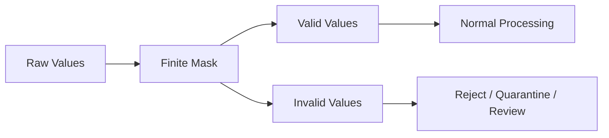
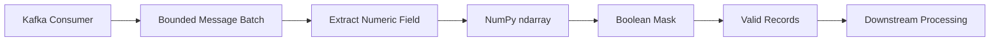

# 10- Masking and Filtering

## Overview

Masking and filtering are core NumPy techniques for selecting, validating, and conditionally processing numerical data.

They are particularly useful in backend and data-engineering pipelines where a batch must be transformed from:

```text
raw numerical data
→ validity conditions
→ selected records
→ vectorized processing
→ aggregation / persistence
```

The central concept is a Boolean mask:

```python
mask = values >= 0
```

The mask identifies which elements satisfy a condition and can then be used for selection, assignment, counting, or conditional computation.

For production workloads, masking must be understood beyond syntax. Important concerns include:

- mask shape
- Boolean logic
- view versus copy behavior
- temporary allocations
- memory usage
- missing and non-finite values
- performance
- input validation
- resource-exhaustion risks

## What Is a Boolean Mask?

A Boolean mask is an array of `True` and `False` values with a shape compatible with the data being inspected.

```python
import numpy as np

values = np.array(
    [10, 25, 5, 40, 15],
    dtype=np.int64,
)

mask = values >= 20

print(mask)
```

Conceptually:

```text
values → [10, 25,  5, 40, 15]
mask   → [ F,  T,  F,  T,  F]
```

The mask can then select matching values:

```python
filtered = values[mask]
```

Result:

```text
[25, 40]
```

Masking is therefore a two-stage operation:

```text
condition
→ Boolean array

Boolean array
→ selection / assignment / computation
```

## Why Masking Exists

Explicit Python filtering is straightforward:

```python
filtered = []

for value in values:
    if value >= 20:
        filtered.append(value)
```

The NumPy form is:

```python
mask = values >= 20
filtered = values[mask]
```

The NumPy version allows the condition and selection to operate using array semantics rather than performing application-level work for every element.

The advantage becomes more significant as the dataset grows and the filtering logic remains naturally numerical.

## Boolean Comparison Operators

Common element-wise comparisons are:

```python
values == 10
values != 10
values > 10
values >= 10
values < 10
values <= 10
```

Each produces a Boolean array.

For example:

```python
mask = values > 10
```

produces one Boolean value for each element in `values`.

These expressions are the foundation for more complex filters.

## Combining Conditions

Use element-wise operators:

```text
&
|
~
```

For example:

```python
valid = (values >= 0) & (values <= 100)
```

Another example:

```python
selected = (values < 10) | (values > 90)
```

Negation:

```python
invalid = ~(values >= 0)
```

Parentheses are important because NumPy's element-wise operators have different precedence from Python's boolean keywords.

## Do Not Use `and` and `or`

This is incorrect for array-wise conditions:

```python
mask = (values > 0) and (values < 100)
```

Python's `and` and `or` operate on scalar truth values, not element-wise array conditions.

Use:

```python
mask = (values > 0) & (values < 100)
```

Likewise:

```python
mask = (values < 0) | (values > 100)
```

This is one of the most common NumPy interview and implementation mistakes.

## Mask Shape

A Boolean mask must have compatible shape for the indexing operation.

For a one-dimensional array:

```python
values = np.arange(10)

mask = values % 2 == 0
filtered = values[mask]
```

Both are:

```text
shape = (10,)
```

For multidimensional arrays:

```python
values = np.arange(12).reshape(3, 4)

mask = values > 5

filtered = values[mask]
```

The mask has:

```text
shape = (3, 4)
```

The result is a one-dimensional array containing the matching elements.

This can be surprising if the expected output needs to preserve the original two-dimensional structure.

## Filtering Rows in Two Dimensions

Suppose:

```python
records = np.array(
    [
        [101, 50.0],
        [102, 120.0],
        [103, 75.0],
        [104, 250.0],
    ]
)
```

To retain rows whose second column exceeds `100`:

```python
mask = records[:, 1] > 100

filtered = records[mask]
```

Result:

```text
[[102, 120],
 [104, 250]]
```

This is a common backend/data-processing pattern:

```text
record matrix
→ compute row condition
→ select complete records
```

## Column-Specific Filtering

The condition should usually be built from the relevant column:

```python
amounts = records[:, 1]

mask = amounts > 100

filtered_records = records[mask]
```

This makes the business rule clearer than embedding complex expressions directly inside the indexing operation.

For production code, meaningful variable names improve reviewability:

```python
high_value_mask = records[:, 1] > 100
high_value_records = records[high_value_mask]
```

## Boolean Assignment

Masks can also update values in place.

```python
values = np.array(
    [10, -5, 20, -1],
    dtype=np.int64,
)

values[values < 0] = 0
```

Result:

```text
[10, 0, 20, 0]
```

This is useful when the intended operation is mutation:

```text
invalid negative values
→ clamp to zero
```

Because this mutates the array, ownership must be clear if the array may be shared with other parts of the application.

## Conditional Replacement with `np.where`

`np.where()` provides vectorized conditional selection:

```python
values = np.array(
    [50.0, 120.0, 80.0],
)

result = np.where(
    values >= 100.0,
    values * 0.90,
    values,
)
```

The result applies the first expression where the condition is true and the second expression otherwise.

This is useful when you need a transformed result instead of just the selected subset.

## `np.where()` vs Boolean Assignment

| Technique | Main Use | Mutation |
|---|---|---|
| `values[mask]` | Select matching elements | No |
| `values[mask] = x` | Update matching elements | Yes |
| `np.where(condition, a, b)` | Select between expressions | Returns result |

The correct choice depends on whether the operation should preserve the source array.

## `np.select`

For multiple mutually exclusive conditions, `np.select()` can be clearer than deeply nested `np.where()` expressions.

```python
values = np.array(
    [25.0, 75.0, 150.0],
)

result = np.select(
    [
        values < 50,
        values < 100,
    ],
    [
        1,
        2,
    ],
    default=3,
)
```

Conceptually:

```text
< 50   → 1
< 100  → 2
otherwise → 3
```

This is useful when a numerical classification has several explicit ranges.

## `np.nonzero` and `np.where`

When you need the positions of matching elements:

```python
values = np.array(
    [10, 25, 5, 40],
)

indices = np.nonzero(values >= 20)
```

For a one-dimensional array, a common alternative is:

```python
indices = np.where(values >= 20)[0]
```

Result:

```text
[1, 3]
```

This is useful when the indices themselves are needed for later processing.

## `np.flatnonzero`

For a flattened index representation:

```python
indices = np.flatnonzero(values >= 20)
```

This is useful when working with conditions over an array and the desired result is a one-dimensional set of flat indices.

Choose the form that matches the downstream indexing contract.

## Counting Matching Values

A mask can be used to count records satisfying a condition:

```python
mask = values >= 100

count = np.count_nonzero(mask)
```

This avoids materializing the selected values when only the count is required.

Another common pattern is:

```python
count = np.sum(mask)
```

because Boolean values can participate in numerical reduction.

For large datasets, prefer the operation that expresses intent clearly:

```python
np.count_nonzero(mask)
```

is explicit about the objective.

## `any()` and `all()`

Masks can also be reduced to validation decisions:

```python
has_invalid = np.any(values < 0)
all_valid = np.all(values >= 0)
```

For finite-value validation:

```python
if not np.isfinite(values).all():
    raise ValueError("Input contains non-finite values.")
```

This is useful at backend boundaries where a batch must satisfy a complete numerical invariant.

## Masking Non-Finite Values

Numerical processing frequently needs to distinguish valid finite values from:

```text
NaN
+∞
-∞
```

Use:

```python
mask = np.isfinite(values)
```

For example:

```python
valid_values = values[np.isfinite(values)]
```

This is different from checking only for `NaN`.

```python
np.isnan(values)
```

detects `NaN`, while:

```python
np.isinf(values)
```

detects infinities, and:

```python
np.isfinite(values)
```

requires a finite value.

## Missing Data Policy

Masking can implement a missing-data strategy, but the strategy itself belongs to the application.

Possible semantics include:

```text
reject
remove
impute
default
quarantine
propagate
```

For example, a data-quality pipeline may quarantine invalid measurements:

```python
finite_mask = np.isfinite(values)

valid = values[finite_mask]
invalid = values[~finite_mask]
```

This creates separate processing paths:



This is often more operationally useful than silently dropping invalid records.

## Range Validation

A common production validation pattern is:

```python
valid = (
    np.isfinite(values)
    & (values >= 0)
    & (values <= 1_000_000)
)
```

Then:

```python
if not valid.all():
    raise ValueError("Batch contains out-of-range values.")
```

This is useful for:

- quantities
- percentages
- scores
- counters
- monetary amounts
- sensor values

Define limits from the domain contract rather than arbitrary technical defaults.

## Filtering vs Validation

Filtering and validation have different semantics.

### Filtering

```python
values = values[mask]
```

means:

```text
discard values that do not match
```

### Validation

```python
if not mask.all():
    raise ValueError(...)
```

means:

```text
the complete input must satisfy the condition
```

Do not silently filter invalid input when the business contract requires rejecting the batch.

This distinction is important in financial, compliance, and data-integrity workflows.

## Filtering and Memory

Boolean filtering generally creates a new array.

For:

```python
filtered = values[mask]
```

the working set can include:

```text
source array
+
Boolean mask
+
filtered result
```

For a large dataset, this can materially increase peak memory.

If the filter retains most values, the duplicated storage can be particularly expensive.

Use bounded batches when the complete dataset cannot safely fit in memory.

## Filtering with Views vs Copies

Compare:

```python
window = values[100:1000]
```

with:

```python
filtered = values[values > 100]
```

The first is a basic slice and commonly returns a view.

The second uses Boolean indexing and generally creates a new result array.

Therefore:

```text
continuous range
→ potentially zero-copy

condition-based selection
→ typically allocates selected data
```

This distinction is essential for memory analysis.

## Multi-Condition Filtering

A realistic filter may combine business conditions:

```python
valid = (
    np.isfinite(amounts)
    & (amounts >= 0)
    & (amounts <= 1_000_000)
)
```

Then:

```python
accepted = amounts[valid]
```

For row-based data:

```python
high_value = (
    np.isfinite(records[:, 2])
    & (records[:, 2] >= 1_000)
    & (records[:, 3] == 1)
)

selected = records[high_value]
```

Keep complex conditions readable by assigning semantic names to intermediate masks when necessary.

## Combining Masks

Masks can be composed independently:

```python
finite_mask = np.isfinite(values)
non_negative_mask = values >= 0
within_limit_mask = values <= 1_000_000

valid_mask = (
    finite_mask
    & non_negative_mask
    & within_limit_mask
)
```

This is often better than embedding the complete condition into one expression because each rule can be debugged independently.

For example:

```python
invalid_finite = ~finite_mask
invalid_negative = finite_mask & ~non_negative_mask
invalid_limit = finite_mask & non_negative_mask & ~within_limit_mask
```

This enables error classification rather than simply returning "invalid input."

## Filtering and Broadcasting

Conditions can also use broadcasting.

For example:

```python
values = np.array(
    [
        [10.0, 20.0, 30.0],
        [40.0, 50.0, 60.0],
    ]
)

limits = np.array(
    [15.0, 45.0, 55.0],
)

mask = values <= limits
```

Shapes:

```text
values → (2, 3)
limits → (3,)
mask   → (2, 3)
```

This is useful for per-column validation rules.

Always calculate the resulting mask size because the mask itself consumes memory.

## Masking Structured Numerical Records

Suppose each row represents:

```text
transaction_id
amount
status_code
```

A production filter might be:

```python
transaction_ids = records[:, 0]
amounts = records[:, 1]
status = records[:, 2]

mask = (
    np.isfinite(amounts)
    & (amounts >= 0)
    & (status == 200)
)

valid_records = records[mask]
```

This keeps the complete row when the condition is based on only selected columns.

For complex heterogeneous records, Pandas or explicit application models may be more appropriate than storing everything in one numerical matrix.

## Filtering and Dtypes

Masking does not eliminate dtype considerations.

For example:

```python
values = np.asarray(
    raw_values,
    dtype=np.float32,
)
mask = values >= 0
```

The mask is Boolean, while the filtered result retains the numerical dtype of the selected array.

However, later operations can promote that dtype.

For memory-sensitive pipelines, inspect both:

```python
print(mask.nbytes)
print(filtered.nbytes)
```

The total working set matters more than the source array alone.

## Filtering in Batches

For large datasets, process filtering in bounded batches:

```python
def filter_batches(
    values: np.ndarray,
    batch_size: int,
):
    for start in range(0, values.size, batch_size):
        stop = min(start + batch_size, values.size)

        batch = values[start:stop]

        mask = (
            np.isfinite(batch)
            & (batch >= 0)
        )

        yield batch[mask]
```

This limits the memory required for the mask and filtered batch.

If the caller accumulates every yielded result into a single list, however, the overall memory problem returns.

A scalable pipeline should usually:

```text
filter batch
→ process / persist batch
→ release batch
→ next batch
```

## Filtering Large Files

For local binary numerical files or memory-mapped data:

```text
file
→ mapped region
→ bounded slice
→ mask
→ process
```

This can avoid loading the complete source into memory.

However, the filtered result can still be large.

Memory mapping solves source residency; it does not make arbitrary filtering output free.

## Filtering API Inputs

A backend endpoint that accepts numerical input should validate limits before building unnecessarily large arrays.

Example:

```python
import numpy as np


def filter_amounts(
    raw_values: list[float],
) -> np.ndarray:
    if len(raw_values) > 100_000:
        raise ValueError("Too many values.")

    values = np.asarray(
        raw_values,
        dtype=np.float64,
    )

    if not np.isfinite(values).all():
        raise ValueError("Values must be finite.")

    return values[values >= 0]
```

The order matters:

```text
bound request size
→ convert
→ validate
→ filter
```

This is both a reliability and security consideration.

## Filtering Kafka Batches

A Kafka consumer can apply vectorized filtering to bounded message batches:



The important operational constraint is:

```text
Kafka batch size
+
NumPy memory
+
consumer concurrency
```

must fit within the worker's resource budget.

Vectorized filtering can process records efficiently, but unbounded consumer batches can still exhaust memory.

## Filtering PostgreSQL Results

When filtering a database-backed dataset, consider whether the filter belongs in SQL.

Instead of:

```text
SELECT all rows
→ Python
→ NumPy mask
```

a relational condition may be better pushed into PostgreSQL:

```sql
SELECT amount
FROM transactions
WHERE amount >= 0
  AND amount <= 1000000;
```

Benefits can include:

```text
fewer rows transferred
+
lower network cost
+
lower Python memory
+
less NumPy work
```

Use NumPy filtering when the condition is part of a numerical transformation that is more naturally performed after data enters the application.

## Filtering and Pandas

Pandas is often more appropriate when filtering involves:

```text
column labels
+
mixed dtypes
+
datetime semantics
+
categorical data
+
tabular joins
```

NumPy is appropriate when:

```text
data is already numerical
+
dense
+
array-oriented
```

A common hybrid pipeline is:

```text
Pandas DataFrame
→ numerical column selection
→ NumPy array
→ numerical mask / transformation
→ Pandas / storage
```

Avoid moving between representations repeatedly solely to apply equivalent filtering operations.

## Common Mistakes

### Using `and` Instead of `&`

Incorrect:

```python
mask = (values > 0) and (values < 100)
```

Correct:

```python
mask = (values > 0) & (values < 100)
```

### Forgetting Parentheses

Use:

```python
(values > 0) & (values < 100)
```

rather than relying on operator precedence.

### Filtering When You Should Reject

This:

```python
values = values[np.isfinite(values)]
```

silently removes invalid values.

For a strict validation contract, use:

```python
if not np.isfinite(values).all():
    raise ValueError(...)
```

### Assuming Boolean Selection Is a View

It generally creates a new array.

Large filters can therefore increase peak memory.

### Building Huge Masks

A Boolean mask has one entry per selected input position.

A multi-gigabyte source can require a substantial mask.

### Filtering After Fetching Everything from the Database

If PostgreSQL can safely apply the condition, doing it there can reduce data transfer and application memory.

### Ignoring Broadcasted Mask Size

A condition involving shapes such as:

```text
(N, 1)
+
(1, M)
```

can create an `(N, M)` mask.

The mask itself can become enormous even before selecting the data.

### Assuming `np.where()` Is Lazy

Do not treat `np.where()` as a general lazy branch mechanism.

For arithmetic with invalid branches, use operations such as `np.divide(..., where=...)` when appropriate.

## Performance Considerations

Filtering performance depends on:

```text
input size
+
dtype
+
mask generation
+
selected fraction
+
memory bandwidth
+
temporary allocations
+
batch size
```

A mask can be cheap to calculate but expensive in aggregate because:

```text
source
+
mask
+
selected output
```

must coexist.

For large arrays, benchmark different strategies using representative selectivity:

```text
1% selected
50% selected
99% selected
```

The optimal design can differ substantially.

## Sparse Selection vs Dense Selection

If only a tiny fraction of records match:

```text
1% selected
```

a filtered result can be dramatically smaller than the source.

If almost everything matches:

```text
99% selected
```

the selection still creates a new large array.

This matters when deciding whether to:

```text
filter
+
copy
```

or:

```text
process in place
+
track invalid positions
```

depending on downstream semantics.

## Production Security Considerations

Masking itself is not a security boundary.

When numerical data comes from users:

```text
validate request size
+
validate dimensions
+
validate dtype assumptions
+
bound broadcast output
+
bound batch size
```

before large allocations.

A malicious request can exploit shape combinations to produce:

```text
huge masks
+
huge filtered outputs
+
huge temporary arrays
```

which can cause:

```text
worker OOM
+
request timeouts
+
container restarts
+
retry amplification
```

Input validation is therefore part of numerical pipeline security.

## Interview Questions

### What is a Boolean mask?

An array of Boolean values representing whether each corresponding element satisfies a condition.

### What is the difference between filtering and validation?

Filtering removes or selects values that satisfy a condition.

Validation checks whether the complete input satisfies a condition and can reject the entire batch when it does not.

### Why do NumPy conditions use `&` instead of `and`?

`&` performs element-wise Boolean combination, while `and` expects scalar truth values.

### Does Boolean indexing return a view?

Generally no. Boolean indexing creates a new result array.

### How do you select rows based on one column?

Create a Boolean mask from that column and apply it to the complete row array:

```python
mask = records[:, 1] > 100
selected = records[mask]
```

### What is the difference between `np.where()` and Boolean indexing?

Boolean indexing primarily selects matching elements.

`np.where()` selects between alternative values or expressions based on a condition.

### How do you validate that all values are finite?

```python
np.isfinite(values).all()
```

### How do you count matching elements?

```python
np.count_nonzero(mask)
```

### Why can masking increase memory usage?

Because the Boolean mask and the selected output can exist simultaneously with the source array.

### When should filtering happen in PostgreSQL instead?

When the condition is relational and applying it in the database materially reduces transferred rows and downstream processing.

## Scenario-Based Interview Questions

### Scenario: A Filtered Array Uses More Memory Than Expected

You have:

```python
filtered = values[mask]
```

and memory usage increases sharply.

Investigate:

```text
source array
+
mask
+
filtered result
+
downstream temporaries
```

For a large dataset, move to bounded batches or a pipeline that does not retain unnecessary intermediate arrays.

### Scenario: Invalid Records Must Not Be Silently Dropped

Current code:

```python
values = values[np.isfinite(values)]
```

The fix is validation:

```python
if not np.isfinite(values).all():
    raise ValueError("Invalid numerical values.")
```

The distinction is business semantics, not NumPy syntax.

### Scenario: Filtering Is Fast but the API Is Slow

Measure:

```text
request parsing
+
conversion
+
mask generation
+
selection
+
serialization
+
network
```

The NumPy filter may not be the dominant latency contributor.

### Scenario: Filter Creates an OOM

A condition broadcasts from:

```text
(50_000, 1)
```

against:

```text
(1, 50_000)
```

The resulting mask can contain:

```text
2.5 billion Boolean elements
```

Before filtering anything, the mask itself is already a major allocation.

Redesign the computation or process in bounded blocks.

## Practical Debugging Template

When diagnosing masking behavior:

```python
def inspect_mask(
    values: np.ndarray,
    mask: np.ndarray,
) -> None:
    print("values shape:", values.shape)
    print("values dtype:", values.dtype)
    print("values bytes:", values.nbytes)

    print("mask shape:", mask.shape)
    print("mask dtype:", mask.dtype)
    print("mask bytes:", mask.nbytes)

    print(
        "matches:",
        np.count_nonzero(mask),
    )
```

For multi-dimensional filtering, also verify:

```python
print("mask ndim:", mask.ndim)
```

and compare it with the intended selection semantics.

## Production Guidelines

For production masking and filtering:

- Use Boolean expressions for vectorized numerical conditions.
- Combine masks with `&`, `|`, and `~`, using explicit parentheses.
- Make the distinction between validation and filtering explicit.
- Use `np.isfinite()` when finite numerical values are required.
- Prefer `np.count_nonzero()` when only the number of matches is needed.
- Understand that Boolean selection generally creates a new array.
- Measure mask and filtered-result memory for large datasets.
- Process large inputs in bounded batches.
- Validate externally controlled dimensions and batch sizes before allocation.
- Avoid broadcasting masks to unexpectedly large shapes.
- Push relational filters into PostgreSQL when that materially reduces transferred data.
- Use Pandas when filtering is primarily tabular, labeled, or heterogeneous.
- Benchmark realistic selectivity levels and data sizes.
- Define what happens to invalid or missing records instead of silently discarding them.

## Key Takeaways

- Boolean masks provide vectorized conditions for selecting, validating, counting, and updating NumPy arrays.
- Use `&`, `|`, and `~` with parentheses for element-wise logical expressions; Python's `and` and `or` are not appropriate for array conditions.
- Boolean and advanced indexing generally allocate new arrays, so large filtering operations can temporarily require source data, masks, and filtered results at the same time.
- Filtering and validation are different semantics: filtering removes non-matching values, while validation can reject an entire batch when the input violates its contract.
- Production filtering should combine bounded inputs, memory-aware batching, upstream database filtering where appropriate, and explicit handling of invalid and missing data.