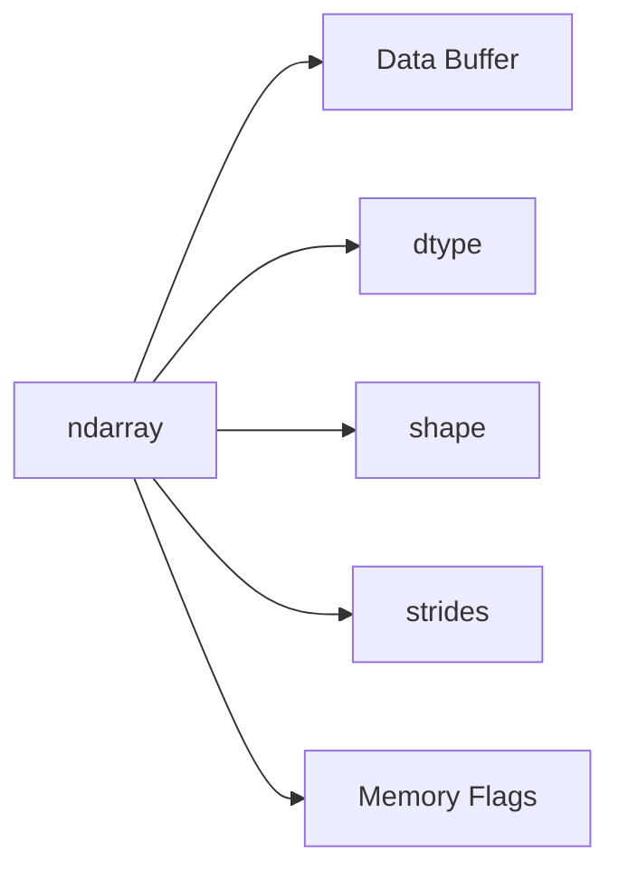

# 11- Memory Layout

## Overview

NumPy performance depends heavily on how an `ndarray` maps logical elements to physical memory.

Two arrays can contain the same values and have the same shape while having very different memory layouts. That difference can affect:

- cache locality
- memory bandwidth
- vectorized execution
- copy requirements
- interoperability with native libraries
- batch-processing performance

The core concepts are:

```text
shape
+
dtype
+
strides
+
data buffer
+
contiguity
+
axis order
```

A strong mental model is:

```text
logical array
    ↓
shape + dtype
    ↓
strides determine address traversal
    ↓
memory layout
    ↓
CPU cache / memory bandwidth
    ↓
operation performance
```

Memory layout is therefore not an implementation detail to ignore. It is part of understanding why one NumPy expression performs well while another performs poorly or unexpectedly allocates.

## Why Memory Layout Matters

Consider two arrays:

```python
import numpy as np

values = np.arange(
    1_000_000,
    dtype=np.float64,
)

matrix = values.reshape(1000, 1000)
transposed = matrix.T
```

Both arrays contain the same number of elements.

However:

```text
matrix
→ original layout

transposed
→ different axis traversal
→ usually a non-contiguous view
```

Creating the transpose can be cheap because NumPy can often represent it by changing strides.

The subsequent computation can still behave differently because the memory access pattern has changed.

This leads to an important distinction:

```text
cheap to create
≠
cheap to process
```

## The Array Memory Model

A simplified `ndarray` representation is:



These components answer different questions:

| Property | Question |
|---|---|
| `dtype` | How is each element represented? |
| `shape` | How many elements are along each axis? |
| `strides` | How many bytes are skipped when an axis index increases? |
| Data buffer | Where are the actual bytes stored? |
| Flags | Is the layout contiguous or otherwise suitable for a consumer? |

The same data buffer can be interpreted through different shapes and strides.

## Shape

`shape` describes the logical dimensions:

```python
values = np.empty(
    (4, 8, 16),
    dtype=np.float64,
)

print(values.shape)
```

Output:

```text
(4, 8, 16)
```

The shape does not tell you whether the data is:

```text
C-contiguous
+
Fortran-contiguous
+
non-contiguous
```

For that, inspect strides and flags.

## Dtype

`dtype` determines the size and interpretation of each element.

```python
values = np.empty(
    1_000_000,
    dtype=np.float64,
)

print(values.itemsize)
print(values.nbytes)
```

For `float64`:

```text
itemsize = 8 bytes
```

Therefore:

```text
1,000,000 × 8 bytes
≈ 8 MB
```

Reducing dtype size can reduce the amount of data moved through memory, but dtype changes must remain numerically correct.

Memory layout and dtype therefore interact:

```text
same shape
+
different dtype
→ different bytes moved
```

## Strides

Strides define how NumPy advances through the data buffer when an index changes along each axis.

Consider:

```python
values = np.arange(
    12,
    dtype=np.int64,
).reshape(3, 4)

print(values.shape)
print(values.strides)
```

For a typical C-contiguous layout:

```text
shape   = (3, 4)
dtype   = int64
itemsize = 8
```

the strides are conceptually:

```text
(32, 8)
```

because:

```text
move one row    → skip 4 × 8 bytes
move one column → skip 1 × 8 bytes
```

Strides allow NumPy to represent:

- slices
- transposes
- reversed arrays
- stepped views

without necessarily copying data.

## Address Calculation

A simplified address model is:

```text
address =
base_address
+
sum(index_i × stride_i)
```

For a two-dimensional C-contiguous array:

```text
address(row, column)
=
base
+
row × row_stride
+
column × itemsize
```

This is the reason strides are sufficient to describe many views without moving data.

It also explains why different strides can result in very different memory-access patterns.

## C-Contiguous Layout

C order is the common row-major representation.

For:

```python
values = np.arange(
    12,
    dtype=np.int64,
).reshape(3, 4)
```

the final axis varies fastest in memory.

Conceptually:

```text
[ 0, 1, 2, 3 ]
[ 4, 5, 6, 7 ]
[ 8, 9, 10, 11 ]
```

Within a row:

```text
0 → 1 → 2 → 3
```

the elements are adjacent in the data buffer.

Check:

```python
print(values.flags.c_contiguous)
```

A C-contiguous layout is often convenient for code that processes the last axis sequentially.

## Fortran-Contiguous Layout

Fortran order uses column-major storage.

```python
values = np.asfortranarray(
    np.arange(12).reshape(3, 4)
)

print(values.flags.f_contiguous)
```

Here, the first axis varies fastest in memory.

Conceptually:

```text
column 0 values are adjacent
column 1 values are adjacent
...
```

Fortran layout can be useful for algorithms and native libraries that operate naturally column-wise.

Neither layout is universally faster.

The correct choice depends on:

```text
dominant access pattern
+
downstream library
+
operation
+
number of passes
```

## Contiguous vs Non-Contiguous

A contiguous array stores elements in the expected linear memory order for a given layout.

A non-contiguous array may be a view with:

```text
gaps
+
different strides
+
reversed direction
+
reordered axes
```

Example:

```python
values = np.arange(
    20,
    dtype=np.int64,
)

strided = values[::2]

print(strided.flags.c_contiguous)
print(strided.strides)
```

The view avoids copying, but it skips elements in the source buffer.

This can reduce cache efficiency during repeated processing.

## Inspecting Layout

For performance debugging:

```python
print(values.shape)
print(values.dtype)
print(values.strides)
print(values.flags.c_contiguous)
print(values.flags.f_contiguous)
print(values.flags.writeable)
```

For memory relationships:

```python
print(np.shares_memory(source, other))
```

These diagnostics should be part of the toolkit for investigating unexpected array performance.

## Slicing and Memory Layout

Basic slicing commonly produces a view.

```python
values = np.arange(
    20,
    dtype=np.float64,
)

subset = values[5:15]
```

The subset can share storage with the original.

A simple slice often preserves a contiguous access pattern for the selected region.

However:

```python
strided = values[::2]
```

creates a view with a larger stride.

The allocation behavior is efficient, but the access pattern is different.

Therefore:

```text
view
```

does not imply:

```text
same performance characteristics as source
```

## Transpose and Strides

Consider:

```python
matrix = np.arange(
    12,
    dtype=np.float64,
).reshape(3, 4)

transposed = matrix.T
```

The transpose can often be represented by changing:

```text
shape
+
strides
```

rather than moving data.

For example:

```text
matrix.shape      → (3, 4)
transposed.shape  → (4, 3)
```

The transpose may therefore be cheap to create.

But its memory traversal can become less favorable for operations that expect C-contiguous access.

## Transpose and Contiguous Copies

If repeated processing benefits from contiguous storage:

```python
transposed = matrix.T

contiguous = np.ascontiguousarray(
    transposed,
)
```

If `transposed` is already C-contiguous, `ascontiguousarray()` can avoid an unnecessary copy.

If it is not, the function can allocate a new buffer and copy the data.

This creates a common optimization trade-off:

```text
copy once
+
repeated efficient processing
```

versus:

```text
no copy
+
repeated strided processing
```

Benchmark both when the workload is significant.

## `np.ascontiguousarray`

Use:

```python
contiguous = np.ascontiguousarray(values)
```

when a consumer requires or benefits from C-contiguous memory.

Typical consumers include:

- native extensions
- C/C++ interfaces
- serialization code with layout assumptions
- repeated numerical kernels

The function is useful because it avoids a copy when the input is already suitable.

Do not call it unconditionally throughout a pipeline without understanding the copy cost.

## `np.asfortranarray`

Similarly:

```python
fortran = np.asfortranarray(values)
```

produces Fortran-contiguous storage when necessary.

This is useful when:

- a downstream library expects column-major memory
- column-oriented access dominates
- repeated operations amortize the conversion cost

The same rule applies:

```text
layout normalization is useful when the consumer benefits enough to justify the copy
```

## Memory Order During Creation

NumPy allows explicit memory order when creating some arrays:

```python
values = np.empty(
    (1000, 1000),
    dtype=np.float64,
    order="C",
)
```

or:

```python
values = np.empty(
    (1000, 1000),
    dtype=np.float64,
    order="F",
)
```

Choosing the correct order during allocation can avoid a later conversion.

This is preferable when the access pattern is known in advance.

## Reshape and Memory Layout

`reshape()` may return a view or a copy depending on layout.

For a contiguous array:

```python
values = np.arange(12)

matrix = values.reshape(3, 4)
```

a view is often possible.

For more complex layouts:

```python
transposed = matrix.T
reshaped = transposed.reshape(-1)
```

the reshape may need to copy data.

Therefore:

```text
reshape
→ attempt compatible view
→ copy when necessary
```

Do not assume that changing shape is always free.

## `ravel()` and Layout

`ravel()` attempts to return a flattened view when possible:

```python
flat = values.ravel()
```

If the memory order prevents a suitable view, NumPy may need to copy.

This makes `ravel()` more flexible than assuming a guaranteed zero-copy operation.

By contrast:

```python
flat = values.flatten()
```

explicitly creates a copy.

For memory-sensitive paths, the distinction matters.

## Memory Layout and Vectorization

Vectorized operations benefit from efficient memory traversal.

Consider:

```python
values = np.arange(
    10_000_000,
    dtype=np.float64,
)

result = values * 1.18
```

The operation can process a dense contiguous buffer efficiently.

Now consider:

```python
strided = values[::2]

result = strided * 1.18
```

The operation is still vectorized, but the input has a larger stride.

This can increase memory-system overhead because the CPU does not read a simple sequence of adjacent elements.

Vectorization and memory locality should therefore be evaluated together.

## Cache Locality

CPU caches are most effective when nearby memory locations are accessed repeatedly or sequentially.

A contiguous access pattern:

```text
A B C D E F G H
```

is often easier for hardware prefetching and cache hierarchy behavior than:

```text
A .... B .... C .... D
```

where large strides separate useful values.

This does not mean every non-contiguous array is slow.

It means the access pattern is part of the performance model.

For large arrays, memory bandwidth and cache behavior can dominate arithmetic cost.

## Memory Bandwidth

Consider:

```python
result = values + 1.0
```

The CPU performs simple arithmetic, but it must also:

```text
read values
+
write result
```

For very large arrays, the bottleneck may be moving bytes rather than performing the addition.

Reducing dtype size from:

```text
float64 → float32
```

can reduce the raw bytes moved, provided the precision is acceptable.

Likewise, avoiding unnecessary intermediate arrays can reduce memory traffic.

## Temporary Arrays and Layout

A compound expression:

```python
result = (values * 1.18) + offset
```

can create intermediate storage.

A memory-aware implementation can reuse an output buffer:

```python
result = np.empty_like(values)

np.multiply(
    values,
    1.18,
    out=result,
)

np.add(
    result,
    offset,
    out=result,
)
```

This can reduce peak temporary memory and memory traffic.

However, `out=` increases explicit mutation and may reduce readability.

Use it when profiling identifies allocation or memory-bandwidth pressure.

## Views vs Copies

Memory layout often determines whether an operation can remain a view.

For example:

```python
values = np.arange(20)

view = values[::2]
copy = values[::2].copy()
```

The view:

```text
shares memory
+
uses a stride
```

The copy:

```text
owns contiguous selected data
+
requires allocation
```

A copy can therefore improve repeated access even when creating it is initially more expensive.

The right decision depends on how often the data is processed.

## Layout Normalization at API Boundaries

A native extension or external library may expect contiguous memory.

At the boundary:

```python
def process_native(values: np.ndarray) -> np.ndarray:
    values = np.ascontiguousarray(values)

    return native_operation(values)
```

This makes the layout requirement explicit.

The design should avoid unnecessary repeated normalization:

```text
application
→ contiguous conversion
→ component A
→ contiguous conversion
→ component B
```

Instead, normalize once at the boundary where the requirement actually exists.

## Memory Layout and Pandas

A Pandas object is a higher-level tabular abstraction and should not be treated as a direct one-to-one representation of a single NumPy contiguous matrix.

When converting numeric columns:

```python
numeric = frame[["amount", "quantity"]].to_numpy()
```

consider:

```text
dtype
+
memory sharing
+
copy requirements
+
column layout
```

The result may not always have the same memory characteristics as an explicitly constructed homogeneous NumPy array.

For performance-sensitive numerical stages:

```text
Pandas
→ select data
→ explicit NumPy representation
→ normalize dtype/layout if needed
→ numerical processing
```

This makes the execution boundary clearer.

## Memory Layout and File Processing

For binary numerical files, layout can be part of the storage contract.

A pipeline may use:

```text
file format
→ memory mapping / read
→ ndarray
→ shape
→ dtype
→ strides
```

If the on-disk representation is already in the required order, unnecessary transposition or copying can be avoided.

For large local files, `np.memmap` can expose file-backed data through an array-like interface.

Memory mapping does not eliminate memory access cost. It changes how the source storage is accessed.

## Batch Processing and Layout

For large datasets, process bounded batches:

```python
def process_batches(
    values: np.ndarray,
    batch_size: int,
) -> None:
    for start in range(0, values.size, batch_size):
        stop = min(
            start + batch_size,
            values.size,
        )

        batch = values[start:stop]
        process_batch(batch)
```

A basic contiguous slice can preserve useful layout characteristics.

But if the batch is created from a complex strided view:

```python
batch = values[::2]
```

the downstream processing may repeatedly traverse non-contiguous memory.

The batch strategy should therefore consider both:

```text
batch size
+
memory layout
```

## Layout and Worker Concurrency

Suppose a Celery or Kubernetes worker processes:

```text
500 MB input
+
500 MB output
```

A single task may already have a substantial working set.

If four tasks run concurrently:

```text
rough task data
≈ 2 GB
```

before accounting for:

```text
Python process memory
+
temporary arrays
+
network buffers
+
framework state
```

A layout optimization that reduces copies can therefore improve not just latency but operational capacity.

Memory efficiency can affect:

```text
worker concurrency
+
container sizing
+
cloud cost
+
OOM risk
```

## Common Mistakes

### Assuming Contiguous Means Faster in Every Case

Contiguity is useful, but the best layout depends on the access pattern.

### Assuming Views Are Always Better Than Copies

Views avoid allocation but can have poor strides.

A copy can improve repeated access enough to amortize its creation cost.

### Calling `ascontiguousarray()` Everywhere

This can introduce unnecessary copies and memory traffic.

Normalize layout at meaningful boundaries.

### Ignoring Strides

Two arrays with the same shape can have very different performance because their strides differ.

Inspect:

```python
array.strides
```

when behavior is surprising.

### Treating Transpose as Free

Creating a transpose can be cheap, but repeatedly processing the resulting non-contiguous view can be expensive.

### Assuming `nbytes` Is Process Memory

`nbytes` measures the array data buffer, not the complete process working set.

### Ignoring Dtype

Memory layout and dtype interact directly through:

```text
bytes per element
```

A contiguous `float64` array can still move twice as many bytes as a comparable `float32` array.

### Retaining Views of Large Arrays

A small view can keep a large source allocation alive.

Consider an explicit copy when the small result must have a long lifetime.

## Interview Traps

### What are strides?

Strides specify the number of bytes NumPy moves in memory when an index along each axis increases by one.

### What is a contiguous array?

An array whose elements occupy memory in the expected sequential layout for a particular order, such as C or Fortran order.

### Is a transpose a copy?

Not necessarily.

A transpose can often be represented as a view with changed shape and strides.

### Why can a transposed array be slower?

It may be non-contiguous, producing less cache-friendly memory access for subsequent operations.

### Why would you make a contiguous copy?

When a downstream operation or native library benefits enough from contiguous memory to justify the copy cost.

### What is the difference between C and Fortran order?

C order makes the last axis vary fastest in memory; Fortran order makes the first axis vary fastest.

### Can two arrays have the same shape but different memory layouts?

Yes.

Their strides and contiguity flags can differ while shape and dtype remain identical.

### Why does dtype affect memory performance?

Because dtype determines bytes per element and therefore how much data must be loaded, stored, and transferred through the memory hierarchy.

## Scenario-Based Interview Questions

### Scenario: Transpose Is Fast but the Pipeline Gets Slower

You measure:

```text
transpose → very fast
```

but the next stage is significantly slower.

Likely explanation:

```text
transpose
→ view
→ changed strides
→ non-contiguous access
→ slower downstream traversal
```

Benchmark:

```text
view processing
vs
contiguous copy + processing
```

The best solution depends on how many downstream operations reuse the transformed data.

### Scenario: Native Extension Rejects the Array

The array is mathematically correct but not contiguous.

Normalize once:

```python
values = np.ascontiguousarray(values)
```

at the integration boundary.

Avoid repeated conversions throughout the pipeline.

### Scenario: Memory Usage Doubles During Reshape

The reshape may not be representable as a view for the source layout.

Inspect:

```python
print(values.strides)
print(result.strides)
print(np.shares_memory(values, result))
```

The operation may have created a copy.

### Scenario: A Small Slice Keeps a Large Dataset Alive

Possible relationship:

```text
small view
→ shared large buffer
→ source storage remains retained
```

Use:

```python
small = large[:10].copy()
```

when long-term retention of the large source is undesirable.

## Practical Benchmarking

A useful layout benchmark compares both processing time and allocation cost.

```python
import time
import numpy as np

values = np.arange(
    10_000_000,
    dtype=np.float64,
).reshape(1000, 10_000)

transposed = values.T
contiguous = np.ascontiguousarray(transposed)

start = time.perf_counter()
result_view = transposed * 1.18
view_elapsed = time.perf_counter() - start

start = time.perf_counter()
result_contiguous = contiguous * 1.18
contiguous_elapsed = time.perf_counter() - start

print("view:", view_elapsed)
print("contiguous:", contiguous_elapsed)
```

This is only a starting point.

A useful production benchmark should also consider:

```text
copy creation time
+
peak memory
+
number of downstream operations
+
representative array sizes
+
dtype
+
warm/cold memory state
```

A contiguous copy can be worthwhile if many operations reuse it.

## Production Guidelines

For production NumPy systems:

- Treat shape, dtype, strides, and contiguity as part of the performance model.
- Use views when avoiding copies is valuable and the access pattern remains acceptable.
- Benchmark strided views against contiguous copies for repeated processing.
- Normalize C or Fortran layout at integration boundaries when downstream consumers require it.
- Avoid unconditional layout conversions throughout the pipeline.
- Choose C or Fortran order according to the dominant access pattern.
- Consider dtype size together with memory layout when analyzing memory bandwidth.
- Use bounded batches for large datasets.
- Account for concurrent workers when sizing memory limits.
- Inspect `strides` and `flags` when array performance is surprising.
- Consider long-lived views when diagnosing retained memory.
- Measure complete stages rather than assuming the cheapest array transformation is the fastest overall design.

## Key Takeaways

- NumPy array performance depends on more than shape and dtype; strides, axis order, and contiguity determine how the CPU traverses the underlying data.
- Views such as transposes and strided slices can avoid copies, but non-contiguous access can still reduce downstream performance.
- A one-time contiguous copy can outperform a zero-copy view when the data is processed repeatedly, so the decision should be benchmark-driven.
- C order and Fortran order are alternatives for different access patterns; neither is universally superior.
- Production memory-layout decisions should account for dtype, temporary allocations, batch size, worker concurrency, native-library requirements, and peak memory rather than isolated operation cost.