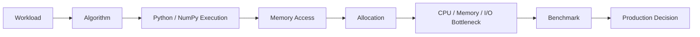
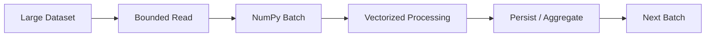
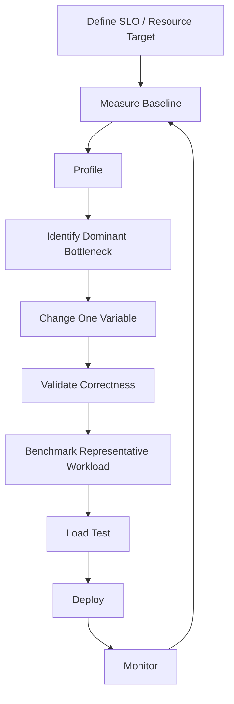

# 12- NumPy Performance

## Overview

NumPy performance is determined by more than whether code uses vectorized operations.

For backend and data-engineering workloads, performance emerges from the interaction of:

```text
algorithm
+
Python overhead
+
vectorization
+
broadcasting
+
dtype
+
memory layout
+
views / copies
+
temporary allocations
+
batch size
+
I/O
```

A useful production mental model is:



The objective is not to make every NumPy expression as short or as fast as possible in isolation. The objective is to achieve predictable system-level latency, throughput, memory usage, reliability, and cost.

## Performance Model

A numerical operation can be understood as:

```text
input
  ↓
representation
  ↓
execution
  ↓
memory movement
  ↓
output
```

Each stage can become the bottleneck.

For example:

```python
result = values * 1.18
```

may be limited by:

```text
Python overhead
```

for a small loop-based implementation, but by:

```text
memory bandwidth
```

for a very large dense array.

A database-backed API may instead be dominated by:

```text
SQL
+
network
+
serialization
```

even if the NumPy operation itself is extremely fast.

## Python Loop Overhead

Consider:

```python
result = np.empty_like(values)

for index, value in enumerate(values):
    result[index] = value * 1.18
```

The application executes a Python-level loop for every element.

A vectorized operation:

```python
result = values * 1.18
```

moves the element-wise numerical loop into NumPy's native execution path.

The benefit comes primarily from reducing:

```text
Python bytecode execution
+
per-element Python dispatch
+
Python object interaction
```

This is why NumPy is often effective for large homogeneous numerical arrays.

It is not because a multiplication operation becomes mathematically different.

## Vectorization

Vectorization expresses an operation over an array:

```python
adjusted = prices * 1.18
```

instead of explicitly iterating over each value.

Common vectorized operations include:

```python
values + offset
values * rate
values >= threshold
np.isfinite(values)
values.sum()
np.where(mask, a, b)
```

The strongest candidates for vectorization are:

- dense numerical transformations
- validation conditions
- reductions
- element-wise arithmetic
- array comparisons

Avoid forcing vectorization onto irregular application logic.

## `np.vectorize()` Is Not a Performance Primitive

A common interview trap is:

```python
np.vectorize(custom_function)
```

`np.vectorize()` is primarily a convenience mechanism for applying a Python callable element by element.

It should not be treated as equivalent to native NumPy vectorization.

Prefer:

```python
result = values * 1.18
```

or other NumPy-native operations when possible.

If a custom function cannot be expressed with NumPy operations, a Python loop may sometimes be the clearer and equally appropriate implementation.

## Broadcasting

Broadcasting allows compatible shapes to participate in vectorized operations:

```python
prices = np.empty(
    (100_000, 8),
    dtype=np.float32,
)

rates = np.array(
    [1.18] * 8,
    dtype=np.float32,
)

result = prices * rates
```

Shapes:

```text
prices → (100_000, 8)
rates  → (8,)
result → (100_000, 8)
```

Broadcasting avoids explicitly constructing a second `(100_000, 8)` input containing repeated rates.

However, the output still requires memory:

```text
100,000 × 8 × 4 bytes
```

for a `float32` result.

Broadcasting therefore reduces unnecessary input replication but does not eliminate output or temporary memory costs.

## Broadcasting Can Cause Memory Explosions

Consider:

```python
left = np.empty(
    (50_000, 1),
    dtype=np.float64,
)

right = np.empty(
    (1, 50_000),
    dtype=np.float64,
)

result = left + right
```

The result shape is:

```text
(50_000, 50_000)
```

which contains:

```text
2.5 billion elements
```

At eight bytes per `float64`:

```text
≈ 20 GB
```

This is a reliability issue, not merely a performance issue.

Before large broadcasted operations:

```text
calculate result shape
→ calculate element count
→ calculate result bytes
→ enforce resource limits
```

## Dtype and Performance

Dtype affects:

```text
bytes per element
+
memory bandwidth
+
cache utilization
+
precision
+
range
```

Compare:

```python
values32 = np.empty(
    10_000_000,
    dtype=np.float32,
)

values64 = np.empty(
    10_000_000,
    dtype=np.float64,
)
```

The `float64` array requires twice the data-buffer memory.

For memory-bound workloads, processing fewer bytes can improve throughput.

However:

```text
smaller dtype
```

must not become:

```text
incorrect numerical result
```

Choose dtype based on the application's numerical contract.

## Memory-Bound vs CPU-Bound Workloads

A key performance skill is identifying the bottleneck.

### CPU-bound

Symptoms may include:

```text
high CPU utilization
+
substantial arithmetic work
+
little I/O wait
```

Potential improvements:

```text
algorithm
+
vectorization
+
native operations
+
parallelism where appropriate
```

### Memory-bound

Symptoms may include:

```text
large arrays
+
simple arithmetic
+
high memory traffic
+
CPU not fully utilized
```

Potential improvements:

```text
smaller dtype
+
fewer passes
+
fewer temporaries
+
better contiguity
+
reuse buffers
```

### I/O-bound

Symptoms include:

```text
database latency
+
network latency
+
storage latency
```

The NumPy expression may already be fast enough.

The right optimization is then upstream or downstream.

## Memory Layout

Performance depends on how elements are physically traversed.

Inspect:

```python
print(values.shape)
print(values.strides)
print(values.flags.c_contiguous)
print(values.flags.f_contiguous)
```

A contiguous array generally provides a simple sequential access pattern.

A strided view can avoid copying but may access memory with gaps.

For example:

```python
strided = values[::2]
```

is often a view, but each useful element is separated in the source buffer.

For repeated computation, benchmark:

```text
strided view
vs
contiguous copy
```

## C and Fortran Order

Two common layouts are:

| Layout | Fastest-Varying Axis |
|---|---|
| C order | Last axis |
| Fortran order | First axis |

Neither is universally better.

Use a layout that matches:

```text
dominant access pattern
+
downstream native library
+
operation frequency
```

For example:

```python
contiguous = np.ascontiguousarray(values)
```

can be useful before a consumer that expects C-contiguous input.

But it may allocate and copy the entire array.

## Views vs Copies

Basic slicing commonly creates views:

```python
batch = values[1000:2000]
```

This can be nearly free to create.

A copy:

```python
batch = values[1000:2000].copy()
```

allocates new storage.

The performance trade-off is:

```text
view
→ lower allocation
→ shared storage
→ possible non-contiguous access

copy
→ higher allocation
→ independent storage
→ potentially better locality
```

A one-time copy can be worthwhile when the resulting array is processed repeatedly.

## Memory Retention

Views can create unexpected memory lifetimes.

```python
large = np.empty(
    100_000_000,
    dtype=np.float64,
)

small = large[:10]
```

A long-lived `small` view can keep the large backing allocation relevant to memory lifetime.

If only the small result needs to survive:

```python
small = large[:10].copy()
```

may reduce retained memory.

The decision depends on:

```text
copy cost now
vs
memory retention later
```

## Contiguity and Native Interoperability

Native extensions and some external libraries may expect contiguous buffers.

Use:

```python
values = np.ascontiguousarray(values)
```

at the integration boundary when required.

Avoid:

```text
normalize layout
→ component A
→ normalize again
→ component B
```

Instead:

```text
normalize once
→ pass the representation through compatible stages
```

This makes copy behavior more predictable.

## Temporary Arrays

A vectorized expression can allocate intermediate arrays.

For example:

```python
result = (values * 1.18) + offset
```

may involve:

```text
values * 1.18
      ↓
temporary
      ↓
+ offset
      ↓
result
```

For large arrays, temporary allocations can dominate memory usage.

When profiling identifies allocation pressure, buffer reuse can help:

```python
result = np.empty_like(values)

np.multiply(
    values,
    1.18,
    out=result,
)

np.add(
    result,
    offset,
    out=result,
)
```

This reduces intermediate storage but increases code complexity and mutation.

Use explicit buffer management when the workload justifies it.

## In-Place Operations

In-place operations can reduce allocation:

```python
values *= 1.18
```

But they change existing storage.

If:

```python
view = values[100:200]
```

exists, the view can observe the mutation.

The decision is therefore:

```text
less allocation
vs
stronger mutation / aliasing semantics
```

Use in-place operations only when ownership is clear.

## Allocation Cost

Allocation itself has a cost:

```text
request memory
+
initialize / copy
+
manage lifetime
```

Repeated allocation can become expensive in high-throughput systems.

Examples of allocation-heavy patterns include:

```python
np.append(...)
np.concatenate(...)
np.insert(...)
np.delete(...)
```

inside large loops.

Prefer:

```text
preallocation
+
collect then concatenate
+
bounded batches
+
streaming
```

depending on the workload.

## Preallocation

When the output size is known, preallocate:

```python
result = np.empty(
    values.shape,
    dtype=np.float64,
)

np.multiply(
    values,
    1.18,
    out=result,
)
```

Preallocation avoids repeated output-buffer growth.

The trade-off is that:

```python
np.empty(...)
```

contains uninitialized memory.

Every position must be written before it is read.

## Batch Processing

When the full dataset does not fit comfortably in memory, vectorize within batches:



The key pattern is:

```text
Python controls batch boundaries
+
NumPy handles numerical work inside each batch
```

Batch size affects:

- memory
- throughput
- latency
- I/O efficiency
- retry cost
- worker concurrency

A batch that is optimal on one machine may be unsuitable under Kubernetes concurrency.

## Worker Concurrency

Suppose:

```text
1 task
→ 500 MB peak numerical memory
```

Running:

```text
8 concurrent tasks
```

can require substantially more than:

```text
4 GB
```

because each process also has:

```text
Python memory
+
temporary arrays
+
framework state
+
network buffers
```

Resource planning should consider:

```text
peak memory per task
×
concurrent tasks
+
process overhead
```

This is especially important for:

- Celery
- Kubernetes
- containerized ETL workers
- multi-tenant processing services

## Batch Aggregation

Not every batch result needs to be stored.

Instead of:

```python
results = []

for batch in batches:
    results.append(batch.sum())

final = np.sum(results)
```

a scalar accumulator can be enough:

```python
total = 0.0

for batch in batches:
    total += float(batch.sum())
```

This reduces memory.

For means:

```text
total sum
+
total count
```

should usually be combined rather than averaging batch means when batch sizes differ.

## Large Dataset Strategy

A production numerical pipeline should generally follow:

```text
Reduce upstream data
        ↓
Bound batch size
        ↓
Normalize dtype
        ↓
Choose layout
        ↓
Vectorize
        ↓
Minimize temporaries
        ↓
Aggregate / persist
        ↓
Measure
```

Examples:

```text
PostgreSQL
→ WHERE / SELECT only needed data

S3
→ partitioned / selective reads

Kafka
→ bounded consumer batches

NumPy
→ vectorized processing

Persistence
→ incremental output
```

Performance is a pipeline property, not merely a NumPy property.

## Database Pushdown

Suppose the system currently does:

```text
PostgreSQL
→ fetch 50 million rows
→ Python
→ NumPy filter
→ aggregation
```

If PostgreSQL can safely perform the filtering and aggregation:

```sql
SELECT
    customer_id,
    SUM(amount)
FROM transactions
WHERE amount >= 0
GROUP BY customer_id;
```

the amount of data transferred to Python can fall dramatically.

This can reduce:

```text
network
+
Python memory
+
NumPy work
+
serialization
```

Use NumPy when the numerical transformation materially benefits from array execution.

## API Performance

For FastAPI or Django endpoints:

```text
HTTP parsing
→ validation
→ conversion
→ NumPy computation
→ serialization
→ network
```

Benchmarking only:

```python
result = values * 1.18
```

does not represent complete request latency.

A correct optimization process measures:

```text
end-to-end latency
+
NumPy stage latency
+
peak memory
+
throughput
```

The relative contribution of each stage determines where optimization matters.

## Serialization Costs

Returning a NumPy array from an API usually requires conversion into a wire representation.

For example:

```python
payload = values.tolist()
```

This can create Python objects and become expensive for large arrays.

The numerical computation may take milliseconds while serialization takes much longer.

Possible architectural alternatives include:

- pagination
- binary formats
- asynchronous jobs
- object storage
- pre-aggregated responses

Choose the wire format based on the actual API contract.

## NumPy vs Python Lists

NumPy tends to have an advantage for large homogeneous numerical workloads because:

```text
typed dense storage
+
native array operations
```

reduce Python-level per-element overhead.

Python lists remain preferable for:

- heterogeneous objects
- nested business structures
- arbitrary application state
- small general-purpose collections
- workflows dominated by Python control flow

Do not replace Python data structures with NumPy merely because a service contains numerical values.

## NumPy vs Pandas

Pandas is often better for:

```text
tabular data
+
labels
+
joins
+
grouping
+
heterogeneous columns
```

NumPy is often better for:

```text
dense numerical arrays
+
vectorized numerical kernels
+
memory-aware numerical processing
```

A practical pipeline can use both:

```text
Pandas
→ select / clean tabular data
→ NumPy numerical stage
→ aggregation
→ Pandas / database / output
```

Do not measure performance purely by the number of NumPy operations.

Representation conversion also has a cost.

## Benchmarking

Performance optimization should follow measurement.

For microbenchmarks:

```python
import timeit

values = "import numpy as np; values = np.arange(1_000_000, dtype=np.float64)"

statement = "values * 1.18"

print(
    timeit.timeit(
        statement,
        setup=values,
        number=10,
    )
)
```

For larger application stages:

```python
import time

start = time.perf_counter()

result = process_batch(values)

elapsed = time.perf_counter() - start

print(f"elapsed={elapsed:.6f}s")
```

Use the appropriate tool:

| Benchmark Type | Typical Tool |
|---|---|
| Small isolated operation | `timeit` |
| Larger application stage | `time.perf_counter()` |
| End-to-end service | Load-testing / tracing tools |
| Memory analysis | Process RSS / memory profiler |
| CPU analysis | Profiler / system metrics |

## Benchmarking Methodology

A useful NumPy benchmark should:

- use representative data sizes
- use realistic dtypes
- separate setup from the operation being measured
- run multiple iterations
- account for warm-up and cache effects
- validate correctness
- measure memory when relevant
- compare equivalent implementations

Do not benchmark only:

```python
np.arange(...)
```

followed immediately by:

```python
operation(...)
```

if array creation is not part of the production hot path.

Conversely, include array creation if the real service creates the array for every request.

The benchmark boundary should match the production boundary.

## Scaling Benchmarks

Benchmark across multiple input sizes:

```text
10 thousand
100 thousand
1 million
10 million
100 million
```

The relative performance of approaches can change as data grows.

A Python loop may be acceptable for:

```text
1,000 elements
```

but not for:

```text
10,000,000 elements
```

Likewise, an intermediate copy that is negligible at small sizes can become a major memory bottleneck at production scale.

## Memory Benchmarking

Array-level memory can be inspected with:

```python
print(values.nbytes)
```

But:

```text
nbytes
```

is only the data-buffer size.

Production memory measurement should also consider:

```text
process RSS
+
temporary allocations
+
Python objects
+
framework memory
+
network buffers
```

This distinction is essential when diagnosing Docker or Kubernetes OOM events.

## Correctness Before Speed

Optimization must preserve semantics.

For numerical results:

```python
np.testing.assert_allclose(
    optimized,
    baseline,
    rtol=1e-6,
    atol=1e-9,
)
```

For exact arrays where appropriate:

```python
np.testing.assert_array_equal(
    optimized,
    baseline,
)
```

Especially verify:

```text
NaN behavior
+
overflow behavior
+
dtype changes
+
edge cases
+
empty inputs
+
shape semantics
```

A faster implementation that changes the business result is not an optimization.

## Numerical Stability

Performance optimizations can affect numerical behavior.

For example:

```text
float32
vs
float64
```

can produce different results.

Likewise:

```text
operation order
```

can affect floating-point accumulation.

For critical numerical pipelines, define acceptable error bounds before optimizing.

Do not treat tiny floating-point differences as automatically harmless or automatically unacceptable.

The business contract determines the answer.

## Common Performance Anti-Patterns

### Python Loop Over Large Numeric Arrays

```python
result = []

for value in values:
    result.append(value * 1.18)
```

Prefer a vectorized operation when the workload is naturally numerical.

### Repeated `np.append()`

```python
for value in incoming:
    result = np.append(result, value)
```

This can repeatedly allocate and copy the accumulated data.

### Blind `copy()`

```python
values = values.copy()
```

at every layer can increase memory usage without improving performance or correctness.

### Blind Contiguous Conversion

```python
values = np.ascontiguousarray(values)
```

on every function boundary can create unnecessary copies.

### Giant Broadcast

An innocuous-looking expression can produce a huge output.

Always calculate output shape.

### Chained Vectorized Expressions

```python
result = (
    values * scale
    + offset
) / divisor
```

can create temporary arrays.

For large memory-bound workloads, profile allocation pressure before rewriting it with explicit buffers.

### Micro-Optimizing the Wrong Layer

Reducing:

```text
NumPy stage: 20 ms → 10 ms
```

is not meaningful if:

```text
database: 700 ms
```

dominates the request.

## Production Architecture

A performance-conscious backend/data pipeline often looks like:


Each layer has its own optimization strategy.

| Layer | Typical Optimization |
|---|---|
| PostgreSQL | Filtering, projection, aggregation, indexes |
| S3 / Files | Partitioning, selective reads, batching |
| Kafka | Batch size, consumer concurrency |
| Python | Avoid unnecessary object-level loops |
| NumPy | Vectorization, dtype, layout, allocation |
| Serialization | Compact format, pagination, batching |
| Kubernetes | CPU/memory sizing, concurrency |
| Celery | Task size, worker concurrency, retry scope |

## Observability

Performance-sensitive production workloads should expose metrics such as:

```text
batch size
processing duration
throughput
peak memory
error count
retry count
queue lag
database latency
serialization duration
```

Useful derived metrics include:

```text
records / second
bytes / second
milliseconds / million elements
memory / active batch
```

These are more useful than a single benchmark number because they describe operational behavior.

## Reliability Considerations

Performance and reliability interact.

An operation that is fast but occasionally allocates a huge temporary array can cause:

```text
OOM
→ worker restart
→ task retry
→ duplicate work
→ increased queue lag
→ more concurrent retries
```

This can create a feedback loop.

Therefore:

```text
peak memory
```

is a reliability metric, not only a performance metric.

Bound:

```text
input size
+
batch size
+
broadcast dimensions
+
worker concurrency
```

to keep resource usage predictable.

## Kubernetes and Docker

Container limits make peak memory especially important.

Suppose:

```text
container memory limit = 2 GiB
```

and the application typically uses:

```text
500 MiB baseline
```

A numerical operation that creates:

```text
1.8 GiB
```

of temporary arrays can still trigger an OOM kill.

Do not plan against:

```text
array.nbytes
```

alone.

Include:

```text
baseline process memory
+
source arrays
+
outputs
+
temporaries
+
concurrency
```

Leave headroom for operational stability.

## Cost Considerations

Memory and CPU efficiency can reduce infrastructure cost.

A smaller working set can enable:

```text
fewer memory-optimized instances
+
higher worker density
+
lower container memory requests
```

But over-optimizing CPU or memory can increase engineering complexity.

A production decision should consider:

```text
runtime cost
+
infrastructure cost
+
development complexity
+
operational risk
```

Optimize the bottleneck that materially affects system economics or SLOs.

## Common Interview Questions

### Why is NumPy often faster than a Python loop?

Because it can execute numerical iteration in native code over dense typed data, reducing Python-level per-element overhead.

### Is NumPy always faster?

No.

Small workloads, object-heavy operations, irregular control flow, I/O-bound work, and conversion overhead can favor other approaches.

### Why can a vectorized expression still consume a lot of memory?

Because it may allocate outputs and intermediate arrays.

### Why can a copy improve performance?

A contiguous copy can improve cache locality and repeated memory access enough to amortize the initial copy cost.

### What is the difference between CPU-bound and memory-bound NumPy work?

CPU-bound work is limited primarily by computation; memory-bound work is limited primarily by moving data through the memory hierarchy.

### How does dtype affect performance?

Smaller dtypes move fewer bytes, which can improve memory bandwidth and cache behavior, but they may reduce precision or range.

### How should a large dataset be processed when it does not fit in RAM?

Use bounded batches, streaming, memory mapping where appropriate, upstream filtering, and incremental aggregation or persistence.

### Why is benchmark scope important?

Because optimizing an isolated NumPy expression may have little effect if database, network, conversion, or serialization costs dominate the complete workload.

## Scenario-Based Interview Questions

### Scenario: Vectorization Made Memory Usage Worse

A Python loop is replaced with:

```python
result = (values * scale) + offset
```

and the worker begins hitting memory limits.

Investigate:

```text
output allocation
+
intermediate allocation
+
dtype
+
input size
+
concurrency
```

Potential options:

```text
bounded batches
+
buffer reuse
+
fewer intermediates
+
smaller valid dtype
+
lower worker concurrency
```

### Scenario: NumPy Optimization Saves Only 2% of Request Time

Profile shows:

```text
SQL        → 600 ms
serialization → 200 ms
NumPy      → 20 ms
```

Reducing NumPy from:

```text
20 ms → 5 ms
```

has limited end-to-end benefit.

Optimize the dominant stages first.

### Scenario: Memory Usage Is Fine Locally but OOMs in Kubernetes

Possible explanation:

```text
local
→ one task
→ large available memory

production
→ multiple concurrent tasks
→ container memory limit
→ overlapping temporaries
```

Tune:

```text
batch size
+
worker concurrency
+
memory limit
+
allocation behavior
```

rather than assuming the numerical kernel is faulty.

### Scenario: A Copy Makes the Job Faster

This is plausible if the original array is non-contiguous and is consumed repeatedly.

Benchmark:

```text
copy + N operations
```

versus:

```text
view + N strided operations
```

Choose the approach with the lower total runtime and acceptable memory usage.

## Practical Performance Workflow

A production optimization loop is:



A good optimization candidate is one where:

```text
measured bottleneck
+
clear expected benefit
+
controlled trade-off
```

Avoid optimization driven only by style preferences or intuition.

## Performance Checklist

Before shipping a performance-sensitive NumPy workload, verify:

| Area | Questions |
|---|---|
| Algorithm | Is the algorithm appropriate? |
| Python overhead | Are large numerical loops still running in Python? |
| Shape | Are dimensions expected? |
| Broadcasting | Could output size explode? |
| Dtype | Is the representation correct and memory-efficient? |
| Layout | Is access contiguous enough for the workload? |
| Views | Are shared-memory semantics intentional? |
| Copies | Are copies necessary and measured? |
| Temporaries | Could intermediate arrays increase peak memory? |
| Batch size | Is the working set bounded? |
| Concurrency | Can multiple tasks exceed memory limits? |
| I/O | Is NumPy actually the bottleneck? |
| Serialization | Is output conversion expensive? |
| Benchmark | Is the test representative of production? |
| Correctness | Do optimized results match the baseline? |
| Observability | Can runtime and memory be monitored? |

## Key Takeaways

- NumPy performance is a system property shaped by algorithm choice, Python overhead, vectorization, memory layout, dtype, allocation, batching, concurrency, and I/O.
- Vectorization often reduces Python overhead, but it does not guarantee lower memory usage or better end-to-end latency.
- Memory-aware optimization requires understanding strides, contiguity, views, copies, temporary arrays, dtype size, and peak working-set behavior.
- Large workloads should use bounded batches, controlled concurrency, upstream data reduction, and incremental persistence instead of relying on a single large in-memory vectorized operation.
- Optimize from measurements: identify the dominant bottleneck, validate correctness, benchmark representative workloads, and confirm the improvement with production-level latency and resource metrics.