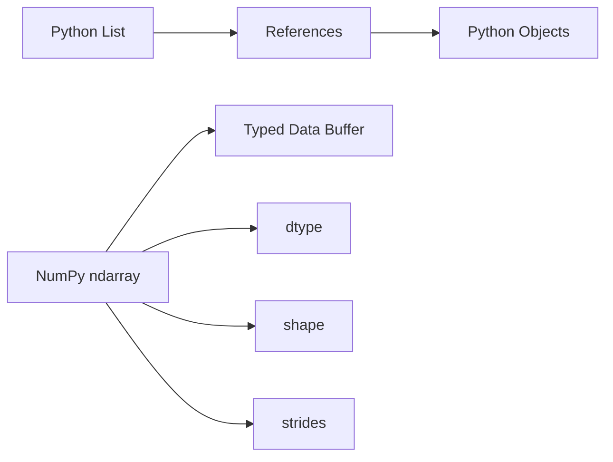
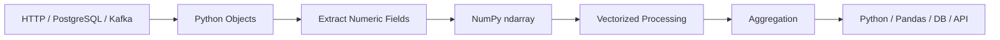
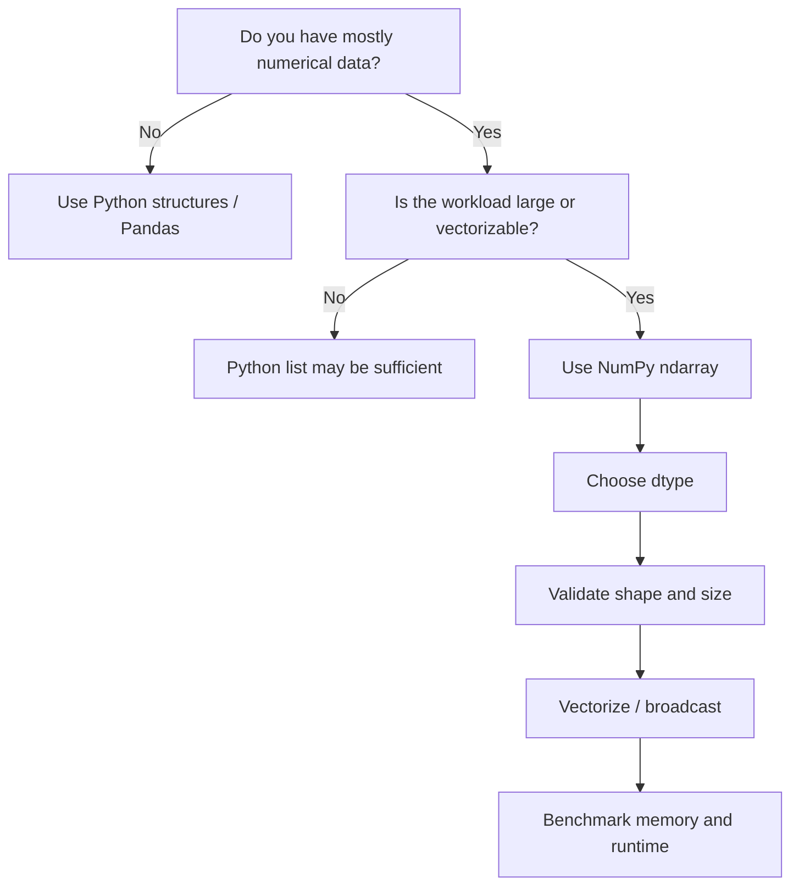

# 13- NumPy vs Python Lists

## Overview

Python lists and NumPy arrays are both fundamental Python data structures, but they are designed for different workloads.

A Python list is a general-purpose container for Python objects.

A NumPy `ndarray` is a typed numerical data structure designed for efficient array-oriented computation.

The important engineering comparison is therefore not:

```text
Which one is better?
```

It is:

```text
What data model and workload does the application have?
```

A useful mental model is:

```text
Python list
→ flexible container
→ Python objects
→ general application logic

NumPy ndarray
→ homogeneous numerical buffer
→ dtype + shape + strides
→ vectorized numerical processing
```

Understanding this distinction is essential for backend and data-engineering interviews because production systems commonly use both.

## Core Data Model

### Python List

A Python list stores references to Python objects.

```python
values = [10, 20, 30, 40]
```

The list can contain heterogeneous values:

```python
values = [
    10,
    20.5,
    "active",
    None,
]
```

This flexibility is valuable for ordinary application development.

A list is appropriate for:

- request payload structures
- heterogeneous business objects
- configuration
- collections of domain models
- dynamic application state
- arbitrary nested structures

### NumPy Array

A NumPy array normally stores homogeneous values using one dtype:

```python
import numpy as np

values = np.array(
    [10, 20, 30, 40],
    dtype=np.int32,
)
```

The array has:

```text
data buffer
+
dtype
+
shape
+
strides
```

This representation supports efficient numerical operations over large datasets.

## Architectural Difference

The key difference is the storage model.



A Python list is optimized around flexible Python object management.

A NumPy array is optimized around dense numerical storage and array operations.

This is why choosing between them should begin with the data representation rather than the operation syntax.

## Comparison

| Characteristic | Python List | NumPy `ndarray` |
|---|---|---|
| Element types | Can be heterogeneous | Usually homogeneous |
| Storage | References to Python objects | Typed numerical buffer |
| Numerical vectorization | No | Yes |
| General application logic | Excellent | Usually inappropriate |
| Large dense numerical data | Less memory-efficient | Usually more suitable |
| Shape metadata | No | Yes |
| Dtype metadata | No fixed array dtype | Yes |
| Broadcasting | No | Yes |
| Slicing | General Python semantics | Array-aware semantics |
| Advanced masking | Manual filtering | Vectorized Boolean masks |
| Mutation | Supported | Supported |
| Resizing | Convenient via list growth | Reallocation generally required |
| Nested data | Natural | Possible but often not the right abstraction |
| Numerical aggregation | Python-level iteration | Native array operations |

## Memory Representation

Consider:

```python
values = [10, 20, 30, 40]
```

The list contains references to Python integer objects.

By contrast:

```python
values = np.array(
    [10, 20, 30, 40],
    dtype=np.int32,
)
```

stores the values using a fixed-width integer representation.

For large homogeneous numerical datasets, this can produce much denser storage.

For an array:

```python
values.nbytes
```

reports the size of its data buffer.

For one million `int32` values:

```text
1,000,000 × 4 bytes
≈ 4 MB
```

The Python list's complete memory footprint is different because it includes:

```text
list storage
+
object references
+
Python integer objects
```

The exact process-level memory cost depends on the Python implementation and runtime state.

## Homogeneous vs Heterogeneous Data

NumPy's homogeneous data model is a major strength for numerical processing.

```python
prices = np.array(
    [100.0, 120.0, 150.0],
    dtype=np.float64,
)
```

Every element follows the same representation.

A list can mix:

```python
records = [
    100,
    120.5,
    "150",
    None,
]
```

This flexibility is useful for application-level data but makes dense numerical execution less predictable.

Choose:

```text
list → heterogeneous application data
ndarray → homogeneous numerical data
```

as the default mental model.

## Numerical Operations

A Python list does not define element-wise arithmetic:

```python
values = [10, 20, 30]

# This is list concatenation, not numeric multiplication.
result = values * 2
```

The result is:

```text
[10, 20, 30, 10, 20, 30]
```

NumPy defines numerical array operations:

```python
values = np.array(
    [10, 20, 30],
    dtype=np.int64,
)

result = values * 2
```

Result:

```text
[20, 40, 60]
```

This difference is fundamental.

Python lists are containers.

NumPy arrays are numerical data structures.

## Vectorization

With a list, element-wise transformation usually requires a Python loop or comprehension:

```python
values = [10.0, 20.0, 30.0]

result = [
    value * 1.18
    for value in values
]
```

With NumPy:

```python
values = np.array(
    [10.0, 20.0, 30.0],
    dtype=np.float64,
)

result = values * 1.18
```

For large homogeneous arrays, NumPy can perform the numerical iteration inside its native implementation instead of executing Python-level logic for each element.

The performance difference comes primarily from reducing:

```text
Python interpreter overhead
+
per-element Python dispatch
+
Python object interaction
```

It does not mean that NumPy performs fewer mathematical operations.

## Performance Is Workload-Dependent

Do not use:

```text
NumPy is always faster than lists
```

as an interview answer.

A better statement is:

```text
NumPy is generally advantageous for large homogeneous
numerical workloads because it combines compact typed storage
with native array operations and vectorization.
```

For:

- small arrays
- irregular business logic
- heterogeneous objects
- I/O-heavy loops
- application control flow

a Python list can be simpler and sufficiently fast.

## Small Workloads

For a small collection:

```python
values = [10, 20, 30]
```

creating a NumPy array:

```python
values = np.array(
    [10, 20, 30],
)
```

adds another abstraction and conversion step.

If the data is tiny and only used once, there may be little benefit.

The threshold is workload-dependent.

Do not introduce NumPy simply because the application contains numbers.

## Large Numerical Workloads

For large dense datasets:

```python
values = np.arange(
    10_000_000,
    dtype=np.float64,
)

result = (
    values * 1.18
).sum()
```

The entire calculation can remain in array-oriented operations.

The equivalent Python approach requires explicit iteration:

```python
total = 0.0

for value in values_list:
    total += value * 1.18
```

At large sizes, the Python loop can become a significant overhead.

This is the workload where NumPy's model provides the strongest advantage.

## Lists for Application Logic

Backend systems often naturally contain structures such as:

```python
users = [
    {"id": 101, "status": "active"},
    {"id": 102, "status": "pending"},
]
```

A NumPy array is not a better representation for this data.

The data is:

```text
heterogeneous
+
nested
+
semantically labeled
+
business-oriented
```

A list of dictionaries or explicit Pydantic/Django/domain objects is usually more appropriate.

Use NumPy when the numerical stage actually benefits from its array model.

## Lists for Dynamic Growth

Python lists are designed for dynamic growth:

```python
values = []

for item in incoming_items:
    values.append(item)
```

Appending repeatedly is a standard use case.

NumPy arrays have fixed-size buffers.

Repeated:

```python
np.append(...)
```

creates a new array.

For example:

```python
values = np.array([], dtype=np.float64)

for value in incoming_values:
    values = np.append(values, value)
```

can become inefficient because previously accumulated data may be copied repeatedly.

A better approach is:

```python
values = []

for value in incoming_values:
    values.append(value)

values = np.asarray(
    values,
    dtype=np.float64,
)
```

Or preallocate a NumPy array when the final size is known.

## List Construction and NumPy Conversion

A common backend pattern is:

```text
HTTP / database / queue
→ Python objects
→ numerical extraction
→ NumPy array
→ vectorized processing
```

For example:

```python
amounts = np.asarray(
    [record["amount"] for record in records],
    dtype=np.float64,
)

total = amounts.sum()
```

This is often preferable to forcing the entire application to operate on NumPy arrays.

The representation changes at the stage where numerical processing becomes valuable.

## Indexing Differences

Python lists support:

```python
values = [10, 20, 30, 40]

values[1]
values[1:3]
```

NumPy extends indexing into a multidimensional model:

```python
matrix = np.array(
    [
        [10, 20],
        [30, 40],
    ]
)

value = matrix[1, 0]
```

NumPy also supports:

- Boolean masking
- fancy indexing
- axis-aware slicing
- broadcasting-aware selection

These features are designed around numerical arrays rather than general-purpose containers.

## Slicing and Memory Semantics

Python list slicing creates a new list:

```python
values = [10, 20, 30, 40]

subset = values[1:3]
```

The resulting list is separate from the original list structure.

NumPy basic slicing commonly returns a view:

```python
values = np.array(
    [10, 20, 30, 40],
)

subset = values[1:3]
```

The arrays can share the same underlying data.

Therefore:

```python
subset[:] = 0
```

can affect `values`.

This distinction is important in memory-sensitive NumPy code.

## Boolean Filtering

Python lists require explicit filtering logic:

```python
values = [10, 25, 5, 40]

filtered = [
    value
    for value in values
    if value >= 20
]
```

NumPy provides array-level masking:

```python
values = np.array(
    [10, 25, 5, 40],
)

filtered = values[values >= 20]
```

This is concise and vectorized.

The memory trade-off is that Boolean selection generally creates a new NumPy array and requires a Boolean mask.

## Broadcasting

Python lists do not have NumPy-style broadcasting.

With NumPy:

```python
prices = np.array(
    [
        [100.0, 200.0, 300.0],
        [120.0, 220.0, 320.0],
    ]
)

rates = np.array(
    [1.18, 1.18, 1.12],
)

adjusted = prices * rates
```

`rates` broadcasts across rows.

Equivalent list-based logic requires explicit iteration:

```python
adjusted = [
    [
        price * rate
        for price, rate in zip(row, rates)
    ]
    for row in prices_list
]
```

Broadcasting is one of the major differences between general-purpose Python containers and numerical array computation.

## Aggregation

With Python lists:

```python
values = [10, 20, 30, 40]

total = sum(values)
average = sum(values) / len(values)
minimum = min(values)
maximum = max(values)
```

These operations are perfectly appropriate for ordinary application data.

NumPy provides:

```python
values = np.array(
    [10, 20, 30, 40],
)

total = values.sum()
average = values.mean()
minimum = values.min()
maximum = values.max()
```

The larger advantage appears when aggregation is combined with:

```text
large arrays
+
multiple axes
+
vectorized transformations
+
batch processing
```

## Multidimensional Data

Python lists can represent nested data:

```python
matrix = [
    [10, 20, 30],
    [40, 50, 60],
]
```

But the nested structure does not provide NumPy's explicit array semantics.

NumPy gives:

```python
matrix = np.array(
    [
        [10, 20, 30],
        [40, 50, 60],
    ],
    dtype=np.int64,
)

print(matrix.shape)
print(matrix.ndim)
print(matrix.strides)
```

Now the application has explicit information about:

```text
dimensions
+
dtype
+
memory layout
```

This is critical for large numerical processing.

## Memory Layout

Python lists store references rather than providing one dense homogeneous numerical buffer.

NumPy arrays can provide dense storage:

```text
typed elements
→ adjacent memory where layout permits
→ predictable item size
→ native array operations
```

This difference supports more efficient memory access for numerical workloads.

It also enables concepts such as:

- strides
- C-contiguous arrays
- Fortran-contiguous arrays
- zero-copy views
- memory-mapped arrays

These concepts do not have direct equivalents in ordinary Python list semantics.

## Dtype Control

Python integers have arbitrary precision subject to available resources.

NumPy integers use fixed-width representations:

```python
values = np.array(
    [1, 2, 3],
    dtype=np.int32,
)
```

This provides predictable storage:

```text
4 bytes per element
```

but introduces fixed range constraints.

For large data systems, this makes dtype selection part of memory and correctness engineering.

Python lists avoid this fixed-width constraint, but at the cost of a more general object-oriented representation.

## Numerical Overflow

A NumPy fixed-width integer can overflow:

```python
values = np.array(
    [2_147_483_647],
    dtype=np.int32,
)

result = values + 1
```

Python integer arithmetic has different semantics because Python integers are not fixed-width.

Therefore, converting:

```text
Python int
→ NumPy int32
```

can change the numerical contract.

Validate ranges before narrowing dtypes.

## Missing Values

Python lists can naturally contain:

```python
values = [10, None, 20]
```

NumPy's standard integer arrays cannot use `NaN` as an integer value.

A floating-point array can represent:

```python
values = np.array(
    [10.0, np.nan, 20.0],
)
```

For tabular data with nullable integer semantics, Pandas may provide a more suitable abstraction.

The correct choice depends on:

```text
data type
+
missing-data semantics
+
downstream operations
```

## Object Arrays

NumPy can create:

```python
values = np.array(
    [10, 20, "30"],
    dtype=object,
)
```

but this should not be confused with normal dense numerical arrays.

Object arrays store references to Python objects and can lose much of the numerical execution advantage expected from NumPy.

If the data is fundamentally heterogeneous, a Python list or a higher-level tabular structure is usually clearer.

## Reshaping

NumPy provides explicit shape transformations:

```python
values = np.arange(12)

records = values.reshape(4, 3)
```

Python lists can be reshaped manually, but the operation is application logic rather than a native property of the data structure.

For numerical pipelines, explicit shape semantics are valuable:

```text
flat storage
→ record matrix
→ vectorized processing
```

## Batch Processing

NumPy arrays work naturally with batch-oriented numerical processing.

```python
batch = values[start:stop]

processed = batch * 1.18
```

Python can still control the outer loop:

```python
for start in range(0, values.size, batch_size):
    batch = values[start:start + batch_size]
    process_batch(batch)
```

The model is:

```text
Python
→ batch orchestration

NumPy
→ numerical execution inside the batch
```

This is often an effective design for:

- Celery tasks
- Kafka consumers
- file processing
- ETL workers
- backend numerical services

## Backend Architecture

A practical system can combine both structures:



This architecture avoids forcing NumPy into parts of the system that need normal Python semantics.

## NumPy vs Python Lists in APIs

REST APIs commonly use JSON arrays:

```json
{
  "values": [10, 20, 30]
}
```

The application receives ordinary Python data structures after parsing.

There is no need to convert every request body into NumPy.

Convert when numerical processing provides value:

```python
values = np.asarray(
    payload["values"],
    dtype=np.float64,
)
```

Then:

```python
total = values.sum()
```

This keeps the API layer conventional while making the computational stage efficient.

## NumPy vs Python Lists in PostgreSQL Pipelines

A database-backed pipeline may look like:

```text
PostgreSQL
→ fetch required rows
→ Python records
→ extract numeric fields
→ ndarray
→ vectorized transformation
→ write results
```

For example:

```python
amounts = np.asarray(
    [row.amount for row in rows],
    dtype=np.float64,
)

adjusted = amounts * 1.18
```

If PostgreSQL can already perform the required aggregation or filtering, push down that work when it materially reduces data transfer.

NumPy should complement SQL, not replace it.

## NumPy vs Pandas

Pandas is often a more appropriate abstraction for tabular data:

```text
labels
+
heterogeneous columns
+
joins
+
grouping
+
missing-data semantics
```

NumPy is often more appropriate for:

```text
dense numerical arrays
+
vectorized numerical operations
+
memory-sensitive numerical stages
```

A practical architecture is:

```text
Pandas
→ tabular preparation
→ NumPy numerical stage
→ Pandas / database output
```

The conversion boundary should be deliberate because it can involve dtype conversion or memory allocation.

## Data Processing Decision Table

| Requirement | Prefer |
|---|---|
| General-purpose collection | Python list |
| Heterogeneous objects | Python list |
| Nested application state | Python list / dict / models |
| Small numerical collection | Python list may be sufficient |
| Large dense numerical array | NumPy |
| Vectorized arithmetic | NumPy |
| Broadcasting | NumPy |
| Multidimensional numerical processing | NumPy |
| Labeled tabular processing | Pandas |
| Joins and grouped tabular transformations | Pandas / SQL |
| Relational aggregation | PostgreSQL |
| Dynamic append-heavy accumulation | Python list |
| Memory-aware numerical batch processing | NumPy |

## When Python Lists Are Better

Prefer lists when:

- data types vary
- elements are domain objects
- nested structures are important
- dynamic growth is frequent
- the collection is small
- operations are mostly Python control flow
- numerical vectorization provides no meaningful benefit

Example:

```python
events = []

for event in incoming_events:
    if event["enabled"]:
        events.append(event)
```

NumPy would add complexity without improving the core workflow.

## When NumPy Is Better

Prefer NumPy when:

- data is predominantly numerical
- arrays are large enough for Python overhead to matter
- vectorized transformations dominate
- broadcasting is useful
- axis-aware aggregation is required
- memory efficiency matters
- batch numerical processing is required

Example:

```python
values = np.asarray(
    amounts,
    dtype=np.float64,
)

valid = np.isfinite(values) & (values >= 0)

total = values[valid].sum()
```

The operation is naturally array-oriented.

## Performance Benchmark

A useful comparison should benchmark equivalent work.

```python
import time
import numpy as np


def python_transform(values: list[float]) -> list[float]:
    return [value * 1.18 for value in values]


values = np.arange(
    1_000_000,
    dtype=np.float64,
)

python_values = values.tolist()

start = time.perf_counter()

python_result = python_transform(
    python_values,
)

python_elapsed = time.perf_counter() - start

start = time.perf_counter()

numpy_result = values * 1.18

numpy_elapsed = time.perf_counter() - start

print("Python list:", python_elapsed)
print("NumPy:", numpy_elapsed)
```

This is useful for demonstrating the execution-model difference, but production benchmarking should additionally consider:

```text
multiple input sizes
+
dtype
+
memory
+
conversion cost
+
end-to-end pipeline
```

## Conversion Cost Matters

A common benchmark mistake is:

```text
Python list
→ NumPy conversion
→ NumPy operation
```

and comparing only the operation time against the complete Python implementation.

If the production application already has a NumPy array, this comparison may be reasonable.

If every request starts as a Python list, include:

```python
values = np.asarray(
    payload,
    dtype=np.float64,
)
```

in the relevant end-to-end benchmark.

The correct benchmark boundary should match the actual system.

## Memory Comparison

Consider one million numerical values.

A NumPy array with:

```text
float64
```

requires:

```text
1,000,000 × 8 bytes
≈ 8 MB
```

for its raw data buffer.

A Python list of Python integers or floats has additional object and reference overhead.

The exact process-level memory difference depends on:

```text
Python implementation
+
object types
+
allocator behavior
+
other process state
```

The important principle is:

```text
NumPy dense numerical storage
```

is designed to avoid the per-element Python object overhead inherent in general-purpose lists.

## Common Mistakes

### Saying NumPy Always Wins

It does not.

Workload, size, operation, data representation, and surrounding I/O all matter.

### Replacing Every List with NumPy

This can make application code unnecessarily complex.

Use lists for general-purpose application data.

### Ignoring Conversion Cost

Moving:

```text
list → ndarray
```

can require allocation and conversion.

### Ignoring Dtype

NumPy fixed-width dtypes provide memory benefits but introduce range and precision constraints.

### Using Object Arrays for Heterogeneous Data

This often removes much of the performance advantage of normal numerical arrays.

Use an appropriate Python or tabular representation instead.

### Repeated `np.append()`

NumPy does not provide Python-list-style amortized append semantics.

Repeated appends can repeatedly allocate and copy data.

### Ignoring Mutation Semantics

NumPy slices commonly return views.

Python list slices and NumPy slices have different ownership behavior.

### Comparing Tiny Arrays

For tiny datasets, fixed conversion and allocation overhead can dominate.

Benchmark production-like sizes.

### Ignoring Upstream and Downstream Costs

A faster NumPy operation does not matter much when the database or network dominates the request.

## Interview Traps

### Why are NumPy arrays generally faster than Python lists for numerical workloads?

Because they provide dense typed storage and native array operations that reduce Python-level per-element overhead.

### Are NumPy arrays always faster?

No.

Small, irregular, object-heavy, or I/O-bound workloads may favor Python-native structures.

### Why does NumPy use homogeneous dtypes?

Homogeneous storage enables predictable element representation and efficient numerical processing.

### Why is Python list growth often better than repeated NumPy append?

Python lists are designed for dynamic growth, while NumPy array growth generally requires allocating a new buffer and copying existing data.

### Why can a NumPy slice mutate the original?

Basic slicing commonly returns a view sharing the same underlying storage.

### What is the biggest advantage of NumPy over lists?

There is no single universal advantage, but for large dense numerical workloads the combination of typed storage, vectorization, broadcasting, and array-aware operations is the key distinction.

### When would you deliberately use a list before creating a NumPy array?

When the collection is dynamically constructed or contains general Python objects, then convert once when the numerical processing stage begins.

### Why not use NumPy for JSON request structures?

JSON payloads are typically heterogeneous and nested. Python dictionaries, lists, and validation models represent that structure more naturally.

## Scenario-Based Interview Questions

### Scenario: A List-Based Pipeline Is Too Slow

The application processes:

```text
10 million numerical records
```

with a Python loop.

First evaluate:

```text
data representation
+
vectorizable operations
+
dtype
+
memory budget
```

If the operation is dense numerical computation, converting the relevant fields into NumPy arrays can reduce Python-level iteration overhead.

### Scenario: Converting to NumPy Makes the API Slower

Possible explanation:

```text
JSON decoding
→ Python list
→ ndarray allocation / conversion
→ NumPy computation
```

If the actual numerical operation is tiny, conversion overhead may dominate.

Measure end-to-end latency before replacing the current implementation.

### Scenario: A Service Uses NumPy Everywhere

The codebase now represents:

```text
users
orders
configuration
HTTP payloads
```

as NumPy arrays.

This is the wrong abstraction.

NumPy should be introduced at numerical processing boundaries, not used as a universal application data structure.

### Scenario: Dynamic Input Size Is Unknown

Use a Python list for accumulation when appropriate:

```python
values = []

for item in stream:
    values.append(extract_numeric_value(item))

array = np.asarray(
    values,
    dtype=np.float64,
)
```

For very large streams, avoid accumulating everything and use bounded NumPy batches instead.

## Practical Backend Example

A service receives order records from PostgreSQL:

```python
import numpy as np


def calculate_revenue(
    rows: list[tuple[float, int]],
) -> float:
    prices = np.asarray(
        [row[0] for row in rows],
        dtype=np.float64,
    )

    quantities = np.asarray(
        [row[1] for row in rows],
        dtype=np.int64,
    )

    if prices.shape != quantities.shape:
        raise ValueError("Price and quantity arrays must align.")

    revenue = prices * quantities

    return float(revenue.sum())
```

The design deliberately uses:

```text
Python list / records
→ extract fields
→ NumPy arrays
→ vectorized numerical operation
→ scalar result
```

There is no reason for the database or domain model layer to become NumPy-specific merely because the revenue calculation benefits from vectorization.

## Production Memory Strategy

For large numerical workloads:

```text
Python / Pandas
→ extract required numerical fields
→ NumPy batch
→ vectorized processing
→ aggregate / persist
→ release batch
```

This combines the strengths of each representation.

For Kubernetes workers:

```text
batch size
×
worker concurrency
×
dtype memory
```

must fit inside the available resource budget.

A dense NumPy array may be memory-efficient compared with Python objects, but a large number of concurrent arrays can still exceed container limits.

## Security and Reliability Considerations

NumPy is not inherently a security boundary.

When converting user-controlled numerical data:

```text
validate request size
+
bound element count
+
validate dimensions
+
choose safe dtype
+
bound broadcasted output
+
limit batch size
```

This protects services from accidental or malicious memory exhaustion.

A particularly dangerous pattern is allowing users to control dimensions for:

```python
np.empty(shape)
```

or broadcast combinations that create huge outputs.

Treat memory limits as part of API and worker design.

## Practical Decision Workflow

Use this decision process:



This avoids treating NumPy as the default representation for every piece of application state.

## Production Guidelines

For production Python systems:

- Use Python lists for general-purpose and heterogeneous application data.
- Use NumPy arrays for dense homogeneous numerical processing.
- Convert to NumPy at the numerical processing boundary rather than throughout the application.
- Choose dtypes deliberately because fixed-width storage affects both memory and correctness.
- Avoid repeated `np.append()` or concatenation when dynamically growing data.
- Consider conversion cost when benchmarking list-based and NumPy-based implementations.
- Use batching when numerical data can exceed available memory.
- Preserve Python/Pandas representations where labels, joins, or heterogeneous columns provide more value.
- Push relational filtering and aggregation into PostgreSQL when that reduces transferred data.
- Keep NumPy-specific assumptions out of domain and API models unless the domain genuinely requires them.
- Bound externally supplied array sizes and dimensions to reduce resource-exhaustion risk.
- Benchmark representative production workloads rather than relying on small synthetic arrays.

## Key Takeaways

- Python lists are general-purpose containers for Python objects, while NumPy arrays are typed numerical data structures designed for dense array computation.
- NumPy is generally advantageous for large homogeneous numerical workloads because of dense storage, vectorization, broadcasting, and native numerical operations, but it is not universally faster.
- Python lists remain the better abstraction for heterogeneous data, dynamic application state, domain objects, and many small or control-flow-heavy workloads.
- The strongest production design often combines both: Python or Pandas for application and tabular data, then NumPy for the numerical processing stage.
- Compare complete workloads—including conversion, memory, database/network I/O, serialization, and concurrency—before deciding that NumPy is the better implementation.