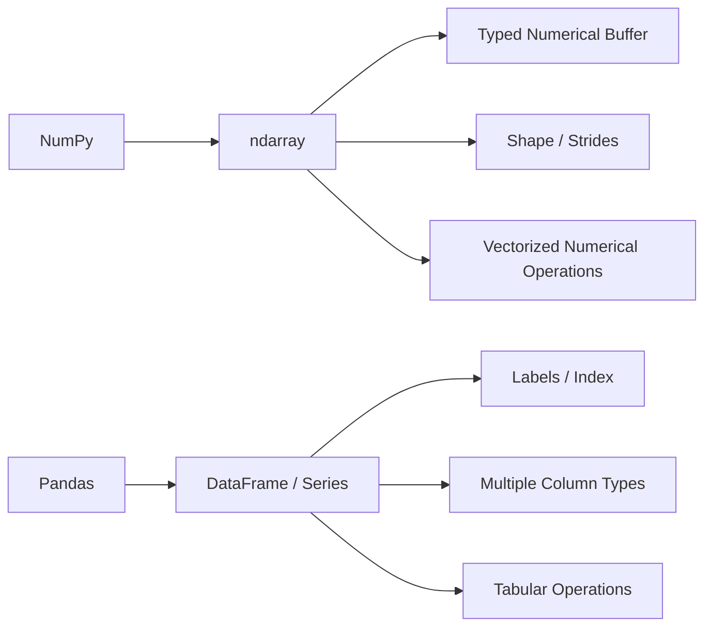
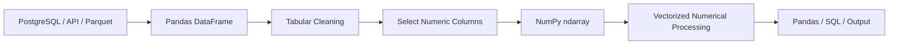
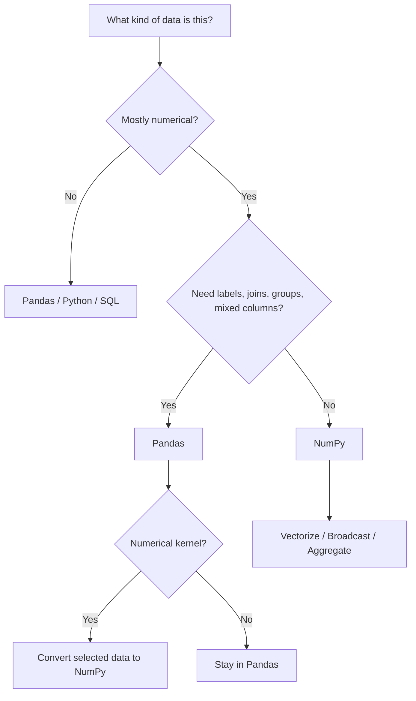

# 14- NumPy vs Pandas

## Overview

NumPy and Pandas are complementary tools rather than direct replacements for each other.

NumPy provides a low-level numerical array model:

```text
ndarray
+
dtype
+
shape
+
strides
+
vectorized operations
```

Pandas provides a higher-level tabular model:

```text
Series
+
DataFrame
+
labels
+
heterogeneous columns
+
index-aware operations
```

The practical backend/data-engineering question is:

```text
Which representation best matches this stage of the data pipeline?
```

A mature system may use both:

```text
PostgreSQL / API / Parquet
        ↓
Pandas DataFrame
        ↓
select numerical data
        ↓
NumPy ndarray
        ↓
vectorized numerical processing
        ↓
Pandas / PostgreSQL / API / storage
```

The important interview topics are:

- data-model differences
- labels and indexing
- homogeneous vs heterogeneous data
- vectorization
- memory behavior
- dtype handling
- missing values
- grouping and aggregation
- joins
- conversion costs
- when to push work into SQL
- when NumPy is more appropriate than Pandas

## Core Data Models

### NumPy

A NumPy `ndarray` is primarily a numerical structure.

```python
import numpy as np

values = np.array(
    [10.0, 20.0, 30.0],
    dtype=np.float64,
)
```

Its core properties include:

```text
data buffer
+
dtype
+
shape
+
strides
```

This model is designed for dense homogeneous data and vectorized computation.

### Pandas

Pandas provides higher-level containers:

```python
import pandas as pd

frame = pd.DataFrame(
    {
        "customer_id": [101, 102, 103],
        "amount": [100.0, 250.0, 175.0],
        "status": ["paid", "pending", "paid"],
    }
)
```

The DataFrame represents labeled tabular data where different columns can have different logical dtypes.

This makes it more appropriate for typical ETL and business-data workflows.

## Architectural Difference



NumPy emphasizes:

```text
numerical representation + computation
```

Pandas emphasizes:

```text
tabular representation + data manipulation
```

## Comparison Table

| Concern | NumPy | Pandas |
|---|---|---|
| Core structure | `ndarray` | `DataFrame`, `Series` |
| Primary focus | Numerical arrays | Tabular data |
| Labels | No built-in labels | Yes |
| Columns | Same dtype for normal array | Columns can have different dtypes |
| Missing-data semantics | Numerical handling such as `NaN` | Richer tabular / nullable semantics |
| Joins | Not a primary abstraction | Strong support |
| Grouping | Basic numerical reductions | Rich grouped operations |
| Broadcasting | Native | Supported through underlying array operations |
| Numerical vectorization | Excellent | Strong, often delegated to array operations |
| Memory model | Dense typed buffers | Higher-level column-oriented structures |
| CSV / Parquet ETL | Possible | Common use case |
| Relational workflows | Limited | Stronger |
| Large dense numerical kernels | Excellent | Often delegate to NumPy-like operations |
| Index / label semantics | Minimal | Central |
| General business tables | Usually not ideal | Usually appropriate |

## When to Prefer NumPy

NumPy is often the better choice when:

- data is predominantly numerical
- homogeneous arrays are sufficient
- vectorized arithmetic dominates
- broadcasting is useful
- axis-aware numerical reductions are required
- memory layout matters
- the numerical stage is performance-sensitive
- the data is already in an array representation

Example:

```python
import numpy as np

prices = np.asarray(
    [[100.0, 200.0], [150.0, 250.0]],
    dtype=np.float64,
)

rates = np.array(
    [1.18, 1.12],
    dtype=np.float64,
)

adjusted = prices * rates
```

This is naturally expressed as an `ndarray` operation.

## When to Prefer Pandas

Pandas is often the better choice when:

- data is tabular
- columns represent different logical fields
- labels matter
- joins are common
- grouping by keys is central
- CSV or Parquet data is being transformed
- datetime, string, or categorical columns are involved
- missing-data semantics are column-specific

Example:

```python
import pandas as pd

orders = pd.DataFrame(
    {
        "customer_id": [101, 101, 102],
        "amount": [100.0, 150.0, 200.0],
        "status": ["paid", "paid", "pending"],
    }
)

paid = orders[orders["status"] == "paid"]

totals = (
    paid.groupby("customer_id", as_index=False)["amount"]
    .sum()
)
```

The operation is fundamentally tabular rather than simply numerical.

## NumPy's Array Model vs Pandas' Tabular Model

A useful distinction is:

```text
NumPy asks:
"How should these numerical elements be represented and computed?"

Pandas asks:
"How should these labeled rows and columns be manipulated?"
```

For example:

```text
[price, quantity, discount]
```

as a dense numerical matrix may fit NumPy.

But:

```text
order_id
customer_id
created_at
status
currency
amount
```

is naturally a DataFrame because the columns have different meanings and often different dtypes.

## Homogeneous vs Heterogeneous Data

Normal NumPy numerical arrays are homogeneous:

```python
values = np.array(
    [10, 20, 30],
    dtype=np.int32,
)
```

A DataFrame can hold:

```text
int column
float column
string column
datetime column
boolean column
```

in the same table.

For example:

```python
frame = pd.DataFrame(
    {
        "id": pd.Series([101, 102], dtype="int64"),
        "amount": pd.Series([100.0, 200.0], dtype="float64"),
        "status": ["paid", "pending"],
    }
)
```

This makes Pandas much more natural for business tables.

## Indexing

NumPy uses positional and multidimensional indexing:

```python
matrix[2, 1]
matrix[:, 0]
matrix[1:5, 2:4]
```

Pandas introduces labels:

```python
frame["amount"]
frame.loc[frame["status"] == "paid"]
```

The distinction matters because:

```text
NumPy
→ primarily positional numerical access

Pandas
→ positional + label-aware tabular access
```

The additional semantics in Pandas are useful for business data but can also add abstraction and overhead compared with direct array operations.

## Boolean Filtering

NumPy:

```python
values = np.array(
    [10.0, 25.0, 5.0, 40.0],
)

filtered = values[values >= 20]
```

Pandas:

```python
frame = pd.DataFrame(
    {
        "amount": [10.0, 25.0, 5.0, 40.0],
        "status": ["a", "b", "a", "b"],
    }
)

filtered = frame[frame["amount"] >= 20]
```

Both use Boolean conditions, but Pandas retains the tabular structure and associated column labels.

Use NumPy when the result is fundamentally numerical.

Use Pandas when the filter is part of a broader table transformation.

## Broadcasting

Broadcasting is a core NumPy concept:

```python
values = np.array(
    [
        [10.0, 20.0, 30.0],
        [40.0, 50.0, 60.0],
    ]
)

offset = np.array(
    [1.0, 2.0, 3.0],
)

result = values + offset
```

The same kind of numerical operations may occur inside Pandas:

```python
frame["adjusted"] = frame["amount"] * 1.18
```

Pandas often uses underlying array operations to perform such column-wise transformations.

The distinction is that Pandas adds:

```text
labels
+
column semantics
+
tabular metadata
```

around the numerical computation.

## Vectorization

Both ecosystems encourage vectorized operations.

NumPy:

```python
result = values * 1.18
```

Pandas:

```python
frame["adjusted"] = frame["amount"] * 1.18
```

In both cases, avoiding unnecessary Python-level per-row loops is generally preferable for large numerical transformations.

However, Pandas operations can involve more metadata and alignment semantics than direct NumPy operations.

When performance is critical, inspect the actual representation and benchmark the complete operation.

## Row-Wise Python Loops

A common anti-pattern in Pandas is:

```python
for _, row in frame.iterrows():
    ...
```

when the logic can be expressed as vectorized column operations.

Likewise, NumPy should not be used to turn arbitrary business logic into awkward array expressions.

The general principle is:

```text
vectorize naturally numerical work
+
keep irregular business logic explicit
```

## Aggregation

NumPy:

```python
values = np.array(
    [10.0, 20.0, 30.0],
)

total = values.sum()
mean = values.mean()
```

Pandas:

```python
frame["amount"].sum()
frame["amount"].mean()
```

For one dense numerical vector, NumPy is a natural abstraction.

For grouped tabular aggregation:

```python
totals = (
    frame.groupby("customer_id")["amount"]
    .sum()
)
```

Pandas is more appropriate because the grouping key and labels are part of the operation.

## Grouping

Grouping is a major distinction.

NumPy can reduce axes:

```python
values.sum(axis=1)
```

but it does not provide a first-class DataFrame-like `groupby` abstraction.

Pandas can:

```python
frame.groupby("customer_id")["amount"].sum()
```

This is a core data-engineering workflow:

```text
group by business key
→ aggregate
→ preserve labels
```

Trying to reproduce this manually in NumPy often adds complexity without creating a meaningful advantage.

## Joins and Relational Operations

Pandas is designed for tabular joins:

```python
customers = pd.DataFrame(
    {
        "customer_id": [101, 102],
        "name": ["A", "B"],
    }
)

orders = pd.DataFrame(
    {
        "customer_id": [101, 102],
        "amount": [100.0, 200.0],
    }
)

result = orders.merge(
    customers,
    on="customer_id",
    how="inner",
)
```

NumPy has lower-level array-combination operations such as:

```python
np.concatenate(...)
np.stack(...)
```

but these are not equivalents of relational joins.

For database-style operations:

```text
Pandas
→ natural

NumPy
→ usually the wrong abstraction
```

## Missing Data

NumPy commonly represents missing floating-point values using `NaN`:

```python
values = np.array(
    [10.0, np.nan, 30.0],
)

average = np.nanmean(values)
```

Pandas has broader missing-data semantics across tabular columns:

```python
frame = pd.DataFrame(
    {
        "amount": [10.0, None, 30.0],
        "quantity": [1, 2, None],
    }
)
```

Pandas can preserve column-level nullable semantics that are difficult to represent uniformly in a single NumPy numerical dtype.

This is one reason Pandas is usually more appropriate for mixed business tables.

## Datetimes

Datetime-heavy tabular workflows are generally more natural in Pandas:

```python
frame["created_at"] = pd.to_datetime(
    frame["created_at"],
    utc=True,
)
```

NumPy also has datetime types, but Pandas provides richer tabular time-series workflows.

Do not choose NumPy just because dates eventually become arrays somewhere inside the implementation.

## Strings and Categorical Data

Pandas is generally more appropriate for:

```text
strings
categories
labels
business dimensions
```

For example:

```python
frame["status"] = frame["status"].astype("category")
```

NumPy is primarily useful when the data has become a dense numerical representation suitable for array computation.

An `object`-dtype NumPy array should not be treated as an equivalent replacement for a well-structured DataFrame.

## Dtype Behavior

NumPy makes dtype a central concern:

```python
values = np.array(
    [1, 2, 3],
    dtype=np.int32,
)
```

Pandas adds higher-level column dtype management and supports extension dtypes for some nullable and specialized data.

The practical question is:

```text
What representation is required by this stage?
```

If numerical memory efficiency is critical:

```text
NumPy dtype
```

may need deliberate optimization.

For a mixed business table:

```text
Pandas column dtypes
```

are usually more meaningful.

## Memory Behavior

NumPy exposes direct memory-related properties:

```python
values.nbytes
values.itemsize
values.strides
values.flags
```

This makes memory layout highly visible.

Pandas operates at a higher abstraction level.

A DataFrame can involve:

```text
multiple column arrays
+
index
+
metadata
+
extension arrays
```

Therefore, comparing:

```text
DataFrame.memory_usage()
```

with:

```text
ndarray.nbytes
```

requires care because they describe different layers of memory consumption.

Neither number represents complete Python process RSS.

## Conversion Between Pandas and NumPy

A common boundary is:

```python
numeric = frame[
    ["amount", "quantity"]
].to_numpy()
```

This can be useful when entering a numerical stage.

The reverse is also straightforward:

```python
frame = pd.DataFrame(
    numeric,
    columns=["amount", "quantity"],
)
```

But conversion is not necessarily free.

Potential costs include:

```text
copying
+
dtype conversion
+
allocation
+
loss of labels
```

Minimize repeated representation changes.

## A Good Hybrid Pattern

A mature data pipeline may look like:



For example:

```python
numeric = frame[
    ["price", "quantity"]
].to_numpy(dtype=np.float64)

line_total = (
    numeric[:, 0]
    * numeric[:, 1]
)
```

Then the result can be attached back to the DataFrame:

```python
frame["line_total"] = line_total
```

This makes each representation serve a clear purpose.

## Backend Data Pipeline Example

Consider an order analytics service:

```text
PostgreSQL
    ↓
DataFrame
    ↓
filter business rows
    ↓
select numerical columns
    ↓
NumPy transformation
    ↓
aggregate
    ↓
persist metrics
```

The tabular stage might perform:

```python
orders = orders[
    orders["status"] == "completed"
]
```

The numerical stage:

```python
values = orders[
    ["quantity", "unit_price"]
].to_numpy(dtype=np.float64)

revenue = values[:, 0] * values[:, 1]
```

The aggregation stage:

```python
total_revenue = float(revenue.sum())
```

This is a useful separation of concerns:

```text
Pandas
→ table semantics

NumPy
→ numerical semantics
```

## When SQL Is Better Than Both

Not every data-processing problem belongs in Python.

Suppose the requirement is:

```text
total revenue by customer
for completed orders
```

A database query may be more efficient:

```sql
SELECT
    customer_id,
    SUM(quantity * unit_price) AS revenue
FROM orders
WHERE status = 'completed'
GROUP BY customer_id;
```

Advantages can include:

```text
less data transfer
+
less Python memory
+
database query optimization
+
index / storage engine capabilities
```

The engineering goal is not:

```text
use NumPy
```

or:

```text
use Pandas
```

It is:

```text
execute each stage where its data model and execution engine are strongest
```

## NumPy vs Pandas vs PostgreSQL

| Workload | Usually Prefer |
|---|---|
| Dense numerical transformation | NumPy |
| Large numerical vector operations | NumPy |
| Broadcasting | NumPy |
| Labeled tabular cleaning | Pandas |
| Grouping by business key | Pandas / PostgreSQL |
| Joins | Pandas / PostgreSQL |
| Relational filtering | PostgreSQL |
| Database aggregation | PostgreSQL |
| REST payload validation | Python models |
| Numerical processing after extraction | NumPy |
| CSV / Parquet tabular ETL | Pandas |
| Very large distributed data | Database / Spark-like systems, depending on architecture |

The table is a decision aid, not an absolute rule.

## Performance Comparison

A simple benchmark:

```python
import time
import numpy as np
import pandas as pd

size = 1_000_000

values = np.arange(
    size,
    dtype=np.float64,
)

frame = pd.DataFrame(
    {
        "value": values,
    }
)

start = time.perf_counter()

numpy_result = values * 1.18

numpy_elapsed = (
    time.perf_counter() - start
)

start = time.perf_counter()

pandas_result = frame["value"] * 1.18

pandas_elapsed = (
    time.perf_counter() - start
)

print("NumPy:", numpy_elapsed)
print("Pandas:", pandas_elapsed)
```

This demonstrates that both can express vectorized numerical operations.

It does **not** establish that one is universally faster.

A meaningful benchmark should include the actual workload:

```text
DataFrame creation
+
conversion
+
filtering
+
grouping
+
NumPy processing
+
serialization
```

when those stages are part of production.

## Conversion Overhead

Consider:

```python
numeric = frame["amount"].to_numpy()
result = numeric * 1.18
```

If the pipeline repeatedly performs:

```text
DataFrame
→ ndarray
→ DataFrame
→ ndarray
→ DataFrame
```

conversion and allocation can become significant.

A better architecture is usually:

```text
Pandas stage
→ one numerical boundary
→ NumPy stage
→ return to Pandas only if necessary
```

This minimizes representation churn.

## Performance and Memory Trade-Offs

NumPy generally exposes lower-level control over:

```text
dtype
+
contiguity
+
views
+
copies
+
strides
+
buffer reuse
```

Pandas offers higher-level productivity and tabular semantics.

The trade-off is:

| Goal | Better Fit |
|---|---|
| Lowest-level numerical control | NumPy |
| Labeled table manipulation | Pandas |
| Rich grouped transformations | Pandas |
| Dense numerical memory efficiency | NumPy |
| Fast numerical kernels | NumPy |
| Mixed column types | Pandas |
| Complex joins | Pandas / SQL |
| Explicit memory layout | NumPy |

## Batch Processing

For data larger than available memory:

```text
source
→ Pandas batch
→ numerical extraction
→ NumPy processing
→ output
→ next batch
```

Do not assume that moving the entire dataset into either tool is always appropriate.

An ETL worker might:

```python
for frame in read_batches():
    values = frame[
        ["quantity", "price"]
    ].to_numpy(
        dtype=np.float64,
    )

    revenue = (
        values[:, 0]
        * values[:, 1]
    )

    write_results(revenue)
```

This combines:

```text
Pandas
→ batch/tabular handling

NumPy
→ dense numerical computation
```

The outer loop remains in Python because batch orchestration is application control flow.

## Large Dataset Considerations

For very large data:

```text
NumPy
```

does not magically make the dataset fit in memory.

Likewise:

```text
Pandas DataFrame
```

can become memory-intensive when loading large tables.

Use:

- batch reads
- partitioned Parquet
- database-side filtering
- memory mapping where appropriate
- incremental aggregation
- streaming pipelines
- bounded worker concurrency

The data access architecture often matters more than the choice between NumPy and Pandas.

## API and Service Boundaries

A FastAPI service might use:

```text
Pydantic
→ request validation

Pandas
→ tabular transformation if required

NumPy
→ numerical processing

Pydantic / JSON
→ response serialization
```

Do not make NumPy the API contract.

For example:

```python
def calculate_total(raw_values: list[float]) -> float:
    values = np.asarray(
        raw_values,
        dtype=np.float64,
    )

    if values.size > 100_000:
        raise ValueError("Batch too large.")

    if not np.isfinite(values).all():
        raise ValueError("Values must be finite.")

    return float(values.sum())
```

The API receives ordinary Python data and converts only at the numerical boundary.

## Pandas and SQL Boundaries

A common production mistake is loading an entire SQL result into Pandas or NumPy before applying obvious relational filters.

Prefer:

```sql
SELECT amount, quantity
FROM orders
WHERE status = 'completed';
```

over:

```text
SELECT *
→ Python
→ discard unnecessary rows and columns
```

when the SQL operation can safely reduce the dataset.

A mature pipeline uses:

```text
PostgreSQL
→ reduce relational data

Pandas
→ transform labeled tabular data

NumPy
→ compute dense numerical transformations
```

## Common Mistakes

### Treating NumPy and Pandas as Competitors

They solve different layers of the data-processing problem.

### Using Pandas for Pure Array Arithmetic

If the data is already a dense numerical array and labels are irrelevant, NumPy may be the clearer abstraction.

### Using NumPy for Joins

Joins are fundamentally tabular or relational operations.

Use Pandas or PostgreSQL.

### Converting Between Representations Repeatedly

Repeated:

```text
DataFrame
↔ ndarray
```

transitions can introduce copying and memory overhead.

### Ignoring Pandas Alignment

Pandas operations can align data by labels/index.

NumPy operations generally operate positionally according to shape.

Moving between them without understanding this distinction can create incorrect results.

### Dropping Labels Too Early

Converting a DataFrame into NumPy removes the DataFrame's label-oriented abstraction.

If business logic depends on column identity, preserve the DataFrame until the numerical boundary is reached.

### Assuming NumPy Is Always Faster

Pandas operations may be perfectly appropriate and can already rely on efficient array-level execution.

Benchmark the actual operation.

### Loading Everything Into Memory

Neither library should be used as an excuse to ignore dataset size.

Use bounded processing and upstream filtering.

## Alignment Semantics

One important conceptual difference is:

```text
NumPy
→ shape-based alignment

Pandas
→ label-aware alignment in many operations
```

Consider:

```python
import pandas as pd

left = pd.Series(
    [10, 20],
    index=["a", "b"],
)

right = pd.Series(
    [100, 200],
    index=["b", "a"],
)

result = left + right
```

Pandas can align the values according to labels.

NumPy arrays have no equivalent label semantics:

```python
left = np.array([10, 20])
right = np.array([100, 200])

result = left + right
```

This is positional.

When converting from Pandas to NumPy, ensure the row and column ordering is intentional before relying on positional operations.

## Memory Ownership and Conversion

When calling:

```python
values = frame[
    ["amount", "quantity"]
].to_numpy()
```

do not assume the result always behaves like a view over one contiguous DataFrame buffer.

DataFrame columns can have different underlying representations.

When memory behavior matters:

```python
values = frame[
    ["amount", "quantity"]
].to_numpy(
    dtype=np.float64,
)
```

and inspect:

```python
print(values.dtype)
print(values.flags.c_contiguous)
```

Measure actual memory behavior rather than relying on assumptions about internal storage.

## NumPy and Pandas in Testing

Test each abstraction at the level where it matters.

For numerical transformations:

```python
np.testing.assert_allclose(
    actual,
    expected,
)
```

For DataFrame semantics:

```python
pd.testing.assert_frame_equal(
    actual_frame,
    expected_frame,
)
```

This keeps:

```text
numerical correctness
```

separate from:

```text
tabular / label correctness
```

Both are important when a pipeline uses the two libraries together.

## Security and Reliability

When user-controlled data crosses into NumPy or Pandas:

```text
request size
+
row count
+
column count
+
dtype
+
broadcast dimensions
+
batch size
```

should be bounded.

Potential failure modes include:

```text
large DataFrame
→ memory pressure

large ndarray
→ memory pressure

broadcast
→ huge temporary output

conversion
→ duplicate buffers

worker concurrency
→ multiplied memory usage
```

For containerized services, control:

```text
batch size
+
worker concurrency
+
memory limits
```

and monitor process RSS.

## Interview Questions

### What is the main difference between NumPy and Pandas?

NumPy focuses on dense numerical arrays and efficient numerical computation.

Pandas focuses on labeled, tabular data manipulation.

### Why would you use NumPy instead of Pandas?

When the data is already dense numerical data and the workload is primarily vectorized numerical computation where labels and tabular abstractions are unnecessary.

### Why would you use Pandas instead of NumPy?

When the workload involves labels, heterogeneous columns, joins, grouped tabular operations, missing-data semantics, or common ETL workflows.

### Does Pandas use NumPy?

Pandas has historically relied heavily on NumPy and continues to use NumPy-compatible arrays in many numerical paths, while modern Pandas also supports other array and extension-dtype implementations.

The important engineering point is that Pandas provides a higher-level abstraction rather than being simply a DataFrame wrapper around one NumPy matrix.

### Is Pandas always slower than NumPy?

Not meaningfully as a blanket rule.

The abstraction and operation differ. Benchmark the actual workload and include conversion and surrounding processing where relevant.

### What happens when a Pandas DataFrame is converted to NumPy?

The result becomes an array-oriented representation and may involve dtype harmonization or copying depending on the selected data and representation.

### Why can NumPy operations be faster?

Dense typed storage and native vectorized operations can reduce Python-level overhead and improve memory efficiency for suitable numerical workloads.

### Why is Pandas better for joins?

Because labeled relational operations are part of its core abstraction, while NumPy is primarily an array computation library.

### Where should aggregation happen: PostgreSQL, Pandas, or NumPy?

Where it best matches the operation.

Use PostgreSQL for relational aggregation that can reduce transferred data, Pandas for labeled/grouped tabular aggregation, and NumPy for dense numerical aggregation.

## Scenario-Based Interview Questions

### Scenario: DataFrame to NumPy Made the Pipeline Slower

Investigate:

```text
selection
+
dtype conversion
+
copy allocation
+
NumPy operation
+
conversion back to DataFrame
```

The numerical calculation may not be the bottleneck.

### Scenario: A Pandas Pipeline Uses `iterrows()`

If the operation is fundamentally numerical:

```text
DataFrame
→ select numeric columns
→ NumPy
→ vectorized computation
```

may be more appropriate.

If the logic is highly irregular business processing, keeping explicit Python logic may be preferable.

### Scenario: PostgreSQL Can Perform the Aggregation

Prefer SQL when it reduces:

```text
rows
+
columns
+
network transfer
+
Python memory
```

Do not pull millions of rows into Pandas merely to calculate a simple `SUM()` that the database can perform efficiently.

### Scenario: Numerical Stage Needs Tight Memory Control

A practical design is:

```text
Pandas batch
→ NumPy array
→ explicit dtype
→ vectorized operation
→ persist result
→ release batch
```

This gives the numerical stage explicit control over dtype and memory layout while retaining Pandas for tabular preparation.

## Practical Decision Workflow



The decision should be based on the current processing stage, not on a permanent choice for the entire application.

## Production Architecture

A scalable data-processing service might use:

```text
                ┌──────────────────┐
                │ PostgreSQL / S3  │
                │ Kafka / API      │
                └────────┬─────────┘
                         │
                         ▼
                ┌──────────────────┐
                │ Input Reduction  │
                │ SQL / Partition  │
                └────────┬─────────┘
                         │
                         ▼
                ┌──────────────────┐
                │ Pandas Batch     │
                │ Tabular Stage    │
                └────────┬─────────┘
                         │
                         ▼
                ┌──────────────────┐
                │ NumPy Stage      │
                │ Numerical Work   │
                └────────┬─────────┘
                         │
                         ▼
                ┌──────────────────┐
                │ Aggregate / Save │
                └──────────────────┘
```

This architecture avoids making a single library responsible for every data-processing concern.

## Production Guidelines

For production data pipelines:

- Use NumPy for dense numerical computation where array semantics provide a real advantage.
- Use Pandas for labeled and heterogeneous tabular transformations.
- Use PostgreSQL for relational filtering and aggregation when pushdown reduces transferred data.
- Minimize repeated DataFrame-to-NumPy and NumPy-to-DataFrame conversions.
- Understand label-based Pandas alignment before relying on positional NumPy operations.
- Treat dtype and memory layout as explicit concerns in numerical stages.
- Use bounded batches when data volume exceeds safe memory limits.
- Benchmark complete pipeline stages instead of comparing isolated library calls.
- Preserve tabular labels until numerical conversion is actually useful.
- Validate array shapes and batch sizes before broadcast-heavy operations.
- Monitor process-level memory rather than relying only on `nbytes`.
- Keep application/domain models independent from numerical-library-specific representations unless the domain genuinely requires them.

## Key Takeaways

- NumPy and Pandas operate at different abstraction levels: NumPy focuses on dense numerical arrays, while Pandas focuses on labeled tabular data.
- Use Pandas for joins, grouping, heterogeneous columns, labels, and common ETL workflows; use NumPy for dense numerical transformations, broadcasting, and memory-aware numerical processing.
- A strong production pipeline often combines both libraries, converting to NumPy only at the numerical boundary and returning to Pandas or another representation only when tabular semantics are needed.
- PostgreSQL can often outperform both by filtering and aggregating relational data before it reaches Python, reducing network transfer and application memory.
- Choose the tool per pipeline stage and benchmark the complete workload, including conversion, memory, I/O, serialization, and concurrency.