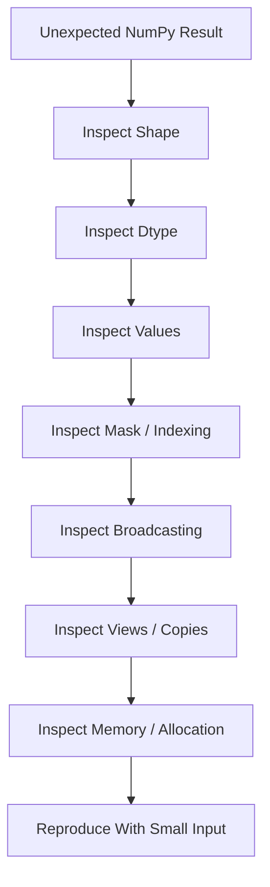
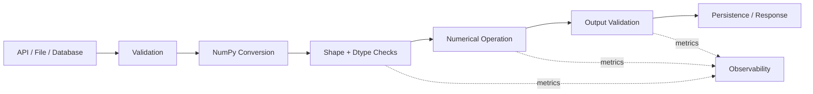

# 15- Debugging NumPy

## Overview

Debugging NumPy code requires understanding both Python behavior and NumPy's array model.

Many failures that look like ordinary Python bugs are actually caused by:

- unexpected shapes
- broadcasting rules
- dtype conversion
- integer overflow
- views versus copies
- non-contiguous memory
- implicit type promotion
- `NaN` or infinity propagation
- boolean mask shape mismatches
- accidental large allocations
- silent changes in array dimensions

For backend and data-processing systems, debugging should answer four questions quickly:

```text
What data entered the operation?
What shape and dtype does it have?
What operation did NumPy actually perform?
What memory and output size did that operation require?
```

A reliable debugging workflow therefore starts with array metadata before inspecting individual values.

## Debugging Model

A useful mental model is:

```text
Input
  ↓
dtype
  ↓
shape
  ↓
strides / layout
  ↓
operation
  ↓
broadcasting / indexing
  ↓
allocation
  ↓
output
```

When an operation produces an unexpected result, inspect each stage rather than immediately rewriting the calculation.



## First-Line Array Inspection

The most useful debugging attributes are:

```python
print("shape:", values.shape)
print("ndim:", values.ndim)
print("size:", values.size)
print("dtype:", values.dtype)
print("itemsize:", values.itemsize)
print("nbytes:", values.nbytes)
print("strides:", values.strides)
print("C contiguous:", values.flags.c_contiguous)
print("F contiguous:", values.flags.f_contiguous)
```

These properties answer different questions.

| Attribute | What it tells you |
|---|---|
| `shape` | Size of each dimension |
| `ndim` | Number of dimensions |
| `size` | Total number of elements |
| `dtype` | Element type and representation |
| `itemsize` | Bytes per element |
| `nbytes` | Bytes in the array data buffer |
| `strides` | Byte step used along each axis |
| `flags.c_contiguous` | Whether memory is C-contiguous |
| `flags.f_contiguous` | Whether memory is Fortran-contiguous |

A compact production-oriented helper can make this inspection repeatable:

```python
import numpy as np


def describe_array(name: str, values: np.ndarray) -> None:
    print(
        f"{name}: "
        f"shape={values.shape}, "
        f"dtype={values.dtype}, "
        f"size={values.size}, "
        f"nbytes={values.nbytes}, "
        f"strides={values.strides}, "
        f"C={values.flags.c_contiguous}, "
        f"F={values.flags.f_contiguous}"
    )
```

This is particularly useful while debugging ETL workers and batch-processing jobs.

## Inspect Values Without Dumping Entire Arrays

Printing a large array is usually a poor debugging strategy.

Use representative slices:

```python
print(values[:5])
print(values[-5:])
```

For multidimensional data:

```python
print(values[:3, :5])
```

For summary statistics:

```python
print("min:", np.nanmin(values))
print("max:", np.nanmax(values))
print("mean:", np.nanmean(values))
print("finite:", np.isfinite(values).all())
```

This reduces log volume and avoids accidentally emitting sensitive or extremely large datasets.

## Shape Errors

Shape errors are among the most common NumPy failures.

Consider:

```python
prices = np.array([10.0, 20.0, 30.0])
quantities = np.array([[2.0], [3.0], [4.0]])

result = prices * quantities
```

The shapes are:

```text
prices      → (3,)
quantities  → (3, 1)
result      → (3, 3)
```

This may be mathematically valid according to broadcasting but logically incorrect for the application.

A backend engineer should distinguish:

```text
valid NumPy operation
```

from:

```text
valid business operation
```

The absence of an exception does not mean the shape is correct.

## Debugging Shape Assumptions

Validate shapes at function boundaries.

```python
import numpy as np


def calculate_revenue(
    prices: np.ndarray,
    quantities: np.ndarray,
) -> np.ndarray:
    if prices.ndim != 1:
        raise ValueError(
            f"prices must be 1-D, got {prices.shape}"
        )

    if quantities.shape != prices.shape:
        raise ValueError(
            "prices and quantities must have the same shape: "
            f"{prices.shape} != {quantities.shape}"
        )

    return prices * quantities
```

This is safer than relying on NumPy to infer the intended relationship through broadcasting.

## Broadcasting Debugging

When broadcasting causes unexpected results, explicitly inspect the shapes.

```python
a = np.empty((50_000, 1))
b = np.empty((1, 50_000))

print(a.shape)
print(b.shape)

broadcast_shape = np.broadcast_shapes(
    a.shape,
    b.shape,
)

print("result shape:", broadcast_shape)
```

The resulting shape is:

```text
(50_000, 50_000)
```

For `float64`, that output alone is approximately 20 GB.

The critical debugging question is therefore not:

```text
"Why did NumPy allow this?"
```

but:

```text
"Was this output shape intentional?"
```

## Debugging Broadcasted Operations

A defensive helper can validate the intended output shape:

```python
def require_broadcast_size(
    left: np.ndarray,
    right: np.ndarray,
    max_elements: int,
) -> None:
    shape = np.broadcast_shapes(
        left.shape,
        right.shape,
    )

    size = int(np.prod(shape))

    if size > max_elements:
        raise ValueError(
            f"Broadcast result too large: "
            f"shape={shape}, elements={size}"
        )
```

This is useful when shapes can be influenced by API payloads, uploaded files, or user-generated data.

## Indexing and Slicing Bugs

Different indexing mechanisms have different memory and behavior characteristics.

Basic slicing:

```python
view = values[10:20]
```

often produces a view.

Fancy indexing:

```python
selected = values[[10, 12, 17]]
```

generally creates a new array.

Boolean indexing:

```python
selected = values[values > 100]
```

generally creates a new array.

When debugging mutations, determine whether you are holding a view or a copy.

```python
subset = values[10:20]

subset[:] = 0
```

The source array may also change because `subset` can share memory with `values`.

## Debugging Views and Copies

Do not rely solely on `.base`.

Use explicit memory checks when the relationship matters:

```python
shares = np.shares_memory(
    values,
    subset,
)

print("shares memory:", shares)
```

For a conservative check:

```python
may_share = np.may_share_memory(
    values,
    subset,
)

print("may share memory:", may_share)
```

A useful debugging pattern is:

```python
subset = values[10:20]

print("shares memory:", np.shares_memory(values, subset))
print("subset writeable:", subset.flags.writeable)
```

This makes mutation behavior easier to reason about.

## Copy-Related Production Bug

A common failure pattern is:

```python
def sanitize(values: np.ndarray) -> np.ndarray:
    values[values < 0] = 0
    return values
```

If callers expect the input to remain unchanged, this function is unsafe because it may mutate shared data.

Use an explicit copy when isolation is required:

```python
def sanitize(values: np.ndarray) -> np.ndarray:
    cleaned = values.copy()
    cleaned[cleaned < 0] = 0
    return cleaned
```

The trade-off is an additional allocation.

The correct choice depends on the ownership contract.

## Dtype Bugs

Always inspect dtype when numerical results are surprising.

```python
values = np.array(
    [1, 2, 3],
    dtype=np.int8,
)

print(values.dtype)
```

A small integer dtype can overflow:

```python
values = np.array(
    [120, 120],
    dtype=np.int8,
)

print(values.sum())
```

Do not assume that a numerically valid mathematical result fits into the array's dtype.

For important aggregates, choose an appropriate accumulator dtype:

```python
total = values.sum(dtype=np.int64)
```

## Integer Overflow

Integer overflow can be especially dangerous because it may produce an apparently valid integer rather than raising a Python exception.

Example:

```python
values = np.array(
    [2_000_000_000, 2_000_000_000],
    dtype=np.int32,
)

total = values.sum(dtype=np.int64)
```

For production data pipelines, validate:

```text
input range
+
dtype
+
maximum aggregate
```

rather than selecting the smallest dtype solely to reduce memory.

## Floating-Point Debugging

Floating-point comparisons can fail because decimal values generally cannot be represented exactly in binary floating-point.

Avoid:

```python
if actual == expected:
    ...
```

for many numerical comparisons.

Use tolerances:

```python
np.testing.assert_allclose(
    actual,
    expected,
    rtol=1e-6,
    atol=1e-8,
)
```

The tolerance should reflect the application's numerical requirements rather than being chosen arbitrarily.

## NaN and Infinity

Unexpected `NaN` values can propagate through calculations:

```python
values = np.array(
    [100.0, np.nan, 200.0],
)

result = values * 2
```

The `NaN` remains present.

Use:

```python
print(np.isnan(values))
print(np.isinf(values))
print(np.isfinite(values))
```

For a complete validity check:

```python
if not np.isfinite(values).all():
    raise ValueError("Input contains NaN or infinity.")
```

When aggregation should ignore missing floating-point values:

```python
mean = np.nanmean(values)
```

Do not automatically replace `NaN` with zero.

Whether missing means zero is a business rule, not a numerical default.

## Debugging Masks

Boolean masks should be inspected independently.

```python
mask = values >= 100

print("mask dtype:", mask.dtype)
print("mask shape:", mask.shape)
print("selected:", np.count_nonzero(mask))
```

Then inspect the selected data:

```python
selected = values[mask]

print(selected[:10])
```

This helps determine whether the problem is:

```text
incorrect condition
+
incorrect shape
+
unexpected NaN
+
unexpected dtype
```

## Mask Shape Errors

For an array:

```python
values.shape == (100, 3)
```

a mask intended to select rows should have:

```text
(100,)
```

rather than:

```text
(100, 3)
```

depending on the operation.

Make the intended axis explicit:

```python
row_mask = values[:, 0] >= 100

selected_rows = values[row_mask]
```

This is often clearer than constructing a two-dimensional condition when the business rule is row-based.

## Operator Precedence in Masks

This is incorrect:

```python
mask = values > 100 & values < 500
```

Use parentheses:

```python
mask = (
    (values > 100)
    & (values < 500)
)
```

NumPy uses:

```text
&
|
~
```

for element-wise logical operations.

Python's:

```text
and
or
not
```

are not the correct operators for array-wise conditions.

## Ambiguous Truth Values

This can fail:

```python
if values:
    ...
```

A NumPy array with multiple elements does not have a single obvious truth value.

Use an explicit reduction:

```python
if values.size == 0:
    ...
```

or:

```python
if np.any(values > 100):
    ...
```

or:

```python
if np.all(values >= 0):
    ...
```

The correct reduction expresses the business intent.

## Debugging `where`

`np.where()` can be useful:

```python
cleaned = np.where(
    values < 0,
    0,
    values,
)
```

But it should not be treated as a general lazy branch.

For operations that may be unsafe even when the result is not selected, prefer masked computation:

```python
result = np.zeros_like(values, dtype=np.float64)

np.divide(
    numerator,
    denominator,
    out=result,
    where=denominator != 0,
)
```

This controls where the division is performed.

## Reshape Debugging

Reshape errors should start with element counts.

```python
values = np.arange(24)

print(values.size)

matrix = values.reshape(6, 4)
```

A reshape can only produce a shape containing the same number of elements.

```python
values.reshape(5, 5)
```

fails because:

```text
24 != 25
```

For dynamic pipelines, log or validate:

```python
expected_size = rows * columns

if values.size != expected_size:
    raise ValueError(
        f"Expected {expected_size} elements, "
        f"got {values.size}"
    )
```

## Flatten and Ravel Debugging

If a mutation unexpectedly affects the original array, inspect whether the operation returned a view or copy.

```python
flattened = values.flatten()
raveled = values.ravel()

print(
    "flatten shares memory:",
    np.shares_memory(values, flattened),
)

print(
    "ravel shares memory:",
    np.shares_memory(values, raveled),
)
```

The common expectation is:

```text
flatten → copy
ravel   → view when possible
```

For correctness, use the operation whose ownership semantics match the requirement rather than assuming one-dimensional output implies independent storage.

## Transpose and Memory Layout

A transpose often changes strides without copying the underlying data.

```python
matrix = np.arange(12).reshape(3, 4)
transposed = matrix.T

print(matrix.strides)
print(transposed.strides)
print(transposed.flags.c_contiguous)
```

The transposed array may be non-contiguous.

This matters when:

- passing arrays into native libraries
- repeatedly scanning data
- serializing large buffers
- performing performance-sensitive operations

Do not interpret:

```text
same data
```

as:

```text
same memory access performance
```

## Contiguity Debugging

Inspect:

```python
print(values.flags.c_contiguous)
print(values.flags.f_contiguous)
```

If a downstream API requires or benefits from contiguous storage:

```python
contiguous = np.ascontiguousarray(values)
```

The operation avoids copying if the input is already suitably contiguous.

For debugging, compare:

```python
print("before:", values.strides)
print("after:", contiguous.strides)
```

A one-time copy can be reasonable if it enables a hot loop to access memory efficiently.

## Unexpected Temporary Arrays

Expressions such as:

```python
result = (values * scale) + offset
```

can involve intermediate allocation.

The expression is concise and often perfectly appropriate, but when debugging memory pressure, identify:

```text
input allocation
+
intermediate allocation
+
output allocation
```

For example:

```python
scaled = values * scale
result = scaled + offset
```

makes the intermediate explicit but does not reduce allocation.

When allocation pressure is demonstrated by profiling, specialized `out=` patterns or buffer reuse may be appropriate:

```python
result = np.empty_like(values)

np.multiply(
    values,
    scale,
    out=result,
)

np.add(
    result,
    offset,
    out=result,
)
```

Do not introduce this complexity without a measured reason.

## Debugging Large Allocations

Before allocating a potentially large array, inspect the intended shape and dtype.

```python
shape = (50_000, 50_000)
dtype = np.dtype(np.float64)

elements = int(np.prod(shape))
bytes_required = elements * dtype.itemsize

print("elements:", elements)
print("bytes:", bytes_required)
```

A helper can enforce a limit:

```python
def validate_allocation(
    shape: tuple[int, ...],
    dtype: np.dtype,
    max_bytes: int,
) -> None:
    elements = int(np.prod(shape))
    required = elements * dtype.itemsize

    if required > max_bytes:
        raise ValueError(
            f"Allocation would require "
            f"{required:,} bytes"
        )
```

This is important for API-driven workloads and multi-tenant workers.

## Debugging Memory-Mapped Arrays

With memory-mapped arrays:

```python
values = np.load(
    "metrics.npy",
    mmap_mode="r",
)
```

the array's data is backed by a file rather than necessarily being fully materialized in RAM immediately.

This can change debugging behavior because:

```text
logical size
```

and:

```text
resident memory
```

are not the same thing.

When diagnosing performance, consider:

```text
page faults
+
storage latency
+
access pattern
+
OS cache behavior
```

rather than looking only at `nbytes`.

## Debugging Input Data

Many numerical errors originate before the NumPy operation.

For data loaded from CSV, JSON, APIs, or databases, inspect:

```python
values = np.asarray(
    raw_values,
    dtype=np.float64,
)

if values.ndim != 1:
    raise ValueError(
        f"Expected one-dimensional input, got {values.shape}"
    )

if not np.isfinite(values).all():
    raise ValueError(
        "Input contains non-finite values."
    )
```

Explicit conversion makes assumptions visible.

Avoid allowing implicit object arrays to silently enter numerical processing.

## Detecting Object Dtype

An unexpected `object` dtype is a strong debugging signal:

```python
print(values.dtype)

if values.dtype == object:
    raise TypeError(
        "Object dtype is not allowed in numerical pipeline."
    )
```

Object arrays can contain arbitrary Python objects and often bypass the efficient homogeneous numerical representation expected by NumPy.

If the data should be numeric, convert or reject it explicitly.

## Reproducing Production Failures

Large production arrays are difficult to inspect directly.

Create a minimal reproducer:

```python
prices = np.array(
    [100.0, 200.0, 300.0],
)

quantities = np.array(
    [[1.0], [2.0], [3.0]],
)

result = prices * quantities

print("prices:", prices.shape)
print("quantities:", quantities.shape)
print("result:", result.shape)
```

A reduced reproduction should preserve the property causing the failure:

```text
same shape relationship
+
same dtype
+
same operation
```

but remove irrelevant data.

This dramatically improves debugging speed.

## Assertions at Processing Boundaries

Assertions are useful for development and tests:

```python
assert values.ndim == 2
assert values.shape[1] == 4
assert values.dtype == np.float64
```

For externally controlled or production-critical input, explicit exceptions are often preferable:

```python
if values.ndim != 2:
    raise ValueError(
        f"Expected 2-D input, got {values.ndim}-D"
    )
```

The distinction is important because Python assertions can be disabled with optimization settings.

## Logging Without Excessive Data Exposure

Never log entire production arrays by default.

Prefer:

```python
logger.info(
    "Processing numeric batch",
    extra={
        "shape": values.shape,
        "dtype": str(values.dtype),
        "size": values.size,
        "nbytes": values.nbytes,
        "finite": bool(np.isfinite(values).all()),
    },
)
```

This gives operational visibility without creating massive logs or unnecessarily exposing customer data.

## Debug Logging Strategy

Useful array diagnostics include:

| Diagnostic | Why it matters |
|---|---|
| Shape | Detect dimensionality errors |
| Dtype | Detect conversion and overflow problems |
| Size | Detect unexpected dataset scale |
| `nbytes` | Estimate data-buffer size |
| Strides | Detect layout changes |
| Contiguity | Diagnose performance issues |
| Finite check | Detect invalid numerical values |
| Min / max | Detect unexpected value ranges |
| Selected-count | Diagnose masks |
| Memory sharing | Diagnose mutation behavior |

Avoid permanently logging:

```text
full arrays
+
customer records
+
raw payloads
```

especially in API workers.

## Debugging in FastAPI or Django

For an API receiving numerical data:

```text
HTTP request
    ↓
request validation
    ↓
NumPy conversion
    ↓
shape/dtype validation
    ↓
numerical processing
    ↓
serialization
```

A useful boundary function is:

```python
import numpy as np


def prepare_values(raw_values: list[float]) -> np.ndarray:
    values = np.asarray(
        raw_values,
        dtype=np.float64,
    )

    if values.ndim != 1:
        raise ValueError("Expected a one-dimensional array.")

    if values.size > 100_000:
        raise ValueError("Input batch is too large.")

    if not np.isfinite(values).all():
        raise ValueError(
            "Values must be finite."
        )

    return values
```

This keeps numerical assumptions explicit and prevents malformed input from reaching expensive operations.

## Debugging in Celery Workers

Celery workers introduce an additional resource dimension:

```text
worker concurrency
×
per-task NumPy memory
```

If one task uses 500 MB and 8 workers execute simultaneously:

```text
8 × 500 MB = 4 GB
```

before considering process overhead and other allocations.

A NumPy memory bug can therefore become a worker-pool reliability issue.

When debugging worker OOM problems, inspect:

```text
batch size
+
dtype
+
temporary arrays
+
worker concurrency
+
container memory limit
```

## Debugging in Kubernetes

A Kubernetes OOMKilled event may not point directly to the NumPy line that caused the allocation.

Investigate:

```text
pod memory limit
+
worker concurrency
+
input batch size
+
array nbytes
+
temporary allocations
+
process RSS
```

For a numerical worker, a useful operational metric set is:

```text
batch_size
array_elements
array_nbytes
processing_latency
peak_process_memory
error_count
```

This allows memory growth to be correlated with workload size.

## Debugging Performance Regressions

A numerical result can be correct while the implementation becomes much slower.

Typical causes include:

- unintended copies
- non-contiguous access
- dtype conversion
- Python loops
- repeated concatenation
- large temporary arrays
- smaller or larger batch sizes
- different input shapes
- memory pressure
- disk-backed or memory-mapped access

Start by measuring.

```python
import time

start = time.perf_counter()

result = values * scale + offset

elapsed = time.perf_counter() - start

print(f"elapsed={elapsed:.6f}s")
```

For stable microbenchmarks, use `timeit`.

Do not optimize based on intuition alone.

## Debugging With `timeit`

A repeatable comparison:

```python
import timeit

elapsed = timeit.timeit(
    "values * 1.18",
    globals={"values": values},
    number=100,
)

print(elapsed)
```

Benchmark:

```text
same shape
+
same dtype
+
same memory layout
+
same environment
```

Otherwise the comparison may be misleading.

## Correctness vs Performance

Always separate two questions:

```text
Is the result correct?
```

and:

```text
Is the implementation efficient?
```

For correctness:

```python
np.testing.assert_allclose(
    actual,
    expected,
)
```

For performance:

```text
runtime
+
throughput
+
peak memory
+
allocation behavior
```

A faster incorrect operation is not an optimization.

## Debugging Numerical Drift

For calculations involving many floating-point operations, compare with an appropriate tolerance:

```python
np.testing.assert_allclose(
    actual,
    expected,
    rtol=1e-7,
    atol=1e-9,
)
```

When values have very different scales, absolute and relative tolerances can behave differently.

For production systems, the tolerance should be tied to the business requirement:

```text
currency reporting
→ stricter exactness policy

analytics
→ bounded numerical tolerance

telemetry
→ domain-specific tolerance
```

Do not use floating-point equality merely because the inputs look simple.

## Validation Against Python Results

For debugging a vectorized transformation, a small trusted Python implementation can be useful as a reference.

```python
expected = np.array(
    [
        value * 1.18
        for value in values
    ],
    dtype=np.float64,
)

actual = values * 1.18

np.testing.assert_allclose(
    actual,
    expected,
)
```

The Python implementation is not necessarily intended for production.

Its purpose is to establish a simple correctness oracle for tests and debugging.

## Differential Testing

For higher-confidence numerical code, compare two implementations:

```text
vectorized implementation
vs
reference implementation
```

across randomized inputs.

```python
import numpy as np

rng = np.random.default_rng(42)

values = rng.uniform(
    0,
    1_000,
    size=1_000,
)

expected = np.array(
    [x * 1.18 for x in values],
)

actual = values * 1.18

np.testing.assert_allclose(
    actual,
    expected,
)
```

This is especially useful when optimizing an established numerical pipeline.

## Common Debugging Pitfalls

### Looking Only at Values

A wrong shape can still produce plausible numbers.

Inspect metadata first.

### Assuming Broadcasting Is Always Intended

Broadcasting is a shape rule, not an indication of business correctness.

### Using `.base` as the Ownership Test

`.base` is useful diagnostically but does not provide a complete ownership contract.

Use memory-sharing checks when the distinction matters.

### Logging Whole Arrays

This can create enormous logs, leak data, and slow the application.

Log shape, dtype, size, memory, and representative statistics.

### Ignoring Dtype

An integer overflow or unexpected object array can completely change numerical behavior.

### Treating `NaN` as Zero

Missingness and zero are different business states.

### Measuring Only CPU Time

Memory allocation, cache behavior, I/O, and serialization can dominate end-to-end performance.

### Optimizing Before Reproducing

Without a minimal reproducible case, it is easy to optimize the wrong problem.

### Assuming `nbytes` Equals Process Memory

`nbytes` describes the array's data buffer, not the complete memory footprint of the Python process.

### Debugging Only in Development

Container memory limits, worker concurrency, production batch sizes, and real data distributions can expose failures absent in local development.

## Production Debugging Checklist

When a NumPy operation fails or produces suspicious output:

1. Inspect `shape`, `ndim`, and `size`.
2. Inspect `dtype` and `itemsize`.
3. Check for `NaN` and infinity when relevant.
4. Inspect the first and last few values.
5. Inspect mask shape and selected count.
6. Check broadcasting compatibility and intended result shape.
7. Determine whether views and copies are involved.
8. Inspect strides and contiguity for performance problems.
9. Estimate allocation size before reproducing large failures.
10. Reproduce the issue with the smallest input that preserves the failure.
11. Validate correctness independently from performance.
12. Benchmark the actual production-relevant workload.

## Interview Traps

### "The code runs, so the shape must be correct."

False.

Broadcasting can produce a valid but unintended result.

### "If two arrays print the same values, they have the same memory behavior."

False.

They may differ in ownership, strides, contiguity, and whether they are views or copies.

### "`nbytes` tells me how much memory the application uses."

False.

It describes the array data buffer, not complete process RSS.

### "`float64` is always safer."

Not universally.

It provides greater precision than `float32` for many workloads but doubles element size and may increase memory bandwidth and cache pressure.

### "`where` guarantees the unused branch is never evaluated."

Not as a general rule.

Use APIs such as `np.divide(..., where=..., out=...)` when you need explicit control over where an unsafe numerical operation occurs.

### "NumPy errors are always numerical."

No.

Many failures are caused by:

```text
shape
+
dtype
+
indexing
+
memory
+
layout
+
API boundaries
```

## Senior-Level Debugging Approach

A senior engineer should not immediately patch the failing line.

First classify the failure:

```text
Correctness
├── shape
├── indexing
├── dtype
├── numerical validity
└── ownership

Performance
├── Python overhead
├── memory allocation
├── cache/layout
├── temporary arrays
└── batch sizing

Reliability
├── input size
├── concurrency
├── memory limits
└── invalid external data
```

Then identify the earliest point where an invalid assumption appears.

For example:

```text
API payload
    ↓
incorrect shape
    ↓
broadcasting
    ↓
valid NumPy result
    ↓
incorrect business output
```

The root cause is not the multiplication.

The root cause is the missing input-shape contract.

## Production Debugging Architecture

A robust numerical pipeline makes assumptions observable at boundaries:



Useful telemetry includes:

```text
input_rows
input_elements
dtype
batch_size
processing_time
peak_memory
invalid_value_count
output_elements
error_type
```

This turns debugging from ad-hoc inspection into an operational capability.

## Testing Strategy

Numerical code should include multiple layers of tests.

### Unit Tests

Verify known behavior:

```python
def test_revenue_calculation() -> None:
    prices = np.array(
        [10.0, 20.0],
    )
    quantities = np.array(
        [2.0, 3.0],
    )

    actual = prices * quantities

    np.testing.assert_allclose(
        actual,
        np.array([20.0, 60.0]),
    )
```

### Edge Cases

Test:

```text
empty input
single element
zero
negative values
large values
NaN
infinity
integer boundaries
unexpected shape
```

### Property-Oriented Tests

Where appropriate, verify invariants such as:

```text
output shape matches input shape
non-negative input remains non-negative
aggregation is consistent across batches
```

The exact invariant depends on the business operation.

## Batch-Level Debugging

When processing large datasets, attach diagnostics to each batch:

```python
def process_batch(
    values: np.ndarray,
) -> np.ndarray:
    if values.ndim != 1:
        raise ValueError(
            f"Expected 1-D batch, got {values.shape}"
        )

    if not np.isfinite(values).all():
        raise ValueError(
            "Batch contains non-finite values."
        )

    return values * 1.18
```

This localizes failures.

Instead of:

```text
"the 10-million-row job failed"
```

you can determine:

```text
"batch 482 failed validation"
```

This is much easier to retry, inspect, and recover.

## Reliability and Recovery

For long-running numerical jobs:

```text
read bounded batch
→ validate
→ process
→ persist output
→ record checkpoint
→ continue
```

If one malformed batch causes an entire job to fail, the pipeline may have insufficient fault isolation.

For retryable workers, make sure output persistence is idempotent or checkpoint-aware so a retry does not duplicate results.

## Key Takeaways

- Start NumPy debugging with `shape`, `dtype`, `size`, and memory metadata before inspecting complex calculations.
- A NumPy operation can be valid but logically wrong, especially with broadcasting, indexing, and implicit dtype behavior.
- Debug ownership and performance with `np.shares_memory`, strides, contiguity flags, allocation size, and profiling rather than assumptions.
- In production, validate external input, bound array sizes, avoid excessive logging, and correlate numerical workload with worker concurrency and process memory.
- Separate correctness debugging from performance debugging and use minimal reproductions, explicit assertions, and numerical test utilities to establish reliable behavior.