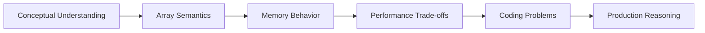
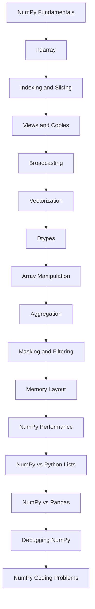

# README

## Overview

This section prepares for NumPy interview questions encountered in backend engineering and data-processing roles.

The emphasis is not on memorizing NumPy APIs. It is on understanding the array execution model well enough to reason about:

```text
data representation
→ shape and dimensionality
→ dtype and memory usage
→ indexing and selection
→ vectorized operations
→ broadcasting
→ views and copies
→ aggregation
→ performance trade-offs
→ debugging
```

Most NumPy interview questions test whether you can predict array behavior, explain trade-offs, and write correct vectorized code — not whether you remember a particular function name.

The section covers the topics most commonly tested in technical interviews for backend, data-engineering, and numerical-processing roles.

## Navigation

| # | File | Description |
|---|---|---|
| 01 | [01- NumPy Fundamentals](./01-%20NumPy%20Fundamentals.md) | Foundation concepts for reasoning about array behavior, shape, dtype, and the execution model |
| 02 | [02- ndarray](./02-%20ndarray.md) | Internal structure, memory model, strides, and core semantics of ndarray |
| 03 | [03- Indexing and Slicing](./03-%20Indexing%20and%20Slicing.md) | Positional, boolean, and fancy indexing plus slicing memory behavior |
| 04 | [04- Views and Copies](./04-%20Views%20and%20Copies.md) | Memory sharing, ownership, mutation, and when copies are made |
| 05 | [05- Broadcasting](./05-%20Broadcasting.md) | Shape compatibility rules and how broadcasting avoids explicit replication |
| 06 | [06- Vectorization](./06-%20Vectorization.md) | Array-wide computation, ufuncs, and reducing Python-loop overhead |
| 07 | [07- Dtypes](./07-%20Dtypes.md) | Dtype semantics, precision, range, memory usage, and casting behavior |
| 08 | [08- Array Manipulation](./08-%20Array%20Manipulation.md) | Reshape, transpose, stack, split, and axis-oriented transformations |
| 09 | [09- Aggregation](./09-%20Aggregation.md) | Reductions, axis selection, NaN-aware functions, and summary statistics |
| 10 | [10- Masking and Filtering](./10-%20Masking%20and%20Filtering.md) | Boolean masks, conditional selection, and data filtering patterns |
| 11 | [11- Memory Layout](./11-%20Memory%20Layout.md) | C vs Fortran order, strides, contiguity, and cache locality |
| 12 | [12- NumPy Performance](./12-%20NumPy%20Performance.md) | Performance model, bottlenecks, allocation, dtype, and optimization strategies |
| 13 | [13- NumPy vs Python Lists](./13-%20NumPy%20vs%20Python%20Lists.md) | When and why NumPy arrays differ from native Python lists |
| 14 | [14- NumPy vs Pandas](./14-%20NumPy%20vs%20Pandas.md) | Differences in use cases, data models, and when to use each |
| 15 | [15- Debugging NumPy](./15-%20Debugging%20NumPy.md) | Diagnosing shape errors, dtype issues, and unexpected numerical results |
| 16 | [16- NumPy Coding Problems](./16-%20NumPy%20Coding%20Problems.md) | Practical coding problems testing array semantics and numerical reasoning |

## Interview Model

NumPy interview questions across roles follow a consistent pattern:



Strong candidates can move fluidly between these layers rather than only answering isolated factual questions.

## Core Interview Topics

### ndarray and the Data Model

Most NumPy questions ultimately depend on understanding `ndarray`.

```text
ndarray
├── shape
├── ndim
├── size
├── dtype
├── itemsize
├── nbytes
├── strides
└── memory ownership
```

The key questions are:

- What is the difference between `shape`, `size`, and `ndim`?
- How do `strides` control element access?
- What does `nbytes` measure, and what does it not measure?
- How is memory ownership tracked?

### Indexing and Slicing

The three indexing mechanisms behave differently in shape and memory allocation:

```text
Basic slicing
→ returns a view
→ preserves dimensions

Boolean indexing
→ returns a copy
→ reduces dimensions

Fancy indexing
→ returns a copy
→ supports arbitrary selection
```

A common interview question asks you to predict whether a change to an indexed result will affect the original array.

### Views and Copies

Understanding views and copies is one of the most tested NumPy topics.

```text
View
→ shares underlying memory with the source
→ mutation affects the original

Copy
→ owns independent memory
→ mutation is isolated
```

Key questions:

- Does slicing always return a view?
- Does `reshape` always return a view?
- When does `ravel` return a copy?
- When does `flatten` return a copy?
- How do you check whether two arrays share memory?

### Broadcasting

Broadcasting allows NumPy to operate on arrays with compatible but different shapes without explicit replication.

The compatibility rule is applied dimension by dimension from the trailing axis:

```text
(3, 4)
(   4)
──────
(3, 4)
```

A dimension is compatible if it is equal or one of them is 1.

Interview questions often ask you to predict the output shape of a broadcasted operation, or to identify when broadcasting will raise an error.

### Vectorization

Vectorization means expressing numerical work as array operations rather than Python loops.

```text
Python loop
→ interpreter overhead per element

Vectorized operation
→ iteration inside NumPy's native implementation
```

Important nuance: vectorization reduces Python overhead but does not eliminate memory allocation. A vectorized expression can still create large temporary arrays.

### Dtypes

Dtype determines:

```text
element size
+
numerical range
+
precision
+
overflow behavior
+
memory bandwidth
```

Common interview questions cover:

- What happens when you add `int8` and `int64` arrays?
- Why might `float32` be preferred over `float64` in some workloads?
- What is the consequence of storing large integers in `int8`?
- How does dtype affect `nbytes`?

### Performance

Performance questions test whether you understand the full cost model:

```text
Python overhead
+
vectorization
+
memory layout
+
dtype size
+
temporary allocations
+
copies
+
batch size
+
I/O
```

A vectorized operation is not automatically cheap. The result size, number of temporaries, and memory layout all contribute to real performance.

### Debugging

Debugging questions typically describe unexpected output and ask you to identify the cause.

Common root causes include:

- Wrong axis in an aggregation
- Broadcasting producing an unintended shape
- Integer overflow due to undersized dtype
- Mutation through a view
- `NaN` or infinity propagating silently
- Non-contiguous layout causing unexpected behavior

A reliable first step is always to inspect:

```python
array.shape
array.dtype
array.nbytes
array.flags
```

## Recommended Interview Preparation Flow

The material is best prepared in order because later topics depend on earlier ones:



The coding problems section is most useful after the conceptual topics are solid, because good solutions require drawing on all of the earlier material simultaneously.

## Coding Problem Approach

A strong answer to a NumPy coding problem should address:

```text
What is the input shape and dtype?
    ↓
What is the expected output shape and dtype?
    ↓
Can the operation be vectorized?
    ↓
Does it allocate additional memory?
    ↓
Could broadcasting produce an unintended result?
    ↓
Does dtype affect correctness?
    ↓
Would the approach scale to production-sized inputs?
```

Writing a solution that only produces correct output without addressing these questions is generally considered a weak answer in a backend or data-engineering interview.

## NumPy vs Python Lists vs Pandas

A common interview area is distinguishing when to use each:

| Concern | Python List | NumPy | Pandas |
|---|---|---|---|
| Heterogeneous data | Strong | Not primary | Strong |
| Dense numerical arrays | Weak | Strong | Supported |
| Vectorized numerical computation | Not primary | Strong | Strong |
| Named columns | Not primary | Not primary | Strong |
| Joins and grouping | Not primary | Not primary | Strong |
| Memory layout control | None | Strong | More abstract |
| General application logic | Strong | Not primary | Not primary |

The answer is never "always use NumPy." It depends on the data model and workload.

## Production Reasoning

Interview questions sometimes extend into production scenarios:

- How would you process a dataset larger than available RAM?
- How would you validate that an incoming array has the expected dtype and shape?
- How would you avoid retaining large arrays in long-lived workers?
- How would you batch-process a large file?
- When would you push numerical work to PostgreSQL instead of NumPy?
- How would you benchmark a NumPy optimization without misleading results?

These questions test whether you can apply NumPy concepts to real engineering constraints.

## Key Takeaways

- NumPy interview success depends on understanding the array model — shape, dtype, strides, memory ownership — not on memorizing the API.
- Views and copies, broadcasting rules, and dtype behavior are among the most commonly tested topics.
- Vectorization reduces Python-level overhead but does not eliminate memory allocation; temporary arrays and result size are always part of the cost.
- Strong coding answers address input shape, output shape, memory behavior, dtype correctness, and production scalability — not just output correctness.
- NumPy complements Python lists and Pandas; interview answers should reflect when each tool is appropriate rather than treating NumPy as a universal solution.
