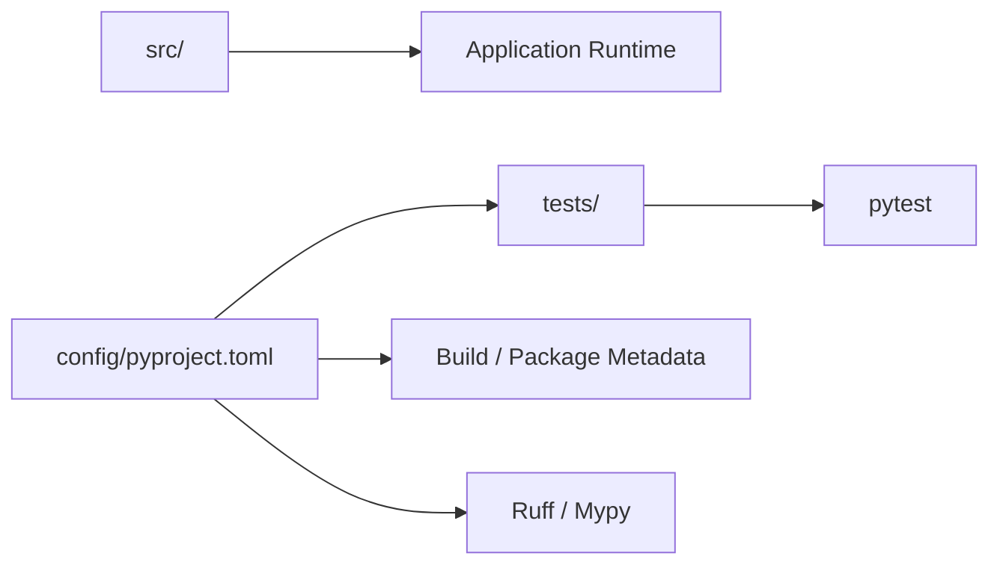
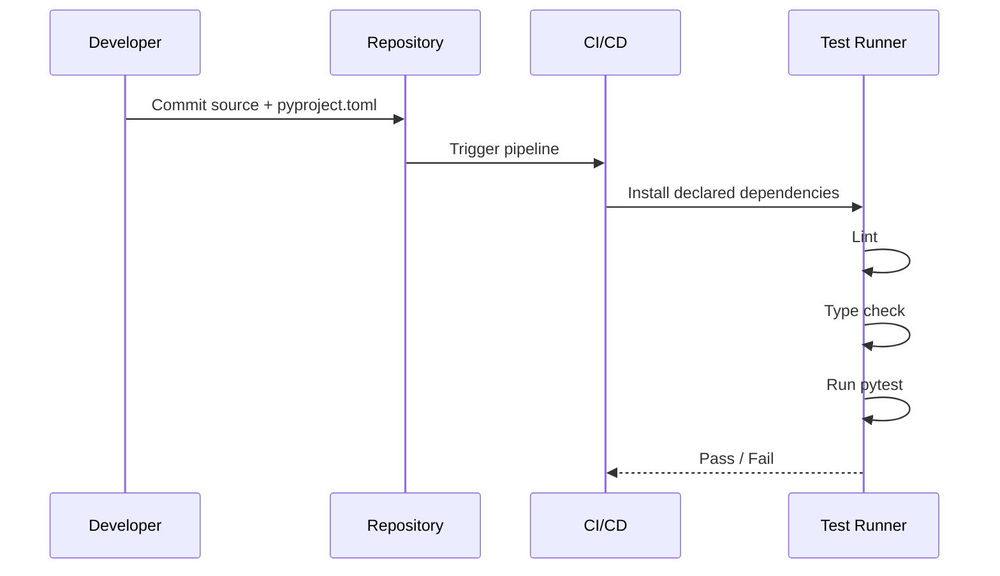

# README.md

## Overview

The `config` directory contains project-level configuration for the **Numerical Data Processor**. Configuration should define how the project is built, tested, linted, type-checked, and packaged without embedding environment-specific behavior into application code.

The primary configuration file is `pyproject.toml`. It provides a single standard location for Python project metadata and tool configuration, reducing configuration fragmentation across separate files.

## Configuration Structure

```text
config/
└── pyproject.toml
```

The configuration is intentionally kept separate from runtime source code so that application modules focus on numerical processing while tooling and packaging remain declarative.

A typical project flow is:



## `pyproject.toml`

The project's `pyproject.toml` should define the minimum metadata and tooling required to reproduce development and CI behavior.

Key responsibilities include:

| Area | Purpose |
|---|---|
| Build system | Defines how the project is packaged |
| Project metadata | Name, version, Python compatibility |
| Dependencies | Runtime and development requirements |
| Test configuration | pytest discovery and execution behavior |
| Coverage | Test coverage collection and reporting |
| Linting | Ruff rules and source paths |
| Formatting | Consistent Python formatting |
| Type checking | Mypy configuration |

A configuration file for this project can follow this structure:

```toml
[build-system]
requires = ["setuptools>=75"]
build-backend = "setuptools.build_meta"

[project]
name = "numerical-data-processor"
version = "0.1.0"
description = "Production-oriented numerical data processing pipeline built with NumPy."
requires-python = ">=3.12"
dependencies = [
    "numpy>=2.0,<3.0",
]

[dependency-groups]
dev = [
    "pytest>=8.0,<9.0",
    "pytest-cov>=5.0,<7.0",
    "ruff>=0.9,<1.0",
    "mypy>=1.13,<2.0",
]
```

## Runtime Dependencies

Runtime dependencies should contain only packages required by the application itself.

For this project, NumPy is the core runtime dependency:

```toml
[project]
dependencies = [
    "numpy>=2.0,<3.0",
]
```

Keeping the runtime dependency set small improves:

- Installation time
- Container image size
- Dependency auditing
- Upgrade safety
- Operational reproducibility

Testing, linting, formatting, and type-checking tools belong in development dependencies rather than the production runtime.

## Development Dependencies

Development tooling should be isolated from production dependencies.

```toml
[dependency-groups]
dev = [
    "pytest>=8.0,<9.0",
    "pytest-cov>=5.0,<7.0",
    "ruff>=0.9,<1.0",
    "mypy>=1.13,<2.0",
]
```

This separation is important when the same project is later packaged into a Docker image or deployed as a worker service. Production images should not need test runners or static-analysis tooling unless the deployment process explicitly requires them.

## Testing Configuration

The project uses pytest for automated tests.

```toml
[tool.pytest.ini_options]
testpaths = ["../tests"]
pythonpath = ["../src"]
addopts = [
    "-ra",
    "--strict-config",
    "--strict-markers",
]
```

The configuration establishes deterministic test discovery and prevents tests from depending on the developer's current working directory.

The `--strict-config` and `--strict-markers` options help catch configuration mistakes rather than silently ignoring them.

Run the test suite with:

```bash
pytest
```

For coverage:

```bash
pytest --cov
```

## Coverage Configuration

Coverage configuration should measure application code rather than test code.

```toml
[tool.coverage.run]
branch = true
source = ["../src"]

[tool.coverage.report]
exclude_lines = [
    "pragma: no cover",
    "if TYPE_CHECKING:",
]
```

Branch coverage is useful for numerical processing because edge cases often occur around:

- Empty arrays
- Invalid numerical values
- Boundary conditions
- Configuration validation
- Alternative transformation paths
- Batch-processing behavior

Coverage is a diagnostic signal, not a target to maximize blindly. High line coverage does not guarantee that numerical behavior, dtype handling, or memory-sensitive paths are correct.

## Ruff Configuration

Ruff provides linting and formatting from a single toolchain.

```toml
[tool.ruff]
line-length = 88
target-version = "py312"
src = ["../src", "../tests"]

[tool.ruff.lint]
select = [
    "E",
    "F",
    "I",
    "B",
    "UP",
]

[tool.ruff.format]
quote-style = "double"
indent-style = "space"
```

The configuration emphasizes:

- Python syntax and style errors
- Undefined or unused names
- Import ordering
- Common bug patterns
- Modern Python syntax

Run linting with:

```bash
ruff check .
```

Apply automatic formatting with:

```bash
ruff format .
```

For CI, linting should fail the build rather than allowing formatting drift to accumulate.

## Mypy Configuration

Mypy provides static type checking for the Python implementation.

```toml
[tool.mypy]
python_version = "3.12"
check_untyped_defs = true
disallow_any_generics = true
disallow_incomplete_defs = true
disallow_untyped_defs = true
no_implicit_optional = true
strict_equality = true
warn_redundant_casts = true
warn_unused_ignores = true
```

Type checking is particularly useful for pipeline-oriented code because the project has multiple boundaries:

```text
Input file
   ↓
NumPy ndarray
   ↓
Validation
   ↓
Transformation
   ↓
Aggregation
   ↓
Export
```

Explicit types make these boundaries easier to reason about and reduce accidental API changes between modules.

Run type checking with:

```bash
mypy src tests
```

## Packaging Configuration

The project can use setuptools as its build backend:

```toml
[build-system]
requires = ["setuptools>=75"]
build-backend = "setuptools.build_meta"
```

This allows standard Python packaging workflows without requiring a separate build configuration file.

Package discovery should point at the project's source directory rather than treating the repository root as importable application code.

```toml
[tool.setuptools]
package-dir = {"" = "../src"}

[tool.setuptools.packages.find]
where = ["../src"]
```

The exact source-path configuration should remain aligned with the repository layout. Changing the source directory without updating packaging configuration can cause imports to work locally while failing after installation.

## Configuration and Environment Separation

`pyproject.toml` should describe **project behavior**, not deployment secrets.

Do not place values such as these in the file:

- Database passwords
- AWS credentials
- API tokens
- Private keys
- Production secrets
- Environment-specific credentials

Environment-dependent values should come from the deployment environment, secret manager, or runtime configuration layer.

For example:

```text
pyproject.toml
    └── Static project configuration

Environment
    ├── Deployment-specific values
    └── Secret references

Application
    └── Runtime behavior
```

For AWS deployments, sensitive configuration should generally be supplied through mechanisms such as IAM roles, AWS Secrets Manager, or environment-specific deployment configuration rather than committed to source control.

## Reproducibility

The configuration should make local development and CI behave consistently.

A reproducible workflow should look like:



The important principle is that CI should derive its tooling configuration from the repository instead of maintaining a separate hidden configuration that developers cannot reproduce locally.

## Common Mistakes

### Putting runtime and development dependencies together

This increases production installation size and creates unnecessary dependency exposure.

Keep application dependencies separate from test and quality tooling.

### Hardcoding secrets in configuration

`pyproject.toml` is source-controlled configuration and should be treated as public within the repository's trust boundary.

Use environment variables or a dedicated secret-management system for sensitive values.

### Using inconsistent Python versions

A project configured for Python 3.12 should not silently rely on behavior from another interpreter version.

Keep local development, CI, and production runtimes aligned.

### Duplicating tool configuration

Avoid maintaining conflicting settings across `setup.cfg`, `tox.ini`, `.flake8`, `pytest.ini`, and `pyproject.toml` unless there is a specific compatibility requirement.

Centralizing configuration reduces drift.

### Treating coverage percentage as correctness

A high coverage number does not prove that numerical behavior is correct.

Tests should validate:

- Numerical values
- Boundary conditions
- Invalid input
- Empty datasets
- dtype behavior
- Transformation invariants
- Batch-processing semantics

## Production Considerations

For deployment-oriented projects, configuration should remain deterministic and minimal.

Recommended practices include:

- Pin compatible major dependency ranges rather than allowing uncontrolled upgrades.
- Use CI to execute the same lint, type-check, and test commands used locally.
- Keep secrets outside source-controlled configuration.
- Rebuild environments from configuration rather than modifying running containers manually.
- Review dependency changes as part of normal code review.
- Monitor dependency vulnerabilities through the organization's standard security process.
- Keep production images free of unnecessary development tooling where practical.

When this project is containerized, the build process should install the declared runtime dependencies separately from development tooling so that the resulting image remains small and easier to audit.

## Key Takeaways

- `pyproject.toml` centralizes build metadata, dependencies, testing, linting, formatting, and type-checking configuration.
- Runtime dependencies should remain separate from development-only tools such as pytest, Ruff, and Mypy.
- Reproducible Python versions and consistent CI commands are essential for reliable numerical-processing workloads.
- Secrets and deployment-specific configuration should never be stored in source-controlled project configuration.
- Configuration should enforce engineering consistency without hiding important runtime behavior inside tooling.