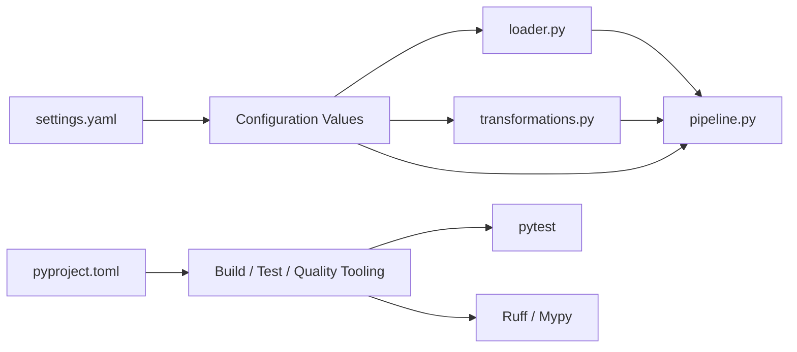
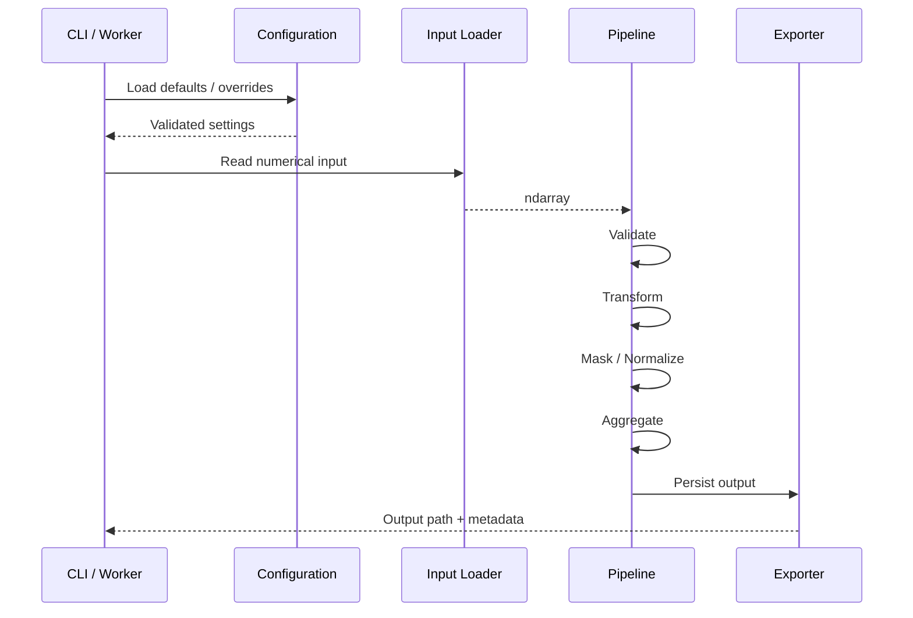

# README.md

## Overview

The `config` directory contains static project and tooling configuration for the **Vectorized Data Transformation** pipeline.

Configuration should remain separate from numerical processing logic so that transformation code can stay focused on array operations, validation, masking, aggregation, and export behavior. The directory also provides a controlled place for project metadata and development-tool configuration.

```text
config/
├── pyproject.toml
├── settings.yaml
└── README.md
```

The configuration layer should define **what the application should do**, while `src/` defines **how that behavior is implemented**.

## Configuration Responsibilities

| File | Responsibility |
|---|---|
| `pyproject.toml` | Packaging, dependencies, testing, linting, formatting, and type checking |
| `settings.yaml` | Runtime transformation and processing defaults |
| `README.md` | Documents configuration structure and operational conventions |

This separation provides a clean boundary between runtime parameters and Python implementation.



## `settings.yaml`

The YAML file should contain application-level defaults that may vary between environments or pipeline executions.

A representative configuration is:

```yaml
application:
  name: vectorized-data-transformation
  environment: development

input:
  directory: data/raw
  filename: input.npy
  format: npy
  dtype: float64
  max_elements: 1000000
  allow_pickle: false

processing:
  batch_size: 100000

  transformation:
    scale: 1.0
    offset: 0.0
    minimum: 0.0
    maximum: 1000000.0

  normalization:
    enabled: false
    minimum: 0.0
    maximum: 1.0

  validation:
    require_numeric: true
    reject_non_finite: true
    inclusive_range: true

output:
  directory: data/processed
  filename: transformed.npy
  format: npy
  overwrite: false

logging:
  level: INFO
  include_array_metadata: true
  include_statistics: true

performance:
  vectorized_operations: true
  avoid_unbounded_allocations: true
  batch_processing: true
```

The configuration is intentionally explicit about resource and numerical-processing constraints.

## Input Configuration

Input configuration controls where numerical data comes from and what resource limits apply.

| Setting | Purpose |
|---|---|
| `directory` | Location of incoming numerical files |
| `filename` | Default input file |
| `format` | Expected file representation |
| `dtype` | Target NumPy dtype |
| `max_elements` | Upper bound on accepted input size |
| `allow_pickle` | Controls NumPy object deserialization |

For numerical data, `allow_pickle: false` should remain the default unless there is a specific trusted-data requirement for serialized Python objects.

The element limit is particularly important because an array's memory requirement grows with its element count and dtype size:

```text
memory ≈ number_of_elements × dtype.itemsize
```

For example, one million `float64` values require approximately 8 MB for the raw array buffer, excluding temporary arrays and other process memory.

## Processing Configuration

The `processing` section defines how data is transformed.

```yaml
processing:
  batch_size: 100000

  transformation:
    scale: 1.0
    offset: 0.0
    minimum: 0.0
    maximum: 1000000.0
```

The pipeline can apply vectorized transformations such as:

```python
transformed = values * scale + offset
transformed = np.clip(
    transformed,
    minimum,
    maximum,
)
```

The batch size establishes an explicit processing boundary. It should be selected based on:

- Input size
- dtype
- Temporary allocation behavior
- Worker memory limits
- Expected throughput
- Container or host memory constraints

Increasing batch size can improve throughput by reducing per-batch overhead, but may increase peak memory usage.

## Normalization Configuration

Normalization settings should be kept explicit because normalization changes numerical semantics.

```yaml
normalization:
  enabled: false
  minimum: 0.0
  maximum: 1.0
```

A normalization stage may map input values into a target interval using a vectorized operation:

```python
normalized = (
    (values - source_min)
    / (source_max - source_min)
)

normalized = (
    normalized * (target_max - target_min)
    + target_min
)
```

Production code should define how constant arrays are handled because a zero source range would otherwise result in division by zero.

## Validation Configuration

Validation protects the pipeline from malformed or unexpected numerical input.

```yaml
validation:
  require_numeric: true
  reject_non_finite: true
  inclusive_range: true
```

Important checks include:

- Numeric dtype validation
- Input size validation
- `NaN` detection
- Positive and negative infinity detection
- Range validation
- Shape validation where applicable

For NumPy arrays, non-finite values can be detected efficiently with:

```python
finite = np.isfinite(values)
```

The validation policy should be strict at input boundaries and explicit about whether invalid records are rejected, filtered, replaced, or quarantined.

## Output Configuration

Output settings define where transformed data is persisted.

```yaml
output:
  directory: data/processed
  filename: transformed.npy
  format: npy
  overwrite: false
```

The default project format is NumPy's `.npy` representation because it preserves array shape and dtype without requiring schema reconstruction.

For interoperability with external systems, alternative formats such as CSV may be appropriate, but they introduce trade-offs around:

- Serialization overhead
- File size
- dtype fidelity
- Parsing cost
- Schema representation

Do not choose a text format solely because it is human-readable when downstream systems require high-throughput numerical processing.

## Logging Configuration

Logging should capture operational metadata rather than dumping entire arrays.

```yaml
logging:
  level: INFO
  include_array_metadata: true
  include_statistics: true
```

Useful metadata includes:

```text
shape
dtype
size
nbytes
minimum
maximum
mean
number of finite values
```

Logging entire arrays is usually a poor production practice because it can:

- Generate excessive log volume
- Increase storage costs
- Slow processing
- Expose sensitive data
- Make logs difficult to search

## Performance Configuration

Performance settings document the intended processing strategy.

```yaml
performance:
  vectorized_operations: true
  avoid_unbounded_allocations: true
  batch_processing: true
```

These flags are primarily policy-level configuration. They should not be treated as runtime switches that blindly override implementation behavior.

Vectorization should be preferred where it provides a meaningful reduction in Python-level iteration, but it should not justify creating large temporary arrays that exceed the application's memory budget.

A useful mental model is:

```text
CPU efficiency
    +
Memory efficiency
    +
Predictable allocation behavior
    =
Reliable numerical pipeline
```

## `pyproject.toml`

`pyproject.toml` defines the Python project's packaging and development tooling.

Typical responsibilities include:

```text
Build system
Dependencies
pytest configuration
Coverage configuration
Ruff linting and formatting
Mypy type checking
```

The runtime dependency set should remain separate from development-only tooling.

For example:

```toml
[project]
dependencies = [
    "numpy>=2.0,<3.0",
]

[dependency-groups]
dev = [
    "pytest>=8.0,<9.0",
    "pytest-cov>=5.0,<7.0",
    "ruff>=0.9,<1.0",
    "mypy>=1.13,<2.0",
]
```

This keeps the production runtime smaller while preserving a reproducible development environment.

## Runtime Configuration Flow

The intended configuration flow is:



Configuration should be resolved before substantial processing starts. Invalid configuration should fail fast rather than being discovered halfway through a large numerical operation.

## Environment Separation

Static configuration and secrets should remain separate.

Do not place these in `settings.yaml`:

- Database passwords
- AWS access keys
- API tokens
- Private keys
- Production credentials

Environment-specific values can be supplied through deployment configuration or environment variables.

A production deployment might use:

```text
Repository
├── pyproject.toml
└── settings.yaml

Runtime environment
├── environment variables
└── secret manager references
```

For AWS-based deployments, sensitive configuration should normally be supplied through IAM roles and services such as AWS Secrets Manager or Systems Manager Parameter Store rather than committed YAML values.

## Common Configuration Mistakes

### Treating configuration as a replacement for validation

Configuration can define limits, but runtime input must still be validated.

```yaml
input:
  max_elements: 1000000
```

does not protect the application unless the loader actually enforces that limit.

### Allowing unlimited batch sizes

A large batch can create multiple temporary arrays during transformations, causing peak memory to exceed the size of the original input.

### Storing secrets in YAML

YAML is configuration, not a secret-management system. Treat committed YAML as readable by anyone with repository access.

### Ignoring dtype implications

Changing:

```yaml
dtype: float32
```

to:

```yaml
dtype: float64
```

doubles the raw storage requirement per value. This may improve numerical precision but increases memory bandwidth and allocation size.

### Allowing configuration drift

If `settings.yaml` says one batch size while the Python module hardcodes another value, operators cannot reliably predict runtime behavior.

Prefer a single source of truth.

## Production Considerations

Configuration becomes more important as the pipeline is moved into workers, containers, scheduled jobs, or Kubernetes workloads.

Recommended practices include:

- Validate configuration at application startup.
- Bound array size and batch size explicitly.
- Keep secrets outside source-controlled files.
- Keep runtime defaults deterministic.
- Avoid silently accepting unknown configuration keys.
- Record effective non-sensitive configuration in job metadata.
- Version significant configuration changes alongside application changes.
- Keep development and production settings clearly separated.
- Treat dtype and batch-size changes as performance-impacting changes.
- Test configuration validation as part of CI.

When the pipeline runs through Celery, Kubernetes Jobs, or other distributed workers, remember that every concurrent worker may allocate its own arrays and temporary buffers. A safe per-worker batch size is therefore not automatically a safe system-wide concurrency configuration.

## Recommended Workflow

Local validation can follow:

```bash
ruff check .
ruff format --check .
mypy src tests
pytest
```

A CI pipeline should execute equivalent checks before producing a deployable artifact.

For production numerical workloads, configuration changes should be reviewed with the same discipline as application-code changes, particularly when they alter:

- Maximum input size
- Batch size
- dtype
- Normalization behavior
- Validation policy
- Output format

## Key Takeaways

- `settings.yaml` should contain explicit, validated runtime defaults for numerical processing rather than application logic.
- Batch size, dtype, and maximum element count directly affect memory usage and should be treated as operational parameters.
- `pyproject.toml` should manage Python packaging and development tooling while remaining separate from runtime numerical configuration.
- Configuration must not contain secrets, and environment-specific sensitive values should come from secure runtime configuration.
- Configuration changes can materially affect correctness, memory pressure, throughput, and deployment reliability.