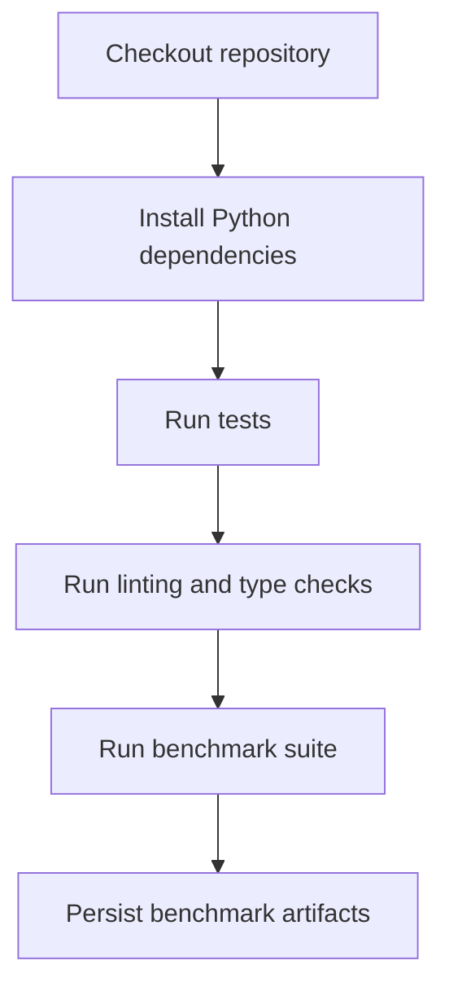

# README

## Overview

The `config` directory contains the configuration and project-tooling definitions for the NumPy **Performance Benchmarking** project.

Its purpose is to keep benchmark behavior, execution limits, reproducibility settings, and Python development tooling explicit and version-controlled. Runtime benchmark code remains under `src/` and `benchmarks/`; this directory defines how that code should be executed, validated, linted, tested, and configured.

The directory currently contains:

```text
config/
├── README.md
├── settings.yaml
└── pyproject.toml
```

The configuration is intentionally separated by responsibility:

| File | Responsibility |
|---|---|
| `settings.yaml` | Benchmark runtime and execution configuration |
| `pyproject.toml` | Python packaging, testing, linting, formatting, coverage, and type-checking configuration |
| `README.md` | Configuration documentation and operational guidance |

## Configuration Responsibilities

The project has two distinct configuration layers.

### Runtime Benchmark Configuration

`settings.yaml` controls values that affect benchmark execution, including:

- Dataset sizes
- Matrix dimensions
- Benchmark iteration counts
- Warmup runs
- Random seeds
- Tested NumPy dtypes
- Benchmark selection
- Result output format
- Numerical validation tolerances
- Allocation and dataset safety limits

These values should represent benchmark policy rather than implementation details.

For example:

```yaml
benchmark:
  iterations: 10
  warmup_iterations: 2
  seed: 42

datasets:
  default_size: 100000

performance:
  disable_gc_during_timing: true
  validate_equivalence_before_benchmark: true
```

This makes benchmark runs reproducible and prevents important execution parameters from being scattered across individual scripts.

### Python Project Configuration

`pyproject.toml` centralizes development tooling:

- Project metadata
- NumPy dependency constraints
- Development dependencies
- Package discovery
- Pytest configuration
- Coverage configuration
- Ruff linting and formatting
- Mypy configuration

The project targets Python 3.12+ and NumPy 2.x.

## Settings YAML

`settings.yaml` should be treated as declarative runtime configuration.

### Application Metadata

The `application` section identifies the project and environment:

```yaml
application:
  name: performance-benchmarking
  environment: development
```

This is useful when benchmark execution later becomes part of CI/CD, scheduled jobs, or containerized environments.

Avoid using this section for secrets or environment-specific credentials.

### Benchmark Controls

The `benchmark` section defines the default timing methodology:

```yaml
benchmark:
  iterations: 10
  warmup_iterations: 2
  seed: 42
```

The distinction between warmup and timed executions matters because startup effects, allocation behavior, caches, and runtime state can distort measurements.

For meaningful comparisons, baseline and candidate implementations should receive the same:

- Input data
- Iteration count
- Warmup policy
- Benchmark environment
- Execution parameters

### Dataset Configuration

Dataset generation is controlled independently from benchmark timing:

```yaml
datasets:
  default_size: 100000

  matrix:
    rows: 10000
    columns: 128
```

Separating dimensions from benchmark code makes it possible to evaluate scaling behavior without modifying source files.

For example:

- Small datasets expose fixed Python-call and setup overhead.
- Medium datasets provide realistic application-level comparisons.
- Large datasets expose allocation, memory bandwidth, and cache effects.

### Dtype Comparison

The dtype configuration makes memory and numerical precision trade-offs explicit:

```yaml
datasets:
  dtype_comparison:
    enabled: true
    dtypes:
      - float32
      - float64
```

This is important because `float32` and `float64` differ in:

- Memory footprint
- Precision
- Cache utilization
- Numerical range
- Compatibility with downstream operations

Benchmark results should never be interpreted from runtime alone. A faster dtype that changes numerical correctness or increases downstream conversion costs may not be a better production choice.

### Benchmark Selection

The `suite` section defines the benchmark workload:

```yaml
suite:
  fail_fast: true
  benchmarks:
    - benchmark_loops.py
    - benchmark_vectorization.py
    - benchmark_dtypes.py
    - benchmark_views.py
    - benchmark_broadcasting.py
```

This makes the suite explicit and gives CI or local automation a single source of truth for benchmark coverage.

Each benchmark should remain focused on one engineering question.

| Benchmark | Primary question |
|---|---|
| `benchmark_loops.py` | How does Python-loop processing compare with NumPy vectorization? |
| `benchmark_vectorization.py` | What is the cost of separate vectorized stages versus a composite transformation? |
| `benchmark_dtypes.py` | How do dtype size and representation affect runtime and memory? |
| `benchmark_views.py` | What is the performance impact of views versus copy-producing operations? |
| `benchmark_broadcasting.py` | How does broadcasting affect execution cost and output allocation? |

## Benchmark Safety

Performance experiments can accidentally become resource-exhaustive when array sizes or broadcasting dimensions are increased without considering the resulting allocation.

The configuration therefore includes explicit limits:

```yaml
safety:
  max_dataset_size: 10000000
  max_matrix_elements: 5000000
  prevent_unbounded_allocations: true
  avoid_huge_broadcast_outputs: true
```

These constraints are especially important for CI runners, Docker containers, and shared development environments.

For example, an expression such as:

```python
result = left[:, None] + right[None, :]
```

can create an output whose size is the product of the two dimensions. Broadcasting avoids replicating the input operands, but it does **not** eliminate the cost of materializing the result.

A benchmark configuration should therefore consider:

```text
output elements = product of broadcasted dimensions
output bytes    = output elements × dtype.itemsize
```

before allocating the result.

## Reproducibility

Reproducibility is a core requirement of performance benchmarking.

The project defines a shared seed:

```yaml
datasets:
  reproducibility:
    enabled: true
    seed: 42
```

Reproducible input generation helps ensure that changes in benchmark results come from implementation or environment changes rather than different datasets.

A reproducible benchmark should control at least:

- Random seed
- Dataset shape
- Dataset dtype
- Benchmark parameters
- Iteration count
- Warmup count
- Software versions

For serious performance investigations, also record:

- Python version
- NumPy version
- Operating system
- CPU architecture
- Available CPU cores
- Relevant BLAS or SIMD configuration
- Container or CI environment

## Performance Methodology

The project uses a consistent timing strategy rather than measuring code with ad hoc timestamps.

The benchmark configuration specifies:

```yaml
performance:
  use_monotonic_clock: true
  clock: perf_counter
  disable_gc_during_timing: true
```

A monotonic high-resolution timer is appropriate for elapsed-time measurements because wall-clock adjustments should not affect timing.

The benchmark utilities also separate warmup executions from timed executions.

A useful measurement flow is:


The project records multiple statistics rather than only a single runtime:

```yaml
performance:
  include_minimum_runtime: true
  include_median_runtime: true
  include_mean_runtime: true
  include_standard_deviation: true
  include_operations_per_second: true
```

This makes benchmark results easier to interpret.

For example:

- **Minimum** can approximate best-case execution under favorable runtime conditions.
- **Median** is often more stable than a single sample.
- **Mean** provides an aggregate view but can be influenced by outliers.
- **Standard deviation** helps identify unstable measurements.
- **Operations per second** provides a normalized throughput perspective.

## Numerical Validation

Performance comparisons are only useful when implementations are functionally equivalent.

The project therefore enables result validation:

```yaml
performance:
  validate_equivalence_before_benchmark: true
```

Numerical comparisons use configurable tolerances:

```yaml
validation:
  numerical:
    enabled: true
    rtol: 1.0e-5
    atol: 1.0e-6
```

This is particularly important when comparing different dtypes such as `float32` and `float64`, where exact element-by-element equality may be inappropriate.

Benchmarking must not optimize an incorrect implementation.

## Memory Measurements

Runtime and memory are separate performance dimensions.

The configuration supports metadata collection such as:

```yaml
reporting:
  include_dataset_metadata: true
  include_dtype: true
  include_shape: true
  include_itemsize: true
  include_nbytes: true
```

For a NumPy array:

```python
array.nbytes
```

describes the size of the array's data buffer. It does not represent the entire process memory footprint.

Likewise, a benchmark that produces a temporary array may have substantially higher peak memory usage than its final output suggests.

When investigating memory behavior, distinguish between:

- Array buffer size
- Temporary array allocations
- Python object allocations
- Process resident memory
- Allocator overhead

This distinction is important when interpreting `benchmark_dtypes.py`, `benchmark_views.py`, and `benchmark_broadcasting.py`.

## `pyproject.toml`

The `pyproject.toml` file defines development and packaging behavior.

### Dependencies

The project targets NumPy 2.x:

```toml
[project]
requires-python = ">=3.12"
dependencies = [
    "numpy>=2.0,<3.0",
]
```

Development tooling is kept separate from runtime dependencies:

```toml
[dependency-groups]
dev = [
    "pytest>=8.0,<9.0",
    "pytest-cov>=5.0,<7.0",
    "ruff>=0.9,<1.0",
    "mypy>=1.13,<2.0",
]
```

This separation keeps the production dependency surface minimal.

### Testing

Pytest is configured through:

```toml
[tool.pytest.ini_options]
```

The project explicitly defines:

- Test discovery paths
- Python import paths
- Strict configuration handling
- Strict marker handling

Benchmark correctness should be tested independently from benchmark timing. A benchmark suite should not be treated as a substitute for unit tests.

### Coverage

Coverage is enabled with branch measurement:

```toml
[tool.coverage.run]
branch = true
```

Coverage is useful for identifying untested benchmark infrastructure, validation logic, and reporting behavior. It should not be used as the sole measure of benchmark quality.

### Ruff

Ruff provides linting and formatting:

```toml
[tool.ruff]
line-length = 88
target-version = "py312"
```

The configured rules emphasize:

- Python correctness
- Import hygiene
- Common bug patterns
- Modern Python syntax

Keeping benchmark code lint-clean matters because benchmark scripts often become operational tooling used by CI and performance investigations.

### Mypy

Mypy provides static type checking for the Python 3.12 target.

The configuration intentionally enables stricter checks such as:

- Untyped definition detection
- Generic type requirements
- Strict equality checks
- Redundant cast detection

Benchmark infrastructure should remain strongly typed because incorrect benchmark orchestration can invalidate otherwise correct measurements.

## Configuration Loading

The configuration files are currently declarative project assets. The benchmark scripts should not assume that `settings.yaml` is automatically loaded by Python.

A future configuration-loading layer should explicitly define:

```text
settings.yaml
      ↓
Configuration parser
      ↓
Validation
      ↓
Typed runtime configuration
      ↓
Benchmark execution
```

For production-grade tooling, prefer parsing YAML into a validated typed configuration object rather than passing unvalidated nested dictionaries throughout the codebase.

The loading layer should also distinguish:

- Missing configuration
- Invalid configuration
- Unsupported values
- Environment overrides
- Security-sensitive values

## Environment Overrides

Environment variables are preferable for deployment-specific settings and secrets.

For example:

```bash
BENCHMARK_ITERATIONS=20
BENCHMARK_SEED=42
```

can override defaults in a CI environment without modifying source-controlled configuration.

Do not place credentials, access tokens, cloud secrets, or other sensitive values in `settings.yaml`.

Use:

- CI secret stores
- AWS Secrets Manager
- AWS Systems Manager Parameter Store
- Kubernetes Secrets
- Environment injection

for sensitive runtime values.

## CI/CD Usage

The configuration is suitable for automated validation in CI/CD.

A typical CI flow is:



Benchmark execution should generally be separated from ordinary unit-test execution because benchmark runtimes are more sensitive to:

- Shared CI runners
- CPU contention
- Virtualization
- Background workloads
- Thermal throttling
- Container resource limits

For regression tracking, compare benchmark results only within reasonably similar execution environments.

## Production and Operational Considerations

### Resource Limits

When benchmarks run inside Docker or Kubernetes, explicitly define CPU and memory limits.

A benchmark that works on a developer workstation may become unstable in a container with a much smaller memory limit.

### Logging

Prefer structured benchmark metadata over dumping arrays into logs.

Useful fields include:

```text
benchmark_name
dataset_size
shape
dtype
itemsize
nbytes
iterations
warmup_iterations
mean_seconds
median_seconds
minimum_seconds
standard_deviation_seconds
```

Do not log full numerical datasets.

### Result Retention

Benchmark artifacts can become large when many parameter combinations are tested. Keep result files versioned or retained according to the needs of the project.

For long-term regression tracking, a structured format such as JSON or CSV is generally more useful than terminal-only output.

### Environment Consistency

Meaningful benchmark comparisons require a controlled environment.

At minimum, record:

| Category | Example |
|---|---|
| Python | `3.12.x` |
| NumPy | `2.x` |
| OS | Linux |
| CPU | Architecture/model |
| Memory | Available system memory |
| Dataset | Shape and dtype |
| Benchmark | Iterations and warmups |
| Seed | Fixed random seed |

Do not interpret small runtime differences as regressions without considering execution-environment noise.

## Common Configuration Mistakes

### Treating YAML as Automatically Loaded

Adding a setting to `settings.yaml` does nothing unless application code actually loads and applies it.

Configuration files are not behavior by themselves.

### Benchmarking Different Inputs

Comparing implementations with different datasets invalidates the result.

Generate one deterministic input dataset and pass the same input to every equivalent implementation.

### Increasing Dataset Sizes Without Memory Analysis

Large arrays and broadcasted outputs can exhaust available memory.

Estimate output size before executing large benchmarks.

### Using Only One Timing Measurement

One execution can be dominated by scheduler activity, allocation state, CPU frequency changes, or cache behavior.

Use warmups and repeated measurements.

### Mixing Functional Validation With Timed Regions

Validation code should generally not be included in the timed operation unless validation overhead is explicitly part of the workload being modeled.

### Treating CPU Time as the Entire Performance Story

A faster implementation can still be worse if it creates significantly larger temporary arrays or increases process memory pressure.

## Recommended Configuration Workflow

When changing benchmark configuration:

1. Change the smallest configuration surface possible.
2. Validate that dataset dimensions remain safe.
3. Keep random seeds fixed for comparable runs.
4. Run correctness tests before interpreting performance changes.
5. Record benchmark and environment metadata.
6. Compare results from equivalent execution environments.
7. Keep configuration changes under version control when they are part of a reproducible experiment.

## Key Takeaways

- `settings.yaml` defines reproducible benchmark behavior, while `pyproject.toml` defines the Python development and tooling environment.
- Benchmark configuration must control dataset shape, dtype, seed, iteration count, and warmup policy to make performance comparisons meaningful.
- Runtime performance and memory efficiency are separate dimensions; `nbytes` alone does not represent total process memory usage.
- Large broadcasts and temporary arrays can create significant memory pressure, so benchmark configuration should enforce explicit resource limits.
- Configuration should remain explicit, validated, version-controlled, and safe for CI/CD execution without storing secrets.