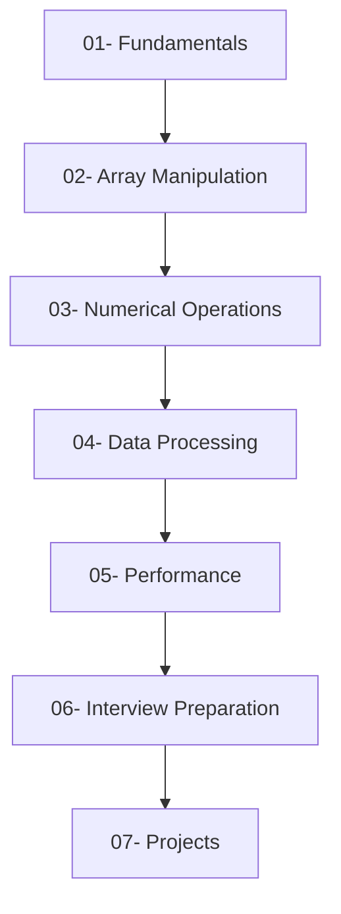
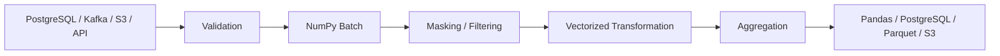

# NumPy

## Overview

This curriculum covers NumPy for backend engineering and data-processing workloads.

The focus is on understanding how NumPy's array model, memory behavior, and execution model support production numerical processing — not on scientific computing as a discipline. Topics progress from the core data model through manipulation, numerical operations, data processing, performance, interview preparation, and practical projects.

```text
Fundamentals
→ Array Manipulation
→ Numerical Operations
→ Data Processing
→ Performance
→ Interview Preparation
→ Projects
```

Each section is self-contained and builds on the concepts introduced before it.

## Navigation

| # | File | Description |
|---|---|---|
| 01 | [01- Fundamentals](./01-%20Fundamentals/README.md) | ndarray, array creation, attributes, dtypes, indexing, slicing, views, and vectorization |
| 02 | [02- Array Manipulation](./02-%20Array%20Manipulation/README.md) | Reshape, transpose, concatenate, stack, split, broadcasting, and dimension management |
| 03 | [03- Numerical Operations](./03-%20Numerical%20Operations/README.md) | Arithmetic, comparison, aggregation, cumulative operations, rounding, and NaN handling |
| 04 | [04- Data Processing](./04-%20Data%20Processing/README.md) | Cleaning, masking, filtering, normalization, structured arrays, random data, and file I/O |
| 05 | [05- Performance](./05-%20Performance/README.md) | Vectorization, memory layout, dtype optimization, temporary arrays, batching, and benchmarking |
| 06 | [06- Interview Preparation](./06-%20Interview%20Preparation/README.md) | Interview topics, coding problems, trade-off reasoning, and production scenario questions |
| 07 | [07- Projects](./07-%20Projects/README.md) | Practical projects applying NumPy concepts in production-oriented pipelines |

## Curriculum Structure

### 01- Fundamentals

Establishes the array model that all later sections depend on.

Covers `ndarray` internals, array construction, shape and dtype semantics, all indexing mechanisms, view vs copy memory behavior, and vectorized execution. The emphasis is on understanding why NumPy behaves the way it does rather than memorizing APIs.

### 02- Array Manipulation

Covers the operations that change how arrays are shaped, ordered, and partitioned.

Topics include reshape, resize, flatten, transpose, axis reasoning, concatenation, stacking, splitting, broadcasting, and dimension expansion and reduction. Memory allocation and view behavior are addressed for each operation.

### 03- Numerical Operations

Covers NumPy's core numerical processing primitives.

Topics range from element-wise arithmetic and comparisons through aggregation, cumulative operations, rounding, conditional logic, logical validation, and handling of NaN and infinity. Each topic includes production considerations for batch workloads.

### 04- Data Processing

Covers practical numerical data processing for backend and data-engineering systems.

Topics include data cleaning, missing and invalid value handling, masking, filtering, normalization, standardization, categorical encoding, structured and record arrays, random data generation, reproducibility, file I/O, and memory-mapped arrays.

### 05- Performance

Covers how to use NumPy effectively in performance-sensitive workloads.

Topics include the execution model, vectorization vs loops, broadcasting costs, memory layout, contiguous arrays, views vs copies, dtype optimization, memory usage, avoiding temporary arrays, batch processing, and disciplined benchmarking.

### 06- Interview Preparation

Prepares for NumPy interview questions in backend and data-engineering roles.

Covers all major conceptual topics — ndarray, indexing, views and copies, broadcasting, vectorization, dtypes, aggregation, masking, memory layout, performance, debugging, and comparisons with Python lists and Pandas — plus practical coding problems and production scenario questions.

### 07- Projects

Three standalone Python projects that apply playbook concepts in runnable, tested implementations:

- **Numerical Data Processor** — validated batch pipeline covering transformation, aggregation, and export.
- **Vectorized Data Transformation** — memory-aware pipeline using masking, normalization, and broadcasting.
- **Performance Benchmarking** — systematic measurement of Python vs NumPy, dtype trade-offs, views vs copies, and broadcasting cost.

## Recommended Reading Order

The sections are designed to be read in sequence:



Later sections assume familiarity with the earlier data model and memory concepts. Reading out of order is possible but may require revisiting earlier material when performance or memory behavior is unclear.

## Backend and Data Engineering Context

NumPy is most useful when it sits inside a larger processing architecture:



NumPy complements Python, Pandas, and database systems. It should be used where dense numerical array processing provides a meaningful advantage, not as a replacement for general-purpose application structures or dataframe-oriented workflows.

## Key Takeaways

- NumPy fundamentals — ndarray, shape, dtype, indexing, memory ownership, and vectorization — are prerequisites for every later section.
- Array manipulation, numerical operations, and data processing build directly on those fundamentals.
- Production performance depends on execution model, memory layout, dtype selection, allocation behavior, and batching — not vectorization alone.
- The interview preparation section consolidates the entire curriculum into the topics and reasoning patterns most commonly tested in technical roles.
- The projects demonstrate the curriculum concepts in production-oriented, tested Python implementations.
