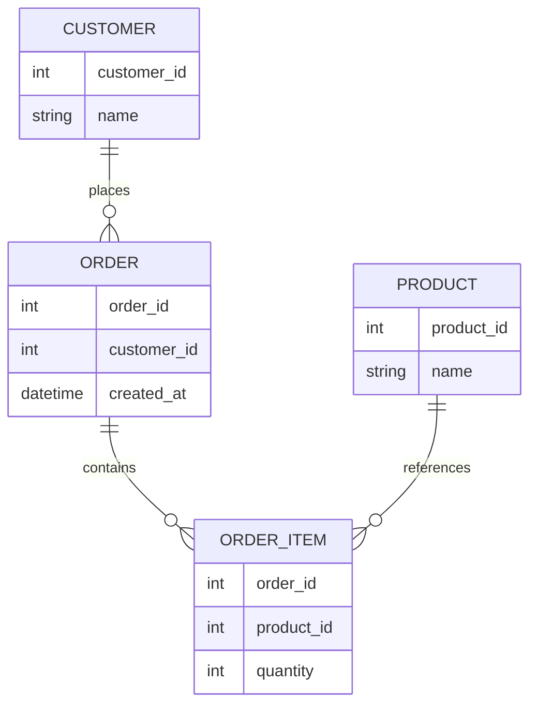
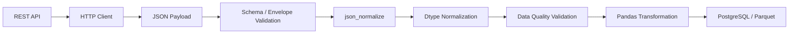
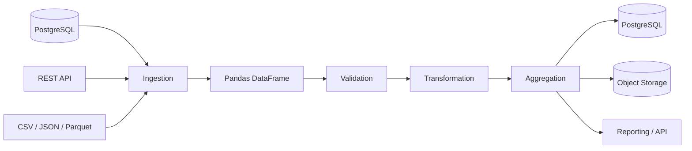

# 02- json

## Overview

JSON is one of the most common formats exchanged between backend services, REST APIs, event systems, and configuration-driven applications.

In Pandas workflows, JSON is usually an **ingestion or serialization boundary**:

```text
REST API / JSON file
        ↓
Python JSON payload
        ↓
Pandas normalization
        ↓
DataFrame
        ↓
Validation / transformation
        ↓
JSON / database / Parquet / report
```

The challenge is that JSON is not inherently tabular. It can contain nested objects, arrays, optional fields, inconsistent records, and multiple representations of the same logical value.

Pandas provides:

- `read_json()` for reading JSON-formatted data.
- `to_json()` for serializing DataFrames and Series.
- `json_normalize()` for converting nested JSON structures into tabular form.

Production code should treat JSON as an external data contract rather than assuming that every payload maps cleanly to a DataFrame.

## JSON vs Tabular Data

JSON naturally represents hierarchical data:

```json
{
  "order_id": 1001,
  "customer": {
    "id": 42,
    "name": "Asha"
  },
  "items": [
    {
      "product_id": 501,
      "quantity": 2
    },
    {
      "product_id": 502,
      "quantity": 1
    }
  ]
}
```

A DataFrame is fundamentally tabular:

```text
order_id  customer_id  customer_name
1001      42           Asha
```

The nested `items` array introduces a separate one-to-many relationship.

The correct transformation depends on the target data model.

```text
Nested JSON
    │
    ├── scalar fields ──────→ orders DataFrame
    │
    └── arrays / objects ───→ related DataFrame(s)
```

Trying to flatten every nested structure into one DataFrame can produce duplicated data and ambiguous semantics.

## JSON Reading Options

| API | Primary use |
|---|---|
| `pd.read_json()` | Read JSON from files, strings, URLs, or supported input sources |
| `pd.json_normalize()` | Flatten nested dictionaries and API-style JSON |
| Python `json` module | Parse complex JSON before custom normalization |

Use `read_json()` when the JSON structure already maps reasonably well to tabular data.

Use `json_normalize()` when the payload is nested.

Use the standard library `json` module when custom parsing or validation must happen before Pandas normalization.

## Reading Tabular JSON with `read_json()`

For JSON records that already resemble rows:

```json
[
  {
    "order_id": 1001,
    "customer_id": 42,
    "amount": 250.00
  },
  {
    "order_id": 1002,
    "customer_id": 43,
    "amount": 175.50
  }
]
```

Pandas can load the data directly:

```python
import pandas as pd

orders = pd.read_json(
    "orders.json",
)
```

The resulting DataFrame is conceptually:

```text
order_id  customer_id  amount
1001      42           250.0
1002      43           175.5
```

For many production pipelines, however, JSON arrives from an HTTP client rather than a file.

## Reading JSON with the Standard Library

A common pattern is:

```python
import json
from pathlib import Path

payload = json.loads(
    Path("orders.json").read_text(
        encoding="utf-8"
    )
)
```

Then:

```python
orders = pd.json_normalize(
    payload["orders"]
)
```

This gives the application greater control over:

- Input validation.
- Envelope fields.
- Error responses.
- Schema inspection.
- Custom normalization.

## `json_normalize()`

`json_normalize()` is designed for semi-structured records.

Example payload:

```python
payload = {
    "orders": [
        {
            "id": 1001,
            "customer": {
                "id": 42,
                "name": "Asha",
            },
            "amount": 250.00,
        },
        {
            "id": 1002,
            "customer": {
                "id": 43,
                "name": "Ravi",
            },
            "amount": 175.50,
        },
    ]
}
```

Normalize the records:

```python
orders = pd.json_normalize(
    payload["orders"]
)
```

The result contains flattened keys such as:

```text
id  amount  customer.id  customer.name
```

Rename them to an internal schema:

```python
orders = orders.rename(
    columns={
        "id": "order_id",
        "customer.id": "customer_id",
        "customer.name": "customer_name",
    }
)
```

This separates:

```text
External API schema
        ↓
Internal application schema
```

## `record_path`

When JSON contains nested arrays, `record_path` can identify the records that should become rows.

Example:

```python
payload = [
    {
        "order_id": 1001,
        "customer_id": 42,
        "items": [
            {
                "product_id": 501,
                "quantity": 2,
            },
            {
                "product_id": 502,
                "quantity": 1,
            },
        ],
    }
]
```

To normalize the items:

```python
items = pd.json_normalize(
    payload,
    record_path="items",
    meta=[
        "order_id",
        "customer_id",
    ],
)
```

This produces a DataFrame conceptually equivalent to:

```text
product_id  quantity  order_id  customer_id
501         2         1001      42
502         1         1001      42
```

The parent fields are repeated because each item belongs to the parent order.

## `meta`

`meta` carries parent-level fields into rows created from a nested array.

```python
items = pd.json_normalize(
    payload,
    record_path="items",
    meta=[
        "order_id",
        "customer_id",
    ],
)
```

Nested parent fields can also be addressed using paths where required:

```python
items = pd.json_normalize(
    payload,
    record_path=["items"],
    meta=[
        "order_id",
        ["customer", "id"],
    ],
)
```

The resulting column structure should be inspected and normalized before downstream processing.

## Nested JSON and Relational Modeling

A nested payload often maps more naturally to multiple tables.



Instead of forcing everything into one DataFrame:

```text
orders
order_items
customers
products
```

can be represented separately.

This is usually easier to reason about and maps naturally to PostgreSQL schemas.

## Flattening Depth with `max_level`

For moderately nested objects:

```python
orders = pd.json_normalize(
    records,
    max_level=1,
)
```

This limits how deeply nested dictionaries are flattened.

Use this when some nested structures should remain intact temporarily.

Do not flatten blindly to maximum depth. A deeply nested payload may represent legitimate domain boundaries that should remain separate.

## Column Naming with `sep`

By default, nested paths can be represented with dotted names.

You can control the separator:

```python
orders = pd.json_normalize(
    records,
    sep="_",
)
```

For example:

```text
customer.id
```

can become:

```text
customer_id
```

This can make the resulting DataFrame easier to integrate with SQL-oriented schemas.

## Missing Fields in JSON

JSON records frequently contain optional fields.

For example:

```json
[
  {
    "order_id": 1001,
    "status": "completed"
  },
  {
    "order_id": 1002
  }
]
```

Pandas may represent the missing field as a missing value.

Inspect the result:

```python
orders = pd.json_normalize(
    records
)

print(orders.isna().sum())
```

Do not immediately fill missing values.

First decide whether the field is:

```text
Optional
Required
Conditionally required
Invalid when missing
```

## Normalize Then Validate

A reliable ingestion sequence is:

```text
JSON payload
    ↓
Normalize structure
    ↓
Normalize column names
    ↓
Normalize dtypes
    ↓
Validate schema
    ↓
Validate values
    ↓
Transform
```

Example:

```python
orders = (
    pd.json_normalize(
        payload["orders"]
    )
    .rename(
        columns={
            "id": "order_id",
            "customer.id": "customer_id",
        }
    )
    .assign(
        order_id=lambda df: pd.to_numeric(
            df["order_id"],
            errors="coerce",
        ),
        customer_id=lambda df: pd.to_numeric(
            df["customer_id"],
            errors="coerce",
        ),
    )
)
```

Then validate:

```python
required = {
    "order_id",
    "customer_id",
}

missing = required.difference(
    orders.columns
)

if missing:
    raise ValueError(
        f"Missing required columns: {sorted(missing)}"
    )
```

## Type Normalization

JSON has only a limited set of primitive value types compared with Pandas.

For example:

```text
JSON number
JSON string
JSON boolean
JSON null
```

Pandas must map these values into its own dtype system.

Normalize explicitly when the field has important semantics:

```python
orders["amount"] = pd.to_numeric(
    orders["amount"],
    errors="coerce",
)
```

For timestamps:

```python
orders["created_at"] = pd.to_datetime(
    orders["created_at"],
    errors="coerce",
    utc=True,
)
```

For textual fields:

```python
orders["status"] = (
    orders["status"]
    .astype("string")
    .str.strip()
    .str.lower()
)
```

## JSON Numbers and Financial Data

JSON does not distinguish between different numeric representations in the same way an application domain might.

An API might return:

```json
{
  "amount": 199.99
}
```

A Pandas `float64` column may be convenient for analysis, but exact financial calculations should have an explicit precision strategy.

Depending on the application, consider:

```text
Integer minor units
Decimal
Database NUMERIC / DECIMAL
```

Do not assume that JSON numeric syntax guarantees exact monetary arithmetic.

## JSON Booleans

JSON booleans are:

```json
true
false
```

After parsing, they should be represented using an appropriate boolean dtype.

Be careful with string booleans:

```json
{
  "active": "false"
}
```

This is a string, not a JSON boolean.

Blind conversion can produce incorrect results.

For example, non-empty Python strings are truthy:

```python
bool("false")
```

does not represent the semantic meaning of the string `"false"`.

Normalize explicit representations instead:

```python
mapping = {
    "true": True,
    "false": False,
}

users["active"] = (
    users["active"]
    .astype("string")
    .str.strip()
    .str.lower()
    .map(mapping)
)
```

## JSON `null`

JSON `null` represents absence of a value.

After parsing, Pandas may represent the resulting missing value according to the column dtype.

Do not assume all missing values will become the same Python object.

Use Pandas APIs:

```python
orders.isna()
orders.notna()
```

rather than comparing values directly to `None`.

## JSON Arrays

Arrays require special consideration.

An array may represent:

- A list of scalar values.
- A one-to-many child relationship.
- Tags.
- Permissions.
- Event history.
- Embedded configuration.

Example:

```json
{
  "order_id": 1001,
  "tags": ["priority", "international"]
}
```

It may be reasonable to keep `tags` as a list when downstream processing expects that structure.

For relational processing, exploding it may be more appropriate:

```python
tags = (
    orders[
        [
            "order_id",
            "tags",
        ]
    ]
    .explode("tags")
    .rename(
        columns={"tags": "tag"}
    )
)
```

Now each tag is a separate row.

## `explode()` vs `json_normalize()`

Use `json_normalize()` when nested dictionaries and record structures need flattening.

Use `explode()` when an existing DataFrame column contains list-like values and each element should become a row.

| Requirement | Preferred operation |
|---|---|
| Flatten nested JSON dictionaries | `json_normalize()` |
| Normalize nested record arrays | `json_normalize(record_path=...)` |
| Expand list-like DataFrame column | `explode()` |
| Rename external JSON fields | `rename()` |
| Normalize JSON-derived types | `to_numeric()`, `to_datetime()`, `astype()` |

Understanding the distinction avoids unnecessary custom parsing.

## API Envelope Fields

Many APIs return an envelope:

```json
{
  "request_id": "abc123",
  "page": 1,
  "total": 250,
  "orders": [
    {
      "id": 1001,
      "amount": 250
    }
  ]
}
```

Do not normalize the entire payload as though `request_id`, `page`, and `orders` were all row-level fields.

Usually:

```python
orders = pd.json_normalize(
    payload["orders"]
)
```

while operational metadata is handled separately:

```python
request_id = payload["request_id"]
page = payload["page"]
total = payload["total"]
```

This preserves the distinction between:

```text
Transport metadata
```

and:

```text
Business records
```

## REST API Integration

A production service often has this structure:



The HTTP client should handle:

- Authentication.
- Timeouts.
- Connection reuse.
- Retry policy.
- Rate limiting.
- Pagination.
- HTTP status codes.

Pandas should focus on data transformation.

## Pagination

APIs frequently return a subset of records per request.

A scalable design processes pages incrementally:

```python
for page in fetch_order_pages():
    page_df = (
        pd.json_normalize(
            page["orders"]
        )
        .pipe(normalize_orders)
        .pipe(validate_orders)
    )

    write_batch(page_df)
```

This avoids constructing one enormous in-memory list of every API response.

For very large APIs, this can significantly reduce peak memory usage.

## API Retry Semantics

Retries can result in duplicate data.

For example:

```text
Request page 3
    ↓
Server processes request
    ↓
Network timeout
    ↓
Client retries
    ↓
Page 3 received again
```

If the API or ingestion pipeline is at-least-once, duplicate handling may be necessary.

JSON parsing does not solve this problem. The pipeline needs an identity strategy such as:

```text
order_id
event_id
source record ID
composite business key
```

## JSON Lines / NDJSON

Large event and log systems often use newline-delimited JSON:

```text
{"event_id":1,"type":"login"}
{"event_id":2,"type":"purchase"}
{"event_id":3,"type":"logout"}
```

This is different from one large JSON array.

For newline-delimited JSON:

```python
events = pd.read_json(
    "events.ndjson",
    lines=True,
)
```

The format is useful for streaming and append-oriented workloads.

For large files, combine it with chunking where supported:

```python
for chunk in pd.read_json(
    "events.ndjson",
    lines=True,
    chunksize=100_000,
):
    process_events(chunk)
```

This is useful for event-processing pipelines.

## JSON Lines vs Standard JSON

| Characteristic | JSON array | JSON Lines |
|---|---|---|
| Structure | One document | One JSON document per line |
| Streaming friendliness | Lower | Higher |
| Append friendliness | Lower | Higher |
| Large event logs | Less convenient | Well suited |
| Pandas option | `read_json()` | `read_json(lines=True)` |

JSON Lines is often easier to process incrementally.

## Writing JSON

A DataFrame can be serialized with:

```python
payload = orders.to_json(
    orient="records"
)
```

This produces record-oriented JSON:

```json
[
  {
    "order_id": 1001,
    "amount": 250.0
  },
  {
    "order_id": 1002,
    "amount": 175.5
  }
]
```

The `orient` argument controls the structure of the result.

## Choosing `orient`

Common orientations include:

| `orient` | Typical shape | Common use |
|---|---|---|
| `records` | List of row objects | REST APIs |
| `columns` | Column → index → value | General Pandas-oriented exchange |
| `split` | Separate index, columns, data | Structured Pandas interchange |
| `index` | Index → row object | Index-keyed data |
| `table` | Schema + records | Schema-aware interchange |

For API responses, `records` is often the easiest representation for consumers.

Do not use an orientation simply because it is the default. Match it to the consumer contract.

## Writing JSON with Dates

When serializing datetime values, define how the consumer should interpret them.

Example:

```python
report.to_json(
    orient="records",
    date_format="iso",
)
```

ISO-oriented timestamps are generally easier for services to consume than implementation-specific representations.

For distributed systems, consistently representing timestamps in UTC is usually preferable.

## Writing JSON Lines

For event-style output:

```python
events.to_json(
    "events.ndjson",
    orient="records",
    lines=True,
)
```

Each record is written as one JSON document per line.

This format is useful for:

- Batch event exports.
- Log pipelines.
- Object storage.
- Incremental ingestion.
- Stream-oriented processing.

## JSON Output for FastAPI

A Pandas DataFrame should generally be converted into ordinary Python records before being returned through an API layer.

For example:

```python
records = report.to_dict(
    orient="records"
)
```

Then:

```python
from fastapi import FastAPI

app = FastAPI()


@app.get("/reports/orders")
def get_order_report():
    report = build_report()

    return report.to_dict(
        orient="records"
    )
```

This keeps:

```text
Pandas
```

inside the data-processing layer and:

```text
FastAPI
```

responsible for HTTP serialization and API contracts.

For high-volume API responses, pagination and response-size limits should be implemented rather than returning arbitrarily large DataFrames.

## JSON and Django

In a Django application, Pandas can be used in a background or data-processing layer:

```text
Django request
    ↓
Application / task trigger
    ↓
Celery worker
    ↓
Pandas processing
    ↓
Database / object storage
```

Avoid placing large JSON-to-DataFrame transformations directly in latency-sensitive request paths unless the workload is demonstrably small and bounded.

For longer jobs, use background workers such as Celery.

## JSON and Kafka

Kafka payloads are commonly JSON or JSON-like event records.

A practical flow is:

```text
Kafka
  ↓
Consumer
  ↓
Batch records
  ↓
Pandas
  ↓
Normalize
  ↓
Validate
  ↓
Aggregate / transform
  ↓
Storage
```

Pandas is generally better suited to micro-batch processing than high-frequency per-message processing.

If the workload is truly continuous and high volume, a streaming-native architecture may be more appropriate.

## JSON and PostgreSQL

A normalized JSON dataset can be loaded into relational tables:

```text
JSON API
   ↓
Pandas
   ↓
Validation
   ↓
Staging table
   ↓
PostgreSQL
```

For semi-structured data that must remain flexible, PostgreSQL's JSON-capable types may sometimes be more appropriate than flattening everything through Pandas.

The decision should depend on query patterns and ownership of the schema.

## Schema Drift

A major production problem with JSON is schema drift.

For example:

```text
v1:
customer.id

v2:
customer.customer_id
```

or:

```text
v1:
amount = 125.00

v2:
amount = "125.00"
```

or:

```text
v1:
discount = null

v2:
discount = {
    "amount": 20
}
```

The ingestion layer should detect these changes.

At minimum, validate:

```text
Required fields
Expected field paths
Expected dtypes
Allowed nullability
Allowed categorical values
Record identity
```

## Schema Versioning

When an upstream API exposes explicit schema versions, preserve that information.

For example:

```python
schema_version = payload.get(
    "schema_version"
)

if schema_version != "2":
    raise ValueError(
        f"Unsupported schema version: {schema_version}"
    )
```

If versioning is unavailable, compare the normalized structure against an expected schema.

Explicit versioning is preferable to guessing based on payload contents.

## Handling Unknown Fields

An API may add fields without breaking existing clients:

```json
{
  "order_id": 1001,
  "amount": 250.0,
  "new_feature_flag": true
}
```

A robust reader does not necessarily need to fail because an optional field was added.

Distinguish:

```text
Missing required field
```

from:

```text
Unexpected optional field
```

Strictness should match the contract.

## Data Quality Validation

After normalization:

```python
if orders["order_id"].duplicated().any():
    raise ValueError(
        "Duplicate order IDs detected"
    )

if orders["amount"].lt(0).any():
    raise ValueError(
        "Negative amounts detected"
    )
```

For API ingestion, also consider:

```text
Expected row counts
Maximum batch size
Required nested objects
Allowed enum values
Timestamp ranges
Identifier formats
Referential consistency
```

## Empty JSON Payloads

An empty response can be valid:

```json
{
  "orders": []
}
```

or indicate an upstream failure masked as a successful response.

Do not treat every empty DataFrame as an error.

Define an expected contract:

```text
No records available
```

may be a normal state.

But:

```text
Expected 10,000 records
Received 0
```

may require an alert.

## Malformed JSON

Malformed JSON should generally fail at parsing:

```python
import json

try:
    payload = json.loads(raw_body)
except json.JSONDecodeError as exc:
    raise ValueError(
        "Invalid JSON payload"
    ) from exc
```

Do not silently convert malformed input into:

```python
pd.DataFrame()
```

An empty dataset and invalid input represent different operational conditions.

## Security Considerations

JSON data frequently crosses trust boundaries.

Important controls include:

- Validate external payloads.
- Enforce maximum payload sizes.
- Avoid logging complete request bodies.
- Redact credentials and sensitive fields.
- Validate file paths when reading JSON files.
- Restrict access to sensitive object-storage paths.
- Use HTTPS for remote APIs.
- Store API credentials outside DataFrames.
- Validate schema before persistence.

Pandas should not be treated as a security boundary by itself.

## Payload Size and Memory

A JSON payload can be expensive to process because it may exist in several forms:

```text
HTTP response bytes
        +
Python JSON objects
        +
Pandas DataFrame
        +
intermediate transformed DataFrame
```

This means:

```text
10 MB network payload
```

does not necessarily imply:

```text
10 MB process memory
```

For large responses:

- Paginate.
- Stream where appropriate.
- Process batches.
- Select only required fields.
- Avoid unnecessary copies.
- Persist incrementally.

## JSON Parsing Performance

`json_normalize()` is convenient, but deeply nested or very large JSON structures can be expensive to flatten.

For large workloads:

```text
API
 ↓
Paginated responses
 ↓
Normalize each page
 ↓
Validate
 ↓
Persist batch
```

is often safer than:

```text
API
 ↓
Download entire history
 ↓
One massive normalization
```

Measure parsing and normalization time separately from downstream Pandas transformations.

## JSON and Parquet Conversion

For recurring analytical workloads:

```text
REST API
   ↓
JSON
   ↓
Pandas normalization
   ↓
Validated DataFrame
   ↓
Parquet
   ↓
Repeated downstream reads
```

This avoids repeatedly parsing the same JSON payload.

Example:

```python
orders.to_parquet(
    "orders/date=2026-09-10/data.parquet",
    index=False,
)
```

Downstream jobs can then consume typed columnar data rather than reconstructing the schema from JSON every time.

## Testing JSON Pipelines

Tests should use realistic nested payloads.

Example:

```python
import pandas as pd


def normalize_orders(
    payload: dict,
) -> pd.DataFrame:
    return (
        pd.json_normalize(
            payload["orders"]
        )
        .rename(
            columns={
                "id": "order_id",
                "customer.id": "customer_id",
            }
        )
    )
```

Test:

```python
def test_normalize_orders():
    payload = {
        "orders": [
            {
                "id": 1001,
                "customer": {
                    "id": 42,
                },
                "amount": 250.0,
            }
        ]
    }

    result = normalize_orders(
        payload
    )

    assert list(result.columns) == [
        "order_id",
        "customer_id",
        "amount",
    ]

    assert result.loc[
        0,
        "order_id",
    ] == 1001

    assert result.loc[
        0,
        "customer_id",
    ] == 42
```

Also test:

- Missing nested objects.
- Missing required fields.
- Null values.
- Empty arrays.
- Unexpected field types.
- Duplicate identifiers.
- Malformed payloads.
- Schema versions.
- Multiple pages.
- Large responses where practical.

## Round-Trip Considerations

Reading and writing JSON does not guarantee byte-for-byte round-trip equality.

For example:

```text
Original JSON
   ↓
Python objects
   ↓
Pandas
   ↓
JSON
```

can change:

- Field ordering.
- Numeric representation.
- Date formatting.
- Missing-value representation.
- Object structure.
- Index representation.

Tests should validate the **logical data contract**, not textual identity, unless exact serialization is explicitly required.

## Common Mistakes

### Calling `read_json()` on Arbitrarily Nested API Payloads

A nested response may not map directly to rows.

**Better:** identify the record collection and use `json_normalize()`.

### Flattening Everything into One DataFrame

Nested arrays often represent separate one-to-many entities.

**Better:** model parent and child records separately where appropriate.

### Ignoring API Envelopes

Metadata such as pagination, request IDs, and totals may not belong in the row schema.

**Better:** keep transport metadata separate from business records.

### Assuming JSON Numbers Are Business-Ready Types

JSON only describes a number, not your financial precision or domain semantics.

**Better:** establish explicit numeric types and precision rules.

### Treating `"false"` as the Boolean `false`

A non-empty string is truthy in Python.

**Better:** normalize supported textual representations explicitly.

### Blindly Using `errors="coerce"`

Invalid JSON-derived values can become missing values.

**Better:** measure the resulting nulls and validate them.

### Assuming Every JSON Response Contains Data

A valid empty result can be legitimate, but it can also signal an upstream problem.

**Better:** define expected cardinality and alert thresholds.

### Building One Massive JSON DataFrame

Large nested payloads can cause high memory usage.

**Better:** paginate and process incrementally.

### Logging Entire API Payloads

Payloads may contain PII, authentication material, or confidential information.

**Better:** log safe metadata such as request IDs, counts, schema versions, and error categories.

### Returning Huge DataFrames Directly from APIs

This creates latency and memory pressure.

**Better:** paginate API responses and impose sensible response-size limits.

### Mixing HTTP and Transformation Logic

Retries and authentication belong to the transport layer.

**Better:** keep API clients separate from Pandas transformation functions.

## Interview Traps

### When Should You Use `read_json()` vs `json_normalize()`?

Use `read_json()` when the JSON already represents a suitable tabular structure. Use `json_normalize()` when nested dictionaries or record arrays need to be flattened into tabular form.

### What Does `record_path` Do?

It specifies the nested field containing records that should become DataFrame rows.

### Why Is `meta` Needed?

When normalizing nested arrays, `meta` carries parent-level fields into each generated child row.

### Why Can Nested JSON Produce Duplicate Parent Data?

A one-to-many relationship requires parent fields to be repeated for each child row when represented as a flat DataFrame.

### What Is the Difference Between `explode()` and `json_normalize()`?

`explode()` expands list-like values already stored in DataFrame columns. `json_normalize()` converts nested JSON structures into tabular form.

### Why Should API Metadata Be Kept Separate from DataFrame Rows?

Fields such as pagination information and request IDs describe the transport operation, not necessarily the business records.

### Why Can JSON Parsing Consume More Memory Than the File Size Suggests?

The payload can exist simultaneously as encoded bytes, Python objects, DataFrame storage, and intermediate transformation results.

### How Would You Handle a 100 Million Record JSON Dataset?

Do not assume a single in-memory DataFrame is appropriate. Prefer pagination or JSON Lines, bounded processing, selective normalization, durable intermediate formats such as Parquet, and potentially a distributed or database-native processing architecture.

### Why Is Schema Validation Important for JSON APIs?

JSON schemas can drift without breaking JSON syntax. A syntactically valid payload can still violate the application's expected structure or types.

### How Would You Make an API-to-Pandas Pipeline Retry-Safe?

Use stable record identifiers, deterministic processing, explicit pagination state, idempotent storage, and duplicate detection or upsert semantics.

## Production Checklist

```text
[ ] Is the JSON structure understood before normalization?
[ ] Is the record collection explicitly identified?
[ ] Are API envelope fields separated from row data?
[ ] Are nested objects flattened only where appropriate?
[ ] Are nested arrays modeled correctly?
[ ] Are required fields validated?
[ ] Are optional and required fields distinguished?
[ ] Are dtypes normalized after parsing?
[ ] Are invalid values measured?
[ ] Are JSON nulls handled intentionally?
[ ] Are empty responses distinguished from ingestion failures?
[ ] Is schema drift detected?
[ ] Is schema versioning supported where available?
[ ] Is pagination handled?
[ ] Is duplicate handling defined?
[ ] Can payloads exceed worker memory?
[ ] Can processing be performed incrementally?
[ ] Are sensitive JSON fields excluded from logs?
[ ] Are API transport concerns separated from Pandas logic?
[ ] Is the output schema explicit?
[ ] Are large datasets converted to a more efficient intermediate format?
[ ] Are malformed, empty, and unexpected payloads tested?
```

## Key Takeaways

- JSON is hierarchical and often requires explicit normalization before it can be treated as reliable tabular data; use `json_normalize()` for nested structures and preserve meaningful parent-child relationships.
- Separate transport metadata such as pagination and request IDs from business records, and keep HTTP concerns such as retries, authentication, and timeouts outside Pandas transformation code.
- Normalize dtypes, missing values, identifiers, timestamps, and nested fields at the ingestion boundary, then validate the resulting schema and business constraints explicitly.
- For large or recurring workloads, paginate or batch JSON ingestion, avoid unnecessary in-memory copies, and consider converting validated JSON data into Parquet or another efficient intermediate representation.
- Production JSON pipelines must account for schema drift, duplicate delivery, malformed payloads, security-sensitive fields, empty responses, memory pressure, idempotency, and downstream output contracts.
```
```

```
```
01- Fundamentals/
    01- Pandas Overview.md
    02- Pandas Data Model.md
    03- Series.md
    04- Dataframe.md
    05- Index.md
    06- Columns And Dtypes.md
    07- Creating Dataframes.md
    08- Creating Series.md
    09- Inspecting Data.md
    10- Shape Size And Dimensions.md
    11- Pandas Data Types.md
    12- Missing Values Overview.md
    13- Copying Data.md
    14- Method Chaining.md
    README.md

02- Reading and Writing Data/
    01- Csv.md
    02- Json.md
    03- Excel.md
    04- Parquet.md
    05- Sql.md
    06- Html.md
    07- Text Files.md
    08- Read Functions.md
    09- Write Functions.md
    10- Dtype Control.md
    11- Parsing And Converters.md
    12- Chunked Reading.md
    13- Compression.md
    14- Encoding.md
    README.md

03- Selecting and Filtering/
    01- Selecting Columns.md
    02- Selecting Rows.md
    03- Loc.md
    04- Iloc.md
    05- At And Iat.md
    06- Boolean Filtering.md
    07- Multiple Conditions.md
    08- Isin.md
    09- Query.md
    10- Filtering Missing Values.md
    11- Indexing And Selection.md
    12- Setting Values.md
    README.md

04- Data Cleaning/
    01- Data Quality.md
    02- Missing Values.md
    03- Isna And Notna.md
    04- Fillna.md
    05- Dropna.md
    06- Duplicate Data.md
    07- Drop Duplicates.md
    08- Inconsistent Values.md
    09- Type Conversion.md
    10- Numeric Cleaning.md
    11- String Cleaning.md
    12- Datetime Cleaning.md
    13- Outlier Handling.md
    14- Validation Rules.md
    README.md

05- Data Transformation/
    01- Assignment And Transformation.md
    02- Rename.md
    03- Astype.md
    04- Map.md
    05- Apply.md
    06- Applymap And Elementwise Operations.md
    07- Replace.md
    08- Where And Mask.md
    09- Assign.md
    10- Melt.md
    11- Pivot And Pivot Table.md
    12- Stack And Unstack.md
    13- Explode.md
    14- Cut And Qcut.md
    15- Categorical Data.md
    README.md

06- Grouping and Aggregation/
    01- Groupby.md
    02- Groupby Keys.md
    03- Aggregation.md
    04- Agg.md
    05- Transform.md
    06- Filter.md
    07- Named Aggregation.md
    08- Multiple Aggregations.md
    09- Grouped Transformations.md
    10- Hierarchical Grouping.md
    README.md

07- Combining Data/
    01- Concat.md
    02- Merge.md
    03- Join.md
    04- Merge Types.md
    05- Inner Join.md
    06- Left Join.md
    07- Right Join.md
    08- Outer Join.md
    09- Cross Join.md
    10- Merge Validation.md
    11- Duplicate Keys.md
    README.md

08- Sorting Ranking and Statistics/
    01- Sort Values.md
    02- Sort Index.md
    03- Ranking.md
    04- Rank.md
    05- Descriptive Statistics.md
    06- Sum Mean Median.md
    07- Min Max.md
    08- Count And Nunique.md
    09- Value Counts.md
    10- Quantiles.md
    11- Correlation.md
    12- Covariance.md
    13- Cumulative Operations.md
    README.md

09- Strings and Datetime/
    01- String Accessor.md
    02- String Cleaning.md
    03- String Search.md
    04- String Extraction.md
    05- Regular Expressions.md
    06- Datetime Overview.md
    07- To Datetime.md
    08- Datetime Components.md
    09- Datetime Filtering.md
    10- Date Offsets.md
    11- Timedeltas.md
    12- Timezone Aware Datetime.md
    13- Resampling.md
    14- Time Series Indexing.md
    README.md

10- Performance and Memory/
    01- Pandas Performance.md
    02- Vectorization.md
    03- Apply Vs Vectorization.md
    04- Efficient Dtypes.md
    05- Categorical Dtype.md
    06- Memory Usage.md
    07- Memory Optimization.md
    08- Copy Vs View.md
    09- Avoiding Unnecessary Copies.md
    10- Efficient Filtering.md
    11- Efficient Groupby.md
    12- Efficient Joins.md
    13- Chunk Processing.md
    14- Parquet Performance.md
    README.md

11- Backend and Data Engineering/
    01- Pandas In Etl.md
    02- Pandas And Sql.md
    03- Database To Dataframe.md
    04- Dataframe To Database.md
    05- Pandas And Parquet.md
    06- Large Dataset Processing.md
    07- Chunk Processing.md
    08- Data Validation.md
    09- Data Quality Checks.md
    10- Batch Processing.md
    11- Incremental Processing.md
    12- Idempotent Data Processing.md
    README.md

12- Interview Preparation/
    01- Pandas Fundamentals.md
    02- Series And Dataframe.md
    03- Indexing And Selection.md
    04- Loc And Iloc.md
    05- Filtering.md
    06- Missing Values.md
    07- Duplicates.md
    08- Data Cleaning.md
    09- Apply Map And Transform.md
    10- Groupby And Aggregation.md
    11- Merge And Join.md
    12- Concat.md
    13- Pivot And Melt.md
    14- Strings And Datetime.md
    15- Pandas Performance.md
    16- Memory Optimization.md
    17- Pandas And Sql.md
    18- Etl Scenarios.md
    19- Data Cleaning Scenarios.md
    20- Data Transformation Scenarios.md
    21- Reporting Scenarios.md
    22- Debugging Pandas.md
    23- Pandas Coding Problems.md
    README.md
```
```

```
Markdown


```
# 01- Pandas Overview

## Overview

Pandas is a Python library for working with structured and semi-structured tabular data. In backend and data-engineering systems, it is most useful as an in-memory processing layer between external data sources and downstream systems.

A typical production workflow looks like:

```text
PostgreSQL / REST API / CSV / JSON / Parquet
                    ↓
             Pandas ingestion
                    ↓
          Schema normalization
                    ↓
           Data quality checks
                    ↓
          Transformation / ETL
                    ↓
        Aggregation / Reporting
                    ↓
PostgreSQL / Parquet / API / Object Storage
```

Pandas is not primarily a database, message broker, distributed processing engine, or workflow orchestrator. Its value comes from providing expressive operations for manipulating labeled tabular data inside a Python process.

The fundamentals of Pandas are built around a few core ideas:

```text
DataFrame
Series
Index
Columns
Dtypes
Vectorized operations
Missing-value semantics
Alignment
```

Understanding these concepts is more important than memorizing individual method names.

## What Pandas Provides

Pandas provides high-level data structures and operations for:

- Tabular data manipulation.
- Filtering and selection.
- Data cleaning.
- Type conversion.
- Grouping and aggregation.
- Joining datasets.
- Reshaping data.
- String processing.
- Datetime processing.
- Reading and writing common data formats.
- Data-quality inspection.
- Batch-oriented data transformation.

A minimal example:

```python
import pandas as pd

orders = pd.DataFrame(
    {
        "order_id": [1001, 1002, 1003],
        "customer_id": [101, 102, 101],
        "status": [
            "completed",
            "pending",
            "completed",
        ],
        "amount": [
            250.0,
            175.5,
            500.0,
        ],
    }
)

completed = orders.loc[
    orders["status"].eq("completed")
]

customer_totals = (
    completed
    .groupby(
        "customer_id",
        as_index=False,
    )
    .agg(
        total_amount=("amount", "sum")
    )
)
```

The code expresses a common backend data-processing task without requiring row-by-row Python loops.

## Core Data Model

Pandas primarily works with two data structures.

| Structure | Description | Typical use |
|---|---|---|
| `Series` | One-dimensional labeled data | A column or vector |
| `DataFrame` | Two-dimensional labeled table | Records and tabular processing |

A DataFrame can be viewed conceptually as:

```text
DataFrame
├── Index
├── Columns
│   ├── Series
│   ├── Series
│   └── Series
└── Data
```

For example:

```python
orders["amount"]
```

returns a `Series`.

While:

```python
orders[
    [
        "customer_id",
        "amount",
    ]
]
```

returns a DataFrame.

This distinction becomes important for method return types, assignment, alignment, and performance.

## DataFrame

A DataFrame represents labeled two-dimensional data.

```python
orders = pd.DataFrame(
    {
        "order_id": [1001, 1002],
        "customer_id": [10, 20],
        "amount": [250.0, 175.5],
    }
)
```

Conceptually:

```text
          order_id  customer_id  amount
row 0       1001           10   250.0
row 1       1002           20   175.5
```

Important DataFrame properties include:

```python
orders.shape
orders.columns
orders.index
orders.dtypes
```

A DataFrame should be treated as a typed, labeled data structure rather than simply a Python list of dictionaries.

## Series

A Series represents one labeled dimension:

```python
amounts = orders["amount"]
```

Conceptually:

```text
index
  0    250.0
  1    175.5
```

A Series has:

- Values.
- An index.
- A dtype.
- Optional name metadata.

For example:

```python
amounts.name
amounts.index
amounts.dtype
```

Series operations are often vectorized:

```python
amounts_with_tax = amounts * 1.18
```

No explicit Python loop is required.

## Index

The Index identifies rows through labels.

```python
orders.index
```

By default, a DataFrame may have:

```text
0
1
2
```

But the labels can have domain meaning:

```python
orders = orders.set_index(
    "order_id"
)
```

Now:

```text
order_id
1001
1002
1003
```

The Pandas Index is an in-memory labeling and alignment mechanism. It should not be confused with a PostgreSQL storage index.

The index affects:

- Selection.
- Alignment.
- Reindexing.
- Joins.
- Grouping.
- Time-series operations.

## Columns

Columns represent named fields in the tabular schema.

```python
orders.columns
```

might contain:

```text
order_id
customer_id
status
amount
```

A column is a Series:

```python
orders["amount"]
```

This makes column operations composable with Series operations.

Columns should have clear business semantics and stable names, especially when DataFrames cross service or pipeline boundaries.

## Dtypes

Each column has a dtype:

```python
orders.dtypes
```

Typical Pandas dtypes include:

```text
Int64
Float64
boolean
string
datetime64
timedelta64
category
```

Dtypes matter because they determine how values behave.

For example:

```python
orders["amount"].sum()
```

depends on `amount` being represented appropriately as numeric data.

Likewise:

```python
orders["created_at"].dt.date
```

requires a datetime-compatible dtype.

Incorrect dtypes are a common source of subtle ETL bugs.

## Vectorization

One of the most important Pandas concepts is vectorized computation.

Prefer:

```python
orders["total"] = (
    orders["quantity"]
    * orders["unit_price"]
)
```

over:

```python
for index, row in orders.iterrows():
    orders.loc[
        index,
        "total",
    ] = (
        row["quantity"]
        * row["unit_price"]
    )
```

Vectorized Pandas operations generally delegate work to optimized internal implementations rather than executing one Python function call per row.

This improves both readability and performance for many workloads.

## Alignment

Pandas often aligns data by labels rather than physical position.

Consider:

```python
left = pd.Series(
    [100, 200],
    index=["a", "b"],
)

right = pd.Series(
    [10, 20],
    index=["b", "a"],
)
```

Then:

```python
result = left + right
```

produces values according to matching indexes:

```text
a → 100 + 20
b → 200 + 10
```

This is powerful for labeled data but can surprise developers expecting positional NumPy-style behavior.

Understanding alignment is especially important for:

- Assignment.
- Arithmetic.
- `concat()`.
- `merge()`.
- `reindex()`.
- Time-series operations.

## Selecting Data

Pandas provides several selection mechanisms.

```python
orders["amount"]
```

Selects a single column.

```python
orders[
    [
        "order_id",
        "amount",
    ]
]
```

Selects multiple columns.

Label-based selection:

```python
orders.loc[
    orders["status"].eq("completed")
]
```

Position-based selection:

```python
orders.iloc[:100]
```

The distinction between `loc` and `iloc` is fundamental.

## Filtering

Filtering is typically vectorized:

```python
completed = orders.loc[
    orders["status"].eq("completed")
]
```

Multiple conditions:

```python
large_completed_orders = orders.loc[
    orders["status"].eq("completed")
    & orders["amount"].ge(500)
]
```

Each condition produces a boolean Series that is then used to select rows.

For production code, filtering should be based on explicit business conditions rather than implicit assumptions.

## Missing Values

Real datasets frequently contain missing fields.

Pandas supports missing-value semantics through mechanisms including:

```text
pd.NA
NaN
NaT
None
```

Detection should use:

```python
orders.isna()
orders.notna()
```

rather than relying on direct equality comparisons.

For example:

```python
missing_amounts = orders[
    "amount"
].isna().sum()
```

Missing-value handling must be domain-specific.

For an optional customer nickname, missing data may be acceptable.

For a financial transaction amount, missing data may require rejection or quarantine.

## Data Cleaning

Common cleaning operations include:

```python
orders["status"] = (
    orders["status"]
    .astype("string")
    .str.strip()
    .str.lower()
)
```

Numeric conversion:

```python
orders["amount"] = pd.to_numeric(
    orders["amount"],
    errors="coerce",
)
```

Duplicate detection:

```python
duplicates = orders.duplicated(
    subset=["order_id"]
)
```

Cleaning should be treated as a controlled transformation stage.

Avoid silently modifying source data without documenting the expected result.

## Data Transformation

Pandas provides vectorized operations for deriving and changing fields.

```python
orders = orders.assign(
    subtotal=lambda df: (
        df["quantity"]
        * df["unit_price"]
    ),
)
```

Transformation operations include:

- Arithmetic.
- String normalization.
- Datetime conversion.
- Mapping.
- Conditional replacement.
- Reshaping.
- Categorization.

A transformation should ideally have a clear input schema and output contract.

## Grouping and Aggregation

Grouping converts record-level data into summary-level data.

```python
customer_summary = (
    orders
    .groupby(
        "customer_id",
        as_index=False,
    )
    .agg(
        order_count=("order_id", "count"),
        total_amount=("amount", "sum"),
        average_amount=("amount", "mean"),
    )
)
```

This is useful for:

- Reports.
- Billing summaries.
- Operational metrics.
- Customer analytics.
- Financial aggregation.
- ETL outputs.

Be careful about the grain of both the input and output DataFrames.

## Combining Data

Pandas provides several ways to combine data.

### `concat()`

Used for stacking compatible datasets:

```python
all_orders = pd.concat(
    [
        january_orders,
        february_orders,
    ],
    ignore_index=True,
)
```

### `merge()`

Used for relational-style joins:

```python
enriched = orders.merge(
    customers,
    on="customer_id",
    how="left",
    validate="many_to_one",
)
```

### `join()`

Useful for index-oriented combinations.

Choosing the correct operation requires understanding:

```text
Vertical combination
        vs
Relational join
```

Incorrect join cardinality is a common source of duplicated records.

## Reading and Writing Data

Pandas integrates with common data sources and formats.

Examples include:

```python
pd.read_csv(...)
pd.read_json(...)
pd.read_excel(...)
pd.read_parquet(...)
pd.read_sql(...)
```

And corresponding output APIs:

```python
df.to_csv(...)
df.to_json(...)
df.to_excel(...)
df.to_parquet(...)
df.to_sql(...)
```

The format determines the parsing, schema, type, and performance characteristics.

For internal analytical pipelines, Parquet is often more suitable than CSV because it provides typed columnar storage.

## CSV

CSV is widely supported and useful for interchange:

```python
orders = pd.read_csv(
    "orders.csv",
)
```

Production concerns include:

- Encoding.
- Delimiter.
- Quoting.
- Missing-value markers.
- Type inference.
- Malformed records.
- File size.

For large files:

```python
for chunk in pd.read_csv(
    "orders.csv",
    chunksize=100_000,
):
    process_chunk(chunk)
```

CSV should not be treated as a strongly typed schema.

## JSON

JSON is particularly common at API boundaries:

```python
orders = pd.json_normalize(
    payload["orders"]
)
```

Nested payloads often require explicit normalization.

A JSON API workflow commonly looks like:

```text
HTTP response
     ↓
JSON payload
     ↓
Normalize
     ↓
Pandas DataFrame
     ↓
Validate
     ↓
Transform
```

Transport concerns such as authentication, retries, pagination, and timeouts should remain outside the Pandas transformation layer.

## Parquet

Parquet is a strong option for analytical and intermediate pipeline storage:

```python
orders.to_parquet(
    "orders.parquet",
    index=False,
)
```

It is particularly useful when:

- Data is read repeatedly.
- Column selection matters.
- Type preservation matters.
- Batch processing is required.
- Object storage is involved.

For selective reads:

```python
orders = pd.read_parquet(
    "orders.parquet",
    columns=[
        "customer_id",
        "amount",
    ],
)
```

## SQL Integration

Pandas can consume relational query results:

```python
orders = pd.read_sql(
    """
    SELECT
        order_id,
        customer_id,
        amount
    FROM orders
    WHERE created_at >= %s
    """,
    connection,
    params=[start_date],
)
```

For large workloads, push appropriate filtering and projection into SQL.

Prefer:

```text
PostgreSQL
   ↓
WHERE / SELECT
   ↓
Smaller result set
   ↓
Pandas
```

over:

```text
PostgreSQL
   ↓
Entire table
   ↓
Pandas
   ↓
Filter
```

This reduces network traffic and application memory usage.

## Method Chaining

Pandas operations can often be composed:

```python
report = (
    orders
    .loc[
        orders["status"].eq("completed")
    ]
    .assign(
        total=lambda df: (
            df["quantity"]
            * df["unit_price"]
        )
    )
    .groupby(
        "customer_id",
        as_index=False,
    )
    .agg(
        total_amount=("total", "sum")
    )
    .sort_values(
        "total_amount",
        ascending=False,
    )
)
```

Method chaining is useful when the transformation sequence is linear and readable.

Do not optimize for the shortest possible expression. Split complicated business logic into named functions and intermediate stages when necessary.

## Copy and Mutation

This:

```python
processed = orders
```

does not create an independent DataFrame.

When independent ownership is required:

```python
processed = orders.copy()
```

At the same time, unnecessary copying increases memory usage.

A production pipeline should explicitly define:

```text
Who owns this DataFrame?
Who may mutate it?
Does this function preserve its input?
Is a copy necessary?
```

Modern Pandas copy-on-write behavior also affects when physical data duplication occurs, but application code should still use explicit ownership boundaries rather than relying on internal implementation details.

## Data Validation

A successful Pandas operation does not mean the data is valid.

Typical validation rules include:

```text
Required columns
Dtypes
Non-null constraints
Unique identifiers
Allowed categories
Value ranges
Duplicate records
Join cardinality
Expected row counts
```

Example:

```python
required = {
    "order_id",
    "customer_id",
    "amount",
}

missing = required.difference(
    orders.columns
)

if missing:
    raise ValueError(
        f"Missing columns: {sorted(missing)}"
    )
```

Validation should happen before data reaches a downstream system that assumes correctness.

## DataFrame Grain

A DataFrame should have an explicitly understood row grain.

For example:

```text
orders
→ one row per order

order_items
→ one row per order item

customer_summary
→ one row per customer
```

This matters enormously for joins and aggregations.

If an order-level DataFrame is joined with a one-to-many item DataFrame:

```text
Order 1001
    ↓
Item A
Item B
```

the order can appear multiple times.

Senior-level Pandas work requires reasoning about row multiplication, not just syntax.

## Join Cardinality

Use merge validation where the relationship is known:

```python
enriched = orders.merge(
    customers,
    on="customer_id",
    how="left",
    validate="many_to_one",
)
```

This communicates:

```text
Many orders
    ↓
One customer
```

If the data violates this assumption, Pandas can raise an error instead of silently multiplying rows.

This is particularly valuable in ETL pipelines.

## Performance and Memory

Pandas primarily operates in process memory.

This means workload size must be considered when designing batch jobs.

Important performance factors include:

- Number of rows.
- Number of columns.
- Dtypes.
- Copies.
- Groupby operations.
- Joins.
- Sorting.
- String processing.
- Temporary allocations.

For large datasets:

```text
Filter early
Project columns early
Use appropriate dtypes
Avoid unnecessary copies
Use efficient formats
Process chunks where appropriate
```

Do not assume method chaining or a single expression eliminates intermediate allocations.

## Scaling Limits

Pandas is excellent for many in-memory workloads, but it is not a distributed processing engine.

Consider alternatives or complementary systems when the workload requires:

- Distributed computation.
- Very large datasets.
- Continuous high-volume stream processing.
- Large relational joins better handled by a database.
- Processing beyond worker memory.

Possible technologies include:

```text
PostgreSQL
DuckDB
Polars
Spark / PySpark
Kafka
Object-storage-based batch processing
```

The correct choice depends on workload size, latency, operational complexity, and team requirements.

## Backend Architecture

Pandas commonly sits inside a batch or data-processing component:



The surrounding architecture may use:

```text
FastAPI / Django
Celery
Kubernetes Jobs
AWS Batch
S3
PostgreSQL
Kafka
```

Pandas should generally remain focused on tabular transformation rather than managing the full lifecycle of the application.

## API Request Path vs Background Processing

Large Pandas operations generally do not belong directly in synchronous HTTP request handlers.

Prefer:

```text
Client
  ↓
FastAPI / Django
  ↓
Create job
  ↓
Celery / Kubernetes Job
  ↓
Pandas processing
  ↓
Persist result
```

rather than:

```text
Client
  ↓
HTTP request
  ↓
Large Pandas transformation
  ↓
HTTP response
```

The second architecture can cause:

- Request timeouts.
- High memory usage.
- Poor concurrency.
- Unpredictable latency.

Use background processing when the workload is large or naturally batch-oriented.

## ETL Example

A realistic ETL pipeline may be structured as:

```python
def process_orders(
    raw_orders: pd.DataFrame,
) -> pd.DataFrame:
    normalized = (
        raw_orders
        .assign(
            status=lambda df: (
                df["status"]
                .astype("string")
                .str.strip()
                .str.lower()
            ),
            amount=lambda df: pd.to_numeric(
                df["amount"],
                errors="coerce",
            ),
        )
    )

    validated = validate_orders(
        normalized
    )

    return (
        validated
        .loc[
            validated["status"].eq("completed")
        ]
        .groupby(
            "customer_id",
            as_index=False,
        )
        .agg(
            order_count=("order_id", "count"),
            total_amount=("amount", "sum"),
        )
    )
```

The major stages are explicit:

```text
Normalize
   ↓
Validate
   ↓
Filter
   ↓
Aggregate
```

This structure scales better organizationally than placing all logic in one function.

## Observability

For production jobs, monitor the pipeline rather than only logging exceptions.

Useful metrics include:

```text
Rows read
Rows written
Rows rejected
Duplicate count
Null rates
Processing duration
Peak memory
Input size
Output size
```

For example:

```python
logger.info(
    "orders_processed",
    extra={
        "input_rows": len(raw_orders),
        "output_rows": len(result),
    },
)
```

Do not log full DataFrames or sensitive record contents merely for debugging.

## Reliability

A production Pandas pipeline should be designed around predictable behavior.

Important properties include:

- Deterministic transformations.
- Explicit schemas.
- Clear failure conditions.
- Idempotent processing where appropriate.
- Retry-safe outputs.
- Durable persistence.
- Data-quality validation.

A retry should not silently double-count or duplicate records.

This often requires coordination between Pandas and the storage layer rather than a Pandas-only solution.

## Security

Pandas is not a security boundary.

Treat incoming files, API payloads, and database data according to the surrounding application's trust model.

Important practices include:

- Load only required sensitive fields.
- Avoid logging raw datasets.
- Validate external input.
- Parameterize SQL.
- Protect API credentials outside DataFrames.
- Restrict temporary storage permissions.
- Limit input sizes where necessary.
- Avoid exposing internal columns through APIs.

Data minimization improves both security and performance.

## Cost Considerations

Data-processing architecture affects infrastructure cost.

An inefficient pipeline may:

```text
Transfer entire database table
        ↓
Materialize huge DataFrame
        ↓
Create multiple copies
        ↓
Serialize repeatedly
        ↓
Upload large temporary files
```

A better design may:

```text
Filter and project in database
        ↓
Read bounded data
        ↓
Process efficiently
        ↓
Write compressed columnar output
```

This reduces:

- Network transfer.
- Memory requirements.
- CPU consumption.
- Storage size.
- Pipeline duration.

## Common Beginner Mistakes

### Treating a DataFrame Like a List of Dictionaries

This ignores labels, dtypes, alignment, and vectorized operations.

**Better:** understand the DataFrame and Series data models first.

### Using Python Loops for Everything

Row-by-row iteration is often slower and less expressive.

**Better:** use vectorized operations.

### Ignoring the Index

Filtering does not necessarily reset row labels.

**Better:** understand whether downstream code depends on the index.

### Ignoring Dtypes

A numeric-looking column can still be stored as strings.

**Better:** inspect and normalize dtypes explicitly.

### Assuming Missing Values Are Just `None`

Missing-value representation depends on dtype and operation.

**Better:** use Pandas missing-data APIs.

### Copying Every DataFrame

This wastes memory.

**Better:** define ownership boundaries and copy only when needed.

### Loading Entire Tables from PostgreSQL

This moves unnecessary data into application memory.

**Better:** filter and project in SQL first.

### Treating `SELECT *` as a Default

Schema changes can unexpectedly change DataFrame structure.

**Better:** select explicit columns.

## Production Pitfalls

### Silent Schema Drift

An API can add, remove, rename, or change fields without JSON parsing failing.

**Mitigation:** validate required fields and important types.

### Join Row Explosion

A many-to-many join can multiply rows unexpectedly.

**Mitigation:** define expected grain and use `validate=` in joins.

### Memory Exhaustion

Multiple large DataFrames and intermediate allocations can exceed container limits.

**Mitigation:** reduce columns, use appropriate dtypes, avoid unnecessary copies, and process chunks.

### Silent Data Loss

Permissive parsing or coercion can turn invalid values into missing values.

**Mitigation:** measure rejected or coerced records and enforce explicit quality thresholds.

### Long HTTP Requests

Large Pandas jobs inside synchronous API endpoints can cause timeouts.

**Mitigation:** move heavy processing to asynchronous workers or batch jobs.

## Interview Traps

### Is Pandas a Database?

No. Pandas is primarily an in-memory data-processing library. Databases provide persistent storage, transactions, indexing, concurrency control, and query optimization.

### Is a DataFrame Just a 2D Array?

Not exactly. A DataFrame has labeled axes, potentially heterogeneous dtypes, index alignment semantics, and column metadata.

### Why Are `loc` and `iloc` Different?

`loc` uses labels; `iloc` uses integer positions.

### Why Can Two Series With Different Indexes Produce Unexpected Results?

Pandas aligns them by index labels before performing the operation.

### Why Can a Join Increase the Number of Rows?

Join cardinality can produce multiple output rows for one input row, especially in one-to-many or many-to-many relationships.

### Why Is `validate="many_to_one"` Useful?

It makes a join cardinality assumption executable. If the assumption is violated, the pipeline can fail instead of silently producing incorrect row multiplication.

### Why Is `iterrows()` Often Discouraged?

It executes Python-level iteration and can be much slower than vectorized operations for large datasets.

### When Should You Use SQL Instead of Pandas?

Use SQL when the operation belongs naturally in the relational database and pushing it down reduces data transfer, memory usage, or processing cost.

### When Should Pandas Be Replaced or Complemented?

When data volume, distribution, latency, or streaming requirements exceed what a single in-memory Python process can handle efficiently.

### Why Can a Small Final Result Still Require Large Memory?

Intermediate DataFrames, parsing structures, copies, and temporary allocations can make peak memory substantially larger than the final output.

## Practical Fundamentals Checklist

```text
[ ] Do I understand the DataFrame and Series data models?
[ ] Do I know what the Index represents?
[ ] Do I understand label-based vs positional selection?
[ ] Do I know the dtypes of important columns?
[ ] Do I understand Pandas alignment?
[ ] Can I filter data using vectorized expressions?
[ ] Can I detect and handle missing values?
[ ] Can I normalize incorrect dtypes?
[ ] Can I explain the row grain of a DataFrame?
[ ] Can I reason about join cardinality?
[ ] Can I aggregate data by business dimensions?
[ ] Can I read and write common data formats?
[ ] Can I integrate Pandas with SQL and APIs?
[ ] Can I recognize when a DataFrame is too large for in-memory processing?
[ ] Can I identify unnecessary copies and expensive operations?
[ ] Can I design explicit validation rules?
[ ] Can I keep transport, transformation, and persistence concerns separate?
[ ] Can I test transformation behavior rather than merely execution?
```

## Key Takeaways

- Pandas is an in-memory tabular processing layer built primarily around `DataFrame`, `Series`, `Index`, columns, dtypes, alignment, and vectorized operations.
- Production Pandas work depends on understanding data semantics such as row grain, missing values, dtype correctness, join cardinality, ownership, and transformation order.
- Pandas integrates naturally with PostgreSQL, REST APIs, CSV, JSON, Parquet, batch workers, and object storage, but each system should retain responsibility for the operations it handles best.
- Performance and reliability require deliberate control of data movement, memory usage, copies, schema validation, batching, idempotency, and observability.
- Strong Pandas engineering is less about memorizing methods and more about reasoning correctly about how every operation changes rows, columns, indexes, dtypes, memory, and downstream data contracts.