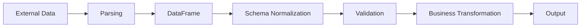
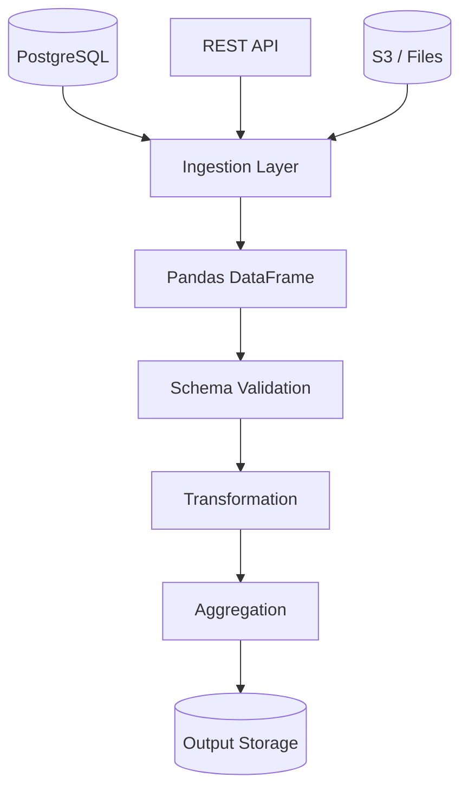

# 02- Pandas Data Model

## Overview

The Pandas data model defines how tabular data is represented, labeled, typed, aligned, transformed, and stored in memory.

Understanding this model is more important than memorizing individual Pandas methods. Most difficult Pandas bugs can be traced to incorrect assumptions about one of these properties:

```text
Object
  ↓
DataFrame / Series
  ↓
Index + Columns
  ↓
Values + dtypes
  ↓
Alignment
  ↓
Transformation
```

A production DataFrame should be treated as a structured data object with a schema, row grain, labels, and type semantics rather than simply as a Python container.

This mental model determines how Pandas behaves when working with:

- SQL query results.
- REST API responses.
- CSV and JSON files.
- Parquet datasets.
- ETL pipelines.
- Reporting data.
- Batch processing.
- Data validation.

## Core Pandas Objects

Pandas is primarily built around:

```text
Series
DataFrame
Index
```

These objects have different responsibilities.

| Object | Dimensions | Primary role |
|---|---:|---|
| `Series` | 1 | Labeled one-dimensional data |
| `DataFrame` | 2 | Labeled tabular data |
| `Index` | 1 | Labels for an axis |

A DataFrame can be modeled as:

```text
DataFrame
├── Index
├── Columns
│   ├── Series
│   ├── Series
│   └── Series
└── Values
```

Each column is a Series, while the DataFrame provides the shared row index and column labels.

## DataFrame Anatomy

Consider:

```python
import pandas as pd

orders = pd.DataFrame(
    {
        "order_id": [1001, 1002, 1003],
        "customer_id": [10, 20, 10],
        "status": [
            "completed",
            "pending",
            "completed",
        ],
        "amount": [250.0, 175.5, 500.0],
    }
)
```

Conceptually:

```text
           order_id  customer_id     status  amount
Index
0              1001           10  completed   250.0
1              1002           20     pending   175.5
2              1003           10  completed   500.0
```

The object contains distinct pieces of metadata:

```python
orders.index
orders.columns
orders.dtypes
orders.shape
```

These are not interchangeable concepts.

## DataFrame Axes

A DataFrame has two axes:

```text
Axis 0 → rows / index
Axis 1 → columns
```

For example:

```python
orders.shape
```

might return:

```text
(3, 4)
```

meaning:

```text
3 rows
4 columns
```

Many Pandas APIs accept an `axis` argument, although modern code often reads more clearly when explicit methods such as `drop(columns=...)` or `drop(index=...)` are used.

## Series as a DataFrame Column

A DataFrame column is a Series:

```python
amounts = orders["amount"]
```

The resulting object retains the same row index:

```python
amounts.index
```

and has its own dtype:

```python
amounts.dtype
```

Conceptually:

```text
DataFrame
    │
    ├── order_id → Series
    ├── customer_id → Series
    ├── status → Series
    └── amount → Series
```

This explains why operations on individual columns are often expressed through Series APIs.

## Row Grain

One of the most important engineering properties of a DataFrame is **row grain**.

Row grain means:

> What does one row represent?

Examples:

```text
orders
→ one row per order

order_items
→ one row per order item

customers
→ one row per customer

customer_daily_metrics
→ one row per customer per day
```

The DataFrame may look structurally correct even when its grain is wrong.

This becomes critical during:

- Joins.
- Aggregations.
- Deduplication.
- Validation.
- Reporting.

## Why Row Grain Matters

Suppose:

```text
orders
1001
1002
```

contains one row per order.

Then joining with:

```text
order_items
1001 → item A
1001 → item B
```

produces:

```text
1001 → item A
1001 → item B
```

The order now appears twice.

If revenue is aggregated after this join, the order amount may be counted twice.

The problem is not a Pandas syntax error. It is a **data-model error**.

Senior-level Pandas code always asks:

```text
What does one row represent before the operation?
What does one row represent after the operation?
```

## Index

The Index provides labels for rows.

```python
orders.index
```

For a default DataFrame this may be:

```text
0
1
2
```

The index can also represent domain-relevant labels:

```python
orders = orders.set_index(
    "order_id"
)
```

Now:

```text
1001
1002
1003
```

are row labels.

The Pandas Index is an in-memory labeling and alignment mechanism. It is not the same thing as a database index such as a PostgreSQL B-tree index.

## Column Labels

Columns represent named fields:

```python
orders.columns
```

For example:

```text
order_id
customer_id
status
amount
```

Column names form part of the DataFrame schema.

Stable column naming is particularly important when DataFrames move between:

```text
API
 ↓
Pandas
 ↓
Validation
 ↓
Database
```

Unexpected column-name changes can break downstream jobs even when the values themselves remain valid.

## Dtypes

Each Series has a dtype:

```python
orders["amount"].dtype
```

Dtypes determine how Pandas interprets values.

Common types include:

```text
Integer
Floating point
Boolean
String
Datetime
Timedelta
Categorical
Nullable extension dtypes
```

For example:

```python
orders["customer_id"] = (
    orders["customer_id"].astype("Int64")
)
```

makes the intended nullable integer semantics explicit.

Dtypes influence:

- Comparisons.
- Arithmetic.
- Missing-value behavior.
- Grouping.
- Sorting.
- Memory usage.
- Serialization.

## Logical Type vs Physical Type

A critical engineering distinction is:

```text
Logical business type
        vs
Physical Pandas dtype
```

For example:

```text
customer_id
```

is logically an identifier.

It may be physically represented as:

```text
Int64
string
```

depending on the source system and identifier format.

Likewise:

```text
order_amount
```

is logically monetary data, but the physical dtype might be:

```text
float64
```

which may not be appropriate for exact financial calculations.

The data model should preserve business meaning, not merely whatever dtype automatic inference happened to choose.

## Schema

A practical DataFrame schema can be thought of as:

```text
Column
+ Logical meaning
+ Physical dtype
+ Nullability
+ Constraints
+ Grain
```

For example:

| Column | Logical meaning | Dtype | Nullability | Example constraint |
|---|---|---|---|---|
| `order_id` | Order identifier | `Int64` | No | Unique |
| `customer_id` | Customer identifier | `Int64` | No | Existing customer |
| `status` | Order state | `string` | No | Allowed values |
| `amount` | Order amount | `Float64` | No | `>= 0` |
| `created_at` | Creation timestamp | Datetime | No | Valid timestamp |

Pandas itself does not enforce all of these business rules. The application must validate them.

## DataFrame Construction

A DataFrame can be constructed from Python mappings:

```python
orders = pd.DataFrame(
    {
        "order_id": [1001, 1002],
        "amount": [250.0, 175.5],
    }
)
```

From records:

```python
records = [
    {
        "order_id": 1001,
        "amount": 250.0,
    },
    {
        "order_id": 1002,
        "amount": 175.5,
    },
]

orders = pd.DataFrame(
    records
)
```

From database results:

```python
orders = pd.read_sql(
    query,
    connection,
)
```

From APIs:

```python
orders = pd.json_normalize(
    payload["orders"]
)
```

The construction mechanism changes, but the resulting DataFrame still follows the same data model.

## Alignment

Pandas uses labels for alignment in many operations.

Consider:

```python
left = pd.Series(
    [100, 200],
    index=["A", "B"],
)

right = pd.Series(
    [10, 20],
    index=["B", "A"],
)

result = left + right
```

Pandas aligns:

```text
A → 100 + 20
B → 200 + 10
```

rather than simply combining values by physical position.

This is one of Pandas' most useful features for labeled data and one of its most important sources of confusion for developers coming from plain Python lists or NumPy positional operations.

## Alignment During Assignment

Alignment also affects assignment.

```python
discounts = pd.Series(
    [10, 20],
    index=[1, 0],
)

orders["discount"] = discounts
```

Pandas aligns the Series to the DataFrame's index labels.

This means the values are associated with matching labels rather than necessarily being inserted according to physical order.

When positional assignment is intended, use an explicitly positional representation such as:

```python
orders["discount"] = discounts.to_numpy()
```

only when the lengths and positional semantics are intentionally guaranteed.

## Missing Labels

Alignment can introduce missing values.

```python
left = pd.Series(
    [100, 200],
    index=["A", "B"],
)

right = pd.Series(
    [10, 20],
    index=["B", "C"],
)

result = left + right
```

The result has labels:

```text
A
B
C
```

with missing values where one side lacks the matching label.

This behavior is powerful but means label mismatches must be considered during transformations.

## Immutability vs Mutation

Pandas operations fall broadly into:

```text
Return transformed object
```

or:

```text
Mutate an existing object
```

For example:

```python
normalized = orders.rename(
    columns={
        "amount": "order_amount"
    }
)
```

returns a transformed DataFrame.

Whereas:

```python
orders["status"] = (
    orders["status"]
    .astype("string")
    .str.lower()
)
```

assigns a new Series into the existing DataFrame.

A production codebase should make ownership and mutation expectations clear.

## Copy-on-Write

Modern Pandas includes copy-on-write behavior as part of its data-management model.

Conceptually:

```text
DataFrame A
    │
    └── Shared data
            │
            └── Read by another object

Write requested
      ↓
Isolation where required
      ↓
Mutation proceeds
```

The purpose is to reduce unnecessary copying while providing safer mutation behavior.

Application code should not depend on undocumented internal sharing details. When independent ownership is semantically important, use explicit copying:

```python
processed = orders.copy()
```

## Views and Copies

A DataFrame subset may historically have been either a view or a copy depending on how it was produced.

This is why patterns such as:

```python
subset = orders[
    orders["amount"] > 100
]

subset["priority"] = True
```

have historically required care.

When independent mutation is intended:

```python
subset = orders.loc[
    orders["amount"].gt(100)
].copy()
```

This makes ownership explicit.

The broader lesson is:

> Do not make production correctness depend on subtle view-versus-copy behavior.

## DataFrame vs SQL Table

A DataFrame resembles a SQL result set but is not equivalent to a relational table.

| Characteristic | Pandas DataFrame | SQL table |
|---|---|---|
| Primary purpose | In-memory processing | Persistent relational storage |
| Persistence | Process lifetime unless serialized | Durable |
| Schema constraints | Mostly application-managed | Database-enforced |
| Transactions | Not transactional | Supported |
| Concurrency | Process-level semantics | Database concurrency |
| Query engine | Pandas operations | Database optimizer |
| Storage | Memory | Disk / storage engine |
| Index | Labeling structure | Physical/access structure |

This distinction determines where processing should happen.

## DataFrame vs NumPy Array

Pandas builds on array-oriented concepts but adds labels and heterogeneous columns.

| Characteristic | DataFrame | NumPy `ndarray` |
|---|---|---|
| Labels | Yes | No native row/column labels |
| Column dtypes | Can differ | One dtype per array |
| Tabular semantics | Strong | Generic n-dimensional |
| Alignment | Label-aware | Primarily positional |
| SQL-like operations | Rich | Limited |
| Typical use | Business/tabular data | Numerical computation |

Pandas is often the better abstraction when the data has named fields and business-level tabular semantics.

## DataFrame Operations and Output Shape

Every transformation should be understood in terms of how it changes:

```text
Rows
Columns
Index
Dtypes
Grain
```

For example:

```python
filtered = orders.loc[
    orders["status"].eq("completed")
]
```

typically changes:

```text
Rows → fewer
Columns → same
Index → preserved
Grain → unchanged
```

An aggregation:

```python
summary = (
    orders
    .groupby(
        "customer_id",
        as_index=False,
    )
    .agg(
        total_amount=("amount", "sum")
    )
)
```

changes:

```text
Rows → fewer
Columns → different
Index → flat output with as_index=False
Grain → one row per customer
```

Thinking in these terms prevents many transformation errors.

## Inspection as Part of the Data Model

Useful properties include:

```python
orders.shape
orders.columns
orders.index
orders.dtypes
orders.empty
```

For broader inspection:

```python
orders.info()
orders.head()
orders.describe()
```

Inspection is not merely debugging. It verifies whether assumptions about the DataFrame remain true after each pipeline stage.

## Data Contracts

A production DataFrame often has an implicit contract.

For example:

```text
Input:
    one row per order

Required columns:
    order_id
    customer_id
    amount
    status

Constraints:
    order_id unique
    amount >= 0
    status in known set

Output:
    one row per completed customer
```

Making these assumptions explicit allows data-processing stages to be tested and monitored.

## Example Contract Validation

```python
import pandas as pd


def validate_orders(
    df: pd.DataFrame,
) -> None:
    required = {
        "order_id",
        "customer_id",
        "status",
        "amount",
    }

    missing = required.difference(
        df.columns
    )

    if missing:
        raise ValueError(
            f"Missing columns: {sorted(missing)}"
        )

    if df["order_id"].duplicated().any():
        raise ValueError(
            "order_id must be unique"
        )

    if df["amount"].isna().any():
        raise ValueError(
            "amount must not be null"
        )

    if df["amount"].lt(0).any():
        raise ValueError(
            "amount must not be negative"
        )
```

Pandas provides the mechanics, while the application defines what "valid" means.

## External Data to DataFrame

A robust architecture treats conversion from an external source as a boundary.



For example:

```text
REST API
   ↓
JSON
   ↓
json_normalize()
   ↓
DataFrame
   ↓
dtype normalization
   ↓
validation
   ↓
ETL
```

This is preferable to mixing parsing assumptions throughout business logic.

## Data Model and Joins

Before a join:

```text
orders
→ one row per order

customers
→ one row per customer
```

A many-to-one join:

```python
orders.merge(
    customers,
    on="customer_id",
    how="left",
    validate="many_to_one",
)
```

preserves order-level grain.

But if `customers` contains duplicate `customer_id` values, the join can unexpectedly multiply rows.

The data model should therefore include key constraints and join cardinality assumptions.

## Data Model and Aggregation

Aggregation changes row grain.

For example:

```python
customer_totals = (
    orders
    .groupby(
        "customer_id",
        as_index=False,
    )
    .agg(
        total_amount=("amount", "sum"),
    )
)
```

Input:

```text
one row per order
```

Output:

```text
one row per customer
```

This change should be documented mentally and, for important pipelines, in code or tests.

## Data Model and Serialization

Serialization can change some DataFrame properties.

For example:

```python
orders.to_csv(
    "orders.csv",
    index=False,
)
```

does not preserve the Pandas Index as an index because it is intentionally excluded.

Parquet can preserve richer type information:

```python
orders.to_parquet(
    "orders.parquet",
    index=False,
)
```

When data crosses a storage boundary, validate what properties must survive:

```text
Columns
Values
Dtypes
Nullability
Order
Index semantics
Timezone semantics
```

Do not assume every serialization format preserves every Pandas property identically.

## Memory Representation

A DataFrame is an in-memory object and can require substantially more memory than the raw source file.

For example:

```text
10 MB CSV
```

does not imply:

```text
10 MB DataFrame
```

Parsing, Python objects, dtype choices, indexes, and temporary transformations can increase memory use.

This matters for:

- Docker containers.
- Kubernetes workers.
- Celery tasks.
- AWS Batch.
- Local development on limited machines.

## Dtype and Memory

Dtype choices can materially affect memory.

For example, a high-cardinality textual identifier may need a string representation, while a low-cardinality status column may be a candidate for categorical representation.

```python
orders["status"] = orders["status"].astype(
    "category"
)
```

Categorical dtype can reduce memory and sometimes improve operations such as grouping, but it is not universally beneficial.

Measure the actual workload.

## Backend Data Flow

A typical backend data-processing system might be:



The DataFrame is an intermediate processing representation.

It does not need to become the permanent source of truth.

## Data Model in Batch Processing

A Celery or Kubernetes batch job might follow:

```text
Input partition
      ↓
Read DataFrame
      ↓
Validate schema
      ↓
Normalize dtypes
      ↓
Transform
      ↓
Validate output
      ↓
Write partition
```

This architecture makes failures easier to isolate.

For example, a schema mismatch can fail before expensive transformation begins.

## Data Model in API Applications

Avoid treating a large DataFrame as a normal request object.

For FastAPI:

```text
HTTP request
   ↓
Request validation
   ↓
Background job
   ↓
Pandas processing
   ↓
Persist result
   ↓
HTTP status / job result
```

Large transformations can cause request latency, memory pressure, and concurrency problems when performed directly inside synchronous request handlers.

## Data Model and Kafka

Kafka events are usually message-oriented, while Pandas is tabular.

A useful micro-batch architecture is:

```text
Kafka messages
      ↓
Batch consumer
      ↓
Records
      ↓
DataFrame
      ↓
Validation
      ↓
Transformation
      ↓
Storage
```

The DataFrame's row grain should be explicit:

```text
one row per event
```

before grouping or deduplication changes it.

For very high-throughput streaming, a streaming-native architecture may be more appropriate than repeatedly constructing large DataFrames.

## Performance Considerations

Data-model decisions affect performance.

Important dimensions include:

```text
Number of rows
Number of columns
Dtypes
Index type
Memory usage
Copies
Intermediate DataFrames
Join cardinality
Groupby cardinality
```

A few practical rules:

```text
Load only required columns
↓
Normalize dtypes early
↓
Avoid unnecessary copies
↓
Filter early where semantics allow
↓
Use efficient formats
↓
Chunk large workloads
```

These are workload-dependent recommendations rather than universal guarantees.

## Reliability Considerations

A predictable DataFrame should have:

```text
Stable schema
Known grain
Known dtypes
Known nullability
Known identifier semantics
Known transformation contract
```

When one of these properties changes unexpectedly, downstream systems should detect it.

Validation should happen at important boundaries:

```text
Input boundary
   ↓
After normalization
   ↓
Before persistence
```

## Security Considerations

The DataFrame should contain only data necessary for the task.

Avoid carrying sensitive fields through every transformation stage.

For example:

```python
orders = pd.read_sql(
    """
    SELECT
        order_id,
        customer_id,
        amount
    FROM orders
    WHERE created_at >= %s
    """,
    connection,
    params=[start_date],
)
```

Do not load unnecessary:

```text
passwords
authentication tokens
payment secrets
private metadata
```

into a DataFrame just because the source query contains them.

Also avoid logging entire DataFrames during production debugging.

## Common Mistakes

### Treating a DataFrame as an Untyped List

This ignores labels, dtypes, alignment, and schema.

**Better:** reason about the DataFrame's index, columns, dtypes, and grain.

### Ignoring Row Grain

A join or aggregation can change the meaning of each row.

**Better:** define the row grain before and after major transformations.

### Confusing Index with Database Index

A Pandas Index labels data in memory; a PostgreSQL index is a storage/access structure.

### Assuming Position When Pandas Uses Labels

Series operations frequently align by index.

**Better:** explicitly choose label-based or positional semantics.

### Trusting Automatic Dtype Inference

External input may produce incorrect or inconsistent types.

**Better:** normalize important dtypes explicitly.

### Ignoring Nullability

A numeric column can still contain missing values.

**Better:** use appropriate nullable dtypes and validate required fields.

### Copying Every DataFrame

This creates unnecessary memory usage.

**Better:** define ownership and copy only when independence is required.

### Treating Successful Execution as Valid Data

A transformation can complete successfully while producing semantically incorrect results.

**Better:** validate schema, grain, values, uniqueness, and row counts.

### Loading Sensitive Columns Unnecessarily

This expands the security and memory surface.

**Better:** project only required fields at the source.

### Treating Pandas as a Database

Pandas does not provide database transactions, durable storage, relational constraints, or database-scale query planning.

**Better:** use each system for the responsibility it handles best.

## Interview Traps

### What Are the Main Components of a DataFrame?

A DataFrame has labeled axes, columns represented by Series, underlying values, and dtype information.

### What Is the Difference Between a DataFrame and a Series?

A Series is one-dimensional labeled data; a DataFrame is a two-dimensional labeled table composed of columns.

### Why Does Pandas Have an Index?

The Index provides labels used for selection, alignment, reindexing, joins, and time-series operations.

### Does the Index Have to Be Unique?

No. Pandas allows duplicate index labels, although many operations become less predictable or less convenient when index uniqueness is not guaranteed.

### Why Can Adding Two Series Produce Missing Values?

Pandas aligns the Series by index labels. Labels that exist on only one side produce missing results for the unmatched side.

### What Is Row Grain?

It defines what one row represents, such as one order, one event, or one customer per day.

### Why Is Row Grain Important for Joins?

Incorrect join cardinality can multiply rows and produce incorrect aggregates.

### How Is a DataFrame Different from a SQL Table?

A DataFrame is an in-memory processing structure, while a SQL table is persistent relational storage with database-level query planning, constraints, transactions, and concurrency mechanisms.

### Why Can a DataFrame Use More Memory Than Its Source File?

The in-memory representation, dtypes, indexes, Python objects, and temporary transformations can require substantially more memory than the serialized source.

### Why Should Dtypes Be Explicitly Controlled?

Because external formats often provide ambiguous or inconsistent physical types, while downstream Pandas operations may depend on predictable dtype semantics.

### When Should DataFrame Grain Change?

When the business operation intentionally changes the level of detail, such as converting order-level data into customer-level aggregates.

## Practical Data Model Checklist

```text
[ ] What does one row represent?
[ ] What are the required columns?
[ ] What is the logical type of each field?
[ ] What is the physical Pandas dtype?
[ ] Which fields can be null?
[ ] Which identifiers must be unique?
[ ] What does the Index represent?
[ ] Is the Index required downstream?
[ ] Are operations label-based or positional?
[ ] Could alignment introduce missing values?
[ ] Does the transformation change row grain?
[ ] Could a join multiply rows?
[ ] What schema should exist after transformation?
[ ] Is the DataFrame mutated or returned as a new object?
[ ] Are unnecessary copies increasing memory usage?
[ ] Are sensitive columns being carried unnecessarily?
[ ] Will the DataFrame fit comfortably within worker memory?
[ ] What properties must survive serialization?
```

## Key Takeaways

- A Pandas DataFrame is a labeled, typed tabular object composed of columns, an Index, values, metadata, and dtype semantics; it should not be treated as a generic list of rows.
- Row grain is a first-class data-model property: every important transformation should be understood in terms of what one row represents before and after the operation.
- Pandas alignment is label-based in many operations, making the Index central to correct arithmetic, assignment, joins, and reindexing.
- Production DataFrames should have explicit schema, dtype, nullability, uniqueness, and transformation contracts, with validation at important pipeline boundaries.
- Data-model decisions directly affect correctness, memory usage, performance, security, and integration with PostgreSQL, APIs, Parquet, batch workers, and downstream reporting systems.