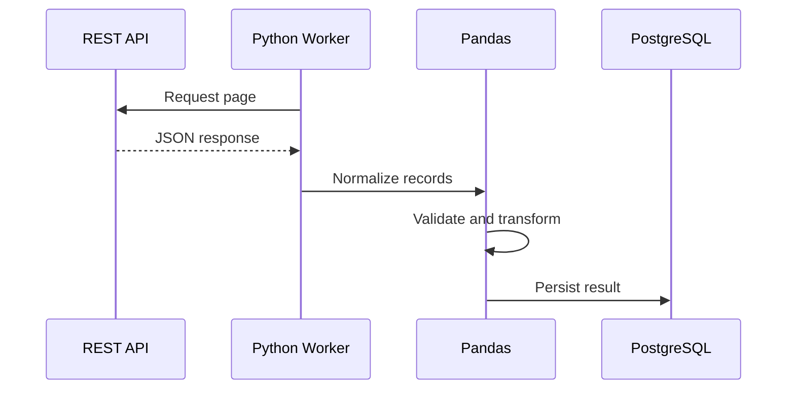

# 04- Dataframe

## Overview

A Pandas `DataFrame` is the primary tabular data structure used for structured data processing in Python.

It represents data as labeled rows and columns, where each column is a `Series` with its own dtype and the entire table shares row-index metadata.

A useful mental model is:

```text
DataFrame
├── Index
├── Columns
│   ├── Series
│   ├── Series
│   └── Series
└── Values
```

In backend and data-engineering systems, a DataFrame commonly acts as an intermediate representation between external systems:

```text
PostgreSQL / REST API / CSV / JSON / Parquet
                    ↓
                DataFrame
                    ↓
        Clean / Validate / Transform
                    ↓
        Aggregate / Enrich / Report
                    ↓
       PostgreSQL / S3 / API / Files
```

Understanding the DataFrame model is essential before working with filtering, joins, grouping, reshaping, missing data, and performance optimization.

## What Is a DataFrame?

A DataFrame is a two-dimensional labeled data structure.

Example:

```python
import pandas as pd

orders = pd.DataFrame(
    {
        "order_id": [1001, 1002, 1003],
        "customer_id": [101, 102, 101],
        "status": [
            "completed",
            "pending",
            "completed",
        ],
        "amount": [250.0, 175.5, 500.0],
    }
)
```

Conceptually:

```text
   order_id  customer_id     status  amount
0      1001           101  completed   250.0
1      1002           102     pending   175.5
2      1003           101  completed   500.0
```

The DataFrame contains:

```text
3 rows
4 columns
1 index
4 Series
```

A DataFrame is more than a rectangular collection of values because its labels, dtypes, and alignment semantics are part of the object.

## Why DataFrames Exist

Backend systems frequently operate on records that share a schema:

```text
Orders
Customers
Products
Transactions
Employees
Events
Reports
```

A DataFrame provides a convenient abstraction for processing those records in bulk.

Instead of operating on individual rows:

```python
for order in orders:
    ...
```

you can operate on entire columns:

```python
orders["amount"] * 1.18
```

This enables:

- Vectorized computation.
- Bulk filtering.
- Grouping and aggregation.
- Relational-style joins.
- Missing-value handling.
- Type-aware transformations.
- Efficient file and database integration.

## DataFrame Anatomy

A DataFrame can be described through five important concepts:

```text
Index
Columns
Series
Dtypes
Values
```

Inspect them with:

```python
orders.index
orders.columns
orders.dtypes
orders.shape
```

For example:

```python
print(orders.index)
print(orders.columns)
print(orders.dtypes)
print(orders.shape)
```

Understanding these properties makes it easier to reason about the result of every transformation.

## Index

The Index labels rows.

For a newly constructed DataFrame:

```python
orders.index
```

may return a default `RangeIndex`:

```text
0
1
2
```

The index does not necessarily represent a business identifier.

If required, a business column can become the index:

```python
orders = orders.set_index(
    "order_id"
)
```

Now:

```text
order_id
1001
1002
1003
```

are row labels.

A Pandas Index is an in-memory labeling mechanism. It is not equivalent to a PostgreSQL database index.

## Columns

Columns define the visible fields of the DataFrame:

```python
orders.columns
```

Example:

```text
Index([
    "order_id",
    "customer_id",
    "status",
    "amount",
])
```

A DataFrame column is a Series:

```python
amounts = orders["amount"]
```

The resulting Series shares the DataFrame's row index.

## Selecting a Single Column

Use:

```python
orders["amount"]
```

This returns a `Series`.

```text
DataFrame
    ↓
one column
    ↓
Series
```

This distinction matters because the return type determines which operations are available and how subsequent code behaves.

## Selecting Multiple Columns

Use a list of column labels:

```python
subset = orders[
    [
        "order_id",
        "amount",
    ]
]
```

This returns a DataFrame.

The distinction is:

```python
orders["amount"]           # Series
orders[["amount"]]         # DataFrame
```

This small difference is a frequent source of bugs in reusable transformation code.

## DataFrame Shape

`shape` returns:

```text
(rows, columns)
```

Example:

```python
orders.shape
```

might return:

```text
(10000, 8)
```

meaning:

```text
10,000 rows
8 columns
```

Use shape when validating structural expectations:

```python
if orders.shape[1] != 8:
    raise ValueError(
        "Unexpected number of columns"
    )
```

For production validation, explicit column-name checks are usually stronger than relying only on the number of columns.

## DataFrame Size

`size` represents the number of elements:

```python
orders.size
```

For:

```text
10,000 rows
8 columns
```

the result is:

```text
80,000
```

It does not represent memory usage in bytes.

For memory inspection:

```python
orders.memory_usage(
    deep=True
).sum()
```

## DataFrame Dimensions

`ndim` reports the number of dimensions:

```python
orders.ndim
```

A DataFrame has:

```text
ndim = 2
```

A Series has:

```text
ndim = 1
```

In normal application code, `shape`, columns, and dtypes are usually more useful than `ndim`.

## DataFrame Dtypes

Each DataFrame column can have a different dtype:

```python
orders.dtypes
```

Example:

```text
order_id        Int64
customer_id     Int64
status         string
amount        Float64
```

This heterogeneous-column model distinguishes DataFrames from homogeneous NumPy arrays.

Dtypes influence:

- Arithmetic.
- Comparisons.
- Missing values.
- Sorting.
- Grouping.
- Joins.
- Serialization.
- Memory consumption.

## Logical Schema vs Physical Dtype

A business field has a logical meaning independent of its physical representation.

For example:

```text
order_id
```

is logically an identifier.

It may be physically represented as:

```text
Int64
string
```

Likewise:

```text
amount
```

may be represented as a floating-point dtype, although the application's financial precision requirements may call for a different representation.

Production pipelines should reason about both:

```text
Logical schema
+
Physical dtype
```

## Row Grain

The DataFrame's row grain defines what a single row represents.

Examples:

```text
orders
→ one row per order

order_items
→ one row per order item

customers
→ one row per customer

daily_sales
→ one row per day
```

Always understand row grain before using:

```text
merge()
groupby()
drop_duplicates()
```

because these operations can change either the number of rows or the meaning of each row.

## Row Grain and Aggregation

Suppose:

```text
orders
→ one row per order
```

After:

```python
customer_summary = (
    orders
    .groupby(
        "customer_id",
        as_index=False,
    )
    .agg(
        total_amount=("amount", "sum")
    )
)
```

the result is:

```text
customer_summary
→ one row per customer
```

The aggregation changed the grain.

This should be deliberate and documented mentally before downstream transformations.

## Row Grain and Joins

Suppose:

```text
orders
→ one row per order

customers
→ one row per customer
```

Then:

```python
orders.merge(
    customers,
    on="customer_id",
    how="left",
    validate="many_to_one",
)
```

preserves order-level grain if `customer_id` is unique in `customers`.

If the customer DataFrame contains duplicate IDs, the join can multiply rows.

The resulting problem is a data-model defect, not merely a Pandas implementation detail.

## DataFrame Construction

A DataFrame can be constructed from a dictionary of lists:

```python
orders = pd.DataFrame(
    {
        "order_id": [1001, 1002],
        "amount": [250.0, 175.5],
    }
)
```

From records:

```python
records = [
    {
        "order_id": 1001,
        "amount": 250.0,
    },
    {
        "order_id": 1002,
        "amount": 175.5,
    },
]

orders = pd.DataFrame(records)
```

From a database:

```python
orders = pd.read_sql(
    query,
    connection,
)
```

From nested API data:

```python
orders = pd.json_normalize(
    payload["orders"]
)
```

The source changes, but the resulting object follows the same DataFrame data model.

## Creating an Empty DataFrame

When an empty DataFrame represents a valid state, define its schema explicitly:

```python
orders = pd.DataFrame(
    {
        "order_id": pd.Series(
            dtype="Int64"
        ),
        "customer_id": pd.Series(
            dtype="Int64"
        ),
        "amount": pd.Series(
            dtype="Float64"
        ),
        "status": pd.Series(
            dtype="string"
        ),
    }
)
```

This is useful in production pipelines because downstream code can rely on predictable columns and dtypes even when there are zero rows.

## Column Alignment During Construction

When constructing a DataFrame from Series, Pandas aligns them by index:

```python
customer_ids = pd.Series(
    [101, 102],
    index=[1001, 1002],
    name="customer_id",
)

amounts = pd.Series(
    [250.0, 175.5],
    index=[1002, 1001],
    name="amount",
)

orders = pd.concat(
    [
        customer_ids,
        amounts,
    ],
    axis=1,
)
```

Pandas matches:

```text
1001 → customer_id 101, amount 175.5
1002 → customer_id 102, amount 250.0
```

This is label alignment rather than positional assignment.

## Assignment

A new column can be assigned directly:

```python
orders["total"] = (
    orders["quantity"]
    * orders["unit_price"]
)
```

Pandas aligns the assigned Series to the DataFrame's index when assignment is label-aware.

This is one reason DataFrame indexes must be understood rather than ignored.

## Vectorized Transformation

Prefer column-oriented operations:

```python
orders["total"] = (
    orders["quantity"]
    * orders["unit_price"]
)
```

over row iteration:

```python
for index, row in orders.iterrows():
    orders.loc[
        index,
        "total",
    ] = (
        row["quantity"]
        * row["unit_price"]
    )
```

Vectorized operations are generally clearer and more efficient because they avoid a Python function call for every row.

## Filtering

DataFrame filtering commonly uses boolean masks:

```python
completed = orders.loc[
    orders["status"].eq("completed")
]
```

Multiple conditions:

```python
large_completed = orders.loc[
    orders["status"].eq("completed")
    & orders["amount"].ge(500)
]
```

Each condition returns a boolean Series aligned with the DataFrame's index.

## Missing Values

Missing values can be detected across the DataFrame:

```python
orders.isna()
```

or counted:

```python
missing_by_column = (
    orders.isna().sum()
)
```

Missing-value handling should be based on the business meaning of the field.

For example:

```python
cleaned = orders.dropna(
    subset=[
        "order_id",
        "customer_id",
        "amount",
    ]
)
```

This is appropriate only if those fields are required for downstream processing.

## Duplicate Records

DataFrame-level duplicate detection:

```python
duplicates = orders.duplicated(
    subset=["order_id"]
)
```

Remove duplicates:

```python
orders = orders.drop_duplicates(
    subset=["order_id"],
    keep="last",
)
```

The identity columns and retention policy must match the source system's semantics.

For event data, duplicate identifiers may indicate retries rather than invalid business records.

## Renaming Columns

Use `rename()` for schema normalization:

```python
orders = orders.rename(
    columns={
        "customerId": "customer_id",
        "orderAmount": "amount",
    }
)
```

This is useful when converting an external API schema into an internal canonical schema.

## Adding Multiple Columns

`assign()` works well in transformations:

```python
orders = orders.assign(
    subtotal=lambda df: (
        df["quantity"]
        * df["unit_price"]
    ),
    tax=lambda df: (
        df["subtotal"] * 0.18
    ),
)
```

This creates a readable transformation pipeline without mutating the original DataFrame through multiple statements.

## Sorting

Sort rows using:

```python
sorted_orders = orders.sort_values(
    "amount",
    ascending=False,
)
```

Multiple columns:

```python
sorted_orders = orders.sort_values(
    [
        "customer_id",
        "amount",
    ],
    ascending=[
        True,
        False,
    ],
)
```

Sorting can be expensive on large datasets, especially when performed repeatedly.

## Grouping

Grouping creates partitions based on one or more keys:

```python
grouped = orders.groupby(
    "customer_id"
)
```

Aggregation:

```python
summary = (
    orders
    .groupby(
        "customer_id",
        as_index=False,
    )
    .agg(
        order_count=("order_id", "count"),
        total_amount=("amount", "sum"),
    )
)
```

Grouping should be evaluated in terms of output grain and cardinality.

## Joining

DataFrame joins resemble relational operations:

```python
enriched = orders.merge(
    customers,
    on="customer_id",
    how="left",
)
```

For production use, specify cardinality where known:

```python
enriched = orders.merge(
    customers,
    on="customer_id",
    how="left",
    validate="many_to_one",
)
```

This provides a runtime check against unexpected row multiplication.

## Concatenation

Use `concat()` when stacking compatible DataFrames:

```python
all_orders = pd.concat(
    [
        january_orders,
        february_orders,
    ],
    ignore_index=True,
)
```

This is fundamentally different from `merge()`:

```text
concat
→ stack datasets

merge
→ relate datasets by keys
```

Using the wrong operation can silently produce an incorrect data model.

## Method Chaining

A DataFrame transformation can be expressed as a pipeline:

```python
report = (
    orders
    .loc[
        orders["status"].eq("completed")
    ]
    .assign(
        total=lambda df: (
            df["quantity"]
            * df["unit_price"]
        )
    )
    .groupby(
        "customer_id",
        as_index=False,
    )
    .agg(
        total_amount=("total", "sum")
    )
    .sort_values(
        "total_amount",
        ascending=False,
    )
)
```

Method chaining works well when the transformation is linear and each stage has a clear purpose.

Complex business logic should be moved into named functions rather than hidden inside a single giant expression.

## Copying a DataFrame

Assignment does not create an independent object:

```python
processed = orders
```

Both variables refer to the same DataFrame.

When independent ownership is required:

```python
processed = orders.copy()
```

For subsets:

```python
completed = orders.loc[
    orders["status"].eq("completed")
].copy()
```

Avoid copying entire large DataFrames without a reason because copies can increase memory usage significantly.

## Mutation and Functional Transformations

Some operations return transformed objects:

```python
normalized = orders.rename(
    columns={
        "amount": "order_amount"
    }
)
```

Others explicitly assign values:

```python
orders["amount"] = (
    orders["amount"] * 1.18
)
```

A production codebase should make the mutation contract clear.

A reusable transformation function can prefer input preservation:

```python
def normalize_orders(
    df: pd.DataFrame,
) -> pd.DataFrame:
    return (
        df
        .assign(
            status=lambda x: (
                x["status"]
                .astype("string")
                .str.strip()
                .str.lower()
            )
        )
    )
```

## DataFrame and Copy-on-Write

Modern Pandas includes copy-on-write semantics that can reduce unnecessary physical copying in supported workflows.

The conceptual model is:

```text
Objects share data where possible
          ↓
Read
          ↓
No isolation required
          ↓
Write requested
          ↓
Isolate data where necessary
```

Application code should not depend on undocumented internal-sharing behavior.

When independent ownership is semantically important:

```python
result = source.copy()
```

is still a clear and useful boundary.

## DataFrame and NumPy

A DataFrame uses array-oriented storage internally but adds labels and heterogeneous column types.

For direct numerical processing:

```python
values = orders[
    "amount"
].to_numpy()
```

This can be appropriate when a downstream NumPy API explicitly requires an array.

However, converting too early discards label-aware Pandas semantics.

Prefer to remain in Pandas until positional NumPy semantics are actually required.

## DataFrame and SQL Tables

A DataFrame may resemble a SQL result set:

```text
order_id | customer_id | amount
```

but it is not a relational database table.

| Property | DataFrame | SQL Table |
|---|---|---|
| Storage | In-memory | Persistent |
| Transactions | No | Yes |
| Relational constraints | Application-managed | Database-enforced |
| Query optimizer | Limited to Pandas operations | Database optimizer |
| Concurrency | Process-level | Database-managed |
| Durability | Requires serialization | Built into storage |
| Index | Labeling structure | Access structure |

Use PostgreSQL for durable relational state and Pandas for in-memory tabular processing.

## DataFrame and REST APIs

A common service workflow is:



Pandas should normally receive already-retrieved payloads rather than owning the HTTP lifecycle.

Authentication, timeouts, retries, rate limits, and pagination belong in the transport layer.

## DataFrame in ETL

A production ETL flow may be:

```text
Source
  ↓
Read
  ↓
DataFrame
  ↓
Normalize
  ↓
Validate
  ↓
Transform
  ↓
Aggregate
  ↓
Persist
```

Example:

```python
processed = (
    raw_orders
    .assign(
        status=lambda df: (
            df["status"]
            .astype("string")
            .str.strip()
            .str.lower()
        ),
        amount=lambda df: pd.to_numeric(
            df["amount"],
            errors="coerce",
        ),
    )
    .dropna(
        subset=[
            "order_id",
            "customer_id",
            "amount",
        ]
    )
)
```

The DataFrame acts as the processing state between pipeline stages.

## DataFrame in Batch Jobs

A Celery or Kubernetes batch worker may use:

```text
Scheduler
   ↓
Worker
   ↓
Read input
   ↓
DataFrame
   ↓
Transform
   ↓
Validate
   ↓
Write output
```

A DataFrame should not be treated as durable state.

Important results should be persisted to:

```text
PostgreSQL
S3 / object storage
Parquet
Other durable systems
```

## DataFrame and Large Datasets

Pandas is primarily an in-memory processing tool.

The raw source size does not equal DataFrame memory usage.

For large datasets, consider:

```text
Select required columns
        ↓
Filter early
        ↓
Use efficient dtypes
        ↓
Avoid unnecessary copies
        ↓
Process chunks
```

Example:

```python
for chunk in pd.read_csv(
    "orders.csv",
    usecols=[
        "order_id",
        "customer_id",
        "amount",
    ],
    chunksize=100_000,
):
    process_chunk(chunk)
```

Chunking should be used only when the transformation can be designed correctly around bounded batches.

## Performance Considerations

The most expensive operations are often data-movement operations rather than simple column arithmetic.

Potentially expensive operations include:

- Large joins.
- Sorting.
- Grouping high-cardinality keys.
- Repeated copying.
- Python-level `apply()`.
- String-heavy transformations.
- Materializing large intermediate DataFrames.

Good practices include:

```text
Read less
Filter early
Project required columns
Normalize dtypes
Vectorize
Avoid repeated copies
Measure before optimizing
```

For database-backed workloads, perform suitable filtering and aggregation in SQL before loading the DataFrame.

## Memory Considerations

Estimate memory using:

```python
memory_bytes = (
    orders
    .memory_usage(deep=True)
    .sum()
)

memory_mb = memory_bytes / 1024**2
```

This is useful for monitoring batch workloads.

Peak memory can still exceed the final DataFrame's reported memory because intermediate objects may coexist during transformations.

In Docker or Kubernetes, configure worker memory limits with enough headroom for parser and transformation overhead.

## DataFrame Inspection

Common inspection operations:

```python
orders.head()
orders.tail()
orders.sample(5)
orders.info()
orders.describe()
orders.dtypes
orders.shape
```

For quality checks:

```python
orders.isna().sum()
orders.duplicated().sum()
orders["status"].value_counts(
    dropna=False
)
```

Inspection should verify assumptions rather than merely display data during development.

## Schema Validation

A basic production validation function:

```python
def validate_orders(
    df: pd.DataFrame,
) -> None:
    required = {
        "order_id",
        "customer_id",
        "status",
        "amount",
    }

    missing = required.difference(
        df.columns
    )

    if missing:
        raise ValueError(
            f"Missing columns: {sorted(missing)}"
        )

    if df["order_id"].duplicated().any():
        raise ValueError(
            "Duplicate order IDs detected"
        )

    if df["amount"].lt(0).any():
        raise ValueError(
            "Negative amounts detected"
        )
```

The DataFrame API supplies the mechanics; the application defines the business constraints.

## Empty DataFrames

An empty DataFrame is not necessarily an error.

For example:

```python
completed = orders.loc[
    orders["status"].eq("completed")
]
```

may legitimately produce zero rows.

The important distinction is:

```text
Expected no-data result
```

versus:

```text
Unexpected ingestion or transformation failure
```

Define expected behavior for both cases.

## DataFrame Output Contracts

Before writing a DataFrame to another system, define:

```text
Columns
Dtypes
Row grain
Nullability
Uniqueness
Sorting
Partitioning
```

Example:

```text
customer_id
→ unique

order_count
→ non-null integer

total_amount
→ non-null numeric
```

This gives downstream consumers a stable contract.

## Security Considerations

DataFrames frequently contain sensitive business information.

Avoid carrying unnecessary sensitive fields:

```text
passwords
authentication tokens
payment secrets
private customer metadata
```

Avoid logging entire DataFrames:

```python
logger.info(
    "orders=%s",
    orders,
)
```

Prefer safe metadata:

```python
logger.info(
    "orders_processed",
    extra={
        "row_count": len(orders),
        "column_count": len(orders.columns),
    },
)
```

Data minimization improves both security and memory efficiency.

## Reliability Considerations

Production DataFrame pipelines should be:

- Deterministic where possible.
- Explicit about schema.
- Explicit about row grain.
- Explicit about missing values.
- Safe to retry.
- Observable.
- Testable.

When a batch fails, the system should be able to determine:

```text
What input was processed?
How many rows entered?
How many were rejected?
What schema was expected?
Where did the failure occur?
Was an output published?
```

## Common Mistakes

### Treating a DataFrame Like a List

A DataFrame has indexes, labels, dtypes, alignment, and tabular semantics.

**Better:** reason about all of these properties.

### Ignoring Row Grain

This causes incorrect joins and aggregates.

**Better:** explicitly identify what one row represents.

### Using `iterrows()` for Bulk Transformation

This introduces Python-level row iteration.

**Better:** use vectorized operations.

### Confusing a Series with a One-Column DataFrame

```python
df["amount"]       # Series
df[["amount"]]     # DataFrame
```

### Ignoring Dtypes

Numeric-looking strings are not numeric values.

**Better:** inspect and normalize dtypes.

### Assuming the Index Is a Primary Key

The DataFrame index is a labeling mechanism and does not automatically enforce uniqueness.

### Copying Every DataFrame

This can create memory pressure.

**Better:** define ownership and copy only when independent data is required.

### Using `SELECT *` Before Creating a DataFrame

This transfers unnecessary data.

**Better:** select only required columns in SQL.

### Performing Large Joins Without Cardinality Validation

Unexpected duplicate keys can multiply rows.

**Better:**

```python
validate="many_to_one"
```

or another appropriate relationship.

### Filling All Missing Values Blindly

Replacing every missing value with zero or an empty string can destroy business semantics.

**Better:** define missing-value policies field by field.

### Logging Full DataFrames

This can expose sensitive information and create massive logs.

**Better:** log metadata and aggregate quality metrics.

### Assuming a Successful Transformation Means Valid Data

A DataFrame can be structurally valid while violating business rules.

**Better:** validate schema, grain, uniqueness, ranges, nullability, and allowed values.

### Using Pandas as a Database

Pandas does not replace database durability, transactionality, concurrency control, or query optimization.

## Interview Traps

### What Is a DataFrame?

A two-dimensional labeled Pandas data structure whose columns are Series and may have heterogeneous dtypes.

### What Are the Main Components of a DataFrame?

Index, columns, Series, values, dtypes, and associated metadata.

### What Is the Difference Between `df["column"]` and `df[["column"]]`?

The first returns a Series; the second returns a one-column DataFrame.

### What Is Row Grain?

The business meaning of one row, such as one order, one event, or one customer per day.

### Why Is Row Grain Important?

Joins and aggregations can change row counts and business meaning. Incorrect grain can produce silently incorrect reports.

### What Is the Difference Between `shape` and `size`?

`shape` returns row and column dimensions; `size` returns the total number of elements.

### Does `df.size` Tell You Memory Usage?

No. Use `memory_usage()` to inspect memory consumption.

### What Is the Difference Between a Pandas Index and a PostgreSQL Index?

A Pandas Index labels an in-memory axis and participates in alignment; a PostgreSQL index is a database access structure used to accelerate queries.

### Why Can a Merge Increase Row Count?

Duplicate join keys and one-to-many or many-to-many relationships can produce multiple output rows per input row.

### Why Use `validate=` in `merge()`?

It enforces an expected join-cardinality contract and can detect data-model violations.

### Why Prefer Vectorized DataFrame Operations?

They avoid Python-level row iteration and are generally more efficient and expressive for bulk tabular transformations.

### When Should Pandas Not Be Used for the Entire Dataset?

When the dataset exceeds practical worker memory limits, requires distributed computation, or should be processed more efficiently by a database or distributed engine.

### Why Can a DataFrame Require More Memory Than the Source File?

The in-memory representation, dtypes, index structures, Python objects, and temporary transformations can require considerably more memory than serialized data.

### Why Is an Explicit Schema Important?

External data formats can be ambiguous, and downstream transformations require predictable columns, dtypes, nullability, and grain.

## Practical Checklist

```text
[ ] What does one row represent?
[ ] What are the required columns?
[ ] What does the Index represent?
[ ] Are column names stable and intentional?
[ ] Are dtypes appropriate for the logical fields?
[ ] Can missing values occur?
[ ] Which fields must be unique?
[ ] Which operations preserve or change row grain?
[ ] Could a join multiply rows?
[ ] Is join cardinality validated?
[ ] Are transformations vectorized?
[ ] Are unnecessary copies being created?
[ ] Is the DataFrame within memory limits?
[ ] Should SQL perform filtering or projection first?
[ ] Are empty inputs valid?
[ ] Are schema and value rules validated?
[ ] Are sensitive columns necessary?
[ ] Are sensitive values excluded from logs?
[ ] Is the output contract explicit?
[ ] Is the pipeline retry-safe and observable?
```

## Key Takeaways

- A DataFrame is a labeled, typed two-dimensional structure composed of an Index and multiple Series; understanding these components is the foundation for reliable Pandas work.
- Row grain, column schema, dtype semantics, and index behavior are data-model properties that directly determine whether joins, aggregations, assignments, and transformations are correct.
- Prefer vectorized DataFrame operations, explicit schema validation, appropriate dtypes, and clear ownership boundaries instead of row-by-row loops, implicit assumptions, or unnecessary copies.
- In production systems, Pandas should operate as an in-memory processing layer integrated with databases, APIs, files, batch workers, and durable storage rather than as a replacement for those systems.
- Large DataFrames require deliberate memory, performance, security, and reliability engineering, including column projection, source-side filtering, bounded processing, validation, observability, and deterministic output contracts.