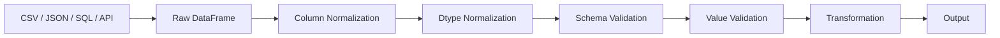

# 06- Columns And Dtypes

## Overview

Columns and dtypes define the schema and type semantics of a Pandas DataFrame.

A DataFrame is not simply a collection of values. Each column has a label, a logical business meaning, and a physical Pandas dtype that determines how values are stored, compared, transformed, aggregated, and serialized.

A practical model is:

```text
DataFrame
│
├── Column label
│
├── Logical field meaning
│
├── Pandas dtype
│
├── Missing-value semantics
│
└── Business constraints
```

For backend and data-engineering systems, correct column and dtype handling is critical when processing:

- Database query results.
- REST API payloads.
- CSV and JSON files.
- Parquet datasets.
- Financial records.
- Event streams.
- Reporting datasets.
- ETL pipelines.

The most important distinction is:

```text
Logical type
    ↓
What the field means

Physical dtype
    ↓
How Pandas represents it
```

Production-quality pipelines deliberately manage both.

## Columns as Schema

Columns represent named fields in the DataFrame:

```python
orders.columns
```

For example:

```text
order_id
customer_id
status
amount
created_at
```

A good column schema should make the intended data model obvious.

Example:

| Column | Logical meaning | Example |
|---|---|---|
| `order_id` | Order identifier | `1001` |
| `customer_id` | Customer identifier | `42` |
| `status` | Order lifecycle state | `"completed"` |
| `amount` | Monetary amount | `250.00` |
| `created_at` | Creation timestamp | `2026-09-10T09:30:00Z` |

The column name alone is not sufficient. The dtype and business constraints also matter.

## Inspecting Columns

Common inspection:

```python
orders.columns
```

Number of columns:

```python
len(orders.columns)
```

Check membership:

```python
if "customer_id" not in orders.columns:
    raise ValueError(
        "customer_id is required"
    )
```

Find unexpected fields:

```python
expected = {
    "order_id",
    "customer_id",
    "status",
    "amount",
}

unexpected = set(
    orders.columns
) - expected
```

This is useful for detecting schema drift.

## Column Selection

A single column returns a Series:

```python
orders["amount"]
```

Multiple columns return a DataFrame:

```python
orders[
    [
        "order_id",
        "amount",
    ]
]
```

The distinction is important:

```python
type(orders["amount"])
# Series

type(orders[["amount"]])
# DataFrame
```

Reusable functions should expect the correct return type.

## Attribute Access vs Bracket Access

Pandas sometimes allows:

```python
orders.amount
```

but prefer:

```python
orders["amount"]
```

for production code.

Bracket access:

- Works with arbitrary column names.
- Makes the DataFrame operation explicit.
- Avoids conflicts with DataFrame attributes and methods.
- Is safer for dynamically generated schemas.

Avoid relying on:

```python
orders.amount
```

as a general column-access convention.

## Columns with Spaces or Special Characters

This works:

```python
orders[
    "order amount"
]
```

while attribute access does not provide the same flexibility.

For production datasets, prefer stable machine-friendly names such as:

```text
order_amount
customer_id
created_at
```

This simplifies:

- SQL integration.
- Serialization.
- Validation.
- Method chaining.
- Testing.

## Renaming Columns

Use `rename()`:

```python
orders = orders.rename(
    columns={
        "customerId": "customer_id",
        "orderAmount": "amount",
    }
)
```

This is common when normalizing API or external-file schemas.

For example:

```text
External API
customerId
orderAmount
createdAt

        ↓

Internal schema
customer_id
amount
created_at
```

Schema normalization should happen near the ingestion boundary.

## Renaming All Columns

A transformation can be applied to every column name:

```python
orders.columns = (
    orders.columns
    .str.strip()
    .str.lower()
    .str.replace(
        " ",
        "_",
    )
)
```

This can be useful for messy external files.

Be careful with aggressive normalization because different source names can collapse into the same result.

## Duplicate Column Names

Pandas can represent duplicate column labels.

For example:

```python
df = pd.DataFrame(
    [[1, 10, 100]],
    columns=[
        "id",
        "id",
        "amount",
    ],
)
```

This is technically possible but usually undesirable.

Duplicate column names complicate:

- Selection.
- Assignment.
- Serialization.
- Validation.
- Joins.
- Debugging.

Production pipelines should generally reject duplicate column labels:

```python
if not orders.columns.is_unique:
    raise ValueError(
        "Duplicate column names detected"
    )
```

## Column Ordering

Column order can matter at integration boundaries.

For deterministic output:

```python
expected_order = [
    "order_id",
    "customer_id",
    "status",
    "amount",
]

orders = orders[
    expected_order
]
```

This is particularly useful for:

- CSV output.
- Reporting files.
- Schema-controlled APIs.
- Snapshot tests.
- Database loading.

Do not assume column order is irrelevant simply because Pandas can access columns by label.

## Reordering Columns

A simple reorder:

```python
orders = orders[
    [
        "order_id",
        "customer_id",
        "status",
        "amount",
        "created_at",
    ]
]
```

Move selected columns to the front:

```python
first = [
    "order_id",
    "customer_id",
]

remaining = [
    column
    for column in orders.columns
    if column not in first
]

orders = orders[
    first + remaining
]
```

For reusable production code, validate that required columns exist before reordering.

## Adding Columns

A DataFrame column can be added through assignment:

```python
orders["total"] = (
    orders["quantity"]
    * orders["unit_price"]
)
```

Or with `assign()`:

```python
orders = orders.assign(
    total=lambda df: (
        df["quantity"]
        * df["unit_price"]
    )
)
```

The operation should preserve the intended dtype.

## Dropping Columns

Use:

```python
orders = orders.drop(
    columns=["internal_note"]
)
```

This makes the direction explicit and is preferable to ambiguous axis-based calls.

Column projection can also reduce downstream processing:

```python
report = orders[
    [
        "customer_id",
        "amount",
    ]
]
```

For large DataFrames, avoiding unnecessary columns can materially reduce memory and compute costs.

## Column Metadata

A Series carries metadata such as:

```python
orders["amount"].name
orders["amount"].dtype
orders["amount"].index
```

The column name is part of the Series metadata.

This becomes useful when moving between:

```text
Series
↓
DataFrame
↓
groupby / aggregation
↓
serialized output
```

## What Is a Dtype?

A dtype describes the physical type used for a Series.

Inspect:

```python
orders.dtypes
```

For example:

```text
order_id          Int64
customer_id       Int64
status           string
amount          Float64
created_at        datetime64[ns, UTC]
```

Dtypes determine many operation semantics.

A column containing:

```text
"100"
"200"
"300"
```

is not equivalent to:

```text
100
200
300
```

even though the values look similar when displayed.

## Logical Type vs Physical Dtype

A field should first be understood semantically:

```text
customer_id
```

means:

```text
Customer identity
```

The physical representation might be:

```text
Int64
```

or:

```text
string
```

depending on source requirements.

Similarly:

```text
account_code = "001234"
```

should generally remain a string because leading zeros may be meaningful.

Do not infer business semantics solely from whether a value looks numeric.

## Common Pandas Dtypes

| Dtype family | Typical use |
|---|---|
| `int64` / nullable `Int64` | Integer values |
| `float64` / nullable `Float64` | Floating-point numeric values |
| `bool` / `boolean` | Boolean values |
| `string` | Text data |
| `object` | Generic Python objects; often legacy or mixed data |
| `datetime64[...]` | Timestamps |
| `timedelta64[...]` | Durations |
| `category` | Low-cardinality categorical values |

Modern Pandas also provides nullable extension dtypes for common logical types.

## `int64` vs `Int64`

These are different:

```text
int64
```

is typically a NumPy-backed integer dtype and cannot directly represent a missing integer value.

```text
Int64
```

is a Pandas nullable integer dtype.

Example:

```python
customer_ids = pd.Series(
    [101, 102, None],
    dtype="Int64",
)
```

This preserves integer semantics while supporting missing values.

## `float64` vs `Float64`

Pandas provides nullable floating-point semantics:

```python
amounts = pd.Series(
    [100.0, None, 250.0],
    dtype="Float64",
)
```

The capitalized dtype:

```text
Float64
```

should not be confused with NumPy's:

```text
float64
```

The appropriate choice depends on whether nullable extension semantics are required.

## Boolean Dtypes

Standard Python/NumPy boolean values represent:

```text
True
False
```

Pandas' nullable boolean dtype supports:

```text
True
False
missing
```

Example:

```python
active = pd.Series(
    [True, False, None],
    dtype="boolean",
)
```

This is useful for source data where "unknown" is different from `False`.

## String Dtype

Use:

```python
orders["status"] = (
    orders["status"]
    .astype("string")
)
```

rather than relying on an unconstrained object dtype for ordinary textual data.

This provides clearer semantics and integrates well with Pandas string operations:

```python
orders["status"].str.strip()
orders["status"].str.lower()
orders["status"].str.contains("complete")
```

## Object Dtype

`object` is a generic dtype that can contain arbitrary Python objects.

It may appear when a column contains:

- Mixed Python types.
- Legacy string data.
- Nested dictionaries.
- Lists.
- Inconsistent input.

Example:

```python
metadata = pd.Series(
    [
        {"source": "api"},
        {"source": "db"},
    ],
    dtype="object",
)
```

Object dtype can increase memory usage and often prevents Pandas from applying specialized, efficient type-specific behavior.

Prefer a more specific dtype when the data semantics permit it.

## Datetime Dtypes

Datetime values should be parsed into an appropriate datetime dtype:

```python
orders["created_at"] = pd.to_datetime(
    orders["created_at"],
    errors="coerce",
    utc=True,
)
```

Then:

```python
orders["created_at"].dt.hour
orders["created_at"].dt.date
```

become available.

For distributed systems, consistent UTC normalization is usually preferable.

## Timedelta Dtype

Durations should use timedelta semantics:

```python
orders["processing_time"] = (
    orders["completed_at"]
    - orders["created_at"]
)
```

The result is a timedelta-like Series.

This is preferable to treating durations as arbitrary strings.

## Category Dtype

Categorical data can be represented as:

```python
orders["status"] = orders[
    "status"
].astype("category")
```

This can reduce memory for low-cardinality values and can benefit some grouping operations.

It is not universally better.

Avoid converting every string field to category without considering:

- Cardinality.
- Number of unique values.
- Mutation patterns.
- Serialization.
- Downstream interoperability.

## Dtype Inference

Pandas frequently infers dtypes when data is loaded:

```python
orders = pd.read_csv(
    "orders.csv"
)
```

Inference is convenient but external formats may be ambiguous.

For critical fields, specify dtypes at read time where appropriate:

```python
orders = pd.read_csv(
    "orders.csv",
    dtype={
        "customer_id": "Int64",
        "status": "string",
    },
)
```

This reduces ambiguity and makes the ingestion contract explicit.

## Converting Dtypes with `astype()`

Use `astype()` when the source values are already compatible with the desired dtype:

```python
orders["status"] = orders[
    "status"
].astype("string")
```

Another example:

```python
orders["customer_id"] = orders[
    "customer_id"
].astype("Int64")
```

`astype()` should not be treated as a general-purpose parser for arbitrary input.

For dirty numeric or datetime strings, use parsing functions.

## `astype()` vs Parsing

| Requirement | Preferred tool |
|---|---|
| Known-compatible dtype conversion | `astype()` |
| Parse numeric strings | `pd.to_numeric()` |
| Parse datetime strings | `pd.to_datetime()` |
| Convert compatible dtypes automatically | `convert_dtypes()` |
| Normalize categorical representation | `astype("category")` |

For example:

```python
orders["amount"] = pd.to_numeric(
    orders["amount"],
    errors="coerce",
)
```

is usually more appropriate than:

```python
orders["amount"] = orders[
    "amount"
].astype(float)
```

when the source may contain malformed values.

## `convert_dtypes()`

`convert_dtypes()` can move columns toward Pandas' nullable dtypes:

```python
normalized = orders.convert_dtypes()
```

This can be useful after reading heterogeneous external data.

However, do not blindly treat it as schema validation. It makes type conversion decisions based on the data it sees, while production pipelines may require a specific declared schema.

## Parsing Numeric Values

External systems may provide:

```text
"250.00"
"175.50"
"invalid"
```

Use:

```python
orders["amount"] = pd.to_numeric(
    orders["amount"],
    errors="coerce",
)
```

Then inspect invalid values:

```python
invalid_amounts = orders[
    "amount"
].isna().sum()
```

If invalid values matter, do not silently continue.

## Parsing Datetimes

Use:

```python
orders["created_at"] = pd.to_datetime(
    orders["created_at"],
    errors="coerce",
    utc=True,
)
```

This is useful for:

- API responses.
- CSV files.
- Database extracts.
- Event data.

If parsing failures are converted to missing timestamps, validate the resulting missing values.

## Dtype and Missing Values

Dtype affects missing-value behavior.

For example:

```python
pd.Series(
    [1, None],
    dtype="Int64",
)
```

supports a nullable integer representation.

Similarly:

```python
pd.Series(
    ["active", None],
    dtype="string",
)
```

supports string data with missing values.

Selecting dtypes should therefore account for whether nulls are valid.

## Dtype and Comparisons

Incorrect dtypes can produce unexpected comparisons.

For example, numeric-looking strings:

```python
amounts = pd.Series(
    ["100", "20", "300"],
    dtype="string",
)
```

can sort lexicographically:

```text
100
20
300
```

rather than numerically.

Normalize first:

```python
amounts = pd.to_numeric(
    amounts,
)
```

Then numeric comparisons behave as expected.

## Dtype and Sorting

String ordering and numeric ordering are different.

```python
values = pd.Series(
    ["2", "10", "100"]
)

values.sort_values()
```

produces lexicographic ordering.

After:

```python
values = pd.to_numeric(
    values
)
```

the ordering is numeric.

This is a common ETL bug when source files contain numbers as strings.

## Dtype and Grouping

Grouping behavior can depend on dtype.

For example:

```python
orders.groupby(
    "status"
)["amount"].sum()
```

expects meaningful categorical or string semantics for `status`.

A field containing inconsistent values such as:

```text
completed
Completed
completed 
```

should be normalized before grouping.

```python
orders["status"] = (
    orders["status"]
    .astype("string")
    .str.strip()
    .str.lower()
)
```

## Dtype and Joins

Join keys should have compatible semantics.

For example:

```python
orders.merge(
    customers,
    on="customer_id",
    how="left",
)
```

can produce unexpected behavior or errors when one side represents identifiers differently.

Normalize join keys before combining datasets:

```python
orders["customer_id"] = orders[
    "customer_id"
].astype("Int64")

customers["customer_id"] = customers[
    "customer_id"
].astype("Int64")
```

The logical identifier contract should be the primary concern.

## Identifiers Are Not Always Numbers

A frequent mistake is treating every numeric-looking identifier as numeric data.

Examples:

```text
001245
000098
2026-INV-0001
```

may be identifiers rather than quantities.

For example:

```python
invoice_ids = pd.Series(
    ["001245", "000098"],
    dtype="string",
)
```

preserves leading zeros.

Never convert an identifier to integer merely because all current values contain digits.

## Financial Columns

Financial data requires an explicit precision strategy.

For example:

```text
amount = 19.99
```

does not automatically imply that binary floating-point representation is appropriate for exact monetary operations.

Depending on system requirements, consider:

```text
Integer minor units
Decimal
Database NUMERIC / DECIMAL
```

Pandas dtype selection should follow the broader financial-data contract.

## Column Nullability

A production schema should specify whether each field can be missing.

Example:

| Column | Nullable | Reason |
|---|---|---|
| `order_id` | No | Record identity |
| `customer_id` | No | Required relationship |
| `status` | No | Required lifecycle state |
| `amount` | No | Required monetary field |
| `discount_code` | Yes | Optional field |
| `shipped_at` | Yes | Unknown until shipped |

Pandas does not automatically enforce this business-level contract.

Validation should explicitly check it.

## Column-Level Validation

Example:

```python
required_non_null = [
    "order_id",
    "customer_id",
    "amount",
]

null_counts = orders[
    required_non_null
].isna().sum()

invalid = null_counts[
    null_counts > 0
]

if not invalid.empty:
    raise ValueError(
        "Required columns contain nulls"
    )
```

This turns schema assumptions into executable validation.

## Schema Validation Pattern

A reusable validation boundary:

```python
EXPECTED_DTYPES = {
    "order_id": "Int64",
    "customer_id": "Int64",
    "status": "string",
    "amount": "Float64",
}


def validate_schema(
    df: pd.DataFrame,
) -> None:
    missing = set(
        EXPECTED_DTYPES
    ) - set(df.columns)

    if missing:
        raise ValueError(
            f"Missing columns: {sorted(missing)}"
        )

    for column, expected_dtype in (
        EXPECTED_DTYPES.items()
    ):
        actual = str(df[column].dtype)

        if actual != expected_dtype:
            raise TypeError(
                f"{column}: expected "
                f"{expected_dtype}, got {actual}"
            )
```

In production systems, schema validation may need to be more flexible around equivalent physical representations while still enforcing the logical contract.

## Data Quality Beyond Dtype

Correct dtypes do not guarantee valid values.

This is valid:

```text
amount = -100
```

from a dtype perspective.

It may still violate the business rule.

Likewise:

```text
status = "unknown"
```

may have a valid string dtype but not be an allowed state.

Schema validation should therefore be separated from value validation:

```text
Schema
  ↓
Columns + dtypes + nullability
  ↓
Data quality
  ↓
Values + uniqueness + ranges + relationships
```

## Column and Schema Drift

External systems evolve.

A source may:

```text
Rename columns
Remove columns
Add columns
Change types
Change nullability
```

For example:

```text
customerId → customer_id
```

or:

```text
amount: number → string
```

A stable ingestion layer should normalize external schema into a controlled internal representation.

## Schema Normalization

Example:

```python
normalized = (
    raw
    .rename(
        columns={
            "customerId": "customer_id",
            "orderAmount": "amount",
            "createdAt": "created_at",
        }
    )
    .assign(
        customer_id=lambda df: (
            pd.to_numeric(
                df["customer_id"],
                errors="coerce",
            )
        ),
        amount=lambda df: pd.to_numeric(
            df["amount"],
            errors="coerce",
        ),
        created_at=lambda df: pd.to_datetime(
            df["created_at"],
            errors="coerce",
            utc=True,
        ),
    )
)
```

This creates a stable internal schema.

## DataFrame Schema and APIs

When returning JSON through FastAPI or another service, column names become an API contract.

For example:

```python
payload = report.to_dict(
    orient="records"
)
```

A rename from:

```text
customer_id
```

to:

```text
customerId
```

may be a breaking API change even though the underlying values are identical.

Schema changes should therefore be treated as interface changes.

## DataFrame Schema and PostgreSQL

When writing into PostgreSQL, map DataFrame columns to explicit database columns.

Prefer:

```text
Pandas:
customer_id → Int64

PostgreSQL:
customer_id → BIGINT
```

rather than relying on implicit type inference during every load.

For critical pipelines, use staging tables and validate the data before publication.

## DataFrame Schema and Parquet

Parquet is useful for preserving richer schema information than text formats.

For example:

```python
orders.to_parquet(
    "orders.parquet",
    index=False,
)
```

This is often preferable to CSV for recurring internal pipelines where dtype preservation and efficient reads matter.

## Memory Considerations

Dtype choices directly affect memory usage.

A generic object-based column can consume more memory than a specialized dtype.

Inspect memory:

```python
orders.memory_usage(
    deep=True
)
```

For larger datasets, consider:

```text
Appropriate numeric dtypes
Nullable extension dtypes
Categorical values where justified
Column projection
Avoiding unnecessary copies
Chunked processing
```

Do not optimize types blindly. Measure representative workloads.

## Dtype Optimization Example

Suppose a large status column has a small set of values:

```python
orders["status"] = (
    orders["status"]
    .astype("category")
)
```

This may reduce memory consumption substantially for suitable low-cardinality data.

But a high-cardinality identifier column is usually a different case.

The decision should be based on data distribution and actual workload behavior.

## Column and Vectorization

Column operations should generally be vectorized:

```python
orders["gross_amount"] = (
    orders["quantity"]
    * orders["unit_price"]
)
```

Avoid:

```python
for index, row in orders.iterrows():
    orders.loc[
        index,
        "gross_amount",
    ] = (
        row["quantity"]
        * row["unit_price"]
    )
```

Correct column dtypes make vectorized operations possible and predictable.

## Empty DataFrames and Dtypes

Empty DataFrames need explicit schema when downstream code depends on dtypes.

```python
orders = pd.DataFrame(
    {
        "order_id": pd.Series(
            dtype="Int64"
        ),
        "customer_id": pd.Series(
            dtype="Int64"
        ),
        "status": pd.Series(
            dtype="string"
        ),
        "amount": pd.Series(
            dtype="Float64"
        ),
    }
)
```

Without an explicit schema, empty inputs may produce less useful inferred types.

This matters in:

- ETL pipelines.
- Batch jobs.
- API responses.
- Tests.
- Conditional branches.

## Production Architecture

Column and dtype normalization usually belongs near the ingestion boundary:



Downstream stages can then depend on a stable schema.

## Reliability Considerations

A reliable schema contract should define:

```text
Required columns
Allowed optional columns
Logical types
Physical dtypes
Nullability
Identifier uniqueness
Allowed values
Value ranges
Row grain
```

When an upstream source violates the contract, the pipeline should fail or quarantine data according to its reliability policy.

Do not silently "fix" every schema mismatch.

## Security Considerations

Column selection is also a security control.

If a report only needs:

```text
customer_id
order_id
amount
```

do not carry:

```text
email
phone
address
payment metadata
internal tokens
```

through every pipeline stage.

Data minimization reduces:

- Exposure.
- Memory usage.
- Logging risk.
- Accidental serialization.
- Unauthorized downstream access.

## Monitoring

Monitor schema-related changes in production pipelines.

Useful metrics include:

```text
Unexpected columns
Missing required columns
Dtype mismatches
Null-rate changes
Unique-key violations
Invalid-value counts
Row-count changes
```

For an API or file source, a sudden dtype change can indicate an upstream deployment or contract regression.

## Common Mistakes

### Treating Column Names as the Entire Schema

A column name without dtype, nullability, and business constraints is incomplete schema information.

**Better:** define the logical and physical contract.

### Using Attribute Access for Columns Everywhere

```python
df.amount
```

is less robust than:

```python
df["amount"]
```

**Better:** use bracket notation for production code.

### Converting Identifiers to Numeric Types Automatically

This can destroy leading zeros.

**Better:** preserve identifiers as strings when formatting is semantically meaningful.

### Treating `object` as a Normal String Dtype

`object` can contain arbitrary Python objects and may use more memory.

**Better:** use dedicated `string`, categorical, numeric, or datetime dtypes where appropriate.

### Using `astype()` to Parse Dirty Input

This can fail on malformed values.

**Better:** use `pd.to_numeric()` and `pd.to_datetime()` for parsing.

### Blindly Calling `convert_dtypes()`

It can improve generic dtype quality but does not enforce your application's required schema.

**Better:** define the expected schema explicitly.

### Filling Missing Values Without Understanding the Dtype

A fill operation may change dtype semantics.

**Better:** decide the missing-value policy and verify the resulting dtype.

### Converting Every Column to Category

Categorical dtype is not universally more efficient.

**Better:** use it for appropriate low-cardinality dimensions and measure the result.

### Ignoring Join-Key Dtype Compatibility

Different representations of the same logical key can break or distort joins.

**Better:** normalize join keys before combining DataFrames.

### Assuming Correct Dtypes Mean Correct Data

A negative amount can still have a valid numeric dtype.

**Better:** separate schema validation from business-rule validation.

### Carrying Unused Sensitive Columns

This increases data exposure and memory consumption.

**Better:** project only required columns early.

### Ignoring Empty-Input Dtypes

An empty DataFrame with ambiguous dtypes can break downstream assumptions.

**Better:** define the schema explicitly for valid empty outputs.

## Interview Traps

### What Is the Difference Between a Column and Its Dtype?

The column label identifies the field; the dtype defines how Pandas represents and interprets its values.

### Why Is Dtype Important?

Dtype affects arithmetic, comparison, missing values, grouping, sorting, joins, serialization, and memory usage.

### What Is the Difference Between `int64` and `Int64`?

`int64` is typically a NumPy integer dtype, while `Int64` is a Pandas nullable integer dtype that can represent missing values.

### Why Can Numeric Strings Be Dangerous?

Operations such as sorting and comparison may use string semantics rather than numeric semantics.

### When Should an Identifier Be a String?

When formatting is semantically significant, such as leading zeros, alphanumeric identifiers, or externally defined identifier formats.

### What Is `object` Dtype?

A generic dtype that can hold arbitrary Python objects. It is often less efficient and less predictable than a specific dtype.

### Why Use `string` Instead of `object` for Text?

`string` expresses the intended semantics explicitly and provides dedicated string behavior.

### When Should You Use `astype()`?

When values are already compatible with the desired dtype and you are performing a type conversion rather than arbitrary parsing.

### When Should You Use `pd.to_numeric()`?

When external values may be numeric strings or malformed values and you need parser-style conversion.

### Why Can Two Join Keys with the Same Visual Values Still Cause Problems?

They may have different physical or logical representations, such as strings versus nullable integers. Normalize the join-key contract before the merge.

### Does a Correct Dtype Guarantee a Valid Column?

No. Dtype correctness is schema correctness, not business-data correctness.

### Why Can Categorical Dtype Improve Memory?

It can represent repeated low-cardinality values through category codes rather than storing every repeated value independently.

### Why Is `category` Not Always Better?

High-cardinality columns, frequent category changes, and certain interoperability requirements can reduce or eliminate its benefits.

### Why Define Dtypes for Empty DataFrames?

Empty datasets do not provide enough observations for useful inference. Explicit dtypes preserve a stable downstream contract.

## Practical Schema Checklist

```text
[ ] Are all required columns present?
[ ] Are column names normalized?
[ ] Are column names unique?
[ ] Is column order deterministic where required?
[ ] Is each logical field type documented?
[ ] Is the physical Pandas dtype intentional?
[ ] Are identifiers represented correctly?
[ ] Are leading zeros preserved where required?
[ ] Are nullable fields using appropriate nullable dtypes?
[ ] Are textual fields using string semantics?
[ ] Are timestamps parsed consistently?
[ ] Are financial values using an explicit precision strategy?
[ ] Are join keys type-compatible?
[ ] Are categorical columns actually suitable for category dtype?
[ ] Are invalid values validated separately from dtype checks?
[ ] Are empty DataFrames given explicit schemas?
[ ] Are unnecessary columns removed early?
[ ] Are sensitive columns minimized?
[ ] Are schema changes monitored?
[ ] Is the output schema tested before persistence?
```

## Key Takeaways

- Columns define the DataFrame schema, while dtypes define how their values are represented and interpreted; production code should manage both logical meaning and physical dtype explicitly.
- Prefer stable bracket-based column access, explicit schema validation, dedicated Pandas dtypes, and deliberate identifier handling instead of relying on implicit inference.
- Use `astype()` for compatible type conversion and parsing functions such as `pd.to_numeric()` and `pd.to_datetime()` when external values may be malformed or ambiguous.
- Dtypes affect correctness, missing-value behavior, sorting, grouping, joins, serialization, and memory usage, so type normalization belongs near the ingestion boundary.
- Reliable pipelines treat columns and dtypes as part of a versioned data contract, validate schema separately from business rules, minimize sensitive fields, and define stable behavior for empty, invalid, and evolving input.