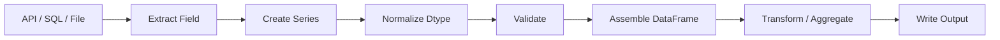

# 08- Creating Series

## Overview

A Pandas `Series` is a one-dimensional labeled data structure. It represents a sequence of values associated with an Index and is the fundamental building block of a DataFrame column.

Conceptually:

```text
Series
├── Index
└── Values
```

A DataFrame is effectively a collection of Series sharing a row axis:

```text
DataFrame
├── customer_id → Series
├── status      → Series
├── amount      → Series
└── created_at  → Series
```

Creating a Series correctly matters because the construction step establishes:

- The values.
- The Index.
- The dtype.
- Missing-value semantics.
- Alignment behavior.
- Memory representation.

In backend and data-engineering applications, Series are commonly created from:

```text
Python sequences
    ↓
API response fields
    ↓
Database columns
    ↓
NumPy arrays
    ↓
Existing DataFrames
    ↓
Derived computations
```

A production-quality Series should have intentional type and indexing semantics rather than relying entirely on automatic inference.

## Basic Construction

The primary constructor is:

```python
import pandas as pd

amounts = pd.Series(
    [250.0, 175.5, 500.0]
)
```

The result has:

```text
Index  → 0, 1, 2
Values → 250.0, 175.5, 500.0
dtype  → inferred numeric dtype
```

Inspect it with:

```python
print(amounts)
print(amounts.index)
print(amounts.dtype)
```

A Series is not simply a Python list. The Index is part of the data model and affects selection, alignment, joins, and arithmetic.

## Why Create a Series Directly?

Direct Series construction is useful when:

- A transformation produces one logical field.
- A pipeline needs a typed intermediate column.
- Data needs explicit labels.
- A single vector needs to be analyzed.
- A Series needs to participate in Pandas alignment semantics.

For example:

```python
order_amounts = pd.Series(
    [250.0, 175.5, 500.0],
    dtype="Float64",
    name="amount",
)
```

This establishes both a dtype and a semantic name.

## Creating from a List

A Python list is the most straightforward input:

```python
statuses = pd.Series(
    [
        "completed",
        "pending",
        "cancelled",
    ],
    name="status",
)
```

Pandas infers the dtype unless one is specified.

For externally sourced data, explicit dtype normalization is often preferable.

## Creating from a Tuple

Tuples work similarly:

```python
customer_ids = pd.Series(
    (101, 102, 103),
    name="customer_id",
)
```

The input is converted into a Pandas Series with its own Index.

The tuple itself is not preserved as the Series container.

## Creating from a NumPy Array

NumPy arrays are a natural source for Series:

```python
import numpy as np
import pandas as pd

amounts = np.array(
    [250.0, 175.5, 500.0],
    dtype=np.float64,
)

series = pd.Series(
    amounts,
    name="amount",
)
```

This is useful when numerical processing has already occurred in NumPy.

When performance matters, understand whether the resulting Series can reuse underlying memory or whether conversion causes additional allocation. Avoid depending on undocumented internal aliasing behavior.

## Creating from a Dictionary

A dictionary maps naturally to an indexed Series:

```python
customer_tiers = pd.Series(
    {
        101: "gold",
        102: "silver",
        103: "gold",
    },
    name="tier",
)
```

The dictionary keys become the Index.

The result is conceptually:

```text
101 → gold
102 → silver
103 → gold
```

This is useful when keys represent stable labels or identifiers.

## Dictionary Keys and Ordering

Modern Python preserves dictionary insertion order, and Pandas preserves the supplied order unless an explicit index or another operation changes it.

Do not treat dictionary insertion order as business semantics unless ordering is actually part of the contract.

When deterministic output ordering matters, specify it explicitly.

## Creating from an Existing Series

A Series can be passed to `pd.Series()`:

```python
source = pd.Series(
    [100, 200, 300],
    name="amount",
)

result = pd.Series(source)
```

When independent ownership is required, use:

```python
result = source.copy()
```

This makes the copy requirement explicit.

For large datasets, unnecessary copies increase memory pressure.

## Creating with an Explicit Index

An Index can be supplied:

```python
amounts = pd.Series(
    [250.0, 175.5, 500.0],
    index=[1001, 1002, 1003],
    name="amount",
)
```

Now:

```python
amounts.loc[1002]
```

selects the value associated with order `1002`.

The Index can represent:

- Record identifiers.
- Timestamps.
- Sequence labels.
- Partition identifiers.
- Hierarchical keys.

## Positional vs Label Semantics

With:

```python
amounts = pd.Series(
    [250.0, 175.5, 500.0],
    index=[1001, 1002, 1003],
)
```

these operations mean different things:

```python
amounts.loc[1002]
```

means:

```text
Find label 1002
```

while:

```python
amounts.iloc[1]
```

means:

```text
Find the second position
```

A senior-level understanding of Series construction includes understanding how the chosen Index affects every downstream operation.

## Index Length Must Match Values

An explicit Index must be compatible with the data length:

```python
pd.Series(
    [1001, 1002, 1003],
    index=[1, 2],
)
```

raises an error because three values cannot be mapped to two labels.

This prevents ambiguous row association.

## Named Series

A Series can have a `name`:

```python
amounts = pd.Series(
    [250.0, 175.5, 500.0],
    name="order_amount",
)
```

The name becomes important when converting a Series to a DataFrame:

```python
amounts.to_frame()
```

It can also improve readability in logs, debugging, and downstream column operations.

For application code, meaningful names are preferable to anonymous intermediate Series.

## Creating an Empty Series

An empty Series is often used as an explicit pipeline state:

```python
import pandas as pd

amounts = pd.Series(
    dtype="Float64",
    name="amount",
)
```

This is preferable to:

```python
pd.Series()
```

when a stable schema matters.

An empty Series with an explicit dtype behaves more predictably when later populated or combined with typed data.

## Why Explicit Dtypes Matter

Automatic inference is convenient but external data is frequently ambiguous.

For example:

```python
amounts = pd.Series(
    ["100.50", "200.25", None]
)
```

may initially have a string-like dtype rather than a numeric nullable dtype.

Normalize it explicitly:

```python
amounts = pd.to_numeric(
    amounts,
    errors="coerce",
).astype("Float64")
```

Now invalid values can be represented as missing values rather than causing inconsistent downstream behavior.

## Common Series Dtypes

| Logical data | Recommended Pandas dtype |
|---|---|
| Text | `string` |
| Nullable integer | `Int64` |
| Nullable floating point | `Float64` |
| Boolean with missing values | `boolean` |
| Datetime | `datetime64[ns]` or timezone-aware datetime |
| Category with controlled vocabulary | `category` |
| Identifier with leading zeros | `string` |

Use the dtype that reflects the logical meaning rather than the accidental representation of the incoming source.

## Nullable Integer Series

Traditional NumPy integer dtypes cannot represent missing values directly.

Use the nullable Pandas integer dtype:

```python
customer_ids = pd.Series(
    [101, 102, None],
    dtype="Int64",
    name="customer_id",
)
```

This preserves integer semantics while allowing missing values.

## Nullable Boolean Series

For data where boolean values can be unknown:

```python
is_active = pd.Series(
    [True, False, None],
    dtype="boolean",
    name="is_active",
)
```

This is safer than relying on object-like representations.

## String Series

For textual data:

```python
statuses = pd.Series(
    [
        "completed",
        "pending",
        None,
    ],
    dtype="string",
    name="status",
)
```

Using the dedicated `string` dtype makes string semantics more explicit than treating text as generic `object`.

## Datetime Series

Use `pd.to_datetime()` when timestamps originate from strings or external systems:

```python
created_at = pd.to_datetime(
    pd.Series(
        [
            "2026-01-10T10:00:00Z",
            "2026-01-11T11:30:00Z",
        ]
    ),
    utc=True,
).rename("created_at")
```

Normalize time zones deliberately at ingestion boundaries.

For distributed systems and cross-region processing, UTC is usually a safer canonical representation.

## Categorical Series

For a controlled vocabulary:

```python
status = pd.Series(
    [
        "completed",
        "pending",
        "completed",
    ],
    dtype="category",
    name="status",
)
```

Categoricals can reduce memory usage and sometimes improve grouping and comparison performance.

The benefit is workload-dependent. Do not convert every string column to `category` automatically.

## Scalar Values

A scalar can be broadcast when an explicit index is provided:

```python
status = pd.Series(
    "pending",
    index=[1001, 1002, 1003],
    name="status",
)
```

The resulting Series contains the same value for each index label.

This is useful for initialization but should not be confused with independently stored scalar objects. Pandas manages the resulting vector representation.

## Without an Index

When no Index is provided, Pandas creates a default `RangeIndex`:

```python
amounts = pd.Series(
    [250.0, 175.5, 500.0]
)
```

The index is:

```text
0
1
2
```

This is convenient for temporary calculations.

Do not treat the default positional index as a durable business identifier.

## Resetting Expectations About the Index

A common design mistake is assuming:

```text
row position == business identity
```

These are separate concepts.

For example:

```python
orders = pd.DataFrame(
    {
        "order_id": [1001, 1002, 1003],
        "amount": [250.0, 175.5, 500.0],
    }
)
```

The default DataFrame index is not the same thing as:

```text
order_id
```

The Series extracted from:

```python
orders["amount"]
```

inherits the DataFrame's Index.

## Constructing a Series from a DataFrame Column

The normal pattern is:

```python
amounts = orders["amount"]
```

This produces a Series associated with the DataFrame's row index.

It should generally be preferred over reconstructing the column manually because the existing indexing semantics are preserved.

For an independent object:

```python
amounts = orders["amount"].copy()
```

## Series and DataFrame Construction Relationship

Consider:

```python
orders = pd.DataFrame(
    {
        "order_id": [1001, 1002],
        "amount": [250.0, 175.5],
        "status": ["completed", "pending"],
    }
)
```

Conceptually:

```text
DataFrame
    │
    ├── order_id → Series
    ├── amount   → Series
    └── status   → Series
```

Every column Series shares the DataFrame's row axis.

This shared indexing behavior is the basis for many Pandas operations.

## Alignment During Series Operations

Consider:

```python
left = pd.Series(
    [100, 200],
    index=["a", "b"],
)

right = pd.Series(
    [10, 20],
    index=["b", "a"],
)
```

Adding them:

```python
result = left + right
```

aligns by labels:

```text
a → 100 + 20 = 120
b → 200 + 10 = 210
```

It does not simply add by physical position.

This behavior is one of the most important differences between Pandas Series and ordinary Python lists.

## Missing Labels During Alignment

If indexes do not overlap completely:

```python
left = pd.Series(
    [100, 200],
    index=["a", "b"],
)

right = pd.Series(
    [10, 20],
    index=["b", "c"],
)
```

then:

```python
left + right
```

contains missing results for labels that do not have matching operands.

Conceptually:

```text
a → NaN
b → 220
c → NaN
```

The operation follows label alignment rather than positional assumptions.

## Creating Multiple Related Series

A common ETL pattern is to construct typed Series before assembling a DataFrame:

```python
order_id = pd.Series(
    [1001, 1002],
    dtype="Int64",
    name="order_id",
)

amount = pd.Series(
    [250.0, 175.5],
    dtype="Float64",
    name="amount",
)

status = pd.Series(
    ["completed", "pending"],
    dtype="string",
    name="status",
)

orders = pd.concat(
    [
        order_id,
        amount,
        status,
    ],
    axis=1,
)
```

Because all Series share a compatible Index, they can be combined into a DataFrame.

This pattern is useful when each field is independently transformed or validated.

## Building Series from API Data

Suppose a service returns:

```python
payload = {
    "orders": [
        {
            "id": 1001,
            "amount": "250.00",
        },
        {
            "id": 1002,
            "amount": "175.50",
        },
    ]
}
```

A Series can be built from a selected field:

```python
amounts = pd.Series(
    (
        order["amount"]
        for order in payload["orders"]
    ),
    dtype="string",
    name="amount",
)
```

Then normalize:

```python
amounts = pd.to_numeric(
    amounts,
    errors="coerce",
).astype("Float64")
```

For large payloads, however, avoid materializing unnecessarily large intermediate Python structures. Prefer page-by-page or batch processing.

## Building Series from Database Results

After querying a database, a selected field can become a Series:

```python
rows = [
    {"order_id": 1001, "amount": 250.0},
    {"order_id": 1002, "amount": 175.5},
]

amounts = pd.Series(
    (
        row["amount"]
        for row in rows
    ),
    dtype="Float64",
    name="amount",
)
```

For full query processing, `read_sql()` or `read_sql_query()` is usually more appropriate than manually constructing a Series from large result sets.

The database should perform filtering and projection whenever possible.

## Series Construction in ETL Pipelines

A typical pipeline can use Series as typed intermediate values:



The key boundary is:

```text
External representation
        ↓
Canonical Pandas representation
```

Construction and normalization should be explicit enough to detect upstream contract changes.

## Schema-First Series Construction

For production pipelines, define expected field types separately:

```python
ORDER_SCHEMA = {
    "order_id": "Int64",
    "customer_id": "Int64",
    "amount": "Float64",
    "status": "string",
}
```

Then construct fields according to that schema.

A lightweight pattern is:

```python
def build_series(
    values: list,
    *,
    name: str,
    dtype: str,
) -> pd.Series:
    return pd.Series(
        values,
        name=name,
        dtype=dtype,
    )
```

Usage:

```python
amounts = build_series(
    ["250.00", "175.50"],
    name="amount",
    dtype="string",
)

amounts = pd.to_numeric(
    amounts,
    errors="coerce",
).astype("Float64")
```

For more complex pipelines, use dedicated schema validation rather than relying on a small helper alone.

## Mutation and Copy Behavior

Series methods generally return a new result rather than mutating the original object:

```python
cleaned = amounts.fillna(0)
```

The original Series remains unchanged:

```python
amounts
```

Assignment can mutate an existing DataFrame or Series:

```python
orders["amount"] = (
    orders["amount"]
    .fillna(0)
)
```

Understand whether the operation creates a new object or updates an existing container.

In large pipelines, unnecessary intermediate Series can increase memory usage, so favor readable expressions without creating redundant copies.

## Performance Considerations

Series are optimized for vectorized operations.

Prefer:

```python
amounts * 1.18
```

over:

```python
[
    amount * 1.18
    for amount in amounts
]
```

Vectorized Pandas operations generally provide better integration with the underlying array representation and Pandas semantics.

For large workloads, performance depends on:

- Dtype.
- Operation.
- Number of rows.
- Missing values.
- Index characteristics.
- Memory pressure.
- Backend execution path.

Do not assume that every Pandas operation is equally vectorized internally.

## Avoid Per-Element Loops

Avoid:

```python
result = []

for value in amounts:
    if value > 100:
        result.append(value * 1.1)
```

Prefer:

```python
result = amounts.where(
    amounts <= 100,
    amounts * 1.1,
)
```

The vectorized approach expresses the transformation at the Series level and is generally easier to reason about and optimize.

## Series and Memory Usage

A Series has memory costs associated with:

```text
Values
Index
Metadata
dtype representation
```

Object-backed values can have particularly high Python-object overhead.

For large datasets:

```python
print(
    amounts.memory_usage(
        deep=True
    )
)
```

can provide a more realistic memory estimate than looking only at the logical number of elements.

Remember that:

```python
amounts.size
```

is the number of elements, not the number of bytes consumed.

## Avoid Unnecessary Copies

This:

```python
amounts_copy = amounts.copy()
```

creates an independent Series.

That is appropriate when isolation is required.

But repeatedly copying a million-row Series can significantly increase peak memory.

Use copying intentionally when:

- A function requires ownership independence.
- The object will be mutated independently.
- Isolation prevents subtle side effects.
- Data must be preserved across a transformation boundary.

## Large-Scale Processing

Pandas Series are in-memory structures.

They are appropriate when the required working set fits comfortably within available memory.

For very large data:

```text
Object storage
    ↓
Partitioned files
    ↓
Chunked / partitioned processing
    ↓
Pandas Series / DataFrame
    ↓
Output
```

should often replace:

```text
Entire dataset
    ↓
One enormous in-memory Series
```

For workloads that exceed practical Pandas memory limits, consider pushing computation into:

- PostgreSQL.
- Spark.
- Polars.
- DuckDB.
- Distributed processing systems.

The correct choice depends on workload, operational complexity, latency requirements, and existing infrastructure.

## Security Considerations

Series can contain sensitive values just like any other in-memory object.

Avoid:

```python
print(customer_emails)
```

or:

```python
logger.debug(
    "records=%s",
    customer_data,
)
```

when the Series contains sensitive information.

Prefer:

```python
logger.info(
    "processed_records=%d",
    len(customer_data),
)
```

Log metadata and safe aggregates rather than raw sensitive values.

## Reliability Considerations

Series construction should fail predictably when a source violates its contract.

For example:

```python
def build_customer_ids(
    values: list,
) -> pd.Series:
    result = pd.to_numeric(
        pd.Series(
            values,
            name="customer_id",
        ),
        errors="coerce",
    ).astype("Int64")

    if result.isna().any():
        raise ValueError(
            "customer_id contains invalid values"
        )

    return result
```

This turns malformed input into an explicit pipeline failure instead of allowing corrupted data to flow downstream.

For pipelines where malformed records should be quarantined rather than fail the batch, separate valid and invalid records deliberately.

## Testing Series Construction

Tests should verify behavior, not simply successful execution.

```python
def test_customer_id_series():
    result = pd.Series(
        ["101", "102", None],
        dtype="string",
        name="customer_id",
    )

    normalized = pd.to_numeric(
        result,
        errors="coerce",
    ).astype("Int64")

    expected = pd.Series(
        [101, 102, None],
        dtype="Int64",
        name="customer_id",
    )

    pd.testing.assert_series_equal(
        normalized,
        expected,
    )
```

Useful assertions include:

- Values.
- Index.
- Name.
- Dtype.
- Missing-value behavior.
- Length.
- Expected exceptions.

`pd.testing.assert_series_equal()` is preferable to comparing only the underlying values because it verifies Series metadata as well.

## Common Mistakes

### Treating a Series Like a List

A Series contains both values and labels.

**Better:** understand Index-based alignment and use `loc` or `iloc` intentionally.

### Relying Entirely on Dtype Inference

External strings, nulls, and mixed values can result in undesirable types.

**Better:** normalize important dtypes explicitly.

### Using Generic `object` for Text

Generic object representation is often less explicit and may consume more memory.

**Better:** use `string` where textual semantics are intended.

### Losing Identifier Formatting

Converting:

```text
"000123"
```

to an integer changes its representation.

**Better:** retain identifiers as `string` when leading zeros are meaningful.

### Assuming Arithmetic Is Positional

Pandas aligns Series by Index.

**Better:** verify labels before combining Series or deliberately reset/reassign indexes when positional behavior is intended.

### Using `astype(bool)` on Arbitrary Strings

For example:

```python
pd.Series(
    ["false", "true"]
).astype(bool)
```

does not interpret the strings semantically as Boolean values. Non-empty strings evaluate as truthy.

**Better:** map explicit representations:

```python
mapping = {
    "true": True,
    "false": False,
}

flags = (
    source
    .str.strip()
    .str.lower()
    .map(mapping)
    .astype("boolean")
)
```

### Creating Huge Intermediate Lists

This:

```python
pd.Series(
    huge_python_list
)
```

may require substantial temporary memory.

**Better:** prefer direct readers, generators where supported, or bounded batch processing.

### Copying Every Series

Unnecessary copies increase memory usage.

**Better:** copy only when independent ownership is required.

### Ignoring Empty Inputs

An empty Series can have an undesirable or ambiguous dtype.

**Better:** define the dtype explicitly for pipeline boundaries.

### Using Default Index as Business Identity

The index:

```text
0, 1, 2, ...
```

is a positional label, not automatically a domain identifier.

**Better:** retain or explicitly model business identifiers.

## Interview Traps

### What Is a Pandas Series?

A one-dimensional labeled data structure containing values, an Index, and dtype metadata.

### How Is a Series Different from a Python List?

A Series adds:

```text
Index
dtype semantics
vectorized operations
alignment
missing-value support
metadata
```

### What Happens When Two Series with Different Indexes Are Added?

Pandas aligns them by labels and produces missing values for labels without matching operands.

### How Do You Create a Typed Empty Series?

```python
pd.Series(
    dtype="Float64",
    name="amount",
)
```

### Why Use `Int64` Instead of `int64`?

`Int64` is a nullable Pandas integer dtype and can represent missing values.

### What Is the Difference Between `loc` and `iloc` for Series?

`loc` is label-based; `iloc` is position-based.

### How Do You Create a Series from a Dictionary?

```python
pd.Series(
    {
        101: "gold",
        102: "silver",
    }
)
```

Dictionary keys become the Index.

### Does a Series Automatically Preserve DataFrame Row Alignment?

Yes. Selecting a DataFrame column produces a Series carrying the DataFrame's Index.

### How Should You Compare Two Series in Tests?

Use:

```python
pd.testing.assert_series_equal(
    actual,
    expected,
)
```

because it checks values and important metadata such as Index, dtype, and name.

### When Should a Series Become a DataFrame?

When the computation requires multiple aligned fields or tabular operations such as joins, groupings, or multi-column transformations.

### When Does Pandas Become the Wrong Tool?

When the working set exceeds practical memory limits or the workload is better handled through database execution, distributed processing, or another columnar data engine.

## Practical Construction Pattern

A production-oriented Series construction pipeline can follow:

```python
import pandas as pd


def build_amount_series(
    raw_values: list[object],
) -> pd.Series:
    source = pd.Series(
        raw_values,
        name="amount",
        dtype="string",
    )

    numeric = pd.to_numeric(
        source,
        errors="coerce",
    ).astype("Float64")

    invalid = (
        source.notna()
        & numeric.isna()
    )

    if invalid.any():
        raise ValueError(
            "Amount contains invalid numeric values"
        )

    return numeric
```

The flow is:

```text
Raw values
    ↓
Explicit initial representation
    ↓
Controlled conversion
    ↓
Invalid-value detection
    ↓
Typed Series
```

This is considerably safer than allowing arbitrary external input to determine the downstream schema.

## Series Construction Checklist

```text
[ ] What does each value represent?
[ ] Does the Series need an explicit name?
[ ] Is the Index positional or semantic?
[ ] Should the Index be supplied explicitly?
[ ] Is dtype inference safe?
[ ] Are nullable dtypes required?
[ ] Are identifiers really numeric?
[ ] Are string values semantically Boolean, numeric, or datetime?
[ ] Can missing values occur?
[ ] What should invalid values do?
[ ] Is label alignment expected?
[ ] Is an independent copy actually required?
[ ] Could construction create a large temporary object?
[ ] Should processing happen in batches?
[ ] Are sensitive values being logged?
[ ] Is the empty-input schema defined?
[ ] Are values, Index, name, and dtype covered by tests?
[ ] Does the workload fit within Pandas memory limits?
```

## Key Takeaways

- A Series is a labeled one-dimensional structure consisting of values, an Index, dtype information, and metadata; its Index is a core part of its behavior.
- Construct Series with intentional dtypes, especially for nullable integers, strings, booleans, datetimes, and business identifiers whose formatting must be preserved.
- Pandas aligns Series by Index during arithmetic and combination, so label semantics must be understood before relying on positional relationships.
- Production pipelines should separate Series construction, dtype normalization, validation, and business-rule enforcement while controlling copies and memory usage.
- For large or sensitive datasets, prefer bounded processing, explicit schema contracts, source-side reduction, and metadata-oriented logging rather than creating or exposing unnecessarily large Series objects.