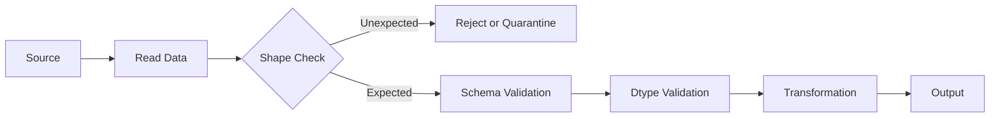

# 10- Shape Size And Dimensions

## Overview

`shape`, `size`, and `ndim` describe the structural dimensions of a Pandas object.

They are small properties, but they are important for production data processing because they answer different questions:

| Property | Answers | DataFrame Example |
|---|---|---|
| `shape` | How many rows and columns? | `(1000, 8)` |
| `size` | How many total elements? | `8000` |
| `ndim` | How many dimensions? | `2` |
| `len()` | How many items are on the primary axis? | `1000` for a DataFrame |
| `axes` | What are the actual axes? | `[row_index, column_index]` |
| `empty` | Is the object empty? | `True` if any axis has length 0 |

For backend and ETL systems, these properties are useful for:

- Input validation.
- Sanity checks.
- Batch processing.
- Monitoring.
- Debugging.
- Detecting unexpected upstream changes.
- Estimating workload size.
- Protecting pipelines from accidental large inputs.

A common source of bugs is using these properties interchangeably. They describe different characteristics of the object and should be selected based on the question being asked.

## DataFrame Shape

A DataFrame is two-dimensional:

```python
import pandas as pd

orders = pd.DataFrame(
    {
        "order_id": [1001, 1002, 1003],
        "customer_id": [101, 102, 103],
        "amount": [250.0, 175.5, 500.0],
    }
)

print(orders.shape)
```

Output:

```text
(3, 3)
```

The first value is the number of rows.

The second value is the number of columns.

Conceptually:

```text
shape = (rows, columns)
```

For:

```text
(3, 3)
```

the DataFrame contains:

```text
3 rows
3 columns
```

## Why Shape Matters

Shape is useful when validating an expected DataFrame contract.

For example:

```python
if orders.shape[1] != 3:
    raise ValueError(
        "Unexpected number of columns"
    )
```

This can detect upstream schema changes, but checking only column count is usually insufficient.

A source could change:

```text
order_id
customer_id
amount
```

into:

```text
order_id
customer_id
status
```

while preserving the same shape.

For production validation, inspect column names and dtypes as well.

## Accessing Rows and Columns from Shape

Because `shape` is a tuple:

```python
rows, columns = orders.shape

print(rows)
print(columns)
```

This is often clearer than repeatedly indexing the property.

A useful pattern is:

```python
row_count, column_count = orders.shape
```

Use descriptive variable names when the values participate in validation or metrics.

## Series Shape

A Series is one-dimensional:

```python
amounts = pd.Series(
    [250.0, 175.5, 500.0],
    name="amount",
)

print(amounts.shape)
```

Output:

```text
(3,)
```

The Series shape contains only one axis length.

Conceptually:

```text
Series shape = (number_of_values,)
```

Do not interpret:

```text
(3,)
```

as three rows and zero columns. A Series is not a two-dimensional table.

## DataFrame vs Series Dimensions

```python
orders = pd.DataFrame(
    {
        "order_id": [1001, 1002, 1003],
        "amount": [250.0, 175.5, 500.0],
    }
)

amounts = orders["amount"]

print(orders.ndim)
print(amounts.ndim)
```

Output:

```text
2
1
```

The distinction is:

```text
Series    → 1-dimensional
DataFrame → 2-dimensional
```

This becomes important when designing reusable functions.

## `ndim`

`ndim` reports the number of dimensions:

```python
print(orders.ndim)
```

Output:

```text
2
```

For a Series:

```python
print(amounts.ndim)
```

Output:

```text
1
```

In normal Pandas application code, the primary objects are Series and DataFrames, so `ndim` is often used as a defensive check rather than as a day-to-day transformation tool.

## When to Use `ndim`

Use `ndim` when code accepts generic array-like or Pandas objects and the expected dimensionality matters.

For example:

```python
def require_dataframe(
    value: pd.DataFrame,
) -> pd.DataFrame:
    if value.ndim != 2:
        raise ValueError(
            "Expected a two-dimensional DataFrame"
        )

    return value
```

In strongly typed application code, a function accepting `pd.DataFrame` already communicates much of this intent. Runtime validation can still be useful at external data boundaries.

## `size`

`size` returns the total number of elements.

For a DataFrame:

```python
print(orders.size)
```

If:

```text
rows    = 3
columns = 2
```

then:

```text
size = 3 × 2 = 6
```

For a Series with three values:

```python
print(amounts.size)
```

the result is:

```text
3
```

Formally:

```text
DataFrame.size = number_of_rows × number_of_columns
Series.size    = number_of_values
```

## `size` Is Not Memory Usage

This is a critical distinction.

```python
orders.size
```

returns the number of logical elements.

It does not return:

```text
bytes
kilobytes
megabytes
```

For memory diagnostics, use:

```python
orders.memory_usage(
    index=True,
    deep=True,
)
```

For example:

```python
memory_bytes = orders.memory_usage(
    index=True,
    deep=True,
).sum()

print(memory_bytes)
```

This provides a memory-oriented measurement rather than an element count.

## `len()`

For a DataFrame:

```python
len(orders)
```

returns the length of the primary axis, which is the number of rows.

For:

```text
3 rows × 2 columns
```

the result is:

```text
3
```

For a Series:

```python
len(amounts)
```

returns the number of values.

In many data-processing contexts:

```python
len(df)
```

is a convenient row count, while:

```python
df.shape[0]
```

makes the axis explicit.

## `len()` vs `shape[0]`

These are usually equivalent for ordinary DataFrames:

```python
row_count = len(orders)
```

and:

```python
row_count = orders.shape[0]
```

Use `shape[0]` when discussing dimensionality explicitly:

```python
rows, columns = orders.shape
```

Use `len(df)` when the code simply needs the number of rows:

```python
if len(orders) == 0:
    return
```

Neither should be confused with `size`.

## Comparing `shape`, `size`, `len()`, and `ndim`

| Operation | DataFrame `(100, 5)` | Meaning |
|---|---:|---|
| `df.shape` | `(100, 5)` | Rows and columns |
| `df.shape[0]` | `100` | Rows |
| `df.shape[1]` | `5` | Columns |
| `df.size` | `500` | Total elements |
| `len(df)` | `100` | Rows |
| `df.ndim` | `2` | Dimensions |

The correct property depends entirely on the question.

## `empty`

The `empty` property reports whether a Series or DataFrame has no items along at least one axis.

For example:

```python
orders = pd.DataFrame(
    columns=[
        "order_id",
        "amount",
    ]
)

print(orders.empty)
```

Output:

```text
True
```

A DataFrame can therefore have columns while still being empty because it contains zero rows.

## Empty DataFrame with Known Schema

This is common in API and ETL processing:

```python
orders = pd.DataFrame(
    {
        "order_id": pd.Series(
            dtype="Int64"
        ),
        "amount": pd.Series(
            dtype="Float64"
        ),
    }
)

print(orders.shape)
print(orders.empty)
```

Conceptually:

```text
shape → (0, 2)
empty → True
```

The schema exists even though there are no rows.

This distinction is important for downstream pipeline contracts.

## Empty Does Not Mean Missing Data

These are different states:

```text
Empty DataFrame
→ zero records

Non-empty DataFrame with null values
→ records exist, but some fields are missing
```

For example:

```python
orders = pd.DataFrame(
    {
        "order_id": [1001],
        "amount": [None],
    }
)
```

This DataFrame is not empty:

```python
orders.empty
```

returns:

```text
False
```

even though the `amount` field is missing.

Use `isna()` for missing values, not `empty`.

## Empty DataFrame vs Zero Columns

Consider:

```python
df = pd.DataFrame()
```

This has:

```text
shape → (0, 0)
empty → True
```

A schema-preserving empty DataFrame may instead have:

```text
shape → (0, 3)
empty → True
```

Both are empty, but only the second communicates an expected three-column schema.

## `axes`

Pandas exposes the object's axes through `axes`.

For a DataFrame:

```python
print(orders.axes)
```

Conceptually:

```text
[
    row_index,
    column_index,
]
```

For example:

```python
orders = pd.DataFrame(
    {
        "order_id": [1001, 1002],
        "amount": [250.0, 175.5],
    },
    index=["a", "b"],
)

print(orders.axes)
```

The first axis represents rows and the second represents columns.

For most application code, `shape`, `index`, and `columns` are clearer than directly working with `axes`.

## `index` and `columns`

Instead of:

```python
orders.axes[0]
```

prefer:

```python
orders.index
```

For the column axis:

```python
orders.columns
```

This is more readable and communicates intent directly.

For example:

```python
row_count = len(orders.index)
column_count = len(orders.columns)
```

## Shape and Index Length

Shape can be validated against the axes:

```python
rows, columns = orders.shape

assert rows == len(orders.index)
assert columns == len(orders.columns)
```

This is normally guaranteed by the Pandas object model, so these assertions are more educational than necessary in production code.

The useful engineering lesson is that shape and axis metadata describe the same underlying structure from different perspectives.

## Structural Validation

A practical ETL boundary might validate:

```python
expected_columns = {
    "order_id",
    "customer_id",
    "amount",
}

actual_columns = set(orders.columns)

missing = expected_columns - actual_columns

if missing:
    raise ValueError(
        f"Missing required columns: {sorted(missing)}"
    )
```

Then check row count:

```python
if orders.empty:
    return
```

This is more robust than checking only:

```python
if orders.shape[1] == 3:
    ...
```

Column count alone does not establish schema correctness.

## Minimum Shape Validation

A pipeline may require at least one row:

```python
if orders.shape[0] == 0:
    raise ValueError(
        "Expected at least one order"
    )
```

This is different from checking:

```python
if orders.empty:
```

because `empty` is a structural property while the application rule may be business-specific.

For example:

```text
empty input is acceptable
```

could be valid for a periodic reporting job, while:

```text
empty input indicates upstream failure
```

could be correct for a financial settlement pipeline.

## Shape Checks in ETL

A typical ETL boundary can use these properties:



Shape checks should be treated as one layer of validation rather than the complete validation strategy.

## Detecting Upstream Volume Anomalies

Suppose a daily job normally receives:

```text
1,000,000 rows
```

but suddenly receives:

```text
10 rows
```

A simple row-count check can catch the anomaly:

```python
row_count = len(orders)

if row_count < 100_000:
    raise ValueError(
        "Input volume is unexpectedly low"
    )
```

A production implementation should usually use configurable thresholds and monitoring rather than hard-coded values.

For example:

```text
Expected range
    ↓
Alert threshold
    ↓
Failure threshold
```

can support different operational responses.

## Shape Checks and Schema Evolution

Suppose an upstream API adds a field:

```text
Before:
8 columns

After:
9 columns
```

A strict column-count check may fail even though the change is backward-compatible.

For evolving systems, distinguish:

```text
Required columns
Optional columns
Unexpected columns
```

For example:

```python
required = {
    "order_id",
    "customer_id",
    "amount",
}

missing = required - set(orders.columns)

if missing:
    raise ValueError(
        f"Missing columns: {sorted(missing)}"
    )
```

This is generally more robust than requiring an exact column count.

## Shape and Database Queries

When loading from PostgreSQL:

```python
orders = pd.read_sql_query(
    """
    SELECT
        order_id,
        customer_id,
        amount
    FROM orders
    WHERE created_at >= %(start_date)s
    """,
    connection,
    params={
        "start_date": start_date,
    },
)
```

After loading:

```python
row_count, column_count = orders.shape
```

can be used for metrics.

However, do not use DataFrame shape to compensate for poor SQL design.

Prefer:

```sql
SELECT order_id, customer_id, amount
```

over:

```sql
SELECT *
```

when only selected fields are needed.

Reducing data before transfer is generally better than loading and discarding unnecessary columns in Python.

## Shape and API Responses

For paginated APIs, inspect each batch:

```python
for page in fetch_pages():
    page_df = pd.json_normalize(
        page["orders"]
    )

    row_count, column_count = (
        page_df.shape
    )

    process_page(page_df)
```

Metrics such as:

```text
rows per page
columns per page
empty pages
unexpected column count
```

can help detect source-system anomalies.

## Shape and Chunked Processing

When using `chunksize`:

```python
for chunk in pd.read_csv(
    "orders.csv",
    chunksize=100_000,
):
    row_count, column_count = chunk.shape

    process_chunk(chunk)
```

The important quantity is usually:

```python
chunk.shape[0]
```

rather than:

```python
chunk.size
```

because batch processing typically reasons about records, not total cells.

## Shape and Memory Planning

For a rough conceptual estimate:

```text
total_elements ≈ rows × columns
```

But total element count is not enough to predict memory accurately.

Memory depends on:

- Dtypes.
- Index.
- Object-backed values.
- String content.
- Categorical representation.
- Temporary allocations.
- Intermediate DataFrames.
- Copy operations.

Therefore:

```python
df.size
```

should not be treated as a memory estimator.

For actual memory diagnostics:

```python
memory_bytes = (
    df.memory_usage(
        index=True,
        deep=True,
    )
    .sum()
)
```

## Shape and Performance

Large shape often means more work:

```text
More rows
    ↓
More values processed

More columns
    ↓
More data loaded, transformed, and potentially copied
```

However, workload cost is not determined by shape alone.

For example:

```text
10 million numeric values
```

and:

```text
10 million Python strings
```

can have very different memory and processing characteristics.

Use shape as a structural signal and dtype/memory metrics for resource planning.

## Narrow vs Wide DataFrames

A DataFrame with:

```text
10,000,000 rows × 5 columns
```

and one with:

```text
1,000,000 rows × 50 columns
```

have different shapes but both contain:

```text
50,000,000 elements
```

The second may still behave differently depending on dtypes, operation patterns, and column layout.

This matters for:

- Memory.
- Serialization.
- Parquet I/O.
- Network transfer.
- Transformation cost.
- Cache behavior.

## Shape and Column Projection

When reading files or databases, reduce the number of columns early.

For CSV:

```python
orders = pd.read_csv(
    "orders.csv",
    usecols=[
        "order_id",
        "customer_id",
        "amount",
    ],
)
```

For Parquet:

```python
orders = pd.read_parquet(
    "orders.parquet",
    columns=[
        "order_id",
        "customer_id",
        "amount",
    ],
)
```

For SQL:

```sql
SELECT
    order_id,
    customer_id,
    amount
FROM orders;
```

This reduces the resulting shape and often reduces I/O and memory requirements.

## Shape and Row Filtering

Filtering reduces row count:

```python
completed = orders.loc[
    orders["status"].eq("completed")
]
```

Then:

```python
print(orders.shape)
print(completed.shape)
```

This is useful for validating transformation behavior.

For example:

```python
assert completed.shape[0] <= orders.shape[0]
```

This specific relationship is expected for a filter that only removes rows.

## Shape Invariants

Transformation pipelines often have predictable shape invariants.

Examples:

| Operation | Typical shape behavior |
|---|---|
| Row filter | Rows decrease or stay the same |
| Select columns | Columns decrease or stay the same |
| Add column | Columns increase |
| Drop column | Columns decrease |
| Sort | Shape unchanged |
| Rename | Shape unchanged |
| `groupby().agg()` | Rows generally decrease |
| `merge()` | Rows may increase, decrease, or stay the same |
| `concat(axis=0)` | Rows generally increase |
| `concat(axis=1)` | Columns generally increase |

These are useful for tests and debugging, but join operations require special care because cardinality can change row counts dramatically.

## Shape as a Debugging Tool

When debugging an ETL pipeline, log shape at key boundaries:

```python
logger.info(
    "after_cleaning rows=%d columns=%d",
    df.shape[0],
    df.shape[1],
)
```

Example:

```text
after_ingestion   rows=500000 columns=18
after_projection  rows=500000 columns=7
after_filter      rows=421000 columns=7
after_aggregation rows=12000 columns=5
```

This provides a compact picture of where data volume changes.

Avoid logging entire DataFrames when metadata is sufficient.

## Shape Validation in Tests

Shape is useful for checking transformation contracts:

```python
def test_completed_orders():
    result = filter_completed_orders(
        orders
    )

    assert result.shape[1] == 4
    assert result.shape[0] == 2
```

For stronger tests, assert actual columns instead of only their count:

```python
assert list(result.columns) == [
    "order_id",
    "customer_id",
    "status",
    "amount",
]
```

Column count alone can allow incorrect schemas to pass.

## Shape and Joins

Join operations deserve particular attention.

Suppose:

```text
orders → 100,000 rows
customers → 20,000 rows
```

A one-to-many or many-to-many merge can increase the output size substantially.

Use merge validation when the relationship is known:

```python
result = orders.merge(
    customers,
    on="customer_id",
    how="left",
    validate="many_to_one",
)
```

Then monitor:

```python
before = len(orders)
after = len(result)

logger.info(
    "orders_before=%d orders_after=%d",
    before,
    after,
)
```

Unexpected row multiplication is often a data-quality problem rather than an ordinary shape change.

## Shape and `groupby`

Aggregation usually reduces the number of rows:

```python
summary = (
    orders
    .groupby("customer_id", as_index=False)
    .agg(
        order_count=("order_id", "count"),
        revenue=("amount", "sum"),
    )
)
```

Compare:

```python
print(orders.shape)
print(summary.shape)
```

The result has one row per grouping key rather than one row per original order.

This is an important distinction when estimating downstream volume.

## Shape and Empty Results

Filtering can produce an empty DataFrame:

```python
completed = orders.loc[
    orders["status"].eq("completed")
]
```

When there are no matching rows:

```text
shape → (0, number_of_columns)
empty → True
```

Downstream code should define whether that state is:

```text
Expected
Warning
Error
```

Do not treat every empty DataFrame as a failure automatically.

## Common Mistakes

### Confusing `size` with Memory

```python
df.size
```

returns element count, not bytes.

**Better:** use `memory_usage(deep=True)` for memory diagnostics.

### Using `shape[1]` as Complete Schema Validation

A DataFrame can have the expected number of columns but completely different column names.

**Better:** validate required and unexpected columns explicitly.

### Confusing `empty` with Missing Values

A DataFrame containing rows with null fields is not empty.

**Better:** use `isna()` for missing-value detection.

### Assuming `len(df)` Returns Total Cells

For a DataFrame:

```python
len(df)
```

returns the number of rows.

**Better:** use `df.size` when total element count is required.

### Assuming Shape Alone Predicts Performance

Two DataFrames with identical shape can have very different memory usage and processing costs.

**Better:** inspect dtypes, memory usage, and operation complexity together.

### Treating Empty Input as Automatically Invalid

Some ETL and reporting jobs legitimately produce zero records.

**Better:** define the expected empty-state behavior as part of the pipeline contract.

### Ignoring Row Multiplication After a Merge

A merge can produce more output rows than either input.

**Better:** validate expected cardinality with `validate=` and inspect row counts.

### Hard-Coding Exact Column Counts for Evolving APIs

An upstream service may add optional fields without breaking the existing contract.

**Better:** validate required columns and explicitly decide how unexpected columns are handled.

### Logging Entire DataFrames for Debugging

This can produce huge logs and expose sensitive information.

**Better:** log shape, schema, dtypes, safe metrics, and representative diagnostics.

### Using Shape Checks Instead of Business Validation

A DataFrame with the correct shape can still contain invalid transactions.

**Better:** combine structural, schema, data-quality, and business-rule validation.

## Production Validation Pattern

A reusable validation layer can combine structural checks:

```python
import pandas as pd


def validate_frame(
    df: pd.DataFrame,
    *,
    required_columns: set[str],
) -> None:
    if df.ndim != 2:
        raise ValueError(
            "Expected a two-dimensional DataFrame"
        )

    missing = (
        required_columns
        - set(df.columns)
    )

    if missing:
        raise ValueError(
            "Missing required columns: "
            f"{sorted(missing)}"
        )
```

Then use shape for operational checks:

```python
rows, columns = df.shape

logger.info(
    "frame_validated rows=%d columns=%d",
    rows,
    columns,
)
```

This separates:

```text
Structural validation
    +
Schema validation
    +
Business validation
    +
Operational monitoring
```

rather than overloading `shape` to answer every question.

## Backend and ETL Checklist

```text
[ ] Do I need rows, columns, total elements, or dimensions?
[ ] Is shape being used for structural validation?
[ ] Are required columns validated explicitly?
[ ] Is the empty state expected or an error?
[ ] Are missing values being checked separately?
[ ] Is size being mistaken for memory usage?
[ ] Are dtypes included in performance analysis?
[ ] Are row-count changes expected after each transformation?
[ ] Could a merge multiply rows unexpectedly?
[ ] Is merge cardinality validated?
[ ] Are source columns projected early?
[ ] Are large inputs processed in bounded batches?
[ ] Are shape metrics included in operational logging?
[ ] Are sensitive records excluded from debug output?
[ ] Are shape-related assumptions covered by tests?
```

## Key Takeaways

- `shape` describes axis lengths, `size` counts total elements, `ndim` reports dimensionality, `len()` returns the primary-axis length, and `empty` describes whether an object has zero length on at least one axis.
- `df.size` is an element count, not memory usage; use `memory_usage(deep=True)` when diagnosing resource consumption.
- Shape is useful for ETL validation and debugging, but column names, dtypes, nullability, uniqueness, and business rules must be validated separately.
- Row counts are especially important after filters, aggregations, concatenations, and joins; use merge cardinality validation when a relationship such as `many_to_one` is expected.
- In production pipelines, treat shape as an operational signal for data volume, schema drift, and transformation invariants rather than as a complete data-quality contract.