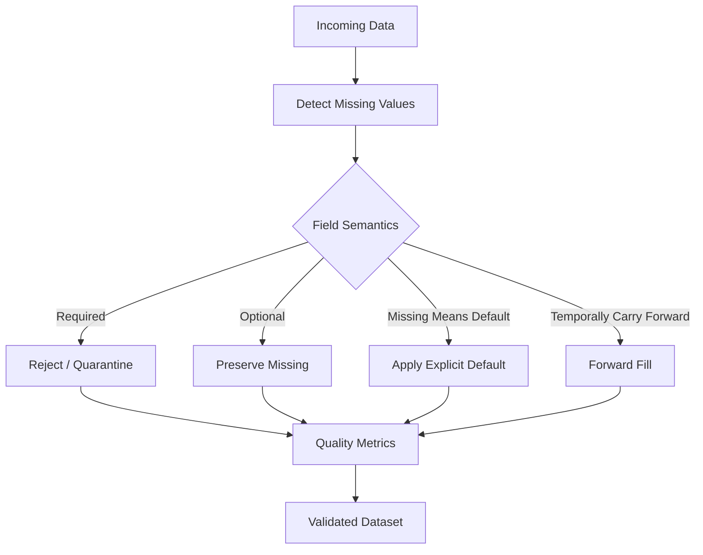

# 12- Missing Values Overview

## Overview

Missing values are an unavoidable part of real-world data processing.

API payloads omit optional fields, databases contain `NULL`, CSV files contain blank cells, event streams can have incomplete records, and business processes may legitimately lack information.

Pandas provides a consistent set of tools for detecting, representing, analyzing, and eventually handling missing values.

The important engineering distinction is:

```text
Missing
    ↓
Detected
    ↓
Classified
    ↓
Validated
    ↓
Handled according to business rules
```

Missing data should not automatically be replaced with zero, an empty string, or another default. The correct action depends on what the missing value means.

For example:

```text
missing customer_id
    → data-quality problem

missing discount
    → possibly "no discount"

missing shipped_at
    → possibly "not shipped yet"

missing middle_name
    → valid optional attribute
```

The technical operation is the same category of problem, but the business semantics are different.

## Why Missing Values Matter

Missing values affect:

- Filtering.
- Arithmetic.
- Comparisons.
- Aggregations.
- Sorting.
- Grouping.
- Joins.
- Type inference.
- Serialization.
- Reporting.
- Data quality checks.
- Machine-readable API output.
- Database persistence.

A pipeline can execute successfully while producing incorrect results because missing values were handled incorrectly.

For backend systems, missing-value handling is therefore a data-contract concern rather than only a cleaning concern.

## Sources of Missing Data

Common sources include:

| Source | Typical representation | Example |
|---|---|---|
| PostgreSQL | `NULL` | `discount = NULL` |
| REST API | Missing key / JSON `null` | `"phone": null` |
| CSV | Empty field / configured NA token | `,,,` |
| Excel | Empty cell | Blank spreadsheet cell |
| Python | `None` | `value = None` |
| NumPy | `NaN` | Floating-point missing marker |
| Pandas nullable types | `pd.NA` | `Int64`, `string`, `boolean` |

Different systems can use different representations for the same business state.

Pandas normalizes many of these into missing-value semantics, but exact behavior depends on the column dtype.

## Pandas Missing-Value Model

Pandas can represent missing values through several markers, most importantly:

```text
pd.NA
NaN
None
NaT
```

The appropriate representation depends on the dtype and operation.

Examples:

```python
import numpy as np
import pandas as pd

values = pd.Series(
    [10, None, 30],
    dtype="Float64",
)

timestamps = pd.Series(
    [
        pd.Timestamp("2026-01-01"),
        pd.NaT,
    ],
)
```

The recommended approach is not to compare directly against one particular marker.

Use Pandas missing-value APIs.

## `pd.NA`

`pd.NA` is Pandas' scalar missing-value representation used by nullable extension dtypes.

For example:

```python
customer_ids = pd.Series(
    [101, pd.NA, 103],
    dtype="Int64",
)
```

This preserves integer semantics while allowing missing values.

The important benefit is that missingness is represented as part of the dtype model rather than forcing the data into an incompatible representation.

## `NaN`

`NaN` is the traditional floating-point representation of missing numerical data.

For example:

```python
amounts = pd.Series(
    [250.0, np.nan, 500.0],
)
```

`NaN` is commonly encountered when working with floating-point data or NumPy-backed dtypes.

It is not a general-purpose replacement for all missing-value scenarios.

## `None`

Python's `None` frequently enters Pandas from application code or external records:

```python
values = pd.Series(
    [101, None, 103],
)
```

Pandas may infer a dtype that accommodates the missing value.

For production schemas, explicit nullable dtypes are generally preferable when the intended type is known.

## `NaT`

`NaT` means "Not a Time" and is used for missing datetime or timedelta values.

Example:

```python
created_at = pd.Series(
    [
        pd.Timestamp("2026-01-10", tz="UTC"),
        pd.NaT,
    ]
)
```

Use datetime-aware missing-value handling rather than converting timestamps into empty strings.

## Detecting Missing Values with `isna()`

The primary detection API is:

```python
orders["amount"].isna()
```

Example:

```python
orders = pd.DataFrame(
    {
        "order_id": [1001, 1002, 1003],
        "amount": [250.0, None, 500.0],
    }
)

missing_amount = orders["amount"].isna()
```

The result is a Boolean Series indicating which rows are missing.

## `isnull()` and `isna()`

`isnull()` and `isna()` are equivalent interfaces for missing-value detection.

Prefer:

```python
orders["amount"].isna()
```

because it clearly communicates the missing-data operation and is commonly used in modern Pandas code.

Similarly:

```python
orders["amount"].notna()
```

is preferred for detecting present values.

## `notna()`

Use `notna()` when the logic is easier to express in terms of valid values:

```python
valid_orders = orders.loc[
    orders["amount"].notna()
]
```

This is often clearer than negating `isna()`:

```python
valid_orders = orders.loc[
    ~orders["amount"].isna()
]
```

Both work, but `notna()` directly expresses the intent.

## Detecting Missing Values Across a DataFrame

To find missing values across the entire DataFrame:

```python
missing = orders.isna()
```

To count missing values per column:

```python
missing_counts = orders.isna().sum()
```

Example result:

```text
order_id       0
customer_id    2
amount         1
status         0
dtype: int64
```

This is one of the most useful first diagnostics during ingestion.

## Missing-Value Percentage

Counts are useful, but rates often provide better operational context:

```python
missing_rate = (
    orders.isna().mean()
)
```

Because Boolean values are treated numerically for this calculation:

```text
True  → 1
False → 0
```

the mean represents the fraction of missing values.

Convert to percentages:

```python
missing_percentage = (
    orders.isna()
    .mean()
    .mul(100)
    .round(2)
)
```

Example:

```text
customer_id    1.25
amount         0.40
status         0.00
```

This is useful for monitoring schema and data-quality drift.

## Missing Values Per Row

To count missing fields for each record:

```python
missing_per_row = (
    orders.isna()
    .sum(axis=1)
)
```

This can identify incomplete records:

```python
incomplete = orders.loc[
    missing_per_row >= 2
]
```

Use this carefully because not every missing field represents invalid data.

## Detecting Rows with Any Missing Value

```python
incomplete = orders.loc[
    orders.isna().any(axis=1)
]
```

This returns rows where at least one field is missing.

For strict ingestion validation, this can identify candidates for rejection or quarantine.

## Detecting Rows with No Missing Values

```python
complete = orders.loc[
    orders.notna().all(axis=1)
]
```

This is useful when a downstream transformation requires a fully populated set of fields.

It should not be used blindly when optional fields are legitimately nullable.

## Required vs Optional Fields

Production schemas should classify fields:

```text
Required
Optional
Conditionally required
Derived
```

For example:

| Field | Missing allowed? | Example rule |
|---|---:|---|
| `order_id` | No | Required identifier |
| `customer_id` | No | Required relationship |
| `discount_code` | Yes | Optional promotion |
| `shipped_at` | Yes | Required only after shipment |
| `cancelled_at` | Yes | Required only if cancelled |

Missing-value handling should follow these rules rather than a blanket "fill everything" strategy.

## Missing Values and Dtypes

Dtype selection directly affects missing-value semantics.

For example:

```python
customer_ids = pd.Series(
    [101, pd.NA, 103],
    dtype="Int64",
)
```

is preferable to forcing an integer field into an unsuitable generic representation.

Common nullable Pandas dtypes include:

```text
Int64
Float64
boolean
string
```

These types allow missing values while preserving useful logical semantics.

## Missing Integer Values

Consider:

```python
customer_ids = pd.Series(
    [101, None, 103],
)
```

For production code, make the intended type explicit:

```python
customer_ids = pd.Series(
    [101, None, 103],
    dtype="Int64",
)
```

This avoids relying on whatever inference occurs for the current input.

## Missing String Values

Use:

```python
statuses = pd.Series(
    [
        "completed",
        pd.NA,
        "pending",
    ],
    dtype="string",
)
```

Do not automatically convert missing strings into:

```text
""
"unknown"
"null"
"None"
```

unless one of these is explicitly part of the business contract.

A textual sentinel is a real value after insertion and may behave differently from missing data.

## Missing Boolean Values

Use nullable Boolean when unknown state matters:

```python
is_active = pd.Series(
    [True, False, pd.NA],
    dtype="boolean",
)
```

This distinguishes:

```text
True
False
Unknown
```

from:

```text
True
False
False
```

Collapsing unknown to false can produce incorrect business logic.

## Missing Datetimes

Datetime columns use `NaT` for missing timestamps:

```python
shipped_at = pd.Series(
    [
        pd.Timestamp(
            "2026-01-10",
            tz="UTC",
        ),
        pd.NaT,
    ]
)
```

This is preferable to an empty string because datetime operations can remain type-aware.

## Missing Values During Arithmetic

Missing values generally propagate through many arithmetic operations:

```python
amounts = pd.Series(
    [100.0, pd.NA, 50.0],
    dtype="Float64",
)

result = amounts * 1.18
```

The missing value remains missing rather than becoming an arbitrary number.

This is usually desirable because it prevents incomplete data from being silently treated as valid.

## Aggregation and Missing Values

Pandas aggregations often skip missing values by default.

For example:

```python
amounts = pd.Series(
    [100.0, pd.NA, 50.0],
    dtype="Float64",
)

total = amounts.sum()
```

The missing value does not automatically make the sum missing.

This behavior is convenient but must be understood when building business reports.

A missing amount and a zero amount are not necessarily equivalent.

## Missing vs Zero

These states can have different meanings:

```text
amount = 0
→ transaction amount is explicitly zero

amount = missing
→ amount is unknown or unavailable
```

Replacing:

```python
orders["amount"] = (
    orders["amount"]
    .fillna(0)
)
```

without a business rule can change the meaning of the dataset.

In financial reporting, this distinction can materially affect totals and compliance reporting.

## Missing vs Empty String

These are also different:

```text
missing
```

and:

```text
""
```

An empty string is an actual string value.

For text data:

```python
statuses = pd.Series(
    ["completed", "", pd.NA],
    dtype="string",
)
```

these values have different meanings.

Normalize them only when the source contract defines empty strings as missing.

## Missing Values During Comparisons

Direct comparisons with missing values can produce missing or non-Boolean semantics depending on the dtype.

For robust filtering:

```python
valid_amounts = orders.loc[
    orders["amount"].notna()
    & orders["amount"].gt(0)
]
```

This explicitly requires both:

```text
amount exists
AND
amount > 0
```

That is clearer than relying on implicit missing-value behavior.

## Missing Values and Boolean Masks

Suppose:

```python
orders["status"].eq("completed")
```

is used to filter records.

If `status` itself contains missing values, the exact mask behavior depends on the dtype and operation.

For business-critical filtering, make validity conditions explicit:

```python
completed = orders.loc[
    orders["status"].notna()
    & orders["status"].eq("completed")
]
```

This makes the intended treatment of missing status values obvious.

## Missing Values and Sorting

Missing values can affect ordering:

```python
orders.sort_values(
    "amount",
    na_position="last",
)
```

Explicitly specifying `na_position` makes reporting behavior predictable.

This is particularly useful for:

- Operational dashboards.
- Ranked reports.
- Customer lists.
- SLA reports.

## Missing Values and Grouping

Grouping behavior depends on whether missing keys should form a group.

For example:

```python
summary = (
    orders
    .groupby(
        "customer_id",
        dropna=False,
    )
    .agg(
        revenue=("amount", "sum"),
    )
)
```

`dropna=False` keeps missing grouping keys as a group.

This is useful when missing-key records should remain visible for data-quality analysis.

The default behavior can exclude missing group keys, so choose the behavior deliberately.

## Missing Values and Joins

Missing join keys can change whether records match.

For example:

```python
result = orders.merge(
    customers,
    on="customer_id",
    how="left",
)
```

Before joining, validate the key representation and understand how missing keys should be treated.

Do not assume that two missing identifiers represent the same real-world entity.

Join semantics should be designed around domain identity, not simply around missing-value behavior.

## Missing Values and `dropna()`

`dropna()` removes missing records or fields.

For example:

```python
valid_orders = orders.dropna(
    subset=["order_id", "amount"]
)
```

This is appropriate when those fields are mandatory for downstream processing.

Avoid using:

```python
orders.dropna()
```

as a generic cleaning operation.

It removes rows with missing values anywhere in the DataFrame, including fields that may be legitimately optional.

## Missing Values and `fillna()`

`fillna()` replaces missing values:

```python
orders["discount"] = (
    orders["discount"]
    .fillna(0)
)
```

This is appropriate only when:

```text
missing discount = no discount
```

is an established business rule.

The method itself is simple; deciding whether the replacement is semantically valid is the difficult engineering step.

## Missing Values and `ffill()` / `bfill()`

Forward and backward filling can be useful for time-series data:

```python
prices = prices.ffill()
```

But these operations carry assumptions about data continuity.

Use them only when the business meaning supports:

```text
last known value remains valid
```

Do not use forward fill on arbitrary transactional data.

## Missing Data Strategy

A production workflow should classify missingness before choosing an action:



The core idea is:

```text
Do not choose the operation first.
Choose the business interpretation first.
```

## Missing Values in ETL

A robust ETL pipeline can treat missing values at explicit boundaries:

```text
Source
  ↓
Parse
  ↓
Detect missing values
  ↓
Classify fields
  ↓
Normalize types
  ↓
Validate required fields
  ↓
Apply approved defaults
  ↓
Quarantine invalid records
  ↓
Transform
  ↓
Persist
```

This makes data-quality failures observable instead of silently hiding them.

## Missing Values from CSV

CSV is particularly prone to ambiguous missing values.

For example:

```text
order_id,amount,status
1001,250.00,completed
1002,,pending
1003,NA,completed
```

Different values may represent missingness.

During ingestion:

```python
orders = pd.read_csv(
    "orders.csv",
    na_values=[
        "",
        "NA",
    ],
    keep_default_na=True,
)
```

Choose NA tokens based on the source contract.

Do not assume every occurrence of `"NA"` or `"N/A"` is missing; it could be a legitimate domain value in some datasets.

## Missing Values from JSON APIs

Consider:

```python
payload = {
    "order_id": 1001,
    "discount": None,
}
```

After normalization:

```python
order = pd.json_normalize(
    [payload]
)
```

the missing field should remain semantically missing.

Avoid converting:

```python
None
```

into:

```text
"None"
```

because that creates a real string value and makes downstream missing-value detection incorrect.

## Missing Values from SQL

PostgreSQL exposes missing relational values as `NULL`.

A SQL query can distinguish missing values before Pandas sees them:

```sql
SELECT
    order_id,
    amount,
    COALESCE(discount, 0) AS discount
FROM orders;
```

However, the decision to apply `COALESCE()` belongs in SQL only when:

```text
NULL genuinely means the selected default
```

Otherwise, preserve the null and apply business-specific handling in the appropriate processing layer.

## Where Should Missing Values Be Handled?

The correct layer depends on semantics.

| Layer | Appropriate responsibility |
|---|---|
| Source SQL | Deterministic domain transformations that belong in database logic |
| API client | Transport and payload normalization |
| Pandas | Data cleaning, normalization, ETL rules |
| Validation layer | Required-field and business-rule checks |
| Database | Final storage constraints and integrity rules |
| Reporting layer | Presentation defaults when business-approved |

Do not automatically push all missing-value handling into Pandas.

Sometimes the database can handle it more efficiently; sometimes preserving the original null is necessary for auditability.

## Missing Values and Data Quality

Track missingness as a quality metric:

```python
missing_metrics = (
    orders.isna()
    .sum()
    .rename("missing_count")
    .to_frame()
)

missing_metrics["missing_rate"] = (
    missing_metrics["missing_count"]
    / len(orders)
)
```

For operational systems, monitor:

```text
Missing count
Missing rate
Required-field violations
Source-specific missingness
Change from previous runs
```

A sudden increase can indicate upstream regressions.

## Missingness by Batch

For batch processing:

```python
for chunk in pd.read_csv(
    "orders.csv",
    chunksize=100_000,
):
    missing_rate = (
        chunk.isna()
        .mean()
    )

    process_chunk(chunk)
```

This allows batch-level quality monitoring without loading the entire dataset.

It is especially useful for long-running Celery jobs and scheduled data-processing workers.

## Missing Values and Memory

Missingness itself is not usually the dominant memory concern.

The dtype representation is often more important.

For example:

```text
Object-backed mixed values
    ↓
Potentially high Python-object overhead

Dedicated nullable dtype
    ↓
More structured representation
```

Measure actual memory usage:

```python
memory = (
    orders.memory_usage(
        index=True,
        deep=True,
    )
    .sum()
)
```

Do not assume that filling null values always reduces memory.

A fill operation can instead create additional temporary objects or force dtype changes.

## Missing Values and Serialization

When exporting data:

```python
orders.to_parquet(
    "orders.parquet",
    index=False,
)
```

preserves typed missing values more naturally than text-oriented formats.

CSV output:

```python
orders.to_csv(
    "orders.csv",
    index=False,
)
```

requires consumers to understand how missing values are represented.

For service-to-service APIs, explicitly define whether missing data should appear as:

```text
null
missing key
empty string
```

These are different contracts.

## API Contract Considerations

For a REST response:

```json
{
  "order_id": 1001,
  "shipped_at": null
}
```

is different from:

```json
{
  "order_id": 1001
}
```

The first says:

```text
the field exists but currently has no value
```

The second can mean:

```text
the field is omitted
```

Backend systems should define this contract explicitly.

Pandas missing-value semantics do not automatically determine API semantics.

## Security Considerations

Missing values can sometimes expose sensitive workflow states.

For example:

```text
salary = missing
```

should not be interpreted or displayed as:

```text
salary = 0
```

in a system where absence could have compliance implications.

Similarly, do not use missing-value replacement to bypass security or authorization rules.

Examples:

```text
missing role → guest
missing permission → deny
missing tenant_id → reject
```

may be valid security policies, but they should be explicitly implemented as policies rather than incidental `fillna()` operations.

## Reliability and Failure Handling

Required missing fields should normally fail deterministically.

Example:

```python
required_columns = [
    "order_id",
    "customer_id",
]

missing_required = (
    orders[required_columns]
    .isna()
    .any(axis=1)
)

invalid_orders = orders.loc[
    missing_required
]

valid_orders = orders.loc[
    ~missing_required
]
```

The invalid records can then be:

```text
Rejected
Quarantined
Logged with safe metadata
Sent to a dead-letter workflow
```

rather than silently deleted.

For high-integrity data, preserving rejected records is often important for auditability and replay.

## Idempotent Missing-Value Handling

ETL transformations should be safe to run repeatedly.

A normalization such as:

```python
orders["status"] = (
    orders["status"]
    .fillna("pending")
)
```

is deterministic if `"pending"` is the documented default.

By contrast, a transformation whose meaning depends on previous processing state can make retries harder to reason about.

For batch systems and Celery workers, deterministic transformations improve retry safety.

## Testing Missing Values

Test both detection and business behavior:

```python
def test_required_amount_is_rejected():
    orders = pd.DataFrame(
        {
            "order_id": [1001, 1002],
            "amount": [250.0, None],
        }
    )

    invalid = orders.loc[
        orders["amount"].isna()
    ]

    assert len(invalid) == 1
    assert invalid.iloc[0]["order_id"] == 1002
```

Also test optional fields:

```python
def test_missing_discount_defaults_to_zero():
    orders = pd.DataFrame(
        {
            "order_id": [1001],
            "discount": [None],
        }
    )

    result = orders.assign(
        discount=orders["discount"].fillna(0)
    )

    assert result.loc[
        0,
        "discount",
    ] == 0
```

The test should document the business rule that justifies the default.

## Common Mistakes

### Replacing Every Missing Value with Zero

```python
df = df.fillna(0)
```

This can destroy the distinction between unknown, not applicable, and zero.

**Better:** handle fields according to their business semantics.

### Replacing Missing Text with Empty Strings

```python
df["status"] = df["status"].fillna("")
```

This converts missingness into a real value.

**Better:** preserve missing values unless an empty string is part of the explicit contract.

### Treating Missing as False

This is dangerous for nullable flags.

**Better:** use `boolean` dtype and distinguish `True`, `False`, and unknown.

### Using `dropna()` on the Entire DataFrame

```python
df.dropna()
```

can remove valid records because of optional fields.

**Better:** specify `subset=` for required columns.

### Comparing Directly Against `None`

This is not a reliable general missing-value test:

```python
df["amount"] == None
```

**Better:** use:

```python
df["amount"].isna()
```

### Assuming `NaN`, `None`, and `pd.NA` Are Identical

Their behavior can differ depending on dtype and operation.

**Better:** use Pandas missing-value APIs and choose nullable dtypes deliberately.

### Assuming Missing Values Always Break Aggregations

Many Pandas aggregations skip missing values by default.

**Better:** understand the operation's missing-data behavior before interpreting results.

### Treating Missing Join Keys as Ordinary IDs

A missing identifier does not establish entity identity.

**Better:** validate join keys and define how incomplete relationships should be handled.

### Forward-Filling Transactional Data

`ffill()` assumes the previous value remains valid.

**Better:** use it only when the domain supports temporal carry-forward semantics.

### Hiding Data-Quality Problems with Defaults

A default value can make a pipeline appear healthy while masking upstream failures.

**Better:** emit metrics and alerts whenever unexpected missingness increases.

### Ignoring Empty Inputs

An empty DataFrame is not equivalent to a DataFrame containing rows with missing values.

**Better:** handle empty input and missing fields as separate conditions.

### Logging Full Rows with Sensitive Missingness Context

Debug logs containing personal, financial, or authentication data can create a security problem.

**Better:** log counts, rates, safe identifiers, and error categories.

## Interview Traps

### What Is the Difference Between `isna()` and `notna()`?

`isna()` identifies missing values, while `notna()` identifies values that are present.

### Are `None`, `NaN`, and `pd.NA` the Same?

They are all associated with missing data, but their behavior and representation depend on dtype and operation. Pandas provides unified detection APIs so application code does not need to compare against each marker separately.

### Is an Empty String a Missing Value?

Not inherently. `""` is a real string value unless the source contract explicitly defines it as missing.

### Why Use `Int64` Instead of `int64`?

`Int64` is a nullable Pandas integer dtype and can represent missing values while retaining integer semantics.

### Does `dropna()` Remove Columns or Rows?

By default, `dropna()` removes rows containing missing values. Its `axis`, `subset`, and threshold-related options determine the exact behavior.

### Why Is `df.fillna(0)` Often Dangerous?

Because zero can have a different business meaning from unknown or unavailable data.

### How Do You Calculate Missing-Value Rates?

```python
missing_rate = (
    df.isna()
    .mean()
)
```

Multiply by `100` for percentages.

### Do GroupBy Operations Include Missing Group Keys?

By default, missing group keys are generally excluded. Use:

```python
groupby(
    ...,
    dropna=False,
)
```

when missing keys should form an explicit group.

### Should Missing Values Be Handled in SQL or Pandas?

Either can be correct. Put the logic in the layer where the semantic rule belongs, considering database efficiency, reuse, auditability, and downstream contracts.

### What Is a Good Production Strategy for Required Missing Fields?

Detect them explicitly, separate invalid records from valid records, emit metrics, and reject or quarantine the invalid data according to the pipeline's failure policy.

## Practical Missing-Value Validation Pattern

A reusable validator can distinguish required-field violations from optional missing values:

```python
import pandas as pd


def validate_required_fields(
    df: pd.DataFrame,
    required_columns: list[str],
) -> tuple[pd.DataFrame, pd.DataFrame]:
    missing_required = (
        df[required_columns]
        .isna()
        .any(axis=1)
    )

    invalid = df.loc[
        missing_required
    ].copy()

    valid = df.loc[
        ~missing_required
    ].copy()

    return valid, invalid
```

Usage:

```python
valid_orders, invalid_orders = (
    validate_required_fields(
        orders,
        [
            "order_id",
            "customer_id",
            "amount",
        ],
    )
)
```

This preserves both datasets for downstream handling.

A production pipeline can then send `invalid_orders` to a quarantine table or object-store location rather than silently dropping it.

## Practical Missing-Value Workflow

```text
Receive source data
        ↓
Inspect schema
        ↓
Detect missing values
        ↓
Measure missing rates
        ↓
Classify required / optional fields
        ↓
Normalize dtypes
        ↓
Apply explicit business defaults
        ↓
Reject or quarantine invalid records
        ↓
Transform validated records
        ↓
Write output
        ↓
Monitor quality metrics
```

The most important engineering principle is to preserve information until the business rule explicitly determines how missingness should be resolved.

## Production Checklist

```text
[ ] Which fields are required?
[ ] Which fields are optional?
[ ] Which fields are conditionally required?
[ ] What does missing mean for each field?
[ ] Are source-specific missing markers normalized?
[ ] Are nullable Pandas dtypes being used where appropriate?
[ ] Are identifiers protected from accidental numeric conversion?
[ ] Are missing values detected with isna() / notna()?
[ ] Are missing-value counts and rates measured?
[ ] Are defaults backed by explicit business rules?
[ ] Are missing and zero treated separately where necessary?
[ ] Are missing and empty-string semantics distinct?
[ ] Are required-field failures separated from valid records?
[ ] Are invalid records quarantined or otherwise recoverable?
[ ] Are groupby and aggregation missing-value behaviors understood?
[ ] Are join-key missing values handled deliberately?
[ ] Are timestamp missing values represented as datetime-compatible missing values?
[ ] Are missing-value transformations deterministic and retry-safe?
[ ] Are quality metrics monitored across batches?
[ ] Are sensitive records excluded from logs?
[ ] Are normal, empty, invalid, and partially missing inputs tested?
[ ] Is missing-value behavior documented as part of the data contract?
```

## Key Takeaways

- Missing values are a semantic data state, not a generic error condition; the correct treatment depends on whether a field is required, optional, conditionally required, or explicitly defaultable.
- Pandas supports missing-value semantics through representations such as `pd.NA`, `NaN`, `None`, and `NaT`; use `isna()` and `notna()` rather than comparing directly with a particular marker.
- Nullable dtypes such as `Int64`, `Float64`, `boolean`, and `string` preserve useful type semantics when missing values are valid.
- Production ETL pipelines should detect, measure, classify, validate, and explicitly handle missingness while preserving rejected records for troubleshooting, replay, and auditability.
- Never use blanket operations such as `fillna(0)` or `dropna()` without confirming their business meaning, because they can silently change the meaning and quality of downstream data.