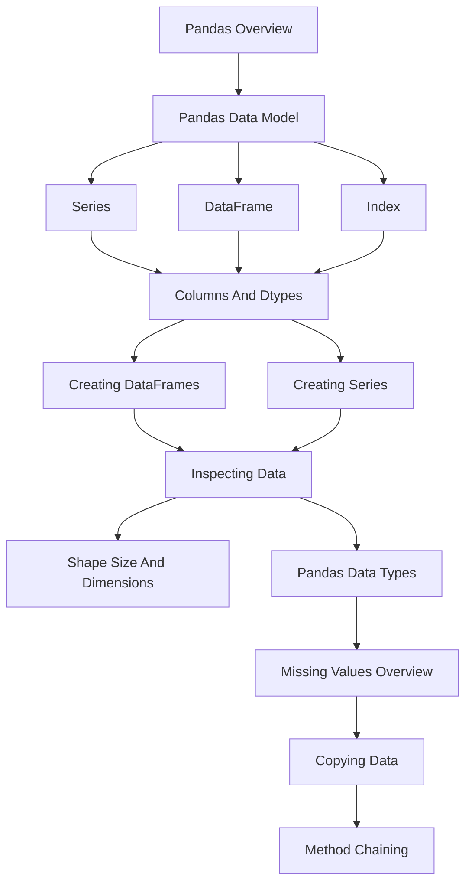
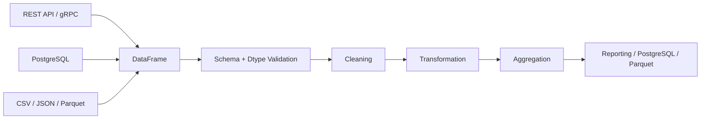

# README

## Overview

This section establishes the foundational Pandas concepts required for reliable DataFrame and Series processing.

The focus is not on memorizing individual methods. The goal is to understand the Pandas data model, construct predictable objects, inspect their structure, control dtypes, handle missing values, manage copies, and build readable transformation pipelines.

These fundamentals support every later section:

```text
Fundamentals
    ↓
Reading and Writing Data
    ↓
Selecting and Filtering
    ↓
Data Cleaning
    ↓
Data Transformation
    ↓
Grouping and Aggregation
    ↓
Combining Data
    ↓
Sorting, Ranking and Statistics
    ↓
Strings and Datetime
    ↓
Performance and Memory
    ↓
Backend and Data Engineering
    ↓
Interview Preparation
## Navigation

| # | File | Description |
|---|---|---|
| 01 | [01- Pandas Overview](./01-%20Pandas%20Overview.md) | Foundational Pandas concepts covering DataFrame and Series processing |
| 02 | [02- Pandas Data Model](./02-%20Pandas%20Data%20Model.md) | Data model, structure, and semantics of Pandas objects |
| 03 | [03- Series.md](./03-%20Series.md) | One-dimensional labeled data and Series semantics |
| 04 | [04- Dataframe.md](./04-%20Dataframe.md) | Two-dimensional tabular data and column-oriented processing |
| 05 | [05- Index.md](./05-%20Index.md) | Labels, alignment, selection, and index semantics |
| 06 | [06- Columns And Dtypes.md](./06-%20Columns%20And%20Dtypes.md) | Column schema and dtype decisions |
| 07 | [07- Creating Dataframes.md](./07-%20Creating%20Dataframes.md) | Constructing DataFrames from records, dictionaries, arrays, and external sources |
| 08 | [08- Creating Series.md](./08-%20Creating%20Series.md) | Constructing typed Series with explicit Index and dtype semantics |
| 09 | [09- Inspecting Data.md](./09-%20Inspecting%20Data.md) | Structural inspection, schema checks, row counts, and data-quality diagnostics |
| 10 | [10- Shape Size And Dimensions.md](./10-%20Shape%20Size%20And%20Dimensions.md) | Understanding rows, columns, dimensions, and total element counts |
| 11 | [11- Pandas Data Types.md](./11-%20Pandas%20Data%20Types.md) | Numeric, string, boolean, datetime, categorical, nullable, and object dtypes |
| 12 | [12- Missing Values Overview.md](./12-%20Missing%20Values%20Overview.md) | Detection, semantics, validation, and production handling of missing data |
| 13 | [13- Copying Data.md](./13-%20Copying%20Data.md) | Ownership, mutation, copying, and memory implications |
| 14 | [14- Method Chaining.md](./14-%20Method%20Chaining.md) | Readable and maintainable Pandas transformation pipelines |

A backend engineer should be comfortable moving between Python objects, API payloads, database query results, files, and Pandas structures without losing control of schema, row identity, types, missing values, or memory behavior.

## What This Section Covers

| Topic | Primary focus |
|---|---|
| Pandas Overview | Pandas role, architecture, and backend/data-engineering use cases |
| Pandas Data Model | DataFrame, Series, Index, columns, values, and alignment |
| Series | One-dimensional labeled data and Series semantics |
| DataFrame | Two-dimensional tabular data and column-oriented processing |
| Index | Labels, alignment, selection, and index semantics |
| Columns And Dtypes | Column schema and dtype decisions |
| Creating DataFrames | Constructing DataFrames from records, dictionaries, arrays, and external sources |
| Creating Series | Constructing typed Series with explicit Index and dtype semantics |
| Inspecting Data | Structural inspection, schema checks, row counts, and data-quality diagnostics |
| Shape Size And Dimensions | Understanding rows, columns, dimensions, and total element counts |
| Pandas Data Types | Numeric, string, boolean, datetime, categorical, nullable, and object dtypes |
| Missing Values Overview | Detection, semantics, validation, and production handling of missing data |
| Copying Data | Ownership, mutation, copying, and memory implications |
| Method Chaining | Readable and maintainable Pandas transformation pipelines |

## How the Topics Fit Together

The section follows a dependency-oriented progression.



The progression is intentional:

```text
Understand the objects
        ↓
Create the objects
        ↓
Inspect the objects
        ↓
Understand their schema
        ↓
Handle missingness
        ↓
Control ownership
        ↓
Compose transformations
```

Later sections assume these fundamentals rather than re-explaining them.

## Core Mental Model

The most useful mental model is:

```text
DataFrame
├── Index
├── Columns
├── Series
├── Values
└── Dtypes
```

A DataFrame can be viewed as multiple aligned Series:

```python
orders["order_id"]
orders["customer_id"]
orders["amount"]
orders["status"]
```

Each Series has its own values and dtype while sharing the DataFrame's row axis.

This explains several important Pandas behaviors:

```text
Column selection
      ↓
Series

Series arithmetic
      ↓
Index alignment

DataFrame construction
      ↓
Schema + Index + values

Filtering
      ↓
Subset with preserved labels

Aggregation
      ↓
New shape and potentially new Index
```

Understanding these semantics is more valuable than memorizing individual method signatures.

## Fundamental Data Model

### Series

A Series represents one logical vector:

```python
amount = pd.Series(
    [250.0, 175.5, 500.0],
    name="amount",
    dtype="Float64",
)
```

It contains:

```text
Index
Values
Dtype
Name
```

### DataFrame

A DataFrame represents aligned tabular data:

```python
orders = pd.DataFrame(
    {
        "order_id": [1001, 1002, 1003],
        "amount": [250.0, 175.5, 500.0],
    }
)
```

Its core structural properties include:

```python
orders.index
orders.columns
orders.dtypes
orders.shape
orders.ndim
orders.size
```

### Index

The Index identifies and aligns rows:

```python
orders.loc[0]
orders.iloc[0]
```

Do not confuse a Pandas Index with a PostgreSQL database index.

A Pandas Index primarily provides labeling and alignment semantics within the in-memory object.

## Schema Is a First-Class Concern

A production DataFrame should have an intentional schema.

Consider:

```text
order_id     → identifier
customer_id  → identifier
status       → controlled text
amount       → numeric measure
created_at   → timestamp
```

Then map those logical meanings to suitable Pandas dtypes.

A useful schema model is:

```text
Business meaning
        ↓
Expected logical type
        ↓
Pandas dtype
        ↓
Validation rules
```

For example:

```python
ORDER_DTYPES = {
    "order_id": "Int64",
    "customer_id": "Int64",
    "status": "string",
    "amount": "Float64",
}
```

This prevents the pipeline from depending entirely on whatever dtype happens to be inferred from the current input.

## Row Grain

Every production DataFrame should have a defined row grain.

Examples:

```text
one row = one order

one row = one order item

one row = one customer

one row = one event
```

This matters because operations such as joins and aggregations can change row counts while still producing syntactically valid DataFrames.

Before transforming a DataFrame, know:

```text
What does one row represent?
What uniquely identifies a row?
Can joins multiply rows?
Which fields are required?
```

Row grain is one of the most important concepts connecting Pandas to relational databases and ETL systems.

## Construction Principles

DataFrame and Series construction should establish predictable structure.

Prefer:

```python
orders = pd.DataFrame(
    records,
    columns=[
        "order_id",
        "customer_id",
        "status",
        "amount",
    ],
)
```

over constructing arbitrary source fields and cleaning up the schema much later.

For empty inputs, preserve the expected schema:

```python
orders = pd.DataFrame(
    {
        "order_id": pd.Series(
            dtype="Int64"
        ),
        "customer_id": pd.Series(
            dtype="Int64"
        ),
        "status": pd.Series(
            dtype="string"
        ),
        "amount": pd.Series(
            dtype="Float64"
        ),
    }
)
```

An empty dataset can still have a meaningful schema.

## Inspection Principles

After loading or constructing data, inspect it before performing expensive transformations.

Typical checks:

```python
rows, columns = orders.shape

print(orders.head())
print(orders.dtypes)
print(orders.isna().sum())
print(orders.columns)
print(orders.index)
```

For memory diagnostics:

```python
memory_bytes = (
    orders.memory_usage(
        index=True,
        deep=True,
    )
    .sum()
)
```

Inspection should answer:

```text
What did I receive?
How large is it?
What columns exist?
What are the dtypes?
How much data is missing?
What is the row grain?
```

## Dtype Principles

Dtypes affect much more than display.

They influence:

- Arithmetic behavior.
- Missing-value semantics.
- Memory usage.
- String operations.
- Datetime operations.
- Grouping.
- Sorting.
- Joins.
- Serialization.
- Database interoperability.

Examples:

```python
pd.Series(
    [101, None],
    dtype="Int64",
)

pd.Series(
    ["completed", None],
    dtype="string",
)

pd.Series(
    [True, None],
    dtype="boolean",
)
```

The general rule is:

```text
Choose dtype from business meaning,
not merely from the source representation.
```

For example, an identifier such as:

```text
000123
```

may need to remain a string rather than becoming an integer.

## Missing-Value Principles

Missing data should be interpreted, not blindly replaced.

A missing value can mean:

```text
Unknown
Not provided
Not applicable
Not yet available
Invalid source value
Upstream contract failure
```

These states can require different treatment.

A useful workflow is:

```text
Detect
  ↓
Measure
  ↓
Classify
  ↓
Validate
  ↓
Handle according to business rules
```

Avoid blanket operations such as:

```python
df.fillna(0)
```

unless the business semantics explicitly define missing as zero.

## Copy and Mutation Principles

Understand ownership before mutating a DataFrame.

This:

```python
working = orders
```

creates another reference.

This:

```python
working = orders.copy()
```

creates an explicitly independent working object.

A production function should make its mutation contract clear:

```text
Mutates input
OR
Returns independent result
```

Avoid unnecessary copies because large DataFrames can make copying a significant memory operation.

## Method Chaining Principles

Method chaining is useful when a transformation can be expressed as a clear sequence:

```python
report = (
    orders
    .loc[
        lambda df: df["status"].eq(
            "completed"
        )
    ]
    .assign(
        amount=lambda df: pd.to_numeric(
            df["amount"],
            errors="coerce",
        ).astype("Float64")
    )
    .dropna(
        subset=["amount"]
    )
    .groupby(
        "customer_id",
        as_index=False,
    )
    .agg(
        revenue=("amount", "sum")
    )
    .sort_values(
        "revenue",
        ascending=False,
    )
)
```

The objective is readability, not minimum line count.

Use named intermediate DataFrames or `pipe()` when a chain becomes difficult to understand.

## Backend Data Flow

Pandas often sits between external systems and downstream storage or reporting:



The fundamentals in this section establish the rules for the `DataFrame` stage.

For example:

```text
API payload
    ↓
DataFrame construction
    ↓
dtype normalization
    ↓
missing-value validation
    ↓
transformation
    ↓
output
```

Later sections extend this into complete ETL workflows.

## Production Engineering Concerns

### Performance

The fundamentals directly affect performance.

Important controls include:

```text
Load only required columns
Use suitable dtypes
Avoid unnecessary copies
Prefer vectorized operations
Filter early when appropriate
Keep intermediate datasets bounded
```

For example, do not load a large CSV with dozens of unused columns if only three are required:

```python
orders = pd.read_csv(
    "orders.csv",
    usecols=[
        "order_id",
        "customer_id",
        "amount",
    ],
)
```

### Memory

Pandas is primarily an in-memory processing library.

Memory usage is influenced by:

```text
Rows
Columns
Dtypes
Index
Object-backed values
Temporary results
Copies
Concurrency
```

A DataFrame that works locally with a small sample may fail in a Kubernetes or Celery worker when production volume increases.

### Reliability

Data-processing functions should be deterministic and explicit about:

```text
Expected schema
Required fields
Missing-value behavior
Dtype normalization
Invalid values
Duplicate handling
Output shape
```

This makes jobs safer to retry and easier to debug.

### Security

DataFrames can contain:

```text
Customer information
Financial records
Authentication metadata
Internal identifiers
Sensitive event data
```

Avoid logging complete DataFrames.

Prefer:

```python
logger.info(
    "orders_processed rows=%d columns=%d",
    orders.shape[0],
    orders.shape[1],
)
```

rather than:

```python
logger.debug(
    "orders=%s",
    orders,
)
```

### Scalability

Pandas is appropriate when the working set fits comfortably within the worker's memory budget.

At larger scales, consider:

```text
SQL pushdown
Chunk processing
Partitioned Parquet
DuckDB
Polars
Spark
Distributed processing
```

The correct solution depends on workload size, latency requirements, operational complexity, and existing infrastructure.

## Common Engineering Mistakes

### Treating Pandas as a Database

Pandas is an in-memory processing engine, not a relational database.

Do not expect database-style concurrency, transactions, indexing, or durable storage semantics.

Use PostgreSQL or another database for transactional persistence and Pandas for appropriate in-memory processing.

### Treating the Index as Business Identity

The default index:

```text
0, 1, 2, ...
```

does not automatically represent a business key.

Explicitly model domain identifiers such as:

```text
order_id
customer_id
transaction_id
```

### Trusting Inference Too Much

External data often contains:

```text
Mixed values
Missing values
String-formatted numbers
Inconsistent booleans
Ambiguous timestamps
```

Normalize and validate important fields explicitly.

### Using Blanket Cleaning Operations

Operations such as:

```python
df.fillna(0)
df.dropna()
```

can destroy valid business information when applied without field-specific rules.

### Ignoring Row Grain

A merge can multiply rows.

An aggregation can collapse rows.

A filter can remove rows.

Always understand how an operation changes the dataset's grain and shape.

### Overusing Copies

Full DataFrame copies can create high peak memory usage.

Copy at meaningful ownership boundaries rather than after every operation.

### Overusing Method Chaining

A very long chain can become harder to debug than a few well-named intermediate variables.

Readable code is the objective.

## How to Use This Section

Work through the topics in order when building foundational knowledge:

```text
Pandas Overview
        ↓
Pandas Data Model
        ↓
Series / DataFrame / Index
        ↓
Columns And Dtypes
        ↓
Creating DataFrames / Series
        ↓
Inspecting Data
        ↓
Shape Size And Dimensions
        ↓
Pandas Data Types
        ↓
Missing Values
        ↓
Copying Data
        ↓
Method Chaining
```

The concepts are intentionally repeated across different perspectives:

```text
DataFrame
    ↕
Series
    ↕
Index
    ↕
Dtype
    ↕
Missing values
    ↕
Transformation
```

The objective is to build a consistent mental model before moving into data loading, cleaning, transformation, and backend-oriented workflows.

## Recommended Engineering Habits

Use these habits throughout the rest of the Pandas section:

```text
Define row grain
        ↓
Define schema
        ↓
Inspect input
        ↓
Normalize dtypes
        ↓
Validate missingness
        ↓
Reduce data early
        ↓
Transform explicitly
        ↓
Measure shape and quality
        ↓
Write validated output
```

Prefer:

```python
orders["amount"]
```

over unnecessary reconstruction of existing columns.

Prefer:

```python
pd.to_numeric(
    source,
    errors="coerce",
)
```

when external numeric representations need controlled conversion.

Prefer:

```python
orders.merge(
    customers,
    on="customer_id",
    validate="many_to_one",
)
```

when join cardinality is known.

Prefer:

```python
pd.testing.assert_frame_equal(
    actual,
    expected,
)
```

for DataFrame behavior tests.

## Fundamentals Checklist

```text
[ ] Can I explain the difference between Series and DataFrame?
[ ] Do I understand what the Index represents?
[ ] Can I explain Pandas alignment behavior?
[ ] Can I construct a DataFrame from common Python structures?
[ ] Can I construct a typed Series?
[ ] Can I inspect schema and dtypes quickly?
[ ] Do I understand shape, size, ndim, and len()?
[ ] Can I distinguish memory usage from element count?
[ ] Do I understand nullable Pandas dtypes?
[ ] Can I distinguish missing from zero or empty string?
[ ] Do I understand DataFrame ownership and copying?
[ ] Can I design a non-mutating transformation function?
[ ] Can I build a readable method chain?
[ ] Can I identify when a chain should be broken into named stages?
[ ] Can I define row grain before joining or aggregating?
[ ] Can I identify unnecessary data and memory costs?
[ ] Can I validate a DataFrame before processing it?
[ ] Can I explain how Pandas fits between APIs, SQL, files, and storage?
```

## Key Takeaways

- Pandas fundamentals are built around a small set of concepts: DataFrame, Series, Index, dtypes, missing values, shape, and ownership; understanding their interaction is more important than memorizing methods.
- Production DataFrames should have a deliberate row grain and schema, with explicit dtype and missing-value semantics for important fields.
- Inspection, validation, and data reduction should happen before expensive transformations, especially when data originates from APIs, SQL databases, CSV files, or object storage.
- Copying and method chaining are engineering design decisions: copy when ownership isolation is required, and chain transformations only while the resulting code remains clear and testable.
- These fundamentals form the foundation for reliable ETL, database and API integration, performance optimization, and the larger Pandas data-engineering workflow covered in later sections.