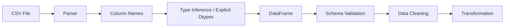
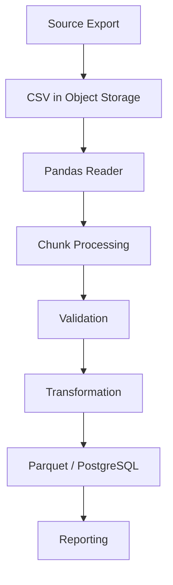

# 01- CSV

## Overview

CSV is one of the most common interchange formats for operational exports, data ingestion, reporting pipelines, and batch processing.

Pandas provides `read_csv()` and `to_csv()` for moving data between CSV files and DataFrames:

```text
CSV file
   ↓
Parser
   ↓
DataFrame
   ↓
Validation / Cleaning
   ↓
Transformation
   ↓
DataFrame
   ↓
CSV output
```

CSV is convenient because it is simple, portable, and widely supported. Its simplicity is also its main limitation: it does not natively preserve rich schema information such as nullable integer semantics, timezone metadata, indexes, or relationships.

For production systems, CSV should therefore be treated as a transport or interchange format rather than as a strongly typed database representation.

## Reading CSV Files

The primary API is:

```python
import pandas as pd

orders = pd.read_csv(
    "orders.csv"
)
```

Pandas parses the file and returns a DataFrame.

A typical workflow is:

```python
orders = pd.read_csv(
    "orders.csv",
    usecols=[
        "order_id",
        "customer_id",
        "status",
        "amount",
    ],
)
```

The `usecols` projection is important for production workloads because it avoids loading unnecessary columns.

## Typical CSV Structure

Consider:

```text
order_id,customer_id,status,amount
1001,101,completed,250.00
1002,102,pending,175.50
1003,101,completed,500.00
```

Read it with:

```python
orders = pd.read_csv(
    "orders.csv"
)
```

Then inspect:

```python
print(orders.head())
print(orders.dtypes)
print(orders.shape)
```

Do not assume that successful parsing means the input satisfies the expected business schema.

## CSV Parsing Flow

The logical ingestion flow is:



The parser is responsible for representing the file as tabular data.

Application code is still responsible for determining whether that table is valid.

## Column Projection with `usecols`

Load only required columns:

```python
orders = pd.read_csv(
    "orders.csv",
    usecols=[
        "order_id",
        "customer_id",
        "amount",
    ],
)
```

This can reduce:

- File parsing work.
- Memory consumption.
- Downstream transformation cost.
- Serialization overhead.

Projection is especially important for large CSV files processed by Docker, Kubernetes, Celery, or AWS batch workers.

## Explicit Dtypes

CSV stores textual data, so Pandas often has to infer dtypes.

When the schema is known, specify it:

```python
orders = pd.read_csv(
    "orders.csv",
    dtype={
        "order_id": "Int64",
        "customer_id": "Int64",
        "status": "string",
    },
)
```

For numeric data that requires controlled parsing:

```python
orders["amount"] = pd.to_numeric(
    orders["amount"],
    errors="coerce",
).astype("Float64")
```

Explicit dtypes reduce inference surprises.

## Identifiers Should Not Automatically Be Numeric

Consider:

```text
customer_id
000123
000124
000125
```

If the leading zeros are part of the identifier, read the column as text:

```python
customers = pd.read_csv(
    "customers.csv",
    dtype={
        "customer_id": "string",
    },
)
```

Otherwise:

```text
000123 → 123
```

can destroy information required for joins or downstream reporting.

## Parsing Dates

Datetime columns should be parsed deliberately:

```python
orders = pd.read_csv(
    "orders.csv",
    dtype={
        "order_id": "Int64",
        "status": "string",
    },
    parse_dates=[
        "created_at",
    ],
)
```

For timestamps requiring explicit UTC normalization, normalize after ingestion when appropriate:

```python
orders["created_at"] = pd.to_datetime(
    orders["created_at"],
    utc=True,
)
```

Do not leave operational timestamps as arbitrary strings if date filtering or time arithmetic will be performed.

## Boolean Fields

CSV boolean values are often inconsistent:

```text
true
false
TRUE
FALSE
1
0
yes
no
```

Do not blindly use:

```python
astype(bool)
```

on arbitrary strings because non-empty strings are truthy.

Use explicit normalization:

```python
mapping = {
    "true": True,
    "false": False,
    "yes": True,
    "no": False,
}

orders["is_active"] = (
    orders["is_active"]
    .astype("string")
    .str.strip()
    .str.lower()
    .map(mapping)
    .astype("boolean")
)
```

Invalid representations can then be detected and handled explicitly.

## Missing Values in CSV

CSV files frequently represent missing values through:

```text
empty fields
NA
N/A
null
NULL
```

Pandas can recognize configured missing-value tokens:

```python
orders = pd.read_csv(
    "orders.csv",
    na_values=[
        "",
        "NA",
        "N/A",
    ],
)
```

Do not configure tokens without understanding the source domain. A string such as `"NA"` could theoretically be valid business data.

## `keep_default_na`

Pandas has default missing-value parsing behavior.

You can control it:

```python
orders = pd.read_csv(
    "orders.csv",
    keep_default_na=False,
)
```

This can be useful when strings that Pandas normally interprets as missing must remain literal values.

Use this carefully because disabling default missing-value parsing changes downstream null semantics.

## Empty Strings vs Missing Values

These are different:

```text
""
```

and:

```text
missing
```

If an upstream system treats an empty CSV field as missing, configure the parser accordingly.

Otherwise, downstream validation may incorrectly treat the value as a valid string.

## Delimiters

CSV files do not always use commas.

For semicolon-delimited files:

```python
orders = pd.read_csv(
    "orders.csv",
    sep=";",
)
```

For tab-separated files:

```python
orders = pd.read_csv(
    "orders.tsv",
    sep="\t",
)
```

The separator is part of the input contract.

Do not assume that a `.csv` extension guarantees comma-separated data.

## Quoting

CSV fields can contain delimiters inside quoted values:

```text
order_id,customer_name
1001,"Acme, Inc."
```

Pandas handles standard CSV quoting:

```python
orders = pd.read_csv(
    "orders.csv"
)
```

For non-standard source systems, parser options such as quoting and escaping may need explicit configuration.

## Encoding

The file encoding must match the source.

For UTF-8:

```python
customers = pd.read_csv(
    "customers.csv",
    encoding="utf-8",
)
```

For an external system producing a different encoding:

```python
customers = pd.read_csv(
    "customers.csv",
    encoding="latin-1",
)
```

Prefer UTF-8 for newly designed systems unless an external interoperability requirement dictates otherwise.

Encoding problems should be treated as ingestion failures rather than silently replacing corrupted text.

## Header Handling

By default, Pandas expects column headers in the first row.

For a file without headers:

```python
orders = pd.read_csv(
    "orders.csv",
    header=None,
    names=[
        "order_id",
        "customer_id",
        "amount",
    ],
)
```

This is useful for legacy exports and machine-generated files.

Explicitly defining `names` gives the resulting DataFrame a predictable schema.

## Skipping Rows

Metadata or preamble rows may appear before the actual header:

```python
orders = pd.read_csv(
    "orders.csv",
    skiprows=2,
)
```

This should be used only when the source structure is stable and documented.

Blindly skipping rows is risky because a source-format change can cause the parser to interpret data incorrectly without an obvious failure.

## Selecting Index Columns

An index can be created while reading:

```python
orders = pd.read_csv(
    "orders.csv",
    index_col="order_id",
)
```

Use this only when index semantics provide practical value.

Do not automatically make every business identifier the DataFrame Index.

For many ETL workflows, keeping:

```text
order_id
```

as an ordinary column is simpler.

## Reading Large CSV Files

Pandas loads CSV data into memory unless a chunked approach is used.

For large inputs:

```python
for chunk in pd.read_csv(
    "orders.csv",
    chunksize=100_000,
):
    process_chunk(chunk)
```

The processing flow becomes:

```text
CSV
 ↓
100K-row chunk
 ↓
Validate
 ↓
Transform
 ↓
Persist
 ↓
Next chunk
```

This bounds the DataFrame working set by chunk size rather than total file size.

## Chunked Processing Pattern

A production-style pattern is:

```python
for chunk in pd.read_csv(
    "orders.csv",
    chunksize=100_000,
    dtype={
        "order_id": "Int64",
        "customer_id": "Int64",
        "status": "string",
        "amount": "Float64",
    },
):
    valid = chunk.loc[
        chunk["order_id"].notna()
        & chunk["customer_id"].notna()
    ]

    valid = valid.assign(
        status=lambda df: (
            df["status"]
            .str.strip()
            .str.lower()
        )
    )

    write_batch(valid)
```

The batch should be independently valid before being persisted.

## Chunk Size

There is no universal optimal chunk size.

A useful chunk size depends on:

```text
Row width
Dtypes
Available memory
Transformation complexity
Target database throughput
Network bandwidth
Worker concurrency
```

For production tuning, benchmark representative data.

Too small:

```text
More parser overhead
More function calls
More database writes
```

Too large:

```text
Higher peak memory
Longer failure/retry units
Greater per-batch latency
```

## Reading from File-Like Objects

`read_csv()` can work with file-like objects:

```python
from io import StringIO

content = """order_id,amount
1001,250.00
1002,175.50
"""

orders = pd.read_csv(
    StringIO(content)
)
```

This is useful when CSV data comes from:

- HTTP responses.
- S3 object streams.
- In-memory buffers.
- Tests.
- Other application services.

For large remote files, avoid downloading the entire object into memory when a streaming or chunked design is more appropriate.

## Reading CSV from Object Storage

A production pipeline may read from S3:

```python
orders = pd.read_csv(
    "s3://example-bucket/orders/orders.csv"
)
```

This requires the appropriate filesystem integration and credentials.

The architecture is often:

```text
S3
 ↓
Pandas reader
 ↓
DataFrame / chunk
 ↓
Validation
 ↓
Transformation
 ↓
Parquet / PostgreSQL
```

For frequently accessed analytical datasets, converting raw CSV into Parquet can reduce future parsing and storage costs.

## CSV and Parquet

CSV is text-oriented and schema-light.

Parquet is typed and columnar.

| Characteristic | CSV | Parquet |
|---|---|---|
| Human-readable | Yes | No |
| Strong type preservation | Limited | Stronger |
| Compression | Supported | Strong |
| Column projection | Parser-level | Efficient |
| Repeated analytics | Usually slower | Usually better suited |
| Interoperability | Excellent | Excellent across analytical engines |
| Schema evolution | Manual | More structured |
| Typical role | Interchange / raw export | Analytical storage |

A common architecture is:

```text
CSV
 ↓
Raw ingestion
 ↓
Validation
 ↓
Parquet
 ↓
Repeated analytical processing
```

## Writing CSV

Write a DataFrame with:

```python
orders.to_csv(
    "orders.csv",
    index=False,
)
```

`index=False` is usually appropriate when the DataFrame Index is not part of the external schema.

Otherwise, Pandas may write the Index as an additional column.

## Writing CSV with Selected Columns

Project the output schema explicitly:

```python
orders.to_csv(
    "orders_export.csv",
    columns=[
        "order_id",
        "customer_id",
        "amount",
    ],
    index=False,
)
```

This helps prevent accidental leakage of internal or sensitive columns.

## Handling Missing Values on Output

CSV has no native nullable-type system.

When writing:

```python
orders.to_csv(
    "orders.csv",
    index=False,
)
```

missing values are serialized according to Pandas CSV behavior.

If a downstream system requires a specific marker:

```python
orders.to_csv(
    "orders.csv",
    index=False,
    na_rep="NULL",
)
```

The chosen marker becomes part of the external contract.

## CSV Output for APIs and Reports

CSV exports may be used for:

```text
Customer reports
Finance exports
Operational downloads
Partner integrations
Bulk imports
```

For externally consumed files:

- Define the header schema.
- Define encoding.
- Define delimiter.
- Define date format.
- Define missing-value representation.
- Define quoting behavior.
- Define whether indexes are included.
- Define field ordering.

Treat the export format as an API contract.

## Date Formatting on Output

If a report requires a specific date representation, format explicitly:

```python
report = orders.assign(
    created_at=lambda df: (
        df["created_at"]
        .dt.strftime("%Y-%m-%d")
    )
)

report.to_csv(
    "daily_orders.csv",
    index=False,
)
```

Do not rely on incidental string formatting when an external contract exists.

## Floating-Point Output

For reports that require a specific display precision:

```python
orders.to_csv(
    "orders.csv",
    index=False,
    float_format="%.2f",
)
```

Be careful not to confuse display formatting with financial correctness.

Formatting `250.00` does not make floating-point arithmetic exact.

## Append Mode

CSV files can be opened in append mode:

```python
orders.to_csv(
    "orders.csv",
    mode="a",
    header=False,
    index=False,
)
```

This can be useful for controlled batch exports.

However, appending is not transactional.

A process crash halfway through a write can leave a partially updated file.

For reliable batch systems, write to a temporary object or file and publish it atomically where the storage system permits.

## Atomic Output Pattern

A safer file-generation strategy is:

```text
Write temporary output
        ↓
Validate output
        ↓
Publish / rename
        ↓
Consumers see final object
```

For object storage:

```text
s3://bucket/temp/job-id/output.csv
            ↓
validation
            ↓
s3://bucket/final/date=.../output.csv
```

This reduces the risk of consumers reading partially written output.

## Compression

Pandas can read and write compressed CSV files.

For example:

```python
orders = pd.read_csv(
    "orders.csv.gz"
)
```

and:

```python
orders.to_csv(
    "orders.csv.gz",
    index=False,
    compression="gzip",
)
```

Compression can reduce storage and network transfer but increases CPU work.

For large recurring analytical workloads, consider Parquet instead of repeatedly compressing CSV.

## CSV and Data Quality

After reading a CSV, inspect:

```python
row_count = len(orders)

missing = (
    orders.isna()
    .sum()
)

duplicates = (
    orders.duplicated()
    .sum()
)
```

Also check:

```python
orders.columns
orders.dtypes
```

A production ingestion boundary should establish:

```text
Schema
Row grain
Required fields
Dtypes
Missing-value policy
Duplicate policy
Business constraints
```

## Schema Validation

A lightweight validation function can check required columns:

```python
def validate_columns(
    df: pd.DataFrame,
    required: set[str],
) -> None:
    missing = (
        required
        - set(df.columns)
    )

    if missing:
        raise ValueError(
            "Missing columns: "
            f"{sorted(missing)}"
        )
```

Then:

```python
validate_columns(
    orders,
    {
        "order_id",
        "customer_id",
        "amount",
    },
)
```

For production systems, schema validation can be more comprehensive and may include exact dtype, nullability, range, uniqueness, and business rules.

## CSV Schema Drift

CSV producers can change:

```text
Column names
Column ordering
Data types
Delimiter
Encoding
Header structure
Missing-value representation
```

A parser may still successfully produce a DataFrame.

Therefore, successful parsing is not equivalent to successful ingestion.

Monitor:

```text
Schema changes
Null-rate changes
Row-count changes
Unexpected columns
Missing required fields
Conversion failures
```

## Error Handling

For strict ingestion:

```python
try:
    orders = pd.read_csv(
        "orders.csv",
        dtype={
            "order_id": "Int64",
            "customer_id": "Int64",
        },
    )
except (
    UnicodeDecodeError,
    ValueError,
    OSError,
) as exc:
    raise RuntimeError(
        "Failed to ingest orders CSV"
    ) from exc
```

Keep parser errors distinct from data-quality errors where possible.

For example:

```text
File cannot be opened
    ≠
File opened but contains invalid records
```

These failures generally require different operational responses.

## Security Considerations

CSV ingestion should be treated as untrusted input.

Relevant risks include:

- Maliciously crafted data.
- Unexpectedly huge files.
- Formula injection in spreadsheet consumers.
- Sensitive data exposure.
- Path traversal in user-controlled file paths.
- Dangerous CSV exports containing formulas.

For exports intended to be opened in spreadsheet software, values beginning with characters such as:

```text
=
+
-
@
```

can require special handling depending on the downstream threat model because spreadsheet applications may interpret them as formulas.

For ingestion:

```text
Validate file origin
Validate expected schema
Limit file size
Limit columns where possible
Avoid logging raw sensitive records
```

## Resource Limits

CSV processing can be used as an application-level denial-of-service vector if input size is uncontrolled.

For uploaded files, establish limits before processing:

```text
Maximum file size
Maximum row count
Maximum column count
Maximum field length
Allowed encoding
Allowed delimiter
```

In FastAPI or Django, enforce upload constraints before passing the file to Pandas.

For asynchronous ingestion, reject oversized files early and send failures to an appropriate operational workflow.

## Concurrency Considerations

Do not assume that a single CSV file is a safe shared mutable store.

Avoid:

```text
Worker A → append file
Worker B → append same file
Worker C → append same file
```

without coordination.

Concurrent writes can corrupt or interleave output.

Prefer:

```text
Worker A → separate partition
Worker B → separate partition
Worker C → separate partition
        ↓
controlled compaction
```

Object storage partitioning and Parquet are usually better suited to parallel data pipelines.

## CSV in Batch Processing

CSV commonly acts as a batch boundary:



Celery, Kubernetes Jobs, AWS Batch, or scheduled workers can execute this workflow.

The important operational controls are:

```text
Idempotency
Retries
Checkpointing
Batch-level metrics
Quarantine
Atomic output publication
```

## Idempotency

A retry should not create duplicate output.

For example, use an input identity:

```text
source_file = orders-2026-01-10.csv
checksum = ...
job_id = ...
```

Then persist processing metadata:

```text
Input identifier
Processing status
Output location
Record count
Validation status
```

This allows a retry to determine whether a file was already successfully processed.

## Observability

Useful CSV ingestion metrics include:

| Metric | Purpose |
|---|---|
| File size | Detect abnormal input volume |
| Row count | Detect source-volume anomalies |
| Column count | Detect schema drift |
| Invalid-record count | Measure data quality |
| Null rate | Detect field regressions |
| Parse duration | Detect performance regressions |
| Processing duration | Detect transformation bottlenecks |
| Output row count | Verify transformation behavior |
| Peak memory | Detect scaling problems |

Log metadata rather than full DataFrames.

## Testing CSV Pipelines

Use representative fixture files.

Example:

```python
def test_orders_csv_ingestion(tmp_path):
    source = tmp_path / "orders.csv"

    source.write_text(
        (
            "order_id,customer_id,status,amount\n"
            "1001,101,completed,250.00\n"
            "1002,102,pending,175.50\n"
        ),
        encoding="utf-8",
    )

    orders = pd.read_csv(
        source,
        dtype={
            "order_id": "Int64",
            "customer_id": "Int64",
            "status": "string",
        },
    )

    assert list(orders.columns) == [
        "order_id",
        "customer_id",
        "status",
        "amount",
    ]

    assert len(orders) == 2
    assert orders["order_id"].dtype == "Int64"
    assert orders.loc[0, "status"] == "completed"
```

Test:

- Missing columns.
- Empty files.
- Invalid encodings.
- Invalid numeric fields.
- Unexpected delimiters.
- Duplicate rows.
- Missing values.
- Large files.
- Extra columns.
- Malformed quoted fields.

## Common Mistakes

### Using `SELECT`-Style Thinking with CSV

CSV has no database query engine.

**Better:** project columns with `usecols` and filter as early as practical during processing.

### Loading Huge Files Without a Memory Strategy

```python
df = pd.read_csv(
    "multi_gigabyte.csv"
)
```

can exhaust worker memory.

**Better:** use chunked processing, reduce columns, optimize dtypes, or convert the dataset into a more suitable analytical format.

### Trusting Automatic Dtype Inference

Inference can change based on the actual file contents.

**Better:** specify critical dtypes explicitly.

### Treating IDs as Numeric Measures

Leading zeros and formatting can be lost.

**Better:** use `string` when identifiers are textual.

### Applying `astype(bool)` to CSV Boolean Strings

`"false"` is a non-empty string and evaluates as truthy.

**Better:** use explicit value mapping.

### Using `dropna()` as a Generic Data-Quality Rule

It can remove legitimate records with optional fields missing.

**Better:** specify required columns with `subset=`.

### Assuming Successful Parsing Means Valid Data

A CSV can parse successfully while containing invalid business values.

**Better:** perform schema, type, quality, and business validation after ingestion.

### Appending to Shared CSV Files from Multiple Workers

Concurrent writes can corrupt files.

**Better:** use partitioned outputs and controlled finalization.

### Writing Directly to the Final Output Location

A crash can leave partial output.

**Better:** write to a temporary location and publish atomically where possible.

### Treating CSV as the Canonical Analytical Store

CSV is convenient but weakly typed and inefficient for repeated analytical workloads.

**Better:** convert validated raw CSV into Parquet or a database representation when appropriate.

### Logging Full CSV Contents

Large or sensitive files can flood logs or expose confidential information.

**Better:** log schema, counts, rates, and safe identifiers.

### Ignoring Schema Drift

New columns, renamed columns, or changed delimiters can silently break downstream assumptions.

**Better:** validate the input contract and monitor changes.

## Interview Traps

### Why Is CSV Considered Schema-Light?

Its basic format defines rows, fields, and delimiters but does not natively encode rich type, relationship, or constraint metadata like a database schema.

### Why Use `usecols`?

It reduces the number of columns that must be parsed and materialized, which can improve memory usage and processing efficiency.

### How Do You Process a CSV Larger Than Available Memory?

Use chunked reading:

```python
for chunk in pd.read_csv(
    "orders.csv",
    chunksize=100_000,
):
    process_chunk(chunk)
```

and persist or aggregate each batch.

### Why Should IDs Sometimes Be Read as `string`?

Because leading zeros and formatting may be part of the identifier.

### How Do You Handle Missing Values During CSV Ingestion?

Configure recognized missing-value tokens and normalize the resulting columns according to the data contract.

### Does `df.size` Tell You How Much Memory a CSV DataFrame Uses?

No. It counts elements. Use `memory_usage(deep=True)` for a more useful DataFrame memory measurement.

### Why Might Parquet Be Better Than CSV for Repeated ETL?

Parquet is columnar and typed, generally making repeated analytical reads more efficient and preserving schema information more effectively.

### Why Is `index=False` Common When Writing CSV?

The DataFrame Index is often an internal processing construct rather than part of the external CSV schema.

### How Should CSV Output Be Made Reliable?

Write to a temporary location, validate it, and publish the final object atomically where the underlying storage supports an atomic publication pattern.

### How Would You Make CSV Processing Idempotent?

Associate processing state with a stable input identity such as file path plus checksum, and ensure retries do not produce duplicate downstream records.

## Production Checklist

```text
[ ] Is the CSV source trusted and controlled?
[ ] Is the expected delimiter defined?
[ ] Is the encoding defined?
[ ] Is the header structure defined?
[ ] Are required columns known?
[ ] Are critical dtypes explicit?
[ ] Are identifier fields protected from numeric coercion?
[ ] Are datetime columns parsed intentionally?
[ ] Are boolean representations normalized explicitly?
[ ] Are source-specific missing-value tokens defined?
[ ] Are only required columns loaded?
[ ] Is the file small enough for in-memory processing?
[ ] If not, is chunked processing implemented?
[ ] Is the chunk size appropriate for worker memory?
[ ] Are schema and business rules validated?
[ ] Are duplicates handled explicitly?
[ ] Are malformed records rejected or quarantined?
[ ] Are input and output row counts monitored?
[ ] Is peak memory monitored for large jobs?
[ ] Are sensitive values excluded from logs?
[ ] Are uploaded files subject to resource limits?
[ ] Are concurrent writes prevented?
[ ] Are outputs written atomically?
[ ] Is processing idempotent?
[ ] Is validated CSV converted to Parquet or another suitable storage format when appropriate?
[ ] Are representative CSV fixtures covered by automated tests?
```

## Key Takeaways

- CSV is a broadly compatible interchange format but provides limited schema guarantees, so Pandas ingestion should explicitly control critical dtypes, missing-value semantics, delimiters, encodings, and column selection.
- `read_csv()` is suitable for both ordinary in-memory loading and bounded batch processing through `chunksize`; large production inputs require an explicit memory strategy.
- Data validation must occur after parsing because a syntactically valid CSV can still violate schema, type, uniqueness, or business rules.
- For reliable pipelines, treat CSV files as immutable input artifacts, make processing idempotent, avoid concurrent writes, monitor batch quality, and publish outputs atomically.
- CSV is often best used as a raw or interchange format; validated data that will be queried repeatedly is frequently better stored in PostgreSQL, Parquet, or another system designed for structured analytical workloads.