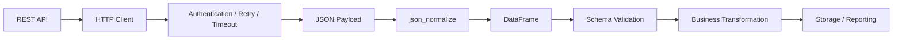

# 02- JSON

## Overview

JSON is a common interchange format for REST APIs, configuration payloads, event data, and application-to-application communication.

Pandas can read JSON into DataFrames or Series and serialize tabular data back to JSON:

```text
JSON / API payload
       ↓
Parsing
       ↓
Normalization
       ↓
DataFrame / Series
       ↓
Validation
       ↓
Transformation
       ↓
JSON / downstream storage
```

JSON is flexible, but raw JSON does not enforce a relational schema. A payload can contain:

- Nested objects.
- Lists of objects.
- Optional fields.
- Missing keys.
- Explicit `null`.
- Mixed representations.
- Different structures across records.

Pandas therefore becomes most useful after the transport layer has retrieved the payload and the application knows the expected data contract.

The primary tools are:

```python
pd.read_json()
pd.json_normalize()
DataFrame.to_json()
Series.to_json()
```

For production systems, distinguish between:

```text
JSON syntax
    ↓
Payload structure
    ↓
Canonical tabular schema
    ↓
Business validation
```

Successful JSON parsing does not imply that the resulting data is valid.

## JSON Structures

Common JSON shapes include:

### Object

```json
{
  "order_id": 1001,
  "amount": 250.0,
  "status": "completed"
}
```

This is naturally represented as one record.

### Array of Objects

```json
[
  {
    "order_id": 1001,
    "amount": 250.0
  },
  {
    "order_id": 1002,
    "amount": 175.5
  }
]
```

This maps naturally to a DataFrame:

```python
import pandas as pd

orders = pd.DataFrame(
    [
        {
            "order_id": 1001,
            "amount": 250.0,
        },
        {
            "order_id": 1002,
            "amount": 175.5,
        },
    ]
)
```

### Nested Object

```json
{
  "order_id": 1001,
  "customer": {
    "customer_id": 101,
    "segment": "premium"
  }
}
```

For nested structures, `pd.json_normalize()` is generally more appropriate.

## `json_normalize()`

Use `json_normalize()` when JSON contains nested dictionaries or arrays that need to become tabular columns.

```python
payload = [
    {
        "order_id": 1001,
        "customer": {
            "customer_id": 101,
            "segment": "premium",
        },
        "amount": 250.0,
    }
]

orders = pd.json_normalize(
    payload
)
```

The resulting columns can represent nested fields such as:

```text
order_id
customer.customer_id
customer.segment
amount
```

This is especially useful for REST API ingestion.

## Why `json_normalize()` Exists

Direct DataFrame construction is straightforward for flat records.

Real APIs often return:

```text
Object
├── scalar fields
├── nested object
└── nested arrays
```

`json_normalize()` provides a controlled way to flatten nested dictionaries and, when configured appropriately, normalize records contained inside nested lists.

The goal is not to flatten everything indiscriminately. The goal is to preserve useful relationships and establish an appropriate row grain.

## Flattening Nested Objects

Example:

```python
payload = [
    {
        "order_id": 1001,
        "customer": {
            "customer_id": 101,
            "segment": "premium",
        },
    }
]

orders = pd.json_normalize(
    payload
)
```

The logical transformation is:

```text
customer.customer_id → column
customer.segment     → column
```

This is appropriate when the nested object has a one-to-one relationship with the parent record.

## Custom Separator

The nested-field separator can be controlled:

```python
orders = pd.json_normalize(
    payload,
    sep="_",
)
```

This can produce:

```text
order_id
customer_customer_id
customer_segment
```

Using a consistent separator can simplify downstream SQL or analytics workflows.

The naming convention should be part of the pipeline's schema contract.

## Nested Lists and Row Grain

Consider:

```json
{
  "order_id": 1001,
  "items": [
    {
      "product_id": 501,
      "quantity": 2
    },
    {
      "product_id": 502,
      "quantity": 1
    }
  ]
}
```

There are two valid grains:

```text
one row per order
```

or:

```text
one row per order item
```

Flattening `items` into rows changes the grain.

A practical representation is often:

```text
orders
    ↓
one row per order

order_items
    ↓
one row per order item
```

This is conceptually similar to parent-child tables in PostgreSQL.

## `record_path`

`json_normalize()` can extract nested records:

```python
payload = [
    {
        "order_id": 1001,
        "items": [
            {
                "product_id": 501,
                "quantity": 2,
            },
            {
                "product_id": 502,
                "quantity": 1,
            },
        ],
    }
]

items = pd.json_normalize(
    payload,
    record_path="items",
    meta=["order_id"],
)
```

This produces one row per item while carrying the parent `order_id`.

Conceptually:

```text
Order 1001
├── Item 501
└── Item 502

        ↓

order_items DataFrame

order_id | product_id | quantity
1001     | 501        | 2
1001     | 502        | 1
```

## `meta`

`meta` supplies parent fields to nested records:

```python
items = pd.json_normalize(
    payload,
    record_path="items",
    meta=[
        "order_id",
    ],
)
```

For nested parent paths, metadata can require explicit path specifications.

The important design decision remains the row grain rather than the mechanics of `json_normalize()`.

## Nested API Response Pattern

A realistic API response may look like:

```json
{
  "orders": [
    {
      "id": 1001,
      "customer": {
        "id": 101,
        "name": "Acme"
      },
      "items": [
        {
          "sku": "SKU-501",
          "quantity": 2
        }
      ]
    }
  ],
  "page": 1,
  "page_size": 100
}
```

A production pipeline should separate transport metadata from records:

```python
payload = response.json()

orders = pd.json_normalize(
    payload["orders"]
)
```

Pagination information such as:

```text
page
page_size
next_cursor
total
```

belongs to the transport layer rather than the order schema.

## Transport Layer vs Pandas Layer

Keep responsibilities separate:



The HTTP client should handle:

- Authentication.
- Timeouts.
- Retries.
- Rate limits.
- Pagination.
- HTTP status codes.

Pandas should focus on tabular normalization and transformation.

## Reading JSON Files

For JSON files, use:

```python
orders = pd.read_json(
    "orders.json"
)
```

This is appropriate when the JSON structure is compatible with Pandas' JSON readers.

For nested records, `json_normalize()` may be more appropriate after loading the JSON with Python's `json` module.

## Reading JSON with `read_json()`

A simple array-of-records document:

```json
[
  {
    "order_id": 1001,
    "amount": 250.0
  },
  {
    "order_id": 1002,
    "amount": 175.5
  }
]
```

can be read directly:

```python
orders = pd.read_json(
    "orders.json"
)
```

Then inspect:

```python
print(orders.shape)
print(orders.dtypes)
```

As with every external format, validate the resulting schema.

## JSON Lines / NDJSON

JSON Lines stores one JSON object per line:

```text
{"order_id":1001,"amount":250.0}
{"order_id":1002,"amount":175.5}
{"order_id":1003,"amount":500.0}
```

Read it with:

```python
orders = pd.read_json(
    "orders.jsonl",
    lines=True,
)
```

This format is particularly useful for:

- Event streams.
- Batch exports.
- Log processing.
- Incremental ingestion.

The line-oriented structure also makes bounded processing more practical.

## Chunked JSON Lines Processing

For sufficiently large JSON Lines datasets, process bounded portions where supported by the chosen reader and configuration:

```python
reader = pd.read_json(
    "orders.jsonl",
    lines=True,
    chunksize=100_000,
)

for chunk in reader:
    process_chunk(chunk)
```

The exact capabilities depend on the selected Pandas JSON reader configuration and version, so production code should test the intended reader path against representative data.

For extremely large event streams, a streaming JSON parser or distributed processing engine may be more appropriate than Pandas.

## JSON Input Validation

After parsing:

```python
required = {
    "order_id",
    "customer_id",
    "amount",
}

missing = (
    required
    - set(orders.columns)
)

if missing:
    raise ValueError(
        f"Missing columns: {sorted(missing)}"
    )
```

Then validate dtypes and values.

For example:

```python
orders["amount"] = (
    pd.to_numeric(
        orders["amount"],
        errors="coerce",
    )
    .astype("Float64")
)
```

Follow this with business validation.

## JSON Type Ambiguity

JSON values can appear as:

```text
number
string
boolean
null
object
array
```

But applications frequently encode values inconsistently.

For example:

```json
{
  "customer_id": "101",
  "is_active": "true",
  "amount": "250.50"
}
```

These are strings even though their business meanings are:

```text
customer_id → identifier
is_active   → boolean
amount      → numeric
```

Do not assume JSON representation equals business type.

Normalize according to the source contract.

## Numeric Conversion

Use `to_numeric()` when numeric values arrive as strings:

```python
orders["amount"] = (
    pd.to_numeric(
        orders["amount"],
        errors="coerce",
    )
    .astype("Float64")
)
```

The `coerce` option converts invalid values to missing values.

Detect those failures:

```python
invalid_amount = (
    orders["amount"].isna()
)
```

For stricter pipelines, compare the original non-null values with the normalized result and reject invalid records explicitly.

## Boolean Conversion

Do not use:

```python
orders["is_active"].astype(bool)
```

on arbitrary API strings.

The string:

```text
"false"
```

is non-empty and therefore truthy.

Use explicit mapping:

```python
mapping = {
    "true": True,
    "false": False,
}

orders["is_active"] = (
    orders["is_active"]
    .astype("string")
    .str.strip()
    .str.lower()
    .map(mapping)
    .astype("boolean")
)
```

This makes accepted representations explicit.

## Identifier Conversion

A numeric-looking identifier may need to remain a string:

```python
orders["account_id"] = (
    orders["account_id"]
    .astype("string")
)
```

This protects values such as:

```text
000123
```

from becoming:

```text
123
```

Use numeric dtypes only when arithmetic or numeric ordering is actually meaningful.

## Missing JSON Fields

These records are different:

```json
{
  "order_id": 1001,
  "discount": null
}
```

and:

```json
{
  "order_id": 1001
}
```

The first explicitly supplies a null value.

The second omits the field.

Depending on the JSON-normalization operation, both can result in missing values in the DataFrame, but the source-level distinction can still matter for API contract semantics.

Do not assume omission and explicit null mean exactly the same thing at the application level.

## JSON `null` and Pandas Missing Values

JSON `null` often becomes a Pandas missing value after normalization.

Use:

```python
orders["discount"].isna()
```

to detect it.

Do not convert nulls into:

```text
"null"
"None"
""
0
```

without a defined business rule.

## Nested Nulls

Nested objects can also be null:

```json
{
  "order_id": 1001,
  "customer": null
}
```

A normalization pipeline should handle this explicitly because downstream code may otherwise assume that:

```python
customer.id
```

always exists.

Validate nested relationships before constructing relational outputs.

## JSON Array Fields

Sometimes a DataFrame intentionally contains a list-valued column:

```python
events = pd.DataFrame(
    {
        "event_id": [1, 2],
        "tags": [
            ["payment", "success"],
            ["refund"],
        ],
    }
)
```

The column contains list-like values.

If the target grain is one row per tag, use `explode()`:

```python
tag_events = events.explode(
    "tags",
    ignore_index=True,
)
```

This creates one row per list element.

The operation changes row grain and should therefore be deliberate.

## JSON and `explode()`

A common API-to-tabular workflow is:

```text
JSON
 ↓
json_normalize()
 ↓
list-valued column
 ↓
explode()
 ↓
one row per nested element
```

For example:

```python
orders = pd.json_normalize(
    payload["orders"]
)

items = orders.explode(
    "items"
)
```

Complex nested objects inside the exploded values may then require another normalization stage.

## Multiple Normalization Stages

For deeply nested APIs, a single giant `json_normalize()` call is not always the clearest design.

A more maintainable approach can be:

```text
Raw payload
    ↓
Orders normalization
    ↓
Order DataFrame
    ↓
Items extraction
    ↓
Order items DataFrame
```

This makes row grain and schema ownership explicit.

## JSON Output with `to_json()`

A DataFrame can be serialized:

```python
payload = orders.to_json(
    orient="records"
)
```

`orient` controls the JSON structure.

For API-style records, `records` is commonly useful.

Example:

```python
payload = orders.to_json(
    orient="records"
)

print(payload)
```

Conceptually:

```json
[
  {
    "order_id": 1001,
    "amount": 250.0
  }
]
```

## Common JSON Orientations

| Orientation | General shape | Typical use |
|---|---|---|
| `records` | List of objects | APIs / row-oriented output |
| `split` | Index, columns, data | Structured round-trip |
| `index` | Object keyed by index | Index-oriented mappings |
| `columns` | Column-oriented object | Column-based representation |
| `values` | Nested arrays | Minimal value-only output |
| `table` | Table schema + data | Schema-aware interchange |

Choose the orientation based on the consumer's contract.

## `records` for APIs

For a REST response:

```python
payload = orders.to_dict(
    orient="records"
)
```

or:

```python
payload = orders.to_json(
    orient="records"
)
```

The Python dictionary representation is often preferable when the web framework will perform the final JSON serialization.

For example, a FastAPI endpoint can return Python data structures and let the framework's JSON serializer handle transport encoding.

Avoid serializing to a JSON string and then serializing that string again through the framework.

## Date Handling in JSON Output

Datetime serialization needs an explicit contract.

For example:

```python
payload = orders.to_json(
    orient="records",
    date_format="iso",
)
```

This produces ISO-style datetime representations.

For distributed services, agree on:

```text
Timezone
Precision
Format
Null behavior
```

rather than relying on consumer-specific assumptions.

## JSON and Timezones

If timestamps are normalized to UTC:

```python
orders["created_at"] = pd.to_datetime(
    orders["created_at"],
    utc=True,
)
```

then output with an explicit format:

```python
payload = orders.to_json(
    orient="records",
    date_format="iso",
)
```

This is useful when data crosses service or regional boundaries.

## JSON Output and Missing Values

JSON has `null` but does not have Pandas-specific missing-value markers.

Therefore, output serialization converts internal missing values into a JSON-compatible representation.

The API contract should define whether absent or unknown data is:

```text
null
omitted
defaulted
```

Pandas serialization should not silently become the source of truth for API semantics.

## Precision and Financial JSON

If financial amounts require exact decimal semantics, do not assume that serializing floating-point DataFrame values produces accounting-grade precision.

For exact financial workflows, consider:

```text
Decimal
integer minor units
database NUMERIC / DECIMAL
```

and define the API representation separately.

For example:

```text
250.00
```

should be treated as a representation whose precision requirements come from the business contract.

## JSON and Parquet

A common data-engineering architecture is:

```text
API JSON
   ↓
Pandas normalization
   ↓
Validation
   ↓
Parquet
   ↓
Analytics / Reporting
```

This separates:

```text
JSON
→ transport representation

Parquet
→ analytical storage representation
```

Validated data can therefore move from a flexible API format into a typed columnar format.

## JSON and PostgreSQL

When JSON originates from an API and ultimately becomes relational data:

```text
REST API
   ↓
JSON
   ↓
Pandas
   ↓
Validation
   ↓
PostgreSQL
```

The Pandas schema should align with the database contract.

For example:

```text
customer_id → BIGINT / appropriate identifier type
amount      → NUMERIC when exact monetary semantics matter
created_at  → TIMESTAMPTZ
status      → controlled text / enum representation
```

Do not rely on JSON's flexible representation to define the final relational schema.

## JSON and Kafka

Kafka event payloads are frequently JSON-like.

A consumer might receive:

```text
Kafka event
    ↓
JSON decode
    ↓
Batch events
    ↓
Pandas normalization
    ↓
Validation
    ↓
Aggregation / storage
```

Pandas can be appropriate for bounded micro-batches.

It is generally not a replacement for the Kafka consumer, offset management, partition coordination, or event-stream processing framework itself.

## JSON and Celery

A Celery worker can process a bounded API payload:

```python
def process_orders(
    payload: dict,
) -> None:
    orders = pd.json_normalize(
        payload["orders"]
    )

    validate_orders(orders)
    transform_orders(orders)
    persist_orders(orders)
```

Keep Celery responsible for:

```text
Scheduling
Retry
Task execution
Backoff
Task-level observability
```

Keep Pandas responsible for:

```text
Normalization
Cleaning
Transformation
Aggregation
```

## Large JSON Payloads

Avoid:

```python
payload = response.json()

orders = pd.json_normalize(
    payload["orders"]
)
```

when the API can return an unbounded or extremely large response.

Prefer:

```text
Pagination
    ↓
Bounded page
    ↓
Normalize page
    ↓
Validate
    ↓
Persist / aggregate
    ↓
Next page
```

This limits memory usage and makes failures smaller and easier to retry.

## Pagination Pattern

A production API pipeline can look like:

```python
for page in fetch_order_pages():
    orders = pd.json_normalize(
        page["orders"]
    )

    orders = normalize_orders(
        orders
    )

    validate_orders(
        orders
    )

    persist_orders(
        orders
    )
```

Each page becomes an independently processed batch.

The API client controls pagination and transport reliability.

## Incremental Processing

For large APIs:

```text
Page 1
  ↓
Normalize
  ↓
Validate
  ↓
Persist

Page 2
  ↓
Normalize
  ↓
Validate
  ↓
Persist

Page N
```

This is generally safer than storing every page in a single Python list.

It also supports retries and checkpointing at page or cursor boundaries.

## Idempotency

A retryable JSON ingestion pipeline should be idempotent.

Useful identifiers include:

```text
event_id
order_id + version
source_object_id
API cursor + page identity
payload hash
```

The exact strategy depends on the source.

For example, a database write can use a natural uniqueness constraint:

```text
event_id UNIQUE
```

so a worker retry cannot create duplicate records.

## Schema Evolution

APIs evolve.

Possible changes include:

```text
Field added
Field removed
Field renamed
Type changed
Nested structure changed
Nullability changed
Enum value added
```

`json_normalize()` may still construct a DataFrame even after a structural change.

Therefore, monitor:

```text
Required-field violations
Unexpected columns
Dtype changes
Null-rate changes
Unexpected cardinality
Validation failures
```

## Production Validation Pattern

A reusable normalization function might look like:

```python
import pandas as pd


def normalize_orders(
    payload: dict,
) -> pd.DataFrame:
    records = payload.get(
        "orders",
        [],
    )

    orders = pd.json_normalize(
        records,
        sep="_",
    )

    orders = orders.assign(
        order_id=lambda df: pd.to_numeric(
            df["order_id"],
            errors="coerce",
        ).astype("Int64"),
        customer_id=lambda df: pd.to_numeric(
            df["customer_id"],
            errors="coerce",
        ).astype("Int64"),
        status=lambda df: (
            df["status"]
            .astype("string")
            .str.strip()
            .str.lower()
        ),
        amount=lambda df: pd.to_numeric(
            df["amount"],
            errors="coerce",
        ).astype("Float64"),
    )

    return orders
```

Validation should follow:

```python
def validate_orders(
    orders: pd.DataFrame,
) -> None:
    required = [
        "order_id",
        "customer_id",
        "amount",
    ]

    missing = (
        orders[required]
        .isna()
        .any(axis=1)
    )

    if missing.any():
        raise ValueError(
            "Required order fields are missing"
        )

    if orders["amount"].lt(0).any():
        raise ValueError(
            "Order amount cannot be negative"
        )
```

This separates:

```text
JSON normalization
        ↓
dtype normalization
        ↓
business validation
```

## Testing JSON Ingestion

Use representative payloads:

```python
def test_normalize_orders():
    payload = {
        "orders": [
            {
                "order_id": "1001",
                "customer_id": "101",
                "status": " Completed ",
                "amount": "250.50",
            }
        ]
    }

    result = normalize_orders(
        payload
    )

    assert list(result.columns) == [
        "order_id",
        "customer_id",
        "status",
        "amount",
    ]

    assert str(
        result["order_id"].dtype
    ) == "Int64"

    assert result.loc[
        0,
        "status",
    ] == "completed"

    assert result.loc[
        0,
        "amount",
    ] == 250.50
```

Test additional cases:

- Empty `orders` array.
- Missing `orders` key.
- Missing required fields.
- Explicit `null`.
- Invalid numeric values.
- Invalid boolean strings.
- Nested objects.
- Nested arrays.
- Unexpected fields.
- Duplicate records.
- Schema evolution.

## Common Mistakes

### Using `DataFrame()` for Deeply Nested JSON

Direct construction is often insufficient for nested API structures.

**Better:** use `json_normalize()` and define the desired output grain explicitly.

### Flattening Every Nested Field

Blind flattening can create huge, awkward schemas and obscure entity relationships.

**Better:** flatten only the fields required for the target dataset.

### Ignoring Row Grain

Flattening nested arrays can turn one order into many rows.

**Better:** model parent and child datasets separately when appropriate.

### Treating JSON Types as Business Types

A JSON string can represent an identifier, number, Boolean, or datetime.

**Better:** normalize according to the application schema.

### Using `astype(bool)` on JSON Strings

`"false"` is a truthy non-empty string.

**Better:** map accepted representations explicitly.

### Converting Identifiers to Numeric Types

This can destroy leading zeros.

**Better:** use `string` for identifiers whose formatting carries meaning.

### Treating Missing and Null as the Same API Contract

Pandas may represent both as missing data internally, but API clients can distinguish:

```text
field omitted
```

from:

```text
field present with null
```

**Better:** define the external contract separately from the Pandas representation.

### Loading an Entire Large API Response

A single response can cause significant memory pressure.

**Better:** paginate and process bounded batches.

### Mixing HTTP Logic with Pandas Logic

A transformation function should not handle authentication, retry loops, and JSON parsing details simultaneously.

**Better:** separate transport, normalization, validation, and persistence.

### Using `to_json()` Inside a Web Framework Without Understanding Serialization

Serializing to a JSON string and then passing that string to another JSON serializer can produce incorrect output.

**Better:** return Python dictionaries/lists when the framework owns response serialization.

### Losing Parent Identifiers During Nested Normalization

Nested child records may be useless without their parent ID.

**Better:** carry parent identifiers using `meta` or explicit extraction.

### Assuming `json_normalize()` Performs Validation

It creates a DataFrame; it does not enforce business constraints.

**Better:** validate required fields, dtypes, ranges, uniqueness, and domain rules separately.

### Treating JSON as a Durable Analytical Format

JSON is flexible but often inefficient for repeated analytical processing.

**Better:** convert validated data into Parquet or another appropriate analytical representation.

### Ignoring Schema Drift

A new nested field or changed type can alter the output DataFrame.

**Better:** monitor schema and quality metrics at ingestion boundaries.

## Interview Traps

### What Is `json_normalize()` Used For?

It converts semi-structured JSON records, especially nested dictionaries and nested record arrays, into tabular structures suitable for Pandas processing.

### When Should You Use `DataFrame(records)` Instead?

Use direct DataFrame construction when the records are already flat and the desired row structure is clear.

### What Is the Difference Between `read_json()` and `json_normalize()`?

`read_json()` is primarily a JSON reader for file or JSON-like input formats that Pandas can interpret directly. `json_normalize()` focuses on turning nested or semi-structured records into tabular columns.

### What Is `record_path`?

It identifies a nested list of records that should become the rows of the resulting DataFrame.

### Why Is `meta` Useful?

It carries parent-level fields into rows produced from nested child records.

### Why Is Row Grain Important with Nested JSON?

A nested list represents one-to-many data. Flattening it can multiply rows and change the meaning of each row.

### How Do You Process Large API JSON Responses?

Use pagination or bounded batches:

```text
Fetch page
→ normalize
→ validate
→ persist
→ next page
```

rather than accumulating every page in memory.

### How Do You Serialize a DataFrame for a REST API?

For row-oriented output:

```python
payload = orders.to_dict(
    orient="records"
)
```

Then let the web framework serialize the Python data structure.

### Why Should `astype(bool)` Not Be Used for String Booleans?

Because non-empty strings are truthy in Python, so `"false"` evaluates as true.

### How Do You Preserve Leading Zeros in JSON Identifiers?

Keep them as strings:

```python
df["account_id"] = (
    df["account_id"]
    .astype("string")
)
```

### How Should JSON Schema Evolution Be Handled?

Validate required fields and canonical dtypes, monitor unexpected fields and null-rate changes, and make compatibility rules explicit.

### Is Pandas Appropriate for a Kafka Stream?

Pandas can process bounded batches of events, but it is not a replacement for Kafka's consumer, partition, offset, and delivery semantics.

## Production JSON Ingestion Pattern

A maintainable architecture separates responsibilities:

```text
HTTP / Kafka / File
        ↓
Transport / Consumer
        ↓
JSON Decode
        ↓
Pandas Normalization
        ↓
Canonical Dtypes
        ↓
Data Quality Validation
        ↓
Business Validation
        ↓
Transformation
        ↓
PostgreSQL / Parquet / Reporting
```

For API ingestion, the transport layer should manage:

```text
Timeouts
Retries
Authentication
Pagination
Rate limits
HTTP failures
```

The Pandas layer should manage:

```text
Flattening
Column naming
Dtype normalization
Missing values
Data cleaning
Aggregation
```

The persistence layer should manage:

```text
Transactions
Uniqueness
Durability
Upserts
Indexes
Constraints
```

This separation improves maintainability and makes failures easier to diagnose.

## Operational Considerations

Monitor JSON ingestion for:

| Metric | Purpose |
|---|---|
| Payload count | Track source volume |
| Records parsed | Verify successful normalization |
| Records rejected | Measure quality failures |
| Missing required fields | Detect contract regressions |
| Dtype conversion failures | Detect representation changes |
| Unexpected fields | Detect schema evolution |
| Null rates | Detect upstream data-quality changes |
| Payload size | Detect memory risks |
| Processing duration | Detect performance regressions |
| Duplicate count | Detect replay or source duplication |

For sensitive payloads, log metadata rather than complete JSON documents or DataFrames.

## Security Considerations

Treat external JSON as untrusted input.

Relevant controls include:

```text
Authentication
Authorization
TLS
Payload size limits
Schema validation
Field allowlisting
Sensitive-field minimization
Safe logging
Resource limits
```

Do not construct a DataFrame from every field simply because the source provides them.

If an API returns:

```text
password
access_token
payment_token
private_notes
```

but the pipeline needs only:

```text
order_id
customer_id
amount
```

project to the required fields as early as practical.

## Performance Considerations

For large JSON workloads:

```text
Reduce payload size
        ↓
Paginate
        ↓
Normalize only required records
        ↓
Project required fields
        ↓
Use appropriate dtypes
        ↓
Process bounded batches
        ↓
Persist incrementally
```

Avoid unnecessary conversions:

```text
JSON
 ↓
Python list
 ↓
JSON string
 ↓
Python dict
 ↓
DataFrame
```

when the workflow can move more directly from decoded records to Pandas structures.

For recurring analytical workloads, consider converting normalized data into Parquet.

## Reliability and Recovery

A JSON ingestion pipeline should be restartable.

Use stable processing identities such as:

```text
event_id
source_object_id
API cursor
request window
payload checksum
```

Persist enough state to determine:

```text
What was received?
What was normalized?
What failed?
What was persisted?
Can this batch be safely retried?
```

For invalid records, quarantine them rather than silently dropping them when auditability or replay matters.

## Production Checklist

```text
[ ] Is the JSON source format documented?
[ ] Is the expected row grain defined?
[ ] Are required fields known?
[ ] Are nested objects intentionally flattened?
[ ] Are nested arrays modeled with the correct parent-child relationship?
[ ] Is json_normalize() preferred over direct construction where appropriate?
[ ] Are parent identifiers preserved?
[ ] Are JSON strings normalized to the correct Pandas dtypes?
[ ] Are identifiers protected from accidental numeric conversion?
[ ] Are string booleans mapped explicitly?
[ ] Are null and missing-field semantics understood?
[ ] Are invalid values detected after coercion?
[ ] Are duplicate records handled?
[ ] Are unexpected fields monitored?
[ ] Is schema drift detected?
[ ] Is the API payload bounded through pagination?
[ ] Can the worker process the payload within its memory budget?
[ ] Are transport and Pandas responsibilities separated?
[ ] Is processing idempotent?
[ ] Are invalid records recoverable or quarantined?
[ ] Are sensitive fields excluded from logs?
[ ] Are output JSON semantics defined for nulls and timestamps?
[ ] Is normalized data persisted in an appropriate format?
[ ] Are representative payloads covered by automated tests?
```

## Key Takeaways

- `json_normalize()` is the primary Pandas tool for converting nested or semi-structured JSON into tabular data, while direct `DataFrame()` construction is often sufficient for already-flat records.
- JSON representation does not automatically define business types; identifiers, booleans, numbers, timestamps, and nullable fields should be normalized against an explicit schema.
- Nested arrays can change row grain and multiply records, so parent-child relationships should be modeled deliberately rather than flattened indiscriminately.
- Production JSON pipelines should separate transport concerns from Pandas normalization, use pagination and bounded batches for large payloads, validate schema and business rules, and make processing idempotent.
- JSON is well suited to APIs and interchange, but validated datasets used repeatedly for analytics are often better persisted as PostgreSQL tables, Parquet, or another format designed for structured processing.