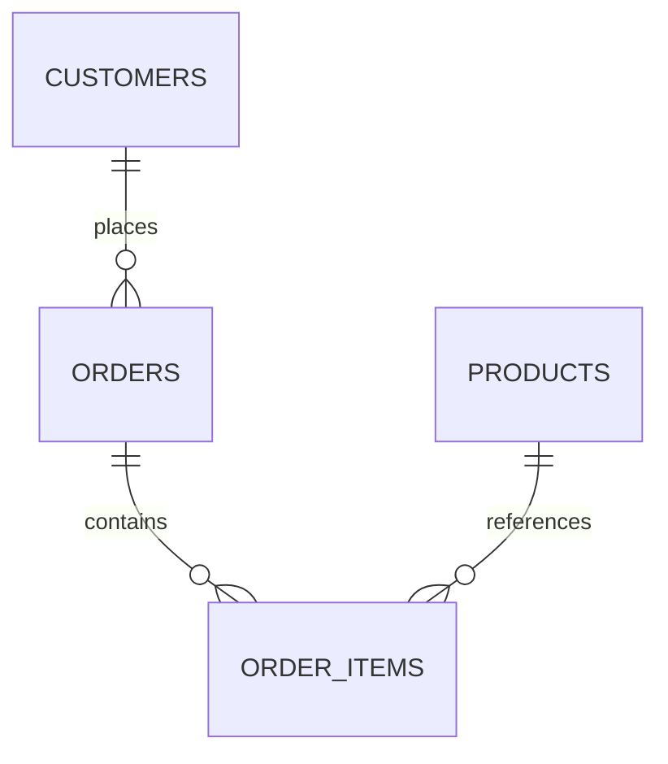

# 03- Excel

## Overview

Excel workbooks are common sources and destinations for operational reports, finance workflows, business exports, and manual data exchange.

Pandas supports Excel through:

```python
pd.read_excel()
DataFrame.to_excel()
ExcelFile
```

Excel differs from CSV and Parquet because a workbook can contain:

```text
Multiple worksheets
Formatted cells
Merged cells
Formulas
Hidden sheets
Named ranges
Multiple tables
Metadata
```

Pandas primarily cares about the tabular values it can extract from a worksheet. It does not preserve the full Excel workbook as a rich spreadsheet application would.

A production workflow should therefore treat Excel as an external interchange format:

```text
Excel workbook
      ↓
Worksheet selection
      ↓
Pandas DataFrame
      ↓
Schema / dtype validation
      ↓
Cleaning and transformation
      ↓
Database / Parquet / report
```

For reliable systems, Excel should usually be an ingestion or export boundary rather than the canonical storage layer.

## Reading an Excel Workbook

The simplest case is:

```python
import pandas as pd

orders = pd.read_excel(
    "orders.xlsx"
)
```

Pandas reads a worksheet into a DataFrame.

Inspect immediately:

```python
print(orders.shape)
print(orders.columns)
print(orders.dtypes)
```

Successful parsing does not mean the worksheet satisfies the expected business contract.

## Reading a Specific Sheet

If a workbook contains multiple worksheets:

```python
orders = pd.read_excel(
    "operations.xlsx",
    sheet_name="Orders",
)
```

This is preferable to relying on worksheet position when a stable sheet name is available.

Avoid:

```python
sheet_name=0
```

for production integrations when the worksheet's business identity is defined by name rather than position.

## Reading Multiple Sheets

A workbook can contain multiple related datasets:

```text
Orders
Customers
Products
Payments
```

Read selected sheets:

```python
sheets = pd.read_excel(
    "operations.xlsx",
    sheet_name=[
        "Orders",
        "Customers",
        "Products",
    ],
)
```

The result is a dictionary mapping sheet names to DataFrames.

For example:

```python
orders = sheets["Orders"]
customers = sheets["Customers"]
products = sheets["Products"]
```

This is useful when a workbook represents several logical entities.

## Reading All Sheets

To inspect every worksheet:

```python
sheets = pd.read_excel(
    "operations.xlsx",
    sheet_name=None,
)
```

Pandas returns:

```text
dict[str, DataFrame]
```

This is convenient for controlled workbooks but can consume significant memory if the workbook contains many large sheets.

Do not use it blindly for arbitrary user-uploaded workbooks.

## Excel Engine

Pandas relies on an Excel engine for file parsing.

Common modern choices include:

| File type | Common engine |
|---|---|
| `.xlsx` | `openpyxl` |
| `.xls` | Legacy engine support depending on environment |
| `.xlsb` | `pyxlsb` |
| `.ods` | Engine-specific support |

For `.xlsx`, a typical environment installs:

```bash
pip install pandas openpyxl
```

Avoid relying on whatever engine happens to be installed in a production environment. Pin compatible dependencies in `pyproject.toml` and test the actual workbook formats used by the application.

## Explicit Engine Selection

When reproducibility or compatibility requires it:

```python
orders = pd.read_excel(
    "orders.xlsx",
    sheet_name="Orders",
    engine="openpyxl",
)
```

Explicit engine selection can make deployments more predictable.

The exact engine should match the file format and supported feature requirements.

## File Types

Excel commonly appears as:

```text
.xlsx
.xls
.xlsb
.ods
```

Not every file type has identical feature support.

For production ingestion, define an allowed file-format contract rather than accepting arbitrary spreadsheet formats.

For example:

```text
Accepted:
.xlsx

Rejected:
.xlsm
.xls
.xlsb
.ods
```

may be appropriate when the application has only tested `.xlsx`.

## Header Handling

If the first worksheet row contains headers:

```python
orders = pd.read_excel(
    "orders.xlsx",
    header=0,
)
```

For files without headers:

```python
orders = pd.read_excel(
    "orders.xlsx",
    header=None,
    names=[
        "order_id",
        "customer_id",
        "amount",
    ],
)
```

Avoid trusting human-authored spreadsheet layouts without validation.

## Header Rows and Preambles

Operational spreadsheets often contain titles before the table:

```text
Monthly Sales Report
Generated: 2026-09-10

Order ID | Customer ID | Amount
1001     | 101         | 250.00
```

If the actual table begins later:

```python
orders = pd.read_excel(
    "report.xlsx",
    skiprows=3,
)
```

This is fragile if users modify the workbook layout.

A more reliable production design is to define a controlled template with a fixed worksheet and header location.

## Reading Selected Columns

Load only required columns where practical:

```python
orders = pd.read_excel(
    "orders.xlsx",
    sheet_name="Orders",
    usecols=[
        "order_id",
        "customer_id",
        "amount",
    ],
)
```

Column projection can reduce:

- Parsing work.
- Memory consumption.
- Downstream transformation cost.
- Exposure of unnecessary sensitive fields.

## Dtype Control

Excel stores cell values with spreadsheet-specific types, but Pandas still needs to construct a DataFrame schema.

Specify critical dtypes:

```python
orders = pd.read_excel(
    "orders.xlsx",
    sheet_name="Orders",
    dtype={
        "order_id": "Int64",
        "customer_id": "Int64",
        "status": "string",
    },
)
```

Normalize fields that require controlled conversion:

```python
orders["amount"] = (
    pd.to_numeric(
        orders["amount"],
        errors="coerce",
    )
    .astype("Float64")
)
```

## Identifiers

Do not assume spreadsheet identifiers are numeric.

For:

```text
000123
000124
000125
```

preserve the representation:

```python
accounts = pd.read_excel(
    "accounts.xlsx",
    dtype={
        "account_id": "string",
    },
)
```

Otherwise:

```text
000123 → 123
```

can break reconciliation or downstream joins.

## Datetime Columns

Datetime parsing should be explicit:

```python
orders = pd.read_excel(
    "orders.xlsx",
    parse_dates=[
        "created_at",
    ],
)
```

For systems operating across regions:

```python
orders["created_at"] = pd.to_datetime(
    orders["created_at"],
    utc=True,
)
```

The source spreadsheet may contain timezone-naive timestamps, so define the source timezone explicitly when necessary before converting to UTC.

## Missing Values

Excel cells can be blank or contain values that users intend to mean:

```text
missing
N/A
-
Unknown
```

Pandas can detect blank and configured missing values, but domain-specific sentinels should be normalized deliberately.

For example:

```python
orders = pd.read_excel(
    "orders.xlsx",
    na_values=[
        "N/A",
        "NA",
    ],
)
```

Do not assume every string such as `"Unknown"` should become missing. It may be a legitimate business value.

## Missing vs Zero

A blank spreadsheet cell:

```text
amount = blank
```

does not automatically mean:

```text
amount = 0
```

Only apply:

```python
orders["discount"] = (
    orders["discount"]
    .fillna(0)
)
```

when the business contract explicitly states that missing discount means no discount.

## Multiple Worksheets and Data Grain

A workbook often contains related but differently grained data:

```text
Orders
    one row per order

Order Items
    one row per order item

Customers
    one row per customer
```

Do not concatenate these tables merely because they appear in the same workbook.

Preserve the domain model:



Then load each worksheet into its own DataFrame.

## Merging Worksheets

After independent validation:

```python
orders = orders.merge(
    customers[
        [
            "customer_id",
            "segment",
        ]
    ],
    on="customer_id",
    how="left",
    validate="many_to_one",
)
```

`validate="many_to_one"` protects against unexpected customer duplication.

A workbook can contain duplicate identifiers even when users assume the sheet represents a unique table.

## Detecting Duplicate Keys

Before merging:

```python
duplicate_customers = (
    customers["customer_id"]
    .duplicated()
)

if duplicate_customers.any():
    raise ValueError(
        "Duplicate customer IDs detected"
    )
```

This turns a workbook-quality problem into an explicit validation failure instead of allowing silent row multiplication.

## Excel Tables vs Worksheet Layout

Human-oriented spreadsheets often have:

```text
Title
Subtitle
Blank rows
Notes
Merged cells
Table
Footer
```

Pandas works best with normalized tabular data:

```text
Column headers
    ↓
Rows
    ↓
Records
```

For production workflows, define spreadsheet templates that keep machine-readable tables separate from presentation elements.

## Merged Cells

Merged cells are primarily a presentation feature.

They can create missing values when parsed because only part of the visual region actually contains a stored cell value.

Avoid designing ingestion templates around merged cells.

Prefer:

```text
One header row
One record per row
One field per column
```

This makes spreadsheet ingestion much more deterministic.

## Formula Cells

Excel formulas can be present in workbooks.

Reading formulas and reading their cached results are different concerns.

For example, with an engine that supports the option:

```python
orders = pd.read_excel(
    "report.xlsx",
    sheet_name="Orders",
    engine="openpyxl",
)
```

Pandas generally consumes workbook cell values rather than acting as an Excel calculation engine.

Do not assume Pandas will recalculate arbitrary Excel formulas exactly as Microsoft Excel does.

For production reporting, prefer materialized values or calculate business-critical metrics in a controlled Python, SQL, or reporting layer.

## `data_only` and Formula Results

When the underlying engine exposes cached formula values, engine-specific options may be relevant.

With `openpyxl`, for example:

```python
from openpyxl import load_workbook

workbook = load_workbook(
    "report.xlsx",
    data_only=True,
)
```

This is useful when direct workbook inspection is required.

Be aware that `data_only=True` reads cached results and does not calculate formulas. If Excel has not recalculated and saved the workbook, cached values may be missing or stale.

## `ExcelFile`

When multiple sheets must be read from one workbook, `ExcelFile` can avoid repeatedly opening the workbook:

```python
import pandas as pd

with pd.ExcelFile(
    "operations.xlsx",
    engine="openpyxl",
) as workbook:
    orders = pd.read_excel(
        workbook,
        sheet_name="Orders",
    )

    customers = pd.read_excel(
        workbook,
        sheet_name="Customers",
    )
```

This can improve organization and avoid redundant workbook setup when multiple sheets are processed.

## Reading from Bytes

Excel files commonly arrive through HTTP uploads or object storage.

A file-like object can be passed to Pandas:

```python
from io import BytesIO

orders = pd.read_excel(
    BytesIO(file_bytes),
    sheet_name="Orders",
)
```

In a web application, validate the upload before parsing it.

For example:

```text
Upload
  ↓
File size validation
  ↓
Format validation
  ↓
Schema validation
  ↓
Pandas parsing
```

Do not pass unrestricted user uploads directly to an expensive spreadsheet parser.

## Excel Uploads in Django or FastAPI

A backend endpoint may receive an uploaded workbook.

The application should separate:

```text
HTTP layer
    ↓
Upload validation
    ↓
Temporary storage
    ↓
Pandas ingestion
    ↓
Schema validation
    ↓
Background processing
```

Large workbooks should generally be processed asynchronously rather than during a latency-sensitive HTTP request.

Celery or Kubernetes Jobs can be used for long-running import workflows.

## Background Processing Pattern

A production architecture can look like:


The API request should ideally acknowledge a valid upload and return a job identifier rather than waiting for a large workbook to finish processing.

## Reading from Object Storage

Excel files may be stored in S3:

```python
orders = pd.read_excel(
    "s3://company-data/incoming/orders.xlsx",
    sheet_name="Orders",
)
```

The runtime needs the appropriate filesystem support and AWS credentials.

For recurring analytical workflows, consider converting the validated workbook into Parquet after ingestion:

```text
Excel
  ↓
Validate
  ↓
Normalize
  ↓
Parquet
  ↓
Repeated processing
```

## Writing Excel Files

The basic export is:

```python
orders.to_excel(
    "orders_report.xlsx",
    index=False,
)
```

Set `index=False` unless the DataFrame Index is intentionally part of the report schema.

## Writing to a Specific Worksheet

```python
orders.to_excel(
    "daily_report.xlsx",
    sheet_name="Orders",
    index=False,
)
```

For multiple worksheets, use `ExcelWriter`.

## `ExcelWriter`

A workbook with multiple datasets can be written as:

```python
with pd.ExcelWriter(
    "operations_report.xlsx",
    engine="openpyxl",
) as writer:
    orders.to_excel(
        writer,
        sheet_name="Orders",
        index=False,
    )

    customers.to_excel(
        writer,
        sheet_name="Customers",
        index=False,
    )
```

The context manager ensures the workbook is finalized correctly.

## Multiple Sheet Reporting

A reporting workbook may contain:

```text
Summary
Orders
Customers
Exceptions
```

A useful separation is:

```text
Summary
    → presentation metrics

Orders
    → detailed records

Exceptions
    → rejected or anomalous records
```

This is more maintainable than creating one extremely wide worksheet.

## Formatting and Presentation

Pandas is primarily a data-processing library.

For advanced workbook formatting, use an appropriate Excel engine or workbook library after generating the tabular data.

Typical requirements outside core Pandas functionality include:

- Cell formatting.
- Conditional formatting.
- Merged headers.
- Freeze panes.
- Column widths.
- Charts.
- Excel formulas.
- Named ranges.
- Workbook protection.

Do not place business-critical logic exclusively in spreadsheet formatting.

## Writing with `ExcelWriter` and Post-Processing

A common pattern is:

```python
import pandas as pd

with pd.ExcelWriter(
    "report.xlsx",
    engine="openpyxl",
) as writer:
    summary.to_excel(
        writer,
        sheet_name="Summary",
        index=False,
    )

    orders.to_excel(
        writer,
        sheet_name="Orders",
        index=False,
    )
```

If additional formatting is required, the workbook can be reopened with `openpyxl` and adjusted.

Keep presentation logic separate from data-generation logic so the transformation layer remains testable.

## Output Schema

For externally distributed Excel files, define:

```text
Worksheet names
Column ordering
Column names
Data types
Date formats
Missing-value representation
File naming
```

For example:

```python
columns = [
    "order_id",
    "customer_id",
    "status",
    "amount",
]

report = orders.loc[
    :,
    columns,
]
```

Then export:

```python
report.to_excel(
    "daily_orders.xlsx",
    sheet_name="Orders",
    index=False,
)
```

## File Naming

Production reports should use deterministic names or unique job identifiers.

For example:

```text
orders_2026-09-10.xlsx
```

or:

```text
orders_2026-09-10_job-7f3c.xlsx
```

Avoid relying on a static filename if multiple workers can generate reports concurrently.

## Atomic Report Publication

Do not write directly to a location consumed by other systems if partial files are possible.

Use:

```text
Temporary output
      ↓
Finalize workbook
      ↓
Validate artifact
      ↓
Publish final path
```

For S3-style object storage:

```text
s3://bucket/tmp/job-id/report.xlsx
          ↓
validation
          ↓
s3://bucket/reports/date=2026-09-10/report.xlsx
```

This reduces the chance that consumers read incomplete files.

## Excel and Parquet

Excel is useful for human workflows, while Parquet is generally better suited to repeated analytical processing.

```text
Excel
 ↓
Human-facing interchange
 ↓
Pandas normalization
 ↓
Parquet
 ↓
Analytical processing
```

After validation:

```python
orders.to_parquet(
    "orders.parquet",
    index=False,
)
```

This separates presentation-oriented interchange from machine-oriented storage.

## Excel and PostgreSQL

A common operational import workflow is:

```text
Excel upload
    ↓
Pandas
    ↓
Validation
    ↓
PostgreSQL
```

Before writing:

```python
required = {
    "order_id",
    "customer_id",
    "amount",
}

missing = (
    required
    - set(orders.columns)
)

if missing:
    raise ValueError(
        f"Missing required columns: {sorted(missing)}"
    )
```

Database constraints should still enforce final integrity.

Pandas validation is not a replacement for PostgreSQL constraints.

## Writing to SQL After Excel Import

A controlled batch can be persisted:

```python
orders.to_sql(
    "staging_orders",
    connection,
    if_exists="append",
    index=False,
)
```

Production systems should carefully design:

```text
Transactions
Constraints
Uniqueness
Upserts
Batch sizes
Rollback behavior
Permissions
```

Avoid using spreadsheet imports to bypass database validation.

## Large Excel Workbooks

Excel is not an ideal large-scale batch format.

Problems include:

- Workbook parsing overhead.
- Multiple sheets.
- Spreadsheet metadata.
- Memory consumption.
- Human-generated layout variability.
- Limited scalability compared with columnar storage.

If the source can provide:

```text
CSV
Parquet
Database export
```

those formats may be preferable for machine-oriented pipelines.

Use Excel when business requirements genuinely require spreadsheet interchange.

## Memory Considerations

Reading an entire workbook can consume substantial memory.

The challenge is not only cell count:

```text
Workbook
├── sheets
├── cell values
├── Python objects
├── workbook metadata
└── DataFrame representations
```

For large workbooks:

```text
File size
≠
DataFrame memory
```

A small `.xlsx` file can still expand considerably when parsed.

Measure worker memory and establish upload limits.

## Performance Considerations

Excel parsing is generally more expensive than parsing simpler tabular formats.

For recurring ingestion:

```text
Excel
  ↓
Pandas
  ↓
Validated Parquet
```

can be preferable to repeatedly parsing the same workbook format.

For large-scale data, prefer:

```text
Parquet
PostgreSQL
CSV + chunking
Distributed processing
```

when the business workflow allows it.

## Concurrency

Avoid concurrent writes to the same workbook:

```text
Worker A ─┐
Worker B ─┼→ report.xlsx
Worker C ─┘
```

This is unsafe without explicit coordination.

Prefer unique output artifacts:

```text
worker A → report-A.xlsx
worker B → report-B.xlsx
worker C → report-C.xlsx
```

then combine or publish through a controlled finalization step.

## Security Considerations

Excel files should be treated as untrusted input.

Relevant concerns include:

- Oversized uploads.
- Malformed workbooks.
- Embedded formulas.
- Hidden worksheets.
- External links.
- Macros in formats that support them.
- Sensitive data.
- Formula injection in exported reports.

For ingestion, enforce:

```text
Allowed extensions
Maximum file size
Maximum worksheet count
Maximum row/column limits
Expected worksheet names
Expected schema
```

For output, sanitize values when the workbook will be opened by spreadsheet software and untrusted data can begin with formula-triggering characters.

Do not include macros in an output workflow unless they are explicitly required and separately controlled.

## Sensitive Data

Do not ingest or export columns simply because they exist.

For example:

```python
report = orders.loc[
    :,
    [
        "order_id",
        "customer_id",
        "amount",
        "status",
    ],
]
```

This reduces accidental exposure of:

```text
Email addresses
Phone numbers
Authentication data
Internal notes
Payment information
```

When sending workbooks to external recipients, treat the workbook as a data-exfiltration boundary.

## Spreadsheet Formula Injection

If untrusted values are exported to Excel, strings beginning with formula-triggering characters can be interpreted by spreadsheet software.

Potentially dangerous examples include values starting with:

```text
=
+
-
@
```

Do not assume that a value originating from a customer or external system is harmless simply because it is stored in a DataFrame.

For externally distributed reports, sanitize according to the organization's spreadsheet-security policy.

## Validation Pattern

A production ingestion function can establish the contract early:

```python
import pandas as pd


REQUIRED_COLUMNS = {
    "order_id",
    "customer_id",
    "amount",
}


def load_orders_from_excel(
    path: str,
) -> pd.DataFrame:
    orders = pd.read_excel(
        path,
        sheet_name="Orders",
        dtype={
            "order_id": "Int64",
            "customer_id": "Int64",
            "status": "string",
        },
    )

    missing = (
        REQUIRED_COLUMNS
        - set(orders.columns)
    )

    if missing:
        raise ValueError(
            f"Missing required columns: {sorted(missing)}"
        )

    orders["amount"] = (
        pd.to_numeric(
            orders["amount"],
            errors="coerce",
        )
        .astype("Float64")
    )

    invalid = (
        orders[
            [
                "order_id",
                "customer_id",
                "amount",
            ]
        ]
        .isna()
        .any(axis=1)
    )

    if invalid.any():
        raise ValueError(
            "Required fields contain missing "
            "or invalid values"
        )

    return orders
```

The important architecture is:

```text
Excel
  ↓
Read known worksheet
  ↓
Expected schema
  ↓
Dtype normalization
  ↓
Validation
  ↓
DataFrame
```

## Testing Excel Ingestion

Use generated fixture workbooks rather than relying only on manually maintained spreadsheets.

Example:

```python
def test_orders_excel_ingestion(tmp_path):
    source = tmp_path / "orders.xlsx"

    expected = pd.DataFrame(
        {
            "order_id": [1001, 1002],
            "customer_id": [101, 102],
            "status": [
                "completed",
                "pending",
            ],
            "amount": [250.0, 175.5],
        }
    )

    expected.to_excel(
        source,
        sheet_name="Orders",
        index=False,
    )

    actual = load_orders_from_excel(
        source
    )

    pd.testing.assert_frame_equal(
        actual,
        expected.astype(
            {
                "order_id": "Int64",
                "customer_id": "Int64",
                "status": "string",
                "amount": "Float64",
            }
        ),
    )
```

Test:

- Correct worksheet selection.
- Missing worksheet.
- Missing required columns.
- Unexpected columns.
- Empty worksheets.
- Invalid dtypes.
- Missing required fields.
- Duplicate identifiers.
- Multiple worksheets.
- Large workbook rejection.
- Malformed files.

## Error Handling

Different failures should be distinguishable:

```text
File not found
    ↓
I/O problem

Unsupported file format
    ↓
Parser / contract problem

Worksheet missing
    ↓
Template problem

Column missing
    ↓
Schema problem

Invalid value
    ↓
Data-quality problem

Duplicate key
    ↓
Business integrity problem
```

This classification improves operational response and monitoring.

## Observability

Track spreadsheet ingestion metrics:

| Metric | Purpose |
|---|---|
| File size | Detect abnormal uploads |
| Worksheet count | Detect workbook anomalies |
| Rows read | Measure data volume |
| Columns read | Detect schema drift |
| Invalid records | Measure data quality |
| Missing-field count | Detect template regressions |
| Duplicate count | Detect integrity issues |
| Processing duration | Detect performance regressions |
| Peak memory | Detect worker pressure |
| Output rows | Validate transformation behavior |

Do not log the full workbook or DataFrame.

## Idempotent Imports

Spreadsheet uploads are often manually retried.

Use an import identity such as:

```text
file checksum
upload ID
source system ID
business period + source identifier
```

Persist processing state:

```text
received
validated
processed
failed
```

Then a retry can determine whether the same file has already been successfully imported.

For database writes, use unique constraints or idempotent upsert strategies.

## Disaster Recovery and Auditability

For business-critical spreadsheet imports:

```text
Original workbook
       ↓
Immutable object storage
       ↓
Processing metadata
       ↓
Normalized data
       ↓
Database / Parquet
```

Keep the original input when audit requirements justify it.

This allows:

- Reprocessing.
- Investigation.
- Comparison with normalized output.
- Recovery after transformation bugs.

Do not make the database the only copy of an externally supplied financial or operational workbook when regulatory or audit requirements require source retention.

## Common Mistakes

### Treating Excel Like a Database

Excel worksheets are not relational tables with enforced constraints.

**Better:** validate schema, uniqueness, row grain, and business rules before persistence.

### Assuming the First Sheet Is the Correct Sheet

Users can reorder worksheets.

**Better:** select worksheets by stable names.

### Loading All Sheets by Default

```python
pd.read_excel(
    path,
    sheet_name=None,
)
```

can materialize large amounts of unnecessary data.

**Better:** load only required worksheets.

### Trusting Human Spreadsheet Layouts

Titles, blank rows, merged cells, notes, and footers can break deterministic parsing.

**Better:** define controlled spreadsheet templates.

### Treating Formula Cells as Recalculated Values

Pandas does not act as an Excel calculation engine.

**Better:** use cached values only when their freshness is acceptable or calculate critical metrics in a controlled processing layer.

### Assuming Small File Size Means Low Memory Usage

Excel's internal structure can expand significantly when parsed.

**Better:** enforce input size and row limits and monitor worker memory.

### Treating Identifiers as Numbers

Leading zeros can be lost.

**Better:** read identifier columns as `string` when required.

### Applying `fillna(0)` to Spreadsheet Data

A blank cell does not necessarily mean zero.

**Better:** apply defaults only when the business contract defines the meaning.

### Ignoring Duplicate Keys

Spreadsheet users can accidentally duplicate rows.

**Better:** validate business keys before joins or database persistence.

### Writing Directly to Shared Output Files

Concurrent workers can overwrite or corrupt output.

**Better:** generate unique artifacts and publish them through a controlled workflow.

### Performing Large Imports Inside HTTP Requests

Large spreadsheet parsing can exceed request timeouts and consume web-worker memory.

**Better:** upload to object storage and process asynchronously with Celery or batch workers.

### Using Excel as Long-Term Analytical Storage

Repeated spreadsheet parsing is expensive and weakly controlled.

**Better:** normalize Excel into PostgreSQL or Parquet after validation.

### Logging Sensitive Workbook Contents

Workbooks can contain confidential business and personal information.

**Better:** log metadata, quality metrics, and safe identifiers.

## Interview Traps

### How Do You Read a Specific Excel Sheet?

```python
pd.read_excel(
    "orders.xlsx",
    sheet_name="Orders",
)
```

### How Do You Read Multiple Sheets?

```python
sheets = pd.read_excel(
    "operations.xlsx",
    sheet_name=[
        "Orders",
        "Customers",
    ],
)
```

The result is a dictionary of DataFrames.

### How Do You Read Every Sheet?

```python
sheets = pd.read_excel(
    "operations.xlsx",
    sheet_name=None,
)
```

Use this carefully because all selected data may be materialized into memory.

### Why Use `ExcelFile`?

It provides a workbook-oriented interface that is useful when reading multiple worksheets and can avoid repeatedly opening the same workbook.

### Why Should Excel Identifiers Often Be Strings?

Spreadsheet identifiers may contain leading zeros or formatting that numeric conversion would destroy.

### Does Pandas Recalculate Excel Formulas?

No. Pandas reads workbook cell values through the selected engine; it should not be treated as an Excel calculation engine.

### Why Is Excel a Poor Choice for Large-Scale Analytical Storage?

Spreadsheet parsing is comparatively expensive, schemas are less controlled, layouts can be human-oriented, and the format is not optimized for repeated large analytical scans.

### How Would You Process a Large Excel Upload in FastAPI?

Use:

```text
Upload
→ object storage
→ enqueue job
→ Celery / batch worker
→ Pandas ingestion
→ validation
→ persistence
```

rather than performing a long-running import inside the request lifecycle.

### How Do You Validate That a Worksheet Has the Expected Schema?

Check:

```text
Worksheet name
Required columns
Unexpected columns
Dtypes
Nullability
Uniqueness
Business rules
```

### How Can You Prevent Spreadsheet Imports from Creating Duplicate Database Rows?

Use stable input identities, database uniqueness constraints, and idempotent upsert or staging workflows.

### Why Is `index=False` Common with `to_excel()`?

The DataFrame Index is usually an internal processing label and not part of the external report schema.

### How Do You Write Multiple DataFrames to One Workbook?

Use `ExcelWriter`:

```python
with pd.ExcelWriter(
    "report.xlsx",
    engine="openpyxl",
) as writer:
    orders.to_excel(
        writer,
        sheet_name="Orders",
        index=False,
    )
```

### What Is the Difference Between Excel and Parquet in an ETL Pipeline?

Excel is primarily human-oriented interchange and reporting, while Parquet is a typed columnar format better suited to repeated machine-oriented analytical processing.

## Production Excel Import Architecture

For a business-critical spreadsheet workflow:

```text
User / External System
        ↓
Django / FastAPI
        ↓
Upload Validation
        ↓
S3 / Object Storage
        ↓
Queue / Celery
        ↓
Pandas Worker
        ↓
Worksheet Selection
        ↓
Schema + Dtype Validation
        ↓
Data Quality Checks
        ↓
PostgreSQL / Parquet
        ↓
Import Status / Report
```

This architecture provides better:

- Request reliability.
- Retry behavior.
- Observability.
- Memory isolation.
- Auditability.
- Scalability.

The web application handles the upload lifecycle; the data-processing worker handles the workbook.

## Production Excel Export Architecture

For generated reports:

```text
PostgreSQL / DataFrame
        ↓
Validated Report Dataset
        ↓
ExcelWriter
        ↓
Optional Workbook Formatting
        ↓
Artifact Validation
        ↓
Object Storage
        ↓
Signed Download / Distribution
```

For large report generation, create the workbook in a background worker rather than tying report generation to the HTTP request.

## When Excel Should Not Be Used

Prefer another format when:

| Requirement | Better option |
|---|---|
| Transactional persistence | PostgreSQL |
| Repeated analytics | Parquet |
| Very large tabular ingestion | CSV / Parquet / database |
| Event streaming | Kafka |
| Internal service payloads | JSON / gRPC |
| Human report distribution | Excel |
| Manual business upload | Excel |
| Long-term analytical storage | Parquet / warehouse |

Excel is appropriate when human spreadsheet workflows are a real requirement.

It should not be selected merely because it is familiar.

## Production Checklist

```text
[ ] Is Excel genuinely required by the workflow?
[ ] Is the allowed file format explicit?
[ ] Is the correct worksheet identified by name?
[ ] Are worksheet counts and sizes constrained?
[ ] Are required columns defined?
[ ] Are unexpected columns handled explicitly?
[ ] Are critical dtypes controlled?
[ ] Are identifiers preserved as strings when necessary?
[ ] Are datetimes normalized deliberately?
[ ] Are missing-value semantics defined?
[ ] Are duplicate keys validated?
[ ] Are merged cells and presentation layouts avoided in machine-readable templates?
[ ] Are formula dependencies understood?
[ ] Are uploaded files subject to size and resource limits?
[ ] Is large processing moved to a background worker?
[ ] Are sensitive fields minimized?
[ ] Are spreadsheet outputs protected against formula injection where relevant?
[ ] Are outputs generated atomically?
[ ] Is processing idempotent?
[ ] Is the original workbook retained when auditability requires it?
[ ] Are ingestion metrics recorded?
[ ] Are representative workbooks covered by automated tests?
[ ] Is validated data converted to PostgreSQL or Parquet when Excel is only an interchange format?
```

## Key Takeaways

- Pandas provides practical Excel ingestion and export, but Excel is primarily a human-oriented interchange format rather than a strongly controlled data-storage system.
- Production imports should explicitly control worksheet selection, schema, dtypes, identifiers, missing values, duplicate keys, file limits, and workbook layout.
- Large or business-critical Excel processing should happen asynchronously through object storage and background workers rather than inside latency-sensitive Django or FastAPI requests.
- Treat Excel formulas, merged cells, hidden content, and human formatting as presentation concerns; keep critical business logic in validated Pandas, SQL, or application code.
- After validation, convert recurring or machine-oriented Excel data into PostgreSQL, Parquet, or another appropriate canonical representation, while retaining the original workbook when auditability requires it.