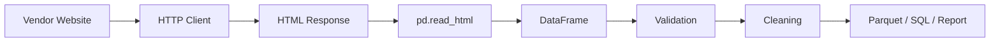
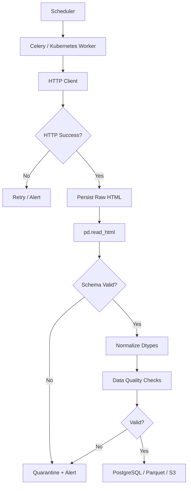

# 06- Html

## Overview

Pandas provides HTML input and output support for working with tabular data exposed through web pages, HTML reports, dashboards, and legacy systems.

The primary APIs are:

```python
pd.read_html()
DataFrame.to_html()
```

`read_html()` is designed to discover and parse HTML `<table>` elements into DataFrames. `to_html()` converts a DataFrame into an HTML table representation.

The most common backend-oriented flow is:

```text
Web page / HTML response
        ↓
HTTP retrieval
        ↓
HTML document
        ↓
pd.read_html()
        ↓
DataFrame
        ↓
Validation
        ↓
Cleaning / Transformation
        ↓
CSV / Parquet / SQL / Report
```

HTML support is useful when a source system exposes structured data only through web pages. It should generally be treated as an ingestion or presentation mechanism rather than the preferred long-term data interchange format.

## When Pandas HTML Support Is Useful

Typical use cases include:

- Extracting tables from internal web pages.
- Processing legacy HTML reports.
- Importing tables from vendor portals.
- Parsing government or public-data pages.
- Generating HTML reports from DataFrames.
- Rendering tabular results in notebooks or internal tools.
- Converting processed data into simple HTML artifacts for email or dashboards.

It is less appropriate when the source provides a stable API, CSV, JSON, Parquet, or direct database access.

A reasonable source preference is:

```text
Database / API
      ↓
Structured file
      ↓
HTML table
      ↓
Screen scraping / unstructured HTML parsing
```

Prefer the most structured and contract-stable source available.

## `read_html()`

`pd.read_html()` parses HTML tables and returns a list of DataFrames.

Basic usage:

```python
import pandas as pd

tables = pd.read_html(
    "https://example.com/report"
)
```

The return value is a list:

```python
list[pd.DataFrame]
```

Even when the page contains only one table:

```python
table = tables[0]
```

This behavior exists because a single HTML document may contain multiple tables.

## Parsing a Local HTML File

```python
tables = pd.read_html(
    "reports/orders.html"
)

orders = tables[0]
```

This is useful for downloaded vendor reports or generated internal reports.

## Parsing HTML Content

When HTML has already been retrieved:

```python
html = response.text

tables = pd.read_html(
    html
)
```

However, fetching remote content and parsing it are separate concerns.

A production ingestion pipeline is usually easier to control when HTTP retrieval is handled explicitly.

```python
import requests
import pandas as pd

response = requests.get(
    report_url,
    timeout=30,
)

response.raise_for_status()

tables = pd.read_html(
    response.text,
)
```

This provides control over:

- Timeout behavior.
- HTTP status handling.
- Authentication.
- Headers.
- Retries.
- Proxy configuration.
- Logging.
- Observability.

## HTTP Retrieval Architecture



Keeping retrieval separate from parsing makes the pipeline easier to test and operate.

## Selecting Specific Tables

A page can contain many tables.

```python
tables = pd.read_html(
    response.text
)

for index, table in enumerate(tables):
    print(index, table.shape)
```

Inspecting shape and columns is safer than assuming:

```python
orders = tables[0]
```

For example:

```python
for index, table in enumerate(tables):
    print(
        index,
        table.shape,
        list(table.columns),
    )
```

This helps identify the correct table when the page structure changes.

## `match`

`read_html()` can use `match` to select tables whose content matches a regular expression.

```python
tables = pd.read_html(
    response.text,
    match="Order ID",
)
```

This can be more robust than relying only on table position.

A useful approach is:

```text
Page
 ↓
Find table using meaningful content
 ↓
Validate schema
 ↓
Process
```

rather than:

```text
Always use table 0
```

## `attrs`

HTML tables can sometimes be identified using HTML attributes.

```python
tables = pd.read_html(
    response.text,
    attrs={
        "id": "orders-table",
    },
)
```

This is useful when the source exposes stable attributes.

Do not assume that HTML attributes are permanent contracts unless the source system documents them.

## `header`

HTML table headers may require explicit handling.

```python
tables = pd.read_html(
    response.text,
    header=0,
)
```

The correct setting depends on the table structure.

Inspect the resulting DataFrame:

```python
print(orders.columns)
print(orders.head())
```

Do not blindly assign column names before understanding how the HTML parser interpreted the header rows.

## Header Rows and MultiIndex Columns

HTML tables with multiple header rows can result in hierarchical columns.

For example:

```python
table = pd.read_html(
    response.text,
    header=[0, 1],
)[0]
```

The resulting columns may be a `MultiIndex`.

Inspect:

```python
print(table.columns)
```

Flatten them only when the downstream schema requires a flat representation.

```python
table.columns = [
    "_".join(
        str(part)
        for part in column
        if str(part) != "nan"
    ).strip("_")
    for column in table.columns
]
```

Do not flatten automatically if hierarchical semantics are meaningful.

## `skiprows`

Some HTML reports contain title rows or metadata before the actual data header.

```python
table = pd.read_html(
    response.text,
    skiprows=2,
)[0]
```

This can work when the structure is stable.

For production ingestion, pair parsing rules with schema validation because a vendor adding one introductory row can shift the entire interpretation.

## `skipfooter`

Some reports include notes or totals after the actual data:

```python
table = pd.read_html(
    response.text,
    skipfooter=1,
)[0]
```

The parser's behavior should be tested against representative input because presentation-oriented HTML frequently contains extra rows that are not part of the data contract.

## `keep_default_na`

HTML cells representing blank or null-like values can be interpreted as missing values.

```python
table = pd.read_html(
    response.text,
    keep_default_na=True,
)[0]
```

After ingestion:

```python
missing = table.isna().sum()
```

Always validate missing-value semantics before applying business rules.

An HTML string such as:

```text
N/A
-
Unknown
```

may have different meanings depending on the source.

## Data Types After HTML Parsing

HTML has weaker type guarantees than a database schema.

A numeric-looking column can contain:

```text
1,200
1,450
N/A
```

and may require explicit conversion:

```python
orders["amount"] = pd.to_numeric(
    orders["amount"],
    errors="coerce",
)
```

Likewise, dates should be normalized:

```python
orders["created_at"] = pd.to_datetime(
    orders["created_at"],
    errors="coerce",
    utc=True,
)
```

Treat HTML parsing as an untrusted ingestion boundary.

## Realistic HTML Ingestion Example

Suppose a vendor publishes:

```html
<table id="orders-table">
    <thead>
        <tr>
            <th>Order ID</th>
            <th>Customer ID</th>
            <th>Amount</th>
            <th>Status</th>
        </tr>
    </thead>
    <tbody>
        <tr>
            <td>ORD-1001</td>
            <td>C-501</td>
            <td>1,250.00</td>
            <td>Completed</td>
        </tr>
    </tbody>
</table>
```

A production-oriented parser can normalize the result:

```python
import pandas as pd


def parse_orders(html: str) -> pd.DataFrame:
    tables = pd.read_html(
        html,
        attrs={"id": "orders-table"},
    )

    if len(tables) != 1:
        raise ValueError(
            "Expected exactly one orders table"
        )

    orders = tables[0].rename(
        columns={
            "Order ID": "order_id",
            "Customer ID": "customer_id",
            "Amount": "amount",
            "Status": "status",
        }
    )

    orders["order_id"] = (
        orders["order_id"]
        .astype("string")
        .str.strip()
    )

    orders["customer_id"] = (
        orders["customer_id"]
        .astype("string")
        .str.strip()
    )

    orders["amount"] = pd.to_numeric(
        orders["amount"]
        .astype("string")
        .str.replace(",", "", regex=False),
        errors="coerce",
    )

    orders["status"] = (
        orders["status"]
        .astype("string")
        .str.strip()
        .str.lower()
    )

    return orders
```

This establishes a controlled boundary between:

```text
Unreliable presentation format
        ↓
Normalized internal schema
```

## Schema Validation

Do not treat successful HTML parsing as successful ingestion.

The parser can return a DataFrame with the wrong columns and still report no parsing error.

Validate:

```python
expected_columns = {
    "order_id",
    "customer_id",
    "amount",
    "status",
}

actual_columns = set(
    orders.columns
)

if actual_columns != expected_columns:
    raise ValueError(
        f"Unexpected schema: {actual_columns}"
    )
```

You should also validate:

```text
Column presence
Column types
Required values
Duplicate keys
Allowed categories
Value ranges
Expected row counts
```

## Validation Example

```python
required = [
    "order_id",
    "customer_id",
    "amount",
]

if orders[required].isna().any().any():
    raise ValueError(
        "Required order fields contain missing values"
    )

if orders["amount"].lt(0).any():
    raise ValueError(
        "Order amount cannot be negative"
    )

if orders["order_id"].duplicated().any():
    raise ValueError(
        "Duplicate order IDs detected"
    )
```

This prevents a presentation-layer change from silently corrupting downstream systems.

## Handling Table Position Changes

A fragile implementation:

```python
orders = pd.read_html(
    html
)[0]
```

is acceptable only when the document contract is tightly controlled.

A more resilient strategy is to identify the table using:

```text
stable HTML attributes
meaningful table contents
expected columns
schema validation
```

For example:

```python
tables = pd.read_html(
    html,
    attrs={"id": "orders-table"},
)

orders = tables[0]

expected = {
    "Order ID",
    "Customer ID",
    "Amount",
    "Status",
}

if set(orders.columns) != expected:
    raise ValueError(
        "Vendor orders table schema changed"
    )
```

## Handling HTML Structure Changes

HTML is often a presentation format, so source changes can happen without an API versioning mechanism.

Possible changes include:

```text
Column renamed
Table ID changed
Header moved
Pagination added
Totals row added
New advertisement table inserted
Nested table introduced
Rows hidden or reordered
```

Production jobs should detect these changes rather than silently producing incorrect output.

## Monitoring HTML Ingestion

Useful metrics include:

| Metric | Purpose |
|---|---|
| HTTP status distribution | Detect source availability problems |
| Request latency | Detect network/source degradation |
| Number of tables found | Detect page structure changes |
| Target table row count | Detect unexpected data volume |
| Column count | Detect schema changes |
| Validation failures | Detect data-quality problems |
| Parse duration | Detect parser regressions |
| Output record count | Detect downstream impact |
| Retry count | Detect source instability |

Alert on meaningful deviations rather than every small row-count fluctuation.

## HTTP Reliability

The HTML parser is only one part of the system.

For production ingestion, configure:

```text
Timeout
Retry policy
Backoff
Connection reuse
User-Agent policy
TLS verification
Authentication
Rate limiting
```

For example, with `requests` and `urllib3`:

```python
import requests
from requests.adapters import HTTPAdapter
from urllib3.util.retry import Retry


session = requests.Session()

retry = Retry(
    total=3,
    backoff_factor=1.0,
    status_forcelist=[429, 500, 502, 503, 504],
    allowed_methods=["GET"],
)

session.mount(
    "https://",
    HTTPAdapter(max_retries=retry),
)
```

Retries should be limited to operations where retrying is safe.

## Timeouts

Never make external HTTP calls without a timeout.

Bad:

```python
response = requests.get(url)
```

Better:

```python
response = requests.get(
    url,
    timeout=(5, 30),
)
```

The tuple separates connection and read timeouts.

Without timeouts, a worker can remain blocked indefinitely, consuming Kubernetes pod capacity or Celery worker slots.

## Rate Limiting

Public and vendor sites may impose request limits.

A production crawler should respect:

```text
robots policies where applicable
provider terms
documented API/rate limits
reasonable request frequency
```

Prefer official APIs when available.

Adding many concurrent requests through Celery or Kubernetes can unintentionally overload a source.

## Authentication

HTML reports may require:

```text
Cookies
HTTP authentication
Bearer tokens
Session state
CSRF handling
```

The authentication mechanism belongs to the HTTP client layer.

Do not embed credentials directly into parsing code.

For example:

```python
response = session.get(
    report_url,
    timeout=30,
)
```

where `session` has already been configured securely.

## JavaScript-Rendered Tables

`pd.read_html()` parses HTML that is available to the parser.

It does not function as a full browser automation framework.

If a page initially contains:

```html
<div id="orders"></div>
```

and JavaScript later inserts the table, the table may not exist in the original HTTP response.

The architecture may instead need:

```text
Browser-rendered page
        ↓
Underlying API request
        ↓
JSON / HTML
        ↓
Pandas
```

Before introducing browser automation, inspect the page's network calls. The underlying API is often a much better ingestion source.

## Browser Automation vs Pandas

| Approach | Best use |
|---|---|
| `pd.read_html()` | Static HTML tables |
| HTTP client + `read_html()` | Controlled server-rendered pages |
| REST API | Preferred when available |
| Browser automation | JavaScript-only workflows with no accessible structured endpoint |

Browser automation introduces:

- Higher CPU and memory usage.
- More operational complexity.
- Browser dependencies.
- More fragile selectors.
- Longer execution times.

Do not use Selenium or Playwright merely because HTML exists.

## HTML Table Parsing vs HTML DOM Parsing

`read_html()` is intended for tables.

For non-tabular HTML such as:

```html
<div class="customer-card">
    ...
</div>
```

use a DOM-oriented parser such as BeautifulSoup or lxml rather than forcing the content through Pandas.

A useful separation is:

```text
HTML table
→ Pandas

Arbitrary HTML structure
→ DOM parser

Underlying API
→ JSON client
```

## Multiple Tables

A report may contain:

```text
Summary table
Orders table
Returns table
Totals table
```

Parse and identify each intentionally:

```python
tables = pd.read_html(
    html
)

summary = tables[0]
orders = tables[1]
returns = tables[2]
```

For production code, avoid relying solely on fixed indexes when a stronger identifier exists.

## Empty Tables

An HTML table can exist but contain no data rows.

Always handle:

```python
if orders.empty:
    raise ValueError(
        "Orders table is unexpectedly empty"
    )
```

However, empty output is not always an error. For a valid reporting period with no events, an empty DataFrame may be expected.

The pipeline should distinguish:

```text
Expected empty dataset
```

from:

```text
Unexpected extraction failure
```

## Duplicate Records

HTML reports may contain:

- Repeated rows.
- Summary rows.
- Pagination duplicates.
- Historical/current rows.
- Hidden duplicate tables.

Validate domain keys:

```python
duplicates = orders[
    orders["order_id"].duplicated(
        keep=False
    )
]

if not duplicates.empty:
    raise ValueError(
        "Duplicate order IDs detected"
    )
```

Never drop duplicates automatically without understanding why duplicates exist.

## Totals Rows

Reports frequently append totals:

```text
ORD-1001
ORD-1002
ORD-1003
Total
```

A numeric conversion may produce:

```text
NaN
```

for the total label and accidentally make the row look invalid.

Handle it intentionally:

```python
orders = orders.loc[
    orders["order_id"]
    .astype("string")
    .str.startswith("ORD-")
]
```

A better approach is to define the source's row semantics explicitly.

## Nested Tables

Some HTML contains nested tables or layout tables.

Do not assume every detected table represents a business dataset.

Inspect:

```python
for table in tables:
    print(table.shape)
    print(table.columns)
```

Then validate against the intended schema.

## HTML Output with `to_html()`

Pandas can render a DataFrame as an HTML table:

```python
html = orders.to_html(
    index=False,
)
```

The result is a string containing HTML markup.

This is useful for:

- Internal reports.
- HTML email fragments.
- Administrative dashboards.
- Generated artifacts.

## `index=False`

For business tables, the DataFrame index is usually not a business field.

Prefer:

```python
html = orders.to_html(
    index=False,
)
```

rather than exposing an artificial DataFrame index.

## Formatting HTML Output

You can provide formatting:

```python
html = orders.to_html(
    index=False,
    formatters={
        "amount": lambda value: f"${value:,.2f}",
    },
)
```

Be careful not to permanently convert numeric data into display strings before analytical processing.

Prefer:

```text
Numeric DataFrame
        ↓
Formatting at presentation layer
```

rather than:

```text
Numeric DataFrame
        ↓
Convert to strings
        ↓
Continue analytical processing
```

## Escaping HTML

When DataFrame values can contain user-controlled content, HTML escaping matters.

Pandas can escape HTML-sensitive characters during rendering:

```python
html = orders.to_html(
    index=False,
    escape=True,
)
```

This helps prevent user-controlled values from becoming executable HTML.

Treat generated HTML as an output encoding problem, not just a formatting operation.

## Security Considerations

HTML ingestion and output have different threat models.

### Ingestion Risks

External HTML can contain:

- Unexpected markup.
- Malicious content.
- Extremely large documents.
- Parser edge cases.
- Unexpected redirects.

Use:

```text
HTTPS
timeouts
response-size limits
controlled dependencies
schema validation
```

### Output Risks

If DataFrame values originate from users or external systems:

```text
DataFrame
    ↓
HTML rendering
    ↓
Browser / email client
```

must be treated as an output-encoding boundary.

Use HTML escaping and an appropriate Content Security Policy when serving generated HTML through a web application.

## HTML Reports in Django and FastAPI

A DataFrame should generally be prepared in the service layer and rendered by the web framework's templating layer rather than embedding large HTML strings directly into endpoint logic.

For example:

```python
from django.shortcuts import render


def order_report(request):
    orders = build_order_report()

    return render(
        request,
        "reports/orders.html",
        {
            "orders": orders.to_dict(
                orient="records"
            ),
        },
    )
```

This keeps presentation concerns in the template layer.

For FastAPI, return structured data when possible:

```python
from fastapi import FastAPI

app = FastAPI()


@app.get("/orders/report")
def order_report():
    report = build_order_report()

    return report.to_dict(
        orient="records"
    )
```

Use `to_html()` primarily when the actual output contract is HTML.

## HTML Email

For email reports:

```python
html = orders.to_html(
    index=False,
    escape=True,
)
```

Then pass the HTML to the email delivery system.

Do not assume DataFrame-generated HTML is automatically a complete email document. Email clients have inconsistent CSS and HTML support.

For serious email reporting:

```text
Pandas
→ structured data
→ dedicated email template
→ email provider
```

is often easier to control than generating the entire presentation directly from Pandas.

## Rendering Large DataFrames to HTML

Avoid generating extremely large HTML tables.

HTML is verbose because each cell becomes markup.

For large datasets:

```text
100 rows
→ HTML is reasonable

100,000 rows
→ HTML becomes expensive and unwieldy
```

Prefer:

```text
Pagination
Server-side filtering
Aggregated reports
Parquet / CSV downloads
API responses
```

rather than rendering every row into one page.

## Performance Considerations

HTML parsing has several cost components:

```text
HTTP transfer
      ↓
HTML parsing
      ↓
Table discovery
      ↓
DataFrame construction
      ↓
Data cleaning
```

Potential bottlenecks include:

- Large HTML documents.
- Many tables.
- Deeply nested markup.
- Complex parsing.
- Network latency.
- Multiple remote requests.
- Browser rendering.

For repeated ingestion, benchmark the complete workflow rather than only `read_html()`.

## Caching

If the same report is processed repeatedly, caching the raw response can reduce external load and improve reproducibility.

A simple architecture:

```text
Vendor
  ↓
HTTP
  ↓
Raw HTML
  ↓
Object storage
  ↓
Pandas
  ↓
Validated dataset
```

In AWS, raw HTML can be stored in S3 with metadata such as:

```text
source URL
retrieval timestamp
HTTP status
content hash
pipeline version
```

This supports replay and auditing.

## Reproducibility

External HTML can change after extraction.

For important pipelines, retain the raw source:

```text
Raw HTML
   +
Extraction metadata
   ↓
Deterministic processing
   ↓
Normalized output
```

This makes debugging much easier when a vendor changes their site.

## Content Hashing

A content hash can detect whether the source changed:

```python
import hashlib


content_hash = hashlib.sha256(
    response.content
).hexdigest()
```

Store the hash with extraction metadata.

This is useful for:

- Change detection.
- Deduplication.
- Auditability.
- Reprocessing decisions.

## Idempotent Ingestion

A scheduled HTML ingestion job should behave predictably when retried.

For example:

```text
Source report
    ↓
Content hash
    ↓
Already processed?
   / \
 Yes  No
 ↓     ↓
Skip   Parse
       ↓
    Validate
       ↓
    Persist
```

A deterministic source identifier and content hash can help prevent duplicate ingestion.

## Celery and Scheduled HTML Extraction

HTML extraction is usually better as an asynchronous job than as a request-time operation.

```text
Celery Beat / Scheduler
        ↓
Celery Worker
        ↓
HTTP Retrieval
        ↓
Pandas Parsing
        ↓
Validation
        ↓
S3 / PostgreSQL
```

Do not make a customer-facing HTTP request wait for a slow vendor portal unless latency and reliability are well controlled.

## Kubernetes Considerations

A Kubernetes worker processing HTML should have:

```text
Memory limits
CPU limits
Request timeout
Retry policy
Structured logs
Metrics
Graceful failure handling
```

Large HTML responses can unexpectedly increase memory usage because both:

```text
Raw HTML
+
Parsed DataFrame
```

may coexist in memory.

Keep the worker's memory budget aligned with the largest expected document.

## Failure Isolation

External sources fail independently from your system.

A robust ingestion job should distinguish:

```text
Network failure
HTTP failure
HTML parse failure
Schema failure
Data-quality failure
Persistence failure
```

This enables appropriate retry behavior.

For example:

| Failure | Typical action |
|---|---|
| Connection timeout | Retry with backoff |
| HTTP 429 | Respect retry-after/rate policy |
| HTTP 500 | Retry |
| Invalid HTML table | Alert / investigate |
| Schema mismatch | Stop and alert |
| Validation failure | Quarantine data |
| Database failure | Retry according to transaction policy |

Do not blindly retry schema or validation failures.

## Quarantine Pattern

When source data is malformed:

```text
Raw HTML
   ↓
Parse
   ↓
Validation fails
   ↓
Quarantine
   ↓
Alert
```

Keep the raw input when policy permits so the failure can be reproduced.

This is preferable to silently discarding the input.

## Testing HTML Parsers

Test the parser with representative HTML fixtures.

Example:

```python
from pathlib import Path

import pandas as pd


def test_orders_table_parsing() -> None:
    html = Path(
        "tests/fixtures/orders.html"
    ).read_text(
        encoding="utf-8",
    )

    tables = pd.read_html(
        html,
        attrs={"id": "orders-table"},
    )

    orders = tables[0]

    assert list(orders.columns) == [
        "Order ID",
        "Customer ID",
        "Amount",
        "Status",
    ]
```

Test business behavior, not merely whether Pandas returns a DataFrame.

## Schema Regression Tests

If the upstream HTML format is business-critical, maintain fixtures representing:

```text
Current schema
Previous schema
Missing column
Extra column
Empty table
Malformed numeric value
Duplicate record
Unexpected footer
```

A schema change should fail loudly in CI or the ingestion job.

## Testing Transformation Logic Separately

Separate:

```text
HTML parsing
```

from:

```text
DataFrame normalization
```

For example:

```python
def normalize_orders(
    orders: pd.DataFrame,
) -> pd.DataFrame:
    result = orders.copy()

    result["amount"] = pd.to_numeric(
        result["amount"],
        errors="coerce",
    )

    result["status"] = (
        result["status"]
        .astype("string")
        .str.strip()
        .str.lower()
    )

    return result
```

Then unit-test normalization using DataFrames without requiring HTML fixtures.

This reduces test complexity and improves failure isolation.

## Common Mistakes

### Assuming Every Page Has One Table

```python
orders = pd.read_html(url)[0]
```

can silently select the wrong table after a site redesign.

**Better:** identify the table and validate its schema.

### Treating HTML as a Stable API

HTML often changes for presentation reasons.

**Better:** prefer APIs or structured exports and use HTML only when necessary.

### Parsing JavaScript-Generated Content with `read_html()`

A table generated after page load may not exist in the server response.

**Better:** inspect the underlying network/API calls before introducing browser automation.

### No HTTP Timeout

```python
requests.get(url)
```

can block indefinitely.

**Better:** configure explicit connection and read timeouts.

### Blindly Retrying Schema Failures

A parser failure caused by a source format change is not fixed by retrying.

**Better:** retry transient network failures and alert on structural/data-quality failures.

### Converting All Values to Strings

This can destroy numeric and datetime semantics.

**Better:** normalize into intentional Pandas dtypes after parsing.

### Silently Coercing Invalid Values

```python
pd.to_numeric(
    values,
    errors="coerce",
)
```

can turn malformed data into missing values.

**Better:** inspect the resulting nulls and enforce business validation.

### Rendering Huge Tables to HTML

Large HTML tables consume memory and produce poor browser performance.

**Better:** paginate, aggregate, or provide a downloadable structured format.

### Trusting HTML Output Without Escaping

External values can contain HTML-sensitive content.

**Better:** escape untrusted values and use framework-level output protections.

### Using `to_html()` as an Entire Web UI

Pandas generates a table, not a complete production frontend.

**Better:** use Django/FastAPI templates or a frontend application when presentation requirements are substantial.

### Ignoring Raw Source Preservation

Without the original HTML, reproducing a parsing failure may be difficult.

**Better:** retain source artifacts where compliance, cost, and privacy policies allow.

## Production Architecture

A robust HTML ingestion pipeline can look like:



The important design principle is that parsing is only one stage in a larger ingestion contract.

## Recommended Source Hierarchy

| Source | Reliability | Typical Use |
|---|---|---|
| Database | High | Internal structured data |
| Versioned API | High | External integrations |
| CSV / Parquet | High | Data exchange |
| JSON | High | API payloads |
| HTML table | Medium | Legacy/vendor/public reports |
| Arbitrary HTML scraping | Low | Last-resort extraction |

This is not absolute, but it is a useful engineering default.

## Interview Traps

### What Does `pd.read_html()` Return?

A list of DataFrames:

```python
tables = pd.read_html(html)
```

Each detected HTML table becomes a DataFrame.

### Does `read_html()` Fetch and Parse JavaScript-Rendered Tables?

Not as a browser would. It parses HTML available to the parser. JavaScript-generated content may require access to an underlying API or browser automation.

### When Should You Prefer an API Over `read_html()`?

Prefer an API when it provides the same data because APIs usually offer more stable schemas, explicit contracts, pagination, authentication, and machine-oriented semantics.

### Why Validate the Schema After `read_html()`?

Successful parsing only means that a table could be interpreted. It does not prove that the correct business table or schema was extracted.

### Why Should HTTP Retrieval Be Separate from Parsing?

It allows independent control over:

```text
Timeouts
Retries
Authentication
Metrics
Caching
Testing
```

and makes the parsing logic deterministic for fixture-based tests.

### Can `read_html()` Parse Arbitrary HTML?

It is designed for HTML tables. Use DOM parsing tools for non-tabular HTML.

### Why Is HTML More Fragile Than Parquet?

Parquet carries explicit columnar and type information, whereas HTML is presentation-oriented and can change without preserving a stable machine-readable contract.

### How Would You Handle a Vendor Website Changing Its Table Layout?

Detect the change using schema validation, preserve the raw source, alert the pipeline, and update the parser deliberately rather than silently adapting to an unknown format.

### How Would You Process a JavaScript-Rendered Dashboard?

First inspect the browser's network requests for an underlying JSON or HTML endpoint. Use that structured endpoint when available before introducing browser automation.

### How Do You Make HTML Ingestion Idempotent?

Use deterministic source identifiers, content hashes, stable business keys, and idempotent persistence so that retries do not create duplicate records.

## Production Example

A practical ingestion function can combine HTTP retrieval, parsing, and schema validation while keeping responsibilities explicit:

```python
from __future__ import annotations

import pandas as pd
import requests


EXPECTED_COLUMNS = {
    "Order ID",
    "Customer ID",
    "Amount",
    "Status",
}


def fetch_order_report(
    session: requests.Session,
    url: str,
) -> str:
    response = session.get(
        url,
        timeout=(5, 30),
    )
    response.raise_for_status()

    return response.text


def parse_order_report(
    html: str,
) -> pd.DataFrame:
    tables = pd.read_html(
        html,
        attrs={"id": "orders-table"},
    )

    if len(tables) != 1:
        raise ValueError(
            "Expected exactly one orders table"
        )

    orders = tables[0]

    if set(orders.columns) != EXPECTED_COLUMNS:
        raise ValueError(
            "Orders table schema has changed"
        )

    orders = orders.rename(
        columns={
            "Order ID": "order_id",
            "Customer ID": "customer_id",
            "Amount": "amount",
            "Status": "status",
        }
    )

    orders["order_id"] = (
        orders["order_id"]
        .astype("string")
        .str.strip()
    )

    orders["customer_id"] = (
        orders["customer_id"]
        .astype("string")
        .str.strip()
    )

    orders["amount"] = pd.to_numeric(
        orders["amount"]
        .astype("string")
        .str.replace(",", "", regex=False),
        errors="coerce",
    )

    orders["status"] = (
        orders["status"]
        .astype("string")
        .str.strip()
        .str.lower()
    )

    if orders["order_id"].isna().any():
        raise ValueError(
            "Order IDs contain missing values"
        )

    if orders["order_id"].duplicated().any():
        raise ValueError(
            "Duplicate order IDs detected"
        )

    if orders["amount"].isna().any():
        raise ValueError(
            "Invalid order amounts detected"
        )

    return orders
```

A scheduled worker can then orchestrate:

```text
fetch
→ persist raw source
→ parse
→ validate schema
→ normalize
→ validate data
→ persist structured output
→ emit metrics
```

This separation makes the workflow easier to retry, test, monitor, and evolve.

## Key Takeaways

- `pd.read_html()` is primarily an ingestion tool for HTML tables; it returns a list of DataFrames because a document can contain multiple tables.
- Treat HTML as a presentation-oriented and potentially unstable source: identify the intended table, validate its schema, normalize dtypes, and detect structural changes explicitly.
- Separate HTTP retrieval from Pandas parsing so timeouts, retries, authentication, caching, observability, and parser testing remain independently controllable.
- Prefer APIs, databases, CSV, JSON, or Parquet over HTML when a stable structured source exists; use browser automation only when no suitable structured endpoint is available.
- Production HTML pipelines should preserve raw input where appropriate, validate business data, support idempotent retries, protect untrusted HTML output, and isolate failures from downstream systems.