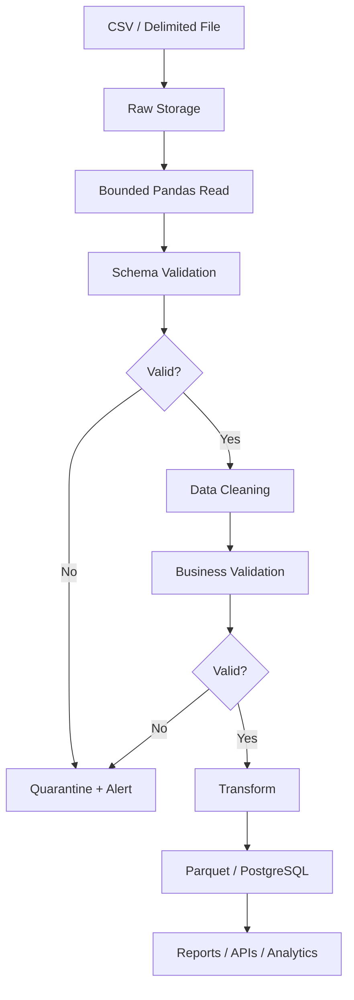

# 07- Text Files

## Overview

Pandas supports reading and writing text-based tabular data, primarily through `read_csv()` and `DataFrame.to_csv()`. In production systems, text files commonly appear as CSV exports, delimited files, logs with tabular structure, vendor reports, batch exchange files, and intermediate ETL artifacts.

Text files are simple and interoperable, but they have weak schema guarantees compared with formats such as Parquet or database tables. A robust Pandas workflow therefore treats text-file ingestion as a schema and data-quality boundary rather than assuming that a successfully parsed file is valid data.

A typical workflow is:

```text
Source System
     ↓
CSV / Delimited Text File
     ↓
Pandas Ingestion
     ↓
Schema + Type Validation
     ↓
Cleaning / Transformation
     ↓
Validated DataFrame
     ↓
Parquet / SQL / API / Report
```

For repeated analytical workloads, text files are often best used at the ingestion or exchange boundary and converted into a typed storage format such as Parquet after validation.

## Why Text Files Matter

CSV and similar delimited formats remain common because they are:

- Easy to generate.
- Easy to inspect.
- Supported by almost every system.
- Simple to transfer through S3, SFTP, HTTP, and batch workflows.
- Convenient for human review.
- Suitable for data exchange between organizations.

Their simplicity is also their main limitation.

A CSV file generally does not carry the same schema contract as a database table or Parquet dataset. Ambiguities can exist around:

```text
Column types
Missing values
Date formats
Decimal separators
Encoding
Column names
Duplicate rows
Quoting
Escaping
Header presence
```

Production ingestion must compensate for those weaknesses.

## CSV and Delimited Text

CSV means comma-separated values, but the underlying pattern is broader than commas.

Common delimiters include:

```text
,
;
|
\t
```

Pandas can parse all of these with `read_csv()`.

For example:

```python
import pandas as pd

orders = pd.read_csv(
    "orders.csv"
)
```

A semicolon-delimited file:

```python
orders = pd.read_csv(
    "orders.txt",
    sep=";",
)
```

A tab-delimited file:

```python
orders = pd.read_csv(
    "orders.tsv",
    sep="\t",
)
```

## `read_csv()`

`read_csv()` is the primary Pandas interface for reading delimited text files.

Common parameters include:

| Parameter | Purpose |
|---|---|
| `filepath_or_buffer` | File path or file-like source |
| `sep` | Field delimiter |
| `header` | Header row configuration |
| `names` | Explicit column names |
| `dtype` | Explicit dtype control |
| `parse_dates` | Parse date columns |
| `usecols` | Select columns during ingestion |
| `nrows` | Limit rows read |
| `skiprows` | Skip input rows |
| `encoding` | Text encoding |
| `na_values` | Additional missing-value markers |
| `chunksize` | Read incrementally |
| `compression` | Compressed input handling |
| `converters` | Per-column conversion logic |

The correct combination depends on the source contract.

## Basic Production-Oriented Read

```python
import pandas as pd

orders = pd.read_csv(
    "data/raw/orders.csv",
    usecols=[
        "order_id",
        "customer_id",
        "amount",
        "created_at",
    ],
    dtype={
        "order_id": "string",
        "customer_id": "string",
    },
)
```

This is preferable to loading every column and cleaning the schema afterward when the required schema is already known.

## File-Like Objects

Pandas can also read from file-like objects:

```python
from io import StringIO

csv_data = StringIO(
    """order_id,amount,status
ORD-1001,1250.00,completed
ORD-1002,890.50,pending
"""
)

orders = pd.read_csv(
    csv_data
)
```

This is useful for:

- HTTP responses.
- In-memory test fixtures.
- Uploaded files.
- Object-storage adapters.
- Service integrations.

## Reading Uploaded Files in Backend Applications

A Django or FastAPI endpoint may receive an uploaded file and pass its file object to Pandas.

For example:

```python
orders = pd.read_csv(
    uploaded_file,
    dtype={
        "order_id": "string",
        "customer_id": "string",
    },
)
```

Do not automatically trust uploaded content.

Production handling should also include:

```text
File-size limits
Content-type validation
Schema validation
Column limits
Timeout/resource limits
Virus/malware scanning where appropriate
```

Pandas parsing is not a security boundary by itself.

## Column Projection with `usecols`

If only a subset of columns is needed:

```python
orders = pd.read_csv(
    "orders.csv",
    usecols=[
        "order_id",
        "customer_id",
        "amount",
    ],
)
```

This can reduce memory usage and parsing work.

Conceptually:

```text
Disk / S3
   ↓
CSV parser
   ↓
Required columns only
   ↓
DataFrame
```

rather than:

```text
Disk / S3
   ↓
All columns
   ↓
DataFrame
   ↓
Drop unused columns
```

For wide files, this difference can be significant.

## Explicit Dtypes

Text input does not provide reliable typing guarantees.

For identifiers:

```python
orders = pd.read_csv(
    "orders.csv",
    dtype={
        "order_id": "string",
        "customer_id": "string",
    },
)
```

This preserves identifiers such as:

```text
000123
000124
```

instead of converting them into numeric values and losing leading zeros.

## Numeric Dtypes

For numeric values with clean input:

```python
orders = pd.read_csv(
    "orders.csv",
    dtype={
        "quantity": "Int64",
    },
)
```

For messy numeric columns, explicit post-ingestion conversion may be clearer:

```python
orders["amount"] = pd.to_numeric(
    orders["amount"],
    errors="coerce",
)
```

Then validate the resulting missing values.

## Datetime Columns

A modern parsing pattern is:

```python
orders = pd.read_csv(
    "orders.csv",
    parse_dates=[
        "created_at",
    ],
)
```

For sources with inconsistent date formats or unreliable input:

```python
orders["created_at"] = pd.to_datetime(
    orders["created_at"],
    errors="coerce",
    utc=True,
)
```

After parsing:

```python
if orders["created_at"].isna().any():
    raise ValueError(
        "Invalid created_at values detected"
    )
```

Treat conversion failures as data-quality events rather than silently accepting them.

## `dtype_backend`

Modern Pandas supports configurable dtype backends.

For example:

```python
orders = pd.read_csv(
    "orders.csv",
    dtype_backend="numpy_nullable",
)
```

or, where appropriate for the environment:

```python
orders = pd.read_csv(
    "orders.csv",
    dtype_backend="pyarrow",
)
```

The choice affects memory representation and interoperability. Do not change dtype backends casually across a codebase because downstream code may depend on specific dtype behavior.

## Headers

Most CSV files include a header:

```csv
order_id,customer_id,amount
ORD-1001,C-101,1250.00
```

Pandas uses the first row as column names by default.

For files without headers:

```python
orders = pd.read_csv(
    "orders.csv",
    header=None,
    names=[
        "order_id",
        "customer_id",
        "amount",
    ],
)
```

When using `header=None`, define the schema explicitly.

## Header Validation

A common production pattern is:

```python
orders = pd.read_csv(
    "orders.csv"
)

expected_columns = [
    "order_id",
    "customer_id",
    "amount",
    "status",
]

if list(orders.columns) != expected_columns:
    raise ValueError(
        "Unexpected input schema"
    )
```

Schema validation should happen immediately after ingestion.

## Delimiter Detection

Some files have inconsistent delimiters.

You may encounter:

```text
order_id,amount,status
```

or:

```text
order_id;amount;status
```

Automatic detection can be convenient, but explicit configuration is generally safer when the source contract is known.

An ingestion pipeline should not silently infer a different structure when a schema mismatch indicates an upstream change.

## Quoting

CSV fields can contain delimiters when quoted:

```csv
order_id,description,amount
ORD-1001,"Premium, Annual Plan",1250.00
```

Pandas handles standard CSV quoting:

```python
orders = pd.read_csv(
    "orders.csv"
)
```

Be cautious when manually splitting lines with:

```python
line.split(",")
```

This is not a real CSV parser and fails with quoted delimiters, embedded newlines, and escaping rules.

## Quoting and Escaping

Text formats support more than delimiter separation.

Potential complications include:

```text
Quoted delimiters
Embedded quotes
Escaped quotes
Embedded newlines
Carriage returns
Malformed rows
```

Use a CSV-aware parser rather than custom string splitting for production ingestion.

## `on_bad_lines`

Malformed rows may occur in external files.

You can configure handling explicitly:

```python
orders = pd.read_csv(
    "orders.csv",
    on_bad_lines="error",
)
```

Strict failure is usually preferable for regulated or critical pipelines.

Other behaviors can be appropriate for controlled non-critical ingestion, but silently skipping malformed records can cause data loss.

For most production pipelines:

```text
Detect bad row
    ↓
Record failure
    ↓
Quarantine / investigate
```

is safer than silently discarding it.

## Missing Values in Text Files

CSV commonly uses multiple missing markers:

```text
""
NA
N/A
NULL
null
-
```

You can configure source-specific values:

```python
orders = pd.read_csv(
    "orders.csv",
    na_values=[
        "NULL",
        "N/A",
    ],
)
```

Be careful: a missing-value marker can be a legitimate business value in some domains.

The source contract should define the semantics.

## Empty Strings vs Missing Values

These are not necessarily equivalent:

```text
""
NULL
```

An empty string may mean:

```text
Known empty value
```

while `NULL` means:

```text
Unknown / absent value
```

Do not normalize both automatically without domain rules.

## Encoding

Text files may use different encodings.

UTF-8 is the preferred default for modern systems:

```python
orders = pd.read_csv(
    "orders.csv",
    encoding="utf-8",
)
```

Legacy systems may produce:

```text
latin-1
cp1252
```

For example:

```python
orders = pd.read_csv(
    "legacy_orders.csv",
    encoding="cp1252",
)
```

An encoding error is often an input-contract problem, not a reason to blindly use a permissive fallback.

## Encoding Problems

Incorrect encoding can produce:

```text
UnicodeDecodeError
Corrupted characters
Invalid downstream joins
Broken reports
```

For production pipelines:

```text
Source encoding
        ↓
Explicit parser configuration
        ↓
Normalized UTF-8 internal representation
```

is preferable to repeated guessing.

## Compression

Pandas can read compressed text files:

```python
orders = pd.read_csv(
    "orders.csv.gz"
)
```

For explicit configuration:

```python
orders = pd.read_csv(
    "orders.csv.gz",
    compression="gzip",
)
```

Common compression formats include:

```text
gzip
bz2
xz
zip
```

Compression reduces storage and network transfer but increases CPU cost.

For cloud pipelines:

```text
S3 compressed CSV
      ↓
Network transfer reduced
      ↓
CPU decompression
      ↓
Pandas parsing
```

Choose based on the actual bottleneck.

## Reading from URLs

Pandas can read remote resources directly:

```python
orders = pd.read_csv(
    "https://example.com/orders.csv"
)
```

However, production HTTP integration often benefits from explicit control over networking.

For example:

```python
import io

import requests
import pandas as pd

response = requests.get(
    report_url,
    timeout=(5, 30),
)
response.raise_for_status()

orders = pd.read_csv(
    io.BytesIO(response.content)
)
```

This gives the application control over:

```text
Timeouts
Retries
Authentication
Headers
Metrics
Response validation
```

## Request Size and Resource Limits

Remote text files can be unexpectedly large.

Before passing content into Pandas, consider:

```text
Maximum response size
Request timeout
Content length
Content type
Authentication
```

Do not allow an untrusted endpoint to send an arbitrarily large document into a memory-constrained worker.

## Chunked Reading

For large text files:

```python
for chunk in pd.read_csv(
    "orders.csv",
    chunksize=100_000,
):
    process_chunk(chunk)
```

Each iteration returns a DataFrame.

This allows bounded-memory processing.

```text
CSV
 ↓
100K rows
 ↓
Pandas
 ↓
Process
 ↓
100K rows
 ↓
Pandas
 ↓
Process
```

## Chunked Aggregation

Chunking is particularly useful when the final operation is associative or can be combined incrementally.

For example:

```python
from collections import defaultdict

totals = defaultdict(float)

for chunk in pd.read_csv(
    "orders.csv",
    chunksize=100_000,
    usecols=[
        "customer_id",
        "amount",
    ],
):
    grouped = (
        chunk
        .groupby("customer_id")["amount"]
        .sum()
    )

    for customer_id, amount in grouped.items():
        totals[customer_id] += amount
```

For large workloads, consider whether the operation is better executed in SQL, a distributed engine, or an analytical storage system rather than forcing everything through Pandas.

## Chunking Limitations

Not every operation combines cleanly across chunks.

Simple operations such as:

```text
sum
count
min
max
```

are often easy to aggregate incrementally.

Operations requiring the full dataset may not be:

```text
Exact global sort
Complex joins
Global ranking
Some quantile calculations
Arbitrary stateful transformations
```

Chunking changes the execution model, not the semantics automatically.

## `nrows`

For sampling or controlled inspection:

```python
sample = pd.read_csv(
    "orders.csv",
    nrows=10_000,
)
```

This is useful for:

- Schema discovery.
- Debugging.
- Development.
- Profiling.

Do not use sampling as a substitute for production validation.

## `skiprows`

Some vendor files contain metadata before the header:

```text
Generated: 2026-09-10
Source: ERP
Version: 3

order_id,amount
...
```

Use:

```python
orders = pd.read_csv(
    "orders.csv",
    skiprows=3,
)
```

When a source is externally controlled, test this carefully because a metadata change can shift the parsing boundary.

## Footer and Extra Rows

Text exports may contain:

```text
Data rows
Total
Generated timestamp
Signature
```

Do not blindly drop the last row.

Instead inspect:

```python
orders.tail()
```

and define explicit rules for which rows are data.

## Writing Text Files with `to_csv()`

Use:

```python
orders.to_csv(
    "data/output/orders.csv",
    index=False,
)
```

The DataFrame index should usually be omitted unless it is part of the actual output contract.

## `index=False`

Given:

```python
orders.index
```

the default `to_csv()` behavior can write the index.

For most business datasets:

```python
orders.to_csv(
    "orders.csv",
    index=False,
)
```

is the safer default.

Do not expose an artificial DataFrame index as a business identifier.

## Delimited Output

You can create a tab-separated file:

```python
orders.to_csv(
    "orders.tsv",
    sep="\t",
    index=False,
)
```

Or semicolon-separated:

```python
orders.to_csv(
    "orders.txt",
    sep=";",
    index=False,
)
```

The receiving system must know the delimiter contract.

## Encoding Output

Prefer UTF-8 for new integrations:

```python
orders.to_csv(
    "orders.csv",
    index=False,
    encoding="utf-8",
)
```

When integrating with legacy software, an alternate encoding may be required.

The encoding should be part of the integration contract.

## Line Terminators

When integrating with systems that require specific line endings:

```python
orders.to_csv(
    "orders.csv",
    index=False,
    lineterminator="\n",
)
```

Line-ending differences can matter for:

```text
Legacy Windows systems
Checksum generation
SFTP workflows
File comparison
Batch import tools
```

## Float Formatting

For display-oriented exports:

```python
orders.to_csv(
    "orders.csv",
    index=False,
    float_format="%.2f",
)
```

Do not use formatting to compensate for incorrect numeric semantics.

For financial data, define the precision contract before serialization.

## Date Formatting

Dates can be formatted during export:

```python
orders.to_csv(
    "orders.csv",
    index=False,
    date_format="%Y-%m-%dT%H:%M:%S%z",
)
```

The output format should be agreed with the consuming system.

For machine-to-machine integrations, prefer an unambiguous and documented representation.

## Appending to Text Files

Appending is possible:

```python
orders.to_csv(
    "orders.csv",
    mode="a",
    header=False,
    index=False,
)
```

This can be useful for controlled batch exports.

It is dangerous when repeated execution can duplicate records.

For reliable ETL:

```text
idempotent batch
+
deterministic output
```

is usually preferable to uncontrolled append behavior.

## File Atomicity

A production writer should avoid exposing partially written files.

Instead of:

```text
orders.csv
    ↓
Write directly
    ↓
Consumer reads halfway through
```

use a temporary path followed by an atomic rename where the storage system supports the required semantics:

```text
orders.tmp
    ↓
Fully written
    ↓
Validation
    ↓
Rename
    ↓
orders.csv
```

For object storage such as S3, write to a new object key and publish a manifest or completion marker rather than relying on partially visible local-file semantics.

## Data Exchange Contract

A production CSV interface should define:

```text
Filename convention
Delimiter
Encoding
Header names
Column order
Data types
Date format
Null representation
Quoting rules
Compression
Maximum file size
Expected row semantics
Versioning
```

For example:

| Property | Contract |
|---|---|
| Format | CSV |
| Encoding | UTF-8 |
| Delimiter | `,` |
| Header | Required |
| Null | Empty field |
| Dates | UTC ISO-style timestamps |
| IDs | Strings |
| Compression | gzip |
| Schema validation | Required |
| Versioning | Filename/manifest metadata |

The file format alone is not a sufficient interface contract.

## CSV vs Parquet

| Property | CSV | Parquet |
|---|---|---|
| Human-readable | Yes | No |
| Explicit schema | Weak | Strong |
| Columnar | No | Yes |
| Compression efficiency | Moderate | Generally better |
| Column projection | Limited | Strong |
| Predicate pushdown | No | Yes |
| Interoperability | Very high | High |
| Repeated analytics | Less efficient | Strong |
| Streaming text exchange | Convenient | Less common |
| Typical role | Exchange / ingestion | Analytical storage |

A common architecture is:

```text
Vendor CSV
    ↓
Validate with Pandas
    ↓
Write Parquet
    ↓
S3 / Data Lake
```

## Converting CSV to Parquet

```python
import pandas as pd

orders = pd.read_csv(
    "orders.csv",
    dtype={
        "order_id": "string",
        "customer_id": "string",
    },
)

orders.to_parquet(
    "orders.parquet",
    index=False,
)
```

This is often a useful one-time normalization step for analytical pipelines.

## CSV and PostgreSQL

For database ingestion:

```text
CSV
 ↓
Pandas validation
 ↓
DataFrame
 ↓
Staging table
 ↓
PostgreSQL validation / upsert
 ↓
Production table
```

For very large imports, PostgreSQL-native bulk loading such as `COPY` may be more appropriate than using Pandas `to_sql()` as the final loading mechanism.

## CSV and APIs

A REST API may provide downloadable CSV content:

```text
HTTP GET
   ↓
CSV response
   ↓
BytesIO
   ↓
read_csv()
   ↓
DataFrame
```

Example:

```python
from io import BytesIO

import pandas as pd
import requests


response = requests.get(
    export_url,
    timeout=(5, 60),
)

response.raise_for_status()

orders = pd.read_csv(
    BytesIO(response.content),
)
```

For large responses, avoid downloading the entire file into memory when the HTTP/client architecture supports bounded streaming.

## CSV and S3

A common AWS workflow is:

```text
Source
  ↓
CSV
  ↓
S3 raw/
  ↓
ETL worker
  ↓
Pandas
  ↓
S3 processed/
  ↓
Parquet
```

S3 provides durable object storage while Pandas performs bounded transformations.

For larger datasets, use:

```text
Partitioning
Compression
Parquet
Incremental processing
Athena / Glue / Spark
```

where Pandas is no longer the right scale boundary.

## Large CSV Limitations

CSV becomes problematic as datasets grow because:

- Parsing is CPU-intensive.
- There is no efficient random access by column.
- Types must be inferred or configured.
- Files can become extremely large.
- Schema enforcement is weak.
- Repeated scans are expensive.
- Many small CSV files create operational overhead.

Pandas is excellent for bounded workloads but is not a distributed processing engine.

When the data exceeds practical worker memory or processing time, consider:

```text
Polars
DuckDB
PySpark
Spark
Dask
SQL
Athena
BigQuery
Snowflake
```

based on the workload and architecture.

## Memory Considerations

A CSV file's byte size is not equivalent to its DataFrame memory usage.

For example:

```text
500 MB CSV
```

may become several gigabytes in memory after parsing because of:

```text
Python/Pandas object overhead
String storage
Intermediate arrays
Temporary conversion structures
```

Measure actual memory:

```python
memory_bytes = (
    orders
    .memory_usage(deep=True)
    .sum()
)

print(memory_bytes)
```

Do not size a Kubernetes pod from file size alone.

## Efficient Text Ingestion

A good default is:

```python
orders = pd.read_csv(
    "orders.csv",
    usecols=[
        "order_id",
        "customer_id",
        "amount",
        "created_at",
    ],
    dtype={
        "order_id": "string",
        "customer_id": "string",
    },
    parse_dates=[
        "created_at",
    ],
)
```

This reduces unnecessary parsing and makes the resulting schema more explicit.

## Schema-First Ingestion

For critical pipelines, define the expected schema explicitly.

```python
EXPECTED_DTYPES = {
    "order_id": "string",
    "customer_id": "string",
    "amount": "Float64",
    "status": "string",
}
```

After ingestion:

```python
missing_columns = (
    set(EXPECTED_DTYPES)
    - set(orders.columns)
)

if missing_columns:
    raise ValueError(
        f"Missing columns: {missing_columns}"
    )
```

Then normalize and validate dtypes.

## Data Quality Validation

A production ingestion function should validate more than column names.

Example:

```python
required_columns = [
    "order_id",
    "customer_id",
    "amount",
    "status",
]

if orders[required_columns].isna().any().any():
    raise ValueError(
        "Required fields contain missing values"
    )

if orders["amount"].lt(0).any():
    raise ValueError(
        "Negative amounts are not allowed"
    )

if orders["order_id"].duplicated().any():
    raise ValueError(
        "Duplicate order IDs detected"
    )
```

The exact rules depend on the business domain.

## Source File Validation

Before processing a file, validate basic properties:

```text
File exists
File is readable
Expected encoding
Expected header
Expected columns
Expected row semantics
Reasonable file size
Reasonable row count
```

A successful parser invocation is not sufficient evidence that the source is valid.

## Row-Count Validation

Suppose a daily feed normally contains approximately 2 million records.

A sudden drop to 20,000 may indicate:

```text
Partial export
Upstream outage
Filter change
Schema change
Date boundary error
```

Use operational thresholds:

```python
if len(orders) < 100_000:
    raise ValueError(
        "Unexpectedly small daily order feed"
    )
```

Thresholds should be data-source-specific and monitored rather than hard-coded arbitrarily.

## Duplicate File Detection

For file-based ETL, content hashing can prevent repeated processing:

```python
import hashlib

with open(
    "orders.csv",
    "rb",
) as file:
    content_hash = hashlib.sha256(
        file.read()
    ).hexdigest()
```

For very large files, hash incrementally rather than reading the entire file into memory.

The hash can be recorded with:

```text
Source filename
Object key
ETag where applicable
Retrieval timestamp
Pipeline version
Processing status
```

## Idempotent File Processing

A robust pipeline can maintain:

```text
raw/
processed/
quarantine/
manifests/
```

For each file:

```text
New file
   ↓
Calculate identity
   ↓
Already processed?
   ├── Yes → Skip / verify
   └── No
        ↓
     Validate
        ↓
     Process
        ↓
     Persist
        ↓
     Mark complete
```

Do not mark a file as processed before downstream persistence succeeds.

## Quarantine Invalid Files

Malformed input should usually be isolated:

```text
incoming/orders.csv
        ↓
Validation failure
        ↓
quarantine/orders.csv
```

Retain sufficient metadata to determine:

```text
Why it failed
When it failed
Which source produced it
Which pipeline version processed it
```

This is particularly important for scheduled data integrations.

## Logging

Log operational metadata:

```python
logger.info(
    "csv_ingestion_completed",
    extra={
        "rows": len(orders),
        "columns": len(orders.columns),
        "source": source_name,
    },
)
```

Avoid logging complete DataFrames, especially when they contain:

```text
Customer data
Financial records
Authentication data
Personal information
```

## Monitoring

Useful metrics include:

| Metric | Purpose |
|---|---|
| Files received | Detect missing deliveries |
| Files processed | Track throughput |
| Files quarantined | Detect source-quality problems |
| Rows processed | Track volume |
| Validation failures | Detect bad data |
| Parse duration | Detect performance regressions |
| Peak memory | Detect worker pressure |
| Output size | Monitor downstream volume |
| Duplicate file count | Detect retries/re-delivery |
| Processing lag | Monitor freshness |

For Celery or Kubernetes jobs, expose these metrics through the existing application observability stack.

## Failure Handling

Classify failures.

```text
File missing
    → Operational alert

Authentication failure
    → Configuration / credential alert

Encoding failure
    → Source contract issue

Parse failure
    → Source/data issue

Schema validation failure
    → Upstream contract change

Business validation failure
    → Data-quality issue

Database write failure
    → Retry according to transaction policy
```

This is better than treating every failure as a generic exception.

## Security Considerations

Text files can contain sensitive information.

Protect:

```text
File transfer
At-rest storage
Temporary files
Logs
Backups
Quarantine data
Local worker disks
```

For AWS:

```text
S3 encryption
IAM least privilege
Bucket policies
Private networking where appropriate
Lifecycle policies
CloudTrail auditing
```

For file transfers:

```text
HTTPS
SFTP
Private endpoints
Managed credentials
```

Choose according to the system's security requirements.

## Sensitive Temporary Files

If a worker writes intermediate CSV files locally:

```text
/tmp/orders.csv
```

remember that the container or host may retain the file until cleanup.

Prefer streaming or controlled temporary directories where practical, and define retention and cleanup behavior explicitly.

## Disaster Recovery and Replay

File-based pipelines are easier to recover when raw source files are retained.

A durable architecture is:

```text
External source
      ↓
S3 raw/
      ↓
Immutable source artifact
      ↓
Pandas transformation
      ↓
S3 processed/
```

The raw layer allows the transformation logic to be rerun after:

```text
Code bugs
Schema changes
Business-rule changes
Pipeline failures
Downstream corruption
```

Without the original input, replay may require requesting the file again from the external source.

## Testing Text-File Pipelines

Use fixture files for parser tests.

Example:

```python
from pathlib import Path

import pandas as pd


def test_orders_csv_schema() -> None:
    path = Path(
        "tests/fixtures/orders.csv"
    )

    orders = pd.read_csv(
        path,
        dtype={
            "order_id": "string",
            "customer_id": "string",
        },
    )

    assert list(orders.columns) == [
        "order_id",
        "customer_id",
        "amount",
        "status",
    ]

    assert orders["order_id"].dtype == "string"
```

Also test:

```text
Empty file
Header-only file
Malformed row
Unexpected column
Missing column
Duplicate key
Invalid numeric value
Invalid datetime
Unexpected encoding
Extra delimiters
Quoted delimiters
```

## Contract Tests

When a vendor or internal team owns the source format, add contract tests around the expected structure.

For example:

```python
def test_vendor_export_schema() -> None:
    orders = pd.read_csv(
        "tests/fixtures/vendor_orders.csv"
    )

    expected = {
        "order_id",
        "customer_id",
        "amount",
        "created_at",
    }

    assert set(orders.columns) == expected
```

These tests should fail when an upstream schema changes unexpectedly.

## Common Mistakes

### Reading the Entire Large File by Default

```python
df = pd.read_csv(
    "huge_orders.csv"
)
```

may consume excessive memory.

**Better:** project required columns, define dtypes, or process in chunks.

### Treating CSV Types as Authoritative

CSV generally does not enforce a strong schema.

**Better:** define and validate expected dtypes explicitly.

### Losing Leading Zeros

```python
order_id
000123
```

may become:

```text
123
```

if parsed as numeric.

**Better:** keep identifiers as `string`.

### Using `split(",")`

Custom splitting does not correctly handle CSV quoting and escaping.

**Better:** use a CSV parser such as `pd.read_csv()`.

### Silently Skipping Bad Rows

Ignoring malformed rows can create silent data loss.

**Better:** fail, quarantine, or explicitly count and report rejected records.

### Assuming Empty String Means NULL

These can have different business semantics.

**Better:** define null representation as part of the source contract.

### Writing the DataFrame Index

```python
df.to_csv("orders.csv")
```

may produce an unwanted index column.

**Better:**

```python
df.to_csv(
    "orders.csv",
    index=False,
)
```

### Overwriting Production Files Directly

A partially written file can be consumed by another process.

**Better:** write to a temporary location and publish atomically where the storage system supports it.

### Appending Without Idempotency

Repeated pipeline execution can duplicate rows.

**Better:** use deterministic file identities, batch keys, manifests, or downstream uniqueness constraints.

### Assuming File Size Equals DataFrame Memory

A compressed 500 MB CSV can expand significantly in memory.

**Better:** measure `memory_usage(deep=True)` and size workers accordingly.

### Using HTML, CSV, or Text Files as Long-Term Analytical Storage

Repeated scans of large text files are expensive.

**Better:** normalize validated data into Parquet or a database.

### Treating Uploaded Files as Trusted

An uploaded CSV can be malformed or intentionally crafted to consume resources.

**Better:** enforce upload limits, validate schema, isolate processing, and apply appropriate security controls.

## Production Ingestion Pattern

A practical text ingestion function should keep parsing, validation, and persistence separate:

```python
from __future__ import annotations

from pathlib import Path

import pandas as pd


EXPECTED_COLUMNS = [
    "order_id",
    "customer_id",
    "amount",
    "status",
]


def read_orders(path: Path) -> pd.DataFrame:
    orders = pd.read_csv(
        path,
        usecols=EXPECTED_COLUMNS,
        dtype={
            "order_id": "string",
            "customer_id": "string",
            "status": "string",
        },
    )

    missing_columns = set(
        EXPECTED_COLUMNS
    ) - set(orders.columns)

    if missing_columns:
        raise ValueError(
            f"Missing columns: {missing_columns}"
        )

    orders["amount"] = pd.to_numeric(
        orders["amount"],
        errors="coerce",
    )

    return orders


def validate_orders(
    orders: pd.DataFrame,
) -> None:
    required = [
        "order_id",
        "customer_id",
        "amount",
    ]

    if orders[required].isna().any().any():
        raise ValueError(
            "Required fields contain missing values"
        )

    if orders["order_id"].duplicated().any():
        raise ValueError(
            "Duplicate order IDs detected"
        )

    if orders["amount"].lt(0).any():
        raise ValueError(
            "Negative amounts detected"
        )


orders = read_orders(
    Path("data/raw/orders.csv")
)

validate_orders(
    orders
)
```

The key separation is:

```text
read
 ↓
normalize
 ↓
validate
 ↓
transform
 ↓
persist
```

This makes failures easier to identify and tests easier to write.

## Chunked Production Pattern

For large files:

```python
from pathlib import Path

import pandas as pd


def process_orders(path: Path) -> None:
    for chunk in pd.read_csv(
        path,
        chunksize=100_000,
        usecols=[
            "order_id",
            "customer_id",
            "amount",
        ],
        dtype={
            "order_id": "string",
            "customer_id": "string",
        },
    ):
        chunk["amount"] = pd.to_numeric(
            chunk["amount"],
            errors="coerce",
        )

        validate_orders(chunk)

        persist_batch(chunk)
```

The persistence layer should be designed for batch semantics and idempotency.

## Recommended Architecture



This architecture is more resilient than directly reading a file and immediately inserting the DataFrame into production tables.

## When to Move Beyond Pandas

Pandas is well suited to bounded, local data processing.

Consider another execution engine when requirements include:

```text
Data larger than practical worker memory
Distributed processing
Large-scale joins
Repeated scans across terabytes
High-concurrency analytical queries
Complex SQL workloads
Long-running streaming processing
```

Potential alternatives include:

| Requirement | Possible technology |
|---|---|
| Large SQL-oriented transformations | PostgreSQL / analytical database |
| Local analytical SQL | DuckDB |
| Fast single-node dataframe workloads | Polars |
| Distributed batch processing | Spark / PySpark |
| Distributed dataframe workloads | Dask |
| Cloud object analytics | Athena / Glue / warehouse |
| Streaming data | Kafka + stream processor |

The correct decision depends on data size, latency, concurrency, operational constraints, and team expertise.

## Interview Traps

### Why Is CSV Convenient but Weakly Typed?

CSV primarily stores textual field values and structural delimiters. Type information and business constraints generally have to be supplied externally.

### Why Should IDs Usually Be Read as Strings?

Identifiers are labels rather than quantities. Parsing them as numbers can remove leading zeros and change their semantic meaning.

### How Do You Reduce Memory When Reading CSV?

Use:

```text
usecols
dtype
chunksize
nrows when appropriate
```

and avoid unnecessary intermediate copies.

### Why Is `df.memory_usage()` More Useful Than File Size for Capacity Planning?

The CSV representation and the in-memory DataFrame representation can have very different sizes.

### How Would You Process a 20 GB CSV on a 4 GB Worker?

Do not load the entire file. First determine whether SQL or another processing engine is more appropriate. If Pandas is suitable, use projection, explicit dtypes, chunked processing, and incremental persistence.

### Why Is `split(",")` Incorrect for CSV?

Because valid CSV supports quoting, escaped quotes, delimiters inside fields, and embedded newlines.

### Why Should Malformed Rows Usually Not Be Silently Ignored?

Ignoring them creates silent data loss and can produce an apparently successful but incomplete pipeline.

### What Is a Good CSV-to-Analytics Architecture?

A common pattern is:

```text
Raw CSV
→ validate
→ normalize
→ Parquet
→ analytical processing
```

This separates the exchange format from the analytical storage format.

### How Do You Make File Processing Idempotent?

Track a deterministic file identity or content hash, process only unseen inputs, and mark a file complete only after downstream persistence succeeds.

### Why Is `index=False` Common with `to_csv()`?

The DataFrame index is often an implementation detail rather than a business field. Writing it can create an unintended extra column for downstream consumers.

### Why Can a Compressed CSV Consume More Memory Than Its File Size?

Compression reduces storage and transfer size, but Pandas must parse the contents into in-memory structures that can be considerably larger.

### When Should CSV Be Replaced?

When file size, repeated analytical access, schema complexity, concurrency, or processing latency makes a text-based workflow operationally inefficient. Parquet, SQL, DuckDB, Spark, or a warehouse may be more appropriate.

## Key Takeaways

- `read_csv()` is the primary Pandas interface for delimited text, but successful parsing does not guarantee a valid dataset; treat ingestion as a schema and data-quality boundary.
- Use explicit `dtype`, `usecols`, date parsing, encoding, and missing-value rules to make text ingestion deterministic and reduce unnecessary memory and parsing work.
- For large files, use chunked processing and incremental persistence, but recognize that not every operation can be safely computed independently per chunk.
- CSV is an excellent exchange format but usually a poor long-term analytical format; validated datasets should often be converted to Parquet, SQL tables, or another purpose-built storage system.
- Production text-file pipelines should be idempotent, observable, secure, replayable, and resilient to malformed files, schema changes, duplicate deliveries, and partial failures.