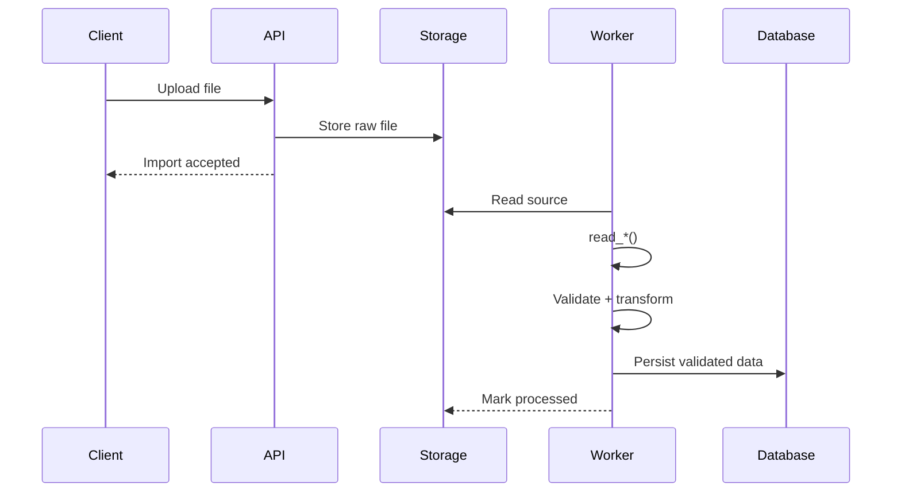

# 08- Read Functions

## Overview

Pandas provides a family of `read_*` functions for loading external data into `Series`, `DataFrame`, and related objects. These functions form the ingestion boundary between Pandas and systems such as CSV files, JSON documents, Excel workbooks, SQL databases, Parquet datasets, HTML tables, and other structured sources.

The most important principle is that reading data is not merely a file-loading operation. It is the point where an external representation becomes an internal DataFrame schema.

```text
External Source
      ↓
read_*()
      ↓
Raw DataFrame
      ↓
Schema Validation
      ↓
Type Normalization
      ↓
Data Quality Checks
      ↓
Transformations
```

A production engineer should treat the `read_*` layer as responsible for controlled ingestion:

```text
Source format
Encoding
Schema
Types
Missing values
Column selection
Resource usage
Error behavior
```

The exact `read_*` function depends on the source.

## Pandas Read Function Family

| Function | Primary source | Typical use |
|---|---|---|
| `read_csv()` | CSV / delimited text | File exchange and batch ingestion |
| `read_json()` | JSON | API exports and document-oriented input |
| `read_excel()` | Excel | Business/vendor spreadsheets |
| `read_parquet()` | Parquet | Analytical storage |
| `read_sql()` | SQL query/table | Relational database extraction |
| `read_sql_query()` | SQL query | Explicit database queries |
| `read_sql_table()` | SQL table | Table-oriented extraction |
| `read_html()` | HTML tables | Legacy/vendor/public table extraction |
| `read_fwf()` | Fixed-width text | Legacy mainframe/report formats |
| `read_clipboard()` | Clipboard text | Interactive/manual workflows |

The `read_*` family gives Pandas a common ingestion model while allowing source-specific options.

## The General Ingestion Contract

Most readers conceptually perform:

```text
Open source
    ↓
Decode / deserialize
    ↓
Interpret structure
    ↓
Infer or apply schema
    ↓
Construct DataFrame
    ↓
Return DataFrame
```

For example:

```python
import pandas as pd

orders = pd.read_csv(
    "orders.csv",
)
```

The function reads the external representation and constructs a DataFrame.

The resulting object is not automatically guaranteed to be:

```text
Correct
Complete
Validated
Business-safe
```

Those are separate responsibilities.

## Choosing the Correct Reader

A practical decision table:

| Source | Preferred reader |
|---|---|
| CSV | `pd.read_csv()` |
| TSV / delimited text | `pd.read_csv(sep="\t")` |
| JSON records | `pd.read_json()` |
| Excel workbook | `pd.read_excel()` |
| Parquet | `pd.read_parquet()` |
| SQL database | `pd.read_sql_query()` / `pd.read_sql()` |
| HTML table | `pd.read_html()` |
| Fixed-width report | `pd.read_fwf()` |

The reader should match the source's actual structure rather than forcing unrelated formats into a generic parser.

## `read_csv()`

`read_csv()` is the most frequently used reader for text-based tabular data.

```python
import pandas as pd

orders = pd.read_csv(
    "data/raw/orders.csv",
)
```

It supports a wide range of production concerns:

```python
orders = pd.read_csv(
    "data/raw/orders.csv",
    usecols=[
        "order_id",
        "customer_id",
        "amount",
        "created_at",
    ],
    dtype={
        "order_id": "string",
        "customer_id": "string",
    },
    parse_dates=[
        "created_at",
    ],
)
```

This performs projection and type configuration during ingestion instead of loading an unnecessarily broad schema.

## `read_json()`

`read_json()` is useful when structured JSON can be represented directly as tabular records.

For example:

```json
[
  {
    "order_id": "ORD-1001",
    "customer_id": "C-101",
    "amount": 1250.0
  },
  {
    "order_id": "ORD-1002",
    "customer_id": "C-102",
    "amount": 890.5
  }
]
```

The data can be loaded with:

```python
orders = pd.read_json(
    "orders.json"
)
```

For nested API responses, `json_normalize()` is often more appropriate than treating the entire document as a flat table.

```python
orders = pd.json_normalize(
    payload["orders"]
)
```

Use `read_json()` when the JSON layout is compatible with its supported tabular orientations. Use `json_normalize()` when nested structures require explicit flattening.

## `read_excel()`

Excel ingestion is common in business workflows:

```python
orders = pd.read_excel(
    "monthly_orders.xlsx",
    sheet_name="Orders",
)
```

Useful controls include:

```python
orders = pd.read_excel(
    "monthly_orders.xlsx",
    sheet_name="Orders",
    usecols=[
        "Order ID",
        "Customer ID",
        "Amount",
    ],
)
```

Excel should generally be treated as an ingestion format rather than a canonical analytical storage format.

Production considerations include:

```text
Workbook size
Formula behavior
Multiple sheets
Merged cells
Manual edits
Date interpretation
Missing values
Engine dependencies
```

## `read_parquet()`

Parquet is a typed columnar format:

```python
orders = pd.read_parquet(
    "data/processed/orders.parquet",
)
```

It is especially effective for analytical workloads because column projection and other source-level optimizations can reduce unnecessary reads.

For example:

```python
orders = pd.read_parquet(
    "orders.parquet",
    columns=[
        "order_id",
        "amount",
        "created_at",
    ],
)
```

Compared with CSV, this can avoid parsing and materializing columns that are not needed.

## `read_sql()`

`read_sql()` provides a general database ingestion interface.

```python
orders = pd.read_sql(
    query,
    connection,
)
```

For explicit query-oriented code, `read_sql_query()` is often clearer:

```python
orders = pd.read_sql_query(
    query,
    connection,
)
```

When working with relational data, push appropriate filtering, projection, joins, and aggregation into SQL before the result reaches Pandas.

## `read_html()`

`read_html()` extracts HTML `<table>` elements:

```python
tables = pd.read_html(
    "report.html"
)

orders = tables[0]
```

The function returns a list of DataFrames because one document can contain multiple tables.

For production ingestion, validate the target table's structure rather than assuming that the first table is always correct.

## `read_fwf()`

Fixed-width files are common in legacy systems:

```text
ORD0001  C00001 0001250.00
ORD0002  C00002 0000890.50
```

Pandas can parse fixed-width formats:

```python
orders = pd.read_fwf(
    "orders.txt",
)
```

When field widths are known:

```python
orders = pd.read_fwf(
    "orders.txt",
    widths=[
        8,
        8,
        12,
    ],
    names=[
        "order_id",
        "customer_id",
        "amount",
    ],
)
```

This can be valuable when integrating with legacy ERP, banking, or mainframe exports.

## Common Reader Parameters

Many readers expose related concepts even though exact parameter names and capabilities differ.

| Concern | Typical parameter |
|---|---|
| Column selection | `usecols` / `columns` |
| Type control | `dtype` |
| Dates | `parse_dates` |
| Missing values | `na_values` |
| Row limits | `nrows` |
| Skipped rows | `skiprows` |
| Chunking | `chunksize` |
| Encoding | `encoding` |
| Compression | `compression` |
| Error handling | Reader-specific options |
| Header handling | `header`, `names` |

The correct configuration depends on the source format.

## Source-Level Projection

Projection means selecting only columns required by the pipeline.

For CSV:

```python
orders = pd.read_csv(
    "orders.csv",
    usecols=[
        "order_id",
        "customer_id",
        "amount",
    ],
)
```

For Parquet:

```python
orders = pd.read_parquet(
    "orders.parquet",
    columns=[
        "order_id",
        "customer_id",
        "amount",
    ],
)
```

For SQL:

```python
orders = pd.read_sql_query(
    """
    SELECT
        order_id,
        customer_id,
        amount
    FROM orders
    """,
    connection,
)
```

Projection should happen as close to the source as practical.

```text
Storage
 ↓
Required columns
 ↓
Pandas
```

is generally better than:

```text
Storage
 ↓
All columns
 ↓
Pandas
 ↓
Drop unused columns
```

## Type Control During Reading

Schema decisions should be explicit whenever the source contract is known.

```python
orders = pd.read_csv(
    "orders.csv",
    dtype={
        "order_id": "string",
        "customer_id": "string",
        "status": "string",
    },
)
```

This helps avoid unwanted inference such as:

```text
"000123"
    ↓
123
```

for identifiers.

Use semantic types rather than choosing dtypes solely based on how values look.

## Nullable Dtypes

When columns can contain missing values, nullable Pandas dtypes can be useful:

```python
orders = pd.read_csv(
    "orders.csv",
    dtype={
        "quantity": "Int64",
        "is_priority": "boolean",
        "customer_id": "string",
    },
)
```

This is preferable to relying on generic `object` storage when the logical type is known.

## Type Inference

Readers often infer dtypes when no explicit schema is provided.

For example:

```python
orders = pd.read_csv(
    "orders.csv"
)

print(orders.dtypes)
```

Inference is convenient, but external data can be ambiguous.

Examples:

```text
00123 → could be an ID
2026-09-10 → could be text or date
1.20 → could be numeric or a formatted business value
```

For stable production pipelines, explicit dtype configuration is preferable where practical.

## Datetime Parsing

Datetime columns should be normalized deliberately.

```python
orders = pd.read_csv(
    "orders.csv",
    parse_dates=[
        "created_at",
    ],
)
```

For unreliable external input:

```python
orders["created_at"] = pd.to_datetime(
    orders["created_at"],
    errors="coerce",
    utc=True,
)
```

Then validate:

```python
if orders["created_at"].isna().any():
    raise ValueError(
        "Invalid order timestamps detected"
    )
```

A parser successfully returning a DataFrame does not mean every date was valid.

## Missing-Value Configuration

Source systems frequently use custom missing markers:

```text
NULL
N/A
NA
-
unknown
```

For CSV:

```python
orders = pd.read_csv(
    "orders.csv",
    na_values=[
        "NULL",
        "N/A",
    ],
)
```

Do not convert arbitrary strings into missing values without verifying the source semantics.

## Header Configuration

A standard CSV:

```csv
order_id,amount,status
ORD-1001,1250.00,completed
```

can be read directly:

```python
orders = pd.read_csv(
    "orders.csv"
)
```

A file without a header requires an explicit schema:

```python
orders = pd.read_csv(
    "orders.csv",
    header=None,
    names=[
        "order_id",
        "amount",
        "status",
    ],
)
```

If headers are expected, validate them immediately.

## Row Skipping

Some source files contain metadata before the actual dataset:

```text
Generated by ERP
Report Date: 2026-09-10

order_id,amount
ORD-1001,1250.00
```

A reader can skip those rows:

```python
orders = pd.read_csv(
    "orders.csv",
    skiprows=3,
)
```

This should be used only when the source format is sufficiently stable.

## Row Limits

During exploration or debugging:

```python
sample = pd.read_csv(
    "orders.csv",
    nrows=10_000,
)
```

This is useful for:

```text
Schema inspection
Parser debugging
Performance experiments
Local development
```

It should not replace full production validation.

## Compression

Many readers handle compressed files:

```python
orders = pd.read_csv(
    "orders.csv.gz"
)
```

Compression can reduce:

```text
Disk usage
Network transfer
S3 storage cost
```

at the cost of additional CPU work.

For cloud ETL, compare:

```text
I/O savings
vs
CPU cost
vs
wall-clock latency
```

rather than assuming compression is always beneficial.

## Encoding

For text formats, explicitly configure encoding when the source contract requires it:

```python
orders = pd.read_csv(
    "orders.csv",
    encoding="utf-8",
)
```

Legacy systems may require:

```python
orders = pd.read_csv(
    "legacy.csv",
    encoding="cp1252",
)
```

Do not hide encoding problems by blindly decoding with an arbitrary fallback. The encoding is part of the input contract.

## Reading from File-Like Objects

Pandas readers can work with file-like objects.

```python
from io import BytesIO

import pandas as pd


def parse_csv_bytes(
    content: bytes,
) -> pd.DataFrame:
    return pd.read_csv(
        BytesIO(content),
        dtype={
            "order_id": "string",
        },
    )
```

This is useful for:

```text
FastAPI uploads
Django uploads
HTTP responses
S3 object streams
Unit tests
```

The application can control retrieval independently from parsing.

## Read Functions and APIs

For REST API integrations, the typical architecture is:

```text
HTTP Client
    ↓
Response
    ↓
JSON / CSV
    ↓
Pandas read function
    ↓
DataFrame
    ↓
Validation
```

For example:

```python
import io

import pandas as pd
import requests


response = requests.get(
    export_url,
    timeout=(5, 60),
)

response.raise_for_status()

orders = pd.read_csv(
    io.BytesIO(response.content),
)
```

Separate networking from parsing to control:

```text
Retries
Timeouts
Authentication
Metrics
Rate limiting
Caching
```

## Read Functions and SQL

SQL extraction follows a similar boundary:

```text
PostgreSQL
    ↓
SQL
    ↓
Result set
    ↓
Pandas
    ↓
DataFrame
```

A good query:

```python
orders = pd.read_sql_query(
    """
    SELECT
        order_id,
        customer_id,
        amount
    FROM orders
    WHERE status = %(status)s
    """,
    connection,
    params={
        "status": "completed",
    },
)
```

The source database should perform work that it can execute efficiently before sending results to Pandas.

## Read Functions and Parquet

Parquet is often the next stage after ingestion from weaker formats.

```text
CSV
 ↓
read_csv()
 ↓
Validation
 ↓
Transform
 ↓
to_parquet()
 ↓
S3
 ↓
read_parquet()
 ↓
Analytics
```

This architecture gives the raw exchange format and analytical storage format distinct responsibilities.

## Large-File Reading

A common mistake is assuming that every reader should return one giant DataFrame.

For CSV:

```python
for chunk in pd.read_csv(
    "orders.csv",
    chunksize=100_000,
):
    process_chunk(chunk)
```

This allows processing bounded portions of the source.

The same architectural principle applies to other data sources even when their APIs use different mechanisms.

## Chunked Processing

A chunk is a DataFrame representing one portion of the input.

```python
for chunk in pd.read_csv(
    "orders.csv",
    chunksize=100_000,
):
    normalized = normalize_orders(
        chunk
    )

    validate_orders(
        normalized
    )

    persist_batch(
        normalized
    )
```

Chunking is useful for:

```text
Memory control
Batch persistence
Incremental computation
Fault isolation
```

## Chunking Trade-Offs

Chunking reduces peak memory, but introduces more processing boundaries.

| Benefit | Cost |
|---|---|
| Lower peak memory | More iterations |
| Smaller write batches | More overhead |
| Failure isolation | More checkpoint logic |
| Incremental processing | Some operations are harder to combine |

Do not assume `chunksize=10_000` or `100_000` is universally optimal.

Benchmark using representative data.

## Reader Performance

Performance depends on more than DataFrame operations.

```text
Storage latency
      ↓
Network transfer
      ↓
Decompression
      ↓
Parsing
      ↓
Type conversion
      ↓
DataFrame construction
```

A slow ingestion pipeline may be bottlenecked by:

```text
S3
network
CPU
parser
memory
database
```

Measure each stage where possible.

## Predicate Pushdown

Some data formats support source-level filtering.

Parquet can support predicate pushdown depending on the engine and access path:

```text
Query condition
      ↓
Parquet metadata
      ↓
Skip irrelevant row groups
      ↓
Read only relevant data
```

CSV does not provide equivalent typed row-group metadata.

This is one reason Parquet becomes more valuable as datasets grow.

## Memory Usage

The file size does not determine the final DataFrame memory footprint.

For example:

```text
500 MB CSV
```

can result in a DataFrame using multiple gigabytes of memory.

Measure:

```python
memory_bytes = (
    orders
    .memory_usage(deep=True)
    .sum()
)

print(
    f"{memory_bytes / 1024**2:.1f} MB"
)
```

Use this information when sizing:

```text
Docker containers
Kubernetes pods
Celery workers
AWS batch jobs
```

## Avoiding Unnecessary Copies

A read operation already creates in-memory structures.

Avoid immediately creating redundant DataFrames:

```python
raw = pd.read_csv(
    "orders.csv"
)

working = raw.copy()

validated = working.copy()
```

unless those independent ownership boundaries are actually required.

Prefer clear transformations without unnecessary duplication.

## Schema Validation After Reading

Every important ingestion boundary should validate the returned DataFrame.

```python
expected_columns = [
    "order_id",
    "customer_id",
    "amount",
    "status",
]

if list(orders.columns) != expected_columns:
    raise ValueError(
        "Unexpected input schema"
    )
```

Then validate:

```text
Dtypes
Required columns
Nullability
Uniqueness
Allowed values
Value ranges
Row-count expectations
```

## Data Quality Checks

Example:

```python
required_columns = [
    "order_id",
    "customer_id",
    "amount",
]

if orders[required_columns].isna().any().any():
    raise ValueError(
        "Required values are missing"
    )

if orders["amount"].lt(0).any():
    raise ValueError(
        "Negative amounts detected"
    )

if orders["order_id"].duplicated().any():
    raise ValueError(
        "Duplicate order IDs detected"
    )
```

This protects downstream systems from bad source data.

## Empty Inputs

A reader can successfully produce an empty DataFrame.

```python
orders = pd.read_csv(
    "empty_or_header_only.csv"
)

if orders.empty:
    handle_empty_feed()
```

Do not automatically classify empty input as a failure.

Define whether:

```text
Empty file
Header-only file
Zero matching rows
```

are valid outcomes for the source.

## Read Functions in ETL Architecture

A strong ETL structure is:

```text
Source
   ↓
read_*()
   ↓
Raw DataFrame
   ↓
Normalize
   ↓
Validate
   ↓
Transform
   ↓
Persist
```

Avoid mixing all responsibilities into one large function.

For example:

```python
def ingest_orders(path):
    orders = read_orders(path)
    orders = normalize_orders(orders)
    validate_orders(orders)
    return orders
```

This makes the pipeline testable and maintainable.

## Production Read Function Wrapper

A wrapper can enforce project-wide ingestion rules:

```python
from pathlib import Path

import pandas as pd


EXPECTED_COLUMNS = [
    "order_id",
    "customer_id",
    "amount",
    "status",
]


def read_orders(
    path: Path,
) -> pd.DataFrame:
    orders = pd.read_csv(
        path,
        usecols=EXPECTED_COLUMNS,
        dtype={
            "order_id": "string",
            "customer_id": "string",
            "status": "string",
        },
    )

    if list(orders.columns) != EXPECTED_COLUMNS:
        raise ValueError(
            "Orders schema mismatch"
        )

    orders["amount"] = pd.to_numeric(
        orders["amount"],
        errors="coerce",
    )

    if orders["amount"].isna().any():
        raise ValueError(
            "Invalid order amount"
        )

    return orders
```

The reader wrapper becomes the controlled boundary between external data and the rest of the application.

## Error Handling

Reader failures should be classified rather than converted into generic errors.

Typical categories:

| Failure | Example | Response |
|---|---|---|
| Missing source | File not found | Operational handling |
| Network failure | Timeout | Retry if safe |
| Encoding failure | Invalid byte sequence | Source/configuration investigation |
| Parse failure | Malformed structure | Quarantine / alert |
| Schema failure | Missing column | Stop and investigate |
| Data-quality failure | Invalid amount | Reject or quarantine |
| Resource failure | Out of memory | Reduce projection/chunk/scale |

The correct response depends on whether the failure is transient or deterministic.

## Retry Considerations

Not all reader failures should be retried.

Appropriate candidates:

```text
HTTP timeout
Temporary network failure
Transient object-storage error
Temporary database connectivity failure
```

Poor candidates:

```text
Missing required column
Invalid encoding
Malformed source structure
Business validation failure
```

Retrying deterministic bad input wastes worker capacity and delays detection.

## Read Functions and Idempotency

A read operation is often the first step in an idempotent ETL workflow.

```text
Source artifact
      ↓
Stable source identity
      ↓
read_*()
      ↓
Validate
      ↓
Persist
```

Use source metadata such as:

```text
Object key
File name
ETag where applicable
Content hash
Batch ID
Watermark
```

to identify work that has already been processed.

## Source Provenance

Production pipelines should retain enough metadata to answer:

```text
Where did this DataFrame come from?
When was it retrieved?
Which parser configuration was used?
Which pipeline version processed it?
What schema was expected?
```

For example:

```python
ingestion_metadata = {
    "source": "vendor_orders.csv",
    "retrieved_at": retrieval_time,
    "pipeline_version": pipeline_version,
}
```

This becomes valuable during incident investigation.

## Security Considerations

Read functions can process untrusted input.

Potential risks include:

```text
Very large files
Malformed input
Unexpected columns
Malicious uploaded files
Sensitive data exposure
Resource exhaustion
Credential leakage
```

Mitigate with:

```text
Input-size limits
Authentication
Authorization
Schema validation
Sandboxed processing where appropriate
Memory limits
Timeouts
Secure temporary storage
```

Pandas itself should not be treated as a security sandbox.

## Backend Upload Pattern

A FastAPI endpoint might accept an uploaded CSV:

```python
from fastapi import FastAPI, UploadFile

import pandas as pd

app = FastAPI()


@app.post("/imports/orders")
async def import_orders(
    file: UploadFile,
):
    orders = pd.read_csv(
        file.file,
        dtype={
            "order_id": "string",
            "customer_id": "string",
        },
    )

    validate_orders(orders)

    enqueue_import(orders)

    return {
        "rows": len(orders),
    }
```

For production systems, the endpoint should usually avoid performing a potentially large Pandas workload synchronously.

A stronger design is:

```text
HTTP Upload
   ↓
Object Storage
   ↓
Celery / Queue
   ↓
Pandas Worker
   ↓
Validation
   ↓
Database / Parquet
```

## Asynchronous Ingestion

Large reader operations should often run outside request-serving processes.



This prevents a long parsing operation from consuming API worker capacity.

## Testing Read Functions

Reader logic should be tested using representative fixtures.

```python
from pathlib import Path

import pandas as pd


def test_read_orders() -> None:
    path = Path(
        "tests/fixtures/orders.csv"
    )

    orders = pd.read_csv(
        path,
        dtype={
            "order_id": "string",
            "customer_id": "string",
        },
    )

    assert list(orders.columns) == [
        "order_id",
        "customer_id",
        "amount",
        "status",
    ]

    assert orders["order_id"].dtype == "string"
```

Tests should also cover malformed and boundary cases.

## Reader Test Matrix

Useful fixture categories include:

```text
Valid file
Empty file
Header-only file
Missing column
Extra column
Duplicate key
Invalid number
Invalid datetime
Unexpected null
Malformed row
Alternate encoding
Quoted delimiter
Very large file
Compressed file
```

This makes reader behavior explicit and protects against regressions.

## Common Mistakes

### Trusting Type Inference

Automatically inferred dtypes can be incorrect for identifiers, mixed values, and nullable columns.

**Better:** define important dtypes explicitly.

### Loading Every Column

```python
df = pd.read_csv(
    "orders.csv"
)
```

and dropping most columns afterward wastes parsing and memory.

**Better:** use `usecols` or source-side projection.

### Treating Parsing Success as Validation Success

A DataFrame can be created with an incorrect schema.

**Better:** validate columns, dtypes, required values, and business constraints.

### Using One Reader for Every Format

Different sources have different structural semantics.

**Better:** use the format-specific `read_*` function.

### Reading Huge Files in Request Handlers

This can block API workers and cause memory pressure.

**Better:** store the source and process asynchronously.

### Retrying Deterministic Parse Failures

Malformed input does not usually become valid after another retry.

**Better:** classify failures and retry only transient conditions.

### Assuming File Size Equals Memory Usage

Text and spreadsheet formats can expand substantially when loaded.

**Better:** measure actual DataFrame memory and size workers accordingly.

### Ignoring Empty Inputs

An empty feed may be either a valid business result or an operational failure.

**Better:** define the expected semantics explicitly.

### Converting All Read Data to `object`

Generic object storage loses type specificity and can increase memory usage.

**Better:** use intentional Pandas extension dtypes where appropriate.

### Mixing Retrieval, Parsing, Validation, and Persistence

A single large ingestion function is difficult to test and retry safely.

**Better:** separate source retrieval, `read_*`, normalization, validation, and persistence.

## Interview Traps

### What Is the Difference Between a `read_*` Function and Validation?

A reader converts external data into Pandas objects. Validation determines whether that resulting data satisfies the expected schema and business rules.

### Why Should Projection Happen During Reading?

Reading only required columns reduces parsing work, memory consumption, network transfer, and downstream processing.

### Why Is Explicit `dtype` Important?

Type inference can misinterpret identifiers, nullable values, and mixed columns. Explicit dtypes make the internal schema more deterministic.

### When Should You Use `read_sql_query()` Instead of Loading a Whole Table?

When the pipeline needs filtering, projection, joins, aggregations, or other SQL-side operations before the data reaches Pandas.

### Why Is Parquet Often Better Than CSV for Repeated Reads?

Parquet is typed and columnar, allowing more efficient storage access and avoiding repeated text parsing.

### How Do You Read a Large CSV Without Loading It All?

Use:

```python
for chunk in pd.read_csv(
    "orders.csv",
    chunksize=100_000,
):
    process_chunk(chunk)
```

### Why Does `chunksize` Not Automatically Solve Every Large-Dataset Problem?

Some operations require global state or full-dataset visibility, such as certain joins, exact global sorting, and some statistical calculations.

### Why Should Read Logic Be Separate from HTTP Retrieval?

It allows independent control over timeouts, retries, authentication, caching, observability, and deterministic parser testing.

### What Should Happen When a Required Column Disappears?

Treat it as a schema-contract failure, stop or quarantine the affected batch, alert the owner, and retain enough source information to reproduce the issue.

### When Should Pandas Reading Move to Another Tool?

When dataset size, distributed processing requirements, concurrency, or workload complexity exceeds what a single in-memory Pandas process can handle efficiently.

## Production Read Pipeline

A production ingestion component can follow:

```text
Source
 ↓
Acquire safely
 ↓
read_*()
 ↓
Validate schema
 ↓
Normalize dtypes
 ↓
Validate data quality
 ↓
Transform
 ↓
Persist
 ↓
Record provenance
 ↓
Emit metrics
```

The `read_*` function should remain focused on converting source representation into a DataFrame rather than becoming the entire pipeline.

## Example Multi-Source Pipeline

A real reporting system may combine several readers:

```python
import pandas as pd


orders = pd.read_parquet(
    "data/processed/orders.parquet",
    columns=[
        "order_id",
        "customer_id",
        "amount",
    ],
)

customer_segments = pd.read_csv(
    "data/reference/customer_segments.csv",
    dtype={
        "customer_id": "string",
        "segment": "string",
    },
)

transactions = pd.read_sql_query(
    """
    SELECT
        transaction_id,
        order_id,
        settled_at
    FROM transactions
    WHERE settled_at >= %(start_date)s
    """,
    connection,
    params={
        "start_date": start_date,
    },
)

report = (
    orders
    .merge(
        customer_segments,
        on="customer_id",
        how="left",
        validate="many_to_one",
    )
    .merge(
        transactions,
        on="order_id",
        how="left",
        validate="one_to_many",
    )
)
```

This illustrates why understanding the entire `read_*` family matters: production pipelines frequently combine multiple input systems before transformation.

## Practical Decision Framework

When choosing a read strategy, ask:

```text
What is the source format?
        ↓
Can projection happen at the source?
        ↓
Can types be declared explicitly?
        ↓
Can the input exceed worker memory?
        ↓
Is source retrieval transient?
        ↓
What validation is required?
        ↓
Where should normalization happen?
        ↓
What durable format should be produced?
```

A senior implementation optimizes the entire data path rather than selecting a reader in isolation.

## Key Takeaways

- Pandas `read_*` functions form the ingestion boundary between external systems and DataFrames; choose the reader based on the source format and its structural semantics.
- Use source-level projection, explicit dtypes, controlled datetime parsing, encoding rules, and missing-value configuration to make ingestion deterministic and memory-efficient.
- A successful `read_*` call does not imply valid data; schema validation, type checks, data-quality rules, and business constraints must follow ingestion.
- Large or remote inputs require bounded resource usage, appropriate chunking, safe HTTP/database handling, asynchronous execution, and failure classification.
- Production pipelines should separate retrieval, reading, validation, transformation, and persistence while preserving provenance and maintaining idempotent, observable processing.