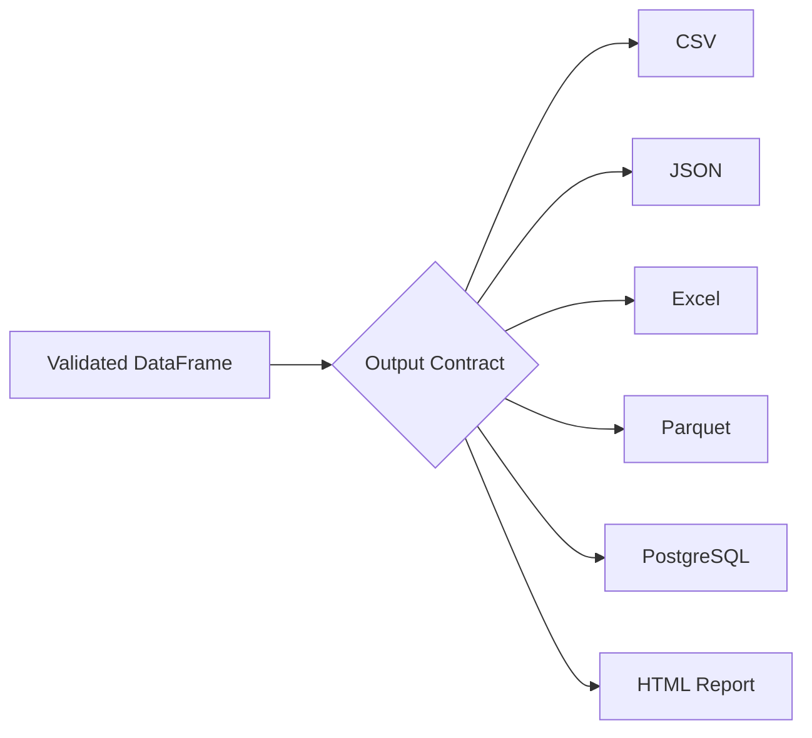
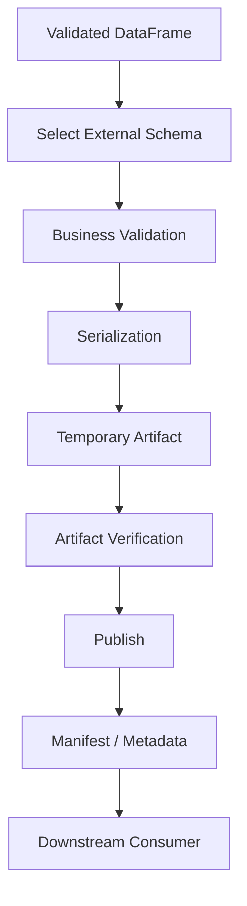

# 09- Write Functions

## Overview

Pandas write functions convert DataFrames and related objects into external representations such as CSV, JSON, Excel, Parquet, SQL tables, HTML, and other data formats.

The most important APIs in this area are:

```python
DataFrame.to_csv()
DataFrame.to_json()
DataFrame.to_excel()
DataFrame.to_parquet()
DataFrame.to_sql()
DataFrame.to_html()
```

Writing data is the inverse of reading it, but it is not merely serialization. A production write operation defines an external data contract:

```text
Validated DataFrame
        ↓
Schema / Type Decisions
        ↓
Serialization
        ↓
Output Storage
        ↓
Downstream Consumer
```

The output must have deliberate behavior for:

```text
Column names
Column ordering
Index
Dtypes
Missing values
Datetime representation
Numeric precision
Encoding
Compression
Atomicity
Idempotency
```

A senior engineer therefore treats output generation as an integration boundary rather than an incidental `to_*()` call.

## Pandas Write Function Family

| Function | Primary target | Typical use |
|---|---|---|
| `to_csv()` | CSV / delimited text | File exchange and batch exports |
| `to_json()` | JSON | APIs and machine-readable exports |
| `to_excel()` | Excel workbook | Business/vendor reports |
| `to_parquet()` | Parquet | Analytical storage |
| `to_sql()` | SQL database | Staging and batch persistence |
| `to_html()` | HTML table | Reports and web/email output |
| `to_records()` | NumPy records | Python/NumPy interoperability |
| `to_dict()` | Python dictionaries | API/service boundaries |
| `to_numpy()` | NumPy array | Numerical processing |

The correct writer depends on the consumer and the durability requirements.

## Data Export Architecture

A common production architecture is:



The same DataFrame can have different representations without implying that those representations are interchangeable.

For example:

```text
CSV → external exchange
Parquet → analytical storage
PostgreSQL → transactional persistence
JSON → API response
HTML → human-facing report
```

## General Write Principles

Before writing a DataFrame, establish:

```text
Who consumes the output?
What schema do they expect?
What is the durability requirement?
Can the operation be retried?
Can partial output be observed?
What is the expected volume?
Does ordering matter?
How are nulls represented?
How is the output versioned?
```

These questions matter more than memorizing individual `to_*()` parameters.

## `to_csv()`

`to_csv()` writes tabular data as comma-separated or otherwise delimited text.

```python
orders.to_csv(
    "data/output/orders.csv",
    index=False,
)
```

This is appropriate for:

- Data exchange.
- Batch exports.
- Vendor integrations.
- Human-readable extracts.
- Legacy system interfaces.
- SFTP workflows.

CSV is highly interoperable but has weak type semantics.

## `index=False`

The DataFrame index is often an implementation detail rather than a business field.

Prefer:

```python
orders.to_csv(
    "orders.csv",
    index=False,
)
```

unless the index itself is part of the output contract.

Without `index=False`, a generated file may contain an unexpected extra column representing the DataFrame index.

## CSV Schema Contract

A production CSV contract should define:

```text
Delimiter
Encoding
Header
Column names
Column order
Null representation
Date format
Numeric format
Quoting
Compression
```

For example:

```python
orders.to_csv(
    "orders.csv",
    index=False,
    sep=",",
    encoding="utf-8",
    lineterminator="\n",
)
```

The receiving system should not have to guess these properties.

## Delimited Output

`to_csv()` can produce other delimited text formats.

```python
orders.to_csv(
    "orders.tsv",
    sep="\t",
    index=False,
)
```

Or:

```python
orders.to_csv(
    "orders.txt",
    sep="|",
    index=False,
)
```

The file extension should correspond to the agreed format.

## CSV Encoding

UTF-8 is generally the best default for modern integrations:

```python
orders.to_csv(
    "orders.csv",
    index=False,
    encoding="utf-8",
)
```

Legacy consumers may require another encoding.

Encoding must be part of the contract because a syntactically valid file can still become unreadable to the consumer if the wrong encoding is used.

## Compression

Pandas can write compressed text:

```python
orders.to_csv(
    "orders.csv.gz",
    index=False,
    compression="gzip",
)
```

Compression can reduce:

```text
Storage size
Network transfer
S3 costs
SFTP transfer time
```

at the cost of additional CPU processing.

For batch exports, compare CPU and I/O costs rather than assuming compression is always optimal.

## CSV Append Mode

Appending is possible:

```python
orders.to_csv(
    "orders.csv",
    mode="a",
    header=False,
    index=False,
)
```

This is appropriate only when the file is intentionally append-oriented.

Appending creates operational challenges:

```text
Duplicate records
Concurrent writers
Partial batches
Ordering
Recovery
```

For reliable pipelines, immutable batch outputs are often easier to manage than one continuously appended file.

## Atomic File Publication

Avoid writing directly to a file that another process may consume.

Fragile:

```text
orders.csv
    ↓
Write 10 million rows
    ↓
Consumer reads file halfway through
```

Prefer:

```text
orders.csv.tmp
    ↓
Complete write
    ↓
Validation
    ↓
Publish / rename
    ↓
orders.csv
```

For local filesystems where atomic rename semantics apply, write to a temporary path and publish only after completion.

For object storage such as S3, write to a new object key and publish a manifest or completion marker.

## `to_json()`

`to_json()` serializes a DataFrame into JSON.

```python
payload = orders.to_json(
    orient="records"
)
```

This produces a JSON string rather than directly returning a Python object.

For example:

```python
[
  {"order_id":"ORD-1001","amount":1250.0},
  {"order_id":"ORD-1002","amount":890.5}
]
```

JSON output is useful for:

- APIs.
- Service integrations.
- JSON files.
- Event payload preparation.
- Configuration-like exports.

## JSON Orientations

The `orient` parameter determines the output structure.

| Orientation | Shape | Typical use |
|---|---|---|
| `records` | List of row dictionaries | REST APIs |
| `split` | Separate index/columns/data | Structured interchange |
| `index` | Mapping of index to row object | Index-oriented data |
| `columns` | Mapping of columns to index/value | Column-oriented representation |
| `values` | Matrix of values | Lightweight arrays |
| `table` | Schema + data | Structured interchange |

For APIs, `records` is often the most natural:

```python
payload = orders.to_json(
    orient="records"
)
```

## `to_dict()` for APIs

When the API framework expects Python-native objects, `to_dict()` is often preferable to serializing JSON manually:

```python
records = orders.to_dict(
    orient="records"
)
```

Then the framework can handle JSON encoding.

For FastAPI:

```python
from fastapi import FastAPI

app = FastAPI()


@app.get("/orders")
def get_orders():
    orders = build_orders()

    return orders.to_dict(
        orient="records"
    )
```

This avoids unnecessary:

```text
DataFrame
→ JSON string
→ JSON parser
→ Python object
→ JSON response
```

when the framework can serialize Python structures directly.

## JSON and Data Types

JSON has fewer native types than Pandas.

Potential information-loss areas include:

```text
Nullable values
Datetimes
Timezone information
Decimals
Categoricals
Indexes
```

For example, timestamps should have an explicit API contract:

```python
payload = orders.to_json(
    orient="records",
    date_format="iso",
)
```

For critical APIs, define the exact representation rather than relying on defaults.

## JSON API Boundary

A production flow is:

```text
DataFrame
   ↓
Select API fields
   ↓
Normalize types
   ↓
Convert to records
   ↓
API schema validation
   ↓
JSON serialization
   ↓
HTTP response
```

Avoid exposing an internal DataFrame schema directly as a public API contract.

## `to_excel()`

`to_excel()` writes a DataFrame to an Excel workbook.

```python
orders.to_excel(
    "reports/orders.xlsx",
    index=False,
)
```

Excel is useful when the consumer is human-oriented:

```text
Finance team
Operations team
Business analysts
Vendor workflows
Manual review
```

It is generally not the preferred machine-to-machine interchange format.

## Writing Multiple Sheets

Use an Excel writer to create multiple related sheets:

```python
with pd.ExcelWriter(
    "reports/monthly_orders.xlsx",
    engine="openpyxl",
) as writer:
    orders.to_excel(
        writer,
        sheet_name="Orders",
        index=False,
    )

    summary.to_excel(
        writer,
        sheet_name="Summary",
        index=False,
    )
```

The context manager ensures the workbook is finalized correctly.

## Excel Production Considerations

Excel output has practical constraints:

```text
Large workbook size
Formatting overhead
Manual edits
Formula behavior
Sheet limits
Consumer-specific expectations
```

For large datasets, prefer:

```text
Parquet
CSV
Database
```

and generate Excel only as a presentation layer.

## `to_parquet()`

`to_parquet()` writes a DataFrame using the Parquet columnar format.

```python
orders.to_parquet(
    "data/processed/orders.parquet",
    index=False,
)
```

Parquet is particularly useful for:

- Data lakes.
- Analytical storage.
- S3 datasets.
- Intermediate ETL artifacts.
- Repeated analytical reads.

## Why Parquet Is Different

CSV serializes values as text.

Parquet stores:

```text
Column data
+
Schema information
+
Metadata
+
Encoding/compression structures
```

This allows analytical engines to avoid reading unnecessary columns.

For example:

```python
orders.to_parquet(
    "orders.parquet",
    index=False,
)
```

followed later by:

```python
orders = pd.read_parquet(
    "orders.parquet",
    columns=[
        "order_id",
        "amount",
    ],
)
```

This is often more efficient than repeatedly parsing a large CSV.

## Parquet Compression

You can configure compression:

```python
orders.to_parquet(
    "orders.parquet",
    index=False,
    compression="snappy",
)
```

The best choice depends on:

```text
CPU budget
Storage cost
Read frequency
Interoperability
File size
```

For cloud analytical workloads, benchmark representative data instead of selecting a codec solely from theoretical compression ratios.

## Parquet Partitioning

For datasets stored in object storage, partitions can improve selective reads.

Conceptually:

```text
s3://analytics/orders/
    year=2026/
        month=08/
        month=09/
```

Partitioning should reflect common query filters.

Do not create excessively fine-grained partitions.

The small-files problem can become significant:

```text
Millions of tiny Parquet files
        ↓
Metadata overhead
+
Object-storage request overhead
+
Poor query performance
```

Partition design belongs to the broader storage architecture, not only the DataFrame writer call.

## `to_sql()`

`to_sql()` writes a DataFrame to a SQL database.

```python
orders.to_sql(
    "staging_orders",
    connection,
    if_exists="append",
    index=False,
)
```

This is useful for:

- Staging tables.
- Internal ETL.
- Moderate batch loads.
- Temporary analytical tables.
- Controlled data exports.

It does not replace proper database design.

## `if_exists`

Common behaviors:

| Value | Behavior | Risk |
|---|---|---|
| `fail` | Error if table exists | Low |
| `replace` | Drop and recreate | High |
| `append` | Add rows | Depends on idempotency |

Avoid:

```python
if_exists="replace"
```

for production tables unless replacement is explicitly the intended operation.

## SQL Write Transactions

Use a deliberate transaction boundary:

```python
from sqlalchemy import create_engine


engine = create_engine(
    database_url,
)

with engine.begin() as connection:
    orders.to_sql(
        "staging_orders",
        connection,
        if_exists="append",
        index=False,
        chunksize=10_000,
    )
```

A transaction should contain the database persistence operation without unnecessarily encompassing expensive Pandas transformations.

## SQL Write Chunking

For larger batches:

```python
orders.to_sql(
    "staging_orders",
    connection,
    if_exists="append",
    index=False,
    chunksize=10_000,
)
```

Chunk size influences:

```text
Memory
Network overhead
Transaction size
Database load
Failure unit
```

The optimal value must be benchmarked for the target database and workload.

## `method` for SQL Writes

`to_sql()` supports different insertion strategies through its `method` parameter.

A callable method can integrate custom bulk-insert logic when the standard behavior is insufficient.

For high-volume PostgreSQL ingestion, however, database-native loading such as `COPY` may be more appropriate than optimizing `to_sql()` indefinitely.

The correct decision depends on:

```text
Rows per batch
Write throughput
Upsert requirements
Constraints
Transaction semantics
Operational complexity
```

## SQL Staging Pattern

A common production architecture is:

```text
Pandas DataFrame
       ↓
staging_orders
       ↓
Validation / deduplication
       ↓
UPSERT / MERGE logic
       ↓
production_orders
```

This creates a controlled persistence boundary.

## Upserts

`to_sql()` should not be treated as a complete upsert abstraction.

For PostgreSQL, explicit SQL can implement conflict semantics:

```sql
INSERT INTO orders (
    order_id,
    customer_id,
    amount
)
VALUES
    (...)
ON CONFLICT (order_id)
DO UPDATE SET
    customer_id = EXCLUDED.customer_id,
    amount = EXCLUDED.amount;
```

Pandas can prepare the records, while the database enforces durable uniqueness and conflict behavior.

## Database Constraints Still Matter

Before writing:

```python
if orders["order_id"].duplicated().any():
    raise ValueError(
        "Duplicate order IDs detected"
    )
```

But the database should also enforce:

```sql
PRIMARY KEY
UNIQUE
NOT NULL
FOREIGN KEY
CHECK
```

Application-side validation reduces bad writes; database constraints protect durable state.

## `to_html()`

`to_html()` renders a DataFrame as an HTML table:

```python
html = orders.to_html(
    index=False,
)
```

This is useful for:

```text
Reports
Email fragments
Internal dashboards
Administrative tools
```

For substantial user-facing interfaces, use the web framework's template or frontend layer instead of treating the DataFrame HTML renderer as the entire application UI.

## Escaping HTML

When values can originate from external or user-controlled input:

```python
html = orders.to_html(
    index=False,
    escape=True,
)
```

HTML escaping helps prevent raw values from becoming executable markup.

This is especially important when the generated HTML is:

```text
Rendered in a browser
Embedded in an email
Inserted into another HTML document
```

## Output Formatting vs Data Semantics

A common mistake is modifying the DataFrame purely to make the exported representation look attractive.

Avoid:

```python
orders["amount"] = (
    orders["amount"]
    .map(lambda value: f"${value:,.2f}")
)
```

when `orders` is still needed for computation.

Prefer keeping:

```text
amount → numeric
```

and applying presentation formatting at export time.

For CSV:

```python
orders.to_csv(
    "orders.csv",
    index=False,
    float_format="%.2f",
)
```

For Excel or HTML, use the writer/presentation layer where appropriate.

## Exporting Selected Columns

Not every internal column belongs in the external output.

Prefer:

```python
export_columns = [
    "order_id",
    "customer_id",
    "amount",
    "status",
]

orders[export_columns].to_csv(
    "orders_export.csv",
    index=False,
)
```

This is useful for:

```text
Security
Data minimization
Stable contracts
Smaller files
API compatibility
```

Never export internal identifiers or sensitive fields simply because they exist in the DataFrame.

## Column Ordering

Pandas preserves column order.

For a stable external schema:

```python
export_columns = [
    "order_id",
    "customer_id",
    "status",
    "amount",
    "created_at",
]

export = orders.loc[
    :,
    export_columns,
]
```

This makes the output contract explicit.

Column ordering may matter for:

```text
Legacy import systems
Human-readable reports
Checksums
Diffs
Contract tests
```

## Renaming for External Contracts

Internal names and external names do not have to be identical.

```python
export = orders.rename(
    columns={
        "customer_id": "customerId",
        "created_at": "createdAt",
    }
)

export.to_json(
    "orders.json",
    orient="records",
)
```

Keep transformations at the integration boundary rather than changing the canonical internal DataFrame solely for one consumer.

## Missing Values During Export

Different formats represent missing data differently.

```text
CSV → textual null representation
JSON → null
Parquet → typed null
SQL → NULL
HTML → rendered missing cell
```

Do not assume all output formats preserve identical semantics.

Explicitly define the consumer contract.

## `na_rep`

For text-oriented output:

```python
orders.to_csv(
    "orders.csv",
    index=False,
    na_rep="",
)
```

or:

```python
orders.to_csv(
    "orders.csv",
    index=False,
    na_rep="NULL",
)
```

Choose the representation expected by the consumer.

Do not use a string marker that could be confused with a legitimate business value.

## Datetime Output

Machine-readable timestamps should use an unambiguous format.

For CSV:

```python
orders.to_csv(
    "orders.csv",
    index=False,
    date_format="%Y-%m-%dT%H:%M:%S%z",
)
```

For JSON:

```python
payload = orders.to_json(
    orient="records",
    date_format="iso",
)
```

Prefer UTC for distributed systems unless the business contract explicitly requires another timezone.

## Financial Values

Export precision must be deliberate.

Avoid relying on display formatting to correct an incorrectly represented value.

For example:

```python
orders.to_csv(
    "orders.csv",
    index=False,
    float_format="%.2f",
)
```

controls display precision but does not turn binary floating-point values into exact decimal arithmetic.

For financial systems, use appropriate source and transformation representations such as exact decimal values or integer minor units.

## Writing to S3

A common AWS pattern is:

```text
DataFrame
   ↓
Parquet
   ↓
S3 processed/
   ↓
Athena / Glue / downstream jobs
```

Example using an S3 URI:

```python
orders.to_parquet(
    "s3://analytics-bucket/orders/orders.parquet",
    index=False,
)
```

The runtime must have suitable S3 credentials and filesystem support configured.

For production:

```text
IAM least privilege
Encryption
Bucket policy
Object lifecycle
Versioning where appropriate
Observability
```

should be designed independently from the Pandas call.

## Local vs Object Storage

The output semantics differ.

| Target | Main concern |
|---|---|
| Local filesystem | Atomic publication and disk capacity |
| S3 | Object immutability/versioning and publication semantics |
| SFTP | Transfer completeness and remote compatibility |
| PostgreSQL | Transactions, constraints, connection capacity |
| API | Schema and latency |
| Excel | Human usability and workbook complexity |

A senior implementation adapts reliability guarantees to the destination.

## File Naming

Use deterministic and meaningful names.

For example:

```text
orders_2026-09-10.parquet
orders_2026-09-10.csv.gz
```

or a partitioned object layout:

```text
orders/year=2026/month=09/day=10/part-000.parquet
```

Avoid names that make replay and identification ambiguous.

## Versioned Output

For contract-sensitive exports, version the schema where necessary:

```text
orders-v1.csv
orders-v2.csv
```

or maintain version metadata in a manifest.

Versioning is particularly useful when:

```text
Columns change
Meaning changes
Null semantics change
Date formats change
Consumers have different migration schedules
```

Do not silently change a machine-facing file format while retaining the same contract identifier.

## Manifest Pattern

For batch exports, a manifest can record:

```text
Batch ID
File paths
Record counts
Schema version
Generation timestamp
Content hashes
Pipeline version
```

Conceptually:

```text
manifest.json
    ↓
orders_2026-09-10.parquet
orders_2026-09-10_part-02.parquet
orders_2026-09-10_part-03.parquet
```

This improves auditability and downstream completeness checks.

## Output Checksums

A content hash can help detect corruption or duplicate publication.

```python
import hashlib


def sha256_file(path: str) -> str:
    digest = hashlib.sha256()

    with open(path, "rb") as file:
        for chunk in iter(
            lambda: file.read(1024 * 1024),
            b"",
        ):
            digest.update(chunk)

    return digest.hexdigest()
```

Record checksums when downstream systems need reproducibility or integrity verification.

## Idempotent Exports

A recurring ETL job should not produce unexpected duplicates merely because it was retried.

A deterministic export identity might include:

```text
Dataset
Business date
Partition
Schema version
Pipeline version
```

Then:

```text
Already exists?
    ↓
Verify / skip / replace intentionally
```

The correct policy depends on whether outputs are immutable or replaceable.

## Immutability vs Replacement

| Strategy | Good for |
|---|---|
| Immutable batch files | Audit trails, replay, historical datasets |
| Replace partition | Recomputable daily aggregates |
| Upsert | Database state synchronization |
| Append | Event-like exports |
| Temporary + publish | Atomic file workflows |

Choose based on business semantics rather than convenience.

## Concurrency

Concurrent writers can corrupt logical output even when the underlying filesystem operations are technically valid.

Avoid:

```text
Worker A → orders.csv
Worker B → orders.csv
```

without coordination.

Prefer:

```text
Worker A → partition A
Worker B → partition B
```

or use a queue/locking/transaction mechanism appropriate to the destination.

## Celery and Batch Exports

Large exports should usually run asynchronously:

```text
API request
    ↓
Create export job
    ↓
Celery
    ↓
Query / DataFrame
    ↓
to_parquet() / to_csv()
    ↓
S3
    ↓
Completion metadata
```

Do not hold an HTTP request open while generating a large Excel workbook or CSV.

## Kubernetes Resource Planning

A write operation can temporarily require memory for:

```text
DataFrame
+
Serialization buffers
+
Compression buffers
+
Destination client buffers
```

A 1 GB output file does not imply a 1 GB memory requirement.

Size the worker using real measurements.

Monitor:

```text
RSS memory
CPU
I/O throughput
serialization duration
output size
```

## Performance Considerations

Writer performance depends on:

```text
DataFrame size
Column dtypes
Serialization format
Compression
Storage latency
Network throughput
Destination database
```

Typical tendencies:

```text
CSV
→ cheap/interoperable, expensive repeated parsing

JSON
→ flexible, verbose, often expensive

Excel
→ convenient, relatively heavy

Parquet
→ efficient analytical storage

SQL
→ governed by database and insertion strategy
```

The fastest writer is not universally the best writer.

## Avoiding Repeated Serialization

Do not serialize the same DataFrame repeatedly unless consumers genuinely require multiple formats:

```python
orders.to_csv(...)
orders.to_json(...)
orders.to_excel(...)
orders.to_parquet(...)
```

This multiplies CPU and I/O.

When multiple outputs are required, consider whether:

```text
one canonical persisted format
+
on-demand presentation exports
```

would better fit the architecture.

## Exporting Large DataFrames

For large outputs, consider:

```text
Partitioned Parquet
Chunked CSV
Database-native bulk loading
Multiple output files
Object storage
```

A single enormous output file can become difficult to:

```text
Transfer
Retry
Validate
Consume
Repair
```

## Testing Write Functions

Do not only test that a file exists.

Test the output contract.

```python
from pathlib import Path

import pandas as pd


def test_orders_csv_export(
    tmp_path: Path,
) -> None:
    orders = pd.DataFrame(
        {
            "order_id": pd.Series(
                ["ORD-1001"],
                dtype="string",
            ),
            "amount": [1250.00],
        }
    )

    path = tmp_path / "orders.csv"

    orders.to_csv(
        path,
        index=False,
    )

    exported = pd.read_csv(
        path,
        dtype={
            "order_id": "string",
        },
    )

    assert list(exported.columns) == [
        "order_id",
        "amount",
    ]

    assert exported["order_id"].iloc[0] == (
        "ORD-1001"
    )
```

The test verifies the consumer-facing structure rather than merely successful file creation.

## Round-Trip Testing

For formats where round-tripping is expected:

```python
orders.to_parquet(
    output_path,
    index=False,
)

loaded = pd.read_parquet(
    output_path,
)
```

Then validate:

```python
pd.testing.assert_frame_equal(
    orders,
    loaded,
)
```

Exact round trips may require explicit dtype and metadata considerations depending on the format.

## Contract Testing

For external integrations, test:

```text
Column names
Column order
Types
Null representation
Datetime representation
Required fields
Record count
File naming
Encoding
```

A file can be syntactically valid while violating the consumer contract.

## Output Data Quality

Validate before writing when possible:

```python
if orders["order_id"].isna().any():
    raise ValueError(
        "Cannot export orders without IDs"
    )

if orders["amount"].lt(0).any():
    raise ValueError(
        "Invalid order amounts"
    )
```

An invalid output should generally not be published.

## Write-Then-Validate vs Validate-Then-Publish

A robust file flow is:

```text
DataFrame
   ↓
Validate
   ↓
Write temporary output
   ↓
Validate artifact
   ↓
Publish
```

Artifact-level validation can include:

```text
File exists
File can be reopened
Expected row count
Expected columns
Checksum
Expected file size range
```

This catches serialization problems before publication.

## Reopen-and-Verify

For critical exports:

```python
orders.to_parquet(
    temp_path,
    index=False,
)

written = pd.read_parquet(
    temp_path,
)

if len(written) != len(orders):
    raise ValueError(
        "Output row count mismatch"
    )
```

This adds I/O cost, so reserve it for workflows where output integrity justifies the additional validation.

## Security Considerations

Write functions can leak sensitive information.

Before exporting:

```text
Identify sensitive columns
Remove unnecessary fields
Apply access controls
Encrypt transport
Encrypt storage
Protect temporary files
Avoid logging payloads
```

For example:

```python
safe_export = orders.drop(
    columns=[
        "internal_user_id",
        "payment_token",
    ],
    errors="ignore",
)
```

Data minimization should happen before serialization.

## CSV Formula Injection

CSV files opened in spreadsheet applications can interpret values beginning with certain characters as formulas.

Potentially dangerous values can originate from user input:

```text
=...
+...
-...
@...
```

When CSV is intended for spreadsheet consumption, assess formula-injection risk and apply an explicit export policy rather than assuming CSV is inert.

The correct mitigation depends on the consumer and organizational security requirements.

## Secrets and Logs

Never log complete output contents:

```python
logger.info(
    "export=%s data=%s",
    path,
    orders.to_dict("records"),
)
```

Prefer:

```python
logger.info(
    "orders_export_completed",
    extra={
        "rows": len(orders),
        "columns": len(orders.columns),
        "output": path,
    },
)
```

Operational metadata is normally more useful and safer.

## Access Control

An exported file can bypass database-level authorization if it is stored or distributed improperly.

For example:

```text
PostgreSQL row-level security
        ↓
Pandas
        ↓
Unrestricted S3 object
```

can accidentally broaden access.

The export layer must preserve the intended security boundary through:

```text
IAM
Bucket policies
Object ACL strategy
Signed URLs
Retention
Encryption
Application authorization
```

## Disaster Recovery

Critical exports should have a defined recovery strategy.

For durable datasets:

```text
Canonical source
      ↓
Validated DataFrame
      ↓
Immutable output
      ↓
Object storage
      ↓
Versioning / retention
```

For recomputable reports, the source data and pipeline version may be sufficient without retaining every derived artifact.

Choose retention based on:

```text
Compliance
Auditability
Recomputation cost
Storage cost
Business requirements
```

## Monitoring Write Pipelines

Track:

| Metric | Purpose |
|---|---|
| Export count | Throughput |
| Rows exported | Volume |
| Output bytes | Storage/network cost |
| Serialization duration | Performance |
| Compression duration | CPU impact |
| Write failures | Reliability |
| Retry count | Stability |
| Output validation failures | Data quality |
| Destination latency | Storage/database health |
| Processing lag | Freshness |

A successful task status alone is not sufficient observability.

## Operational Alerts

Useful alerts include:

```text
Export failed
Output row count unexpectedly low
Output row count unexpectedly high
Serialization time exceeded threshold
Output artifact missing
Validation failed
Repeated retries
Storage capacity near limit
Database write latency increased
```

Alert thresholds should be tied to expected workload characteristics.

## Common Mistakes

### Exporting the DataFrame Index

```python
df.to_csv("orders.csv")
```

may create an unintended extra column.

**Better:**

```python
df.to_csv(
    "orders.csv",
    index=False,
)
```

### Exporting Every Internal Column

This can expose sensitive or implementation-specific data.

**Better:** explicitly select the external schema.

### Using `to_json()` for an API When the Framework Can Serialize Records

Serializing to a JSON string and then parsing it again can create unnecessary work.

**Better:** use:

```python
df.to_dict(
    orient="records"
)
```

when the API framework accepts Python structures.

### Using Excel as an Analytical Storage Format

Excel is convenient for humans but unsuitable for many large, repeated analytical workloads.

**Better:** use Parquet, SQL, or object storage for canonical data.

### Using `to_sql(replace)` in Production

This can destroy existing table state.

**Better:** use staging tables and controlled persistence semantics.

### Assuming `to_sql()` Is a High-Throughput Bulk Loader

It is useful for many workloads but may not match database-native loaders at high volume.

**Better:** evaluate `COPY`, staging, and database-specific bulk strategies.

### Appending Without Idempotency

Retries can duplicate data.

**Better:** use immutable batch outputs, deterministic identities, database uniqueness, or controlled upserts.

### Writing Directly to the Final File

Consumers can observe incomplete output.

**Better:** write temporary output and publish after successful completion.

### Relying on Float Formatting for Financial Correctness

`float_format` changes presentation, not the underlying arithmetic semantics.

**Better:** use appropriate exact representations throughout the pipeline.

### Serializing Huge DataFrames in API Requests

This can cause API latency and memory spikes.

**Better:** run large exports asynchronously through Celery or another job system.

### Rendering Huge HTML or Excel Reports

Large presentation artifacts are expensive and difficult to consume.

**Better:** paginate, aggregate, or provide structured downloads.

### Ignoring Output Compatibility

A file can be technically valid while breaking downstream consumers because of changed:

```text
Column names
Order
Null handling
Date formats
Encoding
```

**Better:** maintain explicit output contracts and contract tests.

### Publishing Before Validation

Bad output can become durable and propagate downstream.

**Better:** validate the DataFrame and, for critical workflows, reopen and validate the generated artifact before publication.

## Interview Traps

### What Is the Difference Between `to_csv()` and `to_parquet()`?

`to_csv()` produces textual, weakly typed, highly interoperable output. `to_parquet()` produces typed columnar storage optimized for analytical workloads and repeated selective reads.

### Why Is `index=False` Common for Exports?

Because the DataFrame index is often an internal labeling mechanism rather than a business field.

### When Would You Use `to_dict()` Instead of `to_json()`?

When an API framework can serialize Python-native objects directly. `to_dict(orient="records")` avoids an unnecessary JSON-string intermediate representation.

### Why Should Large Exports Be Asynchronous?

Serialization, compression, database extraction, and object-storage uploads can take longer than an HTTP request budget and consume significant worker resources.

### Why Is `to_sql()` Not Always the Best PostgreSQL Loader?

High-volume ingestion can benefit from database-native bulk-loading mechanisms such as `COPY`, particularly when throughput matters.

### How Do You Make File Exports Idempotent?

Use deterministic output identities, immutable partitions or controlled replacement, manifests, checksums, and downstream uniqueness semantics as appropriate.

### Why Should External Columns Be Selected Explicitly?

It prevents accidental exposure of internal fields and stabilizes the output schema as the internal DataFrame evolves.

### Why Should Output Be Written to a Temporary Path First?

It prevents consumers from observing partially written artifacts and creates a clear publication boundary.

### What Should Be Tested for an Export?

Test the actual contract:

```text
Schema
Columns
Types
Null representation
Row count
Format
Encoding
Round-trip behavior
Business constraints
```

### What Determines the Best Output Format?

The consumer and workload:

```text
API → JSON
Human report → Excel / HTML
External exchange → CSV
Analytical storage → Parquet
Relational persistence → SQL
```

### Why Can a Small Output File Still Require Significant Memory?

Serialization can require the DataFrame itself plus temporary buffers and compression state. Output size does not directly represent peak process memory.

## Production Export Pattern

A robust export pipeline can separate preparation from serialization:

```python
from pathlib import Path

import pandas as pd


EXPORT_COLUMNS = [
    "order_id",
    "customer_id",
    "amount",
    "status",
]


def prepare_order_export(
    orders: pd.DataFrame,
) -> pd.DataFrame:
    export = orders.loc[
        :,
        EXPORT_COLUMNS,
    ].copy()

    if export["order_id"].isna().any():
        raise ValueError(
            "Order IDs cannot be missing"
        )

    if export["order_id"].duplicated().any():
        raise ValueError(
            "Duplicate order IDs detected"
        )

    if export["amount"].lt(0).any():
        raise ValueError(
            "Negative order amounts detected"
        )

    return export


def write_order_export(
    orders: pd.DataFrame,
    output_path: Path,
) -> None:
    export = prepare_order_export(
        orders
    )

    temporary_path = output_path.with_suffix(
        output_path.suffix + ".tmp"
    )

    export.to_parquet(
        temporary_path,
        index=False,
    )

    written = pd.read_parquet(
        temporary_path
    )

    if len(written) != len(export):
        raise ValueError(
            "Export validation failed"
        )

    temporary_path.replace(
        output_path
    )
```

The design is intentionally staged:

```text
Select external schema
        ↓
Validate
        ↓
Serialize temporary artifact
        ↓
Verify
        ↓
Publish
```

## Multi-Destination Export

The same validated DataFrame can feed multiple destinations:

```python
export = prepare_order_export(
    orders
)

export.to_parquet(
    "orders.parquet",
    index=False,
)

export.to_csv(
    "orders.csv",
    index=False,
)

records = export.to_dict(
    orient="records"
)
```

This is appropriate when each representation has a distinct consumer.

Avoid doing this unnecessarily because each serialization incurs additional CPU and I/O.

## Recommended Output Architecture



This makes the output lifecycle explicit:

```text
prepare
→ validate
→ serialize
→ verify
→ publish
→ observe
```

## Key Takeaways

- Pandas `to_*()` functions are integration boundaries: choose the output format based on the consumer, workload, schema contract, and durability requirements.
- Explicitly control external columns, index behavior, dtypes, nulls, datetimes, encoding, precision, compression, and naming rather than relying on serialization defaults.
- For production files, prefer validate → temporary write → verify → publish, and design idempotent outputs so retries cannot silently create duplicates or partial artifacts.
- Use Parquet for analytical storage, CSV for broad interchange, JSON for service/API boundaries, SQL for relational persistence, and Excel/HTML primarily as human-facing presentation formats.
- Large exports should be asynchronous and observable, with resource-aware batching, secure storage, contract tests, and monitoring for output volume, latency, failures, and data-quality regressions.