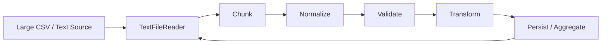
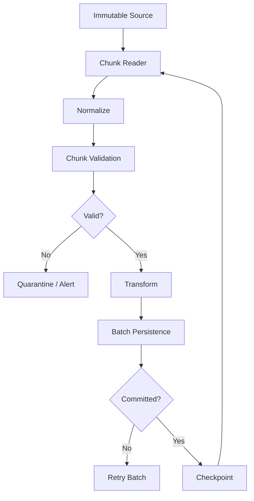

# 12- Chunked Reading

## Overview

Chunked reading allows Pandas to process a large input incrementally instead of materializing the entire dataset as one DataFrame.

The primary mechanism for CSV and similar readers is `chunksize`:

```python
for chunk in pd.read_csv(
    "orders.csv",
    chunksize=100_000,
):
    process_chunk(chunk)
```

Each iteration produces a bounded DataFrame:

```text
Large Input File
      ↓
 ┌───────────────┐
 │ Chunk 1       │ → process → persist
 ├───────────────┤
 │ Chunk 2       │ → process → persist
 ├───────────────┤
 │ Chunk 3       │ → process → persist
 └───────────────┘
```

The objective is not merely to make Pandas "use less memory." Chunking changes the execution model from:

```text
Entire dataset
    ↓
One large in-memory DataFrame
    ↓
Processing
```

to:

```text
Bounded batch
    ↓
Processing
    ↓
Persist / aggregate
    ↓
Next batch
```

This is particularly useful for ETL pipelines, scheduled jobs, imports, database extraction, object-storage processing, and other workloads where the source is larger than the available worker memory.

## Why Chunked Reading Exists

A CSV file can be much smaller on disk than the DataFrame it produces in memory.

For example:

```text
2 GB compressed CSV
        ↓
Parsing
        ↓
Potentially many GB of DataFrame memory
```

A worker with 4 GB or 8 GB of RAM may fail before processing finishes.

Chunking allows memory to be bounded approximately around:

```text
Input chunk
+
Transformation working set
+
Output buffers
+
Python process overhead
```

instead of the entire dataset.

The key benefit is bounded peak memory, not necessarily lower total CPU work.

## `chunksize`

The most common interface is:

```python
reader = pd.read_csv(
    "orders.csv",
    chunksize=100_000,
)
```

When `chunksize` is provided, Pandas returns an iterable `TextFileReader` rather than immediately returning one DataFrame.

You can iterate over it:

```python
for chunk in reader:
    process_chunk(chunk)
```

Each `chunk` is a DataFrame containing at most the configured number of rows.

## Basic Example

```python
import pandas as pd


for orders in pd.read_csv(
    "orders.csv",
    chunksize=100_000,
):
    print(
        f"Processing {len(orders)} rows"
    )

    process_orders(orders)
```

The final chunk may contain fewer rows than `chunksize`.

For example:

```text
Input rows = 250,000
chunksize = 100,000

Chunk 1 = 100,000
Chunk 2 = 100,000
Chunk 3 = 50,000
```

Do not assume every chunk has exactly the requested size.

## `TextFileReader`

With chunked CSV reading:

```python
reader = pd.read_csv(
    "orders.csv",
    chunksize=100_000,
)
```

`reader` is a `TextFileReader`.

It manages the incremental reading state:

```text
File position
    ↓
Read batch
    ↓
Return DataFrame
    ↓
Advance position
    ↓
Read next batch
```

The caller controls when each DataFrame is processed.

## Chunked Reading Architecture



This pattern is useful because the pipeline does not need to retain every processed batch.

## Memory Model

Without chunking:

```text
Input
 ↓
DataFrame
 ↓
Transformation intermediates
 ↓
Final result
```

Memory can grow with dataset size.

With chunking:

```text
Input
 ↓
Chunk
 ↓
Transformation
 ↓
Output
 ↓
Chunk released
 ↓
Next chunk
```

Peak memory is more closely related to chunk size and working-set size.

However, chunking does not guarantee constant memory if your code accumulates every chunk:

```python
chunks = []

for chunk in pd.read_csv(
    "orders.csv",
    chunksize=100_000,
):
    chunks.append(chunk)

orders = pd.concat(
    chunks,
)
```

This eventually recreates the original memory problem.

Chunking only helps when processed chunks are discarded, persisted, or reduced incrementally.

## Choosing a Chunk Size

There is no universally correct value.

Common starting points might be:

```text
10,000
50,000
100,000
500,000
1,000,000
```

The correct value depends on:

| Factor | Effect |
|---|---|
| Row width | Wider rows increase memory per chunk |
| Transformation complexity | More temporary memory |
| String columns | Higher memory overhead |
| CPU per row | Larger chunks can improve throughput |
| Database writes | Batch size affects write efficiency |
| Network latency | Larger batches can reduce round trips |
| Worker memory | Sets upper bound |
| Failure recovery | Larger chunks create larger retry units |

The correct approach is to benchmark representative workloads.

## Measuring Chunk Memory

Estimate actual chunk memory:

```python
for chunk in pd.read_csv(
    "orders.csv",
    chunksize=100_000,
):
    memory_bytes = (
        chunk
        .memory_usage(deep=True)
        .sum()
    )

    print(
        f"{memory_bytes / 1024**2:.1f} MB"
    )

    process_chunk(chunk)
```

`deep=True` is especially useful for object/string-heavy data.

## Chunk Size and Throughput

Very small chunks:

```text
10 rows
20 rows
50 rows
```

can create significant Python and I/O overhead.

Very large chunks:

```text
5 million rows
10 million rows
```

can approach the same memory pressure as loading the complete dataset.

A common optimization process is:

```text
Start conservatively
     ↓
Measure memory
     ↓
Measure throughput
     ↓
Increase chunk size
     ↓
Stop before memory pressure becomes unsafe
```

## Projection During Chunked Reading

Use `usecols` to reduce the size of every chunk:

```python
for orders in pd.read_csv(
    "orders.csv",
    chunksize=100_000,
    usecols=[
        "order_id",
        "customer_id",
        "amount",
    ],
):
    process_orders(orders)
```

This is often more valuable than trying to optimize the transformation afterward.

The principle is:

```text
Read less
→ process less
→ store less
```

## Dtypes During Chunked Reading

Define dtypes explicitly:

```python
for orders in pd.read_csv(
    "orders.csv",
    chunksize=100_000,
    dtype={
        "order_id": "string",
        "customer_id": "string",
        "quantity": "Int64",
        "status": "string",
    },
):
    process_orders(orders)
```

This keeps the schema stable across chunks.

Without explicit dtypes, inference can be influenced by the values observed in individual batches.

## Why Dtype Stability Matters

Suppose:

```text
Chunk A:
quantity = 1, 2, 3

Chunk B:
quantity = 4, missing, 6
```

Uncontrolled inference can produce different representations or force dtype changes when batches are combined.

A stable schema ensures:

```text
Chunk 1 → same schema
Chunk 2 → same schema
Chunk 3 → same schema
```

This is essential for:

```text
Aggregation
Concatenation
Validation
Database writes
Parquet output
```

## Parsing Dates in Chunks

Date parsing can happen during ingestion:

```python
for orders in pd.read_csv(
    "orders.csv",
    chunksize=100_000,
    parse_dates=["created_at"],
):
    process_orders(orders)
```

For unreliable input:

```python
for orders in pd.read_csv(
    "orders.csv",
    chunksize=100_000,
    dtype={
        "created_at": "string",
    },
):
    orders["created_at"] = pd.to_datetime(
        orders["created_at"],
        errors="coerce",
        utc=True,
    )

    process_orders(orders)
```

Validate conversion failures within each chunk rather than waiting until the entire file has been processed.

## Chunked Cleaning

Each chunk should go through the same normalization logic:

```python
def normalize_orders(
    orders: pd.DataFrame,
) -> pd.DataFrame:
    result = orders.copy()

    result["status"] = (
        result["status"]
        .astype("string")
        .str.strip()
        .str.lower()
    )

    result["amount"] = pd.to_numeric(
        result["amount"],
        errors="coerce",
    )

    return result
```

Then:

```python
for chunk in pd.read_csv(
    "orders.csv",
    chunksize=100_000,
    dtype={
        "order_id": "string",
        "customer_id": "string",
        "status": "string",
    },
):
    normalized = normalize_orders(
        chunk
    )

    process_chunk(normalized)
```

The function should behave consistently regardless of which chunk receives a particular row.

## Chunked Validation

Validation should happen before a chunk is persisted.

```python
def validate_orders(
    orders: pd.DataFrame,
) -> None:
    if orders["order_id"].isna().any():
        raise ValueError(
            "Missing order IDs"
        )

    if orders["amount"].isna().any():
        raise ValueError(
            "Invalid order amounts"
        )

    if orders["amount"].lt(0).any():
        raise ValueError(
            "Negative order amounts"
        )
```

Then:

```python
for chunk in pd.read_csv(
    "orders.csv",
    chunksize=100_000,
):
    normalized = normalize_orders(
        chunk
    )

    validate_orders(
        normalized
    )

    persist_batch(
        normalized
    )
```

## Chunked Aggregation

Chunking works particularly well when the target operation can be expressed as an incremental reduction.

For example, calculate total sales per customer:

```python
totals = {}

for chunk in pd.read_csv(
    "orders.csv",
    chunksize=100_000,
    usecols=[
        "customer_id",
        "amount",
    ],
    dtype={
        "customer_id": "string",
    },
):
    grouped = (
        chunk
        .groupby("customer_id")["amount"]
        .sum()
    )

    for customer_id, amount in grouped.items():
        totals[customer_id] = (
            totals.get(customer_id, 0.0)
            + amount
        )
```

This avoids retaining all raw rows.

For large-scale production workloads, consider whether the aggregation belongs in SQL, DuckDB, a warehouse, Spark, or another analytical engine instead.

## Better Incremental Aggregation

Using a Pandas DataFrame as the running state can keep the code more vectorized:

```python
running_totals = pd.Series(
    dtype="float64"
)

for chunk in pd.read_csv(
    "orders.csv",
    chunksize=100_000,
    usecols=[
        "customer_id",
        "amount",
    ],
    dtype={
        "customer_id": "string",
    },
):
    chunk_totals = (
        chunk
        .groupby("customer_id")["amount"]
        .sum()
    )

    running_totals = (
        running_totals
        .add(
            chunk_totals,
            fill_value=0,
        )
    )
```

This keeps aggregation in Pandas rather than introducing a Python loop over every record.

## Chunked Count

Counts are another natural incremental operation:

```python
total_rows = 0

for chunk in pd.read_csv(
    "orders.csv",
    chunksize=100_000,
):
    total_rows += len(chunk)
```

For grouped counts:

```python
status_counts = pd.Series(
    dtype="int64"
)

for chunk in pd.read_csv(
    "orders.csv",
    chunksize=100_000,
    usecols=["status"],
    dtype={"status": "string"},
):
    counts = chunk["status"].value_counts()

    status_counts = (
        status_counts
        .add(counts, fill_value=0)
    )
```

## Chunked Min and Max

Simple reductions combine naturally:

```python
minimum_amount = None
maximum_amount = None

for chunk in pd.read_csv(
    "orders.csv",
    chunksize=100_000,
    usecols=["amount"],
):
    chunk_min = chunk["amount"].min()
    chunk_max = chunk["amount"].max()

    if minimum_amount is None:
        minimum_amount = chunk_min
        maximum_amount = chunk_max
    else:
        minimum_amount = min(
            minimum_amount,
            chunk_min,
        )

        maximum_amount = max(
            maximum_amount,
            chunk_max,
        )
```

Some statistics require more sophisticated state than simply combining chunk results.

## Chunked Mean

A naive approach can be wrong:

```python
chunk_means = []

for chunk in pd.read_csv(
    "orders.csv",
    chunksize=100_000,
):
    chunk_means.append(
        chunk["amount"].mean()
    )

overall_mean = sum(chunk_means) / len(
    chunk_means
)
```

This weights every chunk equally, even when the chunks contain different numbers of valid records.

Use additive state:

```python
total = 0.0
count = 0

for chunk in pd.read_csv(
    "orders.csv",
    chunksize=100_000,
):
    values = chunk["amount"].dropna()

    total += values.sum()
    count += values.size

overall_mean = (
    total / count
    if count
    else None
)
```

Chunked computation requires understanding the mathematical properties of the operation.

## Associative and Incremental Operations

Operations that combine cleanly are particularly suitable for chunking.

Common examples:

```text
sum
count
min
max
```

More complex operations may require maintained state:

```text
mean
variance
distinct count
quantiles
```

Some operations are difficult or expensive to reproduce exactly from independent chunks:

```text
Global sort
Global ranking
Complex joins
Exact quantiles
Arbitrary rolling calculations
```

Do not assume:

```text
apply operation to each chunk
+
combine outputs
=
same result as full DataFrame
```

The operation must be decomposable correctly.

## Chunked Sorting

A global sort is not simply:

```python
for chunk in chunks:
    chunk.sort_values("created_at")
```

Each chunk becomes internally sorted, but the combined result is not globally sorted.

For true global sorting you generally need:

```text
External sorting
Database sorting
Distributed processing
Enough memory to combine results
```

Chunking alone does not eliminate the need for global state.

## Chunked Groupby Caveat

This:

```python
for chunk in chunks:
    chunk.groupby("customer_id").sum()
```

produces partial aggregates.

You must combine them:

```python
running = ...

for chunk in chunks:
    partial = ...
    running = running.add(
        partial,
        fill_value=0,
    )
```

Otherwise, customers appearing in multiple chunks will have incomplete totals.

## Chunked Joins

Joins can be more difficult.

Suppose:

```text
orders → large
customers → moderate
```

A useful architecture is:

```text
Load customer reference table
        ↓
Process orders chunk
        ↓
Merge chunk with customers
        ↓
Persist result
```

Example:

```python
customers = pd.read_parquet(
    "customers.parquet",
    columns=[
        "customer_id",
        "segment",
    ],
)

for orders in pd.read_csv(
    "orders.csv",
    chunksize=100_000,
    dtype={
        "customer_id": "string",
    },
):
    enriched = orders.merge(
        customers,
        on="customer_id",
        how="left",
        validate="many_to_one",
    )

    persist_batch(enriched)
```

This works when the reference dataset fits comfortably in memory.

## Large-to-Large Joins

If both sides are too large to fit in memory:

```text
Large orders
+
Large customers
```

chunking one side alone may not solve the problem.

The architecture may need:

```text
Database join
Distributed processing
Partitioned data
DuckDB
Spark
Warehouse
```

The correct solution depends on the dataset and workload.

## Chunked Processing with SQL

Large database queries can be processed in chunks:

```python
for chunk in pd.read_sql_query(
    query,
    connection,
    chunksize=100_000,
):
    process_chunk(chunk)
```

The database can still perform:

```text
Filtering
Projection
Joins
Aggregation
```

before data reaches Pandas.

This is often preferable to extracting the full raw table.

## Keyset Pagination with Chunks

For very large tables, a deterministic keyset boundary can be useful:

```sql
SELECT
    order_id,
    customer_id,
    amount
FROM orders
WHERE order_id > %(last_order_id)s
ORDER BY order_id
LIMIT %(batch_size)s;
```

Then:

```python
last_order_id = 0

while True:
    chunk = pd.read_sql_query(
        query,
        connection,
        params={
            "last_order_id": last_order_id,
            "batch_size": 100_000,
        },
    )

    if chunk.empty:
        break

    process_chunk(chunk)

    last_order_id = int(
        chunk["order_id"].max()
    )
```

This gives explicit control over batch boundaries.

## Chunked Writing

Read chunks and write them immediately when possible:

```python
for chunk in pd.read_csv(
    "orders.csv",
    chunksize=100_000,
):
    normalized = normalize_orders(
        chunk
    )

    validate_orders(
        normalized
    )

    normalized.to_parquet(
        output_path,
        index=False,
    )
```

However, writing multiple chunks to one Parquet file is not equivalent to appending arbitrary CSV rows to a file. Parquet is a structured file format and should generally be written using an engine/API that supports the intended dataset construction semantics.

A common approach is to write separate Parquet files:

```text
processed/
    part-000.parquet
    part-001.parquet
    part-002.parquet
```

or use a dataset-writing abstraction.

## Chunked CSV Output

Appending chunks to CSV is straightforward:

```python
first = True

for chunk in pd.read_csv(
    "orders.csv",
    chunksize=100_000,
):
    normalized = normalize_orders(
        chunk
    )

    normalized.to_csv(
        "processed_orders.csv",
        mode="w" if first else "a",
        header=first,
        index=False,
    )

    first = False
```

This avoids storing the full processed dataset.

The output strategy must still account for:

```text
Partial writes
Retries
Duplicate appends
Concurrent writers
Crash recovery
```

## Safer Batch Output

A more robust design is often:

```text
Input
 ↓
Chunk
 ↓
Validate
 ↓
Write immutable part
 ↓
Next chunk
 ↓
Manifest
```

Example:

```text
processed/
    batch_id=20260910/
        part-000.parquet
        part-001.parquet
        part-002.parquet
        manifest.json
```

This makes failure recovery and auditability easier.

## Incremental Persistence

A common production loop is:

```python
for chunk_id, chunk in enumerate(
    pd.read_csv(
        "orders.csv",
        chunksize=100_000,
    )
):
    normalized = normalize_orders(
        chunk
    )

    validate_orders(
        normalized
    )

    persist_batch(
        normalized,
        batch_id=chunk_id,
    )
```

Persisting each batch creates explicit failure boundaries.

If batch 17 fails:

```text
Batches 0–16 → already persisted
Batch 17      → retry
Batches 18+   → not yet processed
```

This is far easier to recover than a monolithic in-memory operation.

## Idempotency

Chunked jobs must be safe to retry.

A weak pattern:

```text
Read chunk
 ↓
Append rows
 ↓
Crash
 ↓
Retry chunk
 ↓
Duplicate rows
```

A stronger pattern uses deterministic batch identity:

```text
source file
+
chunk identifier
+
pipeline version
```

For example:

```text
orders_2026-09-10.csv
chunk=17
```

The persistence layer can record:

```text
source
batch_id
status
row_count
checksum
```

before considering the batch complete.

## Checkpointing

A checkpoint records the last successfully processed unit.

For file-based processing:

```text
chunk number
```

may be enough if the source is immutable.

For database processing:

```text
primary key
updated_at + primary key
```

may be preferable.

The checkpoint should advance only after successful persistence:

```text
Read
 ↓
Process
 ↓
Persist
 ↓
Commit
 ↓
Checkpoint
```

Never:

```text
Read
 ↓
Checkpoint
 ↓
Persist
```

because a failed persistence operation could permanently skip data.

## Failure Recovery

A robust chunked pipeline should define what happens when:

```text
Parsing fails
Validation fails
Database write fails
Worker crashes
Network request fails
Process is OOM-killed
```

For example:

```text
Transient database failure
→ retry batch

Schema failure
→ stop job + alert

Business validation failure
→ quarantine batch

Worker crash
→ resume from last completed batch
```

This is operationally more important than the exact `chunksize` value.

## Chunk-Level Transactions

For SQL persistence:

```text
Chunk
 ↓
Validate
 ↓
Begin transaction
 ↓
Write
 ↓
Commit
 ↓
Checkpoint
```

Do not keep one transaction open for the entire multi-gigabyte pipeline.

Large transactions can cause:

```text
Lock retention
Large WAL volume
Long recovery
Database contention
Resource pressure
```

Use batch-level transactions where appropriate.

## Chunking With Celery

A Celery-based architecture can represent chunks as independent tasks:

```text
Scheduler
   ↓
Ingestion Job
   ↓
Discover batches
   ↓
Celery tasks
   ├── chunk 0
   ├── chunk 1
   ├── chunk 2
   └── chunk 3
   ↓
Persist results
```

However, do not parallelize blindly.

Multiple workers can increase:

```text
Database connections
S3 requests
CPU
Memory
Source load
```

Concurrency must be matched to system capacity.

## Chunking With Kubernetes

For very large jobs, Kubernetes can isolate the worker:

```text
CronJob
   ↓
ETL Pod
   ↓
Read chunk
   ↓
Process
   ↓
Persist
```

Define resource limits:

```yaml
resources:
  requests:
    cpu: "500m"
    memory: "1Gi"
  limits:
    cpu: "2"
    memory: "4Gi"
```

The memory limit should be based on measured:

```text
Chunk memory
+
Transformation peak
+
Serialization buffers
+
Runtime overhead
```

not merely the source file size.

## Chunking and S3

A practical AWS workflow is:

```text
S3 raw/orders.csv
        ↓
ETL worker
        ↓
Pandas chunks
        ↓
S3 processed/
        ↓
Parquet dataset
```

For large files:

```text
Raw object remains immutable
```

while processed outputs can be written as partitioned objects.

This supports replay and independent downstream consumption.

## Chunking and Parquet

Chunking is often most useful before converting text data into Parquet:

```text
CSV
 ↓
Chunk
 ↓
Normalize
 ↓
Validate
 ↓
Parquet part
 ↓
S3
```

Once normalized into a well-designed Parquet dataset, later readers can exploit:

```text
Column projection
Compression
Predicate pushdown
Partitioning
```

depending on the consuming engine.

## Chunking and Kafka

Kafka is already partitioned and batch-oriented.

A consumer may naturally receive batches:

```text
Kafka partition
     ↓
Consumer poll
     ↓
Batch of events
     ↓
DataFrame
     ↓
Pandas processing
     ↓
Commit offset
```

Pandas chunking is therefore conceptually similar to bounded micro-batch processing, but Pandas is not a replacement for a streaming engine.

The important reliability ordering remains:

```text
Process
 ↓
Persist successfully
 ↓
Commit offset
```

when the sink and processing semantics require at-least-once handling.

## Chunking vs Streaming

Chunked reading is not the same as streaming.

| Chunked processing | Streaming |
|---|---|
| Bounded batches | Potentially continuous flow |
| Usually finite input | Unbounded input possible |
| Batch-oriented transformations | Event-time / stateful processing |
| Easy fit for ETL jobs | Requires stream processing architecture |
| Pandas is suitable for many workloads | Pandas is usually not the primary stream engine |

A large CSV import is a batch problem even if processed in chunks.

## Chunking vs Distributed Processing

Chunking:

```text
One process
+
Bounded batches
```

Distributed processing:

```text
Multiple workers
+
Partitioned data
+
Distributed coordination
```

Chunking helps when one machine can still process the dataset over time.

It does not solve requirements for:

```text
Distributed joins
Horizontal scale
High-throughput concurrent processing
Large shuffles
Petabyte-scale datasets
```

## When Chunking Is the Wrong Tool

Do not use Pandas chunking automatically.

Consider another approach when:

```text
Source is already a database
```

and SQL can perform the work more efficiently.

Or when:

```text
Data exceeds practical single-node limits
```

and a distributed engine is required.

Or when:

```text
The workload is latency-sensitive and continuously streaming
```

and a stream-processing architecture is more appropriate.

Chunking is a tactical execution strategy, not a universal scaling solution.

## Performance Optimization

A good chunked pipeline minimizes work per row and per batch.

Prefer:

```python
for chunk in pd.read_csv(
    "orders.csv",
    chunksize=100_000,
    usecols=[
        "customer_id",
        "amount",
        "status",
    ],
    dtype={
        "customer_id": "string",
        "status": "string",
    },
):
    chunk["status"] = (
        chunk["status"]
        .str.strip()
        .str.lower()
    )

    ...
```

over:

```python
for chunk in chunks:
    for row in chunk.itertuples():
        ...
```

Use vectorized operations inside each chunk.

## Avoid Accumulating Results

This defeats the purpose:

```python
results = []

for chunk in pd.read_csv(
    "orders.csv",
    chunksize=100_000,
):
    results.append(
        transform(chunk)
    )

result = pd.concat(
    results,
    ignore_index=True,
)
```

If the final DataFrame itself is too large for memory, concatenating all results will eventually reproduce the original problem.

Instead:

```text
Chunk
 ↓
Reduce
 ↓
Persist
 ↓
Discard
```

## Incremental Output vs Final DataFrame

Choose based on the required output.

If the final result is small:

```text
Large source
 ↓
Chunk processing
 ↓
Small aggregate
```

you can retain only the aggregate.

If the final output is also large:

```text
Large source
 ↓
Chunk processing
 ↓
Large output
```

persist the output incrementally rather than building one giant DataFrame.

## Backpressure

In a pipeline:

```text
Read
 ↓
Transform
 ↓
Write
```

the slowest stage determines throughput.

For example:

```text
CSV read:       500 MB/s
Pandas process: 300 MB/s
PostgreSQL:      50 MB/s
```

Increasing chunk size indefinitely will not solve the database bottleneck.

A useful mental model is:

```text
Source throughput
        ↓
Processing throughput
        ↓
Sink throughput
```

Optimize the constrained stage.

## Database Backpressure

If each chunk is persisted to PostgreSQL:

```text
Pandas
 ↓
10K-row write
 ↓
Database
```

the worker can eventually become limited by:

```text
INSERT throughput
Index maintenance
Constraints
Locks
WAL
Network latency
```

Use staging and database-native bulk loading when required.

Do not simply increase concurrency if PostgreSQL is already saturated.

## Retry Granularity

Chunk size affects retry cost.

Suppose:

```text
Chunk = 1,000 rows
```

and a failure occurs.

You retry:

```text
1,000 rows
```

With:

```text
Chunk = 1,000,000 rows
```

you may need to repeat a much more expensive operation.

Therefore chunk size is also a reliability parameter:

```text
Memory
+
Throughput
+
Failure/retry cost
```

all interact.

## Observability

Measure chunk-level metrics:

```python
import time


for chunk_id, chunk in enumerate(
    pd.read_csv(
        "orders.csv",
        chunksize=100_000,
    )
):
    started = time.perf_counter()

    process_chunk(chunk)

    duration = (
        time.perf_counter()
        - started
    )

    logger.info(
        "chunk_processed",
        extra={
            "chunk_id": chunk_id,
            "rows": len(chunk),
            "duration_seconds": duration,
        },
    )
```

Useful metrics include:

| Metric | Purpose |
|---|---|
| Chunk rows | Batch size validation |
| Chunk duration | Throughput |
| Rows/sec | Processing efficiency |
| Peak memory | Worker capacity |
| Failed chunks | Reliability |
| Retry count | Stability |
| Write latency | Sink performance |
| Source lag | Freshness |
| Cumulative rows | Progress |

## Progress Tracking

For long jobs, track:

```text
Chunks processed
Rows processed
Rows rejected
Elapsed time
Estimated remaining work
Current batch
```

This is particularly valuable for:

```text
Kubernetes Jobs
Celery tasks
AWS Batch
Scheduled ETL
```

A job that runs for several hours without progress information is difficult to operate.

## Data Quality at Chunk Boundaries

Some validation is local:

```text
Negative amount
Missing ID
Invalid status
```

Other checks require global state:

```text
Duplicate ID across chunks
Global uniqueness
Global row count
Cross-chunk relationships
```

For example, this does not detect duplicates across chunks:

```python
for chunk in chunks:
    if chunk["order_id"].duplicated().any():
        ...
```

A duplicate could occur in:

```text
Chunk 1 → ORD-1001
Chunk 9 → ORD-1001
```

To enforce global uniqueness, maintain state or enforce uniqueness at the sink.

For example:

```python
seen = set()

for chunk in pd.read_csv(
    "orders.csv",
    chunksize=100_000,
    dtype={
        "order_id": "string",
    },
):
    duplicates = chunk[
        chunk["order_id"].isin(seen)
    ]

    if not duplicates.empty:
        raise ValueError(
            "Duplicate order IDs across chunks"
        )

    seen.update(
        chunk["order_id"].dropna()
    )
```

For very large cardinalities, keeping every key in a Python set may itself become a memory problem. A database uniqueness constraint or external deduplication strategy may be more appropriate.

## Global State and Memory

Chunking reduces the raw DataFrame working set, but global state can still become large.

Examples:

```text
seen IDs
global distinct values
large reference tables
running join state
large aggregation state
```

Therefore:

```text
Chunking
≠
Unbounded memory elimination
```

The complete algorithm must have bounded or intentionally sized state.

## Testing Chunked Pipelines

Test both:

```text
Single chunk
Multiple chunks
```

The output should be equivalent where the operation is intended to be chunk-invariant.

For example:

```python
def process_file(path):
    outputs = []

    for chunk in pd.read_csv(
        path,
        chunksize=2,
    ):
        outputs.append(
            transform(chunk)
        )

    return pd.concat(
        outputs,
        ignore_index=True,
    )
```

Compare against a non-chunked reference on a small fixture:

```python
full = transform(
    pd.read_csv(path)
)

chunked = process_file(path)

pd.testing.assert_frame_equal(
    full.reset_index(drop=True),
    chunked.reset_index(drop=True),
)
```

This is useful for validating that the chunked algorithm preserves semantics.

## Testing Boundary Cases

Use test datasets where important records fall at chunk boundaries:

```text
Chunk 1 last row
Chunk 2 first row
```

Test:

```text
Duplicate keys across chunks
Group repeated across chunks
Missing values across chunks
Final partial chunk
Empty input
Exactly one chunk
Exactly two chunks
```

Boundary-focused tests catch errors that random fixtures often miss.

## Common Mistakes

### Choosing `chunksize` Arbitrarily

A value copied from another project may be inappropriate for the current row width and worker memory.

**Better:** benchmark representative data.

### Accumulating Every Chunk

```python
chunks.append(chunk)
```

eventually defeats chunking.

**Better:** reduce, persist, or discard chunks.

### Assuming Each Chunk Has Exactly `chunksize` Rows

The final chunk may be smaller.

**Better:** always use `len(chunk)`.

### Aggregating Each Chunk Without Combining Results

Partial group results are not automatically global results.

**Better:** maintain and merge incremental aggregate state.

### Assuming Chunk-Level Duplicate Checks Are Global

A duplicate can occur in different chunks.

**Better:** maintain appropriate global state or enforce uniqueness at the database layer.

### Assuming Chunking Makes Every Operation Possible

Global sorting, large joins, and some statistics still require global state.

**Better:** choose an execution strategy based on the operation's mathematical and data dependencies.

### Using Python Loops for Every Row

```python
for row in chunk.itertuples():
    ...
```

can eliminate much of Pandas' performance advantage.

**Better:** use vectorized transformations within each chunk.

### Increasing Chunk Size to Fix a Slow Sink

If PostgreSQL is the bottleneck, larger chunks may increase memory without materially increasing throughput.

**Better:** optimize the constrained stage.

### Retrying the Entire File After One Bad Chunk

This wastes work.

**Better:** design batch-level failure handling and checkpoints where appropriate.

### Advancing the Checkpoint Before Persistence

A crash after checkpointing but before writing can create skipped data.

**Better:** persist successfully first, then advance the checkpoint.

### Parallelizing Every Chunk

Unbounded concurrency can overload:

```text
Database
S3
CPU
Memory
Source system
```

**Better:** apply controlled concurrency and backpressure.

### Ignoring Global State

A set of millions of seen IDs can consume significant memory even when individual chunks are small.

**Better:** move high-cardinality global state to a durable or distributed mechanism when appropriate.

## Production Architecture

A robust chunked ETL workflow is:



The important ordering is:

```text
read
→ process
→ persist
→ commit
→ checkpoint
```

## Production Example

A practical implementation can keep responsibilities separate:

```python
from __future__ import annotations

from pathlib import Path

import pandas as pd


CHUNK_SIZE = 100_000


def normalize_orders(
    orders: pd.DataFrame,
) -> pd.DataFrame:
    result = orders.copy()

    result["order_id"] = (
        result["order_id"]
        .astype("string")
        .str.strip()
    )

    result["customer_id"] = (
        result["customer_id"]
        .astype("string")
        .str.strip()
    )

    result["status"] = (
        result["status"]
        .astype("string")
        .str.strip()
        .str.lower()
    )

    result["quantity"] = (
        pd.to_numeric(
            result["quantity"],
            errors="coerce",
        )
        .astype("Int64")
    )

    result["amount"] = pd.to_numeric(
        result["amount"],
        errors="coerce",
    )

    return result


def validate_orders(
    orders: pd.DataFrame,
) -> None:
    required = [
        "order_id",
        "customer_id",
        "quantity",
        "amount",
        "status",
    ]

    if orders[required].isna().any().any():
        raise ValueError(
            "Required fields contain invalid values"
        )

    if orders["quantity"].lt(0).any():
        raise ValueError(
            "Quantity cannot be negative"
        )

    if orders["amount"].lt(0).any():
        raise ValueError(
            "Amount cannot be negative"
        )

    allowed_statuses = {
        "pending",
        "completed",
        "cancelled",
    }

    if not set(
        orders["status"]
    ).issubset(allowed_statuses):
        raise ValueError(
            "Unexpected order status"
        )


def process_orders(
    source: Path,
) -> None:
    for chunk_id, chunk in enumerate(
        pd.read_csv(
            source,
            chunksize=CHUNK_SIZE,
            usecols=[
                "order_id",
                "customer_id",
                "quantity",
                "amount",
                "status",
            ],
            dtype={
                "order_id": "string",
                "customer_id": "string",
                "quantity": "Int64",
                "status": "string",
            },
        )
    ):
        normalized = normalize_orders(
            chunk
        )

        validate_orders(
            normalized
        )

        persist_batch(
            normalized,
            batch_id=chunk_id,
        )
```

The implementation separates:

```text
Reader
Normalization
Validation
Persistence
```

which makes each stage independently testable.

## Operational Checklist

```text
[ ] Is the source larger than practical worker memory?
[ ] Is chunking actually necessary?
[ ] Can SQL or another engine reduce the dataset before Pandas?
[ ] Is chunksize based on measurements?
[ ] Are only required columns read?
[ ] Are dtypes explicit?
[ ] Are parsing rules consistent across chunks?
[ ] Are transformations vectorized within each chunk?
[ ] Are local validation rules applied before persistence?
[ ] Are global validation requirements understood?
[ ] Are partial results persisted or reduced incrementally?
[ ] Is batch persistence idempotent?
[ ] Is the checkpoint advanced only after successful persistence?
[ ] Are chunk-level retries possible?
[ ] Is concurrency bounded?
[ ] Is downstream backpressure handled?
[ ] Are database connection and transaction limits respected?
[ ] Is peak memory measured under realistic load?
[ ] Are chunk processing metrics emitted?
[ ] Are malformed batches quarantined where appropriate?
[ ] Can processing resume after worker failure?
[ ] Is raw input retained for replay when required?
[ ] Is the final output validated?
[ ] Is Pandas still the right processing engine at the target scale?
```

## Interview Traps

### What Does `chunksize` Change?

It changes a reader from returning the entire dataset immediately to returning an iterator-like reader that yields DataFrames in bounded batches.

### Does Chunking Reduce Total Memory to Zero?

No. It reduces the DataFrame working set, but transformations, output buffers, reference datasets, and global state can still consume memory.

### What Happens to the Final Chunk?

It can contain fewer rows than the requested `chunksize`.

### Why Is Chunking Not Enough for a Global Sort?

Sorting each chunk only sorts within the chunk. A global sort requires coordination across all chunks.

### Why Can Chunked Groupby Produce Incorrect Results?

Because the same group can appear in multiple chunks. Partial aggregates must be combined to produce the global result.

### How Do You Handle Duplicates Across Chunks?

A local `duplicated()` check only detects duplicates within one chunk. Cross-chunk uniqueness requires maintained state or, preferably for durable keys, enforcement at the persistence layer.

### How Do You Choose `chunksize`?

Balance:

```text
Memory
Throughput
Transformation cost
Write batch size
Retry cost
```

and validate the choice with production-like benchmarks.

### When Should Chunking Be Replaced by SQL?

When the source is relational and the database can efficiently filter, project, join, or aggregate before data reaches Pandas.

### When Should Chunking Be Replaced by Spark or Another Distributed Engine?

When the dataset or workload exceeds practical single-node processing limits or requires distributed joins, shuffles, or horizontal scaling.

### How Should a Chunked ETL Job Handle Checkpoints?

Persist the current batch successfully, commit its transaction, then advance the checkpoint. This prevents a failed write from becoming an incorrectly acknowledged batch.

### Is Chunking the Same as Streaming?

No. Chunking is bounded batch processing. Streaming systems handle continuously arriving data and usually require different state, ordering, offset, and fault-tolerance semantics.

### Why Can Global State Break the Memory Benefits of Chunking?

A structure such as a Python set of all seen IDs can grow with the total dataset even though the individual DataFrames remain small.

### What Is the Best Failure Unit for a Large ETL Pipeline?

Usually a bounded, idempotent batch that can be retried independently without reprocessing the entire source.

## Key Takeaways

- Chunked reading bounds the DataFrame working set by processing input in batches, but it only provides memory benefits when processed chunks are reduced, persisted, or discarded rather than accumulated.
- `chunksize`, source-level projection, explicit dtypes, and vectorized per-chunk transformations should be designed together to control memory, throughput, and schema consistency.
- Chunking works naturally for incremental reductions such as sums, counts, minimums, and maximums, but global operations such as sorting, large joins, and some statistics require additional coordination or a different processing engine.
- Production chunked pipelines need batch-level idempotency, controlled concurrency, transaction boundaries, checkpoints after successful persistence, retryable failure units, and chunk-level observability.
- Chunking is a single-node scaling technique, not a substitute for SQL pushdown, analytical databases, DuckDB, Spark, or distributed processing when the dataset or workload exceeds Pandas' practical limits.