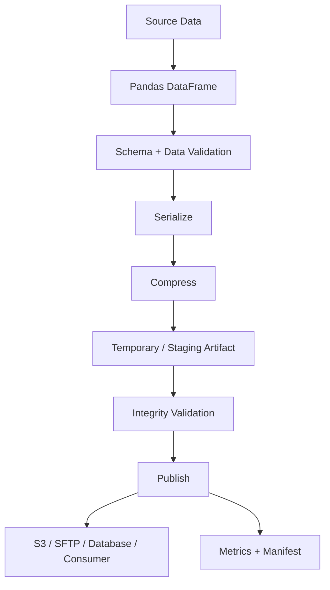

# 13- Compression

## Overview

Compression reduces the storage and transfer size of data produced or consumed by Pandas. In data-processing systems, compression is primarily an I/O and storage optimization rather than a DataFrame transformation.

The main trade-off is:

```text
Smaller data
   ↓
Less disk / network I/O
   ↓
More CPU for compression or decompression
```

Pandas supports compression for several common formats, particularly:

```text
CSV / text
Parquet
JSON
```

Compression decisions matter in:

- Batch ETL.
- S3-based data pipelines.
- SFTP integrations.
- Large CSV imports and exports.
- Parquet data lakes.
- API and service boundaries.
- Temporary processing artifacts.
- Backup and archival workflows.

The correct compression strategy depends on the complete pipeline:

```text
Source
  ↓
Transfer
  ↓
Decompression
  ↓
Parsing
  ↓
Transformation
  ↓
Compression
  ↓
Storage / Network
```

Optimizing only the file size can produce a slower or more expensive system if CPU becomes the bottleneck.

## Why Compression Matters

Large data pipelines are frequently constrained by I/O rather than pure computation.

Consider:

```text
Uncompressed CSV
     ↓
10 GB transfer
     ↓
10 GB storage
```

versus:

```text
Compressed CSV
     ↓
2 GB transfer
     ↓
2 GB storage
```

The compressed workflow may significantly reduce:

```text
Network transfer
Object-storage consumption
SFTP transfer time
Disk usage
Backup size
```

but requires CPU for compression and decompression.

The engineering objective is not:

```text
Maximum compression
```

but:

```text
Best total cost and performance for the workload
```

## Compression in the Data Path


Compression usually happens outside the logical DataFrame transformation itself.

For example:

```python
orders.to_csv(
    "orders.csv.gz",
    index=False,
    compression="gzip",
)
```

The DataFrame remains uncompressed in memory while the serialized output is compressed.

## Common Compression Formats

| Format | Typical use | Strengths | Considerations |
|---|---|---|---|
| `gzip` | CSV, text, JSON | Broad compatibility | Moderate CPU cost, generally single-stream |
| `bz2` | Text archives | Strong compression | Slower compression/decompression |
| `xz` | Archival text | High compression ratio | Higher CPU cost |
| `zip` | Bundled files | Widely supported | Archive/container semantics |
| `zstd` | Modern analytical pipelines | Strong speed/ratio trade-off | Tooling support varies by environment |
| `snappy` | Parquet | Fast analytical compression | Lower compression ratio than some codecs |

Not every format supports every codec through every Pandas I/O API. The storage format and installed engine determine which combinations are available.

## `compression` Parameter

Many Pandas readers and writers expose a `compression` argument.

For example:

```python
orders = pd.read_csv(
    "orders.csv.gz",
    compression="gzip",
)
```

Writing:

```python
orders.to_csv(
    "orders.csv.gz",
    index=False,
    compression="gzip",
)
```

This keeps compression configuration explicit.

In many cases Pandas can infer compression from a file extension, but explicit configuration can make integration contracts clearer.

## Automatic Compression Detection

For:

```python
orders = pd.read_csv(
    "orders.csv.gz"
)
```

Pandas can generally infer the gzip compression from the `.gz` suffix.

Likewise:

```python
orders.to_csv(
    "orders.csv.gz",
    index=False,
)
```

can use the file extension to determine the compression format.

Relying on extension-based inference is convenient, but explicit `compression=` can be preferable in production code where the format is part of a formal contract.

## Compression and File Extensions

Use file extensions that correctly communicate the physical format:

```text
orders.csv
orders.csv.gz
orders.json.gz
orders.parquet
```

Avoid ambiguous names such as:

```text
orders.data
```

when downstream systems need to determine how to decode the artifact.

The filename is part of the operational interface.

## Reading Compressed CSV

A standard workflow:

```python
import pandas as pd

orders = pd.read_csv(
    "orders.csv.gz",
)
```

For explicit configuration:

```python
orders = pd.read_csv(
    "orders.csv.gz",
    compression="gzip",
)
```

The decompressed contents are parsed into a DataFrame.

## Writing Compressed CSV

```python
orders.to_csv(
    "orders.csv.gz",
    index=False,
    compression="gzip",
)
```

This is particularly useful for:

```text
S3 exports
SFTP feeds
Long-term text exchange
Large operational reports
```

CSV compression often produces substantial storage and network savings because CSV contains a large amount of repeated textual structure.

## Compression and CSV

CSV is especially compressible because it contains repeated:

```text
Column names
Delimiters
String values
Formatting characters
```

A typical flow is:

```text
DataFrame
   ↓
CSV serialization
   ↓
gzip
   ↓
orders.csv.gz
```

For data exchange, compressed CSV is often a practical compromise between:

```text
Human-readable structure
+
Reduced transfer size
```

## Compression and JSON

JSON is also text-heavy and therefore often compresses well.

```python
orders.to_json(
    "orders.json.gz",
    orient="records",
    compression="gzip",
)
```

Read:

```python
orders = pd.read_json(
    "orders.json.gz",
    compression="gzip",
)
```

This is useful for machine-to-machine exports where JSON is required but payload size matters.

For REST APIs, HTTP compression is usually handled at the HTTP layer rather than by manually writing `.gz` files.

## HTTP Compression

A backend API can use HTTP content encoding:

```text
Client
  ↓
Accept-Encoding: gzip
  ↓
Nginx / application
  ↓
Compressed HTTP response
```

This differs from storing a `.json.gz` artifact.

For APIs built with Django or FastAPI, HTTP middleware/proxy configuration is typically the appropriate layer for response compression.

Do not manually compress a JSON string inside a DataFrame pipeline merely to solve an HTTP transport problem.

## Compression and Excel

Excel workbooks are already package/container formats with internal compression characteristics.

Do not generally wrap `.xlsx` in gzip simply because compression exists elsewhere in the pipeline.

Prefer:

```text
.xlsx
```

for the actual Excel artifact unless a specific transport layer requires additional compression.

## Compression and Parquet

Parquet is different from CSV because compression is typically integrated into the columnar file format.

Example:

```python
orders.to_parquet(
    "orders.parquet",
    index=False,
    compression="snappy",
)
```

Common codecs include:

```text
snappy
gzip
brotli
zstd
lz4
```

Support depends on the Parquet engine and environment.

## Why Parquet Compression Works Well

Parquet organizes values into columnar structures before compression:

```text
Rows
 ↓
Columns
 ↓
Encoding
 ↓
Compression
```

A column containing:

```text
completed
completed
pending
completed
```

is easier to compress efficiently than a row-oriented textual representation containing unrelated fields.

This is one reason Parquet is effective for analytical workloads.

## Parquet Compression Trade-Offs

| Codec | Typical characteristic | Good fit |
|---|---|---|
| Snappy | Fast, moderate compression | General analytics |
| Zstandard | Strong ratio and speed | Modern analytical storage |
| Gzip | Strong compression, slower | Storage-focused workloads |
| Brotli | Strong compression | Selected analytical workloads |
| LZ4 | Very fast | Low-latency workloads |

The optimal codec depends on:

```text
Read frequency
Write frequency
CPU availability
Storage cost
Network cost
Query engine
Dataset characteristics
```

Benchmark representative data.

## Compression Is Not the Same as Encryption

Compression:

```text
reduces size
```

Encryption:

```text
protects confidentiality
```

Do not confuse:

```text
gzip
```

with:

```text
encryption
```

A compressed CSV containing sensitive data is still sensitive.

For S3 and other storage systems, use appropriate encryption mechanisms separately.

## Compression and S3

A common AWS pipeline is:

```text
Pandas
   ↓
Parquet + compression
   ↓
S3
   ↓
Athena / Glue / downstream jobs
```

Storage and network costs can be reduced by producing appropriately compressed objects.

For large datasets, consider:

```text
Compression
Partitioning
File sizing
Column projection
Lifecycle policies
```

together.

Compression alone cannot compensate for poor dataset layout.

## S3 Cost Considerations

Compression can reduce:

```text
Storage bytes
Data transfer
Request-adjacent data movement
```

but compression itself consumes CPU.

For cloud ETL, evaluate:

```text
Compute cost
+
Storage cost
+
Network cost
+
Query cost
```

rather than comparing compressed file sizes alone.

A codec that saves 20% storage but triples CPU time may be a poor choice for frequently rewritten data.

## Compression and SFTP

SFTP integrations commonly use:

```text
orders.csv.gz
```

because both sender and receiver can process the file without requiring a more specialized columnar format.

A typical flow:

```text
Pandas
 ↓
CSV
 ↓
gzip
 ↓
SFTP
 ↓
Remote system
```

Compressed transfer can be especially valuable when network bandwidth is limited.

## Compression and File Transfer Time

Approximate transfer time can be represented as:

```text
Transfer time ≈ compressed bytes / network throughput
```

For a bandwidth-constrained workload, compression can materially reduce elapsed time.

For a CPU-constrained worker, compression may instead increase end-to-end latency.

Always measure the complete pipeline.

## CPU vs I/O Trade-Off

Suppose:

```text
Uncompressed:
10 GB
200 MB/s network

Compressed:
3 GB
50 MB/s compression
200 MB/s network
```

The compressed data may still finish much earlier because the expensive network transfer shrinks.

But if compression takes:

```text
500 MB/s CPU
```

the trade-off changes again.

The correct decision requires a workload-specific benchmark.

## Compression Level

Some codecs support compression levels.

For gzip:

```python
orders.to_csv(
    "orders.csv.gz",
    index=False,
    compression={
        "method": "gzip",
        "compresslevel": 5,
    },
)
```

Higher compression levels generally trade more CPU time for smaller output.

A useful principle is:

```text
Frequently read
→ favor decompression speed

Rarely read / archive
→ favor storage efficiency
```

Do not use the maximum compression level by default.

## Compression and Parallelism

Compression can become a CPU bottleneck.

In Kubernetes:

```text
Worker
 ├── Pandas transformation
 └── Compression
```

may compete for the same CPU resources.

If the pipeline runs many concurrent workers:

```text
Worker 1 → compression
Worker 2 → compression
Worker 3 → compression
...
```

the cluster can become CPU-saturated even when storage and databases are healthy.

Monitor CPU utilization before increasing ETL concurrency.

## Compression and Memory

Compression does not automatically make the in-memory DataFrame smaller.

For example:

```text
2 GB compressed CSV
        ↓
DataFrame
        ↓
Several GB RAM
```

The compressed representation saves:

```text
disk
network
object storage
```

not necessarily DataFrame memory.

To control memory:

```text
Projection
Explicit dtypes
Chunking
Efficient transformations
```

are still required.

## Compression With Chunked Processing

For large files:

```python
for chunk in pd.read_csv(
    "orders.csv.gz",
    chunksize=100_000,
):
    process_chunk(chunk)
```

The worker still decompresses data as it is read.

This combines:

```text
Compressed storage
+
Bounded DataFrame memory
```

which is often a useful production pattern.

## Chunked Compressed Output

A large CSV can be written incrementally:

```python
first = True

for chunk in process_chunks():
    chunk.to_csv(
        "orders.csv.gz",
        mode="w" if first else "a",
        header=first,
        index=False,
        compression="gzip",
    )

    first = False
```

Be careful with append semantics and compressed streams. For reliability-critical exports, writing independent compressed parts can be easier to retry and publish safely:

```text
orders/
    part-000.csv.gz
    part-001.csv.gz
    part-002.csv.gz
```

## Compression and Atomicity

Compression adds another failure point to artifact creation.

A safer file workflow is:

```text
DataFrame
   ↓
Compress into temporary artifact
   ↓
Flush / close
   ↓
Validate
   ↓
Publish
```

Do not make a partially compressed file visible as the canonical output.

For local storage:

```text
temporary path
→ complete write
→ atomic rename
```

can provide a clear publication boundary.

## Compression and Parquet File Sizing

For Parquet datasets, compression interacts with file sizing.

Very small files create:

```text
Metadata overhead
Object-storage request overhead
Query planning overhead
```

Very large files can reduce:

```text
Parallelism
Failure isolation
Selective processing
```

Aim for file sizes appropriate to the query engine and storage architecture rather than maximizing compression into the fewest possible objects.

## Compression and Partitioning

Partitioning and compression solve different problems.

```text
Partitioning
→ reduces which data must be considered

Compression
→ reduces the size of data that is read/stored
```

For example:

```text
s3://analytics/orders/
    year=2026/
        month=09/
            part-000.parquet
```

A query for September can avoid unrelated partitions, while compression reduces the size of the selected files.

The two techniques work best together.

## Compression and Predicate Pushdown

Parquet readers can often skip irrelevant row groups using metadata:

```text
Query
 ↓
Partition pruning
 ↓
Row-group pruning
 ↓
Compressed column reads
```

Compression is therefore only one component of analytical read efficiency.

A badly partitioned dataset with excellent compression can still perform poorly.

## Compression and CSV vs Parquet

| Characteristic | Compressed CSV | Compressed Parquet |
|---|---|---|
| Human-readable after decompression | Yes | No |
| Schema metadata | Weak | Strong |
| Column projection | Limited | Strong |
| Compression scope | Whole serialized stream | Columnar structures |
| Repeated analytics | Less efficient | Strong |
| Interoperability | Very high | High |
| Typical use | Exchange | Analytical storage |

A strong architecture often uses:

```text
External CSV.gz
      ↓
Pandas ingestion
      ↓
Validation
      ↓
Compressed Parquet
      ↓
S3
```

## Compression and JSON vs Parquet

JSON is generally best for:

```text
API/service interchange
```

Parquet is generally better for:

```text
Analytical storage
```

Compressing JSON reduces size but does not turn it into a columnar analytical format.

Use the right representation for the workload.

## Compression and Temporary Files

Pipelines may create:

```text
raw.csv
raw.csv.gz
processed.parquet
```

during processing.

Track the lifecycle of temporary artifacts:

```text
Created
 ↓
Consumed
 ↓
No longer needed
 ↓
Deleted
```

On Kubernetes, local ephemeral storage is finite. Large temporary compressed and uncompressed files can exhaust pod storage.

## Temporary Storage on Kubernetes

For file-heavy ETL workers, monitor:

```text
ephemeral-storage
memory
CPU
```

A worker may have enough RAM but still fail because:

```text
/tmp
```

or the container filesystem is full.

Prefer streaming, object storage, or appropriately sized persistent storage when large intermediates are unavoidable.

## Compression and Disaster Recovery

Compression reduces the size of retained raw artifacts, which can lower archival storage costs.

For replayable pipelines:

```text
Raw compressed input
       ↓
Immutable storage
       ↓
Processing
       ↓
Derived data
```

Retaining compressed raw data can make historical replay economically practical.

However, compression does not replace:

```text
Object versioning
Checksums
Access control
Retention policies
Backup strategy
```

## Compression and Checksums

Hash the actual stored artifact when integrity verification is required.

For example:

```python
import hashlib


def sha256_file(path: str) -> str:
    digest = hashlib.sha256()

    with open(
        path,
        "rb",
    ) as file:
        for block in iter(
            lambda: file.read(1024 * 1024),
            b"",
        ):
            digest.update(block)

    return digest.hexdigest()
```

The checksum should be calculated after compression when the goal is to verify the exact stored artifact.

## Compression and Idempotency

A compressed artifact can still be duplicated.

For example:

```text
orders_2026-09-10.csv.gz
orders_2026-09-10_retry.csv.gz
```

may represent the same logical batch.

Use stable identities based on:

```text
Dataset
Partition
Business date
Batch ID
Source object
Content hash
```

rather than assuming different filenames mean different data.

## Compression and Data Integrity

Compression should be transparent to the logical dataset.

A useful test is:

```text
Original DataFrame
      ↓
Serialize + compress
      ↓
Decompress + parse
      ↓
Equivalent DataFrame
```

For example:

```python
orders.to_csv(
    output_path,
    index=False,
    compression="gzip",
)

reloaded = pd.read_csv(
    output_path,
)

pd.testing.assert_frame_equal(
    orders,
    reloaded,
)
```

For formats where exact dtype preservation matters, validate dtypes explicitly.

## Testing Compression

Test:

```text
Compression is readable
Expected codec is used
Output can be reopened
Expected row count is preserved
Expected schema is preserved
Missing values remain correct
Encoding remains correct
```

Example:

```python
def test_gzip_round_trip(tmp_path):
    output = tmp_path / "orders.csv.gz"

    orders.to_csv(
        output,
        index=False,
        compression="gzip",
    )

    loaded = pd.read_csv(
        output,
        dtype={
            "order_id": "string",
        },
    )

    assert len(loaded) == len(orders)
    assert list(loaded.columns) == list(
        orders.columns
    )
```

## Performance Benchmarking

Benchmark the full operation:

```python
from time import perf_counter

start = perf_counter()

orders.to_parquet(
    "orders.parquet",
    index=False,
    compression="zstd",
)

elapsed = perf_counter() - start

print(
    f"Write time: {elapsed:.2f}s"
)
```

Also measure:

```text
Output size
CPU utilization
Read time
Decompression time
Memory usage
Total pipeline time
```

A compression benchmark that measures only file size is incomplete.

## Benchmark Matrix

For a production workload, compare combinations such as:

| Format | Codec | Measure |
|---|---|---|
| CSV | none | write/read time, size |
| CSV | gzip | write/read time, size |
| Parquet | snappy | write/read time, size |
| Parquet | zstd | write/read time, size |
| Parquet | gzip | write/read time, size |

Use representative:

```text
Row count
String cardinality
Numeric distributions
Datetime columns
Missing values
Column width
```

Synthetic tiny datasets can produce misleading results.

## Compression Selection Strategy

A useful decision framework is:

```text
Is the data primarily for exchange?
       ↓
      Yes
       ↓
CSV + gzip may be appropriate

Is it analytical storage?
       ↓
      Yes
       ↓
Parquet + suitable codec

Is it a REST API?
       ↓
      Yes
       ↓
JSON + HTTP compression

Is it archival?
       ↓
      Yes
       ↓
High-compression format/codecs may be appropriate
```

Always verify compatibility with the downstream consumer.

## Compression and Data Contracts

Compression should be part of the interface contract when downstream systems depend on it.

For example:

```text
Dataset: orders
Format: CSV
Encoding: UTF-8
Delimiter: ,
Compression: gzip
Schema version: 3
```

This allows downstream systems to know exactly how to consume the artifact.

## Production Example

A practical S3-oriented export might look like:

```python
from pathlib import Path

import pandas as pd


def write_orders(
    orders: pd.DataFrame,
    output_path: Path,
) -> None:
    required = [
        "order_id",
        "customer_id",
        "amount",
        "status",
    ]

    export = orders.loc[
        :,
        required,
    ].copy()

    if export["order_id"].isna().any():
        raise ValueError(
            "Order IDs cannot be missing"
        )

    if export["order_id"].duplicated().any():
        raise ValueError(
            "Duplicate order IDs detected"
        )

    temporary_path = output_path.with_suffix(
        output_path.suffix + ".tmp"
    )

    export.to_csv(
        temporary_path,
        index=False,
        encoding="utf-8",
        compression="gzip",
    )

    reloaded = pd.read_csv(
        temporary_path,
        dtype={
            "order_id": "string",
            "customer_id": "string",
        },
    )

    if len(reloaded) != len(export):
        raise ValueError(
            "Export row-count mismatch"
        )

    temporary_path.replace(
        output_path
    )
```

For S3, the equivalent publication model would usually write a completed object to an intended key and record completion metadata rather than relying on local rename semantics.

## Production Architecture



This architecture separates:

```text
Data correctness
Serialization
Compression
Publication
Observability
```

rather than treating them as one operation.

## Common Mistakes

### Compressing Without Measuring

Choosing a codec because it produces the smallest file can increase CPU cost and total pipeline latency.

**Better:** benchmark size, CPU, read time, write time, and end-to-end latency.

### Assuming Compression Reduces DataFrame Memory

Compression affects serialized storage, not the logical in-memory DataFrame.

**Better:** use chunking, projection, and dtype optimization for memory control.

### Using Maximum Compression Everywhere

Maximum compression may significantly increase CPU consumption.

**Better:** choose a level appropriate to read/write frequency and infrastructure capacity.

### Compressing Excel Unnecessarily

Excel is already a packaged format.

**Better:** use the native `.xlsx` format unless a transport requirement justifies additional compression.

### Treating Compression as Encryption

A `.gz` file can be inspected after decompression.

**Better:** use encryption separately for confidentiality.

### Writing Partial Compressed Files to Final Locations

A consumer can encounter a truncated artifact.

**Better:** write to a temporary or staging destination and publish only after completion.

### Appending to Compressed Output Without Understanding Semantics

Repeated appends can complicate recovery, validation, and downstream compatibility.

**Better:** use immutable compressed parts or a controlled publication strategy for important pipelines.

### Ignoring CPU Saturation

Compression can become the bottleneck even when storage and databases are healthy.

**Better:** monitor CPU and benchmark concurrency.

### Creating Too Many Small Compressed Files

Compression does not eliminate object-storage and metadata overhead.

**Better:** design appropriate output file sizes and partitioning.

### Assuming Compression Solves Poor Data Layout

A badly partitioned dataset can remain slow even when highly compressed.

**Better:** combine partitioning, projection, predicate pushdown, and compression appropriately.

### Forgetting Raw Data Replay

If compressed input is discarded immediately, replay may become impossible after a transformation bug.

**Better:** retain immutable raw artifacts when audit and recovery requirements justify it.

### Logging Sensitive Compressed Data

Compression does not make raw data safe to expose in logs.

**Better:** log metadata such as object key, size, checksum, row count, and duration.

## Interview Traps

### Why Does Compression Improve Data Transfer Performance?

It reduces the number of bytes that must cross the network, potentially lowering transfer time when network bandwidth is the bottleneck.

### Does Compression Always Make a Pipeline Faster?

No. Compression consumes CPU. If CPU is already the bottleneck, compression can increase end-to-end latency.

### Why Does a Compressed CSV Still Require Large Memory in Pandas?

The compressed representation is expanded and parsed into in-memory DataFrame structures. File size and DataFrame memory are separate concerns.

### Why Is Parquet Usually Better Suited to Analytical Compression Than CSV?

Parquet organizes data by columns and can encode and compress those columns efficiently while preserving schema metadata and supporting selective reads.

### When Would You Choose CSV.gz Over Parquet?

When broad compatibility, human inspectability, or an external system explicitly requires CSV, while compression is needed to reduce transfer or storage costs.

### What Is the Difference Between File Compression and HTTP Compression?

File compression creates a compressed artifact such as `.csv.gz`. HTTP compression compresses response bodies during network transfer using mechanisms such as content encoding.

### Is Gzip an Encryption Mechanism?

No. Gzip only compresses data; it provides no confidentiality.

### Why Can Maximum Compression Be a Bad Production Choice?

It may increase CPU time more than the resulting storage or network savings justify.

### How Does Compression Interact With Parquet Partitioning?

Partitioning determines which files or partitions need to be read; compression reduces the size of the data within those selected files. They address different layers of query efficiency.

### What Should Be Benchmarked When Choosing a Codec?

At minimum:

```text
Output size
Write time
Read time
CPU usage
Memory usage
End-to-end pipeline latency
```

### Why Are Small Parquet Files a Problem Even When They Are Highly Compressed?

Each file still carries metadata and object-storage overhead, and excessive file counts can increase query planning and I/O costs.

### Should Large Compressed Exports Be Generated Inside an API Request?

Usually not. Large serialization and compression workloads can consume API worker resources.

Prefer asynchronous processing with Celery, Kubernetes Jobs, or another background execution mechanism.

## Operational Checklist

```text
[ ] Is compression actually beneficial for this workload?
[ ] Is the downstream consumer compatible with the codec?
[ ] Is the format appropriate for the use case?
[ ] Is compression part of the output contract?
[ ] Are file extensions correct?
[ ] Is CPU capacity sufficient for compression/decompression?
[ ] Is network bandwidth the actual bottleneck?
[ ] Is storage cost significant?
[ ] Is chunked processing required?
[ ] Are DataFrame memory requirements measured separately from file size?
[ ] Are Parquet compression and partitioning designed together?
[ ] Are file sizes appropriate for the query engine?
[ ] Are small-file problems being avoided?
[ ] Are large artifacts written through temporary/staging locations?
[ ] Are compressed outputs validated before publication?
[ ] Are checksums required?
[ ] Is processing idempotent?
[ ] Can a failed batch be retried independently?
[ ] Are raw compressed inputs retained for replay where necessary?
[ ] Are sensitive artifacts encrypted separately from compression?
[ ] Are CPU, I/O, latency, and output-size metrics monitored?
[ ] Is compression level based on workload measurements?
[ ] Is API response compression handled at the HTTP layer when appropriate?
```

## Key Takeaways

- Compression reduces serialized storage and transfer size but does not reduce the logical DataFrame's memory footprint; CPU, I/O, memory, and network costs must be evaluated together.
- Use compressed CSV for compatible exchange workflows and compressed Parquet for analytical storage, selecting codecs and compression levels based on measured workload characteristics.
- Compression, partitioning, and column projection solve different problems and should be designed together for cloud data platforms such as S3.
- Production pipelines should publish compressed artifacts atomically, validate outputs, support idempotent retries, monitor CPU and I/O behavior, and retain raw inputs when replay requirements justify the storage cost.
- Compression provides no security by itself; encryption, access control, retention, checksums, and sensitive-data handling remain separate production responsibilities.