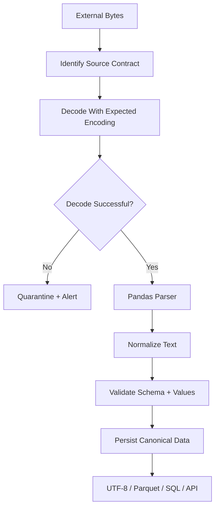

# 14- Encoding

## Overview

Encoding determines how textual bytes are converted into characters and how characters are converted back into bytes when Pandas reads or writes text-based data.

This becomes important whenever Pandas interacts with:

```text
CSV
JSON
HTML
Plain-text files
HTTP responses
SFTP files
Object storage
Legacy enterprise systems
```

A text-processing pipeline has two distinct representations:

```text
Bytes
  ↓
Decode using encoding
  ↓
Python / Pandas text
  ↓
DataFrame
  ↓
Serialize
  ↓
Encode using encoding
  ↓
Bytes
```

For modern systems, UTF-8 should generally be the default unless the source or consumer has an explicit different contract. Current Pandas documentation uses UTF-8 as the default encoding for `read_csv()` and exposes `encoding_errors` for controlling decode failures. :contentReference[oaicite:0]{index=0}

Encoding is not the same as:

```text
Compression
Encryption
File format
Delimiter
Schema
```

Each solves a different problem.

## Why Encoding Matters

A CSV file is ultimately a sequence of bytes. Those bytes need to be interpreted according to a character encoding.

For example, the text:

```text
München
```

must be represented as bytes and decoded consistently.

If a file is encoded using one charset but read using another, the result can be:

```text
UnicodeDecodeError
Corrupted characters
Incorrect customer names
Broken joins
Invalid reports
Downstream data-quality failures
```

Encoding errors can therefore become business-data errors rather than merely technical exceptions.

## Character Encoding Model

The complete flow is:

```text
Text
 ↓
Encoding
 ↓
Bytes
 ↓
Storage / Network
 ↓
Decoding
 ↓
Text
```

Pandas generally operates on decoded Python text after the underlying I/O layer interprets the source encoding.

For example:

```python
orders = pd.read_csv(
    "orders.csv",
    encoding="utf-8",
)
```

The important boundary is:

```text
External bytes
        ↓
Correct decoding
        ↓
Internal Unicode text
```

Once decoded correctly, Pandas string operations operate on the resulting text rather than on raw encoded bytes.

## Unicode vs Encoding

Unicode defines characters and their code points.

An encoding defines how those characters are represented as bytes.

Common encodings include:

| Encoding | Typical use |
|---|---|
| UTF-8 | Modern cross-platform systems |
| UTF-16 | Some Windows/system exports |
| UTF-32 | Specialized processing |
| CP1252 | Legacy Windows exports |
| Latin-1 / ISO-8859-1 | Legacy Western-European systems |
| ASCII | Restricted legacy/simple protocols |

A useful mental model is:

```text
Unicode character
    +
encoding
    ↓
bytes
```

The same text can therefore have different byte representations under different encodings.

## UTF-8

UTF-8 is generally the preferred encoding for new systems because it is:

- Unicode-compatible.
- Widely supported.
- Compatible with ASCII for ASCII characters.
- Well supported across Python, Pandas, databases, APIs, browsers, Linux, and cloud systems.

Use:

```python
orders = pd.read_csv(
    "orders.csv",
    encoding="utf-8",
)
```

For new exports:

```python
orders.to_csv(
    "orders.csv",
    index=False,
    encoding="utf-8",
)
```

Explicit configuration is useful when the encoding is part of an external contract.

## UTF-8 and ASCII Compatibility

UTF-8 preserves the same byte values as ASCII for ASCII characters.

Therefore:

```text
A
B
C
0
1
2
```

are represented compatibly.

Characters outside ASCII, such as:

```text
é
€
中
বাংলা
```

require multi-byte UTF-8 representations.

This makes UTF-8 suitable for internationalized datasets without maintaining separate regional encodings.

## Reading CSV with `encoding`

The most common example is:

```python
import pandas as pd

orders = pd.read_csv(
    "orders.csv",
    encoding="utf-8",
)
```

The `encoding` parameter tells the reader how to decode text input.

Current Pandas `read_csv()` documentation also supports reading from file paths, URLs, file-like objects, and object-storage URLs depending on the configured storage stack. :contentReference[oaicite:1]{index=1}

## Writing CSV with `encoding`

Use:

```python
orders.to_csv(
    "orders.csv",
    index=False,
    encoding="utf-8",
)
```

The writer encodes Pandas text values into bytes using the selected encoding.

The consumer must use a compatible decoding strategy.

## Encoding Must Be a Contract

A machine-to-machine file interface should define:

```text
Format
Delimiter
Encoding
Header
Column names
Date format
Null representation
Compression
Schema version
```

For example:

| Property | Contract |
|---|---|
| Format | CSV |
| Encoding | UTF-8 |
| Delimiter | `,` |
| Header | Required |
| Compression | gzip |
| Null | Empty field |
| Date format | UTC ISO-style timestamp |

A file being "CSV" does not tell the consumer which encoding to use.

## Detecting Encoding

Encoding detection is inherently less reliable than knowing the source contract.

A source may provide:

```text
UTF-8
UTF-8 with BOM
CP1252
Latin-1
```

Do not blindly guess encoding in critical pipelines.

A better hierarchy is:

```text
Documented source contract
        ↓
Known integration configuration
        ↓
Source metadata
        ↓
Controlled detection
        ↓
Manual investigation
```

Automatic detection can be useful for exploratory tooling, but production ingestion should prefer deterministic configuration.

## UTF-8 BOM

Some applications, particularly spreadsheet-oriented systems, produce UTF-8 files containing a Byte Order Mark.

The encoding can be handled explicitly:

```python
orders = pd.read_csv(
    "orders.csv",
    encoding="utf-8-sig",
)
```

`utf-8-sig` is useful when a UTF-8 BOM is present and should not become part of the first column name or first field.

For example, without handling the BOM correctly, a column may appear conceptually as:

```text
"\ufefforder_id"
```

instead of:

```text
"order_id"
```

This can break schema validation and column selection.

## BOM Detection

When debugging an unexpected first-column name:

```python
print(
    repr(orders.columns[0])
)
```

If the output contains:

```text
"\ufeff"
```

the source likely contains a BOM.

Prefer:

```python
encoding="utf-8-sig"
```

when the source contract identifies UTF-8 with a BOM.

## Legacy Windows Encoding

A common legacy source is CP1252:

```python
orders = pd.read_csv(
    "legacy_orders.csv",
    encoding="cp1252",
)
```

This can occur with exports generated by older Windows applications.

Do not assume that a file created on Windows is necessarily CP1252. The source application and documented export configuration are the better authority.

## Latin-1

Some older data feeds use Latin-1:

```python
orders = pd.read_csv(
    "orders.csv",
    encoding="latin-1",
)
```

Latin-1 has a useful technical property: every byte maps to a code point, so decoding errors are less likely.

That does **not** mean it is the correct encoding.

Using Latin-1 as a universal fallback can turn actual encoding problems into silently corrupted text.

## Why `latin-1` Can Hide Problems

Consider:

```python
orders = pd.read_csv(
    "unknown.csv",
    encoding="latin-1",
)
```

This may succeed even when the source was encoded differently.

The result can contain incorrect characters without raising an exception.

Therefore:

```text
No decode error
≠
Correct data
```

Use Latin-1 because the source contract requires it, not merely because it avoids errors.

## `encoding_errors`

Pandas exposes `encoding_errors` to control what happens when decoding encounters invalid byte sequences. The current default is `strict`. :contentReference[oaicite:2]{index=2}

Example:

```python
orders = pd.read_csv(
    "orders.csv",
    encoding="utf-8",
    encoding_errors="strict",
)
```

Strict decoding is generally the safest production default because malformed input becomes visible.

## Encoding Error Policies

Common Python error policies include:

| Policy | Behavior | Production concern |
|---|---|---|
| `strict` | Raise an error | Safest for data integrity |
| `ignore` | Drop invalid bytes | Can silently lose information |
| `replace` | Substitute replacement characters | Can corrupt business data |
| `backslashreplace` | Preserve invalid bytes as escapes | Useful for diagnostics |
| `surrogateescape` | Preserve invalid bytes using surrogate code points | Useful in some low-level workflows |

The exact usefulness depends on the ingestion scenario.

For critical ETL:

```python
encoding_errors="strict"
```

is usually preferable.

## Why `ignore` Is Dangerous

This:

```python
orders = pd.read_csv(
    "orders.csv",
    encoding="utf-8",
    encoding_errors="ignore",
)
```

may prevent a job from failing, but invalid bytes can disappear.

For customer names, addresses, transaction descriptions, or identifiers, that can create silent data corruption.

Prefer failing and quarantining the source rather than silently discarding unknown bytes.

## Why `replace` Is Also Risky

This can produce replacement characters:

```text
�
```

The pipeline continues, but the resulting value may no longer match:

```text
Reference data
Search indexes
Customer records
Join keys
Reporting values
```

Use replacement behavior primarily when data loss is explicitly acceptable.

## Encoding Error Handling Strategy

A production strategy is:

```text
Decode with expected encoding
        ↓
Strict failure
        ↓
Quarantine source
        ↓
Record metadata
        ↓
Investigate / correct contract
```

Do not turn deterministic source corruption into a successful pipeline merely to improve job completion rates.

## Reading with `open()`

Pandas can receive an already opened text stream:

```python
with open(
    "orders.csv",
    "r",
    encoding="utf-8",
) as file:
    orders = pd.read_csv(
        file
    )
```

This can be useful when application code needs to control:

```text
Text decoding
Resource lifecycle
File access
Authentication
Custom I/O behavior
```

However, avoid unnecessary layering when `read_csv()` can safely manage the file directly.

## Binary Streams and `BytesIO`

When working with downloaded bytes:

```python
from io import BytesIO

import pandas as pd


orders = pd.read_csv(
    BytesIO(response.content),
    encoding="utf-8",
)
```

The `BytesIO` approach is useful when the HTTP layer returns raw bytes and Pandas should perform decoding.

For large remote files, downloading the entire response into memory may be inappropriate. Prefer streaming or object-storage-based workflows when practical.

## HTTP Encoding

HTTP has its own content-encoding and character-encoding concepts.

These are different:

```text
Content-Encoding
→ compression, such as gzip

Character encoding
→ interpretation of text bytes, such as UTF-8
```

For example:

```text
HTTP response
  ↓
gzip decompression
  ↓
UTF-8 decoding
  ↓
CSV parser
  ↓
DataFrame
```

Do not confuse gzip compression with UTF-8 encoding.

## API Responses

REST APIs commonly return JSON encoded as UTF-8.

A robust workflow may be:

```text
HTTP response
      ↓
Content-Type / charset
      ↓
Decode
      ↓
JSON parser
      ↓
Pandas
```

For example:

```python
import requests
import pandas as pd


response = requests.get(
    api_url,
    timeout=(5, 30),
)

response.raise_for_status()

payload = response.json()

orders = pd.json_normalize(
    payload["orders"]
)
```

The HTTP library handles JSON decoding semantics rather than requiring `read_json()` for every API response.

## API Character Sets

HTTP responses may include charset information in the `Content-Type` header:

```text
Content-Type: application/json; charset=utf-8
```

For APIs, rely on the protocol/library semantics rather than hard-coding decoding logic when the client already handles the response correctly.

For downloadable CSV responses, explicitly verify the expected source encoding.

## S3 and Object Storage

Pandas can read files from object storage when the appropriate filesystem dependencies and credentials are configured.

For example:

```python
orders = pd.read_csv(
    "s3://raw-data/orders.csv",
    encoding="utf-8",
)
```

A production AWS pipeline should separate:

```text
S3 access
+
encoding contract
+
Pandas parsing
```

IAM determines whether the worker may access the object; `encoding` determines how its bytes are interpreted as text.

## Encoding and SFTP

Legacy SFTP integrations frequently transfer text files generated by older systems.

The architecture may be:

```text
Vendor system
    ↓
SFTP
    ↓
Raw file
    ↓
Encoding-aware Pandas read
    ↓
Normalized UTF-8 internal representation
    ↓
Parquet / PostgreSQL
```

Do not assume the transport protocol tells you the file encoding.

SFTP only transports the bytes.

## Normalizing Internal Encoding

Once text is successfully decoded, an internal pipeline can standardize its text representation.

For example:

```text
CP1252 source
     ↓
Decode
     ↓
Python Unicode
     ↓
UTF-8 output
```

This is usually easier to operate than allowing multiple regional encodings throughout the entire pipeline.

For new downstream interfaces:

```python
orders.to_csv(
    "normalized.csv",
    index=False,
    encoding="utf-8",
)
```

## Encoding and Database Storage

PostgreSQL deployments generally use Unicode-capable database encoding, but the application still has to decode source files correctly before insertion.

The flow is:

```text
CP1252 CSV
   ↓
Decode to Python text
   ↓
Pandas
   ↓
Database client
   ↓
PostgreSQL
```

If decoding is incorrect before the database write, a correctly configured database cannot recover the original characters.

## Encoding and Data Quality

Encoding problems can affect more than display.

For example:

```text
Customer A:
"José"

Customer B:
"Jose"
```

can behave differently in:

```text
Joins
Deduplication
Search
Grouping
Reporting
```

Normalization should therefore consider both:

```text
Encoding correctness
+
Text normalization rules
```

Do not assume that visually similar strings are byte-for-byte or code-point equivalent.

## Unicode Normalization

Some characters can have multiple Unicode representations.

Python provides `unicodedata.normalize()`:

```python
import unicodedata


def normalize_text(value: str) -> str:
    return unicodedata.normalize(
        "NFC",
        value.strip(),
    )
```

This is separate from character encoding.

```text
Encoding
→ bytes ↔ Unicode

Normalization
→ equivalent Unicode representations
```

Use Unicode normalization when the business domain requires consistent text comparison.

Do not apply aggressive normalization blindly because it can change semantics for some languages or identifiers.

## Case Normalization

Encoding correctness does not make textual comparison deterministic.

For statuses:

```python
orders["status"] = (
    orders["status"]
    .astype("string")
    .str.strip()
    .str.lower()
)
```

This addresses value normalization, not encoding.

Keep these concerns separate:

```text
Decode
→ Unicode text

Normalize
→ canonical textual representation

Validate
→ acceptable business value
```

## Encoding and Identifiers

Do not alter identifiers merely to simplify encoding.

For example:

```text
Å1001
```

should not automatically become:

```text
A1001
```

just because ASCII is easier to handle.

If a source system requires ASCII-only identifiers, that should be an explicit business or integration rule.

Encoding normalization and identifier normalization are different concerns.

## Reading Excel

Excel files are not simply raw text files.

When using:

```python
orders = pd.read_excel(
    "orders.xlsx",
)
```

you generally do not specify a text encoding in the same way as CSV because `.xlsx` is a structured binary/package format.

For legacy text-based spreadsheet exports, such as CSV generated from Excel:

```python
orders = pd.read_csv(
    "orders.csv",
    encoding="utf-8-sig",
)
```

may be relevant.

Choose settings based on the actual file format.

## Reading HTML

HTML documents can specify their character encoding through HTTP headers or document metadata.

When an HTML source contains tabular data:

```python
tables = pd.read_html(
    html,
)
```

the encoding issue usually belongs to the HTTP/file-decoding stage before Pandas interprets the table.

For manually downloaded bytes:

```text
HTTP bytes
 ↓
Decode correctly
 ↓
HTML text
 ↓
read_html()
```

Keep transport decoding and table parsing separate.

## Writing HTML

When generating HTML:

```python
html = orders.to_html(
    index=False,
)
```

the result is Unicode text.

The web server, template engine, or output stream is then responsible for encoding the response correctly, typically as UTF-8.

Do not manually encode HTML to bytes unless the surrounding I/O boundary requires it.

## Writing JSON

JSON is commonly emitted as Unicode text.

```python
orders.to_json(
    "orders.json",
    orient="records",
    force_ascii=False,
)
```

`force_ascii=False` allows non-ASCII characters to remain readable as Unicode characters rather than being escaped into ASCII sequences.

For example:

```text
José
```

can remain:

```text
José
```

instead of being represented using Unicode escape sequences.

Both are valid JSON representations, but readability and downstream compatibility may differ.

## `force_ascii`

For JSON output:

```python
payload = orders.to_json(
    orient="records",
    force_ascii=False,
)
```

This is useful when downstream consumers support UTF-8 and preserving human-readable Unicode is desirable.

Do not confuse:

```text
force_ascii=False
```

with:

```text
encoding="utf-8"
```

The first controls JSON character escaping; the second controls byte encoding at the file/stream boundary.

## Encoding and Compression

These operations occur at different layers:

```text
DataFrame
   ↓
Text serialization
   ↓
UTF-8 encoding
   ↓
gzip compression
   ↓
Stored bytes
```

For example:

```python
orders.to_csv(
    "orders.csv.gz",
    index=False,
    encoding="utf-8",
    compression="gzip",
)
```

The conceptual order is:

```text
text
→ encode
→ compress
```

The reader performs the inverse:

```text
decompress
→ decode
→ parse
```

## Encoding and Encryption

Encryption is also independent:

```text
DataFrame
   ↓
Serialize
   ↓
Encode
   ↓
Compress
   ↓
Encrypt
   ↓
Transport / Storage
```

A correctly encoded file is not necessarily secure.

For sensitive datasets use appropriate:

```text
TLS
S3 encryption
KMS
Database encryption
Access control
Secrets management
```

## Encoding and CSV Quoting

Encoding is independent of CSV quoting.

For example:

```python
orders.to_csv(
    "orders.csv",
    index=False,
    encoding="utf-8",
    quotechar='"',
)
```

Here:

```text
encoding
→ how characters become bytes

quotechar
→ how fields are represented in CSV syntax
```

Changing one does not solve problems belonging to the other.

## Encoding and Delimiters

Likewise:

```python
orders.to_csv(
    "orders.tsv",
    sep="\t",
    encoding="utf-8",
    index=False,
)
```

has separate concerns:

```text
sep
→ field boundaries

encoding
→ byte-to-text interpretation
```

An encoding error cannot be solved by changing the delimiter.

## Production Encoding Pipeline

A robust ingestion architecture is:



This keeps encoding failures visible at the correct boundary.

## Production Example

A controlled CSV ingestion function can make the encoding contract explicit:

```python
from __future__ import annotations

from pathlib import Path

import pandas as pd


EXPECTED_COLUMNS = [
    "order_id",
    "customer_id",
    "customer_name",
    "amount",
]


def read_orders(
    path: Path,
) -> pd.DataFrame:
    orders = pd.read_csv(
        path,
        encoding="utf-8",
        encoding_errors="strict",
        usecols=EXPECTED_COLUMNS,
        dtype={
            "order_id": "string",
            "customer_id": "string",
            "customer_name": "string",
        },
    )

    if list(orders.columns) != EXPECTED_COLUMNS:
        raise ValueError(
            "Unexpected order-file schema"
        )

    orders["customer_name"] = (
        orders["customer_name"]
        .str.strip()
    )

    orders["amount"] = pd.to_numeric(
        orders["amount"],
        errors="coerce",
    )

    if orders["amount"].isna().any():
        raise ValueError(
            "Invalid order amounts detected"
        )

    return orders
```

The sequence is deliberate:

```text
Encoding
 ↓
Projection
 ↓
Dtype control
 ↓
String normalization
 ↓
Numeric conversion
 ↓
Validation
```

## Legacy Source Normalization

A vendor may provide CP1252:

```python
orders = pd.read_csv(
    "vendor_orders.csv",
    encoding="cp1252",
    encoding_errors="strict",
)
```

After decoding, normalize the data into the internal schema:

```python
orders = normalize_orders(
    orders
)
```

Then persist in a modern representation:

```python
orders.to_parquet(
    "orders.parquet",
    index=False,
)
```

The result is:

```text
Legacy encoding
      ↓
Controlled ingestion
      ↓
Unicode DataFrame
      ↓
Canonical analytical format
```

## Handling Unknown Encoding

For a critical pipeline, avoid:

```python
for encoding in [
    "utf-8",
    "cp1252",
    "latin-1",
]:
    try:
        orders = pd.read_csv(
            path,
            encoding=encoding,
        )
        break
    except UnicodeDecodeError:
        continue
```

This can produce a false success under the wrong encoding.

A better workflow is:

```text
Identify source
   ↓
Confirm source contract
   ↓
Configure expected encoding
   ↓
Fail explicitly if incorrect
```

If detection is unavoidable, record the selected encoding and apply downstream validation strong enough to detect false decodes.

## Encoding Detection and Confidence

Automated detectors may produce a likely encoding rather than a guaranteed truth.

A production pipeline should treat detection as:

```text
Hypothesis
```

rather than:

```text
Source-of-truth metadata
```

After detection, validate:

```text
Expected characters
Expected schema
Expected row count
Expected domain values
```

A decoder that succeeds is not proof that the chosen encoding is correct.

## Monitoring Encoding Failures

Useful metrics include:

| Metric | Purpose |
|---|---|
| Decode failures | Detect source encoding changes |
| Files by encoding | Monitor source distribution |
| Quarantined files | Detect ingestion failures |
| Replacement-character count | Detect corruption |
| Schema failures | Detect downstream impact |
| Parse duration | Performance |
| Processing lag | Freshness |

A sudden appearance of:

```text
� 
```

replacement characters should be treated as a data-quality signal.

## Detecting Replacement Characters

For text columns:

```python
replacement_count = (
    orders
    .select_dtypes(include=["string", "object"])
    .apply(
        lambda column: column
        .astype("string")
        .str.contains(
            "\ufffd",
            regex=False,
            na=False,
        )
        .sum()
    )
    .sum()
)
```

This can help detect corruption introduced by permissive decoding.

Use such checks selectively because they add processing cost.

## Error Handling

Classify encoding failures separately from parsing failures.

```text
Encoding failure
→ wrong source charset / corrupted bytes

Parsing failure
→ invalid file structure

Schema failure
→ wrong columns or source version

Validation failure
→ invalid business values
```

This makes operational ownership clearer.

## Quarantine Strategy

When decoding fails:

```text
Incoming file
    ↓
Decode failure
    ↓
Quarantine raw file
    ↓
Record source + timestamp + error class
    ↓
Alert
```

Preserving the raw artifact makes reproduction possible.

For regulated or sensitive data, apply appropriate retention and access controls.

## Security Considerations

Encoding itself is not generally a security boundary, but text parsing can become an attack surface.

Potential risks include:

```text
Oversized input
Malformed byte sequences
Resource exhaustion
Unexpected control characters
Log injection
Confusable Unicode characters
```

For untrusted uploads:

```text
File-size limits
Memory limits
Schema validation
Secure temporary storage
Controlled processing workers
```

should be applied before and around Pandas ingestion.

## Unicode Confusables

Different Unicode characters can look visually similar.

For example, a Latin:

```text
A
```

can look similar to characters from other scripts.

This matters for:

```text
Identifiers
Usernames
Security-sensitive fields
Domain allowlists
Deduplication
```

Do not normalize security-sensitive identifiers based only on visual appearance.

Where appropriate, use canonical identifier policies and strict validation.

## Control Characters

External text may contain:

```text
newlines
tabs
carriage returns
null bytes
```

Unexpected control characters can disrupt downstream exports or logs.

Inspect suspicious data:

```python
invalid = orders[
    orders["customer_name"]
    .astype("string")
    .str.contains(
        r"[\x00-\x08\x0B\x0C\x0E-\x1F]",
        regex=True,
        na=False,
    )
]

if not invalid.empty:
    raise ValueError(
        "Control characters detected"
    )
```

Use such rules only when the business domain requires them.

## Testing Encoding

Maintain fixtures for expected source encodings.

Example:

```python
from pathlib import Path

import pandas as pd


def test_cp1252_source() -> None:
    path = Path(
        "tests/fixtures/orders_cp1252.csv"
    )

    orders = pd.read_csv(
        path,
        encoding="cp1252",
    )

    assert orders.loc[
        0,
        "customer_name",
    ] == "José"
```

Also test:

```text
UTF-8
UTF-8 with BOM
CP1252
Known legacy encodings
Malformed byte sequences
Unexpected encoding
```

## Round-Trip Encoding Tests

For a text export:

```python
orders.to_csv(
    output_path,
    index=False,
    encoding="utf-8",
)

loaded = pd.read_csv(
    output_path,
    encoding="utf-8",
)

pd.testing.assert_frame_equal(
    orders,
    loaded,
)
```

This verifies that the producer and consumer agree on the encoding and resulting values.

## Contract Tests

For external interfaces, encoding should be tested as part of the file contract:

```text
Format
Encoding
Delimiter
Header
Schema
Null representation
Date format
Compression
```

A contract test can verify that non-ASCII characters survive:

```python
assert "José" in (
    output_text
)
```

and that the expected byte-level encoding is used where necessary.

## Common Mistakes

### Assuming Every Text File Is UTF-8

Modern systems often use UTF-8, but legacy exports may use other encodings.

**Better:** define the encoding in the source contract.

### Using `latin-1` Just Because It Never Fails

Latin-1 can decode every byte value, but that does not mean the interpretation is correct.

**Better:** use the documented source encoding and strict error handling.

### Using `encoding_errors="ignore"`

This can silently discard invalid bytes.

**Better:** use strict decoding for critical data pipelines and quarantine malformed input.

### Using `encoding_errors="replace"` Without Validation

Replacement characters can turn corrupt data into apparently successful output.

**Better:** detect replacement characters or fail the pipeline when data integrity matters.

### Confusing Encoding With Compression

UTF-8 and gzip operate at different layers.

**Better:**

```text
encode → compress
```

when producing compressed text artifacts.

### Confusing Encoding With Encryption

A UTF-8 file is not encrypted, and a gzip file is not secure.

**Better:** use TLS and encryption-at-rest mechanisms independently.

### Guessing the Encoding in Every Job Run

Automatic detection can choose the wrong encoding while still successfully decoding.

**Better:** establish and version the source encoding contract.

### Ignoring UTF-8 BOM

A BOM can become part of the first column name.

**Better:** use `utf-8-sig` when the source is known to contain a UTF-8 BOM.

### Normalizing Unicode Too Aggressively

Removing accents or changing characters can alter business identifiers.

**Better:** distinguish encoding, Unicode normalization, and business-specific text normalization.

### Logging Raw Invalid Data

Encoding failures can expose customer names or other sensitive source content.

**Better:** log source metadata, column name, error class, and safe identifiers rather than complete values.

### Assuming SFTP Defines Encoding

SFTP transports bytes; it does not determine their character encoding.

**Better:** define the file encoding independently of the transport protocol.

### Testing Only ASCII Fixtures

ASCII-only tests cannot expose many encoding problems.

**Better:** include accented characters, non-Latin scripts, and representative legacy encodings.

## Interview Traps

### What Is the Difference Between Unicode and UTF-8?

Unicode defines characters and code points. UTF-8 defines how those Unicode characters are represented as bytes.

### Why Does Encoding Matter in Pandas?

Pandas must decode external bytes into text before processing them. Incorrect decoding can produce exceptions or silently corrupted values.

### What Is the Difference Between `encoding` and `encoding_errors`?

`encoding` specifies the character encoding used to decode the input. `encoding_errors` specifies what to do when decoding encounters invalid byte sequences. Current Pandas uses strict decoding by default. :contentReference[oaicite:3]{index=3}

### Why Is `latin-1` a Dangerous Universal Fallback?

Because it can decode every byte without necessarily representing the original text correctly, turning an encoding mismatch into silent corruption.

### Why Should Production Pipelines Prefer Strict Encoding Errors?

Strict decoding causes malformed input to fail visibly instead of silently dropping or replacing characters.

### What Is a UTF-8 BOM?

It is a byte-order marker that may be present at the beginning of a UTF-8 file. When required by the source, `utf-8-sig` can handle it without leaving the marker as part of the first field.

### Is Gzip an Encoding?

No. Gzip is compression. UTF-8 is a character encoding.

### Why Can Encoding Errors Affect Database Joins?

Incorrectly decoded strings can differ from their canonical values, causing failed joins, duplicate identities, incorrect grouping, and corrupted reports.

### How Should You Handle an Unknown Encoding?

Prefer determining the source contract. If detection is unavoidable, treat the detected encoding as a hypothesis and validate the decoded content against expected schema and domain values.

### Where Should Encoding Be Normalized?

At the ingestion boundary:

```text
External encoding
→ decode
→ internal Unicode
→ normalized schema
→ canonical storage
```

### Does PostgreSQL Fix Incorrectly Decoded Text?

No. If the application sends corrupted Unicode to PostgreSQL, the database cannot reconstruct the original bytes.

### How Is HTTP Compression Different From Character Encoding?

HTTP compression reduces transfer size, such as gzip. Character encoding defines how textual bytes represent characters, such as UTF-8.

### What Encoding Should New Integrations Usually Use?

UTF-8, unless the consuming system has an explicit incompatible requirement.

## Production Checklist

```text
[ ] Is the source encoding documented?
[ ] Is UTF-8 used for new integrations where possible?
[ ] Is the actual source format understood?
[ ] Is encoding explicitly configured when it is part of the contract?
[ ] Are decoding errors strict for critical pipelines?
[ ] Are malformed files quarantined?
[ ] Is UTF-8 BOM behavior understood?
[ ] Are legacy encodings such as CP1252 explicitly configured when required?
[ ] Is latin-1 avoided as an arbitrary fallback?
[ ] Are non-ASCII fixture values included in tests?
[ ] Are encoding changes monitored?
[ ] Are replacement characters detected where relevant?
[ ] Are encoding failures distinguished from schema and parsing failures?
[ ] Is Unicode normalization separate from encoding logic?
[ ] Are identifiers protected from inappropriate transliteration?
[ ] Are temporary files and raw artifacts access-controlled?
[ ] Are sensitive source values excluded from logs?
[ ] Is HTTP compression kept conceptually separate from character encoding?
[ ] Is encryption configured separately from encoding?
[ ] Are S3/SFTP files processed according to their documented encoding?
[ ] Is canonical UTF-8 used for normalized downstream text outputs where appropriate?
[ ] Are round-trip encoding tests used for critical exports?
```

## Key Takeaways

- Encoding defines how textual bytes are decoded into characters; UTF-8 is the preferred default for modern integrations, but production pipelines should follow an explicit source contract.
- Use strict decoding for critical data and treat malformed byte sequences as ingestion failures rather than silently ignoring or replacing characters.
- Do not confuse character encoding with compression, encryption, delimiters, or file formats; these are separate layers in the data path.
- Encoding problems can become business-data problems by breaking joins, deduplication, identifiers, reporting, and downstream interoperability.
- Production text pipelines should normalize encoding at the ingestion boundary, preserve raw inputs when appropriate, test non-ASCII data, monitor decode failures, and make source-encoding changes operationally visible.