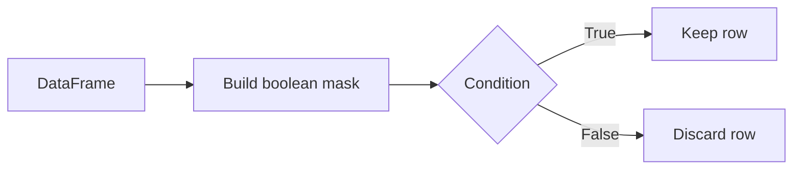
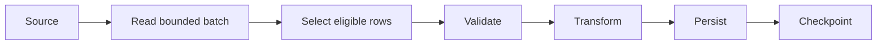
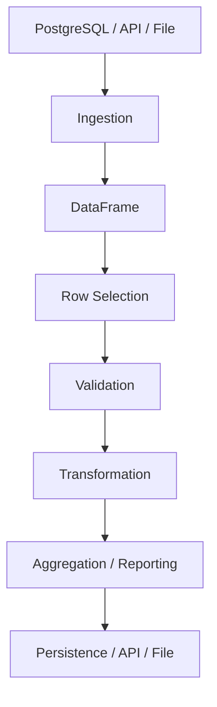

# 02- Selecting Rows

## Overview

Selecting rows is one of the most common operations in Pandas. In production workloads, row selection is usually driven by business rules rather than row positions:

```text
Raw records
    ↓
Identify eligible rows
    ↓
Filter by business conditions
    ↓
Process selected records
    ↓
Validate / aggregate / persist
```

Typical requirements include:

- Select orders created after a cutoff time.
- Select customers from specific regions.
- Select failed transactions.
- Select active employees.
- Select rows with missing operational fields.
- Select a bounded batch for processing.

Pandas provides several row-selection mechanisms, and the correct choice depends on whether the requirement is based on labels, positions, or values.

The most important distinction is:

| Requirement | Preferred mechanism |
|---|---|
| Select by row label | `.loc` |
| Select by row position | `.iloc` |
| Select by boolean condition | Boolean filtering / `.loc` |
| Select one scalar by label | `.at` |
| Select one scalar by position | `.iat` |
| Select a set of allowed values | `.isin()` |
| Filter using expression syntax | `.query()` |

## Core Concept

A DataFrame contains rows identified by an index.

```python
import pandas as pd

orders = pd.DataFrame(
    {
        "order_id": ["ORD-1001", "ORD-1002", "ORD-1003"],
        "customer_id": ["C-001", "C-002", "C-003"],
        "status": ["completed", "pending", "cancelled"],
        "amount": [1250.0, 450.0, 100.0],
    }
)
```

Conceptually:

```text
Index      order_id    customer_id    status       amount
0          ORD-1001    C-001           completed    1250.0
1          ORD-1002    C-002           pending       450.0
2          ORD-1003    C-003           cancelled     100.0
```

The important point is that the row index and the business identifier are separate concepts.

```text
Index
  ↓
Pandas selection / alignment

order_id
  ↓
Business identity
```

Do not assume that the DataFrame index is automatically a primary key.

## Selecting Rows by Position

Use `.iloc` when the requirement is explicitly positional.

### Basic Syntax

```python
result = df.iloc[row_position]
```

For multiple positions:

```python
result = df.iloc[start:stop]
```

Example:

```python
first_two_orders = orders.iloc[:2]
```

Result:

```text
  order_id  customer_id     status   amount
0 ORD-1001  C-001         completed  1250.0
1 ORD-1002  C-002         pending     450.0
```

### Selecting Specific Positions

```python
selected = orders.iloc[[0, 2]]
```

This selects rows at positions `0` and `2`.

### Selecting Rows and Columns

`.iloc` accepts both row and column positions:

```python
selected = orders.iloc[
    :2,
    [0, 2, 3],
]
```

This means:

```text
Rows    → first two positions
Columns → positions 0, 2, and 3
```

### When `.iloc` Is Appropriate

Use `.iloc` when position itself has meaning:

```text
First 100 records of an in-memory batch
Rows returned in a known positional protocol
Selecting a fixed region of a DataFrame
Pagination within an already-materialized bounded DataFrame
```

Do not use positional selection when the business requirement is value-based.

Fragile:

```python
orders.iloc[:100]
```

when the actual requirement is:

```text
orders created most recently
```

The first 100 rows are not necessarily the latest 100 rows.

## Selecting Rows by Label

Use `.loc` when selecting by index labels.

```python
orders.loc[0]
```

This selects the row whose index label is `0`.

For multiple labels:

```python
orders.loc[[0, 2]]
```

For a label range:

```python
orders.loc[0:2]
```

Unlike ordinary Python slicing, label-based slicing with `.loc` is generally inclusive of the stop label when the labels are present and ordered appropriately.

That difference matters when code mixes positional and label-based assumptions.

## Label vs Position

Consider this DataFrame:

```python
orders = pd.DataFrame(
    {
        "order_id": ["ORD-1001", "ORD-1002", "ORD-1003"],
        "amount": [1250.0, 450.0, 100.0],
    },
    index=[101, 205, 309],
)
```

Then:

```python
orders.loc[205]
```

selects the row with label `205`.

But:

```python
orders.iloc[1]
```

selects the second row.

They happen to refer to the same physical row here, but for different reasons.

```text
.loc[205]
    → label 205

.iloc[1]
    → position 1
```

The distinction becomes critical after sorting, filtering, concatenation, index reassignment, or loading data with a non-default index.

## Boolean Row Filtering

Boolean filtering selects rows according to a condition.

```python
completed_orders = orders.loc[
    orders["status"].eq("completed")
]
```

The expression:

```python
orders["status"].eq("completed")
```

produces a boolean Series:

```text
True
False
False
```

Pandas aligns that boolean mask with the DataFrame index and retains rows where the condition is `True`.

Conceptually:



This pattern is the foundation of most business-rule filtering.

## Boolean Filtering with Comparisons

Common comparison methods include:

```python
df["amount"].eq(1000)
df["amount"].ne(1000)
df["amount"].gt(1000)
df["amount"].ge(1000)
df["amount"].lt(1000)
df["amount"].le(1000)
```

For example:

```python
high_value_orders = orders.loc[
    orders["amount"].gt(1000)
]
```

Equivalent operators exist:

```python
high_value_orders = orders.loc[
    orders["amount"] > 1000
]
```

The method form can be useful in method chains because it keeps the operation explicit and composes naturally with other Pandas methods.

## Multiple Row Conditions

Real filtering usually involves multiple conditions.

```python
eligible_orders = orders.loc[
    orders["status"].eq("completed")
    & orders["amount"].gt(1000)
]
```

Use Pandas element-wise operators:

| Meaning | Operator |
|---|---|
| AND | `&` |
| OR | `|` |
| NOT | `~` |

Do not use Python's logical operators:

```python
and
or
not
```

for Series-based filtering.

### Correct

```python
filtered = orders.loc[
    (orders["status"] == "completed")
    & (orders["amount"] > 1000)
]
```

### Incorrect

```python
filtered = orders.loc[
    (orders["status"] == "completed")
    and (orders["amount"] > 1000)
]
```

Python's `and` expects a single truth value, while a Pandas Series contains many element-level truth values.

## Parentheses Matter

Each boolean expression should normally be parenthesized:

```python
filtered = orders.loc[
    (orders["status"].eq("completed"))
    & (orders["amount"].gt(1000))
]
```

Without parentheses, Python operator precedence can produce unexpected behavior or errors.

A good production convention is:

```python
mask = (
    orders["status"].eq("completed")
    & orders["amount"].gt(1000)
)
```

Then:

```python
filtered = orders.loc[mask]
```

This is easier to test and debug.

## OR Conditions

Select records matching either condition:

```python
attention_required = orders.loc[
    orders["status"].eq("failed")
    | orders["amount"].gt(10000)
]
```

This is appropriate when a row qualifies through multiple independent business rules.

For maintainability, name complex conditions:

```python
failed = orders["status"].eq("failed")
high_value = orders["amount"].gt(10_000)

attention_required = orders.loc[
    failed | high_value
]
```

This makes individual rules easier to inspect and test.

## NOT Conditions

Use `~` to invert a boolean mask.

```python
non_cancelled = orders.loc[
    ~orders["status"].eq("cancelled")
]
```

This is preferable to constructing complicated inequality expressions when the business rule is naturally expressed as negation.

## Selecting Rows with `isin`

When a row should match one of several allowed values, use `isin()`.

```python
active_orders = orders.loc[
    orders["status"].isin(
        [
            "pending",
            "completed",
        ]
    )
]
```

This is clearer than:

```python
orders.loc[
    (orders["status"] == "pending")
    | (orders["status"] == "completed")
]
```

`isin()` is especially useful for:

```text
Allowed status values
Region lists
Customer allowlists
Product categories
Known identifiers
Partition keys
```

## Negating `isin`

To exclude a set:

```python
non_terminal = orders.loc[
    ~orders["status"].isin(
        [
            "completed",
            "cancelled",
        ]
    )
]
```

This is useful for identifying records still requiring processing.

## Selecting Rows with `query`

`.query()` provides an expression-oriented interface:

```python
filtered = orders.query(
    "status == 'completed' and amount > 1000"
)
```

It can make complex filters easier to read when the expression naturally resembles a business rule.

For example:

```python
report = orders.query(
    """
    status == 'completed'
    and amount >= 1000
    and customer_id.notna()
    """
)
```

Use `.query()` when it makes the predicate easier to understand. Do not use it simply because it is shorter.

## External Values with `query`

External Python variables can be referenced with `@`.

```python
minimum_amount = 1000
required_status = "completed"

result = orders.query(
    "status == @required_status "
    "and amount >= @minimum_amount"
)
```

This keeps application configuration and runtime values outside the expression itself.

Avoid assembling query strings directly from untrusted input.

Prefer:

```python
allowed_statuses = {"completed", "pending"}

result = orders.loc[
    orders["status"].isin(allowed_statuses)
]
```

for programmatically supplied collections.

## Filtering Missing Values

Missing values require explicit handling.

```python
missing_customer = orders.loc[
    orders["customer_id"].isna()
]
```

Non-missing values:

```python
valid_customer = orders.loc[
    orders["customer_id"].notna()
]
```

Use `isna()` and `notna()` instead of equality checks against `None`.

```python
orders["customer_id"] == None
```

is not the preferred general-purpose missing-value test.

## Filtering Numeric Ranges

For a bounded numeric range:

```python
mid_value_orders = orders.loc[
    orders["amount"].between(
        500,
        5000,
        inclusive="both",
    )
]
```

`between()` is often more readable than combining two comparisons:

```python
mid_value_orders = orders.loc[
    (orders["amount"] >= 500)
    & (orders["amount"] <= 5000)
]
```

It also makes the intended range boundaries explicit.

## Filtering String Values

String filtering commonly uses the `.str` accessor:

```python
enterprise_customers = orders.loc[
    orders["customer_id"].str.startswith(
        "ENT-",
        na=False,
    )
]
```

Use `na=False` when missing values should simply fail the predicate rather than propagate missing values into the resulting mask.

For exact equality, prefer:

```python
orders["status"].eq("completed")
```

rather than string operations.

## Filtering Date Ranges

Datetime filtering should use actual datetime dtypes.

```python
orders["created_at"] = pd.to_datetime(
    orders["created_at"],
    errors="coerce",
)
```

Then:

```python
start = pd.Timestamp("2026-01-01")
end = pd.Timestamp("2026-02-01")

january_orders = orders.loc[
    orders["created_at"].ge(start)
    & orders["created_at"].lt(end)
]
```

Using a half-open interval:

```text
[start, end)
```

is often safer for timestamp-based processing because it avoids ambiguity at the end boundary.

For example:

```text
2026-01-01 00:00:00
through
2026-02-01 00:00:00 exclusive
```

This pattern also composes cleanly with daily, monthly, and hourly partitions.

## Filtering by Index

When the row index itself contains meaningful labels, `.loc` can select directly by those labels.

```python
orders.loc["2026-01-15"]
```

For a time-indexed DataFrame, label-based slicing can be useful:

```python
daily_orders = orders.loc[
    "2026-01-01":"2026-01-31"
]
```

This is particularly useful in time-series workloads, but only when the index semantics are intentional and documented.

## Filtering with a MultiIndex

For MultiIndex DataFrames, selection semantics become more involved.

For example:

```python
summary = (
    orders
    .set_index(
        [
            "customer_id",
            "status",
        ]
    )
)
```

Rows can then be selected by index levels.

```python
customer_orders = summary.loc[
    "C-001"
]
```

For complex MultiIndex selection, use appropriate index-aware selectors rather than trying to treat the MultiIndex like an ordinary scalar column.

MultiIndex can be powerful, but a regular column-based schema is often easier to maintain in ETL pipelines.

## Row Selection vs Column Selection

`.loc` supports both:

```python
df.loc[row_selector, column_selector]
```

For example:

```python
result = orders.loc[
    orders["status"].eq("completed"),
    [
        "order_id",
        "customer_id",
        "amount",
    ],
]
```

This is one of the most useful production patterns because it defines both:

```text
Which rows?
+
Which columns?
```

at the same boundary.

It also prevents unnecessary columns from flowing through subsequent transformations.

## Empty Results

Filtering can legitimately return zero rows.

```python
result = orders.loc[
    orders["status"].eq("archived")
]
```

An empty result is not necessarily an error.

In a production pipeline, decide whether zero rows means:

```text
Valid empty batch
No data available
Unexpected source condition
Data quality failure
```

Check explicitly when the business contract requires data:

```python
if result.empty:
    raise ValueError(
        "Expected at least one eligible order."
    )
```

Do not automatically treat every empty DataFrame as a failure.

## Row Order

Filtering generally preserves the order of rows from the source DataFrame.

For example:

```python
result = orders.loc[
    orders["status"].eq("completed")
]
```

does not automatically sort the result.

If ordering matters, make it explicit:

```python
result = (
    orders.loc[
        orders["status"].eq("completed")
    ]
    .sort_values(
        "created_at",
        ascending=False,
    )
)
```

Never rely on incidental ordering when producing reports, API payloads, exports, or deterministic batch inputs.

## Duplicate Rows

Row filtering does not remove duplicates.

```python
filtered = orders.loc[
    orders["status"].eq("completed")
]
```

If duplicate records are possible, treat duplicate handling as a separate concern:

```python
filtered = (
    orders.loc[
        orders["status"].eq("completed")
    ]
    .drop_duplicates(
        subset=["order_id"],
    )
)
```

The correct duplicate rule depends on the business definition of identity.

Do not assume:

```text
one DataFrame row = one unique entity
```

unless the source contract guarantees it.

## Filtering After Database Extraction

Pandas should not automatically be the first place filtering occurs.

Consider:

```text
PostgreSQL
    ↓
SELECT required columns
WHERE required predicates
    ↓
Pandas
    ↓
Additional transformation
```

For example:

```python
orders = pd.read_sql_query(
    """
    SELECT
        order_id,
        customer_id,
        status,
        amount,
        created_at
    FROM orders
    WHERE status IN ('completed', 'pending')
      AND created_at >= %(start_date)s
    """,
    connection,
    params={
        "start_date": "2026-01-01",
    },
)
```

This is usually more scalable than:

```text
SELECT *
FROM orders
```

followed by Pandas filtering.

The database can generally filter before network transfer and before the data enters Pandas memory.

## API Processing

APIs commonly return heterogeneous or oversized payloads.

After normalization, filter only the required rows:

```python
eligible_events = events.loc[
    events["event_type"].isin(
        [
            "order.created",
            "order.updated",
        ]
    )
]
```

This is particularly useful before:

```text
Serialization
Validation
Aggregation
Parquet persistence
Kafka publishing
```

If the API supports server-side filtering, pagination, field selection, or query parameters, use those capabilities before downloading unnecessary data.

## Batch Processing

A batch processor might process only records in a particular state:

```python
batch = events.loc[
    events["processing_status"].eq("pending")
]
```

For bounded processing:

```python
batch = (
    events.loc[
        events["processing_status"].eq("pending")
    ]
    .head(1000)
)
```

Be careful with this pattern.

`head(1000)` means:

```text
First 1000 rows in current DataFrame order
```

It does not guarantee:

```text
Oldest 1000 records
```

For deterministic processing, sort by an explicit ordering field before limiting:

```python
batch = (
    events.loc[
        events["processing_status"].eq("pending")
    ]
    .sort_values(
        "created_at",
        kind="stable",
    )
    .head(1000)
)
```

For very large workloads, database-side batching or keyset pagination may be preferable to loading all pending rows into Pandas.

## Incremental Processing

Pandas filtering is often one stage inside a bounded batch operation.



The filtering stage should be deterministic.

For example:

```python
eligible = batch.loc[
    batch["status"].eq("ready")
    & batch["customer_id"].notna()
]
```

This allows the pipeline to distinguish:

```text
Read successfully
↓
Row rejected by rule
↓
Row accepted for processing
```

That distinction is important for operational monitoring and replay.

## Selection in a Data Quality Pipeline

A validation pipeline may explicitly separate valid and invalid records.

```python
valid = records.loc[
    records["amount"].ge(0)
    & records["customer_id"].notna()
]

invalid = records.loc[
    records["amount"].lt(0)
    | records["customer_id"].isna()
]
```

For more complex validation systems, define each rule independently:

```python
valid_amount = records["amount"].ge(0)
has_customer = records["customer_id"].notna()
known_status = records["status"].isin(
    [
        "pending",
        "completed",
        "cancelled",
    ]
)

valid = records.loc[
    valid_amount
    & has_customer
    & known_status
]
```

This makes validation metrics easier to produce:

```text
invalid_amount_count
missing_customer_count
unknown_status_count
```

## Method Chaining

Row selection works naturally with method chaining.

```python
result = (
    orders
    .loc[
        orders["status"].eq("completed")
        & orders["amount"].gt(1000),
        [
            "order_id",
            "customer_id",
            "amount",
        ],
    ]
    .sort_values(
        "amount",
        ascending=False,
    )
)
```

A chain is useful when each operation represents a clear transformation step.

Avoid chains that become difficult to review:

```python
result = (
    df.loc[
        ...
    ]
    .assign(...)
    .merge(...)
    .groupby(...)
    .transform(...)
    ...
)
```

When business rules become complex, use named intermediate variables.

## Copy Semantics After Filtering

Filtering produces a new DataFrame-like result for downstream use, but mutation semantics should not be assumed blindly.

When an independent working object is required:

```python
completed = (
    orders.loc[
        orders["status"].eq("completed")
    ]
    .copy()
)
```

Then it is safe to treat `completed` as its own transformation target:

```python
completed["amount"] = (
    completed["amount"] * 1.05
)
```

Use `.copy()` because you need independent ownership, not as a reflex after every selection.

Unnecessary copies can increase memory pressure, particularly for large DataFrames.

## Performance Considerations

Row filtering is usually efficient when performed with vectorized Pandas expressions:

```python
filtered = df.loc[
    df["status"].eq("completed")
]
```

Avoid Python-level row loops:

```python
selected_rows = []

for _, row in df.iterrows():
    if row["status"] == "completed":
        selected_rows.append(row)
```

This is slower, harder to optimize, and usually unnecessary.

Prefer:

```python
selected_rows = df.loc[
    df["status"].eq("completed")
]
```

### Filter Early

For large DataFrames:

```text
Filter
↓
Project
↓
Transform
↓
Aggregate
```

is often preferable to:

```text
Transform everything
↓
Filter later
```

The earlier the dataset becomes smaller, the less work later operations need to perform.

### Avoid Recomputing Masks

If the same expensive condition is reused:

```python
eligible = (
    df["status"].eq("completed")
    & df["amount"].gt(1000)
)

high_value = df.loc[eligible]
```

Reuse the mask rather than reconstructing the expression repeatedly.

## Memory Considerations

Boolean filtering can require additional intermediate objects.

For a large DataFrame:

```python
mask = (
    df["status"].eq("completed")
)

filtered = df.loc[mask]
```

The mask itself consumes memory.

For very large datasets, consider whether filtering should instead happen:

```text
In SQL
During chunked ingestion
At the API source
Before materializing the full DataFrame
```

For example:

```python
for chunk in pd.read_csv(
    "orders.csv",
    chunksize=100_000,
):
    completed = chunk.loc[
        chunk["status"].eq("completed")
    ]

    process(completed)
```

This keeps memory bounded by chunk size rather than total input size.

## Security Considerations

Row selection can also be a data-exposure boundary.

Do not pass unauthorized rows into:

```text
API responses
Logs
Reports
Exports
Analytics jobs
Downstream services
```

For example:

```python
customer_orders = orders.loc[
    orders["customer_id"].eq(customer_id),
    [
        "order_id",
        "status",
        "amount",
    ],
]
```

Do not include sensitive fields simply because they exist in the DataFrame.

Selection should follow least-privilege principles:

```text
Select only authorized rows
+
Select only required columns
```

For multi-tenant systems, tenant filtering should be explicit and ideally enforced at the data source as well.

## Reliability Considerations

For production pipelines, filtering rules should be deterministic and testable.

A useful pattern is:

```python
def select_processable_orders(
    orders: pd.DataFrame,
) -> pd.DataFrame:
    mask = (
        orders["status"].eq("pending")
        & orders["customer_id"].notna()
        & orders["amount"].ge(0)
    )

    return orders.loc[mask].copy()
```

This isolates business selection logic from:

```text
I/O
Database access
Logging
Scheduling
Persistence
```

The function can then be tested independently.

## Testing Row Selection

Tests should validate business behavior rather than simply checking that the code runs.

```python
def test_select_processable_orders() -> None:
    orders = pd.DataFrame(
        {
            "order_id": [
                "ORD-1",
                "ORD-2",
                "ORD-3",
            ],
            "customer_id": [
                "C-1",
                None,
                "C-3",
            ],
            "status": [
                "pending",
                "pending",
                "completed",
            ],
            "amount": [
                100.0,
                200.0,
                -10.0,
            ],
        }
    )

    result = select_processable_orders(orders)

    assert result["order_id"].tolist() == [
        "ORD-1",
    ]
```

Important test cases include:

```text
Matching rows
No matching rows
Missing values
Invalid values
Unexpected statuses
Duplicate records
Empty input
Incorrect dtypes
Boundary values
Large batches
```

## Common Mistakes

### Using `iloc` for Business Rules

Incorrect:

```python
recent_orders = orders.iloc[:100]
```

when the requirement is "latest 100 orders."

Correct:

```python
recent_orders = (
    orders
    .sort_values(
        "created_at",
        ascending=False,
    )
    .head(100)
)
```

The difference is semantic correctness.

### Assuming DataFrame Order Has Business Meaning

A DataFrame may be ordered according to source retrieval order, file layout, or a previous transformation.

If order matters, define it explicitly:

```python
orders = orders.sort_values(
    "created_at",
    ascending=False,
)
```

### Using `and` Instead of `&`

Incorrect:

```python
df.loc[
    (df["status"] == "completed")
    and (df["amount"] > 1000)
]
```

Correct:

```python
df.loc[
    (df["status"] == "completed")
    & (df["amount"] > 1000)
]
```

### Forgetting Parentheses

Write:

```python
(
    df["status"].eq("completed")
    & df["amount"].gt(1000)
)
```

rather than relying on precedence.

### Comparing Missing Values with `None`

Incorrect:

```python
df.loc[
    df["customer_id"] == None
]
```

Correct:

```python
df.loc[
    df["customer_id"].isna()
]
```

### Filtering After Expensive Work

Avoid:

```text
Load huge dataset
↓
Perform expensive transformations
↓
Filter to 5%
```

Prefer:

```text
Filter to 5%
↓
Transform 5%
```

when the transformation does not affect the filter condition.

### Assuming Filtering Removes Duplicates

Filtering only selects rows.

Use explicit deduplication when required:

```python
df = df.drop_duplicates(
    subset=["order_id"]
)
```

### Mutating a Filtered Result Without Clear Ownership

For independent work:

```python
subset = df.loc[mask].copy()
```

Make ownership explicit rather than relying on ambiguous assumptions about subset mutation.

### Treating Empty Results as Automatically Exceptional

An empty result may be valid.

Define the business contract first:

```text
Zero eligible orders → expected
Zero source records → failure
```

The application should distinguish these states.

## Production Pitfalls

| Pitfall | Why it happens | Better approach |
|---|---|---|
| Position-based selection for business rules | Confusing row order with business meaning | Use explicit conditions and labels |
| Filtering after full database extraction | Pandas used as a substitute for source filtering | Push predicates into SQL where appropriate |
| Huge boolean expressions | Business rules grow over time | Name masks or isolate selection functions |
| Ignoring missing values | Real data rarely matches ideal schemas | Use `isna()` / `notna()` explicitly |
| Implicit row ordering | Source order is mistaken for deterministic ordering | Sort by an explicit key |
| Excessive `.copy()` usage | Developers try to avoid all ambiguity | Copy only when independent ownership is required |
| Python row loops | Pandas APIs are underused | Prefer vectorized boolean filtering |
| Returning sensitive columns | Selection focuses only on rows | Apply column-level minimization too |
| Unbounded batch filtering | Entire source loaded into memory | Filter at source or process chunks |

## Backend Architecture Pattern

A production data-processing service commonly separates source retrieval from row-selection logic.



The row-selection layer should ideally be:

```text
Deterministic
Pure where practical
Testable
Schema-aware
Explicit about business rules
```

This makes it easier to:

```text
Unit test
Replay
Debug
Monitor
Audit
Refactor
```

## Operational Monitoring

For production pipelines, row selection can produce useful metrics.

For example:

```python
eligible = (
    orders["status"].eq("pending")
    & orders["customer_id"].notna()
)

eligible_count = int(eligible.sum())
rejected_count = int((~eligible).sum())
```

Track metrics such as:

```text
records_read
records_selected
records_rejected
records_missing_required_fields
records_invalid
```

Unexpected shifts can indicate upstream data-quality problems.

For example:

```text
Yesterday:
selected = 97%

Today:
selected = 43%
```

may indicate a source-system schema or data-quality regression.

Do not log entire DataFrames to diagnose such issues. Prefer:

```text
Counts
Sample identifiers
Validation statistics
Aggregates
Structured metadata
```

## Interview Questions

### What Is the Difference Between `.loc` and `.iloc`?

`.loc` performs label-based selection. `.iloc` performs integer-position-based selection.

### When Would You Prefer `.loc` for Row Selection?

Use `.loc` when selection is based on labels, boolean conditions, or when both rows and columns should be selected explicitly.

### Why Should `iloc[:100]` Not Be Used to Mean "Latest 100 Rows"?

Because `.iloc` selects the first 100 positions. Unless row ordering was explicitly established, those rows have no guaranteed relationship to recency.

### How Do You Combine Multiple Conditions?

Use `&`, `|`, and `~` with parenthesized expressions:

```python
df.loc[
    (df["status"] == "completed")
    & (df["amount"] > 1000)
]
```

### What Does `isin()` Solve?

It expresses membership against a collection of accepted values and is generally clearer than repeatedly combining equality conditions.

### When Is `query()` Useful?

It is useful when expression-oriented filtering improves readability, especially for filters involving several columns and straightforward predicates.

### Should Every Filtered DataFrame Be Copied?

No. Use `.copy()` when an independent working object is required. Avoid unnecessary copies because they consume memory and can increase processing cost.

### How Can You Filter Large Database Datasets Efficiently?

Push filtering and column projection into SQL when the database can perform them efficiently. This reduces network transfer and Pandas memory usage.

### How Should You Filter Data in a Chunked Pipeline?

Apply the predicate independently to each chunk:

```python
for chunk in pd.read_csv(
    "orders.csv",
    chunksize=100_000,
):
    eligible = chunk.loc[
        chunk["status"].eq("pending")
    ]

    process(eligible)
```

### What Is a Common Interview Trap With `and` and `or`?

They are Python scalar logical operators and do not perform element-wise boolean logic on Pandas Series. Use `&` and `|`.

### Why Is Explicit Ordering Important Before `head()`?

`head()` operates on current row order. It does not determine which rows are logically newest, oldest, highest priority, or otherwise preferred.

## Practical Reference

| Goal | Recommended pattern |
|---|---|
| First N positions | `df.iloc[:n]` |
| Row by label | `df.loc[label]` |
| Multiple labels | `df.loc[[label1, label2]]` |
| Conditional rows | `df.loc[mask]` |
| Conditional rows + columns | `df.loc[mask, columns]` |
| One scalar by label | `df.at[label, column]` |
| One scalar by position | `df.iat[row, column]` |
| Match any allowed value | `df.loc[df["status"].isin(values)]` |
| Exclude values | `df.loc[~df["status"].isin(values)]` |
| Missing values | `df.loc[df["column"].isna()]` |
| Non-missing values | `df.loc[df["column"].notna()]` |
| Numeric range | `df.loc[df["amount"].between(100, 1000)]` |
| Expression filtering | `df.query("amount > 1000")` |
| Stable latest-N selection | `df.sort_values("created_at").tail(n)` |
| Safe conditional assignment | `df.loc[mask, "column"] = value` |

## Key Takeaways

- Use `.loc` for label- and condition-based row selection, while `.iloc` is for inherently positional requirements; never confuse row position with business meaning.
- Boolean filtering is the core Pandas selection pattern: use vectorized conditions with `&`, `|`, `~`, and explicit parentheses.
- Make ordering explicit before operations such as `head()` or `tail()` when the business requirement depends on recency, priority, or another deterministic sort key.
- In production pipelines, reduce data as early as practical by pushing filtering into SQL or source APIs and by filtering each chunk when processing large files.
- Treat row selection as business logic: handle missing and invalid data explicitly, minimize exposed fields, test edge cases, and keep selection rules deterministic and maintainable.