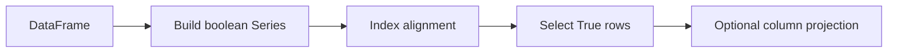

# 03- Loc

## Overview

`.loc` is Pandas' primary **label-based selection interface** for DataFrames and Series. It is used when row or column selection should be expressed in terms of labels, boolean conditions, or both.

In production code, `.loc` is important because it allows selection and conditional assignment to be expressed explicitly:

```text
Row selection
    +
Column selection
    +
Business conditions
```

A typical ETL operation looks like:

```python
completed_orders = orders.loc[
    orders["status"].eq("completed"),
    [
        "order_id",
        "customer_id",
        "amount",
    ],
]
```

This single operation communicates:

```text
Select rows where status == completed
+
Return only the required columns
```

Understanding `.loc` requires a clear distinction between:

```text
Label-based selection
Position-based selection
Boolean filtering
Scalar access
Conditional assignment
```

`.loc` is generally the right default when the selection requirement is semantic rather than positional.

## What `.loc` Is

`.loc` is an indexer used for **label-based selection**.

The basic form is:

```python
df.loc[row_selector, column_selector]
```

Both selectors are optional.

Examples:

```python
df.loc[row_label]
```

```python
df.loc[:, "amount"]
```

```python
df.loc[row_condition, "amount"]
```

```python
df.loc[row_condition, ["order_id", "amount"]]
```

The result can be:

```text
Scalar
Series
DataFrame
```

depending on the selectors supplied.

## Why `.loc` Exists

DataFrame positions are not always stable.

A dataset may be:

```text
Sorted
Filtered
Concatenated
Reindexed
Joined
Loaded with custom labels
```

Because of this, positional access such as:

```python
df.iloc[10]
```

does not express why row 10 should be selected.

Label-based access can express domain or structural meaning:

```python
df.loc[order_id]
```

or:

```python
df.loc[
    df["status"].eq("completed")
]
```

This makes the code less dependent on incidental row positions.

## Basic Syntax

The canonical syntax is:

```python
df.loc[row_selector, column_selector]
```

Examples:

| Expression | Meaning |
|---|---|
| `df.loc[10]` | Row with label `10` |
| `df.loc[[10, 20]]` | Rows with labels `10` and `20` |
| `df.loc[:, "amount"]` | Column named `amount` |
| `df.loc[:, ["id", "amount"]]` | Selected columns |
| `df.loc[mask]` | Rows matching a boolean mask |
| `df.loc[mask, "amount"]` | One column from matching rows |
| `df.loc[mask, ["id", "amount"]]` | Multiple columns from matching rows |

The second argument can be omitted when only row selection is required.

## Preparing a Production Dataset

Use a realistic DataFrame:

```python
import pandas as pd

orders = pd.DataFrame(
    {
        "order_id": [
            "ORD-1001",
            "ORD-1002",
            "ORD-1003",
            "ORD-1004",
        ],
        "customer_id": [
            "C-001",
            "C-002",
            "C-003",
            None,
        ],
        "status": [
            "completed",
            "pending",
            "completed",
            "cancelled",
        ],
        "amount": [
            1250.00,
            450.00,
            3200.00,
            100.00,
        ],
    }
)
```

The default index is:

```text
0
1
2
3
```

The index labels are currently identical to row positions, but that is an implementation detail of the current DataFrame, not a rule to rely on.

## Selecting a Row by Label

Suppose the DataFrame uses meaningful index labels:

```python
orders = orders.set_index("order_id")
```

Now:

```text
order_id
ORD-1001
ORD-1002
ORD-1003
ORD-1004
```

A row can be selected with:

```python
order = orders.loc["ORD-1003"]
```

This means:

```text
Select the row whose index label is ORD-1003.
```

It does not mean:

```text
Select the third row.
```

That distinction is fundamental.

## Selecting Multiple Row Labels

Use a list of labels:

```python
selected = orders.loc[
    [
        "ORD-1001",
        "ORD-1004",
    ]
]
```

The result contains the requested rows using their existing labels.

This is useful when an application already has a collection of identifiers:

```python
order_ids = [
    "ORD-1001",
    "ORD-1004",
]

selected = orders.loc[order_ids]
```

For production code, validate whether every requested label is expected to exist. Direct `.loc` lookup with absent labels can raise an exception.

## Selecting a Column by Label

A column can be selected through `.loc`:

```python
amounts = orders.loc[:, "amount"]
```

Equivalent shorthand:

```python
amounts = orders["amount"]
```

For a single column, the bracket syntax is usually simpler.

`.loc` becomes especially useful when the same operation also has a row selector:

```python
completed_amounts = orders.loc[
    orders["status"].eq("completed"),
    "amount",
]
```

## Selecting Multiple Columns

Provide a list of labels:

```python
selected = orders.loc[
    :,
    [
        "customer_id",
        "status",
        "amount",
    ],
]
```

This is useful for explicitly defining the working schema.

A common production pattern is:

```python
working_orders = orders.loc[
    orders["status"].isin(
        [
            "pending",
            "completed",
        ]
    ),
    [
        "order_id",
        "customer_id",
        "amount",
    ],
]
```

This reduces the data flowing through later transformations.

## Selecting Rows and Columns Together

The main strength of `.loc` is combining row and column selection.

```python
completed_orders = orders.loc[
    orders["status"].eq("completed"),
    [
        "order_id",
        "customer_id",
        "amount",
    ],
]
```

The selection can be read as:

```text
Rows:
    status == completed

Columns:
    order_id
    customer_id
    amount
```

This is often preferable to filtering first and projecting later:

```python
completed = orders[
    orders["status"].eq("completed")
]

completed = completed[
    [
        "order_id",
        "customer_id",
        "amount",
    ]
]
```

Both can be valid, but `.loc` can express the complete selection boundary in one place.

## Boolean Selection

The row selector can be a boolean Series:

```python
mask = orders["status"].eq("completed")

completed = orders.loc[
    mask
]
```

Internally, Pandas aligns the boolean mask with the DataFrame index and selects rows whose corresponding mask value is `True`.

Conceptually:



This alignment behavior is one reason Pandas indexes are important.

## Boolean Selection with Columns

A mask can be combined with column projection:

```python
completed_amounts = orders.loc[
    orders["status"].eq("completed"),
    "amount",
]
```

Multiple columns:

```python
completed_summary = orders.loc[
    orders["status"].eq("completed"),
    [
        "order_id",
        "amount",
    ],
]
```

This pattern is common in:

```text
ETL
Reporting
Validation
Batch processing
API preparation
```

## Multiple Conditions

Use element-wise operators for Series conditions:

```python
high_value_completed = orders.loc[
    orders["status"].eq("completed")
    & orders["amount"].gt(1000),
    [
        "order_id",
        "amount",
    ],
]
```

Supported logical operators include:

| Requirement | Operator |
|---|---|
| AND | `&` |
| OR | `|` |
| NOT | `~` |

Use parentheses around individual conditions:

```python
mask = (
    orders["status"].eq("completed")
    & orders["amount"].gt(1000)
)
```

Do not use:

```python
and
or
not
```

for Series-based conditions.

## Handling Missing Values in `.loc`

Missing values should be filtered explicitly.

```python
missing_customers = orders.loc[
    orders["customer_id"].isna()
]
```

Non-missing customers:

```python
valid_customers = orders.loc[
    orders["customer_id"].notna()
]
```

Combined conditions:

```python
processable = orders.loc[
    orders["status"].eq("pending")
    & orders["customer_id"].notna()
]
```

This is preferable to comparisons such as:

```python
orders["customer_id"] == None
```

because Pandas missing-value handling spans several representations and dtypes.

## Label Slicing

`.loc` supports label-based slicing.

Given:

```python
orders = orders.set_index("order_id")
```

you can select a label range:

```python
selected = orders.loc[
    "ORD-1001":"ORD-1003"
]
```

For label-based slicing, the endpoint behavior differs from ordinary Python positional slicing. When the relevant labels are present and the index supports the operation, `.loc` label slices are inclusive of the stop label.

This distinction matters when moving between:

```python
df.iloc[start:stop]
```

and:

```python
df.loc[start_label:stop_label]
```

Do not assume the two have identical boundary semantics.

## Non-Unique Index Labels

An index does not have to be unique.

Consider:

```python
events = pd.DataFrame(
    {
        "event": [
            "created",
            "updated",
            "deleted",
        ],
    },
    index=[
        "ORD-1001",
        "ORD-1001",
        "ORD-1002",
    ],
)
```

Then:

```python
events.loc["ORD-1001"]
```

returns multiple rows because the label occurs multiple times.

This behavior is valid Pandas behavior, but it may not match an application's business assumptions.

Before relying on scalar-like label lookups, determine whether the index is unique:

```python
if not events.index.is_unique:
    raise ValueError(
        "Expected unique event index."
    )
```

## `.loc` and Duplicate Business Keys

Business keys and indexes should be treated separately.

A DataFrame can have:

```text
Unique order_id column
+
Non-unique index
```

or:

```text
Non-unique order_id column
+
Unique index
```

Do not infer data integrity from index behavior alone.

For ETL systems, define identity explicitly:

```python
required_keys = [
    "order_id",
]

duplicates = orders[
    orders.duplicated(
        subset=required_keys,
        keep=False,
    )
]
```

Selection should operate against a schema whose identity rules are already understood.

## `.loc` vs `.iloc`

The key difference is selection semantics:

| Feature | `.loc` | `.iloc` |
|---|---|---|
| Primary semantics | Label-based | Position-based |
| Boolean filtering | Yes | Boolean arrays can be used |
| Label slicing | Yes | No |
| Positional slicing | No | Yes |
| Conditional assignment | Yes | Yes |
| Column selection by name | Yes | No |
| Column selection by position | No | Yes |
| Best for business rules | Usually | Rarely |

Example:

```python
orders.loc["ORD-1003"]
```

means:

```text
Find label ORD-1003.
```

Whereas:

```python
orders.iloc[2]
```

means:

```text
Return the third row.
```

Choose based on intent rather than habit.

## `.loc` vs `[]`

For a single column:

```python
df["amount"]
```

is concise and idiomatic.

`.loc` becomes more valuable when the operation needs explicit row and column selectors:

```python
df.loc[
    df["status"].eq("completed"),
    "amount",
]
```

Use `[]` for straightforward column access and `.loc` for explicit label-based selection or assignment.

## `.loc` vs `.query()`

Both can express row filters.

Using `.loc`:

```python
result = orders.loc[
    orders["status"].eq("completed")
    & orders["amount"].gt(1000)
]
```

Using `.query()`:

```python
result = orders.query(
    "status == 'completed' and amount > 1000"
)
```

Use `.loc` when:

```text
You need explicit column projection
You are building programmatic masks
You need direct conditional assignment
You want normal Python expressions
```

Use `.query()` when:

```text
The expression is easier to read in query syntax
The filter is primarily expression-oriented
```

Neither is universally better.

## `.loc` for Conditional Assignment

`.loc` is the preferred interface for conditional assignment.

```python
orders.loc[
    orders["status"].eq("pending"),
    "status",
] = "awaiting_payment"
```

This means:

```text
Find rows where status == pending
+
Assign awaiting_payment to status
```

Multiple columns can be assigned:

```python
mask = orders["amount"].lt(0)

orders.loc[
    mask,
    [
        "amount",
        "status",
    ],
] = [
    0,
    "invalid",
]
```

This makes the mutation target explicit.

## `.loc` and Mutation Safety

Avoid relying on chained indexing for assignments.

Fragile:

```python
orders[
    orders["status"].eq("pending")
]["status"] = "processing"
```

Prefer:

```python
orders.loc[
    orders["status"].eq("pending"),
    "status",
] = "processing"
```

The `.loc` version communicates:

```text
Which rows?
Which column?
What value?
```

in one operation.

For independent transformations of a subset:

```python
pending = (
    orders.loc[
        orders["status"].eq("pending")
    ]
    .copy()
)
```

Then:

```python
pending["amount"] = (
    pending["amount"] * 1.02
)
```

Use `.copy()` when independent ownership is required, not automatically after every `.loc` operation.

## Index Alignment

One of `.loc`'s most important advanced behaviors is **label alignment**.

Consider:

```python
df = pd.DataFrame(
    {
        "amount": [100, 200, 300],
    },
    index=["a", "b", "c"],
)

mask = pd.Series(
    [True, False, True],
    index=["c", "a", "b"],
)
```

The mask is associated with labels:

```text
c → True
a → False
b → True
```

Pandas does not simply assume:

```text
first boolean → first row
second boolean → second row
third boolean → third row
```

It uses index alignment.

Therefore:

```python
df.loc[mask]
```

selects based on matching labels.

This is a major Pandas feature but also a potential source of subtle bugs when developers assume positional semantics.

## Boolean Masks with Misaligned Indexes

In production code, create masks from the same DataFrame whenever possible:

```python
mask = (
    orders["status"].eq("completed")
)
```

This naturally shares the same index as `orders`.

Be cautious when building masks from independently created Series:

```python
external_mask = pd.Series(...)
```

If the indexes differ or contain unexpected labels, selection can behave differently from positional boolean indexing or raise an alignment-related error.

When combining data from different sources, make alignment intentional.

## Selecting from a Time-Based Index

`.loc` is especially useful for time-indexed DataFrames.

```python
events = events.set_index(
    "created_at"
)

daily_events = events.loc[
    "2026-01-01":"2026-01-31"
]
```

For time-series processing, make sure:

```text
Index dtype is appropriate
Timezone handling is understood
Ordering assumptions are valid
Boundary semantics are explicit
```

Time-based selection becomes particularly important when integrated with:

```text
Reporting
Batch jobs
Event processing
Monitoring data
Financial records
```

## `.loc` with Datetime Conditions

A condition-based approach is often clearer when business boundaries are explicit:

```python
start = pd.Timestamp(
    "2026-01-01",
    tz="UTC",
)

end = pd.Timestamp(
    "2026-02-01",
    tz="UTC",
)

january = orders.loc[
    orders["created_at"].ge(start)
    & orders["created_at"].lt(end)
]
```

The half-open interval:

```text
[start, end)
```

avoids ambiguous end-of-day timestamps and is well suited to recurring batch windows.

## Setting Values with Multiple Conditions

Complex business updates can be expressed as masks.

```python
high_value_pending = (
    orders["status"].eq("pending")
    & orders["amount"].gt(5000)
)

orders.loc[
    high_value_pending,
    "priority",
] = "high"
```

This pattern is preferable to iterating through rows:

```python
for index, row in orders.iterrows():
    if (
        row["status"] == "pending"
        and row["amount"] > 5000
    ):
        orders.at[index, "priority"] = "high"
```

The vectorized `.loc` approach is typically clearer and more efficient.

## Selecting Rows with `IndexSlice`

When working with a MultiIndex, `pd.IndexSlice` can make selection more expressive.

```python
import pandas as pd

summary = (
    orders
    .set_index(
        [
            "customer_id",
            "status",
        ]
    )
    .sort_index()
)

selected = summary.loc[
    pd.IndexSlice[
        ["C-001", "C-002"],
        "completed",
    ],
    :,
]
```

MultiIndex selection is powerful but adds schema complexity.

For production ETL pipelines, prefer ordinary columns unless hierarchical indexing provides a concrete benefit.

## `.loc` and Schema Stability

Explicit labels are generally more resilient to column reordering than positional selection.

Fragile:

```python
df.iloc[:, 3]
```

More stable:

```python
df.loc[:, "amount"]
```

If a pipeline depends on a column named `amount`, encode that dependency directly in the code.

This is especially important when schemas evolve across:

```text
CSV imports
API versions
Database migrations
Parquet datasets
Microservice contracts
```

## Production ETL Pattern

A typical extraction and selection flow is:

```python
orders = pd.read_parquet(
    "s3://analytics/orders/",
)

selected_orders = orders.loc[
    orders["status"].isin(
        [
            "pending",
            "completed",
        ]
    )
    & orders["customer_id"].notna(),
    [
        "order_id",
        "customer_id",
        "status",
        "amount",
        "created_at",
    ],
]
```

The stages are:

```text
Read typed source
    ↓
Filter eligible rows
    ↓
Project required columns
    ↓
Transform
    ↓
Validate
    ↓
Write output
```

This minimizes unnecessary data through the pipeline.

## Database Integration

When data originates in PostgreSQL, it is often better to push large-scale filtering into SQL:

```sql
SELECT
    order_id,
    customer_id,
    status,
    amount,
    created_at
FROM orders
WHERE status IN ('pending', 'completed')
  AND customer_id IS NOT NULL;
```

Then use `.loc` for additional application-specific logic:

```python
selected = orders.loc[
    orders["amount"].gt(1000)
]
```

A practical architecture is:

```text
PostgreSQL
    ↓
SQL WHERE / SELECT
    ↓
Reduced dataset
    ↓
Pandas .loc
    ↓
Python-specific transformation
```

This reduces:

```text
Database output
Network transfer
Pandas memory consumption
CPU spent processing irrelevant rows
```

## API Integration

Suppose an API returns normalized event data:

```python
events = pd.DataFrame(api_payload)
```

Select only processable events:

```python
processable = events.loc[
    events["event_type"].isin(
        [
            "order.created",
            "order.updated",
        ]
    )
    & events["event_id"].notna(),
    [
        "event_id",
        "event_type",
        "order_id",
        "created_at",
    ],
]
```

This creates a clean boundary before:

```text
Validation
Kafka publishing
Storage
Aggregation
```

If the upstream API offers server-side filtering or field selection, use it first.

## Large Dataset Considerations

`.loc` is efficient compared with Python row iteration, but it does not remove Pandas' fundamental memory model.

This:

```python
filtered = df.loc[
    df["status"].eq("completed")
]
```

still requires the relevant data to be represented in memory.

For large datasets, consider:

```text
SQL-side filtering
Chunked CSV processing
Parquet partitioning
Column projection during reads
Distributed processing when necessary
```

A chunked workflow:

```python
for chunk in pd.read_csv(
    "orders.csv",
    chunksize=100_000,
):
    selected = chunk.loc[
        chunk["status"].eq("completed"),
        [
            "order_id",
            "customer_id",
            "amount",
        ],
    ]

    process(selected)
```

This bounds memory based on chunk size rather than total input size.

## Performance Considerations

### Prefer Vectorized Conditions

Preferred:

```python
result = df.loc[
    df["amount"].gt(1000)
]
```

Avoid:

```python
rows = []

for _, row in df.iterrows():
    if row["amount"] > 1000:
        rows.append(row)
```

The vectorized form uses Pandas' column-oriented operations and avoids Python-level row iteration.

### Filter Before Expensive Transformations

Prefer:

```text
Filter
↓
Project
↓
Transform
↓
Aggregate
```

over:

```text
Transform entire dataset
↓
Filter
```

when the transformation is unnecessary for rejected rows.

### Avoid Repeated Filtering

Instead of:

```python
completed = df.loc[
    df["status"].eq("completed")
]

high_value = df.loc[
    df["status"].eq("completed")
    & df["amount"].gt(1000)
]

export = df.loc[
    df["status"].eq("completed")
]
```

reuse the predicate where appropriate:

```python
completed_mask = df["status"].eq(
    "completed"
)

completed = df.loc[
    completed_mask
]

high_value = df.loc[
    completed_mask
    & df["amount"].gt(1000)
]
```

This improves readability and can avoid recomputing non-trivial predicates.

## Memory and Copy Considerations

Selecting a subset does not mean that every later operation is free of memory cost.

Large workflows should avoid unnecessary copies:

```python
subset = df.loc[
    mask,
    required_columns,
]
```

Use `.copy()` when the code requires an independently owned DataFrame:

```python
subset = df.loc[
    mask,
    required_columns,
].copy()
```

For large datasets, unnecessary copying can materially increase peak memory usage.

The right question is not:

```text
"Should I always call .copy()?"
```

It is:

```text
"Does this object need independent ownership?"
```

## Security Considerations

`.loc` can act as a data-access boundary.

For example, a tenant-scoped operation should select only the relevant rows:

```python
tenant_orders = orders.loc[
    orders["tenant_id"].eq(tenant_id),
    [
        "order_id",
        "status",
        "amount",
    ],
]
```

However, DataFrame filtering is not a substitute for authorization at the database or service layer.

For multi-tenant applications:

```text
Authentication
    ↓
Authorization
    ↓
Source-level tenant isolation
    ↓
Pandas row filtering
    ↓
Output
```

Use Pandas selection as a defense-in-depth mechanism, not as the sole security control.

Avoid logging unrestricted DataFrames during debugging:

```python
logger.info(
    "Orders: %s",
    orders,
)
```

Prefer metadata:

```python
logger.info(
    "Selected orders count=%d",
    len(tenant_orders),
)
```

This reduces accidental exposure of customer or financial data.

## Reliability and Observability

Selection rules should produce measurable outputs.

```python
eligible_mask = (
    orders["status"].eq("pending")
    & orders["customer_id"].notna()
)

eligible_count = int(
    eligible_mask.sum()
)

rejected_count = int(
    (~eligible_mask).sum()
)
```

Useful metrics include:

```text
records_read
records_selected
records_rejected
missing_required_fields
invalid_records
```

A sudden change in selection rate may identify upstream problems.

For example:

```text
Expected selection rate: 95–99%
Observed selection rate: 41%
```

This could indicate:

```text
Schema changes
Invalid status values
Missing identifiers
Upstream API regressions
Source data corruption
```

Use structured metrics and sampled identifiers rather than logging full DataFrames.

## Testing `.loc` Logic

Selection should be tested as business behavior.

```python
import pandas as pd


def select_processable_orders(
    orders: pd.DataFrame,
) -> pd.DataFrame:
    mask = (
        orders["status"].eq("pending")
        & orders["customer_id"].notna()
        & orders["amount"].ge(0)
    )

    return orders.loc[
        mask,
        [
            "order_id",
            "customer_id",
            "amount",
        ],
    ].copy()
```

A test should validate both rows and columns:

```python
def test_select_processable_orders() -> None:
    orders = pd.DataFrame(
        {
            "order_id": [
                "ORD-1",
                "ORD-2",
                "ORD-3",
            ],
            "customer_id": [
                "C-1",
                None,
                "C-3",
            ],
            "status": [
                "pending",
                "pending",
                "completed",
            ],
            "amount": [
                100.0,
                200.0,
                -50.0,
            ],
            "internal_note": [
                "a",
                "b",
                "c",
            ],
        }
    )

    result = select_processable_orders(
        orders
    )

    assert result["order_id"].tolist() == [
        "ORD-1",
    ]

    assert result.columns.tolist() == [
        "order_id",
        "customer_id",
        "amount",
    ]
```

Also test:

```text
No matching rows
Missing values
Boundary values
Duplicate business keys
Unexpected statuses
Empty DataFrames
Incorrect dtypes
```

## Common Mistakes

### Confusing Labels with Positions

This:

```python
df.loc[2]
```

means:

```text
Index label 2
```

not necessarily:

```text
Third row
```

Use `.iloc[2]` for the third row by position.

### Using `.loc` with Nonexistent Labels

This can fail:

```python
df.loc[
    ["ORD-1001", "ORD-9999"]
]
```

when `ORD-9999` does not exist.

When missing labels are valid application input, validate the identifier set before selection or use an API designed for reindexing when appropriate.

### Forgetting the Column Selector

This:

```python
df.loc[mask]
```

selects all columns.

If downstream logic only needs a few columns, prefer:

```python
df.loc[
    mask,
    [
        "order_id",
        "amount",
    ],
]
```

### Using `and` Instead of `&`

Incorrect:

```python
df.loc[
    (df["status"] == "completed")
    and (df["amount"] > 1000)
]
```

Correct:

```python
df.loc[
    (df["status"] == "completed")
    & (df["amount"] > 1000)
]
```

### Forgetting Parentheses

Incorrect:

```python
df.loc[
    df["status"] == "completed"
    & df["amount"] > 1000
]
```

Prefer:

```python
df.loc[
    (df["status"] == "completed")
    & (df["amount"] > 1000)
]
```

### Chained Assignment

Avoid:

```python
df[
    df["status"].eq("pending")
]["priority"] = "high"
```

Prefer:

```python
df.loc[
    df["status"].eq("pending"),
    "priority",
] = "high"
```

### Assuming the Index Is Unique

If duplicate labels exist:

```python
df.loc["ORD-1001"]
```

can return multiple rows.

Validate uniqueness when scalar semantics are required.

### Assuming `.loc` Is Always Faster

`.loc` is a semantic selection tool, not a universal performance optimization.

For large datasets, the major performance decision may instead be:

```text
Do not load unnecessary data
```

rather than:

```text
Choose one Pandas indexer over another
```

## Production Pitfalls

| Pitfall | Risk | Recommended approach |
|---|---|---|
| Treating index labels as row positions | Wrong records selected | Understand `.loc` label semantics |
| Assuming index uniqueness | Multiple rows returned unexpectedly | Validate `index.is_unique` |
| Loading all database rows | Excess memory and network cost | Push predicates into SQL |
| Selecting every column | Larger memory footprint and data exposure | Project required columns |
| Chained assignment | Ambiguous mutation semantics | Use `.loc` assignment |
| Misaligned masks | Incorrect or unexpected selection | Build masks from the target DataFrame |
| Unstable ordering before batching | Non-deterministic batches | Sort by an explicit business key |
| Overusing `.copy()` | Increased memory pressure | Copy only when independent ownership is needed |
| Python row loops | Poor performance | Prefer vectorized conditions |
| Logging complete DataFrames | Sensitive data exposure | Log counts and structured diagnostics |

## Practical Selection Patterns

### Filter and Project

```python
result = orders.loc[
    orders["status"].eq("completed"),
    [
        "order_id",
        "amount",
    ],
]
```

### Filter Multiple Values

```python
result = orders.loc[
    orders["status"].isin(
        [
            "pending",
            "completed",
        ]
    )
]
```

### Filter Missing Values

```python
result = orders.loc[
    orders["customer_id"].notna()
]
```

### Filter a Numeric Range

```python
result = orders.loc[
    orders["amount"].between(
        1000,
        5000,
        inclusive="both",
    )
]
```

### Filter by Datetime

```python
result = orders.loc[
    orders["created_at"].ge(start)
    & orders["created_at"].lt(end)
]
```

### Conditional Assignment

```python
orders.loc[
    orders["amount"].lt(0),
    "status",
] = "invalid"
```

### Select and Explicitly Copy

```python
completed = orders.loc[
    orders["status"].eq("completed"),
    [
        "order_id",
        "customer_id",
        "amount",
    ],
].copy()
```

## Decision Guide

| Situation | Preferred approach |
|---|---|
| Single column by name | `df["column"]` |
| Row by index label | `df.loc[label]` |
| Rows by several labels | `df.loc[labels]` |
| Rows matching a condition | `df.loc[mask]` |
| Rows and selected columns | `df.loc[mask, columns]` |
| Positional row access | `df.iloc[position]` |
| Scalar label-based access | `df.at[label, column]` |
| Complex readable filter expression | Consider `df.query(...)` |
| Conditional mutation | `df.loc[mask, column] = value` |
| Large database filtering | Push predicates to SQL first |
| Large file filtering | Read and filter in chunks |

## Key Takeaways

- `.loc` is the primary Pandas interface for **label-based row and column selection**, and its semantics are different from positional `.iloc` access.
- The production pattern `df.loc[mask, columns]` is especially valuable because it combines business-rule filtering with explicit schema projection.
- Boolean masks should use `&`, `|`, and `~` with parenthesized conditions, while Pandas automatically relies on index labels for alignment during label-based selection.
- Use `.loc` for conditional assignment instead of chained indexing, and use `.copy()` when a selected subset needs independent ownership.
- In production systems, `.loc` should be part of a broader data-reduction strategy that includes SQL-side filtering, chunked processing, explicit ordering, validation, testing, observability, and data minimization.