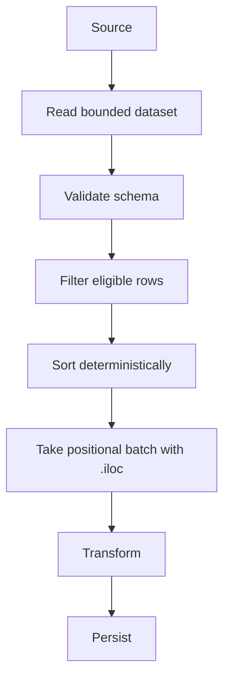

# 04- Iloc

## Overview

`.iloc` is Pandas' **integer-position-based indexing interface**. It selects rows and columns according to their zero-based positions rather than their labels.

The core syntax is:

```python
df.iloc[row_selector, column_selector]
```

For example:

```python
first_batch = orders.iloc[:100]
```

means:

```text
Select rows at positions 0 through 99.
```

It does not mean:

```text
Select rows whose index labels are 0 through 99.
```

That distinction is the central concept behind `.iloc`.

In production systems, `.iloc` is useful when position is genuinely part of the requirement:

```text
First N records in an in-memory batch
A fixed positional slice
A known matrix-like region
Positional sampling
Selecting rows or columns by integer offsets
```

It should not be used merely because the current DataFrame happens to have a default index.

## What `.iloc` Is

`.iloc` is a Pandas indexer for **integer-location selection**.

The canonical form is:

```python
df.iloc[row_position, column_position]
```

The selectors can be:

- A single integer
- A list of integers
- A slice
- A boolean array-like selector
- `:`

Examples:

```python
df.iloc[0]
```

```python
df.iloc[[0, 2, 4]]
```

```python
df.iloc[:100]
```

```python
df.iloc[:, 0]
```

```python
df.iloc[:100, :5]
```

The returned object depends on the selection:

| Selection | Typical result |
|---|---|
| Single row position | `Series` |
| Multiple row positions | `DataFrame` |
| Single row + single column | Scalar |
| Rows + single column | `Series` |
| Rows + multiple columns | `DataFrame` |

## Why `.iloc` Exists

Pandas DataFrames have two different dimensions of identity:

```text
Label
Position
```

Labels come from:

```text
Index
Column names
```

Positions come from:

```text
0
1
2
3
...
```

`.iloc` exists to make positional selection explicit.

This is useful when the requirement is about layout rather than identity.

For example:

```python
first_100 = df.iloc[:100]
```

is a positional requirement.

By contrast:

```python
orders.loc[
    orders["status"].eq("completed")
]
```

is a semantic requirement.

## `.iloc` vs `.loc`

The distinction should be explicit:

| Property | `.iloc` | `.loc` |
|---|---|---|
| Selection model | Integer positions | Labels |
| Row by position | Yes | No |
| Row by label | No | Yes |
| Column by position | Yes | No |
| Column by label | No | Yes |
| Boolean filtering | Yes | Yes |
| Label slicing | No | Yes |
| Conditional assignment | Yes | Yes |
| Typical business-rule selection | Rarely | Usually |
| Typical structural selection | Often | Sometimes |

Example:

```python
df.loc[5]
```

means:

```text
Find index label 5.
```

While:

```python
df.iloc[5]
```

means:

```text
Find the sixth row.
```

They may return the same row only when the current index happens to align with positions.

## Zero-Based Positioning

`.iloc` uses standard Python zero-based indexing.

Given:

```python
orders = pd.DataFrame(
    {
        "order_id": [
            "ORD-1001",
            "ORD-1002",
            "ORD-1003",
        ],
        "amount": [
            1250.0,
            450.0,
            3200.0,
        ],
    }
)
```

the positions are:

```text
Position 0 → ORD-1001
Position 1 → ORD-1002
Position 2 → ORD-1003
```

Therefore:

```python
orders.iloc[0]
```

returns the first row.

```python
orders.iloc[2]
```

returns the third row.

## Selecting a Single Row

```python
first_order = orders.iloc[0]
```

A single integer row selection normally returns a `Series`.

You can inspect its type:

```python
type(first_order)
```

Typical result:

```text
pandas.Series
```

If downstream code requires a DataFrame rather than a Series, use a one-element list:

```python
first_order = orders.iloc[[0]]
```

This is an important distinction.

```text
.iloc[0]
    → Series

.iloc[[0]]
    → DataFrame
```

## Selecting Multiple Rows

Use a list of positions:

```python
selected = orders.iloc[
    [0, 2]
]
```

This returns a DataFrame containing the rows at positions `0` and `2`.

The original index labels are preserved.

For example, if:

```text
Index  order_id
101    ORD-1001
205    ORD-1002
309    ORD-1003
```

then:

```python
selected = orders.iloc[[0, 2]]
```

returns rows with labels:

```text
101
309
```

The selection was positional, but the resulting DataFrame still retains its original index labels.

## Selecting a Row Range

Python-style slicing is one of the most common `.iloc` patterns:

```python
batch = orders.iloc[:100]
```

This selects positions:

```text
0 through 99
```

The stop position is exclusive, matching normal Python slicing.

For example:

```python
orders.iloc[10:20]
```

selects ten rows:

```text
10
11
12
13
14
15
16
17
18
19
```

## Negative Positions

Negative positions can be used to count from the end.

```python
last_order = orders.iloc[-1]
```

The final row is position `-1`.

Similarly:

```python
last_five = orders.iloc[-5:]
```

selects the final five rows.

This is useful for structural operations such as:

```text
Inspecting the tail of an in-memory dataset
Selecting the last batch
Selecting trailing records from an already ordered DataFrame
```

Be careful not to interpret the last rows as "most recent" unless the DataFrame has an explicitly established ordering.

## Selecting a Single Column by Position

Use:

```python
amounts = orders.iloc[:, 2]
```

if the third column is known to be the desired column.

The syntax:

```python
df.iloc[:, column_position]
```

means:

```text
All rows
+
Column at this position
```

However, named column access is generally preferable when the requirement is semantic:

```python
orders["amount"]
```

or:

```python
orders.loc[:, "amount"]
```

Position-based column access becomes fragile when schemas evolve.

## Selecting Multiple Columns by Position

```python
selected = orders.iloc[
    :,
    [0, 2],
]
```

This selects:

```text
All rows
+
Columns at positions 0 and 2
```

This can be useful for:

```text
Fixed-format data
Matrix-like processing
Generic positional utilities
Known schema layouts
```

It should not replace named selection in business-critical pipelines when the column names are meaningful.

## Selecting Rows and Columns Together

The full `.iloc` form is:

```python
df.iloc[
    row_selector,
    column_selector,
]
```

Example:

```python
sample = orders.iloc[
    :100,
    [0, 2, 3],
]
```

This means:

```text
Rows:
    positions 0–99

Columns:
    positions 0, 2, 3
```

This is useful for structurally defined slices.

## Selecting a Single Scalar

When both row and column positions are integers:

```python
amount = orders.iloc[2, 1]
```

This selects the scalar at:

```text
Row position:    2
Column position: 1
```

It is equivalent conceptually to:

```text
Third row
+
Second column
```

For repeated scalar access, `.iat` is the specialized positional scalar accessor:

```python
amount = orders.iat[2, 1]
```

Use `.iat` when scalar access itself is the requirement.

## `.iloc` and `.iat`

Both use integer positions.

| Operation | `.iloc` | `.iat` |
|---|---|---|
| Positional row selection | Yes | No |
| Positional column selection | Yes | No |
| Scalar access | Yes | Yes |
| Scalar assignment | Yes | Yes |
| Multiple rows | Yes | No |
| Multiple columns | Yes | No |
| Best for | General positional indexing | Single-cell access |

For example:

```python
value = df.iloc[10, 4]
```

works, but:

```python
value = df.iat[10, 4]
```

better communicates that exactly one scalar is required.

## Boolean Selection with `.iloc`

`.iloc` can also accept a boolean array-like selector.

For example:

```python
mask = [True, False, True, False]

selected = df.iloc[mask]
```

This is positional boolean selection because the boolean values correspond to positions.

The important distinction is:

```text
Boolean mask built as a standalone positional sequence
    ↓
Position-based selection
```

versus:

```python
mask = df["status"].eq("completed")

df.loc[mask]
```

where the Series carries the DataFrame's index.

For normal DataFrame filtering, `.loc` with a boolean Series is generally clearer because it expresses the relationship between the condition and indexed rows.

## `.iloc` with Boolean Series

Be careful when supplying a boolean `Series` to `.iloc`.

`.iloc` is positional, not label-oriented. A boolean selector used with `.iloc` must be appropriate for positional selection rather than relying on label alignment.

For ordinary filtering:

```python
df.loc[
    df["status"].eq("completed")
]
```

is the preferred semantic form.

The broader rule is:

```text
Condition based on DataFrame data
    → prefer .loc

Selection based on integer position
    → prefer .iloc
```

## Position-Based Slicing

`.iloc` follows Python slice semantics.

```python
df.iloc[start:stop:step]
```

Examples:

```python
df.iloc[::2]
```

selects every second row.

```python
df.iloc[1::2]
```

selects rows at odd positions.

```python
df.iloc[10:100:5]
```

selects:

```text
10
15
20
25
...
95
```

This is useful for structural sampling and deterministic positional processing.

## Row and Column Slices

Both dimensions support slices.

```python
subset = df.iloc[
    100:200,
    2:6,
]
```

This means:

```text
Rows:
    positions 100–199

Columns:
    positions 2–5
```

This can be useful when interacting with matrix-like data or fixed schemas.

For business pipelines, named columns are generally safer:

```python
subset = df.loc[
    :,
    [
        "customer_id",
        "amount",
        "status",
    ],
]
```

## Out-of-Bounds Behavior

Single integer positions must refer to existing positions.

For example:

```python
df.iloc[100]
```

raises an indexing error if the DataFrame does not have a row at position `100`.

Similarly:

```python
df.iloc[:, 10]
```

fails if column position `10` does not exist.

This is useful because it prevents silently selecting an unintended location.

### Slices Behave Differently

Positional slices are more forgiving:

```python
df.iloc[100:200]
```

can return the available rows even when the DataFrame contains fewer than 200 positions.

This follows normal Python slicing behavior.

Do not rely on this distinction accidentally. If a minimum row count is required, validate it explicitly.

## Missing Values and `.iloc`

`.iloc` does not itself interpret missing values as a filtering rule.

For example:

```python
df.iloc[:100]
```

selects the first 100 positions regardless of whether values inside those rows are missing.

Missing-value logic should normally be performed with a boolean condition:

```python
valid = df.loc[
    df["customer_id"].notna()
]
```

Then use `.iloc` only if a positional operation is still required:

```python
sample = (
    df.loc[
        df["customer_id"].notna()
    ]
    .iloc[:100]
)
```

This expresses:

```text
Filter valid records
↓
Take first 100 positions from the valid set
```

## Positional Selection After Filtering

This combination is often useful:

```python
batch = (
    orders.loc[
        orders["status"].eq("pending")
    ]
    .iloc[:100]
)
```

The semantics are:

```text
1. Select rows whose status is pending.
2. Take the first 100 rows from that resulting DataFrame.
```

This is different from:

```python
orders.iloc[:100].loc[
    orders["status"].eq("pending")
]
```

The latter means:

```text
1. Take the first 100 source rows.
2. Filter those rows.
```

These operations can produce different results.

## Deterministic Batching

A common production use case is batch processing.

A naive implementation:

```python
batch = orders.iloc[:1000]
```

only means:

```text
First 1000 current positions.
```

It does not necessarily mean:

```text
Oldest 1000 orders
Highest priority 1000 orders
Unprocessed 1000 orders
```

For deterministic business batching:

```python
batch = (
    orders.loc[
        orders["processing_status"].eq("pending")
    ]
    .sort_values(
        [
            "priority",
            "created_at",
        ],
        ascending=[
            True,
            True,
        ],
        kind="stable",
    )
    .iloc[:1000]
)
```

Now the selection semantics are explicit:

```text
Filter eligible records
        ↓
Establish deterministic order
        ↓
Take first 1000 positions
```

For large systems, this logic is often better performed in PostgreSQL using `ORDER BY` and `LIMIT`, especially when only a small batch should be transferred into Pandas.

## Pagination in Pandas

`.iloc` can implement simple pagination over an already materialized DataFrame:

```python
page_size = 100
page_number = 3

start = (
    page_number
    * page_size
)

end = start + page_size

page = df.iloc[
    start:end
]
```

For page number `3`, this selects:

```text
Positions 300–399
```

This is appropriate only when:

```text
The complete DataFrame is already in memory
The dataset is bounded
Positional paging is acceptable
```

It should not be confused with database pagination for very large datasets.

## Database Pagination vs Pandas `.iloc`

For PostgreSQL:

```text
Database
    ↓
ORDER BY
    ↓
LIMIT / OFFSET
    ↓
Network
    ↓
Pandas
```

is generally preferable to:

```text
Database
    ↓
Load entire table
    ↓
Pandas
    ↓
.iloc pagination
```

For large datasets, materializing everything first increases:

```text
Database load
Network transfer
Application memory
Processing latency
```

Keyset pagination can be even more appropriate than large `OFFSET` values:

```sql
SELECT
    order_id,
    created_at,
    amount
FROM orders
WHERE created_at > %(last_created_at)s
ORDER BY created_at, order_id
LIMIT %(page_size)s;
```

`.iloc` remains useful after the data has been bounded.

## `.iloc` in ETL Pipelines

A typical bounded ETL flow might be:



Example:

```python
batch = (
    records.loc[
        records["status"].eq("ready")
    ]
    .sort_values(
        "created_at",
        kind="stable",
    )
    .iloc[:5000]
)
```

This is useful when a single in-memory DataFrame needs to be divided into deterministic processing units.

## Chunk Processing

`.iloc` can also be used to divide a materialized DataFrame into positional batches.

```python
batch_size = 10_000

for start in range(
    0,
    len(df),
    batch_size,
):
    batch = df.iloc[
        start:start + batch_size
    ]

    process(batch)
```

This pattern is straightforward but only works after the entire DataFrame is already in memory.

For a large CSV, prefer chunked ingestion:

```python
for chunk in pd.read_csv(
    "orders.csv",
    chunksize=100_000,
):
    process(chunk)
```

Do not use `.iloc` as a substitute for `read_csv(..., chunksize=...)`.

The distinction is:

```text
.iloc batching
    → dataset already materialized

chunksize
    → input is materialized incrementally
```

## Selecting the First and Last Records

First rows:

```python
head = df.iloc[:10]
```

Last rows:

```python
tail = df.iloc[-10:]
```

The convenience methods are often clearer:

```python
head = df.head(10)
tail = df.tail(10)
```

Use `.iloc` when positional semantics are part of a larger indexing expression.

Prefer `head()` and `tail()` when they communicate the intent more directly.

## Selecting Every Nth Row

For positional sampling:

```python
sample = df.iloc[::10]
```

This returns every tenth row based on current position.

This can be useful for:

```text
Quick diagnostics
Visual inspection
Bounded exploratory sampling
```

It should not be treated as statistically representative sampling.

For analytical sampling requirements, use a method appropriate to the statistical objective rather than assuming every Nth record is representative.

## Selecting Positional Windows

You can create helper functions around `.iloc` when positional semantics are a domain-specific operation.

```python
import pandas as pd


def select_window(
    df: pd.DataFrame,
    start: int,
    size: int,
) -> pd.DataFrame:
    if start < 0:
        raise ValueError(
            "start must be non-negative"
        )

    if size < 0:
        raise ValueError(
            "size must be non-negative"
        )

    end = start + size

    return df.iloc[start:end]
```

This keeps positional behavior explicit and testable.

## Column Position Fragility

Positional column selection is more fragile than named selection when schemas evolve.

Suppose today:

```text
0 → order_id
1 → customer_id
2 → status
3 → amount
```

Then:

```python
df.iloc[:, 3]
```

means `amount`.

After a schema change:

```text
0 → order_id
1 → customer_id
2 → currency
3 → status
4 → amount
```

the exact same code now selects `status`.

This is a serious production risk.

For stable business logic, prefer:

```python
df["amount"]
```

or:

```python
df.loc[:, "amount"]
```

Use `.iloc` for columns only when positional structure is genuinely part of the contract.

## Schema Evolution

Positional logic is especially sensitive to:

```text
CSV column reordering
API field restructuring
Parquet schema evolution
Database query changes
Additional columns
Removed columns
```

If positional selection is intentional, protect it with schema validation.

For example:

```python
expected_columns = [
    "order_id",
    "customer_id",
    "status",
    "amount",
]

if df.columns.tolist() != expected_columns:
    raise ValueError(
        "Unexpected input schema."
    )
```

Only after validating the schema is positional selection predictable.

In many cases, named selection remains the better design.

## `.iloc` and Index Labels

`.iloc` ignores the meaning of the index labels.

Consider:

```python
df = pd.DataFrame(
    {
        "order_id": [
            "ORD-1001",
            "ORD-1002",
            "ORD-1003",
        ],
    },
    index=[101, 205, 309],
)
```

Then:

```python
df.iloc[1]
```

selects:

```text
Index label 205
```

because it is the second row.

The index label itself has no effect on the positional selector.

That is the defining behavior of `.iloc`.

## Sorting Changes Positional Meaning

Positions refer to the current ordering.

```python
first = df.iloc[0]
```

After:

```python
df = df.sort_values(
    "amount",
    ascending=False,
)
```

the row at position `0` may be completely different.

This means positional selection is state-dependent:

```text
DataFrame state
    ↓
Current row order
    ↓
Position
    ↓
.iloc selection
```

If position represents a business priority, establish the ordering explicitly before selecting positions.

## Resetting the Index

A common operation after filtering is:

```python
filtered = (
    df.loc[
        df["status"].eq("completed")
    ]
    .reset_index(drop=True)
)
```

After this:

```text
Position 0 → index label 0
Position 1 → index label 1
...
```

This can make later positional operations easier to reason about.

However, resetting the index is not required for `.iloc`.

This:

```python
filtered.iloc[0]
```

works regardless of whether the index is:

```text
0, 1, 2
```

or:

```text
101, 205, 309
```

Do not reset indexes solely to make `.iloc` work.

## Copy Semantics

A positional selection returns a DataFrame or Series that should not be treated as proof of independent ownership for later mutations.

When a separate working object is required:

```python
batch = df.iloc[
    :1000
].copy()
```

Then:

```python
batch["processed"] = True
```

This makes ownership explicit.

Avoid indiscriminately copying every positional selection:

```python
batch = df.iloc[:1000].copy()
```

Use `.copy()` when the downstream code needs independence.

For large DataFrames, unnecessary copies increase:

```text
Peak memory
CPU
Garbage-collection pressure
Pipeline latency
```

## Empty DataFrames

`.iloc` works on empty DataFrames:

```python
empty = df.iloc[:0]
```

This is often useful when a pipeline needs an empty DataFrame with the same schema.

For example:

```python
empty_batch = df.iloc[:0].copy()
```

The result has:

```text
Zero rows
Same columns
Existing dtypes
```

This can be useful for:

```text
Initializing batch outputs
Representing valid empty results
Constructing schema-compatible outputs
```

Do not confuse an empty result with a failed selection.

## Performance Considerations

`.iloc` is generally appropriate for direct positional selection, but the important performance issue is usually the size of the DataFrame being indexed.

This:

```python
batch = df.iloc[:1000]
```

is cheap relative to scanning and transforming millions of rows, but `.iloc` cannot make an oversized input disappear from memory.

For large workloads:

```text
Reduce data before materialization
```

through:

```text
SQL predicates
API filters
Column projection
Parquet filtering
Chunked ingestion
Partition-aware reads
```

### Avoid Python Row Loops

Avoid:

```python
rows = []

for i in range(len(df)):
    row = df.iloc[i]

    if row["status"] == "completed":
        rows.append(row)
```

This repeatedly performs positional row access and introduces Python-level looping.

Prefer vectorized selection:

```python
completed = df.loc[
    df["status"].eq("completed")
]
```

If a positional batch is also required:

```python
completed_batch = (
    df.loc[
        df["status"].eq("completed")
    ]
    .iloc[:1000]
)
```

## Memory Considerations

Consider a workflow processing a very large DataFrame:

```python
for start in range(
    0,
    len(df),
    100_000,
):
    batch = df.iloc[
        start:start + 100_000
    ]

    process(batch)
```

This is useful for logical batching, but the full `df` remains in memory.

For genuinely memory-constrained workloads:

```python
for chunk in pd.read_parquet(...):
    ...
```

may be unavailable or structured differently depending on the engine, while CSV supports direct chunked reads through `chunksize`.

The key distinction is:

```text
Partitioning a DataFrame
≠
Streaming data from the source
```

`.iloc` solves the first problem, not the second.

## Backend Service Considerations

Pandas is typically used inside bounded backend jobs rather than request handlers that may receive arbitrarily large datasets.

A safer architecture is:

```text
API request
    ↓
Create bounded job
    ↓
Celery / worker
    ↓
Read bounded dataset
    ↓
Filter
    ↓
Positionally batch with .iloc
    ↓
Process
    ↓
Persist results
```

Avoid doing large `.iloc`-based processing directly inside a synchronous FastAPI or Django request if the dataset can grow significantly.

This helps control:

```text
Request latency
Worker memory
Timeout risk
Horizontal scaling
```

## Kubernetes and Containerized Jobs

In a Kubernetes workload, a Pandas process is limited by its container memory.

For example:

```text
CSV / Parquet
    ↓
Pod
    ↓
Pandas DataFrame
    ↓
.iloc batch
```

`.iloc` batching does not guarantee bounded process memory because the full DataFrame may already exist.

Container resource limits should therefore be designed around:

```text
Input size
DataFrame width
Dtypes
Intermediate objects
Copies
Peak batch size
Aggregation state
```

A common operational failure is:

```text
Large dataset
+
Full DataFrame materialization
+
Multiple copies
=
OOMKilled pod
```

The solution is not simply choosing `.iloc`; the pipeline must reduce memory before materialization.

## AWS Considerations

In an AWS data workflow:

```text
S3
 ↓
Read bounded object / partition
 ↓
Pandas
 ↓
.iloc positional batching
 ↓
Write processed output
```

For large datasets, prefer:

```text
Partitioned Parquet
Predicate pushdown where supported
Column projection
Incremental processing
```

over downloading a large unfiltered object and then using `.iloc`.

For workloads that exceed the practical memory limits of a single Pandas process, use an architecture appropriate to the scale rather than forcing Pandas to act as a distributed processing engine.

## Reliability Considerations

Positional operations are deterministic only relative to deterministic input order.

If a pipeline depends on:

```python
df.iloc[:1000]
```

then the upstream process must define:

```text
Which ordering is expected?
Is ordering stable?
Can records arrive in a different order?
Can the source reorder records?
```

For robust batch processing:

```python
batch = (
    df
    .sort_values(
        [
            "created_at",
            "order_id",
        ],
        kind="stable",
    )
    .iloc[:1000]
)
```

The secondary key is useful when the primary timestamp is not unique.

For distributed or retryable jobs, prefer a stable business ordering and explicit checkpointing over implicit positional assumptions.

## Security Considerations

`.iloc` does not provide authorization.

This is unsafe as a conceptual security boundary:

```python
user_rows = df.iloc[:100]
```

The first 100 rows do not inherently correspond to the current user or tenant.

Authorization should be based on explicit business predicates:

```python
user_rows = df.loc[
    df["tenant_id"].eq(
        authenticated_tenant_id
    )
]
```

Then positional selection can be applied within the authorized subset if required:

```python
page = user_rows.iloc[:100]
```

The correct security model is:

```text
Authorization
    ↓
Semantic filtering
    ↓
Optional positional batching
```

not:

```text
Positional assumption
    ↓
Authorization
```

## Testing `.iloc` Logic

Tests should verify positional semantics explicitly.

```python
def test_first_batch_is_positional(
    orders: pd.DataFrame,
) -> None:
    batch = orders.iloc[:2]

    assert batch["order_id"].tolist() == [
        "ORD-1001",
        "ORD-1002",
    ]
```

Test index preservation when it matters:

```python
def test_iloc_preserves_original_index() -> None:
    orders = pd.DataFrame(
        {
            "order_id": [
                "ORD-1",
                "ORD-2",
                "ORD-3",
            ],
        },
        index=[101, 205, 309],
    )

    result = orders.iloc[[0, 2]]

    assert result.index.tolist() == [
        101,
        309,
    ]
```

Test boundaries:

```text
First row
Last row
Empty slice
Single-row slice
Exact batch boundary
Oversized slice
Negative indexing
Column-position changes
```

For production batchers, also test deterministic ordering before positional slicing.

## Common Mistakes

### Treating `.iloc` as Label-Based

Incorrect assumption:

```python
df.iloc[101]
```

means:

```text
index label 101
```

It actually means:

```text
row position 101
```

Use:

```python
df.loc[101]
```

for label `101`.

### Using `.iloc` for Business Identifiers

This is fragile:

```python
customer = df.iloc[100]
```

if the actual requirement is:

```text
customer_id == "C-1001"
```

Use semantic filtering or label-based access instead.

### Using Column Positions in Evolving Schemas

Avoid:

```python
amount = df.iloc[:, 4]
```

when the schema can change.

Prefer:

```python
amount = df["amount"]
```

### Assuming `iloc[:100]` Means Latest 100

It means:

```text
First 100 current positions.
```

Establish ordering first:

```python
latest = (
    df
    .sort_values(
        "created_at",
        ascending=False,
    )
    .iloc[:100]
)
```

### Using `.iloc` as a Replacement for Chunked Reading

This:

```python
for start in range(0, len(df), 100_000):
    batch = df.iloc[
        start:start + 100_000
    ]
```

does not reduce memory required to load `df`.

For large files, use source-level chunking when supported.

### Using Python Loops for Individual Row Access

Avoid:

```python
for i in range(len(df)):
    row = df.iloc[i]
    process(row)
```

Prefer vectorized operations or batch-oriented processing.

### Assuming Order Is Stable

Positions change when the DataFrame is:

```text
Sorted
Merged
Filtered
Concatenated
Reindexed
Reordered
```

If a positional batch has business meaning, establish deterministic ordering immediately before selecting positions.

### Unnecessary `.copy()`

Copying every `.iloc` result can increase memory consumption.

Use `.copy()` when an independently owned object is required.

## Production Pitfalls

| Pitfall | Why it happens | Better approach |
|---|---|---|
| Position used as business identity | Default index makes positions look meaningful | Use explicit identifiers |
| `iloc[:N]` assumed to mean latest records | Current row order is mistaken for semantic order | Sort explicitly first |
| Positional column selection | Schema assumed to be permanently fixed | Select by column name |
| Full DataFrame loaded before batching | `.iloc` is mistaken for streaming | Use source-level chunking or push filters upstream |
| Repeated `.iloc[i]` loops | DataFrame treated like a Python list | Prefer vectorized or batch operations |
| Positional pagination over huge datasets | In-memory pagination confused with database pagination | Use database-side pagination |
| Missing schema validation | Column positions silently change | Validate schema before positional logic |
| Authorization based on positions | Position mistaken for tenant ownership | Filter by explicit authorization fields |
| Unstable input ordering | Batch membership changes across runs | Establish stable ordering |
| Excessive copies | Every subset copied defensively | Copy only when independent ownership is required |

## Interview Traps

### What Is the Difference Between `.loc` and `.iloc`?

`.loc` is label-based; `.iloc` is integer-position-based.

```python
df.loc[10]
```

means index label `10`, while:

```python
df.iloc[10]
```

means the eleventh row.

### Is `.iloc[:10]` Inclusive of Position 10?

No.

It follows Python slicing semantics:

```text
0 through 9
```

Position `10` is excluded.

### Does `.iloc` Use the DataFrame Index?

It operates independently of index labels. It selects by current row and column positions.

The existing index labels are preserved in the result unless explicitly changed.

### What Happens to Index Labels After `.iloc`?

They remain the original labels.

For example:

```python
df.iloc[[0, 2]]
```

does not automatically renumber the result to:

```text
0
1
```

The existing labels remain.

### When Should You Use `.iat` Instead of `.iloc`?

Use `.iat` when exactly one scalar cell is required by integer position:

```python
value = df.iat[row_position, column_position]
```

### Is `.iloc` Better Than `.loc`?

Neither is universally better.

Use:

```text
.iloc → positional requirement
.loc  → semantic / label-based requirement
```

### Why Is `.iloc` Risky for Column Selection?

Column positions can change when schemas evolve. A position that refers to `amount` today could refer to `status` tomorrow.

### How Do You Get the Last 100 Rows?

```python
df.iloc[-100:]
```

or, more readably:

```python
df.tail(100)
```

### How Do You Get Every Tenth Row?

```python
df.iloc[::10]
```

This is positional sampling, not necessarily statistically representative sampling.

### How Do You Batch an Already Materialized DataFrame?

```python
for start in range(
    0,
    len(df),
    batch_size,
):
    batch = df.iloc[
        start:start + batch_size
    ]

    process(batch)
```

### Does `.iloc` Reduce Memory Usage?

Not by itself.

It can limit the working subset passed to subsequent operations, but the original DataFrame still occupies memory.

For true memory reduction, control how much data is materialized in the first place.

### Is `.iloc` Appropriate for Database Pagination?

Only after data is already bounded in memory.

For large datasets, use database-side pagination or chunked extraction instead of loading the full dataset and paginating with `.iloc`.

## Practical Reference

| Requirement | Recommended pattern |
|---|---|
| First row | `df.iloc[0]` |
| First row as DataFrame | `df.iloc[[0]]` |
| First N rows | `df.iloc[:n]` |
| Last N rows | `df.iloc[-n:]` |
| Rows by positions | `df.iloc[[0, 5, 10]]` |
| Row range | `df.iloc[10:20]` |
| Every Nth row | `df.iloc[::n]` |
| Column by position | `df.iloc[:, position]` |
| Multiple columns by position | `df.iloc[:, [0, 2, 4]]` |
| Rectangular positional slice | `df.iloc[rows, columns]` |
| Single scalar | `df.iloc[row, column]` |
| Single scalar, specialized | `df.iat[row, column]` |
| Conditional filtering | Prefer `df.loc[mask]` |
| Semantic column selection | Prefer `df["column"]` |
| Positional batch | `df.iloc[start:end]` |
| Deterministic business batch | `df.sort_values(...).iloc[:batch_size]` |
| Large-file incremental processing | Source-level chunking |

## Recommended Engineering Pattern

A strong production pattern is to separate semantic selection from positional batching:

```python
eligible = orders.loc[
    orders["processing_status"].eq("pending")
    & orders["customer_id"].notna(),
]

ordered = eligible.sort_values(
    [
        "priority",
        "created_at",
        "order_id",
    ],
    ascending=[
        True,
        True,
        True,
    ],
    kind="stable",
)

batch = ordered.iloc[
    :1000
]
```

Each operation has a distinct responsibility:

```text
.loc
    → Which records are eligible?

.sort_values()
    → In what deterministic order should they be processed?

.iloc
    → How many positions belong to this batch?
```

This separation is easier to test, reason about, and operate than hiding the entire workflow inside one positional expression.

## Key Takeaways

- `.iloc` is strictly **position-based**: rows and columns are selected using zero-based integer positions, independent of index labels.
- Use `.iloc` when position is genuinely part of the requirement, and prefer `.loc` or named column access when the requirement is semantic or business-driven.
- Positional selection depends on current DataFrame ordering, so deterministic batch processing requires explicit sorting before `.iloc[:N]`.
- `.iloc` batches an already materialized DataFrame; it does not provide streaming or true memory-bounded ingestion, so large workloads should reduce data before materialization or use chunked/source-side processing.
- Positional column selection is fragile under schema evolution, while positional authorization is unsafe; validate schemas and enforce security using explicit business fields before applying positional operations.